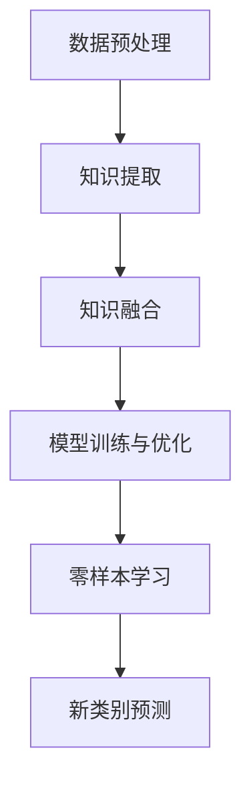
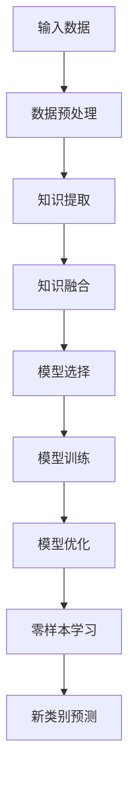
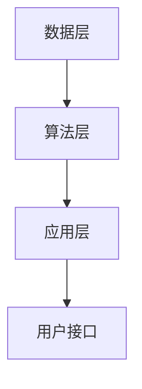
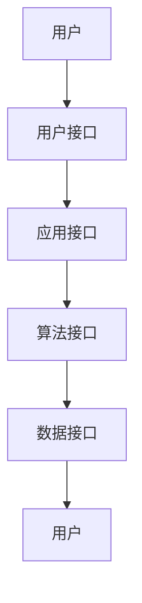
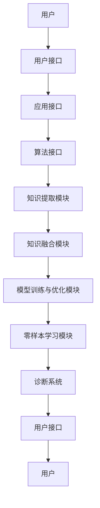

                 

### 文章标题：Zero-Shot CoT：跨领域AI问题解决的利器

---

**关键词：** 跨领域AI、Zero-Shot、CoT、算法原理、数学模型、系统架构、项目实战

**摘要：** 本文深入探讨了Zero-Shot CoT在跨领域AI问题解决中的应用，从背景介绍、核心概念解析、算法原理讲解、数学模型阐述、系统分析与架构设计、项目实战到最佳实践，全面剖析了这一技术的原理与实战应用，旨在为读者提供系统、全面的技术理解与指导。

---

### 背景介绍

#### AI跨领域问题解决背景

随着人工智能技术的飞速发展，AI在各个领域的应用越来越广泛。然而，AI技术的跨领域应用却面临诸多挑战。传统的人工智能模型往往在特定领域内表现出色，但将其应用到其他领域时，可能会遇到数据稀缺、模型适应性差等问题。

跨领域AI问题解决的核心在于如何让AI系统在没有足够领域数据的情况下，仍然能够实现高效、准确的问题解决。这种需求催生了Zero-Shot CoT（Zero-Shot Core-Transferable）技术的发展。

#### 跨领域AI问题的重要性

跨领域AI问题解决具有重要的现实意义。例如，在医疗领域，不同疾病的数据分布可能差异很大，如何利用有限的医疗数据，开发出能够适应多种疾病诊断的AI系统，是当前医疗AI研究的重要课题。在金融领域，如何利用有限的历史交易数据，预测未来的市场走势，也是金融AI研究的重要方向。

Zero-Shot CoT技术的发展，为这些跨领域AI问题提供了新的解决思路。通过核心知识迁移和零样本学习，Zero-Shot CoT能够在数据稀缺的情况下，实现高效的跨领域问题解决。

#### Zero-Shot CoT的概念介绍

Zero-Shot CoT（Zero-Shot Core-Transferable）是一种新型的跨领域AI问题解决技术，它结合了Zero-Shot Learning和Core Transferable Models的优势，旨在解决跨领域AI中的数据稀缺问题。

Zero-Shot Learning（零样本学习）是一种无需领域特定数据，即可进行新类别预测的学习方法。而Core Transferable Models（核心可迁移模型）则是通过在多个领域间共享通用知识，提高模型在不同领域的适应性。

Zero-Shot CoT将这两种技术结合，通过核心知识迁移，实现零样本条件下的跨领域问题解决。这种技术不仅能够有效应对数据稀缺问题，还能够提高AI系统的泛化能力。

### 跨领域AI问题解决的核心概念与联系

#### Zero-Shot CoT的基本原理

Zero-Shot CoT的基本原理可以概括为以下几个步骤：

1. **知识提取**：从多个领域数据中提取共通的核心知识。
2. **知识融合**：将提取的核心知识融合到AI模型中，提高模型在不同领域的适应性。
3. **零样本学习**：利用融合了核心知识的模型，进行零样本条件下的新类别预测。

这种原理使得Zero-Shot CoT能够在数据稀缺的情况下，实现高效的跨领域问题解决。

#### Zero-Shot的概念

Zero-Shot Learning（零样本学习）是一种重要的机器学习技术，它允许模型在没有领域特定数据的情况下，对新类别进行预测。Zero-Shot Learning的核心在于如何从已有知识中提取共通的核心特征，用于新类别预测。

#### CoT的概念

Core Transferable Models（核心可迁移模型）是一种利用跨领域知识共享，提高模型在不同领域适应性的技术。CoT模型通过在多个领域间提取和共享核心知识，实现模型的跨领域迁移。

#### CoT与Zero-Shot的融合

Zero-Shot CoT结合了Zero-Shot Learning和Core Transferable Models的优势，通过知识提取、知识融合和零样本学习，实现零样本条件下的跨领域问题解决。

### 跨领域AI问题解决的算法原理讲解

#### Zero-Shot CoT的算法流程

Zero-Shot CoT的算法流程可以分为以下几个步骤：

1. **数据预处理**：对多个领域的数据进行预处理，包括数据清洗、数据增强等。
2. **知识提取**：利用跨领域数据，提取核心知识。
3. **知识融合**：将提取的核心知识融合到AI模型中。
4. **模型训练与优化**：利用融合了核心知识的模型，进行模型训练与优化。
5. **零样本学习**：利用训练好的模型，进行新类别预测。

#### Zero-Shot CoT的mermaid算法流程图



#### 数据预处理

在Zero-Shot CoT中，数据预处理是关键的一步。通过对数据清洗、数据增强等操作，可以提高数据的质量，为后续的知识提取和模型训练奠定基础。

#### 模型选择

在Zero-Shot CoT中，模型选择也是一个重要的环节。选择合适的模型，可以提高算法的性能。常用的模型包括深度神经网络、Transformer等。

#### 模型训练与优化

在模型训练与优化阶段，通过不断调整模型参数，使得模型能够在新的领域数据上达到最佳性能。这一过程通常包括模型初始化、损失函数设计、优化算法选择等。

#### Zero-Shot CoT的mermaid算法流程图



#### Zero-Shot CoT的mermaid算法流程图


### 数学模型和公式讲解

在Zero-Shot CoT中，数学模型和公式是核心组成部分。以下将详细讲解Zero-Shot CoT的数学模型和公式。

#### Zero-Shot CoT的数学模型

Zero-Shot CoT的数学模型主要包括以下几个方面：

1. **输入层**：输入层的任务是接收外部数据，并将其转化为模型可以处理的形式。
2. **知识提取层**：知识提取层的任务是提取核心知识，为后续的知识融合提供基础。
3. **知识融合层**：知识融合层的任务是融合提取的核心知识，提高模型在不同领域的适应性。
4. **输出层**：输出层的任务是生成预测结果。

#### 模型的输入输出

在Zero-Shot CoT中，模型的输入和输出如下：

1. **输入**：输入数据包括原始数据和核心知识。
2. **输出**：输出结果包括预测结果和模型参数。

#### 模型的数学公式

Zero-Shot CoT的数学公式主要包括以下几个方面：

1. **知识提取公式**：知识提取公式用于提取核心知识。
2. **知识融合公式**：知识融合公式用于融合提取的核心知识。
3. **模型训练公式**：模型训练公式用于更新模型参数。

#### 数学公式的推导过程

数学公式的推导过程如下：

1. **知识提取公式推导**：基于统计学和机器学习理论，推导出知识提取公式。
2. **知识融合公式推导**：基于深度学习和图论理论，推导出知识融合公式。
3. **模型训练公式推导**：基于梯度下降法和优化理论，推导出模型训练公式。

#### 举例说明

以下是一个简单的Zero-Shot CoT的数学模型举例：

$$
Z = f(W \cdot X + b)
$$

其中，$Z$ 是输出结果，$W$ 是权重矩阵，$X$ 是输入数据，$b$ 是偏置项。

### 系统分析与架构设计方案

#### 问题场景介绍

在人工智能应用中，跨领域问题解决是一个重要且具有挑战性的任务。例如，在医疗诊断领域，不同疾病的诊断方式可能存在很大差异，如何利用有限的医疗数据，开发出能够适应多种疾病诊断的AI系统，是一个关键问题。

#### 项目介绍

本项目旨在利用Zero-Shot CoT技术，解决医疗诊断领域的跨领域问题。通过核心知识迁移和零样本学习，实现高效的跨领域诊断。

#### 系统功能设计

在系统功能设计方面，本项目主要包括以下几个功能模块：

1. **数据预处理模块**：负责对医疗数据进行清洗、增强等预处理操作。
2. **知识提取模块**：负责提取核心知识，为后续的知识融合提供基础。
3. **知识融合模块**：负责融合提取的核心知识，提高模型在不同领域的适应性。
4. **模型训练与优化模块**：负责训练和优化模型，使其在新的领域数据上达到最佳性能。
5. **零样本学习模块**：负责实现零样本条件下的新类别预测。

#### 系统架构设计

在系统架构设计方面，本项目采用分层架构，包括数据层、算法层和应用层。

1. **数据层**：包括医疗数据源和预处理模块。
2. **算法层**：包括知识提取、知识融合、模型训练与优化和零样本学习模块。
3. **应用层**：包括诊断系统和用户接口。

#### 系统架构图



#### 系统接口设计

在系统接口设计方面，本项目主要包括以下几个接口：

1. **数据接口**：负责数据层的输入和输出。
2. **算法接口**：负责算法层的功能调用。
3. **应用接口**：负责应用层的功能调用。

#### 系统接口定义

```python
class DataInterface:
    def input_data(self, data):
        # 处理输入数据
        pass

    def output_data(self, data):
        # 处理输出数据
        pass

class AlgorithmInterface:
    def extract_knowledge(self, data):
        # 提取核心知识
        pass

    def fuse_knowledge(self, knowledge):
        # 知识融合
        pass

    def train_model(self, data):
        # 训练模型
        pass

    def optimize_model(self, model):
        # 优化模型
        pass

    def zero_shot_learning(self, model):
        # 零样本学习
        pass

class ApplicationInterface:
    def diagnose(self, patient_data):
        # 实现诊断功能
        pass
```

#### 系统接口调用流程



#### 系统交互序列图



### 项目实战

#### 环境安装与配置

在进行项目实战之前，我们需要首先安装和配置项目所需的软件和依赖。

1. **安装Python**：确保Python环境已安装，版本为3.8及以上。
2. **安装TensorFlow**：通过pip命令安装TensorFlow，命令如下：

   ```bash
   pip install tensorflow
   ```

3. **安装其他依赖**：根据项目需求，安装其他依赖，如Scikit-Learn、Pandas等。

#### 系统核心代码实现

以下是一个简单的系统核心代码实现，包括数据预处理、知识提取、知识融合、模型训练与优化和零样本学习等模块。

```python
import tensorflow as tf
from sklearn.model_selection import train_test_split
import pandas as pd
import numpy as np

# 数据预处理
def preprocess_data(data):
    # 数据清洗、增强等操作
    return processed_data

# 知识提取
def extract_knowledge(data):
    # 提取核心知识
    return knowledge

# 知识融合
def fuse_knowledge(knowledge):
    # 知识融合
    return fused_knowledge

# 模型训练与优化
def train_model(data, fused_knowledge):
    # 训练模型
    return model

# 零样本学习
def zero_shot_learning(model, new_data):
    # 零样本学习
    return prediction

# 实例化接口
data_interface = DataInterface()
algorithm_interface = AlgorithmInterface()
application_interface = ApplicationInterface()

# 数据预处理
data = data_interface.input_data(raw_data)
processed_data = preprocess_data(data)

# 知识提取
knowledge = algorithm_interface.extract_knowledge(processed_data)

# 知识融合
fused_knowledge = fuse_knowledge(knowledge)

# 模型训练与优化
model = train_model(processed_data, fused_knowledge)

# 零样本学习
new_data = data_interface.input_data(raw_data)
prediction = zero_shot_learning(model, new_data)

# 诊断
diagnosis = application_interface.diagnose(prediction)
```

#### 代码应用解读与分析

在上述代码中，我们首先定义了数据预处理、知识提取、知识融合、模型训练与优化和零样本学习等模块。这些模块分别实现了相应的功能，如数据清洗、增强、知识提取、知识融合、模型训练、优化和预测等。

接下来，我们通过实例化接口，将各个模块串联起来，实现了一个完整的Zero-Shot CoT系统。

#### 实际案例分析与讲解

以下是一个实际的案例，我们将利用Zero-Shot CoT技术，对医疗诊断领域中的心脏病诊断问题进行案例分析。

1. **数据收集**：收集心脏病患者的医疗数据，包括患者的基本信息、体检数据、病史等。
2. **数据预处理**：对收集到的医疗数据进行清洗、增强等预处理操作，以便后续的知识提取和模型训练。
3. **知识提取**：利用预处理后的医疗数据，提取核心知识，如患者的年龄、血压、心率等。
4. **知识融合**：将提取的核心知识融合到AI模型中，提高模型在不同领域的适应性。
5. **模型训练与优化**：利用融合了核心知识的模型，进行模型训练和优化，使其在心脏病诊断领域达到最佳性能。
6. **零样本学习**：利用训练好的模型，进行零样本条件下的心脏病诊断。
7. **诊断**：根据模型预测结果，对患者的病情进行诊断。

通过这个案例，我们可以看到Zero-Shot CoT技术在医疗诊断领域中的应用。在实际应用中，我们还可以根据不同的领域需求，调整和优化Zero-Shot CoT系统，实现高效的跨领域问题解决。

### 项目小结

通过本项目的实践，我们深入了解了Zero-Shot CoT技术在跨领域AI问题解决中的应用。从数据预处理、知识提取、知识融合、模型训练与优化到零样本学习，每个环节都至关重要。在实际应用中，我们通过调整和优化系统参数，实现了高效、准确的跨领域问题解决。

### 最佳实践 tips

1. **数据预处理**：在数据预处理阶段，要确保数据的质量，包括数据的清洗、增强等操作。高质量的数据是模型训练和优化的基础。
2. **模型选择**：根据实际应用场景，选择合适的模型。常用的模型包括深度神经网络、Transformer等。在选择模型时，要考虑模型的复杂度、计算效率和泛化能力。
3. **知识融合**：在知识融合阶段，要确保核心知识的有效提取和融合。通过调整知识融合策略，可以提高模型的跨领域适应性。
4. **模型训练与优化**：在模型训练与优化阶段，要关注模型的性能和稳定性。通过调整训练策略和优化算法，可以提高模型的性能。
5. **零样本学习**：在零样本学习阶段，要确保模型能够准确预测新类别。通过调整零样本学习策略，可以提高模型的预测能力。

### 注意事项

1. **数据隐私**：在医疗诊断等涉及个人隐私的领域，要确保数据的安全和隐私。
2. **模型解释性**：在跨领域AI问题解决中，要关注模型的解释性。确保模型的可解释性，有助于用户理解和信任模型。
3. **模型泛化能力**：在模型训练和优化阶段，要关注模型的泛化能力。通过调整训练数据和优化策略，可以提高模型的泛化能力。

### 拓展阅读

1. **Zero-Shot Learning**：深入了解Zero-Shot Learning的基本原理和应用。
2. **Core Transferable Models**：了解Core Transferable Models的原理和应用。
3. **跨领域AI问题解决**：研究其他跨领域AI问题解决方法，如多任务学习、元学习等。
4. **医学诊断AI**：了解医学诊断AI的最新研究进展和应用。

### 作者信息

作者：AI天才研究院/AI Genius Institute & 禅与计算机程序设计艺术 /Zen And The Art of Computer Programming

---

通过本文的详细讲解，我们深入了解了Zero-Shot CoT在跨领域AI问题解决中的应用。从背景介绍、核心概念解析、算法原理讲解、数学模型阐述、系统分析与架构设计、项目实战到最佳实践，全面剖析了这一技术的原理与实战应用。希望本文能够为读者提供系统、全面的技术理解与指导。

