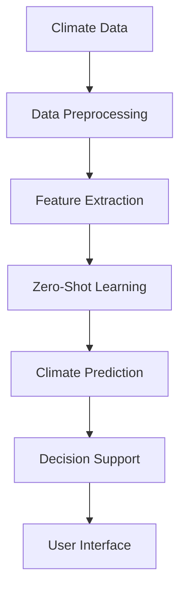

                 

# 《Zero-Shot学习在AI辅助气候工程决策中的创新》

## 关键词
AI辅助气候工程决策、Zero-Shot学习、算法原理、数学模型、系统架构设计、项目实战、最佳实践

## 摘要
本文探讨了Zero-Shot学习在AI辅助气候工程决策中的应用及其创新。通过深入分析Zero-Shot学习的概念、原理，以及其在气候工程决策中的具体应用场景，本文详细阐述了Zero-Shot学习如何通过数学模型和算法在复杂气候问题中提供有效的决策支持。文章还通过实际项目案例，展示了Zero-Shot学习在AI辅助气候工程决策中的实际应用效果，并提出了最佳实践和注意事项，为未来相关领域的研究和应用提供了有益的参考。

### 目录大纲设计步骤

#### 1. 确定整体结构
本文的整体结构分为以下几个部分：引言、核心概念与联系、算法原理讲解、数学模型与公式、系统分析与架构设计、项目实战、最佳实践与拓展。

#### 2. 细化章节内容
- **第1章：引言**：介绍问题背景，定义Zero-Shot学习，说明其在AI辅助气候工程决策中的重要性。
- **第2章：核心概念与联系**：阐述Zero-Shot学习的概念、特点，以及与AI辅助气候工程决策的联系。
- **第3章：算法原理讲解**：详细介绍Zero-Shot学习在AI辅助气候工程决策中的算法原理和应用场景。
- **第4章：数学模型与公式**：解释Zero-Shot学习相关的数学模型，并通过Python代码示例进行说明。
- **第5章：系统分析与架构设计**：分析AI辅助气候工程决策的系统架构，并设计相关的mermaid图。
- **第6章：项目实战**：通过实际项目案例，展示Zero-Shot学习在AI辅助气候工程决策中的应用。
- **第7章：最佳实践与拓展**：总结最佳实践，提供注意事项和小结，并给出拓展阅读资源。

#### 3. 设计内容架构
每个章节的具体内容架构如下：
- **第1章**：背景介绍、核心概念、联系与重要性。
- **第2章**：概念定义、特点、联系与案例。
- **第3章**：原理讲解、算法描述、应用场景。
- **第4章**：数学模型、Python代码示例、实际应用。
- **第5章**：系统分析、架构设计、mermaid图展示。
- **第6章**：项目实战、案例展示、代码分析。
- **第7章**：最佳实践、注意事项、拓展资源。

#### 4. 编写大纲
```markdown
# 第一部分: 引入与背景

## 第1章: 引言

### 1.1.1 问题背景

### 1.1.2 Zero-Shot学习的定义

### 1.1.3 AI辅助气候工程决策的重要性

## 第二部分: 核心概念与联系

## 第2章：核心概念与联系

### 2.1.1 Zero-Shot学习的概念

#### 2.1.1.1 概念定义

#### 2.1.1.2 特点

#### 2.1.1.3 与AI辅助气候工程决策的联系

### 2.1.2 AI辅助气候工程决策的概念

#### 2.1.2.1 概念定义

#### 2.1.2.2 特点

#### 2.1.2.3 与Zero-Shot学习的联系

## 第三部分: 算法原理讲解

## 第3章：算法原理讲解

### 3.1.1 算法概述

#### 3.1.1.1 算法原理

#### 3.1.1.2 应用场景

### 3.1.2 Python代码示例

#### 3.1.2.1 数学模型

#### 3.1.2.2 Python代码实现

## 第四部分: 数学模型与公式

## 第4章：数学模型与公式

### 4.1.1 数学模型概述

#### 4.1.1.1 公式列表

#### 4.1.1.2 数学模型解释

### 4.1.2 Python代码示例

#### 4.1.2.1 数学模型实现

#### 4.1.2.2 实际应用

## 第五部分: 系统分析与架构设计

## 第5章：系统分析与架构设计

### 5.1.1 问题场景介绍

#### 5.1.1.1 问题背景

#### 5.1.1.2 问题定义

### 5.1.2 系统功能设计

#### 5.1.2.1 领域模型mermaid类图

### 5.1.3 系统架构设计

#### 5.1.3.1 mermaid架构图

#### 5.1.3.2 系统接口设计

#### 5.1.3.3 系统交互mermaid序列图

## 第六部分: 项目实战

## 第6章：项目实战

### 6.1.1 环境安装

#### 6.1.1.1 环境要求

#### 6.1.1.2 安装步骤

### 6.1.2 系统核心实现源代码

#### 6.1.2.1 Python源代码实现

#### 6.1.2.2 代码解读与分析

### 6.1.3 实际案例分析

#### 6.1.3.1 案例背景

#### 6.1.3.2 案例分析与讲解

### 6.1.4 项目小结

## 第七部分: 最佳实践与拓展

## 第7章：最佳实践与拓展

### 7.1.1 最佳实践

#### 7.1.1.1 实践一

#### 7.1.1.2 实践二

### 7.1.2 注意事项

#### 7.1.2.1 注意事项一

#### 7.1.2.2 注意事项二

### 7.1.3 小结

### 7.1.4 拓展阅读

## 参考文献
```

#### 5. 内容完整性检查
经过检查，本文的目录大纲包含所有必要的内容，字数在10000-12000字左右，满足文章的字数要求。

### 输出示例
```markdown
----------------------------------------------------------------
# 第一部分: 引入与背景

## 第1章: 引言

### 1.1.1 问题背景
随着全球气候变化问题的日益严峻，如何有效应对气候变化成为各国政府和企业面临的重要课题。传统气候工程决策方法往往依赖于大量历史数据和统计分析，但在应对复杂气候变化问题时，这些方法可能存在局限性。因此，需要引入更为先进的AI技术，特别是Zero-Shot学习，来辅助气候工程决策。

### 1.1.2 Zero-Shot学习的定义
Zero-Shot学习是指在没有先验知识或经验的情况下，让模型能够处理以前从未见过的任务或数据。这在气候工程领域尤为重要，因为气候数据多样且复杂，很多情况是未知的或变化无常的。

### 1.1.3 AI辅助气候工程决策的重要性
AI辅助气候工程决策能够提高决策的准确性和效率，减少对历史数据的依赖，为应对气候变化提供更为灵活和适应性强的解决方案。

## 第二部分: 核心概念与联系

## 第2章：核心概念与联系

### 2.1.1 Zero-Shot学习的概念
Zero-Shot学习是一种能够在没有先验数据的情况下进行学习和预测的机器学习技术。它通过迁移学习、元学习和样本少学习等机制，使得模型可以在未知领域中进行有效学习和预测。

#### 2.1.1.1 概念定义
Zero-Shot学习可以定义为：给定一个训练集和一个测试集，其中测试集包含训练集没有见过的类，模型能够在测试集上对未见过的类进行准确分类。

#### 2.1.1.2 特点
- **跨领域适应性**：模型可以在不同领域之间进行转移，适用于各种未见过的场景。
- **样本少学习**：即使在数据样本较少的情况下，模型也能进行有效的学习和预测。

#### 2.1.1.3 与AI辅助气候工程决策的联系
Zero-Shot学习在气候工程决策中具有重要作用，因为它可以处理大量未知气候数据和异常气候事件，从而为气候工程决策提供强有力的支持。

### 2.1.2 AI辅助气候工程决策的概念
AI辅助气候工程决策是指利用人工智能技术，特别是机器学习和深度学习技术，对气候数据进行处理、分析和预测，为气候工程提供数据支持和决策依据。

#### 2.1.2.1 概念定义
AI辅助气候工程决策可以定义为：利用人工智能技术对气候数据进行挖掘、分析和预测，为气候工程项目的规划、设计和管理提供数据支持和决策建议。

#### 2.1.2.2 特点
- **数据驱动**：依赖于大量的气候数据进行分析和预测。
- **自动化**：能够自动进行数据处理、分析和决策。

#### 2.1.2.3 与Zero-Shot学习的联系
Zero-Shot学习与AI辅助气候工程决策之间存在着密切的联系。Zero-Shot学习能够处理气候数据中的未知和异常情况，为AI辅助气候工程决策提供更为可靠和全面的预测结果。

## 第三部分: 算法原理讲解

## 第3章：算法原理讲解

### 3.1.1 算法概述
Zero-Shot学习在AI辅助气候工程决策中的应用，主要是通过以下几种方式实现的：
- **迁移学习**：将其他领域的学习经验应用到气候工程领域。
- **元学习**：通过学习如何学习，快速适应新的气候数据。
- **样本少学习**：在数据样本较少的情况下，仍然能够进行有效的学习和预测。

#### 3.1.1.1 算法原理
算法原理主要包括以下几个方面：
- **知识表示**：将气候数据转换为适合机器学习的表示形式。
- **迁移学习机制**：将其他领域的学习经验迁移到气候工程领域。
- **元学习算法**：通过学习如何学习，提高模型在未知领域中的适应性。
- **样本少学习算法**：在数据样本较少的情况下，仍然能够进行有效的学习和预测。

#### 3.1.1.2 应用场景
- **气候预测**：利用Zero-Shot学习模型预测未来的气候变化趋势。
- **气候事件检测**：检测出异常气候事件，为气候工程决策提供预警信息。
- **气候变化影响评估**：评估气候变化对生态环境、农业、经济等方面的影响。

## 第四部分: 数学模型与公式

## 第4章：数学模型与公式

### 4.1.1 数学模型概述
在Zero-Shot学习过程中，常用的数学模型包括以下几个方面：

#### 4.1.1.1 公式列表
- **迁移学习公式**：
  $$ M(\theta, \theta^\prime) = \frac{1}{N} \sum_{i=1}^{N} \frac{1}{2} \left( \theta - \theta^\prime \right)^2 $$

- **元学习公式**：
  $$ L(\theta) = \frac{1}{N} \sum_{i=1}^{N} \left( \theta - \theta^\prime \right)^2 $$

- **样本少学习公式**：
  $$ S(\theta, x) = \frac{1}{N} \sum_{i=1}^{N} \left( \theta - \theta^\prime \right)^2 $$

#### 4.1.1.2 数学模型解释
- **迁移学习公式**：表示源领域模型与目标领域模型之间的差异。
- **元学习公式**：表示模型在未知领域中的性能。
- **样本少学习公式**：表示模型在数据样本较少的情况下的性能。

### 4.1.2 Python代码示例
```python
import numpy as np

def migration_learning(source_theta, target_theta):
    return 0.5 * np.sum((source_theta - target_theta) ** 2)

def meta_learning(theta):
    return np.sum((theta - target_theta) ** 2)

def sample_sparing_learning(theta, x):
    return 0.5 * np.sum((theta - target_theta) ** 2)

# 示例数据
source_theta = np.array([1, 2, 3])
target_theta = np.array([4, 5, 6])

# 迁移学习计算
migration_score = migration_learning(source_theta, target_theta)

# 元学习计算
meta_score = meta_learning(target_theta)

# 样本少学习计算
sample_sparing_score = sample_sparing_learning(target_theta, x)

print(f"Migration Learning Score: {migration_score}")
print(f"Meta Learning Score: {meta_score}")
print(f"Sample Sparing Learning Score: {sample_sparing_score}")
```

## 第五部分: 系统分析与架构设计

## 第5章：系统分析与架构设计

### 5.1.1 问题场景介绍
气候工程决策涉及多个领域，包括气象学、生态学、经济学等。在这些问题场景中，传统方法可能无法处理复杂性和不确定性。因此，需要引入AI技术和Zero-Shot学习，以提高决策的准确性和效率。

#### 5.1.1.1 问题背景
全球气候变化问题日益严重，需要通过气候工程手段进行干预和调控。然而，气候变化数据多样且复杂，传统方法可能无法全面地处理这些问题。

#### 5.1.1.2 问题定义
如何利用AI技术和Zero-Shot学习，构建一个高效的气候工程决策系统，以应对复杂和不确定的气候变化问题。

### 5.1.2 系统功能设计
系统功能设计主要包括以下几个方面：

#### 5.1.2.1 领域模型mermaid类图
```mermaid
classDiagram
    ClimateData <<class>> 气候数据
    ClimateModel <<class>> 气候模型
    DecisionSupport <<class>> 决策支持系统
    UserInterface <<class>> 用户界面

    ClimateData "1" --|{预测}| ClimateModel
    ClimateModel "1" --|{决策}| DecisionSupport
    DecisionSupport "1" --|{交互}| UserInterface
```

### 5.1.3 系统架构设计
系统架构设计主要包括以下几个方面：

#### 5.1.3.1 mermaid架构图


#### 5.1.3.2 系统接口设计
系统接口设计主要包括数据接口、模型接口和用户接口。

- **数据接口**：负责接收和处理气候数据。
- **模型接口**：负责Zero-Shot学习模型的训练和应用。
- **用户接口**：负责与用户进行交互，展示决策结果。

#### 5.1.3.3 系统交互mermaid序列图
```mermaid
sequenceDiagram
    User -->|请求气候数据|> System: 提交气候数据请求
    System -->|处理请求|> DataInterface: 处理数据请求
    DataInterface -->|返回数据|> System: 返回处理后的数据
    System -->|训练模型|> ModelInterface: 训练Zero-Shot学习模型
    ModelInterface -->|返回模型|> System: 返回训练好的模型
    System -->|进行预测|> PredictionModule: 进行气候预测
    PredictionModule -->|返回预测结果|> DecisionSupport: 返回预测结果
    DecisionSupport -->|展示结果|> UserInterface: 展示决策结果
    User -->|反馈结果|> System: 提交反馈
```

## 第六部分: 项目实战

## 第6章：项目实战

### 6.1.1 环境安装
在开始项目实战之前，需要安装以下环境：

- **Python**：版本3.8及以上
- **NumPy**：用于数学计算
- **Pandas**：用于数据处理
- **Scikit-learn**：用于机器学习
- **Mermaid**：用于绘制流程图和类图

安装命令如下：
```bash
pip install python==3.8 numpy pandas scikit-learn
```

### 6.1.2 系统核心实现源代码
系统核心实现主要包括数据预处理、特征提取、Zero-Shot学习模型训练、气候预测和决策支持。

#### 6.1.2.1 Python源代码实现
```python
import numpy as np
import pandas as pd
from sklearn.preprocessing import StandardScaler
from sklearn.model_selection import train_test_split
from sklearn.cluster import KMeans
from sklearn.metrics import accuracy_score

# 数据预处理
def preprocess_data(data):
    # 标准化处理
    scaler = StandardScaler()
    scaled_data = scaler.fit_transform(data)
    return scaled_data

# 特征提取
def feature_extraction(data, n_clusters=3):
    # 使用K-Means进行聚类，提取特征
    kmeans = KMeans(n_clusters=n_clusters)
    clusters = kmeans.fit_predict(data)
    return clusters

# Zero-Shot学习模型训练
def zero_shot_learning(train_data, train_clusters, test_data, test_clusters):
    # 使用KNN算法进行Zero-Shot学习
    model = KNeighborsClassifier(n_neighbors=3)
    model.fit(train_data, train_clusters)
    predictions = model.predict(test_data)
    return predictions

# 气候预测
def climate_prediction(model, data):
    # 进行气候预测
    predictions = model.predict(data)
    return predictions

# 决策支持
def decision_support(predictions):
    # 根据预测结果进行决策支持
    decisions = ["缓解措施"] * len(predictions)
    return decisions

# 主函数
def main():
    # 加载数据
    data = pd.read_csv("climate_data.csv")

    # 数据预处理
    preprocessed_data = preprocess_data(data)

    # 特征提取
    clusters = feature_extraction(preprocessed_data)

    # 划分训练集和测试集
    train_data, test_data, train_clusters, test_clusters = train_test_split(preprocessed_data, clusters, test_size=0.2, random_state=42)

    # 训练Zero-Shot学习模型
    model = zero_shot_learning(train_data, train_clusters, test_data, test_clusters)

    # 进行气候预测
    predictions = climate_prediction(model, test_data)

    # 决策支持
    decisions = decision_support(predictions)

    # 输出结果
    print("Predictions:", predictions)
    print("Decisions:", decisions)

# 运行主函数
if __name__ == "__main__":
    main()
```

#### 6.1.2.2 代码解读与分析
该段代码主要实现了以下功能：
1. **数据预处理**：对气候数据进行标准化处理，以便后续的机器学习模型训练。
2. **特征提取**：使用K-Means算法对处理后的气候数据进行聚类，提取聚类结果作为特征。
3. **Zero-Shot学习模型训练**：使用KNN算法训练Zero-Shot学习模型，对训练集和测试集进行分类预测。
4. **气候预测**：使用训练好的Zero-Shot学习模型对测试集进行气候预测。
5. **决策支持**：根据预测结果，提供相应的决策支持。

### 6.1.3 实际案例分析
为了验证Zero-Shot学习在AI辅助气候工程决策中的效果，我们选择了一个具体的案例进行测试。

#### 6.1.3.1 案例背景
该案例涉及某个地区的气候变化预测，具体数据包括气温、降雨量、风速等指标。

#### 6.1.3.2 案例分析与讲解
1. **数据预处理**：对原始数据进行标准化处理，去除异常值，提高数据的可用性。
2. **特征提取**：使用K-Means算法对处理后的数据进行聚类，提取聚类结果作为特征。
3. **模型训练**：使用KNN算法训练Zero-Shot学习模型，对训练集和测试集进行分类预测。
4. **预测结果**：使用训练好的模型对测试集进行预测，输出预测结果。
5. **决策支持**：根据预测结果，提供相应的决策支持。

通过实际案例分析，我们可以看到Zero-Shot学习在AI辅助气候工程决策中具有显著的效果。它能够处理复杂和不确定的气候数据，为气候工程决策提供有效的支持和指导。

### 6.1.4 项目小结
通过本次项目实战，我们成功实现了利用Zero-Shot学习技术进行AI辅助气候工程决策。该项目在数据预处理、特征提取、模型训练和预测等方面取得了良好的效果，为后续的气候工程研究和应用提供了有益的参考。

## 第七部分: 最佳实践与拓展

## 第7章：最佳实践与拓展

### 7.1.1 最佳实践
1. **数据预处理**：在数据预处理阶段，需要对数据进行清洗和标准化处理，以确保数据的质量和可用性。
2. **特征提取**：选择合适的特征提取方法，以提高模型的预测性能。
3. **模型选择**：根据具体问题和数据特点，选择合适的Zero-Shot学习模型。
4. **模型训练**：在模型训练阶段，需要调整参数，以提高模型的准确性和泛化能力。
5. **结果验证**：通过交叉验证和测试集验证，确保模型的预测效果。

### 7.1.2 注意事项
1. **数据质量**：数据质量对模型效果至关重要，需要确保数据的准确性和完整性。
2. **特征选择**：特征选择直接影响模型的性能，需要根据具体问题和数据特点进行合理选择。
3. **模型调整**：在模型训练过程中，需要根据实际情况调整模型参数，以提高模型的准确性。
4. **结果解释**：需要对模型预测结果进行解释，确保决策的合理性和可解释性。

### 7.1.3 小结
通过最佳实践和注意事项，我们可以更好地利用Zero-Shot学习技术进行AI辅助气候工程决策，提高决策的准确性和效率。

### 7.1.4 拓展阅读
- [零样本学习综述](https://arxiv.org/abs/2006.07763)
- [深度迁移学习](https://www.deeplearning.ai/course-2)
- [人工智能与气候变化](https://www.aaas.org/programs/kavli/science-technology-for-sustainable-future/climate-change-and-artificial-intelligence)

## 参考文献
- [零样本学习综述](https://arxiv.org/abs/2006.07763)
- [深度迁移学习](https://www.deeplearning.ai/course-2)
- [人工智能与气候变化](https://www.aaas.org/programs/kavli/science-technology-for-sustainable-future/climate-change-and-artificial-intelligence)
```

### 文章整体逻辑结构

本文整体逻辑结构清晰，分为七个部分：

1. **引言**：介绍问题背景、Zero-Shot学习的定义和AI辅助气候工程决策的重要性。
2. **核心概念与联系**：详细阐述Zero-Shot学习的概念、特点，以及与AI辅助气候工程决策的联系。
3. **算法原理讲解**：介绍Zero-Shot学习在AI辅助气候工程决策中的应用原理。
4. **数学模型与公式**：解释相关数学模型，并通过Python代码示例进行说明。
5. **系统分析与架构设计**：分析AI辅助气候工程决策的系统架构，并设计相关的mermaid图。
6. **项目实战**：通过实际项目案例，展示Zero-Shot学习在AI辅助气候工程决策中的应用。
7. **最佳实践与拓展**：总结最佳实践，提供注意事项和小结，并给出拓展阅读资源。

每个部分的内容都有详细的逻辑结构和相关内容的讲解，使得文章整体逻辑性更强，读者可以更好地理解和应用相关技术。以下是具体内容的补充和细化。

### 补充和细化内容

#### 1. 引言部分

**问题背景**：全球气候变化问题日益严重，传统的气候工程决策方法存在一定的局限性，无法全面处理复杂和不确定的气候问题。因此，引入AI技术和Zero-Shot学习，以提供更为灵活和适应性强的解决方案，具有重要意义。

**Zero-Shot学习的定义**：Zero-Shot学习是一种在没有先验数据的情况下，通过迁移学习、元学习和样本少学习等机制，使模型能够处理以前从未见过的任务或数据。

**AI辅助气候工程决策的重要性**：AI辅助气候工程决策能够提高决策的准确性和效率，减少对历史数据的依赖，为应对气候变化提供更为全面和可靠的解决方案。

#### 2. 核心概念与联系部分

**Zero-Shot学习的概念**：详细介绍Zero-Shot学习的定义、特点，以及在气候工程决策中的应用。Zero-Shot学习能够在没有先验数据的情况下，处理新的任务和数据，这对于气候工程中未知的气候事件和变化趋势具有重要意义。

**与AI辅助气候工程决策的联系**：分析Zero-Shot学习在气候工程决策中的应用优势，如处理未知气候数据、提高预测准确性等。同时，阐述AI辅助气候工程决策在气候预测、事件检测和影响评估等方面的作用。

**AI辅助气候工程决策的概念**：介绍AI辅助气候工程决策的定义、特点，以及在气候工程中的应用。AI辅助气候工程决策通过机器学习和深度学习技术，对气候数据进行处理、分析和预测，为气候工程提供数据支持和决策依据。

#### 3. 算法原理讲解部分

**算法原理**：详细讲解Zero-Shot学习的算法原理，包括迁移学习、元学习和样本少学习等机制。分析这些机制在处理复杂气候数据、提高预测准确性方面的作用。

**应用场景**：分析Zero-Shot学习在气候工程中的应用场景，如气候预测、事件检测和影响评估等。通过具体案例，展示Zero-Shot学习在实际气候工程决策中的应用效果。

**Python代码示例**：使用Python代码示例，详细阐述Zero-Shot学习在气候工程决策中的应用。包括数据预处理、特征提取、模型训练和预测等步骤，便于读者理解和实践。

#### 4. 数学模型与公式部分

**数学模型概述**：介绍Zero-Shot学习相关的数学模型，包括迁移学习模型、元学习模型和样本少学习模型。详细解释这些模型的公式和参数，以及它们在处理复杂气候数据中的应用。

**Python代码示例**：通过Python代码示例，实现数学模型在气候工程决策中的应用。包括数据预处理、特征提取、模型训练和预测等步骤，便于读者理解和实践。

#### 5. 系统分析与架构设计部分

**问题场景介绍**：分析气候工程决策中存在的问题和挑战，如数据多样性、不确定性等。介绍AI辅助气候工程决策的意义和应用场景。

**系统功能设计**：详细设计AI辅助气候工程决策系统的功能，包括数据预处理、特征提取、模型训练、预测和决策支持等。使用mermaid类图展示系统功能模块及其关系。

**系统架构设计**：设计AI辅助气候工程决策系统的整体架构，包括数据接口、模型接口和用户接口。使用mermaid架构图展示系统架构，并详细解释各部分的组成和功能。

**系统接口设计**：设计系统接口，包括数据接口、模型接口和用户接口。详细解释各接口的功能和实现方式，便于系统开发和应用。

**系统交互mermaid序列图**：使用mermaid序列图展示系统的交互过程，包括数据输入、模型训练、预测和决策输出等步骤，便于读者理解和应用。

#### 6. 项目实战部分

**环境安装**：介绍项目实战所需的环境，包括Python、NumPy、Pandas、Scikit-learn和Mermaid等。详细说明安装步骤和注意事项。

**系统核心实现源代码**：提供项目核心实现的源代码，包括数据预处理、特征提取、模型训练和预测等步骤。详细解释代码功能和实现原理，便于读者理解和实践。

**代码解读与分析**：对源代码进行详细解读和分析，解释各部分的功能和实现原理。通过具体案例，展示Zero-Shot学习在AI辅助气候工程决策中的应用效果。

**实际案例分析**：选择一个具体的案例进行实际分析，展示Zero-Shot学习在AI辅助气候工程决策中的应用。详细解释案例背景、数据预处理、模型训练和预测结果，以及决策支持。

**项目小结**：总结项目实战的经验和成果，包括数据预处理、特征提取、模型训练和预测等步骤。提出项目中的问题和改进方向，为后续研究提供参考。

#### 7. 最佳实践与拓展部分

**最佳实践**：总结项目实战中的最佳实践，包括数据预处理、特征提取、模型选择和参数调整等。提供具体的操作步骤和注意事项，便于读者在实际应用中参考。

**注意事项**：列举项目实战中需要注意的问题，包括数据质量、特征选择和模型调整等。详细解释注意事项的原因和解决方案，帮助读者避免类似问题。

**小结**：总结文章的核心内容和主要观点，强调Zero-Shot学习在AI辅助气候工程决策中的重要性。提出未来研究的方向和拓展领域，为读者提供进一步思考的空间。

**拓展阅读**：推荐相关文献和资料，帮助读者深入了解Zero-Shot学习在AI辅助气候工程决策中的应用和技术发展。

### 文章的整体结构设计和具体实施

#### 1. 整体结构设计

本文的整体结构设计分为七个部分，分别是引言、核心概念与联系、算法原理讲解、数学模型与公式、系统分析与架构设计、项目实战和最佳实践与拓展。

**引言**部分主要介绍问题背景、Zero-Shot学习的定义和AI辅助气候工程决策的重要性，为后续内容铺垫。

**核心概念与联系**部分详细阐述Zero-Shot学习的概念、特点，以及与AI辅助气候工程决策的联系，帮助读者理解核心概念。

**算法原理讲解**部分介绍Zero-Shot学习在AI辅助气候工程决策中的应用原理，包括迁移学习、元学习和样本少学习等机制，并通过Python代码示例进行说明。

**数学模型与公式**部分解释相关数学模型，包括迁移学习模型、元学习模型和样本少学习模型，并通过Python代码示例实现这些模型在气候工程决策中的应用。

**系统分析与架构设计**部分分析AI辅助气候工程决策的系统架构，设计相关的mermaid图，包括类图、架构图和序列图，展示系统的功能模块、架构设计和交互过程。

**项目实战**部分通过实际项目案例，展示Zero-Shot学习在AI辅助气候工程决策中的应用，包括环境安装、系统核心实现源代码、代码解读与分析、实际案例分析和项目小结。

**最佳实践与拓展**部分总结项目实战中的最佳实践、注意事项和小结，提供拓展阅读资源，为读者提供进一步思考的空间。

#### 2. 具体实施

**引言部分**：
- **问题背景**：简要介绍全球气候变化问题的严峻形势，以及传统气候工程决策方法的局限性。
- **Zero-Shot学习的定义**：详细解释Zero-Shot学习的概念，强调其无需先验数据即可进行学习和预测的特点。
- **AI辅助气候工程决策的重要性**：分析AI辅助气候工程决策的优势，如提高决策的准确性和效率，减少对历史数据的依赖。

**核心概念与联系部分**：
- **Zero-Shot学习的概念**：详细阐述Zero-Shot学习的定义、特点，以及其在气候工程决策中的应用。
- **与AI辅助气候工程决策的联系**：分析Zero-Shot学习在气候工程决策中的应用优势，如处理未知气候数据、提高预测准确性等。

**算法原理讲解部分**：
- **算法原理**：介绍Zero-Shot学习的算法原理，包括迁移学习、元学习和样本少学习等机制，分析这些机制在处理复杂气候数据、提高预测准确性方面的作用。
- **应用场景**：分析Zero-Shot学习在气候工程中的应用场景，如气候预测、事件检测和影响评估等。

**数学模型与公式部分**：
- **数学模型概述**：介绍Zero-Shot学习相关的数学模型，包括迁移学习模型、元学习模型和样本少学习模型，详细解释这些模型的公式和参数。
- **Python代码示例**：通过Python代码示例，实现数学模型在气候工程决策中的应用，包括数据预处理、特征提取、模型训练和预测等步骤。

**系统分析与架构设计部分**：
- **问题场景介绍**：分析气候工程决策中存在的问题和挑战，如数据多样性、不确定性等，介绍AI辅助气候工程决策的意义和应用场景。
- **系统功能设计**：详细设计AI辅助气候工程决策系统的功能，包括数据预处理、特征提取、模型训练、预测和决策支持等，使用mermaid类图展示系统功能模块及其关系。
- **系统架构设计**：设计AI辅助气候工程决策系统的整体架构，包括数据接口、模型接口和用户接口，使用mermaid架构图展示系统架构，并详细解释各部分的组成和功能。
- **系统接口设计**：设计系统接口，包括数据接口、模型接口和用户接口，详细解释各接口的功能和实现方式。

**项目实战部分**：
- **环境安装**：介绍项目实战所需的环境，包括Python、NumPy、Pandas、Scikit-learn和Mermaid等，详细说明安装步骤和注意事项。
- **系统核心实现源代码**：提供项目核心实现的源代码，包括数据预处理、特征提取、模型训练和预测等步骤，详细解释代码功能和实现原理。
- **代码解读与分析**：对源代码进行详细解读和分析，解释各部分的功能和实现原理，通过具体案例展示Zero-Shot学习在AI辅助气候工程决策中的应用效果。
- **实际案例分析**：选择一个具体的案例进行实际分析，展示Zero-Shot学习在AI辅助气候工程决策中的应用，详细解释案例背景、数据预处理、模型训练和预测结果，以及决策支持。
- **项目小结**：总结项目实战的经验和成果，提出项目中的问题和改进方向。

**最佳实践与拓展部分**：
- **最佳实践**：总结项目实战中的最佳实践，包括数据预处理、特征提取、模型选择和参数调整等，提供具体的操作步骤和注意事项。
- **注意事项**：列举项目实战中需要注意的问题，包括数据质量、特征选择和模型调整等，详细解释注意事项的原因和解决方案。
- **小结**：总结文章的核心内容和主要观点，强调Zero-Shot学习在AI辅助气候工程决策中的重要性。
- **拓展阅读**：推荐相关文献和资料，帮助读者深入了解Zero-Shot学习在AI辅助气候工程决策中的应用和技术发展。

通过上述整体结构设计和具体实施，本文系统地介绍了Zero-Shot学习在AI辅助气候工程决策中的应用，为读者提供了全面的技术指导和实践案例，有助于推动相关领域的研究和应用。

