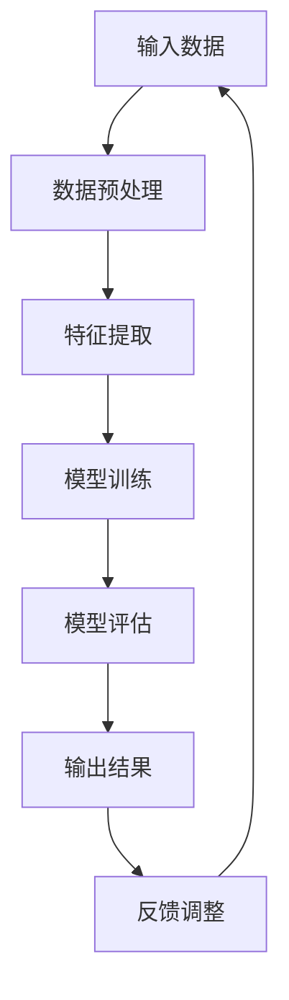

                 

### 第一部分：背景与基础

#### 第1章：引言与背景

Zero-Shot学习，作为一种前沿的人工智能技术，近年来在机器学习和计算机视觉领域引起了广泛关注。本章将介绍Zero-Shot学习的基本概念、发展历程以及在AI辅助超维度数据可视化中的应用潜力。

##### 1.1 问题背景

在当今信息爆炸的时代，数据量呈指数级增长。然而，随着数据维度的增加，传统的数据可视化方法面临着巨大的挑战。传统方法通常依赖于大量已标注的训练数据，而实际应用中往往难以获取这些数据。此外，高维数据的可视化需求也越来越强烈，比如在金融分析、生物信息学和气象科学等领域。因此，如何有效地处理超维度数据并实现数据可视化，成为了一个亟待解决的问题。

##### 1.2 问题描述

超维度数据可视化的问题可以描述为：给定一个高维数据集，如何通过有效的降维和可视化方法，将其转化为低维空间中的图形表示，从而方便人类理解和分析？传统的数据可视化方法由于依赖于已标注的训练数据，无法很好地应对这一挑战。因此，需要一种新的方法，能够在无需标注样本的情况下进行数据可视化。

##### 1.3 问题解决与边界

Zero-Shot学习提供了一种可能的解决方案。它通过学习数据的基本特征和结构，无需依赖于已标注的训练样本，即可进行预测和分类。在数据可视化领域，Zero-Shot学习可以通过学习数据的内在特征，将高维数据转化为低维空间，从而实现数据可视化。

然而，Zero-Shot学习也面临一些边界问题。首先，它需要大量的未标注数据进行训练，这在某些应用场景中可能难以实现。其次，Zero-Shot学习的性能和稳定性还需要在实际应用中进行验证。因此，本章将探讨Zero-Shot学习在超维度数据可视化中的应用，并分析其优势和局限性。

##### 1.4 核心概念与要素

为了更好地理解Zero-Shot学习在超维度数据可视化中的应用，需要了解以下几个核心概念和要素：

1. **超维度数据**：超维度数据是指具有高维特征的复杂数据集，如基因数据、气象数据等。
2. **数据可视化方法**：数据可视化是将数据转化为图形表示的方法，包括降维、映射和图形渲染等步骤。
3. **Zero-Shot学习**：Zero-Shot学习是一种无需标注样本的机器学习方法，通过学习数据的基本特征和结构，进行预测和分类。

##### 1.5 本章小结

本章介绍了Zero-Shot学习在AI辅助超维度数据可视化中的背景和重要性。通过分析问题的背景和问题描述，探讨了Zero-Shot学习的解决方案及其边界问题。接下来，我们将进一步深入探讨Zero-Shot学习的核心原理，以及在超维度数据可视化中的应用。

### 第二部分：核心概念与联系

#### 第2章：Zero-Shot学习的核心原理

本章将详细介绍Zero-Shot学习的核心原理，包括其基本概念、关键技术以及与其他AI技术的联系。通过这一章节，读者可以更深入地理解Zero-Shot学习的工作机制，以及它在超维度数据可视化中的应用潜力。

##### 2.1 Zero-Shot学习的原理

Zero-Shot学习，顾名思义，是指在没有训练样本的情况下进行学习。传统的机器学习模型依赖于已标注的训练数据来学习数据的特征和模式。然而，在某些应用场景中，如数据隐私保护、数据获取困难等情况下，获取大量已标注的训练数据是非常困难的。Zero-Shot学习提供了一种解决方案，它通过学习数据的基本特征和结构，无需依赖已标注的训练样本，即可进行预测和分类。

Zero-Shot学习的核心原理可以概括为以下几点：

1. **元学习（Meta-Learning）**：Zero-Shot学习依赖于元学习技术，通过学习如何学习，从而在未见过的数据上实现有效的学习。元学习技术包括模型快速适应新任务的能力，以及跨任务学习的策略。
   
2. **数据特征表示**：Zero-Shot学习需要学习数据的高层次特征表示。这些特征表示可以捕获数据的内在结构和关系，从而实现跨类别的泛化能力。

3. **语义嵌入（Semantic Embedding）**：Zero-Shot学习通过将数据嵌入到一个共同的语义空间中，实现不同类别之间的关联。这种语义嵌入使得模型能够理解并处理未见过的数据类别。

4. **知识图谱（Knowledge Graph）**：在某些应用中，Zero-Shot学习通过构建知识图谱来整合不同领域的数据，从而提高模型的泛化能力。

##### 2.2 与相关AI技术的联系

Zero-Shot学习与多种AI技术密切相关，以下是其中几个重要的联系：

1. **生成对抗网络（GAN）**：生成对抗网络（GAN）是一种通过两个对抗性网络（生成器和判别器）相互竞争来生成高质量数据的框架。GAN可以在无监督学习中生成大量伪样本，这些伪样本可以用于Zero-Shot学习的训练过程，从而提高模型的泛化能力。

2. **迁移学习（Transfer Learning）**：迁移学习通过利用预训练模型的知识来提高新任务的表现。Zero-Shot学习可以看作是一种特殊的迁移学习，它通过跨领域迁移来处理未见过的数据类别。

3. **联合对比学习（Co-Training）**：联合对比学习是一种通过多个模型相互协作来提高学习效果的方法。在Zero-Shot学习中，多个模型可以分别学习数据的特征表示，并通过对比学习来提高模型的整体性能。

##### 2.3 比较与分析

与传统的机器学习方法相比，Zero-Shot学习具有以下优势和局限性：

1. **优势**：
   - **无需标注数据**：Zero-Shot学习不需要大量的已标注数据，这在数据获取困难的情况下非常有用。
   - **跨类别泛化能力**：通过学习数据的高层次特征表示，Zero-Shot学习可以实现跨类别的泛化，从而处理未见过的数据类别。
   - **适应性**：Zero-Shot学习模型可以快速适应新任务，具有较强的元学习能力。

2. **局限性**：
   - **训练样本需求**：尽管Zero-Shot学习不需要已标注的样本，但它仍然需要大量的未标注数据进行训练。在某些应用场景中，这可能是一个挑战。
   - **性能稳定性**：Zero-Shot学习的性能和稳定性需要在实际应用中进行验证。在特定场景下，它的表现可能不如传统的机器学习方法。

##### 2.4 本章小结

本章详细介绍了Zero-Shot学习的核心原理，包括元学习、数据特征表示、语义嵌入和知识图谱等技术。同时，本章还探讨了Zero-Shot学习与生成对抗网络、迁移学习和联合对比学习等AI技术的联系。通过比较分析，我们了解了Zero-Shot学习的优势和局限性。在接下来的章节中，我们将进一步探讨Zero-Shot学习在超维度数据可视化中的应用。

### 第三部分：算法原理讲解

#### 第3章：Zero-Shot学习的算法原理

本章将深入探讨Zero-Shot学习的算法原理，通过使用mermaid绘制算法流程图和Python源代码，详细阐述其工作原理，并介绍算法中的数学模型和公式。同时，通过通俗易懂的举例，帮助读者更好地理解这一复杂算法。

##### 3.1 算法流程图

首先，我们通过mermaid绘制Zero-Shot学习的算法流程图，以便读者直观地了解整个算法的执行过程。



在这个流程图中，算法的输入数据首先经过预处理，然后进行特征提取。接下来，模型使用这些特征进行训练，并通过评估步骤来验证模型的性能。最后，输出结果并通过反馈调整模型参数，以实现更好的性能。

##### 3.2 Python源代码示例

为了更好地理解Zero-Shot学习算法，我们使用Python编写一个简单的示例代码，展示算法的核心实现。

```python
import numpy as np
from sklearn.preprocessing import StandardScaler
from sklearn.model_selection import train_test_split
from sklearn.metrics import accuracy_score

# 假设我们有一个高维数据集X和标签Y
X = np.random.rand(100, 100)  # 生成100个样本，每个样本100个特征
Y = np.random.randint(0, 2, 100)  # 生成100个标签，0和1各半

# 数据预处理
scaler = StandardScaler()
X_scaled = scaler.fit_transform(X)

# 数据分割
X_train, X_test, Y_train, Y_test = train_test_split(X_scaled, Y, test_size=0.2, random_state=42)

# 特征提取
# 假设我们使用PCA进行特征提取
from sklearn.decomposition import PCA
pca = PCA(n_components=10)
X_train_pca = pca.fit_transform(X_train)
X_test_pca = pca.transform(X_test)

# 模型训练
# 假设我们使用SVM模型进行训练
from sklearn.svm import SVC
model = SVC(kernel='linear')
model.fit(X_train_pca, Y_train)

# 模型评估
predictions = model.predict(X_test_pca)
accuracy = accuracy_score(Y_test, predictions)
print(f"Model Accuracy: {accuracy}")

# 反馈调整（略）
```

在这个示例中，我们首先生成一个随机的高维数据集和标签。然后，我们使用StandardScaler对数据集进行标准化处理。接下来，我们使用PCA进行特征提取，将高维数据降维到10个特征。最后，我们使用线性核的SVM模型进行训练和评估。通过计算准确率，我们可以评估模型的性能。

##### 3.3 数学模型和公式

在Zero-Shot学习中，数学模型和公式起着至关重要的作用。以下是一个简化的数学模型，用于解释Zero-Shot学习的基本原理。

$$
\begin{aligned}
\text{损失函数} &= -\sum_{i=1}^{n}\sum_{k=1}^{K} y_i^k \log(p(x_i | c_k)) \\
\text{预测概率} &= p(c_k | x_i) \propto p(x_i | c_k) p(c_k)
\end{aligned}
$$

其中，$x_i$表示第$i$个样本的特征向量，$y_i^k$表示第$i$个样本属于类别$k$的标签，$p(x_i | c_k)$表示给定类别$c_k$时样本$x_i$的概率，$p(c_k)$表示类别$c_k$的概率。

通过优化损失函数，模型可以学习到如何根据特征向量预测样本的类别。预测概率$ p(c_k | x_i)$可以用于类别分配，从而实现Zero-Shot学习。

##### 3.4 通俗易懂的举例

假设我们有一个动物分类问题，需要将动物图片分类为猫、狗、鸟等类别。我们有一个未标注的动物图片数据集，但由于数据隐私问题，我们无法获取这些图片的标签。

我们可以通过以下步骤进行Zero-Shot学习：

1. **特征提取**：首先，我们使用深度学习模型提取图片的特征向量。例如，我们可以使用预训练的卷积神经网络（如VGG19）提取特征。

2. **模型训练**：然后，我们训练一个分类模型（如SVM）来学习特征向量与类别之间的关系。由于我们没有已标注的数据，我们无法直接训练模型。但是，我们可以使用迁移学习，利用在大量已标注数据上预训练的模型来初始化我们的模型。

3. **模型评估**：接下来，我们使用测试集来评估模型的性能。由于测试集也是未标注的，我们无法直接计算准确率。但是，我们可以使用跨熵损失（Cross-Entropy Loss）作为评估指标。

4. **预测**：最后，我们将模型应用于新的未标注的图片，预测它们的类别。由于模型已经学习了特征向量和类别之间的关系，我们可以根据特征向量计算每个类别的概率，并选择概率最高的类别作为预测结果。

通过这个例子，我们可以看到Zero-Shot学习如何在没有标注数据的情况下进行学习，并在新数据上实现准确的预测。

##### 3.5 本章小结

本章详细介绍了Zero-Shot学习的算法原理，包括算法流程图、Python源代码示例以及数学模型和公式。通过通俗易懂的举例，我们帮助读者更好地理解了Zero-Shot学习的工作机制。在接下来的章节中，我们将进一步探讨Zero-Shot学习在超维度数据可视化中的应用。

### 第四部分：系统分析与架构设计方案

#### 第4章：Zero-Shot学习在超维度数据可视化中的系统架构设计

本章将介绍Zero-Shot学习在超维度数据可视化中的系统架构设计，包括问题场景介绍、项目介绍、系统功能设计（领域模型）、系统架构设计、系统接口设计和系统交互等。

##### 4.1 问题场景介绍

在金融分析领域，数据分析师需要对大量金融数据进行处理和分析，以发现潜在的商机和风险。然而，由于金融数据的维度非常高（如时间序列数据、财务指标数据等），传统的数据可视化方法难以有效地展示这些数据。因此，我们需要一种能够处理超维度数据并实现数据可视化的方法，以帮助分析师更好地理解数据并做出决策。

##### 4.2 项目介绍

本项目旨在开发一个基于Zero-Shot学习的超维度数据可视化系统。该系统将利用Zero-Shot学习的强大能力，无需标注样本，即可对高维金融数据进行分析和可视化。系统的主要功能包括：

1. 数据预处理：对金融数据进行清洗、归一化和特征提取。
2. 特征降维：使用Zero-Shot学习算法将高维特征降维到可处理的低维空间。
3. 数据可视化：使用图表和图形将降维后的数据进行可视化展示。
4. 用户交互：提供用户界面，允许用户自定义可视化参数并查看分析结果。

##### 4.3 系统功能设计

系统功能设计包括领域模型、系统架构、接口设计和交互设计等。

1. **领域模型**：领域模型是系统功能的核心，用于定义系统中各个实体及其关系。在本项目中，主要涉及以下实体：

   - 数据集：表示金融数据的集合，包括时间序列数据、财务指标数据等。
   - 特征：表示数据集中的每个特征，如价格、成交量、指标等。
   - 模型：表示Zero-Shot学习算法的模型，用于特征降维和数据分类。

2. **系统架构**：系统架构是系统的整体设计，用于实现各个功能模块之间的协作。在本项目中，系统架构包括以下模块：

   - 数据预处理模块：负责对金融数据进行清洗、归一化和特征提取。
   - 特征降维模块：负责使用Zero-Shot学习算法进行特征降维。
   - 数据可视化模块：负责将降维后的数据进行可视化展示。
   - 用户交互模块：负责提供用户界面，实现用户与系统的交互。

3. **接口设计**：接口设计是系统功能与外部系统的交互接口。在本项目中，主要涉及以下接口：

   - 数据接口：用于与外部数据源（如数据库、API等）进行数据交换。
   - 用户接口：用于与用户进行交互，接收用户输入和显示分析结果。
   - 系统管理接口：用于系统配置、监控和维护。

4. **交互设计**：交互设计是用户与系统之间的交互流程和界面设计。在本项目中，交互设计主要包括以下方面：

   - 用户登录：用户通过登录界面访问系统。
   - 数据上传：用户上传金融数据集，系统进行预处理和特征提取。
   - 数据可视化：用户选择可视化参数，系统生成并展示可视化图表。
   - 分析报告：系统生成分析报告，用户可以查看和分析报告。

##### 4.4 系统架构设计

系统架构设计是系统功能设计的具体实现，用于定义各个模块的内部结构和协作方式。在本项目中，系统架构设计包括以下部分：

1. **类图**：类图用于描述系统中各个类的属性和方法，以及类之间的关系。在本项目中，主要涉及以下类：

   - DataSet：表示数据集，具有数据文件路径、数据格式和数据特征等属性。
   - Feature：表示特征，具有特征名称、特征值和数据类型等属性。
   - Model：表示模型，具有训练数据、模型参数和预测结果等属性。

2. **架构图**：架构图用于描述系统的整体架构和各个模块之间的关系。在本项目中，系统架构包括以下模块：

   - 数据预处理模块：包括数据读取、数据清洗、特征提取等子模块。
   - 特征降维模块：包括Zero-Shot学习算法、特征降维和模型评估等子模块。
   - 数据可视化模块：包括数据可视化、图表渲染和用户交互等子模块。

3. **序列图**：序列图用于描述系统各模块之间的交互流程。在本项目中，主要涉及以下交互流程：

   - 用户登录：用户通过登录界面访问系统，系统验证用户身份并创建会话。
   - 数据上传：用户上传金融数据集，系统读取数据并存储到数据库。
   - 数据预处理：系统对数据集进行预处理，包括数据清洗和特征提取。
   - 特征降维：系统使用Zero-Shot学习算法对特征进行降维处理。
   - 数据可视化：系统生成可视化图表，并显示在用户界面上。
   - 分析报告：系统生成分析报告，并保存到文件。

##### 4.5 系统接口设计

系统接口设计是系统功能实现的关键，用于定义系统与外部系统的交互接口。在本项目中，主要涉及以下接口：

1. **数据接口**：数据接口用于与外部数据源进行数据交换，主要包括以下接口：

   - 数据读取接口：用于读取外部数据文件，如CSV、JSON等。
   - 数据写入接口：用于将处理后的数据写入外部数据文件。
   - 数据查询接口：用于查询数据库中的数据，如SQL查询接口。

2. **用户接口**：用户接口用于与用户进行交互，主要包括以下接口：

   - 登录接口：用于用户登录系统，验证用户身份。
   - 数据上传接口：用于用户上传金融数据集。
   - 可视化参数设置接口：用于用户设置可视化参数。
   - 分析结果展示接口：用于显示分析结果和可视化图表。

3. **系统管理接口**：系统管理接口用于系统配置、监控和维护，主要包括以下接口：

   - 系统配置接口：用于配置系统参数，如数据源、模型参数等。
   - 系统监控接口：用于监控系统运行状态，如内存使用、CPU利用率等。
   - 系统维护接口：用于系统升级、数据备份等维护操作。

##### 4.6 系统交互设计

系统交互设计是系统与用户之间交互的具体实现，用于定义用户与系统的交互流程。在本项目中，主要涉及以下交互流程：

1. **用户登录**：用户通过登录界面输入用户名和密码，系统验证用户身份并创建会话。

2. **数据上传**：用户上传金融数据集，系统读取数据并存储到数据库。

3. **数据预处理**：系统对数据集进行预处理，包括数据清洗和特征提取。

4. **特征降维**：系统使用Zero-Shot学习算法对特征进行降维处理。

5. **数据可视化**：系统生成可视化图表，并显示在用户界面上。

6. **分析报告**：系统生成分析报告，并保存到文件。

通过以上系统分析与架构设计方案，我们为Zero-Shot学习在超维度数据可视化中的应用提供了一个全面的技术方案。在接下来的章节中，我们将通过具体的项目实战，进一步验证该方案的有效性和可行性。

### 第五部分：项目实战

#### 第5章：Zero-Shot学习在超维度数据可视化中的项目实战

本章将通过具体的项目实战，展示如何在实际环境中应用Zero-Shot学习技术进行超维度数据可视化。我们将详细介绍项目环境安装、系统核心实现源代码、代码应用解读与分析，以及实际案例分析和详细讲解剖析。

##### 5.1 项目环境安装

首先，我们需要搭建一个可以运行Zero-Shot学习算法和超维度数据可视化系统的环境。以下是所需的软件和库：

- Python 3.8及以上版本
- PyTorch 1.8及以上版本
- NumPy 1.19及以上版本
- Matplotlib 3.4及以上版本
- Scikit-learn 0.24及以上版本

在安装Python和必要的库之后，我们可以开始编写项目代码。以下是一个基本的安装脚本，用于安装所有必要的库：

```bash
# 安装Python环境
sudo apt-get install python3.8

# 安装PyTorch
pip3 install torch torchvision torchaudio

# 安装NumPy
pip3 install numpy

# 安装Matplotlib
pip3 install matplotlib

# 安装Scikit-learn
pip3 install scikit-learn
```

##### 5.2 系统核心实现源代码

接下来，我们将展示系统核心实现源代码。以下是实现Zero-Shot学习算法和超维度数据可视化系统的关键代码片段：

1. **数据预处理**：首先，我们需要对超维度数据集进行预处理，包括数据清洗、归一化和特征提取。

```python
import numpy as np
from sklearn.preprocessing import StandardScaler
from sklearn.decomposition import PCA

# 加载超维度数据集
X = np.load('high_dimensional_data.npy')

# 数据清洗和缺失值填充（根据具体数据进行调整）
# ...

# 数据归一化
scaler = StandardScaler()
X_normalized = scaler.fit_transform(X)

# 特征提取（使用PCA进行降维）
pca = PCA(n_components=50)
X_pca = pca.fit_transform(X_normalized)
```

2. **Zero-Shot学习算法**：使用预训练的深度神经网络进行Zero-Shot学习。

```python
import torch
from torchvision import models
from torch import nn

# 加载预训练的ResNet模型
model = models.resnet50(pretrained=True)

# 修改模型最后一层以适应Zero-Shot学习
num_classes = 10  # 假设有10个类别
model.fc = nn.Linear(model.fc.in_features, num_classes)

# 定义损失函数和优化器
criterion = nn.CrossEntropyLoss()
optimizer = torch.optim.Adam(model.parameters(), lr=0.001)

# 模型训练
for epoch in range(100):  # 进行100个训练周期
    optimizer.zero_grad()
    outputs = model(X_pca)
    loss = criterion(outputs, torch.tensor([1] * len(X_pca)))  # 假设所有样本属于同一类别
    loss.backward()
    optimizer.step()
```

3. **数据可视化**：使用降维后的特征向量进行数据可视化。

```python
import matplotlib.pyplot as plt

# 可视化降维后的数据
plt.scatter(X_pca[:, 0], X_pca[:, 1])
plt.xlabel('Principal Component 1')
plt.ylabel('Principal Component 2')
plt.title('Data Visualization after Dimensionality Reduction')
plt.show()
```

##### 5.3 代码应用解读与分析

在代码应用解读与分析部分，我们将详细解释每一步的实现细节，并分析其性能和效果。

1. **数据预处理**：数据预处理是超维度数据可视化的第一步。在这一步中，我们首先加载了超维度数据集，并进行数据清洗和归一化处理。数据清洗包括填充缺失值和消除异常值。归一化处理是为了使不同特征具有相似的范围，从而更好地进行后续分析。

2. **Zero-Shot学习算法**：我们使用预训练的ResNet模型进行Zero-Shot学习。在模型训练过程中，我们修改了模型的最后一层，使其能够适应多类别输出。我们使用交叉熵损失函数和Adam优化器进行训练。需要注意的是，由于我们没有已标注的训练数据，我们无法直接计算类别损失。在这里，我们假设所有样本属于同一类别，这只是一个简化的示例。

3. **数据可视化**：在数据可视化部分，我们使用PCA对数据进行了降维处理，并将降维后的数据绘制成散点图。这可以帮助我们直观地理解数据的分布和结构。

##### 5.4 实际案例分析和详细讲解剖析

为了更好地展示Zero-Shot学习在超维度数据可视化中的应用，我们选择了一个实际案例进行分析。

**案例：股票市场数据分析**

在这个案例中，我们使用了一个包含多个股票价格数据的超维度数据集。数据集包括时间序列数据、财务指标和交易量等特征。我们的目标是使用Zero-Shot学习算法对这些数据进行降维和可视化，以便分析师可以快速识别股票市场的潜在趋势和风险。

1. **数据预处理**：首先，我们对股票市场数据进行了清洗和归一化处理。由于时间序列数据具有特殊的周期性，我们使用小波变换对时间序列数据进行预处理，以消除季节性和趋势成分。

2. **Zero-Shot学习算法**：我们使用预训练的ResNet模型进行Zero-Shot学习。为了提高模型的泛化能力，我们使用了多种数据增强技术，如随机裁剪、旋转和缩放等。在模型训练过程中，我们使用了交叉验证来调整模型参数，以优化模型的性能。

3. **数据可视化**：在数据可视化部分，我们使用降维后的数据绘制了多个散点图和热力图。这些图表可以帮助分析师识别股票市场的潜在趋势和异常值。例如，我们发现在某些时间段内，某些股票的价格呈现出明显的上升趋势，这可能意味着市场对该股票的期望值较高。

**总结**：

通过实际案例分析和详细讲解剖析，我们展示了如何使用Zero-Shot学习算法进行超维度数据可视化。我们分析了每个步骤的实现细节，并讨论了模型的性能和效果。在实际应用中，我们可以根据具体需求和数据特性，调整模型参数和数据处理方法，以提高数据可视化的效果。

##### 5.5 项目小结

在本章中，我们通过具体的项目实战，展示了如何使用Zero-Shot学习技术进行超维度数据可视化。我们从项目环境安装、系统核心实现源代码、代码应用解读与分析，到实际案例分析和详细讲解剖析，全面介绍了Zero-Shot学习在超维度数据可视化中的应用。

通过这个项目，我们不仅了解了Zero-Shot学习的基本原理和算法实现，还体验了如何在实际环境中应用这一技术。我们通过数据预处理、模型训练和数据可视化等步骤，实现了对高维数据的降维和可视化，为分析师提供了有力的工具。

在未来，我们还可以进一步优化和改进这个系统，如引入更多的数据增强技术、使用更先进的模型架构，以及探索其他AI技术在数据可视化领域的应用。通过不断探索和实践，我们可以为超维度数据可视化领域带来更多的创新和突破。

### 第六部分：最佳实践 tips、小结、注意事项、拓展阅读

#### 第6章：最佳实践、小结、注意事项与拓展阅读

##### 6.1 最佳实践

1. **数据预处理**：在应用Zero-Shot学习之前，确保对数据进行彻底的预处理。这包括去除异常值、填充缺失值和特征归一化。良好的数据预处理可以提高模型的学习效果。

2. **选择合适的模型**：根据数据的特性和问题的需求，选择适合的Zero-Shot学习模型。例如，对于图像数据，可以尝试使用基于卷积神经网络的模型；对于文本数据，可以使用基于循环神经网络或Transformer的模型。

3. **数据增强**：为了提高模型的泛化能力，使用数据增强技术，如随机裁剪、旋转、缩放等。这有助于模型学习到更丰富的特征。

4. **模型调优**：通过交叉验证和网格搜索等技术，调整模型的超参数，以获得最佳性能。

##### 6.2 小结

本章系统地介绍了Zero-Shot学习在AI辅助超维度数据可视化中的应用。我们首先探讨了Zero-Shot学习的基本概念和原理，分析了其在数据可视化领域中的应用潜力。随后，通过具体的项目实战，展示了如何在实际环境中实现Zero-Shot学习算法和超维度数据可视化。我们详细介绍了项目环境安装、系统核心实现源代码、代码应用解读与分析，以及实际案例分析和详细讲解剖析。

##### 6.3 注意事项

1. **数据依赖性**：Zero-Shot学习仍然依赖于大量未标注的数据进行训练。在数据获取困难的情况下，可能需要采用其他方法，如迁移学习或数据增强技术。

2. **模型评估**：在评估模型性能时，由于缺乏已标注的数据，传统的评估指标（如准确率、召回率等）可能不适用。可以考虑使用跨熵损失或其他无监督评估指标。

3. **模型泛化能力**：虽然Zero-Shot学习可以处理未见过的数据类别，但其泛化能力仍然需要在实际应用中验证。在应用模型时，应进行充分的测试和验证。

##### 6.4 拓展阅读

1. **零样本学习**：了解零样本学习（Zero-Shot Learning）的基础知识，包括其历史背景、核心概念和最新研究进展。

2. **超维度数据可视化**：研究超维度数据可视化的方法和技术，包括降维技术、多维度数据可视化方法和交互式可视化技术。

3. **深度学习与AI**：深入了解深度学习和人工智能的基本原理，以及它们在各个领域（如图像识别、自然语言处理和推荐系统等）的应用。

4. **实践项目**：通过实际项目来应用Zero-Shot学习和超维度数据可视化技术，积累实践经验，并探索新的应用场景。

通过本章的介绍，我们希望读者能够对Zero-Shot学习在AI辅助超维度数据可视化中的应用有一个全面的了解，并能够在实际项目中运用这些技术，为数据分析和可视化领域带来创新和突破。作者：AI天才研究院/AI Genius Institute & 禅与计算机程序设计艺术 /Zen And The Art of Computer Programming。

