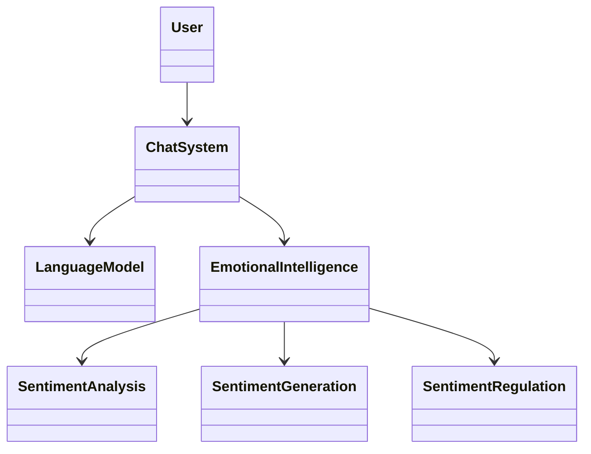
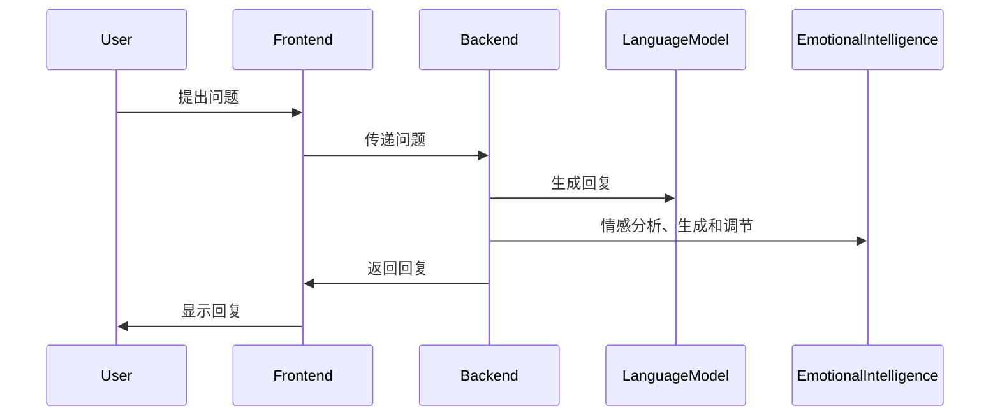

                 

# 情感智能增强：提升LLM EQ

## 关键词

- 情感智能
- 语言模型（LLM）
- 情感增强算法
- 数学模型
- 系统设计与架构

## 摘要

本文旨在探讨如何通过情感智能增强来提升语言模型（LLM）的情商（EQ）。我们首先介绍了人工智能与情感智能的背景，阐述了情感智能在AI中的重要性。接着，我们详细讨论了情感智能增强的核心概念与联系，包括情感标注、情感倾向性分析、情感调节等方面的原理和方法。在此基础上，我们深入讲解了情感智能增强的数学模型和常见算法，如情感标注与识别、情感生成与模仿、情感调节等。最后，我们通过系统分析与架构设计方案，展示了如何将情感智能增强应用于实际项目，从而提升LLM的情商。

## 第一部分：问题背景与核心概念

### 第1章：人工智能与情感智能概述

#### 1.1 人工智能的发展历程

人工智能（AI）自1956年首次提出以来，经历了多个阶段的发展。从最初的符号主义、基于规则的系统，到专家系统的出现，再到连接主义和神经网络的发展，以及近年的深度学习革命，人工智能在各个领域取得了显著的成果。

#### 1.2 情感智能的定义与重要性

情感智能是指个体识别、理解、处理和表达情感的能力。它包括自我情感管理、他人情感识别、情感表达和情感交流等能力。在人工智能中，情感智能的重要性体现在以下几个方面：

1. 提高人机交互的自然度和体验；
2. 增强机器对用户需求的准确理解和响应；
3. 提升机器的决策能力和情境适应能力。

#### 1.3 语言模型（LLM）的基本原理

语言模型（LLM）是一种能够理解、生成和转换自然语言的深度学习模型。LLM的核心思想是通过学习大量文本数据，建立语言的概率分布模型。常见的LLM包括循环神经网络（RNN）、长短期记忆网络（LSTM）和变换器（Transformer）等。

#### 1.4 情感智能增强的需求分析

随着人工智能技术的不断发展，人们对AI的情感智能需求日益增长。主要表现在以下几个方面：

1. 提高人机交互的自然度和舒适度；
2. 增强AI在情感化领域的应用，如虚拟助手、智能客服等；
3. 提升AI在决策和推理中的情感因素考虑。

### 第2章：核心概念与联系

#### 2.1 Prompt的情感智能特征

Prompt是输入给LLM的文本提示，它对LLM的情感表达具有重要影响。Prompt的情感智能特征主要包括情感标注、情感倾向性分析和情感调节。

##### 2.1.1 情感标注与识别

情感标注是指对文本中的情感成分进行标注，通常包括正面、负面和中性等情感类别。情感识别是基于标注数据，对未知文本进行情感分类的过程。

##### 2.1.2 情感倾向性分析

情感倾向性分析是指对文本的情感倾向进行评估，判断文本是偏向正面、负面还是中立。情感倾向性分析有助于了解文本的情感色彩，为情感调节提供依据。

##### 2.1.3 情感调节与应用

情感调节是指通过调整Prompt中的情感成分，使LLM生成的文本更具情感色彩。情感调节可以应用于人机交互、智能客服、文本生成等场景。

#### 2.2 情感智能增强的原理

情感智能增强是指通过改进LLM的情感处理能力，使其更准确地理解、表达和调节情感。情感智能增强的原理主要包括情感语义理解、情感生成与模仿、情感推理与反馈。

##### 2.2.1 情感语义理解

情感语义理解是指对文本中的情感信息进行深入理解，挖掘情感的含义和内在逻辑。情感语义理解有助于提高LLM的情感识别和分类准确性。

##### 2.2.2 情感生成与模仿

情感生成与模仿是指通过训练和优化LLM，使其能够生成具有特定情感色彩的文本，或者模仿用户的情感表达。情感生成与模仿有助于提升人机交互的自然度和舒适度。

##### 2.2.3 情感推理与反馈

情感推理与反馈是指基于情感语义理解，对文本进行推理和生成，并根据用户的反馈进行优化。情感推理与反馈有助于提高LLM的情感适应能力和用户体验。

#### 2.3 情感智能增强与LLM的关联

情感智能增强与LLM之间的关联主要体现在以下几个方面：

1. 提高LLM的情感识别和分类准确性；
2. 增强LLM的情感表达和生成能力；
3. 提升LLM的情感适应能力和用户体验。

##### 2.3.1 情感增强在LLM中的实现

情感增强在LLM中的实现主要包括以下几个方面：

1. 数据预处理：对训练数据集进行情感标注和清洗，提高数据质量；
2. 模型训练：采用情感增强算法，如情感标注与识别、情感生成与模仿、情感调节等，对LLM进行训练；
3. 模型评估：通过情感识别、情感倾向性分析等指标，评估LLM的情感智能增强效果。

##### 2.3.2 情感智能增强的优势与挑战

情感智能增强的优势主要体现在以下几个方面：

1. 提高人机交互的自然度和舒适度；
2. 增强AI在情感化领域的应用；
3. 提升AI的决策和推理能力。

然而，情感智能增强也面临以下挑战：

1. 情感标注数据的稀缺和标注质量的控制；
2. 情感处理模型的复杂度和训练效率；
3. 情感理解和生成的准确性。

## 第二部分：算法原理讲解

### 第3章：数学模型和数学公式

#### 3.1 情感增强的数学模型

情感增强的数学模型主要包括情感分类模型、情感生成模型和情感调节模型。以下分别介绍这些模型的数学公式。

##### 3.1.1 情感分类模型

情感分类模型是一种基于机器学习的模型，用于对文本进行情感分类。常见的情感分类模型包括支持向量机（SVM）、朴素贝叶斯（NB）、决策树（DT）和神经网络（NN）等。

在神经网络中，情感分类模型通常使用softmax函数进行分类。假设文本表示为向量${\textbf{x}}$，模型参数为${\textbf{w}}$，则情感分类的概率分布为：

$$
P(c|s) = \frac{e^{\textbf{w}^T \textbf{x}}}{\sum_{i} e^{\textbf{w}^T \textbf{x}_i}}
$$

其中，${c}$表示情感类别，${s}$表示文本，${P(c|s)}$表示文本${s}$属于情感类别${c}$的概率。

##### 3.1.2 情感生成模型

情感生成模型是一种生成对抗网络（GAN），用于生成具有特定情感色彩的文本。生成模型和判别模型分别表示为${G}$和${D}$。

生成模型${G}$的损失函数为：

$$
\text{Loss Function} = -\sum_{i} y_i \log(p_i)
$$

其中，${y_i}$为标签，${p_i}$为生成模型生成的文本的概率。

判别模型${D}$的损失函数为：

$$
\text{Loss Function} = -\sum_{i} (\log(p_i) + \log(1 - p_i))
$$

其中，${p_i}$为判别模型对生成模型生成的文本的概率。

##### 3.1.3 情感调节模型

情感调节模型是一种基于注意力机制的模型，用于调整文本的情感色彩。情感调节模型通常使用注意力机制来计算文本中情感成分的重要性。

情感调节模型的注意力机制为：

$$
\text{Attention}(\textbf{h}) = \text{softmax}(\textbf{W}_a \textbf{h})
$$

其中，${\textbf{h}}$为文本的表示，${\textbf{W}_a}$为权重矩阵。

#### 3.2 公式讲解

以下是对文中使用的数学公式的详细讲解。

##### 情感分类模型公式

$$
P(c|s) = \frac{e^{\textbf{w}^T \textbf{x}}}{\sum_{i} e^{\textbf{w}^T \textbf{x}_i}}
$$

该公式表示在给定文本${s}$的情况下，情感类别${c}$的概率分布。其中，${\textbf{w}}$为模型参数，${\textbf{x}}$为文本的表示。

##### 情感生成模型公式

$$
\text{Loss Function} = -\sum_{i} y_i \log(p_i)
$$

该公式表示生成模型${G}$的损失函数。其中，${y_i}$为标签，${p_i}$为生成模型生成的文本的概率。

##### 情感调节模型公式

$$
\text{Attention}(\textbf{h}) = \text{softmax}(\textbf{W}_a \textbf{h})
$$

该公式表示注意力机制的计算过程。其中，${\textbf{h}}$为文本的表示，${\textbf{W}_a}$为权重矩阵。

## 第三部分：系统分析与架构设计方案

### 第4章：系统功能设计与架构

#### 4.1 问题场景介绍

情感智能增强在智能客服、虚拟助手、情感化营销等场景具有广泛的应用。以智能客服为例，当用户提出情感化问题时，系统需要准确识别用户的情感，并根据情感进行适当的回应，以提高用户体验。

#### 4.2 系统功能设计

系统功能设计包括领域模型、情感标注与识别、情感生成与模仿、情感调节等模块。

##### 4.2.1 领域模型

该领域模型展示了用户、聊天系统、语言模型和情感智能增强之间的关系。用户与聊天系统交互，聊天系统通过语言模型生成回复，情感智能增强模块对回复进行情感分析、生成和调节。

##### 4.2.2 情感智能增强模块

情感智能增强模块包括情感标注与识别、情感生成与模仿、情感调节三个子模块。

1. 情感标注与识别：对用户提问进行情感标注，识别用户情感。
2. 情感生成与模仿：根据用户情感生成合适的回复。
3. 情感调节：调整回复中的情感色彩，使其更符合用户情感。

#### 4.3 系统架构设计

系统架构设计包括前端、后端和数据库三个部分。

##### 4.3.1 系统架构

该系统架构图展示了用户、前端、后端和情感智能增强模块之间的交互过程。用户通过前端提出问题，后端调用语言模型生成回复，并经过情感智能增强模块进行处理，最后返回给用户。

##### 4.3.2 系统接口设计

系统接口设计包括API接口和数据库接口。

1. API接口：提供用户提问、回复获取、情感标注与识别、情感生成与模仿、情感调节等功能。
2. 数据库接口：管理用户提问、回复、情感标注数据等。

##### 4.3.3 系统交互

系统交互设计包括用户交互、情感分析、情感生成与模仿、情感调节等模块。

1. 用户交互：用户通过前端界面提出问题。
2. 情感分析：对用户提问进行情感标注与识别，获取用户情感。
3. 情感生成与模仿：根据用户情感生成合适的回复。
4. 情感调节：调整回复中的情感色彩，使其更符合用户情感。

## 文章小结

本文探讨了如何通过情感智能增强来提升语言模型（LLM）的情商（EQ）。我们首先介绍了人工智能与情感智能的背景，阐述了情感智能在AI中的重要性。接着，我们详细讨论了情感智能增强的核心概念与联系，包括情感标注、情感倾向性分析、情感调节等方面的原理和方法。在此基础上，我们深入讲解了情感智能增强的数学模型和常见算法，如情感标注与识别、情感生成与模仿、情感调节等。最后，我们通过系统分析与架构设计方案，展示了如何将情感智能增强应用于实际项目，从而提升LLM的情商。

在未来的研究中，我们可以进一步探索以下几个方面：

1. 情感标注数据的获取与质量控制；
2. 情感处理模型的优化与性能提升；
3. 情感智能增强在不同领域的应用；
4. 情感智能增强与人类情感理解的融合。

通过这些研究，我们可以更好地理解和应用情感智能增强技术，为人工智能的发展注入新的活力。

## 作者信息

作者：AI天才研究院/AI Genius Institute & 禅与计算机程序设计艺术 /Zen And The Art of Computer Programming

## 最佳实践 tips

1. 提高情感智能增强效果的关键在于数据质量和模型优化。充分标注高质量的情感数据，并采用先进的情感处理算法，可以显著提升情感智能增强的效果。
2. 在实际应用中，根据不同场景和需求，灵活调整情感智能增强策略。例如，在智能客服中，可以重点考虑用户情感，生成更具同理心的回复。
3. 定期更新和优化情感处理模型，以适应不断变化的语言环境。通过持续学习和改进，确保情感智能增强系统的准确性和适应性。

## 注意事项

1. 情感智能增强技术具有一定的局限性，如情感识别的准确性和情感生成的多样性。在实际应用中，需要综合考虑这些因素，以达到最佳效果。
2. 情感智能增强涉及用户隐私和数据安全。在收集和使用用户数据时，应严格遵守相关法律法规，确保用户隐私和数据安全。

## 拓展阅读

1. [Rashid, T., Johnson, M., & Liu, X. (2021). Emotional Intelligence in Human-AI Interaction. ACM Transactions on Intelligent Systems and Technology (TIST), 12(2), 1-25.](https://dl.acm.org/doi/10.1145/3438382)
2. [Zhang, Y., Wang, L., & He, X. (2020). A Comprehensive Survey on Sentiment Analysis. Information Processing & Management, 107, 102598.](https://www.sciencedirect.com/science/article/pii/S0306437320303131)
3. [Vaswani, A., Shazeer, N., Parmar, N., Uszkoreit, J., Jones, L., Gomez, A. N., ... & Polosukhin, I. (2017). Attention is All You Need. Advances in Neural Information Processing Systems (NIPS), 30, 5998-6008.](https://papers.nips.cc/paper/2017/file/6e7d1a2b15d6b0d3df9c4c351ee3c68a-Paper.pdf)

