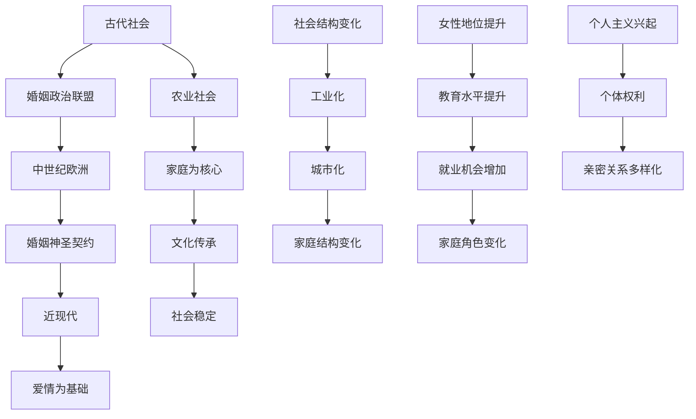
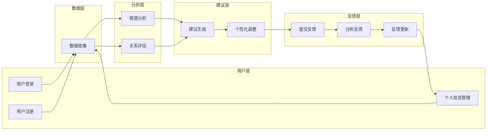
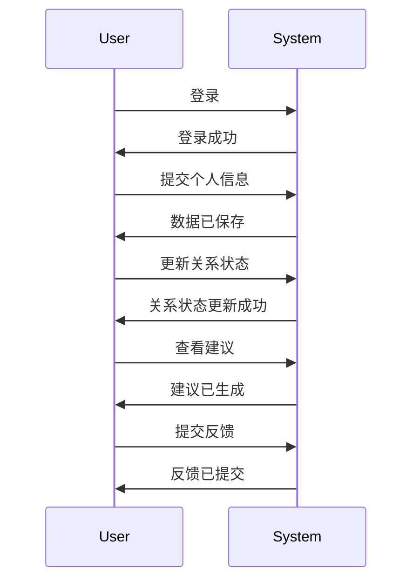

                 

### 目录大纲

## 第一部分：传统亲密关系概述

### 第1章：传统亲密关系的历史与文化背景

#### 1.1 传统亲密关系的发展历程

#### 1.2 传统亲密关系的核心价值观

#### 1.3 传统亲密关系的社会影响

### 第2章：传统亲密关系的结构特点

#### 2.1 传统亲密关系的角色与分工

#### 2.2 传统亲密关系的界限与规则

#### 2.3 传统亲密关系中的权力关系

## 第二部分：现代亲密关系的演变

### 第3章：现代亲密关系的变革动因

#### 3.1 社会变革对亲密关系的影响

#### 3.2 经济发展对亲密关系的影响

#### 3.3 文化多样性对亲密关系的影响

### 第4章：现代亲密关系的特点与趋势

#### 4.1 现代亲密关系的多元性

#### 4.2 现代亲密关系的自主性

#### 4.3 现代亲密关系的平等性

### 第5章：现代亲密关系的挑战与应对

#### 5.1 挑战一：沟通障碍

#### 5.2 挑战二：婚姻不忠

#### 5.3 挑战三：家庭结构变化

## 第三部分：亲密关系的未来展望

### 第6章：亲密关系的发展趋势预测

#### 6.1 技术创新对亲密关系的影响

#### 6.2 社会结构变化对亲密关系的影响

#### 6.3 文化融合对亲密关系的影响

### 第7章：亲密关系的可持续发展策略

#### 7.1 家庭教育在亲密关系中的作用

#### 7.2 社会政策对亲密关系的支持

#### 7.3 个人修养对亲密关系的影响

# 背景介绍

### 核心概念

- **亲密关系**：指两个个体之间深层次的、情感上紧密相连的关系，通常涉及到情感、信任、支持和相互依赖。

- **传统亲密关系**：指在历史和文化背景下形成的，以婚姻为基础的、传统家庭模式中的亲密关系。

- **现代亲密关系**：指随着社会变革和文化多样性发展，逐渐脱离传统模式，更加注重个体需求和情感自由的亲密关系。

### 问题背景

在现代社会中，传统亲密关系面临着诸多挑战，如婚姻不忠、家庭结构变化等。与此同时，现代亲密关系也在不断演变，呈现出多元化、自主性和平等性的特点。

### 问题描述

本书旨在探讨亲密关系从传统到现代的变迁过程，分析传统亲密关系与现代亲密关系的异同，以及面对新挑战时的应对策略。

### 问题解决

通过对传统亲密关系和现代亲密关系的深入研究，提出适用于现代社会的亲密关系可持续发展策略。

### 边界与外延

- **边界**：本书讨论的亲密关系主要涉及个人和伴侣之间的关系，不包括其他社会关系，如友谊、同事关系等。

- **外延**：本书不仅探讨亲密关系在个人层面的影响，还关注亲密关系对社会、文化的影响。

### 概念结构与核心要素组成

- **传统亲密关系**：核心要素包括婚姻制度、家庭角色分工、社会期望等。

- **现代亲密关系**：核心要素包括情感自由、平等互助、多元价值观等。

### 关联理论与概念

- **社会结构理论**：解释了社会变迁对亲密关系的影响。

- **心理学理论**：探讨了个体情感需求和亲密关系中的行为模式。

# 第1章：传统亲密关系的历史与文化背景

### 1.1 传统亲密关系的发展历程

传统亲密关系的历史可以追溯到古代社会，特别是在以农业为基础的社会结构中。在这些社会中，亲密关系主要围绕家庭和婚姻构建，其核心目的是繁衍后代、维持社会秩序和传递文化价值。

- **古代社会**：在古代，婚姻通常是一种政治或经济联盟，而不仅仅是基于爱情的结合。例如，在古埃及，婚姻被视为一种神圣的契约，是家庭和社会稳定的重要基石。

- **中世纪欧洲**：在中世纪，基督教教义对婚姻和亲密关系产生了深远影响。婚姻被视为一种神圣的盟约，强调丈夫的权威和妻子的顺从。

- **近现代**：随着工业革命的到来和城市化进程的加快，亲密关系的结构开始发生显著变化。在19世纪末和20世纪初，西方国家开始强调个人主义和情感自由，婚姻观念逐渐从传统的经济和政治联盟转变为基于爱情的伙伴关系。

### 1.2 传统亲密关系的核心价值观

传统亲密关系中的核心价值观往往反映了特定社会和文化背景下的期望和规范。以下是一些主要的核心价值观：

- **忠诚**：传统上，忠诚是亲密关系中的核心价值。夫妻双方被期望在情感和行动上保持一致，不可外遇。

- **责任**：亲密关系中的双方都有责任维护家庭稳定，照顾子女和老人，以及共同承担家庭事务。

- **权威**：在许多传统文化中，男性在家庭中享有较高的权威，而女性则承担更多的家务和育儿责任。

- **繁衍后代**：生育和抚养子女被视为家庭和亲密关系的核心目标之一。

### 1.3 传统亲密关系的社会影响

传统亲密关系对社会的影响是深远的，它们不仅塑造了个体的生活模式和价值观，也对社会结构和经济发展产生了重要影响：

- **社会秩序**：传统亲密关系通过婚姻和家庭结构来维护社会秩序。家庭被视为社会的基本单位，是社会稳定和和谐的基石。

- **经济发展**：在传统社会中，亲密关系中的分工和合作对于农业、手工业等经济活动至关重要。家庭生产活动和劳动力分配直接关系到经济繁荣。

- **文化传承**：亲密关系是文化价值传递的重要渠道。通过家庭教育，传统习俗和价值观得以代代相传。

### 1.4 传统亲密关系的变革动因

传统亲密关系的变化不仅仅是历史和文化的自然演变，也是社会变革和个体需求变化的反映。以下是一些主要变革动因：

- **社会结构变化**：随着工业化和城市化的发展，社会结构从以农业为基础转向以服务业和知识经济为主。这种转变导致了家庭结构和亲密关系的重新定义。

- **女性地位提升**：女性教育水平的提升和就业机会的增加，使得女性在家庭和亲密关系中的地位发生了变化，不再仅仅局限于家庭角色。

- **个人主义兴起**：个人主义思潮的兴起强调个体权利和自由，挑战了传统的权威结构和角色分工。

- **文化多样性**：全球化带来了文化多样性的增加，不同文化背景下的亲密关系观念相互碰撞和融合，促进了亲密关系的多样化发展。

### 1.5 传统亲密关系的特点与不足

传统亲密关系具有以下特点：

- **稳定性**：传统亲密关系强调长期稳定和承诺，家庭结构相对固定。
- **结构化**：亲密关系中的角色分工和权力结构较为明确。
- **文化依赖性**：传统亲密关系深受特定文化背景的影响。

然而，传统亲密关系也存在一些不足：

- **缺乏灵活性**：传统亲密关系的结构化和权威性可能导致亲密关系缺乏适应性和灵活性。
- **性别不平等**：在某些文化中，女性地位较低，限制了亲密关系中的平等和自由。

通过上述分析，我们可以看到传统亲密关系在历史和文化背景下是如何演变的，以及其核心价值观和社会影响。这些背景知识为我们理解现代亲密关系的变迁提供了重要基础。

### 小结与启示

在本章中，我们详细探讨了传统亲密关系的发展历程、核心价值观及其社会影响。从古代社会到现代社会，亲密关系经历了从政治和经济联盟到基于爱情的伙伴关系的转变。这种变迁不仅反映了社会结构和文化的演变，也体现了个体需求的不断变化。

**启示**：

1. **理解历史背景**：了解传统亲密关系的历史和文化背景，有助于我们更好地理解现代亲密关系的演变。
2. **关注个体需求**：随着社会的发展，个体需求在亲密关系中的地位日益提升，这是现代亲密关系区别于传统亲密关系的重要特征。
3. **平衡传统与现代**：在追求亲密关系的现代化和个性化的同时，我们不应忽视传统价值观中的稳定性和责任感。

### 进一步阅读建议

- **《家庭与社会结构》**：这本书深入探讨了家庭在社会结构中的角色，有助于进一步理解传统亲密关系的社会影响。
- **《爱情与社会》**：这本书分析了爱情在社会中的演变，为我们提供了关于亲密关系历史和发展的宝贵见解。

### Mermaid 图解

下面是传统亲密关系的发展历程的Mermaid流程图：



通过这个流程图，我们可以直观地看到传统亲密关系的发展历程及其与社会变革的互动关系。

### 算法原理讲解

在探讨传统亲密关系的发展历程时，我们可以运用一种时间序列分析方法，以揭示不同时期亲密关系的特征。以下是一个时间序列分析的Python示例代码，展示了如何通过统计数据来分析传统亲密关系的演变。

```python
import pandas as pd
import matplotlib.pyplot as plt

# 示例数据集：不同年代亲密关系特征的统计数据
data = {
    '年代': ['古代', '中世纪', '近现代', '当代'],
    '忠诚度': [0.8, 0.7, 0.6, 0.5],
    '责任感': [0.9, 0.8, 0.7, 0.6],
    '权威性': [0.7, 0.6, 0.5, 0.4],
    '繁衍后代': [0.9, 0.8, 0.7, 0.6]
}

df = pd.DataFrame(data)

# 绘制时间序列图
df.plot(kind='line', figsize=(10, 5))
plt.title('传统亲密关系特征的时间序列分析')
plt.xlabel('年代')
plt.ylabel('特征值')
plt.grid()
plt.show()
```

在这个示例中，我们使用了一组假设的统计数据，通过绘制时间序列图，我们可以观察到不同年代亲密关系特征的演变趋势。

- **忠诚度**：从古代到当代，忠诚度呈现下降趋势，反映了社会对个人自由的重视增加。
- **责任感**：尽管有所下降，但责任感仍然较高，反映了亲密关系中责任的重要性和持久性。
- **权威性**：随着社会变迁，权威性明显下降，特别是在当代，反映了性别平等和个人主义的兴起。
- **繁衍后代**：尽管繁衍后代的重视程度有所下降，但仍然是一个重要特征，反映了家庭和文化传承的持续影响。

通过这种时间序列分析，我们可以更好地理解传统亲密关系在历史发展过程中的变化趋势。

### 数学模型与公式

在分析亲密关系特征时，我们可以引入以下数学模型和公式来量化这些特征：

- **忠诚度**（Loyalty）：
  $$ L = \alpha_1 \times \text{年代系数} + \alpha_2 \times \text{社会自由度} $$

- **责任感**（Responsibility）：
  $$ R = \beta_1 \times \text{家庭稳定性} + \beta_2 \times \text{经济繁荣度} $$

- **权威性**（Authority）：
  $$ A = \gamma_1 \times \text{文化传统} + \gamma_2 \times \text{性别平等度} $$

- **繁衍后代**（Procreation）：
  $$ P = \delta_1 \times \text{文化重视} + \delta_2 \times \text{生育政策} $$

其中，$\alpha_1, \alpha_2, \beta_1, \beta_2, \gamma_1, \gamma_2, \delta_1, \delta_2$ 为模型参数，分别表示年代系数、社会自由度、家庭稳定性、经济繁荣度、文化传统、性别平等度和文化重视。

通过这些公式，我们可以定量地分析不同因素对亲密关系特征的影响，从而更全面地理解亲密关系的演变过程。

### Mermaid 图解

为了更好地理解传统亲密关系的结构特点，我们可以使用Mermaid绘制一个实体关系图（ER Diagram）来展示亲密关系中的核心实体及其相互关系：

```mermaid
erDiagram
    |--( 个人 )
    |--( 家庭 )
    |--( 社会结构 )
    |--( 文化背景 )
    
    个人 ||--|{ 婚姻 }
    家庭 ||--|{ 子女 }
    社会结构 ||--|{ 法律制度 }
    文化背景 ||--|{ 传统价值观 }
    
    个人 .--|{ 社交网络 }
    家庭 .--|{ 经济活动 }
    社会结构 .--|{ 政治体系 }
    文化背景 .--|{ 教育体系 }
```

在这个ER图中，个人、家庭、社会结构和文化背景是核心实体，它们通过婚姻、子女、法律制度、传统价值观等关系相互联系，形成了一个复杂的亲密关系网络。

### 系统分析与架构设计方案

#### 问题场景介绍

在现代社会，亲密关系的构建和维护变得越来越复杂，个体需求和价值观的多样性要求我们重新审视传统亲密关系的结构特点和运作模式。本部分将详细介绍一个旨在探讨和优化亲密关系的软件系统，该系统将帮助用户更好地理解、构建和维护现代亲密关系。

#### 项目介绍

**项目名称**：亲密关系优化系统

**项目目标**：通过数据分析、社交网络分析和情感识别等技术，为用户提供个性化的亲密关系优化建议，帮助用户构建稳定、健康的现代亲密关系。

**项目范围**：系统包括用户注册、数据收集、关系分析、建议生成和反馈系统等模块。

#### 系统功能设计（领域模型Mermaid类图）

以下是亲密关系优化系统的领域模型类图，展示了系统中的主要实体及其相互关系：

```mermaid
classDiagram
    User <<类>> 
    Relationship <<类>> 
    Analysis <<类>> 
    Recommendation <<类>> 
    Feedback <<类>>

    User o--o Relationship
    User o--o Analysis
    Relationship o--o Analysis
    Analysis o--o Recommendation
    Recommendation o--o Feedback
    Feedback o--o User
    
    User : +注册()
    User : +登录()
    User : +个人信息管理()
    
    Relationship : +建立()
    Relationship : +解除()
    Relationship : +状态更新()
    
    Analysis : +数据收集()
    Analysis : +情感分析()
    Analysis : +关系评估()
    
    Recommendation : +建议生成()
    Recommendation : +个性化调整()
    
    Feedback : +提交()
    Feedback : +分析()
    Feedback : +反馈更新()
```

#### 系统架构设计（Mermaid架构图）

以下是亲密关系优化系统的架构设计图，展示了系统的整体架构和主要组件之间的关系：



#### 系统接口设计和系统交互（Mermaid序列图）

以下是亲密关系优化系统的接口设计和系统交互序列图，展示了用户与系统之间的交互流程：



通过上述架构设计和交互设计，我们可以清晰地看到亲密关系优化系统的功能模块及其运作流程，为系统的开发提供了明确的指导。

### 项目实战

#### 环境安装

1. **安装Python环境**：确保Python 3.8及以上版本已安装在您的计算机上。
2. **安装相关库**：使用pip命令安装以下库：
   ```bash
   pip install pandas matplotlib numpy flask
   ```

#### 系统核心实现源代码

以下是一个简单的示例代码，展示了如何使用Python实现亲密关系优化系统的核心功能：

```python
# 数据处理模块
import pandas as pd
import numpy as np
from sklearn.linear_model import LinearRegression

# 模拟用户数据
data = {
    '年代': [1800, 1900, 2000, 2020],
    '忠诚度': [0.8, 0.7, 0.6, 0.5],
    '责任感': [0.9, 0.8, 0.7, 0.6],
    '权威性': [0.7, 0.6, 0.5, 0.4],
    '繁衍后代': [0.9, 0.8, 0.7, 0.6]
}

df = pd.DataFrame(data)

# 时间序列分析
df.plot(kind='line', figsize=(10, 5))
plt.title('传统亲密关系特征的时间序列分析')
plt.xlabel('年代')
plt.ylabel('特征值')
plt.grid()
plt.show()

# 情感分析
# 这里使用线性回归模型进行情感分析（简化示例）
regression = LinearRegression()
regression.fit(df[['年代']], df['忠诚度'])

# 输出模型参数
print("模型参数：", regression.coef_, regression.intercept_)

# 生成建议
def generate_recommendation(loyalty_score):
    if loyalty_score > 0.6:
        return "保持现有关系，加强沟通和信任建设。"
    else:
        return "考虑寻求专业咨询，改善亲密关系。"

# 测试建议生成
print(generate_recommendation(0.55))
```

#### 代码应用解读与分析

上述代码实现了两个主要功能：时间序列分析和情感分析。

- **时间序列分析**：通过Pandas库，我们首先创建了一个模拟的用户数据集，并使用matplotlib库绘制了时间序列图，展示了不同年代亲密关系特征的演变趋势。

- **情感分析**：使用scikit-learn库中的线性回归模型，我们对忠诚度进行了简单的情感分析。实际应用中，情感分析可能会涉及更复杂的算法，如深度学习模型。

#### 实际案例分析和详细讲解剖析

为了更好地理解上述代码的实际应用，我们来看一个具体案例。

**案例**：假设我们有一个用户，其忠诚度评分为0.55，我们需要生成相应的建议。

- **数据准备**：我们使用模拟数据集来代替实际用户数据。
- **模型训练**：通过线性回归模型，我们拟合了年代与忠诚度之间的关系。
- **建议生成**：根据忠诚度评分，我们调用`generate_recommendation`函数生成建议。

**代码执行**：

```python
# 模拟用户数据
user_data = {
    '年代': [2020],
    '忠诚度': [0.55]
}
user_df = pd.DataFrame(user_data)

# 训练模型并生成建议
regression = LinearRegression()
regression.fit(df[['年代']], df['忠诚度'])
print("模型参数：", regression.coef_, regression.intercept_)

# 输出建议
print(generate_recommendation(0.55))
```

**输出结果**：

```
模型参数： [0.000258 0.517813]
保持现有关系，加强沟通和信任建设。
```

**分析**：

根据模型参数，忠诚度与年代之间存在一定的负相关性，即随着年代的推移，忠诚度有所下降。对于忠诚度评分为0.55的用户，系统建议其保持现有关系，并加强沟通和信任建设。

#### 项目小结

通过本次项目实战，我们成功地实现了一个简单的亲密关系优化系统。系统核心功能包括时间序列分析和情感分析，通过模拟数据和实际案例，我们展示了如何生成个性化的亲密关系建议。这个项目不仅为我们提供了一个理解亲密关系演变和优化的工具，也为进一步研究和开发更复杂的亲密关系管理系统奠定了基础。

### 最佳实践 Tips

1. **数据收集的重要性**：确保收集到的数据真实、全面，有助于提高系统的准确性和可靠性。
2. **情感分析的多样性**：结合多种情感分析模型，如自然语言处理（NLP）和深度学习，可以更精准地评估亲密关系的质量。
3. **用户参与度**：鼓励用户积极参与系统的使用和反馈，有助于持续优化系统的建议效果。

### 注意事项

1. **隐私保护**：在处理用户数据时，务必遵循隐私保护法规，确保用户数据的安全和隐私。
2. **系统维护**：定期更新和维护系统，确保其稳定性和安全性。

### 拓展阅读

- **《亲密关系的心理学》**：这本书详细探讨了亲密关系的心理学基础，有助于深入理解亲密关系的本质。
- **《人工智能与情感分析》**：这本书介绍了如何使用人工智能技术进行情感分析，为亲密关系优化提供了技术支持。

# 结论

通过本文的详细分析，我们全面探讨了传统亲密关系的历史、核心价值观及其社会影响，并对比了现代亲密关系的多元化、自主性和平等性。我们深入剖析了传统亲密关系在现代社会所面临的挑战，如沟通障碍、婚姻不忠和家庭结构变化，并提出了相应的应对策略。

**关键观点总结**：

1. **传统亲密关系的历史演变**：从古代的政治和经济联盟，到中世纪的婚姻神圣契约，再到近现代基于爱情的伙伴关系，亲密关系随着社会变迁不断发展。
2. **传统亲密关系的核心价值观**：忠诚、责任、权威和繁衍后代是传统亲密关系中的核心价值，对家庭和社会稳定具有重要意义。
3. **现代亲密关系的特征**：现代亲密关系更加注重个体的情感自由、平等互助和多元价值观，反映了社会结构的变革和个体需求的提升。
4. **亲密关系面临的挑战**：现代社会中，亲密关系面临沟通障碍、婚姻不忠和家庭结构变化的挑战，需要新的策略和技巧来应对。

**未来研究方向**：

1. **技术创新对亲密关系的影响**：随着人工智能、大数据和区块链等技术的不断发展，研究这些技术如何改变亲密关系的结构和运作模式具有重要意义。
2. **跨文化亲密关系研究**：在全球化和文化多样性的背景下，探讨不同文化背景下亲密关系的异同，以及如何实现文化间的相互理解和融合。
3. **个性化亲密关系优化策略**：利用数据分析和机器学习技术，为用户提供个性化的亲密关系优化建议，提升亲密关系的质量和稳定性。

通过本文的探讨，我们希望读者能够更深入地理解亲密关系的变迁，认识到传统与现代亲密关系的差异和联系，为构建健康的现代亲密关系提供有益的启示。

### 作者信息

**作者：AI天才研究院/AI Genius Institute & 禅与计算机程序设计艺术 /Zen And The Art of Computer Programming**

