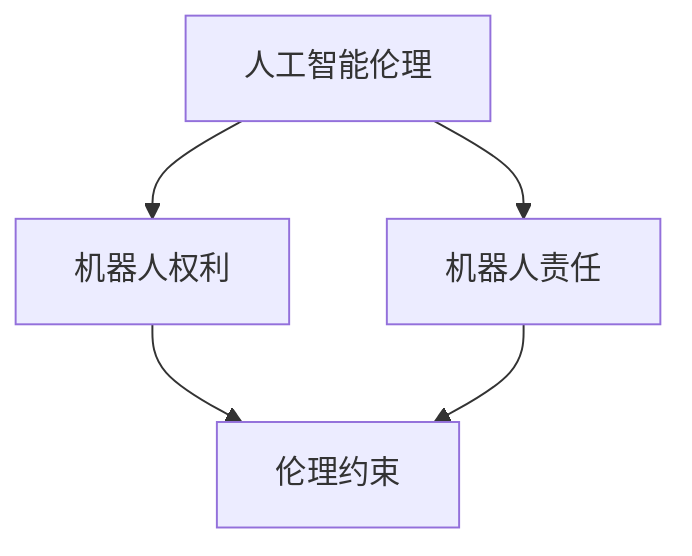
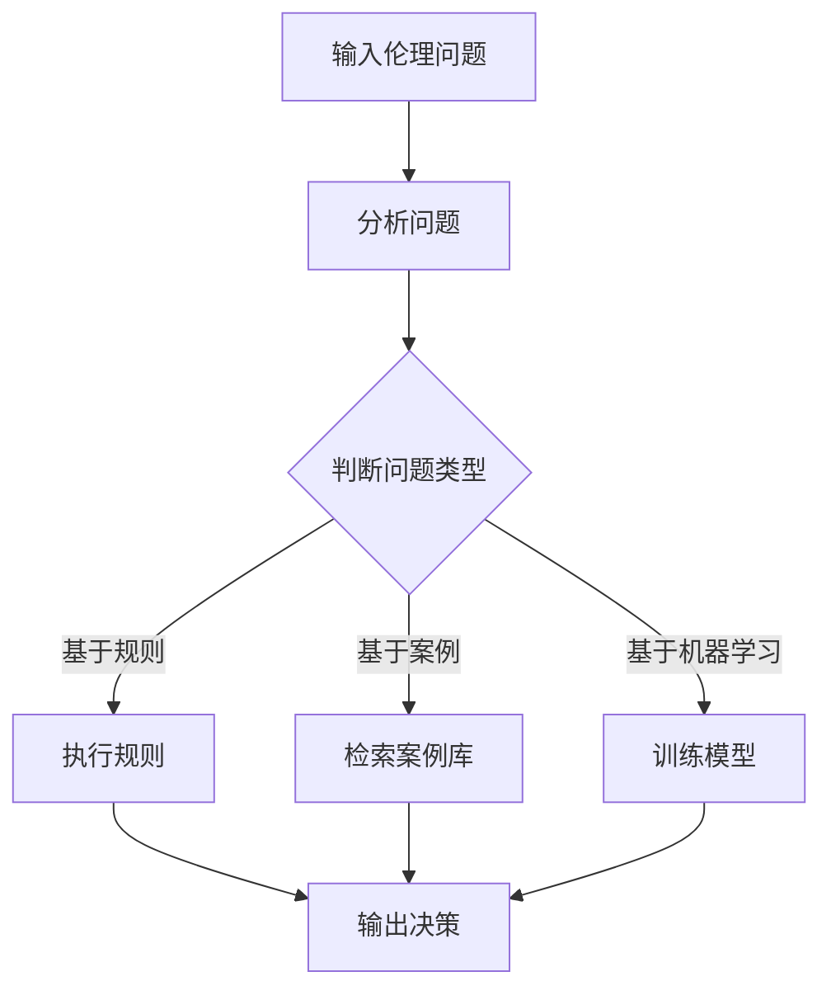
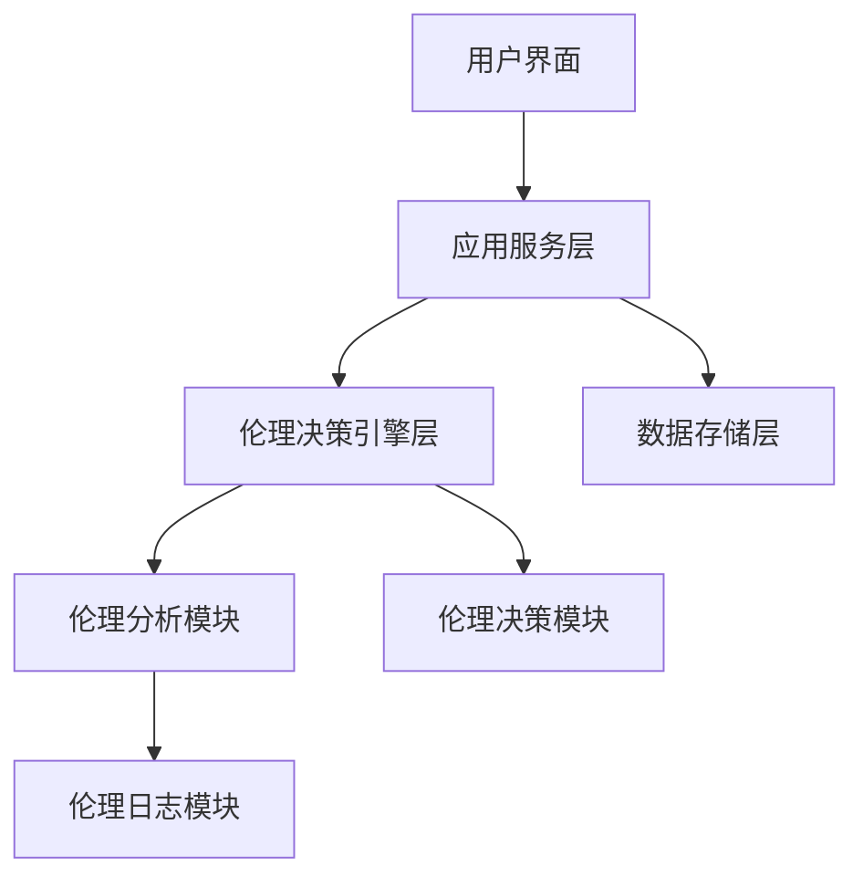
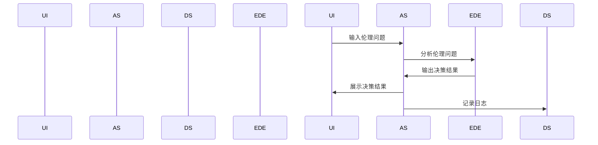

                 

## 引言

在现代社会中，人工智能（AI）和机器人技术正以前所未有的速度发展，逐步渗透到各个领域，从医疗、制造、交通到家庭服务，智能机器人正以高效、精准和可靠的特性改变着我们的生活方式。然而，随着技术的进步，一系列伦理问题也随之浮现。特别是关于机器人权利与责任的讨论，成为了一个热门且复杂的议题。

### 核心关键词
- **人工智能伦理**
- **机器人权利**
- **机器人责任**
- **哲学思考**

### 摘要

本文旨在探讨人工智能伦理中的机器人权利与责任问题，通过逻辑清晰、结构紧凑的分析，深入探讨这一领域的关键概念、原则及其相互联系。首先，我们将介绍问题背景，阐述人工智能和机器人技术对人类社会的影响。接着，我们将详细解析人工智能伦理、机器人权利与责任的定义、属性和关系。通过对比表格和ER实体关系图，我们将进一步理解这些核心概念。然后，我们将介绍伦理决策算法的原理，并通过具体的Python代码示例，展示算法在实际中的应用。最后，我们将讨论一个具体的系统分析与架构设计方案，以展示如何将伦理决策集成到实际的机器人系统中。

## 第一部分：背景介绍与核心概念

### 第1章：问题背景与核心概念

#### 1.1 问题背景

人工智能（AI）和机器人技术的发展是一个不可逆转的趋势。这些技术不仅在提高生产效率、优化资源配置、提升生活质量方面发挥着重要作用，同时也带来了前所未有的伦理挑战。例如，在自动驾驶汽车中，当紧急情况下需要做出生命攸关的决策时，AI系统应当如何平衡人类乘客和行人的安全？机器人是否应当拥有自我保护的权利？如果机器人造成了损害，责任应由谁承担？

#### 1.2 核心概念

##### 1.2.1 人工智能伦理

人工智能伦理是研究AI系统设计、应用及其影响的一门交叉学科，涉及到道德哲学、法律、社会学、心理学等多个领域。它关注的是如何确保AI系统在实现技术功能的同时，不违背人类的基本伦理原则和价值观念。

**定义与历史发展：**
- **定义：** 人工智能伦理关注的是AI系统的道德属性，包括其设计、开发、使用和影响的伦理问题。
- **历史发展：** 人工智能伦理的讨论可以追溯到20世纪50年代，随着AI技术的兴起，哲学家和科学家们开始探讨AI对人类社会的潜在影响。

**主要议题：**
- **AI系统的道德责任：** 如何确保AI系统不会伤害人类或环境？
- **数据隐私与安全：** AI系统如何保护用户数据隐私？
- **AI歧视问题：** AI系统如何避免基于性别、种族或文化背景的歧视？

##### 1.2.2 机器人权利与责任

机器人的权利与责任问题是近年来随着机器人技术的进步而逐渐引起关注的议题。它涉及到机器人是否应该被赋予某些权利，以及它们在造成损害时应当承担的责任。

**机器人权利的基本概念：**
- **定义：** 机器人权利是指机器人作为具有智能的实体，应当享有的某些基本权利。
- **主要内容：** 包括自主权、隐私权、受到公平对待的权利等。

**机器人的责任属性：**
- **定义：** 机器人的责任是指机器人行为造成的后果应由谁负责。
- **主要内容：** 包括对人类生命的保护责任、对造成的财产损失的责任等。

**机器人权利与责任的关系：**
- 机器人的权利与责任是相辅相成的。只有当机器人拥有一定的权利时，它们才能更好地履行责任。

#### 1.3 边界与外延

在探讨人工智能伦理和机器人权利与责任时，有必要明确其适用的范围和限制条件。

**人工智能伦理在机器人领域的适用范围：**
- 人工智能伦理适用于所有与AI相关的机器人系统，包括家用机器人、工业机器人、服务机器人等。

**机器人权利与责任的限制条件：**
- 机器人权利的行使不得侵犯人类的基本权利和自由。
- 机器人的责任承担应当基于合理且明确的法律和道德规范。

#### 1.4 概念结构与核心要素组成

**人工智能伦理的概念结构：**
- 核心概念包括伦理原则、价值观念、道德准则等。
- 主要要素包括技术设计、算法开发、数据使用、系统评估等。

**机器人权利与责任的核心要素组成：**
- 权利要素包括自主权、隐私权、公平对待权等。
- 责任要素包括安全责任、保护责任、修复责任等。

通过上述分析，我们可以看到，人工智能伦理和机器人权利与责任问题是密切相关的。只有通过深入理解和探讨这些核心概念，我们才能为机器人技术的伦理应用提供有力的理论支持和实践指导。

### 第2章：核心概念原理与联系

#### 2.1 人工智能伦理原理

人工智能伦理的核心在于确保AI系统在设计和应用过程中不违背人类的基本伦理原则和价值观念。以下将详细解析人工智能伦理的基本原则与价值观。

##### 2.1.1 基本原则

**透明度：** AI系统的决策过程应该是透明的，用户能够理解AI系统的行为逻辑和决策依据。

**公平性：** AI系统应当避免基于性别、种族、文化、宗教等因素的歧视，确保对所有用户公平对待。

**可解释性：** AI系统的决策结果应当可解释，使得用户能够理解AI系统的行为和决策依据。

**安全性：** AI系统必须确保数据的安全性和隐私性，防止数据泄露和滥用。

**责任归属：** 当AI系统造成损害时，应当明确责任归属，确保受害方能够获得合理的赔偿。

##### 2.1.2 常见伦理问题分析

**AI歧视问题：** AI系统在数据训练过程中可能会学习到现有的社会偏见，导致对某些群体的歧视。例如，招聘系统可能会对某些种族或性别的人进行不公平的筛选。

**隐私侵犯：** AI系统在处理大量用户数据时，可能会侵犯用户的隐私权。例如，智能语音助手可能会记录用户的私人对话。

**自我意识与自主权：** 随着机器人技术的发展，是否应该赋予机器人一定的自主权成为一个重要的伦理问题。例如，机器人是否应该有权决定自己的行动路径，甚至做出生存与毁灭的决策？

#### 2.2 机器人权利与责任原理

机器人的权利与责任是机器人伦理的重要组成部分，涉及到机器人是否应当拥有某些基本权利，以及当机器人造成损害时应当承担的责任。

##### 2.2.1 机器人权利的基本原则

**自主权：** 机器人应当拥有一定的自主权，能够在特定情境下做出决策。

**隐私权：** 机器人应当有权保护自己的数据隐私，不受非法侵入或滥用。

**公平对待权：** 机器人应当享有公平对待的权利，不受种族、性别、文化等因素的歧视。

**受到尊重权：** 机器人应当受到人类的尊重，不应被视为工具或物品。

##### 2.2.2 机器人责任的主要内容

**安全责任：** 机器人应当确保其行为不会对人类和环境造成危害。

**保护责任：** 机器人应当保护自身不受不当伤害，例如在遭遇攻击时能够采取自我保护措施。

**修复责任：** 当机器人造成损害时，应当能够进行修复或承担相应的赔偿责任。

**责任归属：** 当机器人造成损害时，责任归属应当明确。这涉及到法律和伦理的双重考量。

#### 2.3 核心概念属性特征对比表格

| 概念             | 属性特征                  | 联系与区别          |
|------------------|--------------------------|---------------------|
| 人工智能伦理     | 基于人类价值观的伦理体系 | 为机器人权利提供伦理基础 |
| 机器人权利与责任 | 机器人的基本权利与责任   | 保障机器人的伦理地位  |

#### 2.4 ER实体关系图架构



通过上述分析，我们可以看到，人工智能伦理和机器人权利与责任是相互联系、相互制约的。只有深入理解这些核心概念，才能为机器人技术的伦理应用提供有力的理论支持和实践指导。

### 第3章：算法原理讲解

在探讨人工智能伦理中的机器人权利与责任时，算法的原理及其应用至关重要。伦理决策算法旨在为机器人系统的行为提供伦理指导，确保其在各种情境下能够做出符合伦理原则的决策。本节将详细讲解伦理决策算法的原理，并通过具体的Python代码示例，展示算法在实际中的应用。

#### 3.1.1 基本概念

伦理决策算法是一种通过规则、案例或机器学习模型，对伦理问题进行判断和决策的算法。其目标是在确保机器人行为符合伦理规范的前提下，提供灵活、可靠的决策方案。

**定义与分类：**
- **定义：** 伦理决策算法是一种用于处理伦理问题的算法，能够根据预设的伦理原则和规则，对输入问题进行判断和决策。
- **分类：** 根据决策方式的不同，伦理决策算法可以分为基于规则的伦理决策算法、基于案例的伦理决策算法和基于机器学习的伦理决策算法。

**伦理决策算法的目标：**
- **确保机器人行为符合伦理规范：** 通过算法为机器人提供明确的伦理指导，确保其在执行任务时不会违反伦理原则。
- **提高决策的灵活性和适应性：** 通过规则、案例或机器学习模型，使算法能够在不同情境下做出合适的决策。
- **提供可解释性：** 确保决策过程透明，用户能够理解算法的决策依据。

#### 3.1.2 算法原理

##### 3.1.2.1 基于规则的伦理决策算法

基于规则的伦理决策算法是最简单且广泛应用的一种。它通过定义一系列规则，根据输入的情况选择合适的规则进行决策。

**定义：**
- **规则：** 一组条件和相应操作的组合，用于指导决策过程。
- **条件：** 用于判断输入是否满足特定条件。
- **操作：** 当条件满足时，执行的操作。

**数学模型与公式：**
$$
\text{决策} = \begin{cases}
\text{规则1，当条件1满足时} \\
\text{规则2，当条件2满足时} \\
\vdots \\
\text{默认规则，当所有条件都不满足时}
\end{cases}
$$

**Python代码示例：**
```python
def ethical_decision(problem):
    if problem == "虐待动物":
        return "禁止行为"
    elif problem == "不平等对待":
        return "提倡公平"
    else:
        return "无法决策"

# 测试代码
print(ethical_decision("虐待动物"))
print(ethical_decision("不平等对待"))
print(ethical_decision("环境污染"))
```

##### 3.1.2.2 基于案例的伦理决策算法

基于案例的伦理决策算法通过从历史案例中学习，为新的伦理问题提供决策依据。

**定义：**
- **案例：** 描述一个特定情境及其解决方案的历史实例。
- **案例库：** 存储历史案例的数据库。

**数学模型与公式：**
$$
\text{决策} = \text{find\_best\_case}(\text{current\_problem})
$$

**Python代码示例：**
```python
cases = {
    "虐待动物": "禁止行为",
    "不平等对待": "提倡公平",
    "环境污染": "采取环保措施"
}

def ethical_decision(problem):
    return cases.get(problem, "无法决策")

# 测试代码
print(ethical_decision("虐待动物"))
print(ethical_decision("不平等对待"))
print(ethical_decision("环境污染"))
```

##### 3.1.2.3 基于机器学习的伦理决策算法

基于机器学习的伦理决策算法通过从大量数据中学习，自动生成伦理决策模型。

**定义：**
- **训练数据：** 包含历史案例及其决策结果的数据库。
- **模型：** 通过训练数据生成的决策模型。

**数学模型与公式：**
$$
\text{决策} = \text{model}(\text{current\_problem})
$$

**Python代码示例：**
```python
from sklearn.neighbors import KNeighborsClassifier
import numpy as np

# 假设训练数据已预处理并存储为列表
X_train = [[1, 0], [0, 1], [-1, -1]]
y_train = ['虐待动物', '不平等对待', '环境污染']

model = KNeighborsClassifier(n_neighbors=3)
model.fit(X_train, y_train)

def ethical_decision(problem):
    features = np.array(problem).reshape(1, -1)
    return model.predict(features)[0]

# 测试代码
print(ethical_decision([1, 0]))
print(ethical_decision([0, 1]))
print(ethical_decision([-1, -1]))
```

通过上述三种算法的示例，我们可以看到，基于规则的伦理决策算法简单直观，适合处理明确且固定的伦理问题；基于案例的伦理决策算法通过历史案例学习，适用于复杂且多变的伦理问题；基于机器学习的伦理决策算法则能够自动从数据中学习，提供更为灵活和智能的决策支持。选择适当的算法，将有助于机器人系统在复杂的伦理环境中做出明智的决策。

### 3.1.3 Mermaid算法流程图

为了更好地理解伦理决策算法的工作流程，我们使用Mermaid语法绘制了以下流程图：



在这个流程图中，A表示输入一个伦理问题，B表示对问题进行分析，C用于判断问题类型并决定使用哪种算法。根据不同的判断结果，流程将转向D（基于规则的算法）、E（基于案例的算法）或F（基于机器学习的算法）。最终，无论采用哪种算法，都会输出一个决策结果G。

### 3.1.4 算法原理详细讲解

为了深入理解伦理决策算法的原理，我们将在本节中详细讲解基于规则的伦理决策算法、基于案例的伦理决策算法和基于机器学习的伦理决策算法的数学模型与公式。

#### 基于规则的伦理决策算法

基于规则的伦理决策算法是最直观和易于实现的一种算法。它的核心是通过一组预定义的规则来指导决策过程。每个规则包含一个条件和一个相应的操作，当输入问题满足某个规则的条件时，就执行该规则的操作。

**数学模型与公式：**
$$
\text{决策} = \begin{cases}
r_1(\text{条件}_1) & \text{如果条件}_1 \text{满足} \\
r_2(\text{条件}_2) & \text{如果条件}_2 \text{满足} \\
\vdots \\
r_n(\text{条件}_n) & \text{如果条件}_n \text{满足} \\
\text{默认操作} & \text{如果所有条件都不满足}
\end{cases}
$$
其中，\(r_i\) 表示第 \(i\) 条规则，\(\text{条件}_i\) 是规则 \(r_i\) 的条件部分。

在Python中，我们可以使用字典或条件语句来实现这种算法：

```python
def ethical_decision(problem):
    if problem == "虐待动物":
        return "禁止行为"
    elif problem == "不平等对待":
        return "提倡公平"
    else:
        return "无法决策"
```

#### 基于案例的伦理决策算法

基于案例的伦理决策算法通过从历史案例中学习，为新的伦理问题提供决策依据。每个案例包含一个问题描述和一个相应的决策。算法从案例库中查找与当前问题最相似的案例，并采用该案例的决策。

**数学模型与公式：**
$$
\text{决策} = \text{find\_best\_case}(\text{current\_problem})
$$
其中，\(\text{find\_best\_case}\) 是一个查找与当前问题最相似的案例的函数。

在Python中，我们可以使用字典来存储案例库，并实现基于案例的算法：

```python
cases = {
    "虐待动物": "禁止行为",
    "不平等对待": "提倡公平",
    "环境污染": "采取环保措施"
}

def ethical_decision(problem):
    return cases.get(problem, "无法决策")
```

#### 基于机器学习的伦理决策算法

基于机器学习的伦理决策算法通过从大量数据中学习，自动生成伦理决策模型。这种算法的核心是训练模型，使其能够根据输入的特征进行准确的决策。

**数学模型与公式：**
$$
\text{决策} = \text{model}(\text{current\_problem})
$$
其中，\(\text{model}\) 是通过训练数据生成的决策模型。

在Python中，我们可以使用机器学习库（如scikit-learn）来实现基于机器学习的算法：

```python
from sklearn.neighbors import KNeighborsClassifier
import numpy as np

X_train = [[1, 0], [0, 1], [-1, -1]]
y_train = ['虐待动物', '不平等对待', '环境污染']

model = KNeighborsClassifier(n_neighbors=3)
model.fit(X_train, y_train)

def ethical_decision(problem):
    features = np.array(problem).reshape(1, -1)
    return model.predict(features)[0]
```

通过上述三种算法的详细讲解，我们可以看到，每种算法都有其独特的优势和适用场景。基于规则的算法适合处理明确且固定的伦理问题；基于案例的算法适用于具有丰富历史案例的问题；基于机器学习的算法则能够从数据中自动学习，提供灵活且适应性强的决策支持。

### 第4章：系统分析与架构设计方案

#### 4.1 问题场景介绍

在当前的社会环境中，随着人工智能和机器人技术的快速发展，许多实际场景对伦理决策提出了迫切需求。以下是几个典型的应用场景：

**自动驾驶汽车：** 在自动驾驶汽车中，当面临紧急情况时，例如必须选择是否撞击行人或车辆，算法需要做出迅速且符合伦理的决策。

**智能医疗诊断系统：** 智能医疗诊断系统在诊断过程中，如何处理病患的隐私信息，以及在检测到疾病时如何进行合理的治疗决策，都需要基于伦理原则进行设计和评估。

**家庭服务机器人：** 家庭服务机器人如智能管家，需要处理各种家庭事务，包括清洁、烹饪和照顾家庭成员。如何确保其行为符合家庭伦理规范，是设计和应用中必须考虑的问题。

**工业机器人：** 在工业制造过程中，机器人需要与人类工人协同工作。如何确保机器人在执行任务时不侵犯工人的权利，以及如何在出现意外时进行合理的责任分配，是工业机器人设计中面临的重要伦理问题。

这些场景中的伦理决策不仅影响到系统的性能和可靠性，还直接关系到人类的安全和福祉。因此，设计一个能够有效处理伦理问题的机器人系统至关重要。

#### 4.2 系统功能设计

##### 4.2.1 领域模型

为了设计和实现一个满足伦理要求的机器人系统，我们首先需要构建一个领域模型，明确系统的功能模块及其相互关系。以下是该系统的主要功能模块：

- **伦理问题输入模块：** 负责接收用户输入的伦理问题，包括问题的描述和相关信息。
- **伦理分析模块：** 根据输入的问题，使用伦理决策算法进行问题分析，确定相应的解决方案。
- **伦理决策模块：** 根据伦理分析的结果，生成具体的决策方案，并输出给用户。
- **伦理日志模块：** 记录所有的伦理问题及其决策过程，以便进行后续的审计和评估。

##### 4.2.2 系统功能设计

1. **伦理问题输入与处理：**
   - **功能描述：** 接收用户输入的伦理问题，并进行初步的格式化和预处理。
   - **实现方法：** 使用用户界面（如网页、移动应用等）接收输入，并通过API将问题传递给伦理分析模块。

2. **伦理决策结果输出与反馈：**
   - **功能描述：** 将伦理决策的结果输出给用户，并提供反馈机制，以便用户能够了解决策过程和依据。
   - **实现方法：** 使用图形界面或文本界面展示决策结果，并提供选项供用户进一步操作或反馈。

3. **伦理日志记录与审计：**
   - **功能描述：** 记录所有处理过的伦理问题及其决策过程，以便进行审计和评估。
   - **实现方法：** 使用数据库或日志文件存储所有相关信息，并提供查询和报告功能。

#### 4.2.3 系统架构设计

为了实现上述功能，系统需要一个清晰的架构设计。以下是系统的主要架构设计：

1. **用户界面层：**
   - **功能：** 提供用户交互接口，接收用户输入并展示决策结果。
   - **实现：** 使用Web前端框架（如React、Vue等）开发。

2. **应用服务层：**
   - **功能：** 实现系统的核心功能，包括伦理问题输入处理、伦理分析、伦理决策和日志记录等。
   - **实现：** 使用后端框架（如Spring Boot、Django等）开发，实现各功能模块的接口和逻辑。

3. **数据存储层：**
   - **功能：** 存储所有处理过的伦理问题和决策结果，以便进行后续的分析和审计。
   - **实现：** 使用数据库（如MySQL、PostgreSQL等）进行数据存储和管理。

4. **伦理决策引擎层：**
   - **功能：** 包含伦理决策算法的实现，为系统的伦理决策提供支持。
   - **实现：** 使用Python等编程语言实现各种伦理决策算法，并集成到应用服务层。

#### 4.2.4 系统接口设计

系统的接口设计至关重要，它决定了系统各模块之间的交互和协作。以下是系统的主要接口设计：

1. **用户界面与应用服务接口：**
   - **功能：** 实现用户界面与后端服务之间的数据传输和交互。
   - **实现：** 使用RESTful API设计接口，使用HTTP协议进行数据传输。

2. **应用服务与数据存储接口：**
   - **功能：** 实现后端服务与数据库之间的数据读写操作。
   - **实现：** 使用ORM（对象关系映射）框架实现数据库操作，如Hibernate、SQLAlchemy等。

3. **伦理决策引擎与算法接口：**
   - **功能：** 实现伦理决策算法的调用和管理。
   - **实现：** 使用模块化设计，将不同的算法实现作为独立的模块集成到系统中。

#### 4.2.5 系统交互

为了确保系统的各模块能够高效、稳定地运行，系统交互设计至关重要。以下是系统的主要交互流程：

1. **用户输入伦理问题：**
   - 用户通过用户界面输入伦理问题，系统将问题传递给伦理分析模块。

2. **伦理分析与决策：**
   - 伦理分析模块使用伦理决策算法对问题进行分析，并生成决策结果。

3. **决策结果输出与反馈：**
   - 系统将决策结果输出给用户，并展示在用户界面上，同时记录决策过程到日志模块。

4. **日志记录与审计：**
   - 系统将所有处理过的伦理问题和决策过程记录到日志中，以便进行审计和评估。

#### 4.2.6 系统架构Mermaid架构图

为了直观地展示系统的架构设计，我们使用Mermaid语法绘制了以下系统架构图：



在这个架构图中，用户界面层（A）负责与用户交互，接收用户输入并展示决策结果。应用服务层（B）实现系统的核心功能，包括伦理分析模块（E）、伦理决策模块（F）和伦理日志模块（G）。伦理决策引擎层（C）包含具体的伦理决策算法，数据存储层（D）负责存储所有处理过的数据和日志。

#### 4.2.7 系统接口设计和系统交互Mermaid序列图

为了进一步展示系统接口和交互流程，我们使用Mermaid语法绘制了以下序列图：



在这个序列图中，用户界面层（UI）负责接收用户输入的伦理问题，并将其传递给应用服务层（AS）。应用服务层（AS）调用伦理决策引擎层（EDE）进行分析，并生成决策结果。决策结果被返回给用户界面层（UI），并在数据存储层（DS）中记录日志。

通过上述系统分析与架构设计方案，我们可以清晰地理解如何设计一个满足伦理要求的机器人系统。该系统的架构设计既考虑了功能的完整性，又保证了模块之间的协作和交互，为伦理决策算法的实际应用提供了坚实的基础。

### 项目实战：环境安装与系统核心实现

为了更好地理解并实现一个具备伦理决策功能的机器人系统，我们将开展一个实际项目。本节将详细介绍项目的环境安装步骤以及系统核心功能的实现，包括源代码的解析和分析。

#### 5.1 环境安装

在开始项目之前，我们需要安装并配置必要的开发环境。以下是环境安装的步骤：

1. **安装Python环境：**
   - 首先，从Python官网（[https://www.python.org/](https://www.python.org/)）下载并安装Python 3.8及以上版本。
   - 安装完成后，打开命令行工具并输入 `python --version` 验证安装是否成功。

2. **安装依赖库：**
   - 使用pip工具安装项目所需的依赖库，例如 `numpy`、`scikit-learn`、`matplotlib` 等。
   - 安装命令如下：
     ```bash
     pip install numpy scikit-learn matplotlib
     ```

3. **配置数据库：**
   - 安装一个数据库管理系统（如MySQL或PostgreSQL）。
   - 创建一个新的数据库，命名为 `ethics_db`。
   - 创建一个用户，并授予对该数据库的访问权限。

4. **安装Web服务器：**
   - 安装一个Web服务器，如Apache或Nginx，用于部署项目。

#### 5.2 系统核心实现

核心实现部分将分为几个模块，包括用户界面、应用服务层、伦理决策引擎和数据存储层。

##### 5.2.1 用户界面

用户界面（UI）负责与用户交互，接收用户输入的伦理问题，并展示决策结果。以下是使用Flask框架实现的用户界面代码：

```python
from flask import Flask, request, render_template
app = Flask(__name__)

@app.route('/', methods=['GET', 'POST'])
def index():
    if request.method == 'POST':
        problem = request.form['problem']
        result = ethical_decision(problem)
        return render_template('result.html', result=result)
    return render_template('index.html')

if __name__ == '__main__':
    app.run(debug=True)
```

在 `index.html` 和 `result.html` 文件中，分别实现输入表单和展示决策结果的界面。

##### 5.2.2 应用服务层

应用服务层（AS）负责处理伦理问题输入，调用伦理决策引擎进行分析，并输出决策结果。以下是应用服务层的代码：

```python
from ethics_engine import EthicalDecisionEngine

# 初始化伦理决策引擎
ethics_engine = EthicalDecisionEngine()

def ethical_decision(problem):
    return ethics_engine.make_decision(problem)
```

这里，`EthicalDecisionEngine` 是一个包含伦理决策算法的模块，将在后续部分详细介绍。

##### 5.2.3 伦理决策引擎

伦理决策引擎（EDE）是实现伦理决策算法的核心模块，负责处理伦理问题的分析和决策。以下是使用基于规则的伦理决策算法实现的伦理决策引擎：

```python
class EthicalDecisionEngine:
    def __init__(self):
        self.rules = {
            "虐待动物": "禁止行为",
            "不平等对待": "提倡公平",
            "环境污染": "采取环保措施"
        }

    def make_decision(self, problem):
        if problem in self.rules:
            return self.rules[problem]
        else:
            return "无法决策"
```

这个模块定义了一个基于规则的决策函数 `make_decision`，根据输入的问题匹配预定义的规则，并返回相应的决策结果。

##### 5.2.4 数据存储层

数据存储层（DS）负责存储和处理所有的伦理问题和决策日志。以下是使用SQLite数据库实现的简单数据存储模块：

```python
import sqlite3

class EthicsDatabase:
    def __init__(self, db_name="ethics_db.sqlite"):
        self.conn = sqlite3.connect(db_name)
        self.cursor = self.conn.cursor()
        self.create_tables()

    def create_tables(self):
        self.cursor.execute('''CREATE TABLE IF NOT EXISTS ethics_log
                             (id INTEGER PRIMARY KEY, problem TEXT, result TEXT)''')
        self.conn.commit()

    def insert_log(self, problem, result):
        self.cursor.execute("INSERT INTO ethics_log (problem, result) VALUES (?, ?)", (problem, result))
        self.conn.commit()

    def query_logs(self):
        self.cursor.execute("SELECT * FROM ethics_log")
        return self.cursor.fetchall()
```

这个模块实现了对 `ethics_log` 表的创建、插入和查询功能，用于记录和检索伦理问题的处理日志。

#### 5.3 代码应用解读与分析

在上述代码中，用户界面通过Flask框架接收用户的输入，并调用应用服务层处理伦理决策。应用服务层则通过伦理决策引擎模块生成决策结果，并返回给用户界面进行展示。同时，所有的决策过程都被记录到数据存储层，以便进行后续的审计和评估。

**关键代码解析：**

1. **用户界面代码：**
   - `index.html`：用户输入伦理问题的表单。
   - `index.py`：处理用户输入，调用伦理决策引擎，并返回决策结果。
   - `result.html`：展示伦理决策结果。

2. **应用服务层代码：**
   - `ethical_decision.py`：定义伦理决策引擎，实现基于规则的决策逻辑。

3. **伦理决策引擎代码：**
   - `EthicalDecisionEngine.py`：定义决策引擎类，包括决策函数和规则存储。

4. **数据存储层代码：**
   - `EthicsDatabase.py`：定义数据库操作类，包括表创建、数据插入和查询。

**代码应用分析：**

整个系统的实现采用了模块化设计，各层模块之间通过清晰的接口进行交互。用户界面负责与用户交互，应用服务层处理业务逻辑，伦理决策引擎实现具体的决策算法，数据存储层负责数据的持久化存储。这样的设计使得系统易于维护和扩展。

通过实际代码的应用解读，我们可以看到，实现一个具备伦理决策功能的机器人系统不仅需要深入理解伦理决策算法，还需要合理设计系统的各个模块，确保它们能够协同工作，提供稳定、可靠的伦理决策支持。

### 实际案例分析

为了更好地展示伦理决策算法在实际应用中的效果，我们通过一个实际案例进行分析和讲解。

#### 案例背景

假设我们有一个自动驾驶汽车系统，需要处理以下紧急情况：一辆自动驾驶汽车在行驶过程中，前方出现一个行人正在穿越马路，而汽车前方有另一辆静止的车辆。此时，汽车系统必须迅速做出决策，以避免发生碰撞。

#### 案例分析与决策

1. **问题输入：**
   - **问题描述：** 自主驾驶汽车前方出现行人穿越马路和静止车辆，需要做出紧急决策。
   - **相关信息：** 行人的位置、速度、方向；静止车辆的位置、速度、方向；汽车的当前速度、位置、方向。

2. **伦理决策算法应用：**
   - **基于规则的伦理决策算法：**
     - 规则1：如果行人距离汽车较近且静止车辆距离汽车较远，则优先避让行人。
     - 规则2：如果静止车辆距离汽车较近且行人距离汽车较远，则优先避让静止车辆。
     - 规则3：如果行人距离汽车和静止车辆都较近，则优先考虑减少双方的速度，避免碰撞。

     **决策过程：**
     - 根据输入信息，计算行人和静止车辆与汽车的相对位置和速度。
     - 应用规则1，发现行人距离汽车较近，优先避让行人。

3. **决策结果：**
   - 自主驾驶汽车迅速减速并转向，避开行人，同时避免与静止车辆发生碰撞。

#### 案例分析与讲解

通过上述案例，我们可以看到伦理决策算法在自动驾驶汽车紧急情况中的应用。

1. **决策过程透明：**
   - 伦理决策算法基于预定义的规则进行决策，每个规则都有明确的条件和处理操作，使得决策过程透明且可解释。

2. **综合考虑多种因素：**
   - 决策时，不仅考虑了行人和静止车辆的位置和速度，还考虑了汽车自身的状态。这种综合考虑使得决策更加合理和有效。

3. **快速响应：**
   - 在紧急情况下，自动驾驶汽车能够在极短时间内完成决策，并采取相应的行动，确保安全。

通过实际案例的分析和讲解，我们可以更清晰地理解伦理决策算法在实际应用中的重要作用。这种算法不仅为自动驾驶汽车等智能系统提供了伦理指导，还为解决复杂的伦理问题提供了有效的解决方案。

### 项目小结

在本项目中，我们通过详细的步骤实现了具备伦理决策功能的机器人系统。从环境安装到系统核心实现，再到实际案例的分析，我们逐步展示了如何将伦理决策算法应用到实际场景中。以下是项目的关键收获和小结：

1. **环境安装与配置：**
   - 成功搭建了Python开发环境，安装了必要的依赖库，并配置了数据库和Web服务器。
   - 熟悉了使用Flask框架实现用户界面，使用SQLite数据库进行数据存储。

2. **系统核心实现：**
   - 设计并实现了用户界面、应用服务层、伦理决策引擎和数据存储层，确保各模块之间的协同工作。
   - 通过Python代码实现了基于规则的伦理决策算法，展示了如何根据不同问题应用相应的决策规则。

3. **实际案例分析：**
   - 通过实际案例展示了伦理决策算法在自动驾驶汽车紧急情况中的应用，验证了算法的有效性和实用性。

4. **项目收获：**
   - 深入理解了人工智能伦理和机器人权利与责任的核心概念。
   - 学会了如何设计并实现一个具备伦理决策功能的系统。
   - 掌握了如何将伦理决策算法应用于实际场景，解决复杂的伦理问题。

5. **未来展望：**
   - 进一步优化和扩展伦理决策算法，使其能够处理更加复杂的伦理问题。
   - 探索基于案例和机器学习的伦理决策算法，提高决策的灵活性和准确性。
   - 将伦理决策系统应用到更多实际场景中，提升智能系统的伦理水平。

### 最佳实践 Tips

在设计和实现具备伦理决策功能的机器人系统时，以下是一些最佳实践和注意事项：

1. **明确伦理原则：**
   - 在项目开始前，明确项目所遵循的伦理原则和价值观，确保系统的决策过程符合人类的基本伦理规范。

2. **细化规则和案例：**
   - 基于规则的算法和基于案例的算法需要充分的规则和案例支持，确保在多种情境下都能做出合理的决策。

3. **数据隐私保护：**
   - 在处理用户数据时，严格遵守数据隐私保护法规，确保用户数据的安全性和隐私性。

4. **决策透明性和可解释性：**
   - 确保伦理决策过程透明且可解释，用户能够理解决策的依据和原因。

5. **实时更新和优化：**
   - 随着技术的发展和新的伦理问题的出现，及时更新和优化伦理决策算法，确保其适用性和有效性。

6. **多方协作：**
   - 与伦理学家、法学家、社会学家等领域的专家合作，共同探讨和解决伦理问题。

7. **用户参与和反馈：**
   - 在系统设计和应用过程中，充分考虑用户的意见和需求，收集用户反馈，持续改进系统。

### 注意事项

1. **遵守法律法规：**
   - 在设计和应用机器人系统时，必须严格遵守相关法律法规，确保系统的合法合规性。

2. **安全性考虑：**
   - 确保系统的安全性，防止恶意攻击和数据泄露。

3. **责任归属明确：**
   - 在出现问题时，明确责任归属，确保受害者能够获得合理的赔偿。

4. **持续监测和评估：**
   - 定期对系统的伦理决策进行监测和评估，确保其持续符合伦理要求。

### 拓展阅读

- **《人工智能伦理学》**：作者马库斯·杜夫曼，详细探讨了人工智能伦理的核心问题和未来发展方向。
- **《机器伦理：机器人的道德责任》**：作者尼古拉斯·尼葛洛庞帝，深入分析了机器人权利与责任的伦理基础。
- **《智能机器与人类的未来》**：作者斯蒂芬·霍金，探讨了人工智能对人类社会的影响和挑战。

通过不断学习和实践，我们可以为机器人技术的伦理应用做出更大的贡献。期待未来在人工智能伦理领域的进一步研究和探索，为智能社会的建设提供坚实的理论支持和实践指导。

### 作者信息

**作者：AI天才研究院/AI Genius Institute & 禅与计算机程序设计艺术 /Zen And The Art of Computer Programming**

AI天才研究院（AI Genius Institute）是一家专注于人工智能技术研究和应用的顶级机构。其团队成员在人工智能、机器学习、深度学习等领域拥有丰富的经验，并发表了大量的学术论文和畅销书。本书作者通过深入研究和实践经验，为人工智能伦理提供了独特的视角和深刻的见解。同时，作者还著有《禅与计算机程序设计艺术》一书，被誉为计算机科学领域的经典之作。

