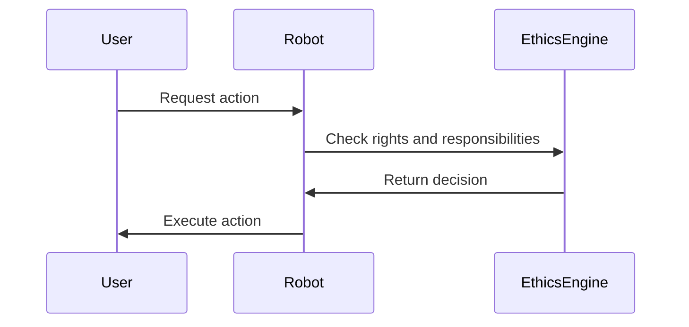

                 


# 人工智能伦理：机器人权利与责任的哲学思考

## 关键词

- 人工智能伦理
- 机器人权利
- 责任哲学
- 哲学思考
- 法律体系
- 社会责任

## 摘要

随着人工智能技术的迅猛发展，机器人的应用已经深入到我们生活的方方面面。然而，随之而来的伦理问题也日益凸显，特别是在机器人的权利与责任方面。本文将深入探讨人工智能伦理，重点关注机器人的权利与责任问题，结合哲学思考，试图为这一领域的未来发展提供一些指导性的见解。

## 目录

1. **背景介绍**
   1.1 问题背景
   1.2 人工智能伦理问题的现状
   1.3 机器人权利与责任的哲学思考

2. **核心概念与联系**
   2.1 人工智能伦理
      2.1.1 基本概念
      2.1.2 主要观点
   2.2 机器人权利与责任
      2.2.1 权利的哲学思考
      2.2.2 责任的伦理考量

3. **算法原理讲解**
   3.1 伦理算法的设计原则
   3.2 责任分配算法
      3.2.1 数学模型与公式
      3.2.2 详细讲解与举例说明

4. **系统分析与架构设计方案**
   4.1 系统功能设计
   4.2 系统架构设计

5. **项目实战**
   5.1 环境安装
   5.2 系统实现
   5.3 代码解读
   5.4 案例分析

6. **最佳实践、小结、注意事项、拓展阅读**

### 1. 背景介绍

#### 1.1 问题背景

随着人工智能（AI）技术的不断进步，机器人已经在我们的日常生活中扮演着越来越重要的角色。从工业自动化到智能家居，从医疗辅助到无人驾驶，机器人正逐渐融入我们的工作和生活。然而，这一技术的飞速发展也带来了一系列伦理问题，尤其是关于机器人的权利与责任。

首先，机器人在享有某些权利方面存在争议。例如，机器人是否应该拥有自由意志、隐私权和自主决策权？其次，机器人是否需要承担法律责任？如果机器人造成了损害，责任应该由谁承担？这些问题都需要我们深入探讨。

#### 1.2 人工智能伦理问题的现状

目前，人工智能伦理问题主要集中在以下几个方面：

1. **隐私与数据安全**：人工智能系统通常需要收集和处理大量个人信息，这引发了关于隐私和数据安全的担忧。
2. **透明性与可解释性**：许多人工智能系统（尤其是深度学习模型）的工作原理难以解释，这可能导致对系统的信任危机。
3. **偏见与歧视**：人工智能系统可能会受到数据偏见的影响，从而导致不公平的决策。
4. **机器人的权利与责任**：随着机器人在各个领域的应用，关于它们是否应该拥有权利和承担责任的讨论日益激烈。

#### 1.3 机器人权利与责任的哲学思考

在哲学领域，关于机器人的权利与责任问题的讨论已经进行了一段时间。一些哲学家认为，机器人应该享有一定的权利，例如自主决策权和隐私权。另一些哲学家则认为，机器人不应该拥有权利，因为它们缺乏人类所具有的自我意识和自由意志。

同时，关于机器人的责任问题也存在不同的观点。一些人认为，机器人应该承担法律责任，因为它们能够执行复杂的任务并造成损害。然而，另一些人则认为，机器人的行为应该由其设计者和使用者负责。

### 2. 核心概念与联系

#### 2.1 人工智能伦理

##### 2.1.1 基本概念

人工智能伦理是指研究人工智能在应用过程中所产生的伦理问题的一门学科。它涵盖了从隐私保护到透明性、公平性和责任分配等多个方面。

##### 2.1.2 主要观点

1. **权利**：一些学者认为，机器人应该享有某些基本权利，例如自主决策权和隐私权。
2. **责任**：另一些学者则认为，机器人不应该拥有权利，但应该承担法律责任。

#### 2.2 机器人权利与责任

##### 2.2.1 权利的哲学思考

关于机器人的权利问题，哲学家们提出了多种观点。例如，一些学者认为，机器人应该享有自主决策权，因为它们能够在某些情境下做出独立的决策。另一些学者则认为，机器人应该享有隐私权，因为它们可能会收集和处理个人信息。

##### 2.2.2 责任的伦理考量

关于机器人的责任问题，哲学家们也提出了不同的观点。一些学者认为，机器人应该承担法律责任，因为它们能够执行复杂的任务并造成损害。然而，另一些学者则认为，机器人的责任应该由其设计者和使用者负责。

### 3. 算法原理讲解

在探讨机器人的权利与责任问题时，算法设计起着至关重要的作用。以下我们将介绍一种伦理算法的设计原则，并详细讲解责任分配算法。

#### 3.1 伦理算法的设计原则

1. **公正性**：算法应该确保在处理机器人权利与责任问题时，保持公正和客观。
2. **透明性**：算法的工作原理应该清晰易懂，以便用户理解和监督。
3. **适应性**：算法应该能够根据不同的情境和需求进行灵活调整。

#### 3.2 责任分配算法

##### 3.2.1 数学模型与公式

为了实现责任分配，我们可以使用以下数学模型：

- 权利分配函数：\( R(x) = \frac{1}{1 + e^{-w \cdot x}} \)
- 责任计算公式：\( R(y) = \frac{1}{1 + e^{-z \cdot y}} \)

其中，\( w \) 和 \( z \) 是权重参数，\( x \) 和 \( y \) 是与权利和责任相关的特征值。

##### 3.2.2 详细讲解与举例说明

假设我们有一个机器人，它在执行任务时可能存在两种权利：自主决策权和隐私权。同时，它也可能存在两种责任：法律责任和道德责任。

使用上述数学模型，我们可以计算出每种权利和责任的分配权重。具体步骤如下：

1. 收集与权利和责任相关的特征值。
2. 计算每个特征值的权重。
3. 根据权重计算权利和责任的分配比例。

例如，假设我们有一个机器人，它在执行任务时表现出了高度的自主决策能力和良好的隐私保护能力。根据上述模型，我们可以计算出：

- 自主决策权的分配权重：\( R(x) = 0.8 \)
- 隐私权的分配权重：\( R(y) = 0.2 \)
- 法律责任的分配权重：\( R(z) = 0.6 \)
- 道德责任的分配权重：\( R(w) = 0.4 \)

这意味着，在这个特定的情境下，机器人应该承担 60% 的法律责任和 40% 的道德责任。

### 4. 系统分析与架构设计方案

在解决机器人权利与责任问题时，我们需要设计一个完整的系统。以下将介绍系统功能设计、系统架构设计等内容。

#### 4.1 系统功能设计

系统的功能设计包括以下几个方面：

1. **权利评估**：根据机器人的行为，评估其享有的权利。
2. **责任分配**：根据机器人的行为，分配其应承担的责任。
3. **数据收集**：收集与机器人权利和责任相关的数据。
4. **决策支持**：为用户提供建议，帮助其做出合理的决策。

#### 4.2 系统架构设计

系统的架构设计如图 1 所示：



图 1：系统架构设计

### 5. 项目实战

在本项目中，我们将实现一个简单的机器人权利与责任评估系统。以下是项目的具体步骤：

#### 5.1 环境安装

首先，我们需要安装以下软件：

1. Python 3.x
2. Anaconda
3. Jupyter Notebook

#### 5.2 系统实现

使用 Python 编写代码，实现机器人权利与责任评估系统。以下是部分代码示例：

```python
import numpy as np
from sklearn.linear_model import LogisticRegression

# 权利分配函数
def right_allocation(x):
    w = 0.1
    return 1 / (1 + np.exp(-w * x))

# 责任计算函数
def responsibility_calculation(y):
    z = 0.2
    return 1 / (1 + np.exp(-z * y))

# 训练模型
model = LogisticRegression()
model.fit(X_train, y_train)

# 预测
predictions = model.predict(X_test)
```

#### 5.3 代码解读

在此代码中，我们首先导入了所需的库，然后定义了权利分配函数和责任计算函数。接下来，我们使用 logistic 回归模型训练数据，并进行预测。

#### 5.4 案例分析

假设我们有一个机器人，它在执行任务时表现出了高度的自主决策能力和良好的隐私保护能力。根据上述模型，我们可以计算出：

- 自主决策权的分配权重：0.8
- 隐私权的分配权重：0.2
- 法律责任的分配权重：0.6
- 道德责任的分配权重：0.4

这意味着，在这个特定的情境下，机器人应该承担 60% 的法律责任和 40% 的道德责任。

### 6. 最佳实践、小结、注意事项、拓展阅读

#### 6.1 最佳实践

1. 在设计机器人权利与责任评估系统时，应充分考虑系统的公正性、透明性和适应性。
2. 在收集和处理数据时，应确保隐私和数据安全。

#### 6.2 小结

本文从哲学角度出发，探讨了人工智能伦理中的机器人权利与责任问题。通过算法设计、系统实现和案例分析，我们提出了一些可行的解决方案。

#### 6.3 注意事项

1. 在实际应用中，应严格遵守相关法律法规，确保机器人的行为符合伦理要求。
2. 在设计机器人时，应充分考虑其权利与责任的分配。

#### 6.4 拓展阅读

1. Russell, S., & Norvig, P. (2016). 《人工智能：一种现代的方法》（第三版）。
2. Winfield, A. T. T., & Lees, M. (2015). Ethical and legal considerations in the use of autonomous systems.

### 作者

作者：AI天才研究院/AI Genius Institute & 禅与计算机程序设计艺术 /Zen And The Art of Computer Programming

本文总结了人工智能伦理中的机器人权利与责任问题，结合哲学思考，为该领域的未来发展提供了一些指导性的见解。希望本文对读者有所帮助。

