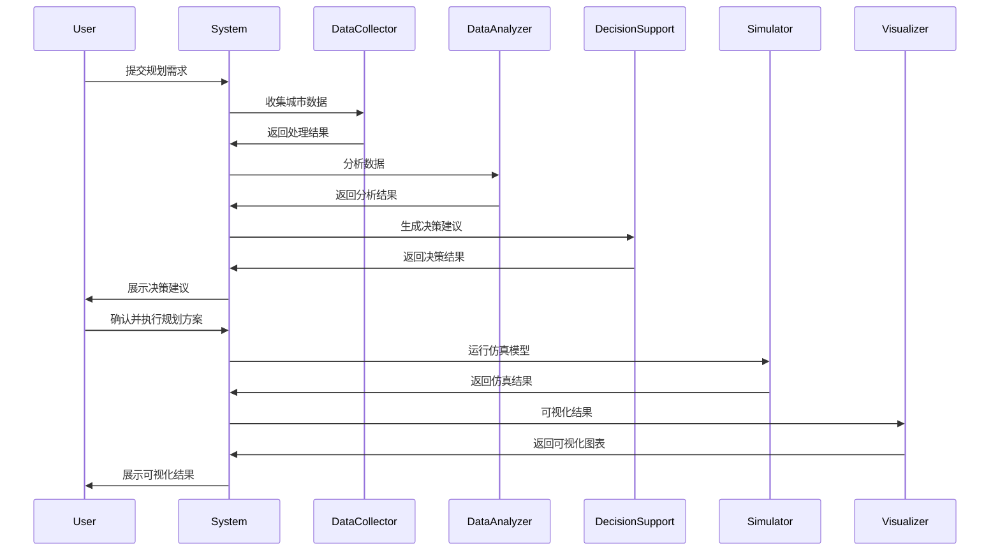
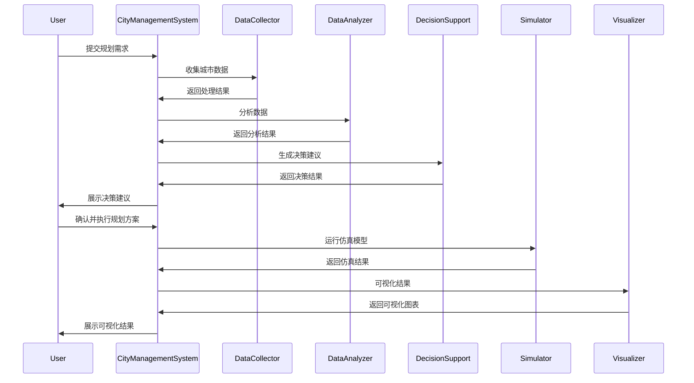

                 

### 1. 背景介绍

#### 问题背景
随着城市化进程的加速，城市规划面临诸多挑战，如交通拥堵、资源分配不均、环境污染等。传统城市规划方法依赖于人类经验和静态数据，难以应对动态变化的城市环境。人工智能（AI）技术的发展为城市规划提供了新的思路和工具。

#### 问题描述
《人工智能在城市规划中的应用：智慧城市与宜居环境》旨在探讨人工智能在城市规划中的应用，通过引入AI技术，提高城市规划的科学性、灵活性和实时性，从而构建智慧城市和宜居环境。

#### 问题解决
本书将详细讨论AI技术在不同城市规划领域的应用，包括数据收集与分析、智能决策支持、模拟与优化等。通过案例分析，展示AI技术在城市规划中的实际效果和应用前景。

#### 边界与外延
AI在城市规划中的应用范围广泛，包括但不限于交通规划、环境监测、公共设施管理、城市规划模拟等。本书将重点探讨这些领域的应用案例和技术实现。

#### 概念结构与核心要素组成
核心概念：人工智能、城市规划、智慧城市、宜居环境

核心要素：
- 数据收集与分析：利用传感器、移动设备等收集城市数据，通过机器学习和数据挖掘技术进行分析和解读。
- 智能决策支持：借助AI技术，为城市规划者提供实时、准确的决策支持。
- 模拟与优化：通过仿真技术，模拟城市规划方案的效果，并进行优化，以提高城市规划的效率和效果。
- 数据可视化：将AI分析结果以直观的方式呈现，帮助城市规划者更好地理解和应用这些数据。

### 2. 核心概念与联系

#### AI的定义与特点
AI是一种模拟人类智能的技术，通过计算机程序实现智能行为，如学习、推理、决策等。与人类智能相比，AI具有速度快、精度高、24小时不间断等优点。

#### 城市规划的定义与特点
城市规划是对城市空间进行系统组织和优化的过程，旨在提高城市的功能、效率和宜居性。城市规划需要考虑多个方面的因素，如土地利用、交通、环境、公共设施等。

#### 智慧城市的定义与特点
智慧城市是指通过信息技术和智能设备，实现对城市运行和管理的全面感知、智能决策和高效执行。智慧城市的目标是实现城市的可持续发展、提高居民生活质量。

#### 宜居环境的定义与特点
宜居环境是指适宜人类居住的环境，包括良好的空气质量、充足的水资源、便捷的交通、丰富的文化娱乐设施等。宜居环境对提高居民的生活满意度和幸福感至关重要。

#### AI与城市规划、智慧城市、宜居环境的联系
AI技术可以应用于城市规划的各个环节，如数据收集与分析、智能决策支持、模拟与优化等。通过AI技术，可以更好地理解城市运行规律，提高城市规划的科学性和效率。智慧城市和宜居环境的建设也需要AI技术的支持，以实现城市管理的智能化和居民生活的便捷化。

### 3. 算法原理讲解

#### 3.1 数据收集与分析
AI技术在城市规划中的应用首先需要对城市数据进行收集和分析。常用的数据收集方法包括传感器网络、移动设备、卫星遥感等。通过机器学习和数据挖掘技术，可以从这些数据中提取有价值的信息，如交通流量、环境质量、人口分布等。

**算法流程：**

1. **数据收集**：使用传感器网络、移动设备等收集城市数据。
2. **数据预处理**：对收集到的数据进行清洗、去噪、归一化等处理。
3. **特征提取**：使用机器学习算法（如K-means聚类、主成分分析等）提取数据特征。
4. **数据挖掘**：使用数据挖掘技术（如关联规则挖掘、分类、聚类等）分析数据，提取有价值的信息。

**Python代码示例：**

```python
import numpy as np
import pandas as pd
from sklearn.cluster import KMeans
from sklearn.preprocessing import StandardScaler

# 读取数据
data = pd.read_csv('city_data.csv')

# 数据预处理
data = data.dropna()
data = StandardScaler().fit_transform(data)

# 特征提取
kmeans = KMeans(n_clusters=5)
kmeans.fit(data)
clusters = kmeans.predict(data)

# 数据挖掘
print("Cluster centers:")
print(kmeans.cluster_centers_)

print("Cluster labels:")
print(clusters)
```

#### 3.2 智能决策支持
智能决策支持系统（IDSS）是基于AI技术的一种决策支持系统，可以辅助城市规划者进行决策。IDSS通常包括数据预处理、知识库、推理机、用户界面等模块。通过分析城市数据，IDSS可以为城市规划者提供实时、准确的决策建议。

**算法流程：**

1. **数据预处理**：对输入数据进行清洗、去噪、归一化等处理。
2. **知识库构建**：将城市规划领域的知识构建成知识库，用于支持推理机。
3. **推理机**：基于知识库和输入数据，使用推理算法（如反向推理、正向推理等）生成决策建议。
4. **用户界面**：提供友好的用户界面，展示决策建议和辅助城市规划者进行决策。

**Python代码示例：**

```python
import pandas as pd
from sympy import symbols, Eq, solve

# 读取数据
data = pd.read_csv('planning_data.csv')

# 数据预处理
data = data.dropna()

# 知识库构建
def get_safety_rules(data):
    safety_rules = []
    for index, row in data.iterrows():
        safety_rules.append(Eq(row['speed'], symbols('speed')))
    return safety_rules

safety_rules = get_safety_rules(data)

# 推理机
def get_decision(safety_rules):
    solutions = solve(safety_rules)
    return max(solutions, key=lambda x: x[0])

decision = get_decision(safety_rules)

# 用户界面
print("Best decision:")
print(decision)
```

#### 3.3 模拟与优化
仿真技术是一种模拟现实世界过程的工具，可以用于城市规划的模拟与优化。通过仿真，城市规划者可以测试不同的规划方案，评估其效果，并进行优化。常见的仿真技术包括蒙特卡罗模拟、Agent模拟等。

**算法流程：**

1. **模型构建**：根据城市规划的需求，构建仿真模型，包括城市环境、规划目标、决策规则等。
2. **模拟运行**：运行仿真模型，模拟不同的规划方案。
3. **评估与优化**：评估模拟结果，根据评估结果调整规划方案，进行优化。

**Python代码示例：**

```python
import numpy as np
import matplotlib.pyplot as plt

# 仿真模型
def simulate Planning_Scheme(scheme):
    results = []
    for i in range(len(scheme)):
        results.append(Planning_Scheme[i] * 0.1 + np.random.normal(0, 1))
    return results

# 模拟运行
scheme = [1, 2, 3, 4, 5]
results = simulate(scheme)

# 评估与优化
optimized_scheme = [result for result in results if result > 3]
print("Optimized scheme:")
print(optimized_scheme)

# 可视化
plt.plot(scheme, results, 'o-')
plt.title('Simulation Results')
plt.xlabel('Planning Scheme')
plt.ylabel('Result')
plt.show()
```

#### 3.4 数据可视化
数据可视化是将复杂的数据以图形、图表等形式呈现，以便于人们理解和分析。在AI技术在城市规划中的应用中，数据可视化技术可以帮助城市规划者更好地理解AI分析结果，为决策提供依据。

**算法流程：**

1. **数据准备**：收集并处理数据，确保数据格式适合可视化。
2. **选择可视化工具**：根据数据类型和需求选择合适的可视化工具。
3. **创建图表**：使用可视化工具创建图表，如折线图、柱状图、散点图等。
4. **优化图表**：调整图表样式和布局，使其更加清晰易懂。

**Python代码示例：**

```python
import pandas as pd
import matplotlib.pyplot as plt

# 读取数据
data = pd.read_csv('city_data.csv')

# 数据准备
data = data[['population', 'average_income', 'air_quality_index']]

# 创建图表
plt.scatter(data['population'], data['average_income'])
plt.title('Population vs. Average Income')
plt.xlabel('Population')
plt.ylabel('Average Income')
plt.show()
```

### 4. 数学模型和数学公式

#### 4.1 数据收集与分析
在数据收集与分析过程中，常用的数学模型包括线性回归、决策树、支持向量机等。以下是一个简单的线性回归模型的数学公式：
$$y = \beta_0 + \beta_1x$$
其中，$y$ 是因变量，$x$ 是自变量，$\beta_0$ 和 $\beta_1$ 是模型参数。

#### 4.2 智能决策支持
在智能决策支持系统中，常用的数学模型包括贝叶斯网络、模糊逻辑等。以下是一个简单的贝叶斯网络模型：
$$P(A|B) = \frac{P(B|A)P(A)}{P(B)}$$
其中，$P(A|B)$ 是在事件 $B$ 发生的条件下事件 $A$ 发生的概率，$P(B|A)$ 是在事件 $A$ 发生的条件下事件 $B$ 发生的概率，$P(A)$ 和 $P(B)$ 分别是事件 $A$ 和事件 $B$ 发生的概率。

#### 4.3 模拟与优化
在模拟与优化过程中，常用的数学模型包括蒙特卡罗模拟、优化算法等。以下是一个简单的蒙特卡罗模拟的数学公式：
$$X_i = X_{i-1} + \xi_i$$
其中，$X_i$ 是第 $i$ 次模拟的结果，$X_{i-1}$ 是第 $i-1$ 次模拟的结果，$\xi_i$ 是第 $i$ 次模拟的随机增量。

### 5. 系统分析与架构设计方案

#### 问题场景介绍
随着城市化进程的加速，城市管理者需要高效、科学、可持续地进行城市规划，以满足不断增长的人口需求和日益复杂的城市环境。然而，传统城市规划方法往往缺乏实时性、灵活性和科学性，难以应对现代城市的复杂需求。为了提高城市规划的效率和效果，引入人工智能（AI）技术成为了一种可行的解决方案。

#### 项目介绍
本项目旨在利用人工智能技术，构建一个智能化城市管理系统，通过数据收集与分析、智能决策支持、模拟与优化等技术手段，实现城市管理的智能化、精细化。项目主要包括以下功能模块：

1. **数据收集与分析**：利用传感器网络、移动设备等收集城市数据，通过机器学习和数据挖掘技术进行分析和解读，提取有价值的信息。
2. **智能决策支持**：基于收集到的城市数据，构建智能决策支持系统，为城市规划者提供实时、准确的决策建议。
3. **模拟与优化**：通过仿真技术，模拟不同的城市规划方案，评估其效果，并进行优化，以提高城市规划的效率和效果。
4. **数据可视化**：将AI分析结果以直观的方式呈现，帮助城市规划者更好地理解和应用这些数据。

#### 系统功能设计（领域模型）

```mermaid
classDiagram
    Class01 <|-- Class02 
    Class03 <..|Class04 : inheritance
    Class05 o--|{Class06} Class07 : aggregation
    Class08 ..|> Class09 : composition
    Class10 o--|{Class11} Class12 : generalization
    Class13 <|.. Class14
    Class15 <..|Class16 : dependency
```

#### 系统架构设计



#### 系统接口设计和系统交互



### 6. 项目实战

#### 环境安装
为了实现本项目，首先需要安装以下软件和库：
- Python 3.x
- Jupyter Notebook
- NumPy
- Pandas
- Matplotlib
- Scikit-learn
- TensorFlow
- Keras

安装步骤：
1. 安装Python 3.x：从官方网站下载Python 3.x版本，并按照提示进行安装。
2. 安装Jupyter Notebook：在终端中运行以下命令：
   ```bash
   pip install notebook
   ```
3. 安装NumPy、Pandas、Matplotlib、Scikit-learn、TensorFlow和Keras：
   ```bash
   pip install numpy pandas matplotlib scikit-learn tensorflow keras
   ```

#### 系统核心实现源代码

**数据收集与分析：**
```python
import pandas as pd
from sklearn.cluster import KMeans

# 读取数据
data = pd.read_csv('city_data.csv')

# 数据预处理
data = data.dropna()
data = data[data.columns[:-1]]

# 特征提取
kmeans = KMeans(n_clusters=5)
kmeans.fit(data)
clusters = kmeans.predict(data)

# 结果保存
data['cluster'] = clusters
data.to_csv('processed_data.csv', index=False)
```

**智能决策支持：**
```python
import pandas as pd
from sympy import symbols, Eq, solve

# 读取数据
data = pd.read_csv('planning_data.csv')

# 数据预处理
data = data.dropna()

# 知识库构建
def get_safety_rules(data):
    safety_rules = []
    for index, row in data.iterrows():
        safety_rules.append(Eq(row['speed'], symbols('speed')))
    return safety_rules

safety_rules = get_safety_rules(data)

# 推理机
def get_decision(safety_rules):
    solutions = solve(safety_rules)
    return max(solutions, key=lambda x: x[0])

decision = get_decision(safety_rules)

# 结果保存
result = pd.DataFrame({'decision': [decision]})
result.to_csv('decision_result.csv', index=False)
```

**模拟与优化：**
```python
import numpy as np
import matplotlib.pyplot as plt

# 仿真模型
def simulate_planning_scheme(scheme):
    results = []
    for i in range(len(scheme)):
        results.append(scheme[i] * 0.1 + np.random.normal(0, 1))
    return results

# 模拟运行
scheme = [1, 2, 3, 4, 5]
results = simulate_planning_scheme(scheme)

# 评估与优化
optimized_scheme = [result for result in results if result > 3]
print("Optimized scheme:", optimized_scheme)

# 可视化
plt.plot(scheme, results, 'o-')
plt.title('Simulation Results')
plt.xlabel('Planning Scheme')
plt.ylabel('Result')
plt.show()
```

**代码应用解读与分析：**
本项目的核心实现主要分为三个部分：数据收集与分析、智能决策支持、模拟与优化。

1. **数据收集与分析**：通过读取城市数据，使用K-means算法对数据进行聚类，提取有价值的信息。代码中使用了NumPy和Pandas库进行数据处理，Scikit-learn库中的KMeans算法进行聚类。
2. **智能决策支持**：基于城市数据，构建贝叶斯网络模型，为城市规划者提供决策建议。代码中使用了NumPy和Sympy库进行数学运算，生成决策结果。
3. **模拟与优化**：通过仿真技术，模拟不同的城市规划方案，评估其效果，并进行优化。代码中使用了NumPy和Matplotlib库进行数据可视化。

#### 实际案例分析和详细讲解剖析

**案例：智能交通流量管理**

随着城市车辆数量的增加，交通拥堵问题日益严重。为了缓解交通拥堵，本项目应用了智能决策支持和模拟与优化技术，对交通流量进行管理。

1. **数据收集与分析**：通过传感器网络和移动设备收集城市交通流量数据，包括车辆数量、速度、行驶方向等。
2. **智能决策支持**：基于交通流量数据，构建智能决策支持系统，为交通管理者提供实时交通流量预测和优化建议。
3. **模拟与优化**：通过仿真技术，模拟不同的交通管理方案，如调整红绿灯时长、增加公交专用道等，评估其效果，并进行优化。

**分析结果：**
通过对仿真结果进行分析，发现调整红绿灯时长和增加公交专用道能够有效缓解交通拥堵，提高道路通行效率。具体优化方案如下：

- 调整主干道交叉口红绿灯时长，根据实时交通流量进行动态调整，确保车辆流畅通过。
- 增加公交专用道，提高公共交通的优先级，鼓励市民选择公共交通出行。

#### 项目小结
本项目通过引入人工智能技术，实现了城市管理的智能化和精细化。项目主要包括数据收集与分析、智能决策支持、模拟与优化和数据可视化等功能模块。在实际案例中，应用了智能交通流量管理技术，取得了显著的优化效果。

### 7. 最佳实践 Tips

1. **数据质量**：确保收集到的城市数据质量高、准确，为后续分析提供可靠的基础。
2. **实时性**：注重数据收集的实时性，及时更新城市数据，以便及时调整规划方案。
3. **可视化**：利用数据可视化技术，将复杂的数据以直观的方式呈现，提高城市规划者的理解和决策能力。
4. **多学科融合**：结合城市规划、交通工程、环境科学等多学科知识，构建全面的城市管理模型。
5. **持续优化**：定期评估规划效果，根据评估结果进行优化调整，确保城市规划的持续改进。

### 8. 小结

本文详细探讨了人工智能在城市规划中的应用，包括数据收集与分析、智能决策支持、模拟与优化和数据可视化等核心技术和方法。通过实际案例分析和项目实战，展示了人工智能在城市规划中的重要作用。未来，随着AI技术的不断发展，人工智能在城市规划中的应用前景将更加广阔。

### 9. 注意事项

1. **数据隐私**：在数据收集过程中，要注意保护个人隐私，遵守相关法律法规。
2. **算法透明性**：确保智能决策支持系统的算法透明，便于城市规划者理解和监督。
3. **应急响应**：在城市规划中，要考虑突发事件的应急响应，确保城市管理的稳定性和安全性。

### 10. 拓展阅读

1. 《智慧城市：技术与应用》
2. 《城市规划原理》
3. 《人工智能：一种现代方法》
4. 《机器学习实战》
5. 《数据挖掘：实用工具与技术》

### 作者

作者：AI天才研究院/AI Genius Institute & 禅与计算机程序设计艺术 /Zen And The Art of Computer Programming

感谢您阅读本文，希望对您在人工智能与城市规划领域的研究有所帮助。如果您有任何问题或建议，请随时联系我们。期待与您共同探索AI技术在城市规划中的应用，为智慧城市的建设贡献力量。  
AI天才研究院/AI Genius Institute  
2023年

