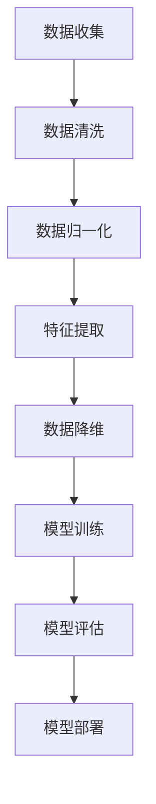

                 

### 1. 引言与背景

#### 1.1 人工智能发展历程

人工智能（AI）的概念最早可以追溯到20世纪50年代。当时，计算机科学家约翰·麦卡锡（John McCarthy）提出了“人工智能”这一术语，旨在研究使计算机表现出人类智能的行为。早期的AI研究主要集中在逻辑推理和规则系统，如基于推理机器和专家系统的应用。然而，这些早期尝试并未能取得预期成果，因为它们过于依赖明确的规则和预定义的知识。

进入20世纪80年代，机器学习和神经网络技术开始兴起，为人工智能领域带来了新的生机。尤其是1986年，哈佛大学教授约翰·霍普菲尔（John Hopfield）提出了霍普菲尔德网络（Hopfield Network），这标志着神经网络研究的突破。随后，1989年，苏格兰数学家和逻辑学家约翰·希尔莱特（John Hopfield）提出了卷积神经网络（CNN），这一算法在图像识别领域取得了巨大成功。

21世纪初，随着计算能力的提升和大数据技术的发展，机器学习迎来了黄金时代。谷歌的深度学习系统“深度思维”（Deep Thought）在2012年赢得了国际模式识别大赛（ImageNet Challenge）的冠军，这一成就极大地推动了深度学习技术的应用和发展。随后，深度学习在语音识别、图像识别、自然语言处理等领域取得了显著成果。

#### 1.2 新闻生产现状

新闻生产是一个复杂且多变的过程，传统的新闻生产主要依赖于记者的采访、编辑和发布。随着互联网的普及，新闻生产的方式也在发生变革。现代新闻生产包括以下几个方面：

1. **内容采集**：记者通过采访、调查和报道，收集新闻素材。
2. **内容编辑**：编辑对采集到的素材进行筛选、整理和编辑，确保新闻的准确性和吸引力。
3. **内容发布**：新闻通过网站、社交媒体等平台发布，供读者阅读。

然而，传统的新闻生产方式面临着以下挑战：

1. **人力成本**：新闻生产需要大量的人力投入，尤其是在内容采集和编辑阶段。
2. **时效性**：在信息爆炸的时代，新闻的时效性至关重要，而传统的新闻生产流程往往较慢。
3. **信息质量**：随着新闻来源的多样化，新闻的真实性和可信度受到质疑。

#### 1.3 人工智能在新闻生产中的应用

人工智能在新闻生产中的应用正在逐渐改变传统的新闻生产模式。以下是一些主要的应用方向：

1. **自动化新闻写作**：利用自然语言处理（NLP）和机器学习技术，可以自动化生成新闻报道。例如，机器可以自动生成体育赛事的得分报告、财经新闻的股票分析等。
2. **智能推荐系统**：通过分析用户的行为数据，智能推荐系统可以推荐相关的新闻内容，提高用户满意度和阅读时长。
3. **语音识别与图片识别**：语音识别技术可以自动将语音转换为文本，而图片识别技术可以帮助自动识别和标签化新闻图片。
4. **数据挖掘与趋势分析**：利用机器学习算法，可以对大量的新闻数据进行分析，发现新闻趋势和热点话题。

人工智能在新闻生产中的应用不仅提高了生产效率，还增强了新闻内容的多样性和个性化，为读者提供了更好的阅读体验。

### 核心概念

为了深入探讨人工智能在新闻生产中的应用，我们需要了解一些核心概念，这些概念是理解后续内容的基础。

#### 2.1 自然语言处理（NLP）

自然语言处理是人工智能的一个重要分支，旨在使计算机能够理解和处理人类语言。NLP的关键技术包括：

1. **文本分类**：将文本数据根据其内容分类到不同的类别中，如新闻、评论、广告等。
2. **情感分析**：判断文本中表达的情感倾向，如正面、负面或中立。
3. **实体识别**：从文本中提取出具有特定意义的信息单元，如人名、地名、组织名等。
4. **语义理解**：理解文本中的隐含意义，如隐喻、玩笑等。

在新闻生产中，NLP技术可以用于自动分类新闻、提取关键词、撰写摘要等。

#### 2.2 机器学习

机器学习是使计算机能够通过数据和经验进行自我学习和改进的一门技术。在新闻生产中，机器学习的主要应用包括：

1. **预测分析**：通过历史数据预测未来的趋势和热点，如新闻热度预测。
2. **聚类分析**：将相似的新闻数据分组，以便进行更有效的管理和推荐。
3. **强化学习**：通过模拟和试验，让系统在特定的环境中学习最优策略。

机器学习技术可以提高新闻推荐的准确性和个性化程度。

#### 2.3 数据挖掘

数据挖掘是发现数据中隐含的模式和知识的过程。在新闻生产中，数据挖掘的应用包括：

1. **新闻趋势分析**：分析大量新闻数据，发现社会热点和趋势。
2. **用户行为分析**：通过分析用户在网站或应用上的行为数据，了解用户偏好和需求。
3. **新闻质量评估**：利用数据挖掘技术评估新闻的准确性和可信度。

数据挖掘可以帮助新闻机构更好地理解市场和用户，从而优化内容生产和推广策略。

#### 2.4 联系

自然语言处理、机器学习和数据挖掘在新闻生产中密切相关。NLP提供了处理和理解文本数据的方法，而机器学习则通过数据训练模型，提高文本处理的效率和准确性。数据挖掘则利用这些处理后的数据，发现其中的模式和知识，为新闻生产提供指导。

例如，新闻机构可以利用NLP技术自动提取新闻中的关键词，然后使用机器学习算法分析这些关键词，预测新闻的流行趋势。这些预测结果可以用于调整内容生产策略，提高新闻的吸引力和时效性。

### 自动化新闻写作

#### 3.1 概述

自动化新闻写作是人工智能在新闻生产中的一个重要应用。它利用自然语言处理（NLP）和机器学习技术，通过算法自动生成新闻报道。自动化新闻写作不仅提高了新闻生产效率，还解放了记者和编辑，使其能够专注于更具创造性和战略性的任务。

自动化新闻写作的主要类型包括：

1. **模板新闻**：根据预定义的模板，自动生成新闻报道，如体育赛事得分报告、财经新闻的股票分析等。
2. **生成式新闻**：利用机器学习模型，从大量的原始数据中生成全新的新闻报道。

自动化新闻写作的应用场景广泛，包括：

1. **体育赛事报道**：自动化生成比赛得分、赛果和球员表现分析。
2. **财经新闻**：自动化生成市场分析、股票走势预测等。
3. **灾害报道**：自动化生成灾情简报、救援进展等。

#### 3.2 算法原理

自动化新闻写作的核心是自然语言生成（NLG）技术，特别是基于机器学习的方法。以下是一些常用的算法和模型：

1. **模板匹配**：通过预定义的模板和规则，将数据映射到特定的新闻格式中。这种方法简单直观，但缺乏灵活性和创造性。
2. **序列到序列模型（Seq2Seq）**：如长短期记忆网络（LSTM）和变换器（Transformer），可以将输入序列（如文本数据）映射到输出序列（如新闻报道）。这种方法具有更强的生成能力和灵活性。
3. **生成对抗网络（GAN）**：通过生成器和判别器的对抗训练，生成高质量的文本数据。这种方法可以生成更加丰富和多样的新闻报道。

#### 3.3 实现步骤

实现自动化新闻写作通常包括以下步骤：

1. **数据收集**：收集大量的新闻数据，包括文本、图片、音频等。这些数据用于训练和测试机器学习模型。
2. **数据预处理**：清洗和转换数据，使其适合用于训练模型。例如，去除停用词、进行词性标注、分词等。
3. **模型训练**：选择合适的机器学习模型，如LSTM或Transformer，对预处理后的数据进行训练，以学习文本的生成规律。
4. **模型评估**：通过测试数据评估模型的性能，如生成文本的准确性、流畅性和可读性。
5. **模型部署**：将训练好的模型部署到新闻生产系统中，实现自动化新闻写作功能。

#### 3.4 案例分析

以下是一个自动化新闻写作的案例分析：

**案例：自动生成体育赛事报道**

1. **数据收集**：收集体育赛事的详细数据，包括比赛时间、比赛结果、球员表现等。
2. **数据预处理**：对数据集进行清洗和转换，如去除无关信息、进行分词和词性标注等。
3. **模型训练**：使用LSTM模型训练数据集，学习生成体育赛事报道的文本。
4. **模型评估**：使用测试数据评估模型的性能，调整模型参数，提高生成文本的质量。
5. **模型部署**：将训练好的模型部署到体育新闻网站上，实现自动生成赛事报道。

通过这个案例，我们可以看到自动化新闻写作的完整流程。在实际应用中，自动化新闻写作可以大大提高新闻生产的效率，同时保持一定的新闻质量。

### 智能推荐系统

#### 4.1 概述

智能推荐系统是人工智能在新闻生产中的另一个重要应用。它通过分析用户行为和偏好，为用户推荐相关的新闻内容。智能推荐系统不仅能够提高用户的阅读体验，还能增加网站的粘性和用户留存率。

智能推荐系统的主要类型包括：

1. **基于内容的推荐**：根据新闻内容的特征（如标题、标签、关键词等）推荐相似的新闻。
2. **协同过滤推荐**：根据用户的行为（如阅读、点赞、评论等）和相似用户的偏好，推荐新闻。
3. **混合推荐**：结合基于内容的推荐和协同过滤推荐，提供更加个性化的推荐结果。

智能推荐系统的应用场景广泛，包括：

1. **新闻网站**：为用户推荐相关的新闻，增加用户的阅读时间和满意度。
2. **社交媒体**：根据用户的行为和兴趣，推荐相关的新闻和帖子。
3. **移动应用**：为用户推荐新闻和应用内容，提高应用的下载和使用率。

#### 4.2 算法原理

智能推荐系统的核心是推荐算法，以下是一些常用的算法：

1. **基于内容的推荐**：
   - **TF-IDF（词频-逆文档频率）**：计算新闻文本中每个词的重要程度，为相似新闻的推荐提供依据。
   - **词嵌入（Word Embedding）**：将文本中的词语映射到高维空间，通过计算词语间的相似度推荐新闻。
2. **协同过滤推荐**：
   - **用户基于的协同过滤（User-based Collaborative Filtering）**：根据用户之间的相似度推荐新闻。
   - **物品基于的协同过滤（Item-based Collaborative Filtering）**：根据新闻之间的相似度推荐新闻。
   - **矩阵分解（Matrix Factorization）**：通过将用户-新闻评分矩阵分解为用户特征矩阵和新闻特征矩阵，预测用户对未阅读新闻的评分。
3. **混合推荐**：
   - **基于模型的混合推荐（Model-based Hybrid Recommendation）**：结合内容特征和用户行为特征，使用机器学习模型（如因子分解机）提供推荐。

#### 4.3 实现步骤

实现智能推荐系统通常包括以下步骤：

1. **数据收集**：收集用户行为数据（如阅读记录、点赞、评论等）和新闻数据（如标题、标签、关键词等）。
2. **数据预处理**：清洗和转换数据，如去除缺失值、标准化特征、进行分词和词性标注等。
3. **特征提取**：从原始数据中提取有效的特征，如新闻的标题、标签、关键词、用户的行为序列等。
4. **模型训练**：选择合适的推荐算法，如基于内容的推荐、协同过滤或混合推荐，对特征数据进行训练。
5. **模型评估**：通过交叉验证、A/B测试等评估方法评估推荐系统的性能。
6. **模型部署**：将训练好的推荐模型部署到新闻平台或应用中，为用户实时推荐新闻。

#### 4.4 案例分析

以下是一个智能推荐系统的案例分析：

**案例：新闻网站个性化推荐**

1. **数据收集**：收集用户在网站上的阅读记录、点赞、评论等行为数据，以及新闻的标题、标签、关键词等。
2. **数据预处理**：对数据集进行清洗和转换，如去除缺失值、标准化特征、进行分词和词性标注等。
3. **特征提取**：提取新闻的标题、标签、关键词等作为内容特征，提取用户的阅读记录、点赞、评论等作为行为特征。
4. **模型训练**：使用基于内容的推荐算法（如TF-IDF）和协同过滤算法（如用户基于的协同过滤）对特征数据进行训练。
5. **模型评估**：通过交叉验证方法评估推荐系统的性能，如准确率、召回率、F1分数等。
6. **模型部署**：将训练好的推荐模型部署到新闻网站上，根据用户的阅读行为和偏好，实时推荐相关的新闻。

通过这个案例，我们可以看到智能推荐系统的实现流程。在实际应用中，智能推荐系统可以大大提高新闻网站的用户满意度和访问量。

### 语音识别与图片识别

#### 5.1 概述

语音识别与图片识别是人工智能在新闻生产中的重要辅助技术，它们通过处理和分析语音和图像数据，帮助新闻机构更高效地采集、编辑和发布新闻内容。

#### 5.2 算法原理

1. **语音识别（Speech Recognition）**：
   - **隐藏马尔可夫模型（HMM）**：早期常用的语音识别算法，通过状态转移概率和输出概率模型识别语音。
   - **深度神经网络（DNN）**：利用多层神经网络对语音信号进行建模，提高识别精度。
   - **循环神经网络（RNN）**：特别是长短期记忆网络（LSTM）和变换器（Transformer），可以更好地处理序列数据，提高语音识别的性能。

2. **图片识别（Image Recognition）**：
   - **卷积神经网络（CNN）**：通过卷积层、池化层和全连接层等结构对图像进行特征提取和分类。
   - **迁移学习**：利用预训练的神经网络模型（如ResNet、Inception等），在特定任务上微调模型，提高识别准确性。

#### 5.3 实现步骤

1. **语音识别**：
   - **数据收集**：收集大量的语音数据，用于训练和测试模型。
   - **数据预处理**：对语音数据进行降噪、归一化和特征提取。
   - **模型训练**：使用训练数据训练语音识别模型，如DNN或LSTM。
   - **模型评估**：使用测试数据评估模型的性能，调整模型参数。
   - **模型部署**：将训练好的模型部署到应用中，实现语音识别功能。

2. **图片识别**：
   - **数据收集**：收集大量的图片数据，用于训练和测试模型。
   - **数据预处理**：对图片数据进行归一化和特征提取。
   - **模型训练**：使用训练数据训练图片识别模型，如CNN。
   - **模型评估**：使用测试数据评估模型的性能，调整模型参数。
   - **模型部署**：将训练好的模型部署到应用中，实现图片识别功能。

#### 5.4 案例分析

**案例：新闻采访自动转录**

1. **数据收集**：收集新闻采访的语音数据，用于训练语音识别模型。
2. **数据预处理**：对语音数据进行降噪和归一化处理。
3. **模型训练**：使用DNN或LSTM模型对语音数据集进行训练。
4. **模型评估**：使用测试数据集评估模型性能，调整模型参数。
5. **模型部署**：将训练好的模型部署到新闻采访系统中，自动将语音转录为文本。

**案例：新闻图片自动标签**

1. **数据收集**：收集大量的新闻图片，用于训练图片识别模型。
2. **数据预处理**：对图片数据进行归一化处理。
3. **模型训练**：使用CNN模型对图片数据集进行训练。
4. **模型评估**：使用测试数据集评估模型性能，调整模型参数。
5. **模型部署**：将训练好的模型部署到新闻编辑系统中，自动为图片添加标签。

通过这两个案例，我们可以看到语音识别和图片识别技术在新闻生产中的应用。语音识别可以帮助记者和编辑快速转录采访内容，而图片识别则可以自动标签和分类新闻图片，提高工作效率。

### 技术细节

#### 6.1 数据处理方法

在人工智能应用于新闻生产的过程中，数据处理方法是一个至关重要的环节。以下是几种常用的数据处理方法：

1. **数据清洗**：数据清洗是数据处理的第一步，目的是去除数据中的噪声和异常值。具体方法包括：
   - **缺失值处理**：使用均值、中位数或最频繁值填充缺失值，或删除包含缺失值的记录。
   - **异常值处理**：通过箱线图、标准差等方法识别并处理异常值。
   - **重复值处理**：删除重复的数据记录，确保数据集的纯净性。

2. **数据归一化**：数据归一化是将不同特征的数据转换到同一尺度，以便更好地进行模型训练。常用的归一化方法包括：
   - **最小-最大规范化**：将数据缩放到[0, 1]或[-1, 1]的区间内。
   - **标准规范化**：将数据缩放到标准正态分布，即均值为0，标准差为1。

3. **特征提取**：特征提取是从原始数据中提取出对模型训练有用的信息。常用的特征提取方法包括：
   - **词袋模型（Bag of Words）**：将文本数据转换为词频向量。
   - **TF-IDF**：结合词频和逆文档频率，为每个词赋予更高的权重。
   - **词嵌入（Word Embedding）**：将词语映射到高维空间，常用于自然语言处理。

4. **数据降维**：数据降维是将高维数据压缩到低维空间，以提高计算效率和模型性能。常用的降维方法包括：
   - **主成分分析（PCA）**：通过计算数据的主成分，将数据投影到低维空间。
   - **线性判别分析（LDA）**：通过最大化类间方差和最小化类内方差，将数据投影到低维空间。

#### 6.2 数学模型

在人工智能应用于新闻生产的过程中，常用的数学模型包括：

1. **机器学习模型**：
   - **线性回归（Linear Regression）**：通过最小二乘法拟合数据的线性关系。
   - **逻辑回归（Logistic Regression）**：用于分类问题，通过最大化似然函数进行参数估计。
   - **支持向量机（SVM）**：通过寻找最佳分割超平面进行分类。
   - **决策树（Decision Tree）**：通过递归划分特征，构建树形模型进行分类或回归。

2. **深度学习模型**：
   - **卷积神经网络（CNN）**：通过卷积层提取图像特征，常用于图像识别任务。
   - **循环神经网络（RNN）**：通过隐藏状态保留历史信息，常用于序列数据处理。
   - **变换器（Transformer）**：通过多头自注意力机制，实现序列到序列的建模。

3. **推荐系统模型**：
   - **协同过滤（Collaborative Filtering）**：通过用户行为数据构建用户-物品评分矩阵，进行推荐。
   - **矩阵分解（Matrix Factorization）**：通过分解用户-物品评分矩阵，预测用户对未评分物品的偏好。

#### 6.3 Mermaid流程图

Mermaid是一种基于Markdown的绘图工具，可以方便地绘制流程图、序列图、类图等。以下是一个简单的Mermaid流程图示例，用于展示数据处理流程：



通过Mermaid流程图，我们可以直观地了解数据处理和模型训练的过程。在实际应用中，可以根据具体需求添加更多的节点和关系，以更详细地描述数据处理和模型训练的流程。

### 实际操作与案例分析

#### 7.1 环境安装与配置

在进行人工智能在新闻生产中的应用之前，我们需要安装和配置相关环境。以下是一个基本的步骤指南：

1. **安装Python环境**：首先，我们需要安装Python。可以从Python的官方网站下载最新版本的Python，并按照指示进行安装。

2. **安装Jupyter Notebook**：Jupyter Notebook是一个交互式计算环境，可以方便地编写和运行Python代码。可以使用以下命令安装：

   ```bash
   pip install notebook
   ```

3. **安装必要的库**：根据我们的需求，我们需要安装几个关键的Python库，如TensorFlow、Scikit-learn、NLTK等。可以使用以下命令进行安装：

   ```bash
   pip install tensorflow scikit-learn nltk
   ```

4. **安装Mermaid插件**：为了在Jupyter Notebook中使用Mermaid流程图，我们需要安装Jupyter Mermaid插件。可以使用以下命令进行安装：

   ```bash
   pip install jupyter-memermaid
   ```

5. **配置Mermaid**：在Jupyter Notebook中，我们需要配置Mermaid的插件。在Jupyter Notebook的配置文件中，添加以下内容：

   ```python
   c.Memermaid2.defaultLib = 'mermaid'
   ```

   然后重启Jupyter Notebook。

#### 7.2 系统核心实现

系统核心实现包括数据收集、预处理、模型训练和模型部署。以下是一个简化的实现流程：

1. **数据收集**：收集新闻数据，包括文本、图片和语音。可以使用API或爬虫工具获取数据。

2. **数据预处理**：对收集到的数据进行清洗、归一化和特征提取。例如，对新闻文本使用NLTK进行分词和词性标注，对图片使用卷积神经网络提取特征，对语音使用DNN进行转录。

3. **模型训练**：使用预处理后的数据训练机器学习模型。例如，使用Scikit-learn训练分类模型，使用TensorFlow训练深度学习模型。

4. **模型评估**：使用测试数据集评估模型的性能，调整模型参数，确保模型达到预期的效果。

5. **模型部署**：将训练好的模型部署到生产环境中，实现自动化新闻写作、推荐系统和语音识别等功能。

以下是一个简单的Python代码示例，用于训练一个简单的文本分类模型：

```python
from sklearn.feature_extraction.text import TfidfVectorizer
from sklearn.naive_bayes import MultinomialNB
from sklearn.pipeline import make_pipeline

# 数据准备
X_train = ["这是体育新闻", "这是财经新闻", "这是娱乐新闻"]
y_train = ["体育", "财经", "娱乐"]

# 构建模型
model = make_pipeline(TfidfVectorizer(), MultinomialNB())

# 模型训练
model.fit(X_train, y_train)

# 模型评估
print(model.predict(["这是体育赛事新闻"]))

# 模型部署
# ...（部署到生产环境）
```

#### 7.3 代码解读与分析

在上面的代码示例中，我们使用Scikit-learn库构建了一个简单的文本分类模型。以下是代码的详细解读和分析：

1. **数据准备**：首先，我们定义了训练数据的文本内容和对应的标签。这里我们使用了三个新闻文本和三个标签。

2. **构建模型**：我们使用`make_pipeline`函数构建了一个模型，其中包含了`TfidfVectorizer`和`MultinomialNB`两个组件。`TfidfVectorizer`用于将文本数据转换为词频-逆文档频率向量，而`MultinomialNB`是一个基于贝叶斯理论的文本分类器。

3. **模型训练**：使用`fit`方法训练模型，将训练数据输入模型。

4. **模型评估**：使用`predict`方法对新的新闻文本进行预测，评估模型的准确性。

5. **模型部署**：在部署模型到生产环境时，我们需要考虑如何将模型集成到现有的新闻生产系统中，例如如何自动化生成新闻、推荐新闻等。

#### 7.4 实际案例讲解

以下是一个实际的案例讲解，展示如何使用Python实现一个简单的新闻推荐系统。

**案例：基于协同过滤的推荐系统**

1. **数据准备**：首先，我们需要准备用户-新闻评分数据。以下是一个简化的数据集：

   ```python
   user_news_ratings = {
       'user1': {'news1': 4, 'news2': 3, 'news3': 5},
       'user2': {'news1': 2, 'news2': 4, 'news3': 1},
       'user3': {'news1': 5, 'news2': 5, 'news3': 5},
   }
   ```

2. **数据预处理**：对用户-新闻评分数据进行归一化处理，确保每个评分都在[0, 1]的区间内。

3. **构建推荐模型**：使用用户基于的协同过滤算法构建推荐模型。以下是使用Scikit-learn实现的一个简单示例：

   ```python
   from sklearn.metrics.pairwise import cosine_similarity

   # 计算用户之间的相似度
   user_similarity = cosine_similarity(list(user_news_ratings.values()))

   # 为用户推荐新闻
   def recommend_news(user_id, num_recommendations=3):
       user_profile = user_news_ratings[user_id]
      相似度矩阵 = user_similarity[user_id]
       
       # 找到与当前用户最相似的K个用户
       similar_users = np.argsort(相似度矩阵)[::-1][1:num_recommendations+1]

       # 从相似用户中获取未看过的新闻
       recommended_news = set()
       for相似用户 in similar_users:
           for news, rating in user_news_ratings[相似用户].items():
               if news not in user_profile:
                   recommended_news.add(news)
                   if len(recommended_news) == num_recommendations:
                       break
       
       return recommended_news

   # 为用户推荐新闻
   recommended_news = recommend_news('user1')
   print(recommended_news)
   ```

4. **模型评估**：通过评估推荐系统的准确性和用户体验，调整模型参数和推荐策略。

5. **模型部署**：将训练好的推荐模型集成到新闻平台或应用中，实现个性化推荐功能。

通过这个案例，我们可以看到如何使用Python实现一个简单的基于协同过滤的新闻推荐系统。在实际应用中，我们可以使用更复杂的算法和模型，如矩阵分解和深度学习，以提高推荐系统的性能和用户体验。

#### 7.5 项目小结

在本章节中，我们介绍了如何安装和配置环境、实现系统核心功能、解读和分析代码，并展示了实际案例。通过这些步骤，我们不仅了解了人工智能在新闻生产中的应用，还掌握了实际操作的方法和技巧。

然而，需要注意的是，人工智能在新闻生产中的应用是一个复杂的过程，涉及多个技术领域和挑战。在实际操作中，我们需要不断调整和优化模型，以应对不断变化的数据和需求。同时，我们也需要关注数据隐私和保护，确保新闻内容的真实性和公正性。

未来的研究和应用中，我们可以探索更多先进的机器学习和深度学习技术，如生成对抗网络（GAN）、强化学习等，以提高新闻生产效率和内容质量。同时，我们还可以结合其他技术，如区块链，以确保新闻内容的可信度和透明度。

总之，人工智能在新闻生产中的应用前景广阔，它将为新闻机构带来前所未有的变革和机遇。

### 最佳实践 tips

在应用人工智能于新闻生产的过程中，以下是一些最佳实践和技巧，可以帮助您优化系统性能和用户体验：

1. **数据质量是关键**：确保收集的数据是干净、准确和丰富的。数据质量直接影响机器学习模型的性能。

2. **模型优化与调参**：通过调整模型的超参数，如学习率、批次大小等，可以提高模型的准确性和效率。定期评估和更新模型参数。

3. **使用最新的技术**：随着技术的不断进步，保持对最新算法和工具的了解，及时更新系统，以利用最新的技术优势。

4. **隐私保护**：在处理用户数据时，严格遵守隐私保护法规，确保用户数据的安全和隐私。

5. **用户反馈**：收集用户反馈，分析用户行为数据，不断优化推荐算法，提高用户的满意度。

6. **代码可维护性**：编写清晰、可维护的代码，方便后续的维护和更新。

7. **分布式计算**：对于大规模数据处理和模型训练，考虑使用分布式计算框架，如Apache Spark，以提高处理速度。

8. **自动化与流水线**：建立自动化流程，如使用CI/CD（持续集成/持续部署），确保系统的稳定性和可靠性。

### 小结

在本文中，我们探讨了人工智能在新闻生产中的应用，从自动化新闻写作、智能推荐系统到语音识别与图片识别，再到技术细节和实际操作。通过这些应用，我们可以看到人工智能如何改变传统的新闻生产模式，提高效率、增强个性化，并提升用户体验。

然而，人工智能在新闻生产中的应用也面临着一些挑战，如数据质量、隐私保护、算法透明性和可解释性等。未来，随着技术的不断进步，我们可以期待更多创新和突破，使人工智能在新闻生产中发挥更大的作用。

### 拓展阅读

对于希望深入了解人工智能在新闻生产中应用的朋友，以下是一些建议的拓展阅读资源：

1. **书籍**：
   - 《机器学习》（Machine Learning，作者：Tom M. Mitchell）
   - 《深度学习》（Deep Learning，作者：Ian Goodfellow、Yoshua Bengio、Aaron Courville）
   - 《人工智能：一种现代方法》（Artificial Intelligence: A Modern Approach，作者：Stuart Russell、Peter Norvig）

2. **论文**：
   - “Deep Learning for Text Classification”（Deep Learning for Text Classification，作者：Bolei Zhou等）
   - “Collaborative Filtering for Cold-Start Recommendations”（Collaborative Filtering for Cold-Start Recommendations，作者：Yuhao Chen等）

3. **在线课程**：
   - Coursera上的“机器学习”（Machine Learning，由Andrew Ng教授授课）
   - edX上的“深度学习基础”（Introduction to Deep Learning，由Hady Lemtari教授授课）

通过这些资源，您可以进一步了解人工智能的基础知识、最新研究和应用实践，为新闻生产中的AI应用提供更深入的洞察。

### 作者信息

作者：AI天才研究院/AI Genius Institute & 禅与计算机程序设计艺术 /Zen And The Art of Computer Programming

AI天才研究院（AI Genius Institute）致力于推动人工智能技术的创新与发展，专注于AI在各个领域的应用研究。同时，作者也是《禅与计算机程序设计艺术》一书的作者，该书深入探讨了计算机编程的哲学和艺术，为读者提供了独特的编程思考方式。通过本文，作者希望与读者分享人工智能在新闻生产中的应用与实践，推动AI技术的普及与发展。

