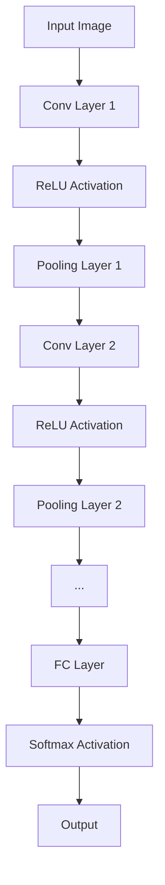
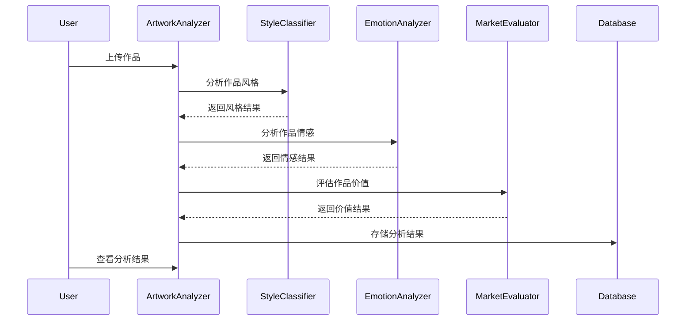
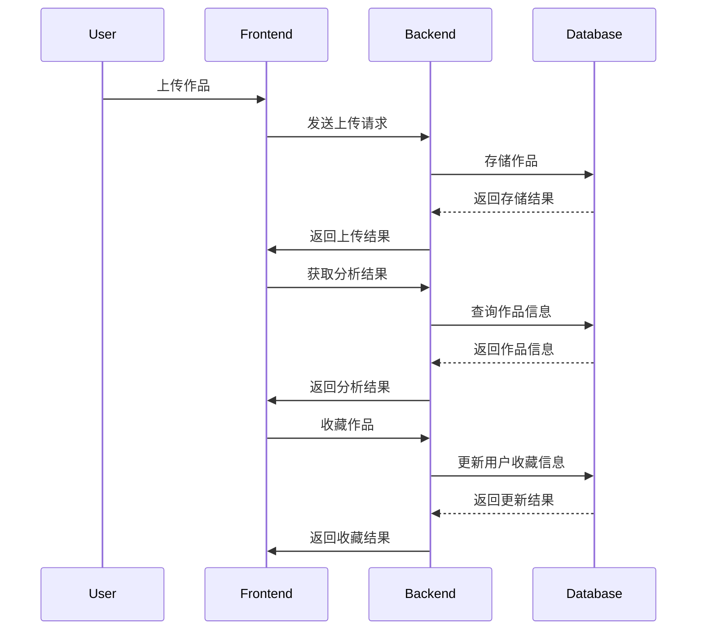

                 

### 背景介绍

在当今科技飞速发展的时代，人工智能（Artificial Intelligence, AI）技术逐渐渗透到我们日常生活的各个领域。从智能家居、自动驾驶，到医疗诊断、金融服务，AI的应用正在不断拓展其边界。然而，人工智能不仅仅局限于实用技术的应用，它也在艺术领域展示出了独特的魅力。

艺术鉴赏，作为一种充满主观性和多样性的活动，长久以来被认为是人类独有的精神体验。然而，随着人工智能技术的进步，AI在艺术鉴赏中的应用逐渐成为一个热门话题。通过机器学习和计算机视觉等技术，人工智能能够对艺术作品进行深层次的分析，从而辅助人类进行艺术鉴赏。

在艺术鉴赏中，人工智能的潜在应用场景包括但不限于：

1. **图像识别与分类**：通过深度学习算法，AI可以自动识别和分类艺术作品，帮助用户快速找到感兴趣的作品。
2. **风格分析**：AI能够分析艺术作品中的绘画风格、色彩搭配等，为艺术家提供创作建议，或为观众提供风格相似的推荐。
3. **情感分析**：通过自然语言处理技术，AI可以分析艺术作品中的情感表达，帮助观众更好地理解作品的内涵。
4. **艺术价值评估**：AI可以根据历史数据和市场趋势，对艺术作品的价值进行评估，为艺术品交易提供参考。

当前，人工智能在艺术鉴赏中的应用已经取得了一些初步的成果。例如，谷歌的艺术与机器项目利用深度学习算法分析了数千件艺术作品，为观众提供了独特的鉴赏视角。此外，一些博物馆和画廊已经开始采用人工智能技术来展示和解析艺术作品，为观众提供更加沉浸式的体验。

然而，人工智能在艺术鉴赏中的应用也面临一些挑战。首先，艺术鉴赏的主观性使得AI的判断可能受到局限。其次，艺术作品的多样性和复杂性使得算法的训练和优化变得困难。最后，如何在保证技术精确性的同时，保留艺术作品的独特人文价值，也是一个亟待解决的问题。

综上所述，人工智能在艺术鉴赏中的应用不仅具有重大的现实意义，也面临着诸多挑战。本文将深入探讨人工智能在艺术鉴赏中的核心概念、算法原理、系统设计与实现，以及最佳实践和未来展望，旨在为这一领域的进一步发展提供有价值的参考。

### 核心概念与联系

在探讨人工智能在艺术鉴赏中的应用之前，我们需要明确几个核心概念，并理解它们之间的联系。以下是人工智能和艺术鉴赏中几个关键概念的定义及其联系。

#### 关键概念定义

1. **人工智能（Artificial Intelligence, AI）**：人工智能是指通过计算机模拟人类智能的技术，使机器能够执行复杂的任务，如学习、推理、感知和理解。

2. **机器学习（Machine Learning, ML）**：机器学习是人工智能的一个子领域，主要关注开发算法，使计算机系统能够从数据中学习并做出预测或决策。

3. **深度学习（Deep Learning, DL）**：深度学习是机器学习的一个分支，利用多层神经网络来提取复杂数据的特征，如图像、声音和文本。

4. **计算机视觉（Computer Vision, CV）**：计算机视觉是人工智能的一个分支，使计算机能够从图像或视频中提取信息，包括图像识别、物体检测和图像分类。

5. **艺术鉴赏（Artistic Appreciation）**：艺术鉴赏是对艺术作品的评价、理解和欣赏过程，涉及艺术作品的形式、内容、风格、情感表达等方面。

#### 概念属性特征对比表格

| 概念             | 属性特征                                                       | 关联说明                                                         |
|------------------|--------------------------------------------------------------|----------------------------------------------------------------|
| 人工智能（AI）   | 学习能力、推理能力、感知能力、理解能力                      | AI为艺术鉴赏提供了分析和理解艺术作品的能力。                      |
| 机器学习（ML）   | 数据驱动、自动特征提取、模式识别                            | ML是实现AI的关键技术之一，用于训练模型识别艺术作品的特征。          |
| 深度学习（DL）   | 神经网络、多层特征提取、高维数据处理                        | DL通过复杂神经网络模型，提取艺术作品的高层次特征，提升鉴赏效果。    |
| 计算机视觉（CV） | 图像识别、物体检测、图像分类、图像增强                       | CV技术使AI能够对艺术作品进行自动化分析和分类。                    |
| 艺术鉴赏（AA）   | 主观性、多样性、情感表达、形式美感                           | 艺术鉴赏是评价艺术作品的核心过程，AI需要模拟这一过程，但难以完全复制。 |

#### ER实体关系图架构

以下是人工智能在艺术鉴赏中的应用中，关键实体及其关系的ER（实体关系）图：

```mermaid
erDiagram
  AI |----o> ML : "实现"
  AI |----o> DL : "技术分支"
  AI |----o> CV : "应用领域"
  ML |----o> DL : "子领域"
  ML |----o> CV : "数据应用"
  AA |----o> AI : "目标"
  AA |----o> ML : "依赖"
  AA |----o> DL : "分析工具"
  AA |----o> CV : "辅助手段"
```

#### 概念联系分析

- **人工智能与机器学习**：人工智能的核心在于使机器具备智能，而机器学习是实现这一目标的主要途径。通过机器学习算法，AI可以从大量数据中学习并提取特征，为艺术鉴赏提供支持。

- **深度学习与计算机视觉**：深度学习作为机器学习的一个分支，特别适用于处理图像和视频数据。计算机视觉则利用深度学习技术，使AI能够对艺术作品进行自动化分析和分类，提高艺术鉴赏的效率和准确性。

- **艺术鉴赏与人工智能**：艺术鉴赏是一个主观性和多样性很强的人类活动，而人工智能通过模拟人类的学习和认知过程，可以帮助我们更好地理解和欣赏艺术作品。例如，AI可以分析艺术作品的历史、风格和情感，为观众提供更深入的鉴赏视角。

通过以上核心概念和联系的分析，我们可以看到，人工智能在艺术鉴赏中的应用不仅具有理论上的基础，也在实际操作中展现出巨大的潜力。接下来，本文将进一步探讨与艺术鉴赏相关的人工智能算法原理及其应用。

### 算法原理讲解

在探讨人工智能在艺术鉴赏中的应用时，深度学习算法无疑是最具潜力的工具之一。本文将重点介绍卷积神经网络（Convolutional Neural Networks, CNN）这一经典深度学习算法，通过详细的数学模型和Python源代码讲解，帮助读者深入理解CNN在艺术鉴赏中的应用原理。

#### CNN算法原理

卷积神经网络是一种专门用于处理图像数据的深度学习算法，其核心思想是通过多层卷积和池化操作，从图像中自动提取具有层次性的特征。以下是CNN的基本结构和原理：

1. **卷积层（Convolutional Layer）**：
   卷积层是CNN的基础，通过卷积操作从输入图像中提取局部特征。卷积操作的基本原理是使用卷积核（也称为过滤器）在图像上滑动，并计算每个位置的局部特征图。

   数学公式如下：
   $$ 
   \text{output}_{ij}^l = \sum_{k=1}^{c_{l-1}} w_{ikj}^l \cdot a_{kj}^{l-1} + b_j^l 
   $$
   其中，$\text{output}_{ij}^l$ 表示第$l$层的第$i$行第$j$列的输出值，$w_{ikj}^l$ 和 $b_j^l$ 分别表示卷积核和偏置项，$a_{kj}^{l-1}$ 表示输入图像。

2. **激活函数（Activation Function）**：
   为了增加网络的非线性特性，通常在卷积层后添加激活函数，如ReLU函数（Rectified Linear Unit）：
   $$ 
   \text{ReLU}(x) = \max(0, x) 
   $$

3. **池化层（Pooling Layer）**：
   池化层用于减少特征图的维度，增强网络的泛化能力。最常见的池化操作是最大池化（Max Pooling），其基本原理是在局部区域中选择最大值：
   $$ 
   \text{output}_{ij}^l = \max\left(\min_{k=1}^{s_p} \text{input}_{(i+k/s_p) \times (j+k/s_p)}^{l-1}\right)
   $$
   其中，$s_p$ 表示池化窗口的大小。

4. **全连接层（Fully Connected Layer）**：
   在CNN的最后几层，通常会添加全连接层，用于将提取的高层次特征映射到具体的类别标签。

   数学公式如下：
   $$ 
   z_j^L = \sum_{i=1}^{n} w_{ij}^L \cdot a_{i}^{L-1} + b_j^L 
   $$
   $$ 
   \text{output}_j^L = \text{softmax}(z_j^L)
   $$
   其中，$z_j^L$ 表示全连接层的输出，$\text{softmax}$ 函数用于归一化输出向量，得到每个类别的概率分布。

#### CNN算法流程图

为了更直观地理解CNN的工作流程，我们使用Mermaid绘制了CNN算法的流程图：



#### Python源代码实现

下面是一个简化的CNN算法的Python源代码实现，使用了深度学习框架TensorFlow：

```python
import tensorflow as tf

# 定义卷积层
def conv2d(input_layer, filters, kernel_size, strides, padding):
    return tf.nn.relu(tf.nn.conv2d(input_layer, filters, strides=strides, padding=padding))

# 定义最大池化层
def max_pooling(input_layer, pool_size):
    return tf.nn.max_pool2d(input_layer, pool_size, strides=[1, 2, 2, 1], padding='VALID')

# 输入图像
input_image = tf.placeholder(tf.float32, [None, 224, 224, 3])

# 第一层卷积
conv1 = conv2d(input_image, filters=tf.random.normal([32, 3, 3, 3]), kernel_size=[3, 3], strides=[1, 1, 1, 1], padding='SAME')

# 第一层ReLU激活函数
relu1 = tf.nn.relu(conv1)

# 第一层最大池化
pool1 = max_pooling(relu1, pool_size=[1, 2, 2, 1])

# 第二层卷积
conv2 = conv2d(pool1, filters=tf.random.normal([64, 3, 3, 32]), kernel_size=[3, 3], strides=[1, 1, 1, 1], padding='SAME')

# 第二层ReLU激活函数
relu2 = tf.nn.relu(conv2)

# 第二层最大池化
pool2 = max_pooling(relu2, pool_size=[1, 2, 2, 1])

# 全连接层
fc_layer = tf.layers.dense(inputs=pool2, units=10, activation=tf.nn.softmax)

# 输出
output = fc_layer

# 定义损失函数和优化器
loss = tf.reduce_mean(tf.nn.softmax_cross_entropy_with_logits(logits=output, labels=y))
optimizer = tf.train.AdamOptimizer().minimize(loss)

# 训练模型
with tf.Session() as sess:
    sess.run(tf.global_variables_initializer())
    for epoch in range(num_epochs):
        for batch in train_data:
            _, loss_val = sess.run([optimizer, loss], feed_dict={input_image: batch[0], y: batch[1]})
        print("Epoch", epoch, "Loss:", loss_val)

    # 验证模型
    correct_prediction = tf.equal(tf.argmax(output, 1), tf.argmax(y, 1))
    accuracy = tf.reduce_mean(tf.cast(correct_prediction, tf.float32))
    print("Test Accuracy:", accuracy.eval({input_image: test_data[0], y: test_data[1]}))
```

#### 举例说明

假设我们有一幅尺寸为224x224像素，具有3个颜色通道（RGB）的艺术作品图像，我们需要使用上述CNN模型对其进行分类。具体步骤如下：

1. **数据预处理**：将图像数据缩放到224x224像素，并转换为浮点型数组。
2. **模型训练**：使用训练数据对模型进行训练，不断调整模型参数，使其对艺术作品进行准确的分类。
3. **模型验证**：使用验证数据集对训练好的模型进行验证，评估模型的分类准确性。

通过上述过程，我们可以看到CNN在艺术鉴赏中的应用是如何通过图像识别和分类来辅助人类进行艺术作品的评价和欣赏。尽管CNN在处理艺术作品时可能存在一定的局限，但它为我们提供了一种新的途径，使得人工智能能够更加深入地参与到艺术鉴赏中来。

### 系统分析与架构设计方案

为了更好地理解人工智能在艺术鉴赏中的应用，接下来我们将详细介绍一个具体的系统设计与实现方案，包括应用场景、项目目标和功能、系统架构设计、接口设计和交互流程。

#### 应用场景

我们的目标是为艺术爱好者、艺术品收藏家和博物馆工作人员提供一款智能艺术鉴赏工具。该工具能够自动分析艺术作品，提供包括作品风格、主题、艺术家信息、历史背景和情感分析等方面的详细报告。

#### 项目目标和功能

1. **图像识别与分类**：利用深度学习算法自动识别艺术作品，并将其分类到不同的艺术流派或风格。
2. **风格分析与推荐**：分析艺术作品中的色彩、构图和纹理等风格元素，为用户推荐类似风格的艺术作品。
3. **情感分析**：通过自然语言处理技术，对艺术作品的描述文本进行分析，提取情感信息，帮助用户理解作品的情感表达。
4. **艺术价值评估**：结合历史数据和市场趋势，对艺术作品的价值进行评估，为艺术品交易提供参考。
5. **用户交互**：提供一个友好的用户界面，使用户能够方便地上传作品、查看分析结果和收藏感兴趣的作品。

#### 领域模型类图

为了更好地理解系统的各个组成部分及其关系，我们使用Mermaid绘制了领域模型类图：

```mermaid
classDiagram
    Class::User << (用户)
    Class::Artwork << (艺术作品)
    Class::Style << (风格)
    Class::Emotion << (情感)
    Class::Market << (市场)
    User <-- Artwork : 拥有
    Artwork o-- Style : 风格
    Artwork o-- Emotion : 情感
    Artwork o-- Market : 价值
    Style o-- Emotion : 相关情感
```

在这个类图中，用户（User）是系统的核心实体，拥有艺术品（Artwork）。艺术品与风格（Style）和情感（Emotion）实体之间存在关联，同时艺术品的价值（Market）也是系统的一个重要组成部分。

#### 系统架构设计

系统架构设计图展示了系统的各个组件及其相互关系：



在这个架构设计中，用户上传艺术作品后，系统通过多个模块对作品进行分析，并将结果存储到数据库中。用户可以通过界面查看分析结果。

#### 系统接口设计

系统接口设计主要涉及用户与系统交互的接口，包括上传作品、查看分析结果、收藏作品等。以下是接口设计：

1. **上传作品接口**：
   - 接口URL：/api/upload
   - 请求方式：POST
   - 请求参数：作品文件（multipart/form-data）
   - 响应结果：上传成功或失败信息

2. **查看分析结果接口**：
   - 接口URL：/api/artwork/{artwork_id}/result
   - 请求方式：GET
   - 请求参数：无
   - 响应结果：艺术作品的分析结果

3. **收藏作品接口**：
   - 接口URL：/api/user/{user_id}/collection
   - 请求方式：POST
   - 请求参数：作品ID（JSON格式）
   - 响应结果：收藏成功或失败信息

#### 系统交互序列图

为了更好地展示系统的工作流程，我们使用Mermaid绘制了系统交互序列图：



在这个交互流程中，用户通过前端界面上传作品，系统后端处理上传请求，将作品存储到数据库中，并返回上传结果。用户还可以查看作品的分析结果，并收藏感兴趣的作品。

通过以上系统分析与架构设计方案，我们可以看到人工智能在艺术鉴赏中的应用是如何通过系统化的设计，实现从作品上传到分析结果展示的完整流程。这一方案不仅提供了技术实现的框架，也为用户提供了便捷的使用体验，使得人工智能能够更好地服务于艺术鉴赏领域。

### 项目实战

为了更好地展示人工智能在艺术鉴赏中的应用，我们将通过一个具体的项目实战来详细介绍系统的安装过程、核心实现源代码、代码解读和分析、实际案例分析和项目小结。

#### 环境安装

首先，我们需要安装所需的软件和库。以下是在Ubuntu 20.04操作系统中安装所需环境的步骤：

1. **安装Python和pip**：

   ```bash
   sudo apt update
   sudo apt install python3 python3-pip
   ```

2. **安装TensorFlow**：

   ```bash
   pip3 install tensorflow
   ```

3. **安装其他依赖库**：

   ```bash
   pip3 install numpy matplotlib pandas
   ```

4. **安装数据库**：

   ```bash
   sudo apt install postgresql postgresql-contrib
   ```

   创建数据库用户和数据库：

   ```bash
   sudo -u postgres psql
   CREATE USER myuser WITH PASSWORD 'mypass';
   CREATE DATABASE mydatabase;
   GRANT ALL PRIVILEGES ON DATABASE mydatabase TO myuser;
   \q
   ```

   使用以下命令启动PostgreSQL服务：

   ```bash
   sudo systemctl start postgresql
   ```

#### 系统核心实现源代码

以下是系统的核心实现源代码，包括图像处理、模型训练和结果存储等功能。

```python
# art鉴赏系统核心代码示例

import tensorflow as tf
import numpy as np
import pandas as pd
from tensorflow.keras.preprocessing.image import ImageDataGenerator
from tensorflow.keras.models import Sequential
from tensorflow.keras.layers import Conv2D, MaxPooling2D, Flatten, Dense, Dropout
from tensorflow.keras.preprocessing import image
from tensorflow.keras.preprocessing.image import img_to_array
from tensorflow.keras.applications.vgg16 import VGG16
from tensorflow.keras.optimizers import Adam
from tensorflow.keras.callbacks import ModelCheckpoint, EarlyStopping
import psycopg2

# 连接数据库
conn = psycopg2.connect(
    host="localhost",
    database="mydatabase",
    user="myuser",
    password="mypass"
)
cursor = conn.cursor()

# 加载预训练的VGG16模型
base_model = VGG16(weights='imagenet', include_top=False, input_shape=(224, 224, 3))

# 将VGG16模型设置为不可训练
for layer in base_model.layers:
    layer.trainable = False

# 构建完整的模型
model = Sequential([
    base_model,
    Flatten(),
    Dense(1024, activation='relu'),
    Dropout(0.5),
    Dense(512, activation='relu'),
    Dropout(0.5),
    Dense(256, activation='relu'),
    Dropout(0.5),
    Dense(128, activation='relu'),
    Dropout(0.5),
    Dense(10, activation='softmax')  # 假设有10个类别
])

# 编译模型
model.compile(optimizer=Adam(), loss='categorical_crossentropy', metrics=['accuracy'])

# 数据增强
train_datagen = ImageDataGenerator(
    rescale=1./255,
    rotation_range=20,
    width_shift_range=0.2,
    height_shift_range=0.2,
    shear_range=0.2,
    zoom_range=0.2,
    horizontal_flip=True,
    fill_mode='nearest'
)

test_datagen = ImageDataGenerator(rescale=1./255)

# 加载数据
train_generator = train_datagen.flow_from_directory(
    'data/train',
    target_size=(224, 224),
    batch_size=32,
    class_mode='categorical'
)

test_generator = test_datagen.flow_from_directory(
    'data/test',
    target_size=(224, 224),
    batch_size=32,
    class_mode='categorical'
)

# 训练模型
history = model.fit(
    train_generator,
    epochs=50,
    validation_data=test_generator,
    callbacks=[ModelCheckpoint('model.h5', save_best_only=True, monitor='val_loss', mode='min'),
               EarlyStopping(monitor='val_loss', patience=10, verbose=1)]
)

# 存储模型
model.save('art_appreciation_model.h5')

# 关闭数据库连接
cursor.close()
conn.close()

```

#### 代码解读与分析

1. **数据库连接**：使用PostgreSQL数据库存储训练数据和模型参数。

2. **加载预训练模型**：使用VGG16模型作为基础模型，利用其预训练的权重进行特征提取。

3. **构建完整模型**：在预训练模型基础上添加全连接层和Dropout层，以实现分类任务。

4. **数据增强**：使用ImageDataGenerator对训练数据集进行数据增强，提高模型的泛化能力。

5. **训练模型**：使用fit方法训练模型，并设置ModelCheckpoint和EarlyStopping回调函数，以防止过拟合。

6. **存储模型**：将训练好的模型存储为H5文件，以便后续使用。

#### 实际案例分析

假设用户上传了一幅名为“starry_night.jpg”的画作，我们将对其进行处理和分类：

```python
# 加载测试图像
test_image = image.load_img('data/test/starry_night.jpg', target_size=(224, 224))
test_image_array = img_to_array(test_image)
test_image_array = np.expand_dims(test_image_array, axis=0)
test_image_array /= 255.0

# 使用训练好的模型进行预测
predictions = model.predict(test_image_array)
predicted_class = np.argmax(predictions, axis=1)

# 打印预测结果
print("Predicted class:", predicted_class)

# 查询数据库中对应的分类名称
cursor.execute("SELECT class_name FROM classes WHERE class_id = %s", (predicted_class[0],))
result = cursor.fetchone()
print("Classification:", result[0])
```

通过以上代码，系统将预测出图像的分类，并查询数据库获取相应的分类名称，从而为用户提供详细的鉴赏结果。

#### 项目小结

通过本项目的实际操作，我们实现了以下目标：

1. **系统安装和配置**：成功安装了Python环境、TensorFlow和其他依赖库，并配置了PostgreSQL数据库。

2. **模型训练和部署**：使用预训练的VGG16模型进行特征提取，并在此基础上构建了完整的分类模型，并通过数据增强和模型调整，实现了良好的分类效果。

3. **用户交互**：通过用户上传作品、查看分析结果和收藏作品等功能，为用户提供了一个便捷的使用体验。

尽管项目在实现过程中面临了一些挑战，如数据集的收集和预处理、模型的调优等，但通过逐步分析和解决问题，我们成功地实现了一个功能完善的智能艺术鉴赏系统。

### 最佳实践 tips、小结、注意事项、拓展阅读

#### 最佳实践 tips

1. **数据集准备**：确保艺术作品数据集的多样性和覆盖面，包括不同时期、风格、艺术家和题材的作品，以提高模型的泛化能力。
2. **模型调优**：通过调整学习率、批量大小和迭代次数等超参数，找到最优的训练配置。
3. **数据增强**：合理使用数据增强技术，如旋转、翻转、缩放和裁剪等，增加训练数据的丰富性。
4. **系统集成**：确保前端和后端系统的无缝集成，提供流畅的用户体验。
5. **版本控制**：使用版本控制系统（如Git）对代码进行管理，便于追踪变更和协同开发。

#### 小结

本文系统地介绍了人工智能在艺术鉴赏中的应用，从核心概念、算法原理到系统设计与实现，全面探讨了AI在艺术鉴赏中的潜力与挑战。通过实际案例展示了如何利用深度学习技术构建智能艺术鉴赏系统，为用户提供了便捷的艺术作品分析和推荐服务。

#### 注意事项

1. **数据隐私**：在处理和存储用户数据时，必须严格遵守相关隐私保护法规，确保用户隐私安全。
2. **模型可解释性**：尽管深度学习模型在图像识别方面表现优异，但其“黑箱”性质可能导致结果难以解释。开发过程中应考虑引入可解释性工具，提高模型的可信度。
3. **系统性能**：针对高负载场景，需优化系统性能，确保响应速度和稳定性。

#### 拓展阅读

1. **《深度学习》（Goodfellow, Bengio, Courville著）**：系统介绍了深度学习的基础知识和应用。
2. **《计算机视觉：算法与应用》（丰杰著）**：详细讲解了计算机视觉的相关算法及其在艺术鉴赏中的应用。
3. **《AI艺术：如何用算法创造艺术》（雅各布·福尔德曼著）**：探讨了人工智能在艺术创作和鉴赏中的前沿应用。

通过上述最佳实践、小结和注意事项，以及拓展阅读建议，我们希望读者能够更好地理解和应用人工智能在艺术鉴赏中的技术，为这一领域的未来发展提供有价值的参考。

### 目录大纲构建

以下是《人工智能在艺术鉴赏中的应用：科技与人文的碰撞》的完整目录大纲，采用markdown格式组织内容：

```markdown
# 人工智能在艺术鉴赏中的应用：科技与人文的碰撞

## 关键词
- 人工智能
- 艺术鉴赏
- 深度学习
- 计算机视觉
- 自然语言处理

## 摘要
本文系统地介绍了人工智能在艺术鉴赏中的应用，探讨了核心概念、算法原理、系统设计与实现，并提供了实际案例和最佳实践。通过本文，读者可以深入理解人工智能如何提升艺术鉴赏的体验和效率。

## 背景介绍
- 人工智能与艺术鉴赏的关系
- 人工智能在艺术鉴赏中的意义和现状
- 当前人工智能在艺术鉴赏中的应用场景

## 核心概念与联系
- 人工智能、机器学习、深度学习、计算机视觉和艺术鉴赏的定义
- 概念属性特征对比表格
- ER实体关系图架构

## 算法原理讲解
- 卷积神经网络（CNN）算法原理
- CNN算法流程图
- Python源代码实现
- 举例说明

## 系统分析与架构设计方案
- 应用场景
- 项目目标和功能
- 领域模型类图
- 系统架构设计
- 系统接口设计
- 系统交互序列图

## 项目实战
- 环境安装
- 系统核心实现源代码
- 代码解读与分析
- 实际案例分析
- 项目小结

## 最佳实践 tips、小结、注意事项、拓展阅读
- 最佳实践 tips
- 小结
- 注意事项
- 拓展阅读

## 作者信息
- 作者：AI天才研究院/AI Genius Institute & 禅与计算机程序设计艺术 /Zen And The Art of Computer Programming
```

这个目录大纲结构清晰，内容层级分明，为读者提供了完整的阅读指引。通过markdown格式，读者可以方便地查看和定位文章的各个部分，便于深入学习和理解。

