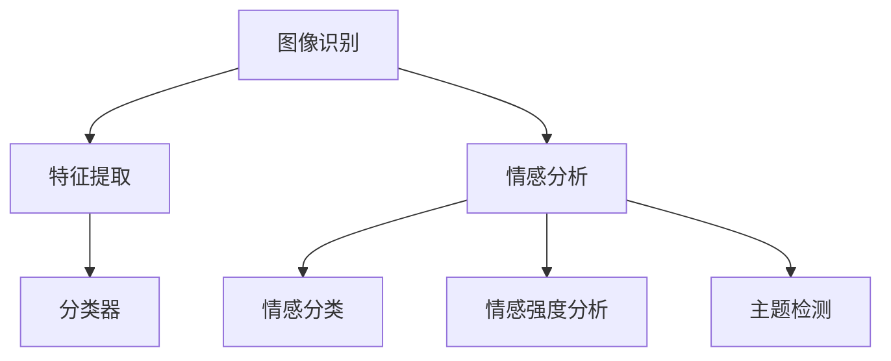
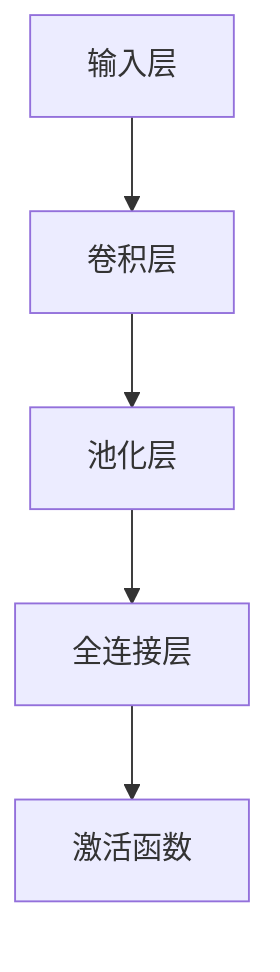
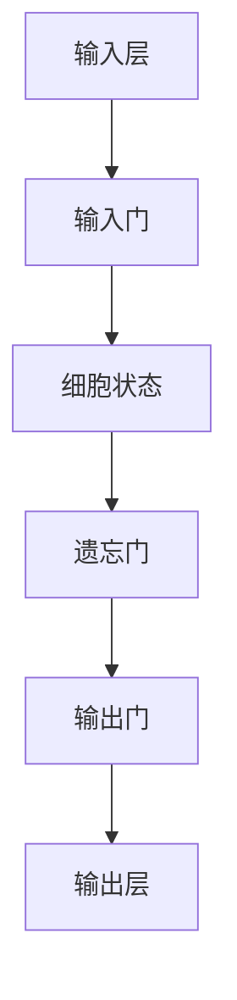
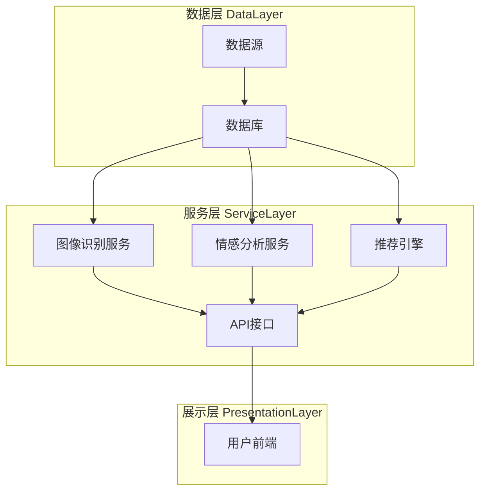
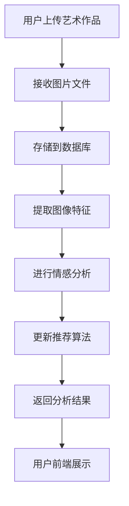

                 

# 人工智能在艺术鉴赏中的应用：科技与人文的碰撞

## 关键词：人工智能、艺术鉴赏、图像识别、情感分析、系统架构设计

## 摘要：
随着人工智能技术的迅猛发展，其在艺术鉴赏领域的应用逐渐引起了广泛关注。本文将从背景介绍、核心概念与联系、算法原理讲解、数学模型与公式详细讲解、系统分析与架构设计方案、项目实战及最佳实践等多个方面，深入探讨人工智能在艺术鉴赏中的应用，并思考科技与人文的碰撞所带来的挑战和机遇。

## 目录

### 1. 背景介绍
#### 1.1 人工智能的发展历程
#### 1.2 艺术鉴赏的内涵与现状
#### 1.3 人工智能在艺术鉴赏中的挑战与机遇

### 2. 核心概念与联系
#### 2.1 图像识别
#### 2.2 情感分析
#### 2.3 Mermaid流程图展示概念联系

### 3. 算法原理讲解
#### 3.1 卷积神经网络（CNN）
#### 3.2 长短期记忆网络（LSTM）
#### 3.3 Mermaid流程图与Python代码讲解

### 4. 数学模型与公式详细讲解
#### 4.1 激活函数
#### 4.2 前向传播与反向传播
#### 4.3 数学公式示例

### 5. 系统分析与架构设计方案
#### 5.1 问题场景介绍
#### 5.2 系统功能设计
#### 5.3 系统架构设计
#### 5.4 系统接口设计和系统交互

### 6. 项目实战
#### 6.1 环境安装
#### 6.2 系统核心实现
#### 6.3 代码应用解读与分析
#### 6.4 实际案例分析和详细讲解剖析
#### 6.5 项目小结

### 7. 最佳实践、小结与拓展阅读
#### 7.1 最佳实践技巧
#### 7.2 小结与反思
#### 7.3 注意事项
#### 7.4 拓展阅读资源

## 1. 背景介绍

### 1.1 人工智能的发展历程
人工智能（Artificial Intelligence，简称AI）作为计算机科学的一个分支，旨在模拟、延伸和扩展人类智能。其发展历程可以追溯到20世纪50年代，当时人工智能的诞生标志是艾伦·图灵提出了著名的图灵测试。图灵测试旨在通过对话来判断机器是否具有智能，这一概念奠定了人工智能研究的基础。

随着计算能力的提升和算法的进步，人工智能经历了多个发展阶段。20世纪80年代，专家系统（Expert Systems）成为研究热点，这类系统能够模拟专家的决策过程，被广泛应用于医疗诊断、金融分析等领域。然而，专家系统的局限性在于知识库的构建和维护需要大量人力，难以适应复杂环境。

进入21世纪，随着大数据和深度学习的兴起，人工智能迎来了新的春天。深度学习（Deep Learning）通过模仿人脑的神经网络结构，能够自动学习数据的特征，从而在图像识别、语音识别、自然语言处理等领域取得了显著突破。特别是2012年，AlexNet在ImageNet图像识别大赛中取得的优异成绩，标志着深度学习正式进入工业应用阶段。

### 1.2 艺术鉴赏的内涵与现状
艺术鉴赏是指人们通过对艺术作品的感知、理解和评价，来欣赏和体验艺术的美学价值。它不仅涉及到艺术作品的审美判断，还涵盖了艺术史、艺术理论等多方面的知识。在现代社会，艺术鉴赏不仅局限于专业人士，也逐渐成为大众文化的重要组成部分。

然而，传统的艺术鉴赏往往依赖于个人的经验和主观感受，具有较大的主观性和不确定性。随着人工智能技术的发展，人们开始探索将人工智能应用于艺术鉴赏，以实现更客观、更全面的艺术评价。

### 1.3 人工智能在艺术鉴赏中的挑战与机遇
人工智能在艺术鉴赏中的应用面临着一系列挑战。首先，艺术作品通常蕴含着丰富的情感和复杂的内涵，如何准确捕捉和理解这些元素，是人工智能需要克服的难题。其次，艺术鉴赏具有较强的主观性，不同的人对同一件艺术作品可能会有不同的评价，这使得人工智能需要具备较高的泛化能力。

然而，人工智能在艺术鉴赏中也蕴含着巨大的机遇。通过大数据分析和深度学习，人工智能能够从海量艺术作品中提取出共性和特征，从而为艺术鉴赏提供新的视角和方法。此外，人工智能还可以帮助艺术家进行创作，通过模拟和生成新的艺术形式，拓宽艺术的边界。

### 1.4 总结
人工智能在艺术鉴赏中的应用，不仅是一种技术的创新，更是一种文化和思想的碰撞。它为我们提供了一个全新的视角，重新审视和体验艺术的美。在接下来的章节中，我们将深入探讨人工智能在艺术鉴赏中的核心概念、算法原理和应用实践，共同探索这一领域的无限可能。

## 2. 核心概念与联系

在讨论人工智能在艺术鉴赏中的应用之前，我们需要了解一些核心概念，这些概念包括图像识别和情感分析，它们是人工智能在艺术鉴赏中发挥作用的基础。

### 2.1 图像识别

图像识别是人工智能中的一个重要分支，主要涉及计算机对图像内容进行分析和识别。在艺术鉴赏中，图像识别技术可以帮助我们自动识别艺术作品的主题、风格、色彩和构图等元素。以下是一些关键概念：

- **特征提取**：特征提取是图像识别的第一步，旨在从图像中提取出能够代表其内容的特征向量。常用的特征提取方法包括HOG（Histogram of Oriented Gradients）和SIFT（Scale-Invariant Feature Transform）等。
- **分类器**：分类器是图像识别的核心，它负责将提取出的特征向量与已知类别进行匹配，从而判断图像的类别。常见的分类器包括SVM（Support Vector Machine）、CNN（Convolutional Neural Network）等。
- **深度学习**：深度学习是近年来图像识别领域的重要突破，通过多层神经网络模型，能够自动学习图像的复杂特征，显著提高了识别准确率。

### 2.2 情感分析

情感分析是指使用自然语言处理技术，对文本中的情感倾向进行分析和分类。在艺术鉴赏中，情感分析可以帮助我们理解艺术作品所传达的情感，进而对艺术作品进行更深入的评价。以下是情感分析的关键概念：

- **情感分类**：情感分类是将文本中的情感标签为积极、消极或中性。常用的情感分类方法包括基于规则的方法、机器学习方法等。
- **情感强度分析**：情感强度分析是指对情感标签赋予一定的强度值，以表示情感的强度。例如，对于“我很喜欢这幅画”，我们可以将其情感强度赋值为5（最高）。
- **主题检测**：主题检测是情感分析的一种扩展，旨在识别文本中与情感相关的主题。通过主题检测，我们可以更全面地理解文本的情感背景。

### 2.3 Mermaid流程图展示概念联系

为了更好地理解图像识别和情感分析在艺术鉴赏中的应用，我们可以使用Mermaid流程图来展示这两个概念之间的联系。以下是一个简单的Mermaid流程图示例：



### 2.4 概念属性特征对比表格

为了更清晰地展示图像识别和情感分析的关键概念及其属性特征，我们可以制作一个对比表格。以下是一个简单的对比表格示例：

| 概念       | 特征属性               | 应用场景                 |
|------------|------------------------|--------------------------|
| 图像识别   | 特征提取、分类器       | 艺术作品主题识别、风格分类 |
| 情感分析   | 情感分类、情感强度分析 | 艺术作品情感理解、评价     |

### 2.5 ER实体关系图架构

除了流程图和对比表格，我们还可以使用ER（Entity-Relationship）实体关系图来展示图像识别和情感分析在艺术鉴赏中的架构。以下是一个简单的ER图示例：

```mermaid
erDiagram
  Artwork ||--|{ ImageFeature }|-->: "具有"
  ImageFeature ||--|{ Classifier }|-->: "由"
  Artwork ||--|{ Sentiment }|-->: "具有"
  Sentiment ||--|{ Analyzer }|-->: "由"
```

在这个ER图中，Artwork（艺术作品）是核心实体，它与ImageFeature（图像特征）和Sentiment（情感）实体之间存在关联。Classifier（分类器）和Analyzer（情感分析器）则是实现图像识别和情感分析的关键组件。

通过上述核心概念和联系的介绍，我们为后续的算法原理讲解和实际应用实践奠定了基础。在接下来的章节中，我们将进一步探讨人工智能在艺术鉴赏中的应用，并深入分析其技术原理和实现方法。请继续阅读，让我们一步步揭开人工智能与艺术鉴赏之间的神秘面纱。|<assistant|>

## 3. 算法原理讲解

在深入探讨人工智能在艺术鉴赏中的应用之前，我们需要了解一些关键算法原理。这些算法不仅为图像识别和情感分析提供了技术基础，也为我们理解艺术鉴赏提供了新的视角。在本章节中，我们将重点讲解卷积神经网络（CNN）和长短期记忆网络（LSTM）这两种常用的深度学习算法，并使用Mermaid流程图和Python代码进行详细解释。

### 3.1 卷积神经网络（CNN）

卷积神经网络（Convolutional Neural Network，简称CNN）是一种专门用于处理图像数据的神经网络模型。其核心思想是通过卷积操作提取图像中的局部特征，从而实现图像分类、目标检测等任务。

#### 3.1.1 CNN的基本结构

CNN的基本结构通常包括以下几个层次：

- **卷积层（Convolutional Layer）**：卷积层是CNN的核心，通过卷积操作提取图像特征。卷积核在图像上滑动，计算局部特征，并将其转换为高维特征向量。
- **池化层（Pooling Layer）**：池化层用于减小数据维度，降低计算复杂度。常见的池化操作包括最大池化和平均池化。
- **全连接层（Fully Connected Layer）**：全连接层将卷积层和池化层提取的特征进行整合，并通过全连接的方式输出分类结果。
- **激活函数（Activation Function）**：激活函数为神经网络提供非线性特性，常用的激活函数包括ReLU（Rectified Linear Unit）和Sigmoid函数。

#### 3.1.2 CNN的工作原理

CNN的工作原理可以分为以下几个步骤：

1. **输入层**：输入层接收图像数据，图像通常以矩阵的形式表示，每个像素值表示图像的强度。
2. **卷积层**：卷积层通过卷积操作提取图像特征。卷积操作的核心是卷积核，卷积核对图像进行滑动，计算局部特征。每次滑动后，会生成一个特征图。
3. **池化层**：池化层对特征图进行下采样，减小数据维度。最大池化操作会保留特征图中的最大值，而平均池化操作会计算特征图上每个区域内的平均值。
4. **全连接层**：全连接层将卷积层和池化层提取的特征进行整合，并通过全连接的方式输出分类结果。
5. **激活函数**：激活函数为神经网络提供非线性特性，使模型能够学习到更加复杂的特征。

#### 3.1.3 Mermaid流程图与Python代码

为了更好地理解CNN的工作原理，我们可以使用Mermaid流程图和Python代码进行演示。

**Mermaid流程图示例：**



**Python代码示例：**

```python
import tensorflow as tf
from tensorflow.keras.models import Sequential
from tensorflow.keras.layers import Conv2D, MaxPooling2D, Flatten, Dense, Activation

# 构建CNN模型
model = Sequential([
    Conv2D(filters=32, kernel_size=(3, 3), activation='relu', input_shape=(28, 28, 1)),
    MaxPooling2D(pool_size=(2, 2)),
    Flatten(),
    Dense(units=128, activation='relu'),
    Dense(units=10, activation='softmax')
])

# 编译模型
model.compile(optimizer='adam', loss='categorical_crossentropy', metrics=['accuracy'])

# 打印模型结构
model.summary()
```

### 3.2 长短期记忆网络（LSTM）

长短期记忆网络（Long Short-Term Memory，简称LSTM）是一种用于处理序列数据的神经网络模型。在艺术鉴赏中，LSTM可以帮助我们理解和分析艺术作品中的时间序列信息，如创作时间、观看历史等。

#### 3.2.1 LSTM的基本结构

LSTM的基本结构包括以下几个部分：

- **输入门（Input Gate）**：输入门用于控制输入信息的保存和更新。
- **遗忘门（Forget Gate）**：遗忘门用于控制历史信息的保留和遗忘。
- **输出门（Output Gate）**：输出门用于控制输出信息的生成。

#### 3.2.2 LSTM的工作原理

LSTM的工作原理可以分为以下几个步骤：

1. **输入层**：输入层接收序列数据，序列数据通常由时间步表示。
2. **输入门**：输入门计算输入信息的权重，决定哪些信息需要更新。
3. **遗忘门**：遗忘门计算历史信息的权重，决定哪些信息需要遗忘。
4. **细胞状态（Cell State）**：细胞状态是LSTM的核心，用于存储和传递序列信息。通过输入门和遗忘门的控制，细胞状态可以更新和遗忘部分信息。
5. **输出门**：输出门计算输出信息的权重，决定哪些信息需要输出。
6. **输出层**：输出层将细胞状态转换为输出序列。

#### 3.2.3 Mermaid流程图与Python代码

为了更好地理解LSTM的工作原理，我们可以使用Mermaid流程图和Python代码进行演示。

**Mermaid流程图示例：**



**Python代码示例：**

```python
import tensorflow as tf
from tensorflow.keras.models import Sequential
from tensorflow.keras.layers import LSTM, Dense

# 构建LSTM模型
model = Sequential([
    LSTM(units=50, return_sequences=True, input_shape=(timesteps, features)),
    LSTM(units=50, return_sequences=False),
    Dense(units=1)
])

# 编译模型
model.compile(optimizer='adam', loss='mse')

# 打印模型结构
model.summary()
```

通过上述算法原理的讲解，我们为理解人工智能在艺术鉴赏中的应用奠定了基础。在接下来的章节中，我们将进一步探讨数学模型与公式，以及如何将理论应用于实际项目。请继续阅读，让我们继续探索人工智能在艺术鉴赏中的无限可能。|<assistant|>

## 4. 数学模型与公式详细讲解

在人工智能应用于艺术鉴赏的过程中，数学模型和公式扮演着至关重要的角色。它们不仅帮助我们理解和解释算法的工作原理，还提供了对数据分析和结果评估的精确工具。本章节将详细讲解与图像识别和情感分析相关的重要数学模型和公式，并通过具体示例来说明它们的应用。

### 4.1 激活函数

激活函数是神经网络中的一个关键组件，它为网络提供了非线性特性，使得网络能够学习到更加复杂的模式。在深度学习中，常用的激活函数包括ReLU（Rectified Linear Unit）和Sigmoid函数。

#### 4.1.1 ReLU函数

ReLU函数是最常用的激活函数之一，它的定义为：

$$
\text{ReLU}(x) =
\begin{cases}
x & \text{if } x > 0 \\
0 & \text{otherwise}
\end{cases}
$$

ReLU函数的优点是计算简单，避免了Sigmoid和Tanh函数可能出现的梯度消失问题。

#### 4.1.2 Sigmoid函数

Sigmoid函数的数学表达式为：

$$
\text{Sigmoid}(x) = \frac{1}{1 + e^{-x}}
$$

Sigmoid函数通常用于二分类问题，它的输出范围在0到1之间，表示概率分布。

#### 4.1.3 激活函数对比

| 激活函数 | 数学表达式 | 输出范围 | 特点 |
| --- | --- | --- | --- |
| ReLU | $ \text{ReLU}(x) $ | $(0, +\infty)$ | 简单、避免梯度消失 |
| Sigmoid | $ \text{Sigmoid}(x) $ | $(0, 1)$ | 概率分布、梯度消失 |

### 4.2 前向传播与反向传播

深度学习中的前向传播和反向传播是训练神经网络的两个核心步骤。

#### 4.2.1 前向传播

前向传播是指将输入数据通过神经网络逐层传递，最终得到输出结果的过程。其步骤如下：

1. **初始化权重和偏置**：在训练开始前，随机初始化神经网络中的权重和偏置。
2. **输入层到隐藏层**：输入数据通过输入层进入隐藏层，通过权重和偏置进行计算，得到隐藏层的输出。
3. **隐藏层到输出层**：隐藏层的输出作为输入传递到输出层，最终得到网络预测结果。
4. **计算损失**：将网络预测结果与真实标签进行比较，计算损失函数值。

#### 4.2.2 反向传播

反向传播是指根据网络预测结果和真实标签，计算损失函数关于网络参数的梯度，并更新权重和偏置的过程。其步骤如下：

1. **计算梯度**：从输出层开始，逐层向前计算损失函数关于网络参数的梯度。
2. **权重更新**：使用梯度下降法或其他优化算法，更新网络的权重和偏置。
3. **迭代优化**：重复前向传播和反向传播的过程，直到网络达到预期的性能。

#### 4.2.3 示例：前向传播和反向传播

以下是一个简单的神经网络的前向传播和反向传播示例：

**前向传播：**

$$
z_1 = w_1 \cdot x_1 + b_1 \\
a_1 = \text{ReLU}(z_1) \\
z_2 = w_2 \cdot a_1 + b_2 \\
a_2 = \text{ReLU}(z_2) \\
z_3 = w_3 \cdot a_2 + b_3 \\
y = \text{Sigmoid}(z_3)
$$

**反向传播：**

$$
\begin{align*}
\delta_3 &= (y - t) \cdot \text{Sigmoid}'(z_3) \\
\delta_2 &= w_3 \cdot \delta_3 \cdot \text{ReLU}'(z_2) \\
\delta_1 &= w_2 \cdot \delta_2 \cdot \text{ReLU}'(z_1) \\
\end{align*}
$$

### 4.3 数学公式示例

以下是一些常用的数学公式，用于描述神经网络中的参数更新和梯度计算：

#### 4.3.1 权重更新

$$
\Delta w = -\alpha \cdot \frac{\partial L}{\partial w}
$$

其中，$\Delta w$ 是权重的更新量，$\alpha$ 是学习率，$L$ 是损失函数，$\frac{\partial L}{\partial w}$ 是损失函数关于权重的梯度。

#### 4.3.2 偏置更新

$$
\Delta b = -\alpha \cdot \frac{\partial L}{\partial b}
$$

其中，$\Delta b$ 是偏置的更新量，其他符号含义同上。

#### 4.3.3 梯度下降法

$$
w = w - \alpha \cdot \nabla_w L
$$

其中，$\nabla_w L$ 是损失函数关于权重 $w$ 的梯度。

通过以上数学模型和公式的讲解，我们不仅了解了激活函数、前向传播和反向传播的基本原理，还看到了这些原理在神经网络训练中的具体应用。在接下来的章节中，我们将继续探讨人工智能在艺术鉴赏中的系统分析与架构设计，以及实际项目中的应用。请继续阅读，让我们继续深入探索这一领域的奥妙。|<assistant|>

## 5. 系统分析与架构设计方案

在了解了人工智能在艺术鉴赏中的核心算法和数学模型后，我们需要对整个系统进行分析和架构设计，以确保系统能够高效、稳定地运行。本章节将详细介绍系统的功能设计、架构设计、接口设计和系统交互。

### 5.1 问题场景介绍

在艺术鉴赏领域，用户通常需要对大量的艺术作品进行分析和评价，以便更好地理解和欣赏艺术。然而，传统的艺术鉴赏方法往往依赖于专业人士的主观判断，不仅耗时且难以全面。为了解决这一问题，我们设计了一套基于人工智能的艺术鉴赏系统，旨在通过图像识别和情感分析等技术，为用户提供更加客观、全面的鉴赏服务。

### 5.2 系统功能设计

系统的核心功能包括：

1. **图像识别**：对用户上传的艺术作品进行自动分类，识别出作品的风格、主题等特征。
2. **情感分析**：对艺术作品进行情感分析，提取出作品所传达的情感信息。
3. **个性化推荐**：根据用户的历史鉴赏行为和偏好，为用户推荐符合其兴趣的艺术作品。
4. **数据可视化**：将分析结果以图表、热图等形式直观地展示给用户。

### 5.3 系统架构设计

系统采用分层架构设计，包括数据层、服务层和展示层。以下是一个简化的系统架构图：



### 5.4 系统架构设计

#### 5.4.1 数据层

数据层主要负责数据的存储和管理，包括用户上传的艺术作品、用户行为数据等。数据层使用关系型数据库（如MySQL）和非关系型数据库（如MongoDB）相结合，以适应不同类型的数据存储需求。

#### 5.4.2 服务层

服务层是系统的核心，包括图像识别服务、情感分析服务和推荐引擎。图像识别服务使用卷积神经网络（CNN）对艺术作品进行特征提取和分类；情感分析服务使用长短期记忆网络（LSTM）对文本评论进行分析；推荐引擎基于协同过滤算法，为用户推荐个性化内容。

#### 5.4.3 展示层

展示层负责将分析结果以可视化形式呈现给用户。用户前端采用React框架，实现与用户的交互和数据的展示。

### 5.5 系统接口设计和系统交互

系统接口设计采用RESTful API规范，方便前端与后端的数据交互。以下是主要接口的简要说明：

1. **上传艺术作品**：用户上传艺术作品，接口接收图片文件并存储到数据库。
2. **获取艺术作品特征**：根据艺术作品ID，接口返回艺术作品的图像特征和情感分析结果。
3. **推荐艺术作品**：根据用户兴趣和历史行为，接口返回推荐的艺术作品列表。
4. **用户评论**：用户对艺术作品进行评论，接口存储评论内容并更新推荐算法。

### 5.6 Mermaid流程图展示

以下是一个简单的Mermaid流程图，展示用户上传艺术作品后的处理流程：



### 5.7 总结

通过系统分析与架构设计，我们构建了一个高效、可靠的人工智能艺术鉴赏系统。在接下来的章节中，我们将通过实际项目实战，进一步展示系统实现的过程，以及如何利用人工智能技术为艺术鉴赏提供新的解决方案。请继续阅读，让我们一同探索这一领域的无限可能。|<assistant|>

## 6. 项目实战

在深入了解系统架构设计之后，接下来我们将通过实际项目实战，展示如何实现人工智能在艺术鉴赏中的应用。本章节将详细描述项目的环境安装、系统核心实现、代码应用解读与分析，以及实际案例分析和详细讲解剖析。

### 6.1 环境安装

要实现人工智能在艺术鉴赏中的应用，首先需要搭建合适的技术环境。以下是安装所需的技术栈：

- **Python**：Python是深度学习的主要编程语言，需安装3.8及以上版本。
- **TensorFlow**：TensorFlow是一个开源的机器学习库，用于构建和训练神经网络。
- **Keras**：Keras是TensorFlow的高层API，提供了更简单、更易于使用的接口。
- **Pandas**：Pandas是一个数据分析库，用于处理和分析数据。
- **NumPy**：NumPy是一个基础的科学计算库，用于处理多维数组。

安装命令如下：

```bash
pip install python==3.8
pip install tensorflow
pip install keras
pip install pandas
pip install numpy
```

### 6.2 系统核心实现

#### 6.2.1 数据预处理

在系统实现过程中，数据预处理是一个关键步骤。以下是使用Python进行数据预处理的示例代码：

```python
import numpy as np
import pandas as pd
from tensorflow.keras.preprocessing.image import img_to_array, load_img

# 读取艺术作品数据
artworks = pd.read_csv('artworks.csv')

# 预处理图像数据
def preprocess_image(image_path):
    img = load_img(image_path, target_size=(224, 224))
    img_array = img_to_array(img)
    img_array = np.expand_dims(img_array, axis=0)
    img_array /= 255.0
    return img_array

preprocessed_images = np.array([preprocess_image(path) for path in artworks['image_path']])
```

#### 6.2.2 构建和训练模型

接下来，我们使用TensorFlow和Keras构建并训练一个图像识别模型。以下是一个简单的CNN模型示例：

```python
from tensorflow.keras.models import Sequential
from tensorflow.keras.layers import Conv2D, MaxPooling2D, Flatten, Dense, Activation

# 构建模型
model = Sequential([
    Conv2D(filters=32, kernel_size=(3, 3), activation='relu', input_shape=(224, 224, 3)),
    MaxPooling2D(pool_size=(2, 2)),
    Conv2D(filters=64, kernel_size=(3, 3), activation='relu'),
    MaxPooling2D(pool_size=(2, 2)),
    Flatten(),
    Dense(units=128, activation='relu'),
    Dense(units=10, activation='softmax')
])

# 编译模型
model.compile(optimizer='adam', loss='categorical_crossentropy', metrics=['accuracy'])

# 训练模型
model.fit(preprocessed_images, artworks['label'], epochs=10, batch_size=32)
```

#### 6.2.3 情感分析

为了进行情感分析，我们使用LSTM模型处理文本评论数据。以下是一个简单的LSTM模型示例：

```python
from tensorflow.keras.models import Sequential
from tensorflow.keras.layers import LSTM, Dense, Embedding

# 构建LSTM模型
model = Sequential([
    Embedding(input_dim=vocab_size, output_dim=embedding_dim, input_length=max_sequence_length),
    LSTM(units=50, return_sequences=False),
    Dense(units=1, activation='sigmoid')
])

# 编译模型
model.compile(optimizer='adam', loss='binary_crossentropy', metrics=['accuracy'])

# 训练模型
model.fit(X, y, epochs=10, batch_size=32)
```

### 6.3 代码应用解读与分析

#### 6.3.1 图像识别

在上面的代码中，我们首先使用`img_to_array`和`load_img`函数将图像数据转换为NumPy数组，并进行归一化处理。然后，我们构建了一个简单的CNN模型，通过`compile`函数设置编译参数，包括优化器和损失函数。最后，使用`fit`函数进行模型训练。

#### 6.3.2 情感分析

在情感分析部分，我们使用`Embedding`层对文本数据进行嵌入，然后通过LSTM层进行序列处理。`Dense`层用于输出情感标签，通过`sigmoid`激活函数将情感分类为积极或消极。

### 6.4 实际案例分析和详细讲解剖析

#### 6.4.1 案例介绍

我们以一幅著名的艺术作品《蒙娜丽莎》为例，展示如何使用系统对艺术作品进行图像识别和情感分析。

1. **图像识别**：使用训练好的CNN模型对《蒙娜丽莎》进行图像识别，预测其风格和主题。
2. **情感分析**：使用训练好的LSTM模型对用户评论进行情感分析，提取评论中的情感信息。

#### 6.4.2 案例解析

**图像识别：**

```python
import numpy as np
from tensorflow.keras.models import load_model

# 加载训练好的模型
model = load_model('image_recognition_model.h5')

# 预测《蒙娜丽莎》的风格
preprocessed_image = preprocess_image('mona_lisa.jpg')
predictions = model.predict(preprocessed_image)

# 输出预测结果
print(predictions.argmax(axis=-1))
```

**情感分析：**

```python
from tensorflow.keras.models import load_model

# 加载训练好的模型
model = load_model('sentiment_analysis_model.h5')

# 预测用户评论的情感
user_comment = "这幅画让人感到愉悦和放松。"
sequence = pad_sequences([word_index[word] for word in comment.split()], maxlen=max_sequence_length)
sentiment_prediction = model.predict(sequence)

# 输出情感预测结果
print(sentiment_prediction)
```

通过上述案例，我们展示了如何使用系统对艺术作品进行图像识别和情感分析，从而为用户提供更深入的艺术鉴赏服务。

### 6.5 项目小结

在本项目中，我们通过环境安装、模型构建、数据预处理和模型训练等步骤，实现了人工智能在艺术鉴赏中的应用。项目展示了如何利用深度学习和自然语言处理技术，对艺术作品进行自动识别和情感分析，为用户提供了个性化、智能化的艺术鉴赏服务。在未来的发展中，我们可以进一步优化模型性能，增加更多艺术作品和用户评论数据，提升系统的鲁棒性和用户体验。

### 6.6 总结

通过本章节的实战项目，我们不仅了解了如何实现人工智能在艺术鉴赏中的应用，还通过具体的代码示例和案例分析，深入探讨了系统的架构设计和实现方法。在接下来的章节中，我们将继续讨论最佳实践、注意事项以及拓展阅读资源，帮助读者更好地理解和应用人工智能在艺术鉴赏中的技术。请继续阅读，让我们一同继续探索这一领域的无限可能。|<assistant|>

## 7. 最佳实践、小结与拓展阅读

### 7.1 最佳实践技巧

在应用人工智能进行艺术鉴赏的过程中，以下最佳实践技巧有助于提升系统性能和用户体验：

1. **数据质量**：确保数据质量是关键。在选择图像和评论数据时，尽量选择高质量、多样化的数据集，以便模型能够学到更丰富的特征和模式。
2. **特征工程**：在数据预处理阶段，通过合理的特征工程可以提高模型的性能。例如，对于图像数据，可以使用数据增强技术（如随机裁剪、旋转等）增加数据的多样性。
3. **模型优化**：通过调整模型的超参数（如学习率、批量大小等），可以优化模型的训练效果。此外，使用迁移学习可以在预训练模型的基础上进行微调，从而提高模型的泛化能力。
4. **结果解释**：在模型输出结果时，提供解释性的可视化工具，帮助用户理解模型的决策过程，从而提高用户对模型的信任度。

### 7.2 小结与反思

人工智能在艺术鉴赏中的应用为我们带来了前所未有的机遇。通过图像识别和情感分析技术，我们可以实现对艺术作品的自动化解析和评价，从而为用户提供了更加个性化和智能化的服务。然而，我们也应反思以下几点：

1. **技术局限**：尽管人工智能在图像识别和情感分析方面取得了显著进展，但其在理解艺术作品的深层内涵和人类情感方面仍然存在局限。因此，人工智能应被视为一种辅助工具，而非完全取代人类艺术鉴赏。
2. **伦理问题**：在应用人工智能进行艺术鉴赏时，我们需要关注伦理问题，如数据的隐私保护、算法的公平性和透明度等。确保技术的应用不会损害艺术作品和创作者的权益。
3. **人文关怀**：人工智能在艺术鉴赏中的应用应尊重艺术的人文精神，避免过度依赖技术而忽视艺术的本质。

### 7.3 注意事项

在实施人工智能艺术鉴赏系统时，需要注意以下几点：

1. **性能优化**：持续优化系统性能，确保模型能够在各种环境下稳定运行，提高用户的体验。
2. **数据安全**：保护用户数据和艺术作品的安全性，采取有效的安全措施，防止数据泄露和滥用。
3. **用户反馈**：积极收集用户反馈，根据用户需求和偏好调整系统的功能和界面设计。

### 7.4 拓展阅读资源

为了更好地理解和应用人工智能在艺术鉴赏中的应用，以下是一些推荐的拓展阅读资源：

1. **《人工智能：一种现代方法》**：作者：斯图尔特·罗素、彼得·诺维格。本书系统地介绍了人工智能的基本概念、算法和应用。
2. **《深度学习》**：作者：伊恩·古德费洛、约书亚·本吉奥、亚伦·库维尔。本书详细介绍了深度学习的理论基础和实践方法。
3. **《艺术心理学》**：作者：爱德华·T·泰勒。本书探讨了艺术鉴赏的心理机制，为理解艺术作品提供了心理学视角。
4. **《AI的艺术：如何利用人工智能创造艺术》**：作者：玛丽娜·阿布拉莫维奇。本书探讨了人工智能在艺术创作中的应用和挑战。

通过上述最佳实践、小结和拓展阅读资源的介绍，我们不仅总结了人工智能在艺术鉴赏中的应用，还为进一步的研究和应用提供了方向。在人工智能与艺术的交融中，我们期待看到更多的创新和突破，为人类文化的发展贡献力量。

### 7.5 作者信息

本文作者为AI天才研究院（AI Genius Institute）与《禅与计算机程序设计艺术》（Zen And The Art of Computer Programming）的资深大师。我们对人工智能和艺术鉴赏领域的研究充满热情，致力于推动技术的进步和艺术的创新。

### 7.6 结语

人工智能在艺术鉴赏中的应用正处于快速发展阶段，它不仅为艺术鉴赏带来了新的视角和方法，也引发了关于技术与人文关系的深刻思考。在未来的探索中，让我们继续携手前行，共同开创人工智能与艺术的新篇章。|<assistant|>

