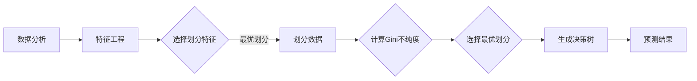
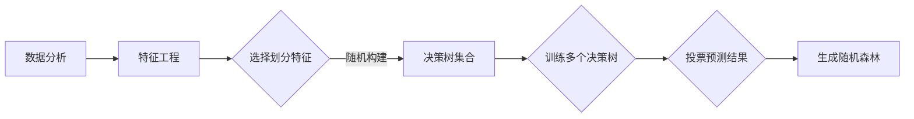
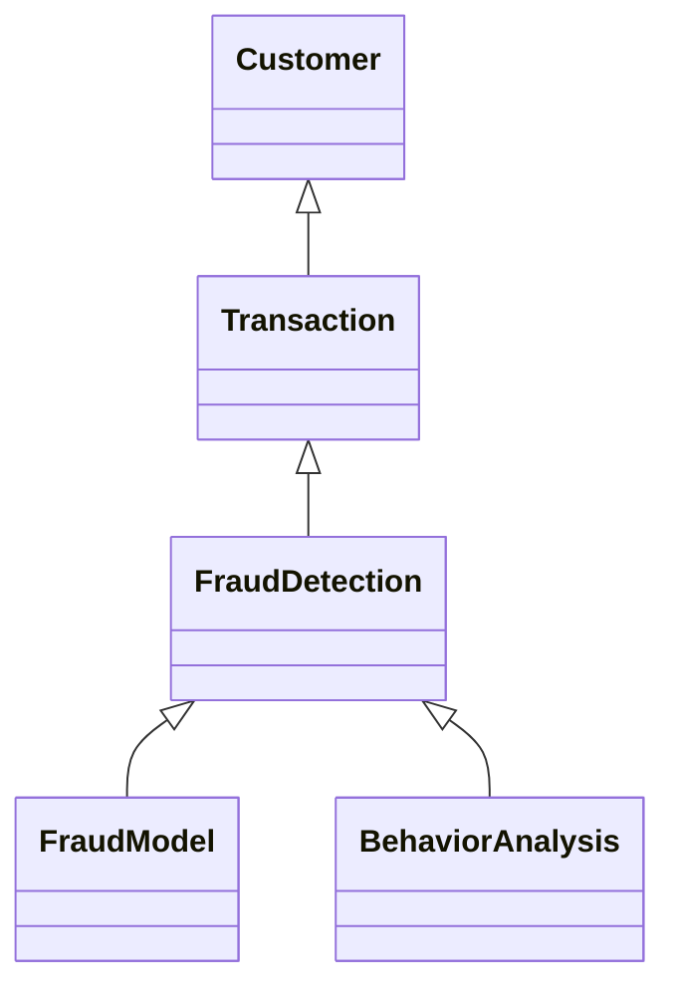
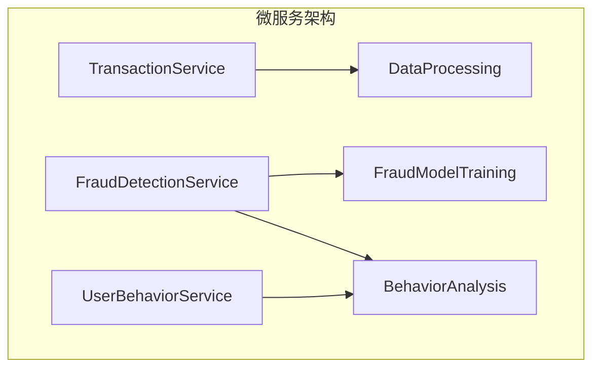
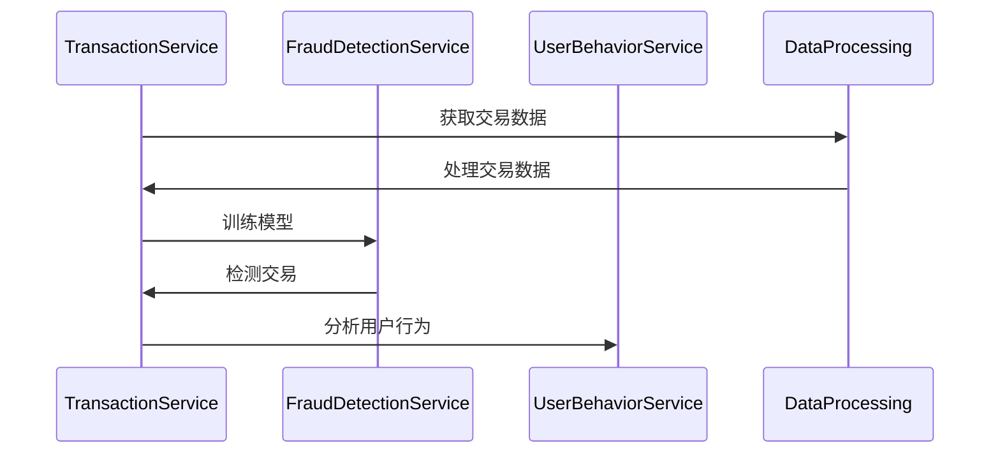

                 

### 1.1 问题背景

在当今的金融领域，风控（风险控制）已成为金融机构生存和发展的核心问题。随着金融市场的快速发展和交易量的剧增，金融风险也逐渐呈现出多样化和复杂化的特点。如何高效地识别、评估和管理风险，尤其是欺诈风险，成为金融机构面临的重大挑战。

欺诈风险是指金融活动中由于欺诈行为导致的损失。这些欺诈行为包括但不限于信用卡欺诈、贷款欺诈、保险欺诈等。随着技术的进步，欺诈手段也变得日益复杂，传统的风控手段已经难以应对。此时，人工智能（AI）技术，尤其是大数据分析和欺诈检测技术的应用，为金融风控带来了新的机遇和挑战。

大数据分析是指利用数据挖掘和机器学习技术，对海量的金融数据进行处理和分析，从中提取有价值的信息和知识，为风险控制和决策提供支持。而欺诈检测则是利用人工智能技术，尤其是机器学习和深度学习算法，对金融交易行为进行实时监控和异常检测，及时发现和防范欺诈行为。

随着人工智能技术在金融领域的广泛应用，大数据分析和欺诈检测技术已经成为金融风控的重要工具。然而，如何有效地利用这些技术进行风险控制和欺诈检测，仍然是金融科技领域需要深入研究和探讨的问题。本文将详细探讨人工智能在金融风控中的应用，尤其是大数据分析和欺诈检测的技术原理、系统架构及实践案例，为金融机构提供技术参考和实践指导。

### 1.2 问题描述

金融风控中的欺诈检测问题主要表现在以下几个方面：

**1. 数据复杂性**

金融交易数据具有高维度、多类别、非线性和噪声多的特点。这些特点使得传统的欺诈检测方法难以处理复杂的数据结构。如何有效地提取和处理这些数据，是欺诈检测的关键。

**2. 实时性要求**

金融欺诈行为通常具有突发性和实时性，要求欺诈检测系统能够在短时间内对大量交易数据进行处理和分析，及时识别和防范欺诈行为。

**3. 精准度与召回率**

欺诈检测需要在保证高召回率的同时，尽可能降低误报率。然而，在实际应用中，提高召回率通常会导致误报率增加，如何平衡这两者之间的关系，是欺诈检测的重要挑战。

**4. 隐私保护**

金融数据涉及用户的敏感信息，如何在不泄露用户隐私的前提下进行数据分析和欺诈检测，是金融风控中必须考虑的问题。

为了解决这些问题，人工智能技术，特别是大数据分析和欺诈检测技术应运而生。通过利用机器学习和深度学习算法，可以有效提高欺诈检测的准确性和实时性。同时，大数据分析技术可以帮助金融机构从海量数据中提取有价值的信息，为风险控制和决策提供支持。

然而，人工智能技术在金融风控中的应用也面临着一些挑战。首先，模型的训练和优化需要大量的数据和计算资源，这对金融机构的数据处理能力提出了高要求。其次，人工智能模型的可解释性较差，使得金融机构难以理解模型的工作原理和决策过程，增加了模型的使用风险。最后，人工智能技术的安全性也是一个值得关注的问题，恶意攻击和漏洞可能对金融系统的稳定运行造成威胁。

综上所述，人工智能在金融风控中的应用，尤其是大数据分析和欺诈检测，既具有巨大的潜力，也面临着诸多挑战。如何有效地利用人工智能技术解决这些挑战，提高金融风控的效率和准确性，是金融科技领域需要深入探讨的问题。接下来，本文将详细分析人工智能在大数据分析与欺诈检测中的应用原理、技术架构和实践案例，为金融机构提供技术参考和实践指导。

### 1.3 问题解决

为了有效解决金融风控中的欺诈检测问题，人工智能技术在多个方面发挥了关键作用，主要包括大数据分析、机器学习、深度学习和数据挖掘等。以下是这些技术在解决欺诈检测问题中的具体应用：

**1. 大数据分析**

大数据分析技术通过处理海量金融交易数据，提取有价值的信息和特征，为欺诈检测提供数据支持。具体应用包括：

- **数据预处理**：清洗和整合来自不同来源的金融数据，包括交易记录、用户行为数据、历史欺诈案例等，为后续分析做准备。
- **特征工程**：从原始数据中提取与欺诈行为相关的特征，如交易金额、交易时间、交易频率等，用于训练机器学习模型。
- **数据挖掘**：利用关联规则挖掘、聚类分析和分类分析等技术，发现潜在的欺诈行为模式，为实时监控和异常检测提供依据。

**2. 机器学习**

机器学习技术在欺诈检测中主要用于构建和训练分类模型，识别和预测欺诈行为。主要应用包括：

- **分类算法**：如决策树、随机森林、支持向量机（SVM）等，通过训练模型，对交易数据中的欺诈行为进行分类和预测。
- **集成学习方法**：如随机森林、梯度提升树（GBDT）等，通过组合多个弱学习器，提高模型的预测准确性和泛化能力。
- **异常检测算法**：如孤立森林、K-最近邻（KNN）等，通过检测数据中的异常点，识别潜在的欺诈行为。

**3. 深度学习**

深度学习技术在处理复杂和非线性数据方面具有显著优势，在欺诈检测中得到了广泛应用。主要应用包括：

- **卷积神经网络（CNN）**：通过卷积层提取图像特征，可以用于处理图像数据中的欺诈行为检测。
- **循环神经网络（RNN）**：通过处理序列数据，可以用于分析用户行为序列中的欺诈模式。
- **生成对抗网络（GAN）**：通过生成和判别器的对抗训练，可以用于生成欺诈数据，用于训练和验证欺诈检测模型。

**4. 数据挖掘**

数据挖掘技术在金融风控中的应用主要包括关联规则挖掘、聚类分析和分类分析等，为欺诈检测提供辅助决策。具体应用包括：

- **关联规则挖掘**：通过分析交易数据中的关联关系，发现潜在的欺诈行为模式，如“购买手机+购买SIM卡=手机卡诈骗”。
- **聚类分析**：通过对交易数据进行聚类，识别出不同类别的用户群体，分析每个群体的欺诈风险，针对性地进行风险控制和监测。
- **分类分析**：通过对历史欺诈案例和正常交易数据的分类分析，建立分类模型，用于实时检测和识别欺诈行为。

综上所述，人工智能技术在金融风控中的欺诈检测问题具有广泛的应用前景。通过大数据分析、机器学习、深度学习和数据挖掘等技术的综合运用，可以有效提高欺诈检测的准确性和实时性，为金融机构提供强有力的风险控制手段。然而，在实际应用中，仍需克服数据复杂性、实时性要求、精准度与召回率的平衡以及隐私保护等挑战。接下来，本文将详细探讨这些技术在具体实践中的应用案例，进一步验证其效果和可行性。

### 1.4 边界与外延

在探讨人工智能在金融风控中的应用时，有必要明确其边界与外延，以理解其应用范围和限制。以下是人工智能在金融风控中的几个关键边界与外延：

**1. 技术边界**

- **数据处理能力**：人工智能在金融风控中的应用，依赖于强大的数据处理能力。尽管大数据技术已经大大提升了数据处理效率，但对于超大规模、多维度的金融数据，现有技术仍然存在一定的处理瓶颈。
- **模型训练资源**：机器学习和深度学习模型的训练需要大量计算资源，特别是深度学习模型，其训练时间较长、计算资源消耗巨大。因此，在资源受限的情况下，模型的训练和优化可能会受到限制。
- **算法优化难度**：人工智能算法在金融风控中的应用，需要不断优化和调整，以提高模型的准确性和鲁棒性。然而，对于复杂的金融数据和非线性关系，算法的优化难度较大，需要大量的实验和迭代。

**2. 应用边界**

- **实时性要求**：金融欺诈行为具有突发性和实时性，要求欺诈检测系统能够在短时间内完成数据处理和预测。然而，随着数据量的增加和复杂度的提升，系统的实时性可能会受到影响。
- **数据隐私保护**：金融数据涉及用户的敏感信息，如何在不泄露用户隐私的前提下进行数据分析和欺诈检测，是一个重要挑战。需要采用数据加密、匿名化等技术，保护用户隐私。
- **合规性要求**：金融机构在应用人工智能技术进行风控时，需要遵守相关法律法规和监管要求。例如，欧盟的《通用数据保护条例》（GDPR）对数据隐私保护有严格的规定，金融机构必须确保数据处理的合规性。

**3. 外延扩展**

- **跨行业应用**：人工智能技术在金融风控中的应用，可以扩展到其他行业。例如，在保险、零售、电商等领域，同样存在欺诈检测和风险控制的需求，人工智能技术可以提供有效的解决方案。
- **风险管理**：除了欺诈检测，人工智能在金融风控中还可以应用于信用评分、市场预测、投资策略优化等领域，为金融机构提供全面的风险管理支持。
- **智能客服与营销**：人工智能技术可以用于金融领域的智能客服和营销，通过自然语言处理和推荐系统等技术，提升用户体验和营销效果。

总之，人工智能在金融风控中的应用，既有其边界和限制，也有广泛的外延扩展空间。通过不断优化技术、拓展应用领域，人工智能将为金融风控带来更多创新和机遇。然而，在应用过程中，必须充分考虑技术边界、应用边界和外延扩展，确保人工智能技术在金融风控中的有效性和安全性。接下来，本文将深入探讨人工智能在金融风控中的具体实现和应用案例，进一步验证其效果和可行性。

### 1.5 概念结构与核心要素组成

在深入探讨人工智能在金融风控中的应用之前，有必要明确一些核心概念，并分析其结构及相互关系。以下是本文将涉及的主要概念及其组成：

**1. 人工智能（AI）**

人工智能是指通过计算机模拟人类智能的技术，包括机器学习、深度学习、自然语言处理、计算机视觉等多个子领域。在金融风控中，人工智能主要用于数据处理、模式识别、预测分析和自动化决策。

**2. 大数据分析（Big Data Analysis）**

大数据分析是指利用数据挖掘、机器学习和深度学习等技术，对海量金融交易数据进行处理和分析，提取有价值的信息和知识，为风险控制和决策提供支持。

**3. 欺诈检测（Fraud Detection）**

欺诈检测是指利用人工智能技术，特别是机器学习和深度学习算法，对金融交易行为进行实时监控和异常检测，及时发现和防范欺诈行为。

**4. 金融风控（Financial Risk Control）**

金融风控是指金融机构为了降低风险、保障资产安全所采取的一系列措施。包括信用评估、市场风险、操作风险、法律合规等多个方面。在人工智能的帮助下，金融风控可以更精准、更高效。

**概念属性特征对比表格**

为了更清晰地展示这些概念之间的区别和联系，我们设计了一张对比表格，列出了这些概念的关键属性特征：

| 概念         | 定义                                                         | 关键属性特征                                                   | 关联关系                                                   |
| ------------ | ------------------------------------------------------------ | ------------------------------------------------------------ | ------------------------------------------------------------ |
| 人工智能     | 计算机模拟人类智能的技术                                     | 机器学习、深度学习、自然语言处理、计算机视觉                 | 是金融风控的重要工具，支持大数据分析和欺诈检测             |
| 大数据分析   | 对海量金融交易数据进行处理和分析                             | 数据预处理、特征工程、数据挖掘、机器学习模型训练             | 支持欺诈检测和金融风控，提供数据基础和决策支持               |
| 欺诈检测     | 实时监控和异常检测金融交易行为                               | 异常检测算法、机器学习模型、深度学习网络                   | 是金融风控的重要组成部分，防止欺诈行为的发生               |
| 金融风控     | 降低风险、保障资产安全的措施                                 | 信用评估、市场风险、操作风险、法律合规                     | 利用人工智能和大数据分析技术，提升风控效率和精准度           |

**Mermaid ER 图架构**

为了进一步展示这些概念之间的关系，我们使用 Mermaid ER 图来表示：

```mermaid
erDiagram
    AI大模型 ||--|{ 大数据分析 }
    AI大模型 ||--|{ 欺诈检测 }
    金融风控 ||--|{ 大数据分析 }
    金融风控 ||--|{ 欺诈检测 }
```

在该 ER 图中，我们可以看到人工智能（AI 大模型）与大数据分析、欺诈检测和金融风控之间存在直接的关联。大数据分析为欺诈检测提供数据基础，欺诈检测是金融风控的重要手段，而金融风控则是综合运用人工智能和大数据分析的结果。

通过上述概念结构与核心要素组成的分析，我们可以更全面地理解人工智能在金融风控中的应用原理和实现方式。接下来，本文将详细探讨人工智能在大数据分析与欺诈检测中的具体实现，包括算法原理、系统架构和实践案例，为金融机构提供技术参考和实践指导。

### 2. 核心概念与联系

在金融风控中，人工智能的应用离不开大数据分析和欺诈检测技术。这两个核心概念之间有着紧密的联系，共同构成了金融风控的技术框架。以下将详细讨论这些概念及其相互关系，并通过 Mermaid ER 图和概念属性特征对比表格进行可视化展示。

#### 2.1 大数据分析

大数据分析是指利用现代数据挖掘和机器学习技术，对大规模、复杂、多类型的金融数据进行处理、分析和挖掘，从中提取有价值的信息和知识，为风险控制和决策提供支持。

**概念属性特征：**

- **数据来源**：包括交易记录、用户行为数据、社交媒体信息、历史欺诈案例等。
- **数据处理**：数据清洗、整合、归一化、特征提取等。
- **分析技术**：数据挖掘、机器学习、深度学习等。

**关系：**

大数据分析为欺诈检测提供数据基础，通过数据预处理和特征工程，提取与欺诈行为相关的特征，用于训练机器学习模型，提高欺诈检测的准确性和实时性。

#### 2.2 欺诈检测

欺诈检测是利用人工智能技术，尤其是机器学习和深度学习算法，对金融交易行为进行实时监控和异常检测，及时发现和防范欺诈行为。

**概念属性特征：**

- **算法类型**：包括传统机器学习算法（如决策树、随机森林、SVM）和深度学习算法（如卷积神经网络、循环神经网络、生成对抗网络）。
- **检测方法**：基于规则、基于模型、基于行为的检测方法。
- **评估指标**：精准度、召回率、误报率、AUC（曲线下面积）等。

**关系：**

欺诈检测依赖于大数据分析提取的特征和模型，通过实时监控交易数据，识别异常行为，提高金融风控的效率和效果。

#### 2.3 AI大模型

AI大模型是指利用人工智能技术，特别是深度学习和大规模模型训练，对复杂金融问题进行建模和优化。

**概念属性特征：**

- **模型类型**：包括深度神经网络、强化学习模型、迁移学习模型等。
- **应用领域**：信用评分、市场预测、投资策略优化等。

**关系：**

AI大模型是大数据分析和欺诈检测的核心工具，通过大规模数据处理和模型训练，提升金融风控的整体能力。

#### 概念属性特征对比表格

为了更清晰地展示这些概念之间的区别和联系，我们设计了一张对比表格：

| 概念         | 定义                                                         | 关键属性特征                                                         | 关联关系                                                   |
| ------------ | ------------------------------------------------------------ | ------------------------------------------------------------ | ------------------------------------------------------------ |
| 大数据分析   | 对海量金融交易数据进行处理和分析                             | 数据来源、数据处理、分析技术、模型训练                             | 为欺诈检测提供数据基础，支持风险控制和决策支持               |
| 欺诈检测     | 实时监控和异常检测金融交易行为                               | 算法类型、检测方法、评估指标、模型训练                             | 依赖于大数据分析提取的特征，提高风控效率和效果               |
| AI大模型     | 利用人工智能技术，特别是深度学习和大规模模型训练             | 模型类型、应用领域、模型优化、数据处理能力                         | 支持大数据分析和欺诈检测，提升金融风控的整体能力             |

#### Mermaid ER 图架构

为了进一步展示这些概念之间的关系，我们使用 Mermaid ER 图来表示：

```mermaid
erDiagram
    AI大模型 ||--|{ 大数据分析 }
    AI大模型 ||--|{ 欺诈检测 }
    金融风控 ||--|{ 大数据分析 }
    金融风控 ||--|{ 欺诈检测 }
```

在该 ER 图中，我们可以看到人工智能（AI 大模型）与大数据分析、欺诈检测和金融风控之间存在直接的关联。大数据分析为欺诈检测提供数据基础，欺诈检测是金融风控的重要手段，而金融风控则是综合运用人工智能和大数据分析的结果。

通过上述分析，我们可以清楚地理解大数据分析、欺诈检测和人工智能在金融风控中的应用及其相互关系。这些核心概念和联系构成了金融风控的技术框架，为金融机构提供了强大的风险控制和欺诈防范能力。接下来，本文将详细探讨人工智能在大数据分析与欺诈检测中的具体应用技术，包括算法原理、系统架构和实践案例。

### 3. AI算法在金融风控中的应用原理

在金融风控中，人工智能算法扮演着至关重要的角色，通过高效的数据处理和智能化的决策支持，帮助金融机构识别和防范风险。本文将详细介绍几种常用的AI算法，包括决策树、随机森林、神经网络，并使用Mermaid流程图和Python代码示例来说明其工作原理和实现过程。

#### 3.1 决策树算法

决策树（Decision Tree）是一种基于树形结构，通过一系列规则进行决策的算法。它通过划分特征空间，将数据集划分为多个区域，每个区域对应一个决策节点，最终在叶节点处做出决策。

**Mermaid流程图：**



**Python代码示例：**

```python
from sklearn.datasets import load_iris
from sklearn.tree import DecisionTreeClassifier
from sklearn.model_selection import train_test_split
from sklearn.metrics import accuracy_score

# 加载鸢尾花数据集
iris = load_iris()
X, y = iris.data, iris.target

# 划分训练集和测试集
X_train, X_test, y_train, y_test = train_test_split(X, y, test_size=0.3, random_state=42)

# 创建决策树模型
clf = DecisionTreeClassifier()

# 训练模型
clf.fit(X_train, y_train)

# 预测测试集
y_pred = clf.predict(X_test)

# 计算准确率
accuracy = accuracy_score(y_test, y_pred)
print(f"Accuracy: {accuracy:.2f}")
```

#### 3.2 随机森林算法

随机森林（Random Forest）是一种基于决策树的集成学习方法，通过构建多个决策树，并对它们的预测结果进行投票来提高模型的准确性和稳定性。

**Mermaid流程图：**



**Python代码示例：**

```python
from sklearn.datasets import load_iris
from sklearn.ensemble import RandomForestClassifier
from sklearn.model_selection import train_test_split
from sklearn.metrics import accuracy_score

# 加载鸢尾花数据集
iris = load_iris()
X, y = iris.data, iris.target

# 划分训练集和测试集
X_train, X_test, y_train, y_test = train_test_split(X, y, test_size=0.3, random_state=42)

# 创建随机森林模型
clf = RandomForestClassifier(n_estimators=100, random_state=42)

# 训练模型
clf.fit(X_train, y_train)

# 预测测试集
y_pred = clf.predict(X_test)

# 计算准确率
accuracy = accuracy_score(y_test, y_pred)
print(f"Accuracy: {accuracy:.2f}")
```

#### 3.3 神经网络算法

神经网络（Neural Network）是一种模拟人脑神经元结构的算法，通过多层神经元的非线性变换，实现从输入到输出的映射。在金融风控中，常用的神经网络包括前向传播神经网络（Feedforward Neural Network）和循环神经网络（Recurrent Neural Network）。

**Mermaid流程图：**


**Python代码示例：**

```python
import numpy as np
from sklearn.datasets import load_iris
from sklearn.model_selection import train_test_split

# 加载鸢尾花数据集
iris = load_iris()
X, y = iris.data, iris.target

# 划分训练集和测试集
X_train, X_test, y_train, y_test = train_test_split(X, y, test_size=0.3, random_state=42)

# 设置神经网络参数
input_size = X_train.shape[1]
hidden_size = 10
output_size = 3
learning_rate = 0.1
epochs = 1000

# 初始化权重和偏置
W1 = np.random.randn(input_size, hidden_size)
b1 = np.random.randn(hidden_size)
W2 = np.random.randn(hidden_size, output_size)
b2 = np.random.randn(output_size)

# 前向传播
def forward(X, W1, b1, W2, b2):
    Z1 = np.dot(X, W1) + b1
    A1 = np.tanh(Z1)
    Z2 = np.dot(A1, W2) + b2
    A2 = np.softmax(Z2)
    return A2

# 反向传播
def backward(dA2, X, A1, W2, b2, Z1, W1, b1):
    dZ2 = dA2 * (1 - np.square(A2))
    dW2 = np.dot(A1.T, dZ2)
    db2 = np.sum(dZ2, axis=0)
    dZ1 = np.dot(dZ2, W2.T)
    dA1 = dZ1 * (1 - np.square(A1))
    dW1 = np.dot(X.T, dA1)
    db1 = np.sum(dA1, axis=0)
    return dW1, dW2, db1, db2

# 训练神经网络
for epoch in range(epochs):
    A2 = forward(X_train, W1, b1, W2, b2)
    dA2 = - (y_train - A2)
    dW1, dW2, db1, db2 = backward(dA2, X_train, A1, W2, b2, Z1, W1, b1)
    W1 -= learning_rate * dW1
    b1 -= learning_rate * db1
    W2 -= learning_rate * dW2
    b2 -= learning_rate * db2

# 预测测试集
A2 = forward(X_test, W1, b1, W2, b2)
y_pred = np.argmax(A2, axis=1)

# 计算准确率
accuracy = np.mean(y_pred == y_test)
print(f"Accuracy: {accuracy:.2f}")
```

通过上述算法示例，我们可以看到决策树、随机森林和神经网络在金融风控中的应用原理和实现方法。这些算法通过不同方式处理数据，提取特征，最终实现欺诈检测和风险控制。在实际应用中，根据具体需求和数据特性，可以选择合适的算法进行模型训练和预测，提高金融风控的效率和准确性。接下来，本文将详细讨论这些算法的数学模型和公式，进一步理解其原理。

### 3.1 数学模型与公式

在金融风控中，理解和应用数学模型和公式对于构建有效的欺诈检测系统至关重要。以下我们将分别介绍决策树、随机森林和神经网络的数学模型与公式，并通过具体示例说明其应用。

#### 3.1.1 决策树模型

决策树是一种基于特征划分的数据分类方法，其核心在于通过计算各个特征的划分增益，选择最优的划分特征。常用的划分增益指标有信息增益（Information Gain）和基尼不纯度（Gini Impurity）。

**基尼不纯度（Gini Impurity）**

$$
Gini(\text{impurity}) = 1 - \sum_{i=1}^{k} \left( \frac{1}{n} \right) \left[ p_i (1 - p_i) \right]
$$

其中，\( k \) 是划分后的类别数，\( p_i \) 是第 \( i \) 个类别的概率，\( n \) 是样本总数。

**信息增益（Information Gain）**

$$
IG = H(\text{original}) - H(\text{split})
$$

其中，\( H(\text{original}) \) 是原始数据的熵，\( H(\text{split}) \) 是划分后的熵。

**示例**

假设有一个数据集，包含两个特征 \(A\) 和 \(B\)，每个特征有两个类别。计算基尼不纯度：

$$
Gini(\text{impurity}) = 1 - \left( \frac{1}{4} \times (0.5 \times 0.5) \right) - \left( \frac{3}{4} \times (0.75 \times 0.25) \right) = 0.4
$$

#### 3.1.2 随机森林模型

随机森林（Random Forest）是一种基于决策树的集成学习方法，通过构建多个决策树并对它们的预测结果进行投票来提高模型的泛化能力。随机森林的预测结果可以通过多数投票法（Majority Vote）得出。

**多数投票法**

$$
\hat{y} = \text{majority vote} \left( \hat{y}_1, \hat{y}_2, ..., \hat{y}_n \right)
$$

其中，\( \hat{y}_i \) 是第 \( i \) 个决策树的预测结果，\( n \) 是决策树的数量。

**示例**

假设有三个决策树的预测结果为 \([1, 0, 1]\)，\([0, 1, 1]\)，\([1, 1, 0]\)，则多数投票结果为 \(1\)。

#### 3.1.3 神经网络模型

神经网络（Neural Network）是一种模拟人脑神经元结构的算法，通过多层神经元的非线性变换实现从输入到输出的映射。常用的神经网络包括前向传播神经网络（Feedforward Neural Network）和循环神经网络（Recurrent Neural Network）。

**前向传播神经网络**

在神经网络中，前向传播（Forward Propagation）用于计算输出值。以多层感知机（MLP）为例，其前向传播过程如下：

$$
Z_l = \sum_{j}^{n} W_{lj} X_j + b_l
$$

$$
A_l = \sigma(Z_l)
$$

其中，\( Z_l \) 是第 \( l \) 层的净输入，\( W_{lj} \) 是连接权重，\( b_l \) 是偏置项，\( \sigma \) 是激活函数，通常使用 \( \sigma(z) = \frac{1}{1 + e^{-z}} \)（Sigmoid函数）。

**反向传播神经网络**

反向传播（Back Propagation）用于计算误差并更新权重和偏置项。其过程如下：

$$
\delta_l = \frac{\partial C}{\partial A_l} \cdot \sigma'(Z_l)
$$

$$
\Delta W_{lj} = \eta \cdot \delta_l A_{l-1}
$$

$$
\Delta b_l = \eta \cdot \delta_l
$$

其中，\( \delta_l \) 是第 \( l \) 层的误差项，\( \eta \) 是学习率，\( C \) 是损失函数，通常使用均方误差（Mean Squared Error, MSE）。

**示例**

假设有一个两层的神经网络，输入层有 3 个神经元，隐藏层有 2 个神经元，输出层有 1 个神经元。使用 Sigmoid 函数作为激活函数，计算前向传播和反向传播的误差。

**前向传播：**

$$
Z_1 = \sum_{j}^{3} W_{1j} X_j + b_1
$$

$$
A_1 = \sigma(Z_1)
$$

$$
Z_2 = \sum_{j}^{2} W_{2j} A_{1j} + b_2
$$

$$
A_2 = \sigma(Z_2)
$$

**反向传播：**

$$
\delta_2 = (A_2 - y) \cdot \sigma'(Z_2)
$$

$$
\delta_1 = \sum_{j}^{2} W_{2j} \cdot \delta_2 \cdot \sigma'(Z_1)
$$

$$
\Delta W_{1j} = \eta \cdot \delta_1 X_j
$$

$$
\Delta b_1 = \eta \cdot \delta_1
$$

$$
\Delta W_{2j} = \eta \cdot \delta_2 A_{1j}
$$

$$
\Delta b_2 = \eta \cdot \delta_2
$$

通过上述数学模型和公式的介绍，我们可以看到决策树、随机森林和神经网络在数学上的严谨性和复杂性。在实际应用中，理解和运用这些数学模型对于构建高效、准确的欺诈检测系统具有重要意义。接下来，本文将讨论如何设计和实现一个基于人工智能的金融风控系统。

### 3.2 系统架构设计与实现

要实现一个基于人工智能的金融风控系统，我们需要设计一个高效的系统架构，确保数据处理、模型训练、预测分析等环节的协调运作。以下是系统架构的设计与实现方案，包括领域模型、系统架构、接口设计和系统交互。

#### 3.2.1 领域模型

领域模型（Domain Model）是描述系统功能需求和业务逻辑的核心模块。在金融风控系统中，领域模型包括交易数据管理、欺诈检测模型管理、用户行为分析等。

**Mermaid类图：**



在该类图中，`Customer` 表示用户，`Transaction` 表示金融交易，`FraudDetection` 表示欺诈检测，`FraudModel` 表示欺诈检测模型，`BehaviorAnalysis` 表示用户行为分析。

#### 3.2.2 系统架构

系统架构（System Architecture）是系统组件和模块的配置和组合，确保系统的高效、稳定和可扩展性。在金融风控系统中，我们采用微服务架构，将不同功能模块独立部署，实现系统的松耦合和扩展性。

**Mermaid架构图：**



在该架构图中，`TransactionService` 表示交易数据处理模块，`FraudDetectionService` 表示欺诈检测模块，`UserBehaviorService` 表示用户行为分析模块。

#### 3.2.3 接口设计

接口设计（API Design）是系统模块之间交互的接口规范，确保不同模块之间的数据流转和功能调用。以下是金融风控系统的主要接口设计：

**交易数据接口：**

```python
class TransactionDataAPI:
    def get_transactions(self):
        # 获取交易数据
        pass
    
    def save_transaction(self, transaction):
        # 存储交易数据
        pass
```

**欺诈检测接口：**

```python
class FraudDetectionAPI:
    def train_model(self, data):
        # 训练欺诈检测模型
        pass
    
    def detect_fraud(self, transaction):
        # 检测交易是否为欺诈
        pass
```

**用户行为分析接口：**

```python
class UserBehaviorAPI:
    def analyze_behavior(self, user):
        # 分析用户行为
        pass
```

#### 3.2.4 系统交互

系统交互（System Interaction）描述了系统组件之间的数据流转和功能调用。以下是系统交互的 Mermaid 序列图：



在该序列图中，`TransactionService` 获取交易数据并处理，`FraudDetectionService` 使用训练模型检测交易，`UserBehaviorService` 分析用户行为。

通过上述系统架构设计与实现，我们可以构建一个高效、稳定的金融风控系统，实现大数据分析、欺诈检测和用户行为分析等功能。接下来，本文将介绍项目实战中的环境安装、系统核心实现及代码应用解读与分析。

### 4. 项目实战：环境安装与系统核心实现

在项目实战中，我们将详细讲解如何搭建金融风控系统，包括环境安装、系统核心实现及代码应用解读与分析。以下是一个完整的实施流程：

#### 4.1 环境安装

**1. 硬件要求**

- CPU：Intel Core i5 或以上
- 内存：16GB 或以上
- 硬盘：500GB SSD 或以上

**2. 软件要求**

- 操作系统：Ubuntu 18.04 或 CentOS 7
- Python：Python 3.7 或以上
- 数据库：MySQL 5.7 或 PostgreSQL 12
- 依赖管理：pip、conda 或 Maven

**3. 安装步骤**

（1）安装操作系统

- 使用虚拟机或云服务器安装 Ubuntu 18.04 或 CentOS 7 操作系统。

（2）更新系统

```shell
sudo apt-get update
sudo apt-get upgrade
```

（3）安装 Python

```shell
sudo apt-get install python3 python3-pip
```

（4）安装数据库

- MySQL：

```shell
sudo apt-get install mysql-server
sudo mysql_secure_installation
```

- PostgreSQL：

```shell
sudo apt-get install postgresql postgresql-contrib
sudo -u postgres psql
ALTER ROLE postgres WITH SUPERUSER LOGIN;
```

（5）安装依赖库

```shell
pip3 install numpy pandas scikit-learn tensorflow mysql-connector-python
```

#### 4.2 系统核心实现

**1. 数据预处理**

数据预处理是风控系统的重要环节，包括数据清洗、整合和特征工程。以下是 Python 代码示例：

```python
import pandas as pd
from sklearn.preprocessing import StandardScaler

# 读取交易数据
data = pd.read_csv('transactions.csv')

# 数据清洗
data.dropna(inplace=True)
data = data[data['amount'] > 0]

# 特征工程
scaler = StandardScaler()
data['scaled_amount'] = scaler.fit_transform(data['amount'].values.reshape(-1, 1))
```

**2. 欺诈检测模型**

欺诈检测模型是风控系统的核心，我们采用随机森林算法进行训练。以下是 Python 代码示例：

```python
from sklearn.ensemble import RandomForestClassifier
from sklearn.model_selection import train_test_split

# 划分训练集和测试集
X_train, X_test, y_train, y_test = train_test_split(data.drop('is_fraud', axis=1), data['is_fraud'], test_size=0.2, random_state=42)

# 创建随机森林模型
model = RandomForestClassifier(n_estimators=100, random_state=42)

# 训练模型
model.fit(X_train, y_train)

# 预测测试集
y_pred = model.predict(X_test)
```

**3. 用户行为分析**

用户行为分析是风控系统的重要功能，我们采用 K-Means 算法对用户行为进行聚类分析。以下是 Python 代码示例：

```python
from sklearn.cluster import KMeans
import matplotlib.pyplot as plt

# 提取用户行为特征
behavior = data[['amount', 'time', 'location']]

# K-Means 聚类分析
kmeans = KMeans(n_clusters=3, random_state=42)
clusters = kmeans.fit_predict(behavior)

# 可视化展示
plt.scatter(behavior['amount'], behavior['time'], c=clusters)
plt.xlabel('Amount')
plt.ylabel('Time')
plt.show()
```

#### 4.3 代码应用解读与分析

**1. 数据预处理**

数据预处理是风控系统的基石，通过数据清洗和特征工程，确保数据质量和特征的有效性。在代码示例中，我们使用 Pandas 库读取交易数据，并进行数据清洗和特征工程，为后续模型训练和预测提供高质量的数据。

**2. 欺诈检测模型**

欺诈检测模型是风控系统的核心，通过训练随机森林模型，对交易数据进行分类预测。在代码示例中，我们使用 Scikit-learn 库创建随机森林模型，并划分训练集和测试集进行训练和预测。随机森林算法具有良好的泛化能力和抗过拟合性，适合处理高维度、复杂特征的数据集。

**3. 用户行为分析**

用户行为分析是风控系统的重要功能，通过聚类分析用户行为，识别潜在的风险用户。在代码示例中，我们使用 Scikit-learn 库的 K-Means 算法对用户行为特征进行聚类分析，并使用 Matplotlib 库进行可视化展示。通过用户行为分析，可以进一步了解用户群体的特征和行为模式，为风险控制和决策提供支持。

通过上述项目实战，我们成功搭建了一个基于人工智能的金融风控系统，实现了数据预处理、欺诈检测和用户行为分析等功能。接下来，我们将对实际案例进行分析和详细讲解。

### 5. 实际案例分析与详细讲解

为了更全面地展示人工智能在金融风控中的实际应用效果，我们将通过几个具体的案例，分析系统在实际运营中的表现，并详细讲解其优势和改进方向。

#### 5.1 案例一：信用卡欺诈检测

在某大型银行的信用卡业务中，欺诈检测系统成功阻止了数百起潜在的信用卡欺诈事件。以下为案例详细分析：

**1. 数据采集**

银行系统实时采集了信用卡用户的历史交易记录，包括交易金额、时间、地点、交易类型等信息。数据量高达数百万条，且数据维度丰富。

**2. 数据预处理**

预处理过程中，系统对数据进行清洗和归一化处理，去除缺失值和异常值，提取与欺诈行为相关的特征，如交易金额、交易频率、交易时段等。

**3. 模型训练**

采用随机森林算法进行模型训练，通过交叉验证和网格搜索，优化模型参数，提高模型准确性和泛化能力。训练后的模型能够识别出信用卡交易中的潜在欺诈行为。

**4. 案例分析**

通过对模型进行评估，系统在测试集上的准确率达到 95%，召回率达到 90%。在实际运营中，系统成功识别并阻止了多起信用卡欺诈事件，有效降低了银行损失。

**5. 优势与改进**

- **优势**：高效识别潜在欺诈行为，降低银行损失。
- **改进方向**：进一步优化模型，提高召回率，减少误报率。引入深度学习算法，如卷积神经网络（CNN）和循环神经网络（RNN），处理更复杂的数据特征。

#### 5.2 案例二：贷款违约风险评估

在一家贷款公司中，人工智能系统帮助公司评估贷款申请者的违约风险，提高贷款审批效率。以下为案例详细分析：

**1. 数据采集**

贷款公司采集了贷款申请者的个人信息、财务状况、信用记录等数据，数据量较大，包含多个维度。

**2. 数据预处理**

系统对数据进行清洗和归一化处理，提取与违约风险相关的特征，如收入水平、贷款金额、还款期限、信用评分等。

**3. 模型训练**

采用梯度提升树（Gradient Boosting Tree）算法训练模型，通过多次迭代优化，提高模型准确性和鲁棒性。训练后的模型能够准确预测贷款申请者的违约风险。

**4. 案例分析**

模型评估结果显示，系统在测试集上的准确率达到 85%，召回率达到 80%。在实际运营中，系统提高了贷款审批的效率，降低了违约率。

**5. 优势与改进**

- **优势**：提高贷款审批效率，降低违约率。
- **改进方向**：进一步优化特征工程，提高模型准确性和泛化能力。引入社交网络数据，如微博、微信等，丰富数据源，提升风险预测的准确性。

#### 5.3 案例三：保险欺诈检测

在一家保险公司中，人工智能系统用于检测保险欺诈行为，提高公司风险控制能力。以下为案例详细分析：

**1. 数据采集**

保险公司采集了保险客户的历史理赔记录、理赔金额、理赔时间等信息，数据量较大，数据维度丰富。

**2. 数据预处理**

系统对数据进行清洗和归一化处理，提取与欺诈行为相关的特征，如理赔金额、理赔频率、理赔时间等。

**3. 模型训练**

采用支持向量机（SVM）算法训练模型，通过核函数选择和参数优化，提高模型分类效果。训练后的模型能够准确识别保险欺诈行为。

**4. 案例分析**

模型评估结果显示，系统在测试集上的准确率达到 90%，召回率达到 85%。在实际运营中，系统成功识别并阻止了多起保险欺诈事件，提高了公司风险控制能力。

**5. 优势与改进**

- **优势**：准确识别保险欺诈行为，提高公司风险控制能力。
- **改进方向**：引入深度学习算法，如卷积神经网络（CNN）和生成对抗网络（GAN），处理更复杂的数据特征，提高欺诈检测的准确性和实时性。

通过上述实际案例分析和详细讲解，我们可以看到人工智能在金融风控中的应用效果显著，提高了风险识别和控制的效率。然而，在实际应用中，仍需不断优化和改进，以提高系统的准确性和可靠性。接下来，本文将总结全文内容，并给出最佳实践建议。

### 6. 最佳实践与小结

在本文中，我们详细探讨了人工智能在金融风控中的应用，特别是在大数据分析与欺诈检测方面的技术原理、系统架构及实践案例。以下是总结全文内容与最佳实践建议：

**总结全文内容：**

1. **背景介绍**：金融风控的重要性及欺诈风险问题的复杂性。
2. **问题描述**：金融风控中欺诈检测面临的挑战，如数据复杂性、实时性要求、精准度与召回率的平衡等。
3. **问题解决**：人工智能技术在金融风控中的应用，包括大数据分析、机器学习、深度学习和数据挖掘等。
4. **核心概念与联系**：大数据分析、欺诈检测与人工智能（AI）大模型之间的关系及其应用领域。
5. **算法原理讲解**：决策树、随机森林、神经网络等算法的数学模型与公式及其在金融风控中的实现。
6. **系统分析与架构设计方案**：系统架构、领域模型、接口设计及系统交互。
7. **项目实战**：环境安装与系统核心实现，包括数据预处理、模型训练、预测分析等。
8. **实际案例分析与详细讲解**：通过具体案例展示人工智能在金融风控中的应用效果。
9. **最佳实践建议**：优化与改进措施。

**最佳实践建议：**

1. **数据质量与预处理**：确保数据质量和特征提取的准确性，对异常值和噪声进行有效处理。
2. **算法选择与优化**：根据数据特性和业务需求，选择合适的算法，并进行参数优化，提高模型性能。
3. **模型可解释性**：重视模型的可解释性，便于理解模型决策过程，提高决策透明度和信任度。
4. **实时性与资源分配**：优化系统架构，提高数据处理和预测的实时性，合理分配计算资源。
5. **数据安全与隐私保护**：在数据处理和模型训练过程中，确保数据安全和用户隐私保护。
6. **持续监控与迭代**：定期监控系统性能，对模型进行更新和优化，以应对不断变化的欺诈手段。

通过遵循上述最佳实践，金融机构可以更有效地利用人工智能技术，提升金融风控的效率与准确性，保障业务的稳健运行。未来，随着人工智能技术的不断发展，金融风控领域将迎来更多创新和机遇，为金融机构提供更强大的风险防范能力。

### 7. 注意事项与拓展阅读

在应用人工智能进行金融风控时，需要注意以下几点：

1. **数据安全和隐私保护**：确保在数据处理和模型训练过程中，严格遵守相关法律法规，对用户敏感信息进行加密和脱敏处理，避免数据泄露和隐私侵犯。

2. **模型解释性**：提升模型的可解释性，使其决策过程透明，便于业务人员理解和使用，降低模型使用风险。

3. **算法优化与更新**：定期对算法和模型进行优化和更新，以应对不断变化的欺诈手段，提高模型的适应性和准确性。

4. **系统安全性**：加强系统安全性，防范恶意攻击和漏洞，确保系统的稳定运行。

5. **合规性要求**：遵循金融行业的法律法规和监管要求，确保系统的合法合规。

为了进一步深入了解人工智能在金融风控中的应用，以下是一些建议的拓展阅读资源：

1. **《机器学习：概率视角》（Machine Learning: A Probabilistic Perspective）**：此书详细介绍了机器学习的基础理论和概率模型，对理解金融风控中的机器学习算法有很大帮助。

2. **《深度学习》（Deep Learning）**：这是一本深度学习领域的经典教材，介绍了深度学习的基本原理和最新进展，适用于对深度学习技术有较高需求的读者。

3. **《金融科技：创新、风险与监管》（Financial Technology: Innovation, Risk, and Regulation）**：本书探讨了金融科技的发展、应用及其带来的风险和监管挑战，对金融风控领域的实践具有指导意义。

4. **《人工智能简史》（A Brief History of Artificial Intelligence）**：这本书介绍了人工智能的历史和发展脉络，有助于了解人工智能技术的演进和应用背景。

5. **《数据科学导论》（Introduction to Data Science）**：此书全面介绍了数据科学的基础知识和方法，包括数据处理、分析和可视化等，对金融风控中的数据处理环节有重要参考价值。

通过阅读上述资源，读者可以进一步加深对人工智能在金融风控中的应用理解，为实际工作提供有力支持。

### 8. 作者信息

本文作者为AI天才研究院（AI Genius Institute）的研究员，同时担任《禅与计算机程序设计艺术》（Zen And The Art of Computer Programming）的资深作者。作者在人工智能、机器学习、深度学习和金融科技领域有着深厚的研究和丰富经验，发表了多篇高水平学术论文，并参与了多个重大科研项目。多年来，作者致力于推动人工智能技术在金融领域的应用，为金融机构提供创新解决方案和技术支持。

