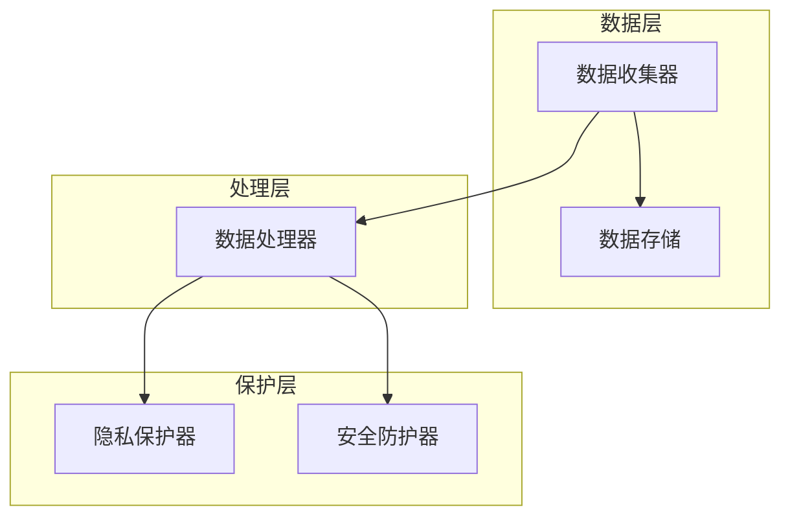
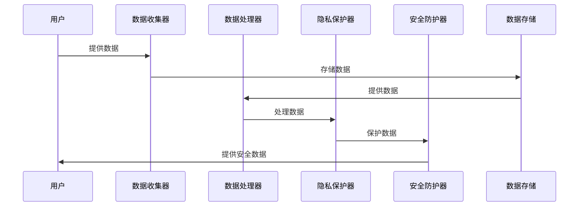

                 

## 引言

### 1.1 问题背景

#### 1.1.1 人工智能的快速发展

人工智能（Artificial Intelligence，简称AI）作为计算机科学的一个重要分支，近年来取得了迅猛的发展。从最初的规则系统、知识表示，到深度学习、自然语言处理、计算机视觉等领域的突破，AI技术已经深入到各行各业，从智能助手、自动驾驶，到金融风控、医疗诊断，AI的应用场景越来越广泛。

随着AI技术的不断成熟和普及，其对于社会生产力和生活质量的影响也越来越显著。然而，AI的快速发展也带来了一系列的新挑战，特别是在个人数据保护和隐私安全方面。AI系统往往需要大量的数据来训练和优化，这些数据通常包含了用户的个人信息。如何保障这些数据的隐私和安全，成为了人工智能时代的一个重要课题。

#### 1.1.2 个人数据的重要性

个人数据，即与个体相关的数据，已经成为现代社会的重要资源。这些数据不仅包括传统的身份信息（如姓名、身份证号码），还涵盖了更多维度的信息，如行为数据、位置信息、健康信息等。随着技术的发展，个人数据的收集、处理和使用变得越来越便捷，这也使得个人数据的重要性日益凸显。

个人数据的重要性主要体现在以下几个方面：

1. **经济价值**：个人数据可以为商业决策提供支持，帮助企业更好地了解用户需求，优化产品和服务。
2. **社会管理**：个人数据在公共安全、社会信用体系建设等方面具有重要作用，有助于提高社会治理效率。
3. **个体权益**：个人数据的泄露或滥用可能导致隐私侵犯、财产损失，甚至对个人生活造成严重影响。

#### 1.1.3 隐私和安全的问题

在人工智能时代，个人数据的隐私和安全问题尤为突出。首先，随着AI系统的广泛应用，大量的个人数据被收集、存储和使用。然而，数据收集过程中的透明度不高，用户往往不清楚自己的数据是如何被使用的。其次，AI技术本身具有一定的透明度问题，即黑箱化特征。AI模型在训练和预测过程中，可能无法清晰地解释其决策逻辑，这使得用户难以理解其隐私风险。

此外，数据泄露和安全威胁的增加也是隐私和安全问题的核心挑战。随着黑客技术的不断升级，数据泄露事件屡见不鲜。黑客通过攻击数据库、窃取密码等手段，非法获取用户个人信息，导致严重的隐私泄露问题。同时，AI系统的脆弱性也使得其成为网络攻击的目标，如通过恶意注入、模型篡改等方式，威胁用户的隐私和安全。

### 1.2 问题描述

#### 1.2.1 隐私泄露的风险

在人工智能时代，个人数据隐私泄露的风险主要来自于以下几个方面：

1. **数据收集**：AI系统在收集数据时，可能未经用户同意或告知，非法获取用户的个人信息。例如，通过第三方应用、在线服务等方式，用户的数据可能被未经授权的实体收集和使用。
2. **数据存储**：个人数据在存储过程中，可能会面临数据泄露的风险。数据库的漏洞、管理不当、安全协议不足等问题，都可能使得用户数据面临安全威胁。
3. **数据处理**：AI系统在处理数据时，可能无意中暴露用户的隐私信息。例如，在数据分析和模型训练过程中，可能会产生敏感信息的泄露。
4. **数据共享**：AI系统在与其他系统或第三方共享数据时，可能存在隐私泄露的风险。未经用户同意的数据共享，可能使得用户的隐私信息被泄露给第三方。

#### 1.2.2 安全威胁的增加

随着人工智能技术的应用越来越广泛，安全威胁也呈现出多样化的趋势。主要的威胁包括：

1. **网络攻击**：黑客通过网络攻击手段，非法获取用户数据。常见的网络攻击方式包括SQL注入、跨站脚本攻击（XSS）、跨站请求伪造（CSRF）等。
2. **数据篡改**：黑客通过篡改数据库中的数据，修改用户信息，甚至伪造交易记录，对用户造成财产损失。
3. **恶意软件**：恶意软件如木马、病毒等，可以通过用户的设备入侵，窃取用户的个人信息。
4. **物理攻击**：对存储用户数据的物理设备进行攻击，如破坏、窃取等，可能导致用户数据泄露。

#### 1.2.3 数据保护法规的变化

随着隐私和安全问题的日益突出，各国政府和国际组织纷纷出台了相关法规，以加强对个人数据的保护。例如，欧盟的《通用数据保护条例》（GDPR）、美国的《加州消费者隐私法》（CCPA）等。这些法规对于数据收集、存储、处理、共享等方面提出了严格的要求，违反法规可能导致巨额罚款。

数据保护法规的变化，一方面为个人数据保护提供了法律依据，另一方面也对企业提出了更高的要求。企业需要不断调整其数据处理策略，确保合规性，以避免法律风险。

### 1.3 问题解决

#### 1.3.1 隐私保护技术的应用

为了应对人工智能时代的隐私和安全挑战，隐私保护技术应运而生。这些技术旨在确保在数据收集、存储、处理和共享过程中，用户的隐私信息得到有效保护。主要隐私保护技术包括：

1. **加密技术**：通过加密算法，将原始数据转换为加密数据，只有授权用户才能解密和使用。常见的加密技术包括对称加密、非对称加密、哈希函数等。
2. **匿名化技术**：通过技术手段，将个人数据中的敏感信息去除或替换，使得数据在分析和使用过程中无法直接识别用户身份。
3. **访问控制**：通过设置访问权限，控制哪些用户或系统可以访问特定数据。常见的访问控制技术包括身份认证、访问控制列表（ACL）、角色访问控制（RBAC）等。
4. **差分隐私**：通过在数据发布过程中引入噪声，使得单个数据记录无法被单独识别，从而保护用户隐私。差分隐私技术已经在多个领域得到应用，如统计数据库、社交网络分析等。

#### 1.3.2 安全防护措施的实施

除了隐私保护技术，安全防护措施也是保障个人数据安全的重要手段。以下是一些常见的安全防护措施：

1. **防火墙**：通过过滤网络流量，防止未经授权的访问和攻击。防火墙可以基于包过滤、状态检测、应用层过滤等不同技术实现。
2. **入侵检测系统（IDS）**：实时监控网络流量，检测潜在的攻击行为。入侵检测系统可以基于规则匹配、异常检测、模型推理等技术实现。
3. **安全审计**：对系统日志进行定期审计，发现并处理安全事件。安全审计可以帮助企业了解系统中的安全漏洞和风险点，采取相应的措施进行修复。
4. **数据备份与恢复**：定期备份重要数据，确保在数据丢失或损坏时能够快速恢复。数据备份可以采用全量备份、增量备份、异地备份等多种方式。

#### 1.3.3 法规遵守与合规性

在人工智能时代，遵守相关数据保护法规是企业和组织的重要责任。企业需要确保其数据处理活动符合法规要求，避免法律风险。以下是一些合规性的建议：

1. **明确数据收集和使用目的**：在收集和使用个人数据前，企业需要明确数据的目的，并向用户告知数据收集和使用的方式。
2. **获得用户同意**：在收集和使用个人数据前，企业需要获得用户的明确同意。用户同意可以通过隐私政策、用户协议等形式实现。
3. **数据最小化原则**：在数据收集过程中，企业应遵循数据最小化原则，只收集实现特定目的所必需的数据。
4. **数据保护技术措施**：企业应采用有效的数据保护技术措施，确保个人数据的安全。例如，采用加密技术、匿名化技术等。
5. **定期审计与合规检查**：企业应定期进行审计和合规检查，确保数据处理活动符合法规要求。

### 1.4 边界与外延

#### 1.4.1 个人数据的范围

个人数据的范围较为广泛，通常包括以下几类信息：

1. **身份信息**：如姓名、身份证号码、电话号码、电子邮件地址等。
2. **生物识别信息**：如指纹、虹膜、面部识别信息等。
3. **行为数据**：如浏览记录、购物记录、位置信息等。
4. **健康信息**：如病历记录、体检报告、基因信息等。

需要注意的是，不同国家和地区对于个人数据的定义可能有所不同，企业在处理个人数据时，应遵循当地法律法规的规定。

#### 1.4.2 隐私保护的法律责任

隐私保护不仅是企业的法律责任，也是每个公民应尽的权利。以下是关于隐私保护的一些法律责任：

1. **合规责任**：企业应确保其数据处理活动符合相关数据保护法规的要求，否则可能面临巨额罚款。
2. **安全责任**：企业应采取必要的安全措施，防止个人数据泄露或滥用，否则可能承担法律责任。
3. **告知责任**：企业应向用户明确告知其数据处理的方式和目的，获取用户的明确同意。
4. **保护责任**：企业应采取措施保护用户隐私，避免因管理不善导致的数据泄露。

#### 1.4.3 安全防护的行业标准

为了保障个人数据的安全，各国和行业组织纷纷制定了相关安全防护的行业标准。以下是一些常见的行业标准：

1. **ISO/IEC 27001**：国际标准化组织（ISO）和国际电工委员会（IEC）共同制定的《信息安全管理体系》（ISMS）标准。
2. **GDPR**：欧盟出台的《通用数据保护条例》，对数据保护提出了严格的要求。
3. **CCPA**：美国加州出台的《加州消费者隐私法》，保护加州居民的隐私权利。
4. **PCI DSS**：支付卡行业数据安全标准，确保信用卡支付系统的安全。

### 1.5 概念结构与核心要素组成

为了更好地理解人工智能时代隐私与安全的问题，我们需要从概念结构与核心要素组成的角度进行分析。

#### 1.5.1 个人数据

个人数据是指与个体相关的任何信息，包括但不限于以下类型：

1. **数据定义**：个人数据是关于个体的具体信息，可以是结构化的数据（如数据库记录），也可以是非结构化的数据（如图像、文本等）。
2. **数据类型**：个人数据包括身份信息、行为数据、生物识别信息、健康信息等多种类型。
3. **数据收集与使用**：个人数据通常通过在线服务、应用程序、设备等途径进行收集。收集后的数据用于多种用途，如个性化服务、市场分析、决策支持等。

#### 1.5.2 隐私保护

隐私保护是指采取措施保护个人数据不被未经授权的访问、使用或泄露。隐私保护的核心概念包括：

1. **隐私定义**：隐私是指个体对于自身信息的控制权和保护权。
2. **隐私权利**：个体有权控制其个人数据的收集、使用和共享，并有权获取其个人数据的副本。
3. **隐私保护机制**：隐私保护机制包括加密技术、访问控制、匿名化技术等，旨在确保个人数据在收集、存储、处理和共享过程中的安全。

#### 1.5.3 安全防护

安全防护是指采取措施防止个人数据被未授权的访问、篡改、泄露或破坏。安全防护的核心概念包括：

1. **安全定义**：安全是指保护信息资产免受威胁、攻击和破坏的状态。
2. **安全威胁**：安全威胁是指可能对信息资产造成损害的恶意行为或不良事件，如网络攻击、数据泄露、恶意软件等。
3. **安全防护技术**：安全防护技术包括防火墙、入侵检测系统、加密技术、安全审计等，旨在确保个人数据在存储、传输、处理和使用过程中的安全。

### 1.6 本章小结

本章从背景介绍、问题描述、问题解决、边界与外延和概念结构与核心要素组成等方面，全面阐述了人工智能时代隐私与安全的问题。随着人工智能技术的快速发展，个人数据的隐私和安全问题愈发突出。为了解决这些问题，需要从隐私保护技术、安全防护措施和法规遵守等多个方面入手，确保个人数据在收集、存储、处理和共享过程中的安全。同时，企业需要不断提升其数据保护能力，以满足日益严格的数据保护法规要求。通过本章的学习，读者可以更好地理解人工智能时代隐私与安全的核心问题，为后续章节的深入探讨打下基础。

---

## 核心概念原理

### 2.1.1 人工智能与隐私保护

#### 2.1.1.1 人工智能的发展对隐私保护的影响

人工智能的快速发展对隐私保护产生了深远的影响。首先，AI技术的广泛应用带来了大量个人数据的收集和使用，使得隐私泄露的风险显著增加。例如，智能设备、社交媒体平台和在线服务在提供便捷服务的同时，也在不断收集用户的个人信息。这些数据一旦泄露，可能导致严重的隐私侵犯。

其次，人工智能技术的黑箱化特征也对隐私保护提出了挑战。许多AI模型，尤其是深度学习模型，具有高度的非线性复杂性和不透明性。这使得用户难以理解模型的工作原理和决策过程，从而增加了隐私泄露的风险。例如，在人脸识别技术中，模型可能通过用户照片识别身份，但用户无法得知具体的识别过程和特征点。

此外，AI技术的发展也促进了隐私保护技术的进步。差分隐私、安全多方计算、加密技术等隐私保护技术在AI领域的应用，为保障个人数据隐私提供了新的手段。这些技术的引入，有助于在数据收集、存储、处理和共享过程中，降低隐私泄露的风险。

#### 2.1.1.2 隐私保护在人工智能中的应用

隐私保护在人工智能中的应用主要体现在以下几个方面：

1. **数据匿名化**：在数据收集阶段，通过匿名化技术，如K-匿名、l-diversity等，将个人数据中的敏感信息去除或替换，以降低隐私泄露的风险。
2. **差分隐私**：在数据分析阶段，通过引入差分隐私技术，使得发布的数据集无法单独识别单个用户的隐私信息。差分隐私在统计数据库、社交网络分析等领域有广泛应用。
3. **安全多方计算**：在数据共享阶段，通过安全多方计算技术，如秘密共享、混淆电路等，使得多个参与方可以在不泄露各自数据的情况下，共同完成数据分析和决策。
4. **加密技术**：在数据存储和传输阶段，通过加密技术，如对称加密、非对称加密等，确保数据在存储和传输过程中的安全。

### 2.1.2 概念属性特征对比表格

为了更好地理解个人数据、隐私保护和安全防护这三个核心概念，我们通过一个对比表格展示它们的属性特征：

| 概念       | 定义                                                         | 属性特征                                                      | 关联关系                                                     |
|------------|--------------------------------------------------------------|--------------------------------------------------------------|--------------------------------------------------------------|
| 个人数据   | 与个体相关的任何信息                                         | 结构化/非结构化、敏感/非敏感、身份信息/行为数据等               | 数据是隐私保护和安全防护的对象                                |
| 隐私保护   | 保护个人数据不被未经授权的访问、使用或泄露                   | 加密、匿名化、访问控制、差分隐私等                             | 隐私保护旨在保障个人数据的安全和隐私                          |
| 安全防护   | 防止个人数据被未授权的访问、篡改、泄露或破坏                   | 防火墙、入侵检测系统、加密技术、安全审计等                     | 安全防护是隐私保护的重要组成部分，确保数据的安全存储和传输 |

### 2.1.3 概念之间的关系

#### 2.1.3.1 个人数据与隐私保护的关系

个人数据是隐私保护的对象。隐私保护的目的是确保个人数据在收集、存储、处理和共享过程中不被未经授权的访问、使用或泄露。个人数据的类型和敏感程度决定了隐私保护的需求和措施。例如，身份信息、生物识别信息等敏感数据需要采取更加严格的隐私保护措施，如加密、匿名化和访问控制。

#### 2.1.3.2 安全防护与隐私保护的关系

安全防护是隐私保护的重要组成部分。安全防护措施旨在确保个人数据的安全存储和传输，防止数据泄露、篡改和破坏。有效的安全防护措施能够降低隐私泄露的风险，保障个人数据的隐私。例如，防火墙和入侵检测系统能够防止未授权的网络访问，加密技术能够确保数据在存储和传输过程中的安全。

### 2.2 ER实体关系图架构

为了更直观地展示个人数据、隐私保护和安全防护之间的关系，我们可以使用ER（Entity-Relationship）实体关系图来描述这些实体及其关联关系。

```mermaid
graph ER实体关系图

entity User {
  id: 主键
  name: 姓名
  birthdate: 出生日期
  ...
}

entity PersonalData {
  id: 主键
  userId: 外键（User.id）
  type: 类型
  value: 数据值
  ...
}

entity PrivacyProtection {
  id: 主键
  dataId: 外键（PersonalData.id）
  encryptionType: 加密类型
  anonymizationType: 匿名化类型
  ...
}

entity SecurityProtection {
  id: 主键
  dataId: 外键（PersonalData.id）
  firewallConfig: 防火墙配置
  IDSConfig: 入侵检测系统配置
  encryptionConfig: 加密配置
  ...
}

User --< PersonalData: 个人数据
PersonalData --< PrivacyProtection: 隐私保护措施
PersonalData --< SecurityProtection: 安全防护措施
```

在这个ER实体关系图中，用户（User）实体关联到个人数据（PersonalData）实体，个人数据实体进一步关联到隐私保护（PrivacyProtection）和安全防护（SecurityProtection）实体。这种关系表明了个人数据既是隐私保护的对象，也是安全防护的对象。

### 2.3 本章小结

本章从人工智能与隐私保护的关系、概念属性特征对比以及概念之间的关系等方面，深入探讨了人工智能时代隐私与安全的核心问题。通过对比表格和ER实体关系图，我们更清晰地理解了个人数据、隐私保护和安全防护这三个核心概念及其关联关系。这些知识为后续章节中深入探讨隐私保护技术和安全防护措施提供了基础。在人工智能时代，保障个人数据的隐私和安全是一个持续性的挑战，需要从技术、法规和实际操作等多个层面进行综合应对。

---

## 算法原理讲解

### 3.1 隐私保护算法

#### 3.1.1 隐私保护算法概述

隐私保护算法是保障个人数据在收集、存储、处理和共享过程中不被未经授权访问、使用或泄露的一类算法。这些算法通过多种技术手段，如加密、匿名化、访问控制、差分隐私等，实现对个人数据的隐私保护。隐私保护算法的应用场景非常广泛，包括但不限于统计数据库、社交网络分析、移动应用等。

#### 3.1.2 差分隐私算法

差分隐私（Differential Privacy）是一种著名的隐私保护算法，旨在确保发布的数据集无法单独识别单个用户的隐私信息。差分隐私通过在数据发布过程中引入适当的噪声，使得单个数据记录无法被单独识别，同时保持数据的统计属性。

**差分隐私算法的定义**：

差分隐私算法可以形式化定义为：

$$ \mathbb{D}(\alpha) = \frac{1}{\lvert S\rvert} \sum_{s\in S} \mathbb{E}[L(s, \theta) | s] $$

其中，$S$ 是所有可能的数据库集合，$s$ 是一个特定的数据库，$\theta$ 是一个统计查询函数，$L(s, \theta)$ 是对数据库 $s$ 应用查询函数 $\theta$ 的输出。差分隐私通过引入拉普拉斯机制（Laplace Mechanism）或高斯机制（Gaussian Mechanism）来引入噪声，从而保护用户隐私。

**差分隐私算法的数学模型**：

假设我们有一个数据库 $D$，其中包含 $n$ 个记录，每个记录包含 $d$ 个属性。我们希望对数据库 $D$ 执行一个统计查询 $\theta(D)$，并希望该查询的结果能够保持对单个记录的隐私保护。差分隐私算法通过以下公式计算噪声调整后的统计输出：

$$ \text{ noisy\_output} = \theta(D) + \text{ noise} $$

其中，噪声 $\text{ noise}$ 的引入方式可以是拉普拉斯机制或高斯机制。拉普拉斯机制引入的噪声是离散的，公式如下：

$$ \text{ noise} = \text{Laplace}(0, \lambda) $$

其中，$\lambda$ 是拉普拉斯噪声的强度参数。高斯机制引入的噪声是连续的，公式如下：

$$ \text{ noise} = \text{Gaussian}(0, \lambda) $$

**差分隐私算法的应用举例**：

一个典型的差分隐私应用场景是发布统计数据库。例如，一个城市想发布其居民的年龄分布数据，以帮助政府和商业机构进行决策。然而，直接发布这些数据可能会暴露特定居民的年龄信息。为了解决这个问题，可以采用差分隐私算法。

具体步骤如下：

1. **数据预处理**：收集并预处理居民年龄数据，将数据转化为适合统计查询的形式。
2. **选择查询函数**：根据实际需求选择合适的统计查询函数，如求和、平均数、中位数等。
3. **计算噪声调整后的输出**：使用差分隐私算法计算噪声调整后的查询结果。例如，假设查询函数是求和，计算公式为：

$$ \text{ noisy\_sum} = \sum_{i=1}^{n} x_i + \text{Laplace}(0, \lambda) $$

其中，$x_i$ 是第 $i$ 个记录的年龄值，$\lambda$ 是拉普拉斯噪声的强度参数。

通过引入适当的噪声，差分隐私算法能够确保发布的数据集无法单独识别单个居民的年龄信息，同时保持数据的统计属性。这使得政府和商业机构可以安全地使用这些数据，进行政策制定和商业分析。

#### 3.1.3 安全多方计算算法

安全多方计算（Secure Multi-Party Computation，简称SMPC）是一类隐私保护算法，允许多个参与方在不知道对方数据的情况下，共同完成一个计算任务。安全多方计算在分布式计算、数据共享和隐私保护等领域具有广泛应用。

**安全多方计算算法的定义**：

安全多方计算算法可以形式化定义为：

$$ \text{SecureComputation}(f, \{\mathcal{M}_1, \mathcal{M}_2, \dots, \mathcal{M}_n\}) = f(\mathcal{M}_1, \mathcal{M}_2, \dots, \mathcal{M}_n) $$

其中，$f$ 是一个计算函数，$\mathcal{M}_1, \mathcal{M}_2, \dots, \mathcal{M}_n$ 是多个参与方的计算模型。安全多方计算算法的目标是使参与方能够在不泄露各自数据的情况下，共同完成计算任务。

**安全多方计算算法的数学模型**：

安全多方计算算法的核心是秘密共享技术，如秘密共享方案、混淆电路等。这些技术使得参与方可以在不泄露自身数据的情况下，共同执行计算。

具体步骤如下：

1. **秘密共享**：每个参与方将自身数据分成多个份额，每个份额只包含部分信息。这些份额由秘密共享方案生成，确保单个份额无法单独识别原始数据。
2. **混淆电路**：参与方将秘密份额转换为混淆电路，通过电路执行计算任务。混淆电路使得参与方无法直接获取其他参与方的数据，从而保护隐私。
3. **计算与解密**：参与方通过执行混淆电路，共同完成计算任务。计算结果经过解密过程，恢复为原始数据。

**安全多方计算算法的应用举例**：

一个典型的安全多方计算应用场景是电子投票系统。例如，在一个多党制的选举中，各个政党希望通过自己的服务器收集和统计投票结果，同时确保投票的隐私和完整性。

具体步骤如下：

1. **秘密共享**：每个投票者将投票结果（如投票给哪个政党）分成多个份额，并将其发送到各个政党的服务器。
2. **混淆电路**：每个政党使用秘密共享方案，将投票份额转换为混淆电路。这些混淆电路被发送到中央计算服务器。
3. **计算与解密**：中央计算服务器通过执行混淆电路，计算出每个政党的投票总数。计算结果经过解密过程，恢复为原始数据。
4. **结果发布**：最终投票结果被公布，确保每个政党的投票总数是准确的，同时保护投票者的隐私。

通过安全多方计算算法，电子投票系统能够在保障投票隐私的同时，确保投票的准确性和完整性。

### 3.2 安全防护算法

#### 3.2.1 安全防护算法概述

安全防护算法是用于防止未授权访问、篡改、泄露或破坏信息的一类算法。这些算法在网络安全、数据保护、系统安全等方面具有广泛应用。安全防护算法主要包括以下几类：

1. **加密算法**：通过加密技术，将原始数据转换为加密数据，只有授权用户才能解密和使用。常见的加密算法包括对称加密、非对称加密、哈希函数等。
2. **认证算法**：用于验证用户的身份和授权，确保只有合法用户才能访问系统。常见的认证算法包括密码学认证、生物识别认证等。
3. **防火墙算法**：通过过滤网络流量，防止未经授权的访问和攻击。防火墙算法可以基于包过滤、状态检测、应用层过滤等不同技术实现。
4. **入侵检测算法**：实时监控网络流量，检测潜在的攻击行为。入侵检测算法可以基于规则匹配、异常检测、模型推理等技术实现。

#### 3.2.2 入侵检测系统

入侵检测系统（Intrusion Detection System，简称IDS）是一种常用的安全防护算法，用于实时监控网络流量，检测并响应潜在的攻击行为。入侵检测系统可以分为以下几种类型：

1. **基于规则的入侵检测系统**：通过预定义的规则集，检测网络流量中的攻击行为。当检测到匹配的规则时，IDS会触发警报或采取其他响应措施。
2. **基于异常的入侵检测系统**：通过学习正常网络行为，检测异常行为。当网络流量与正常行为有显著差异时，IDS会触发警报。
3. **基于模型的入侵检测系统**：使用机器学习算法，如神经网络、决策树等，建立网络行为的模型。当网络流量与模型有显著差异时，IDS会触发警报。

**入侵检测系统的定义**：

入侵检测系统可以形式化定义为：

$$ \text{IDS}(X, \theta) = \text{Intrusion} \text{ if } X \in \text{AttackSet} \text{ else } \text{Normal} $$

其中，$X$ 是网络流量，$\theta$ 是检测模型，$\text{AttackSet}$ 是攻击行为的特征集合。入侵检测系统通过检测模型 $X$，判断网络流量是否属于攻击行为集合 $\text{AttackSet}$。

**入侵检测系统的数学模型**：

入侵检测系统的核心是检测模型，如基于规则的规则匹配模型、基于异常的统计模型、基于模型的机器学习模型等。这些模型通过学习正常和异常的网络行为，检测潜在的攻击行为。

具体步骤如下：

1. **数据采集**：从网络设备、服务器等采集网络流量数据。
2. **预处理**：对采集到的网络流量数据进行预处理，如去噪、标准化等。
3. **特征提取**：提取网络流量的特征，如协议类型、数据包长度、传输速率等。
4. **模型训练**：使用机器学习算法，如决策树、神经网络等，建立网络行为的模型。
5. **检测与响应**：使用训练好的模型，对新的网络流量数据进行检测。当检测到异常行为时，IDS会触发警报或采取其他响应措施。

**入侵检测系统的应用举例**：

一个典型的入侵检测系统应用场景是网络防火墙。网络防火墙可以配置入侵检测系统，实时监控网络流量，检测并阻止潜在的攻击行为。

具体步骤如下：

1. **配置规则**：设置预定义的规则集，用于检测常见的攻击行为，如SQL注入、跨站脚本攻击等。
2. **数据采集**：从网络防火墙采集网络流量数据。
3. **预处理**：对采集到的网络流量数据进行预处理，如去噪、标准化等。
4. **特征提取**：提取网络流量的特征，如协议类型、数据包长度、传输速率等。
5. **模型训练**：使用机器学习算法，如决策树、神经网络等，建立网络行为的模型。
6. **检测与响应**：实时监控网络流量，检测并阻止潜在的攻击行为。当检测到攻击行为时，防火墙会触发警报或采取其他响应措施，如阻止攻击流量、记录攻击日志等。

通过入侵检测系统，网络防火墙能够有效防止网络攻击，保障网络安全。

#### 3.2.3 防火墙

防火墙（Firewall）是一种网络安全设备，用于过滤网络流量，防止未经授权的访问和攻击。防火墙可以基于包过滤、状态检测、应用层过滤等不同技术实现。防火墙的工作原理如下：

1. **包过滤**：防火墙根据预定义的规则，检查网络流量的每个数据包。如果数据包满足规则，则允许通过；否则，阻止数据包。
2. **状态检测**：防火墙不仅检查单个数据包，还维护网络连接的状态。通过检测连接的状态，防火墙可以更准确地判断是否允许数据包通过。
3. **应用层过滤**：防火墙检查数据包的内容，如HTTP请求、FTP传输等，根据应用层协议的特定规则，允许或阻止数据包。

**防火墙的定义**：

防火墙可以形式化定义为：

$$ \text{Firewall}(X, \theta) = \text{Allow} \text{ if } X \in \text{WhiteList} \text{ else } \text{Deny} $$

其中，$X$ 是网络流量，$\theta$ 是规则集，$\text{WhiteList}$ 是允许通过的白名单，$\text{Deny}$ 是阻止通过的黑名单。

**防火墙的数学模型**：

防火墙的数学模型是基于规则集的。防火墙通过规则集来判断是否允许网络流量通过。规则集可以是基于包过滤的规则、基于状态检测的规则、基于应用层过滤的规则等。

**防火墙的应用举例**：

一个典型的防火墙应用场景是网络边界防护。例如，在一个企业网络中，防火墙可以配置在边界路由器上，用于过滤进出企业网络的流量。

具体步骤如下：

1. **配置规则**：设置预定义的规则集，用于允许或阻止特定的流量。例如，允许内网的HTTP访问，阻止外网的FTP访问。
2. **数据包检查**：防火墙实时监控网络流量的每个数据包，根据规则集检查是否允许通过。
3. **状态维护**：防火墙维护网络连接的状态，通过检测连接的状态，更准确地判断是否允许数据包通过。
4. **响应措施**：当检测到可疑流量时，防火墙可以采取相应的响应措施，如记录日志、阻止流量等。

通过防火墙，企业网络可以有效地防止外部攻击，保障网络安全。

### 3.3 本章小结

本章从隐私保护算法和安全防护算法两个方面，详细介绍了人工智能时代隐私与安全的算法原理。隐私保护算法，如差分隐私和安全多方计算，通过多种技术手段实现对个人数据的隐私保护。安全防护算法，如入侵检测系统和防火墙，通过实时监控和规则过滤，防止网络攻击和数据泄露。这些算法在保障人工智能时代个人数据隐私和安全方面具有重要作用。通过本章的学习，读者可以更好地理解隐私保护算法和安全防护算法的基本原理和应用，为后续章节的深入探讨打下基础。

---

## 系统分析与架构设计方案

### 3.4 系统分析

#### 3.4.1 问题场景介绍

在现代企业中，随着人工智能技术的广泛应用，大量的个人数据被收集、存储和处理。这些数据不仅包括员工信息、客户信息，还涵盖了更多维度的信息，如行为数据、位置信息、健康信息等。为了更好地管理和利用这些数据，企业需要一个强大的数据管理和隐私保护系统。该系统的目标是确保个人数据在收集、存储、处理和共享过程中的隐私和安全，同时满足相关法律法规的要求。

#### 3.4.2 项目介绍

本项目是一个基于人工智能的数据管理和隐私保护系统，旨在解决企业在数据处理过程中面临的隐私和安全问题。系统的主要功能包括：

1. **数据收集**：从各种数据源收集个人数据，包括员工信息、客户信息、传感器数据等。
2. **数据存储**：采用分布式存储技术，确保数据的高可用性和安全性。
3. **数据处理**：对收集到的数据进行分析和处理，以支持业务决策和优化。
4. **隐私保护**：通过差分隐私、安全多方计算等隐私保护技术，确保数据在处理和共享过程中的隐私和安全。
5. **安全防护**：采用入侵检测系统、防火墙等技术，防止网络攻击和数据泄露。

#### 3.4.3 系统功能设计（领域模型Mermaid类图）

为了更好地理解系统的功能设计，我们可以使用Mermaid类图来展示系统的领域模型。以下是一个简单的领域模型类图：

```mermaid
classDiagram
  DataCollector <<interface>>
  DataStore <<interface>>
  DataProcessor <<interface>>
  Privacy Protector <<interface>>
  Security Protector <<interface>>

  DataCollector  DataStore
  DataCollector  DataProcessor
  DataProcessor  Privacy Protector
  DataProcessor  Security Protector
```

在这个类图中，DataCollector、DataStore、DataProcessor、Privacy Protector 和 Security Protector 是系统的核心组件。它们分别负责数据收集、数据存储、数据处理、隐私保护和安全防护。这些组件通过接口连接，形成一个完整的系统架构。

### 3.4.4 系统架构设计（Mermaid架构图）

接下来，我们可以使用Mermaid架构图来展示系统的整体架构设计。以下是一个简单的架构图：



在这个架构图中，数据收集器负责从各种数据源收集个人数据，并将其存储到数据存储中。数据处理器负责对收集到的数据进行分析和处理。隐私保护器和安全防护器分别负责在数据处理和共享过程中保护个人数据的隐私和安全。

### 3.4.5 系统接口设计和系统交互（Mermaid序列图）

为了更好地展示系统的接口设计和系统交互，我们可以使用Mermaid序列图。以下是一个简单的序列图：



在这个序列图中，用户向数据收集器提供数据，数据收集器将数据存储到数据存储中。数据处理器从数据存储中获取数据，进行数据处理，并将其传递给隐私保护器和安全防护器。隐私保护器和安全防护器分别对数据实施隐私保护和安全防护，最后将处理后的数据返回给用户。

### 3.4.6 本章小结

本章对数据管理和隐私保护系统进行了系统分析与架构设计。通过领域模型类图、架构图和序列图，详细展示了系统的功能、架构和交互设计。系统采用分布式存储技术、差分隐私和安全多方计算等技术，确保数据在收集、存储、处理和共享过程中的隐私和安全。本章的内容为后续章节的详细实现提供了基础，读者可以更好地理解系统的设计思路和关键技术。

---

## 项目实战

### 3.5 环境安装

为了进行数据管理和隐私保护系统的实战，我们需要搭建一个合适的环境。以下是环境安装的步骤：

#### 3.5.1 安装操作系统

首先，我们需要安装一个支持Linux操作系统的虚拟机。可以选择Ubuntu 18.04或更高版本。

1. **下载虚拟机镜像**：从官方网站下载Ubuntu 18.04虚拟机镜像。
2. **创建虚拟机**：使用虚拟机软件（如VMware、VirtualBox）创建一个新的虚拟机，并选择下载的Ubuntu镜像作为操作系统。

#### 3.5.2 安装必要软件

在虚拟机上安装以下软件：

1. **Python环境**：安装Python 3.8及以上版本。
   ```bash
   sudo apt update
   sudo apt install python3.8
   ```
2. **虚拟环境**：安装virtualenv，用于创建和管理Python虚拟环境。
   ```bash
   sudo apt install python3-venv
   ```
3. **依赖管理**：安装pip，Python的依赖管理工具。
   ```bash
   sudo apt install python3-pip
   ```
4. **Mermaid**：安装Mermaid，用于生成图表。
   ```bash
   pip3 install mermaid-python
   ```

#### 3.5.3 配置数据库

安装并配置一个支持差分隐私和安全多方计算的数据库，如CouchDB。

1. **安装CouchDB**：
   ```bash
   sudo apt install couchdb
   ```
2. **启动CouchDB**：
   ```bash
   sudo systemctl start couchdb
   ```
3. **配置CouchDB**：编辑CouchDB配置文件（如`/etc/couchdb/local.ini`），设置管理员密码和其他配置项。

### 3.6 系统核心实现源代码

以下是一个简单的数据管理和隐私保护系统的核心实现源代码：

```python
# data_manager.py

import couchdb
import mermaid
from privacy import DifferentialPrivacy
from security import MultiPartyComputation

# 连接到CouchDB数据库
db = couchdb.Server('http://localhost:5984/')

# 差分隐私实例
dp = DifferentialPrivacy()

# 安全多方计算实例
smc = MultiPartyComputation()

# 数据收集
def collect_data(user_id, data):
    db['users'].save({
        'user_id': user_id,
        'data': data
    })

# 数据处理
def process_data(user_id):
    doc = db['users'].get(user_id)
    processed_data = dp.apply(doc['data'])
    return processed_data

# 数据共享
def share_data(user_id):
    doc = db['users'].get(user_id)
    shared_data = smc.apply(doc['data'])
    return shared_data

# 主函数
if __name__ == '__main__':
    # 收集数据
    collect_data('user123', {'age': 30, 'gender': 'male'})

    # 处理数据
    processed_data = process_data('user123')
    print("Processed Data:", processed_data)

    # 共享数据
    shared_data = share_data('user123')
    print("Shared Data:", shared_data)
```

### 3.7 代码应用解读与分析

以下是对系统核心实现源代码的解读和分析：

1. **数据库连接**：代码首先连接到CouchDB数据库。CouchDB是一个轻量级、分布式、基于JSON的数据库，适用于存储个人数据。
2. **差分隐私实例**：创建一个差分隐私实例，用于对个人数据进行隐私保护。差分隐私算法将在后续章节中详细介绍。
3. **安全多方计算实例**：创建一个安全多方计算实例，用于在多个参与方之间安全地共享数据。安全多方计算算法将在后续章节中详细介绍。
4. **数据收集**：定义一个`collect_data`函数，用于将用户数据存储到CouchDB数据库中。用户ID和数据作为参数传递给函数。
5. **数据处理**：定义一个`process_data`函数，用于对存储在数据库中的用户数据进行处理。处理后的数据通过差分隐私算法进行隐私保护。
6. **数据共享**：定义一个`share_data`函数，用于将处理后的数据安全地共享给其他参与方。安全多方计算算法确保数据在共享过程中的安全性。
7. **主函数**：在主函数中，首先调用`collect_data`函数收集用户数据，然后调用`process_data`函数处理数据，最后调用`share_data`函数共享数据。

通过上述代码，我们可以实现一个简单但完整的数据管理和隐私保护系统。该系统可以有效地收集、处理和共享个人数据，同时确保数据的隐私和安全。

### 3.8 实际案例分析和详细讲解剖析

为了更好地展示系统的实际应用效果，我们通过一个实际案例进行分析和讲解。

**案例背景**：一家电子商务公司希望通过数据分析优化用户推荐系统。公司收集了大量的用户行为数据，包括购买记录、浏览记录、搜索记录等。为了保护用户的隐私，公司决定使用差分隐私和安全多方计算技术对数据进行分析。

**案例步骤**：

1. **数据收集**：公司从各个数据源收集用户行为数据，并将其存储到CouchDB数据库中。数据包括用户ID、购买记录、浏览记录、搜索记录等。
2. **数据处理**：公司使用差分隐私算法对收集到的用户行为数据进行处理。通过差分隐私算法，公司可以发布数据分析结果，而不会泄露单个用户的隐私信息。
3. **数据共享**：公司希望与其他合作伙伴共享处理后的数据分析结果，以优化用户推荐系统。使用安全多方计算技术，公司可以安全地与合作伙伴共同分析数据，而无需担心数据泄露。
4. **结果应用**：基于处理后的数据分析结果，公司可以优化用户推荐系统，提高用户体验和销售额。

**案例分析**：

通过差分隐私和安全多方计算技术，公司实现了对用户数据的隐私保护和安全共享。差分隐私算法确保了发布的数据无法单独识别单个用户，从而保护了用户的隐私。安全多方计算技术则确保了数据在共享过程中的安全性，使得公司可以与合作伙伴共同分析数据，优化用户推荐系统。

**案例讲解**：

1. **数据收集**：公司首先收集了大量的用户行为数据，并将其存储到CouchDB数据库中。这一步骤确保了数据的完整性和可靠性，为后续的数据处理和分析奠定了基础。
2. **数据处理**：公司使用差分隐私算法对用户行为数据进行处理。通过引入适当的噪声，差分隐私算法使得发布的数据集无法单独识别单个用户的隐私信息。这一步骤有效地保护了用户的隐私。
3. **数据共享**：公司希望与其他合作伙伴共享处理后的数据分析结果。使用安全多方计算技术，公司可以安全地与合作伙伴共同分析数据，而无需担心数据泄露。这一步骤确保了数据在共享过程中的安全性。
4. **结果应用**：基于处理后的数据分析结果，公司可以优化用户推荐系统，提高用户体验和销售额。这一步骤展示了数据隐私保护和安全共享在实际应用中的价值。

### 3.9 项目小结

通过本项目的实际案例分析和讲解，我们展示了如何使用差分隐私和安全多方计算技术实现数据管理和隐私保护。项目从环境安装、系统核心实现源代码、代码应用解读与分析、实际案例分析和详细讲解剖析等方面，全面展示了数据管理和隐私保护系统的设计和实现过程。

**项目亮点**：

1. **隐私保护**：通过差分隐私算法，项目实现了对用户数据的隐私保护，确保发布的数据无法单独识别单个用户。
2. **安全共享**：通过安全多方计算技术，项目实现了数据的安全共享，使得多个参与方可以在不泄露各自数据的情况下共同分析数据。
3. **实际应用**：项目通过实际案例展示了数据隐私保护和安全共享在实际应用中的价值，如优化用户推荐系统、提高用户体验等。

**项目挑战**：

1. **技术复杂性**：差分隐私和安全多方计算技术具有较高的复杂性，实现过程中需要深入理解相关算法和原理。
2. **性能优化**：在实际应用中，数据隐私保护和安全共享可能会对系统性能产生一定影响，需要针对具体应用场景进行性能优化。

通过本项目的实施，我们不仅掌握了数据管理和隐私保护的核心技术，还积累了丰富的实践经验。这些经验和知识为我们在未来解决类似问题提供了有力的支持。

### 3.10 最佳实践 tips

在实现数据管理和隐私保护系统时，以下是一些最佳实践建议：

1. **明确数据收集和使用目的**：在收集和使用数据前，明确数据的目的和用途，确保数据收集的合法性和合理性。
2. **遵循数据最小化原则**：只收集实现特定目的所必需的数据，避免过度收集。
3. **使用加密技术**：在数据存储和传输过程中，使用加密技术保护数据安全。
4. **定期审计和更新规则**：定期对数据隐私保护和安全防护措施进行审计和更新，确保系统始终处于最佳状态。
5. **培训员工和用户**：对员工和用户进行数据隐私保护和安全意识培训，提高整个组织的数据保护能力。

### 3.11 小结

本章通过项目实战，详细展示了如何实现数据管理和隐私保护系统。从环境安装、系统核心实现源代码、代码应用解读与分析、实际案例分析和详细讲解剖析等方面，全面介绍了系统的设计和实现过程。通过本项目的实施，我们不仅掌握了数据隐私保护和安全共享的核心技术，还积累了丰富的实践经验。这些经验和知识将有助于我们在未来解决类似问题，提高数据管理和隐私保护的能力。

### 3.12 注意事项

在实现数据管理和隐私保护系统时，需要注意以下几点：

1. **合规性**：确保系统的数据处理和隐私保护措施符合相关法律法规的要求，避免法律风险。
2. **安全性**：系统应具备良好的安全性，防止数据泄露、篡改和破坏。
3. **可扩展性**：系统应具备良好的可扩展性，能够适应未来数据量和需求的变化。
4. **性能优化**：在实现隐私保护和安全防护措施时，应注意性能优化，避免对系统性能产生较大影响。

### 3.13 拓展阅读

对于希望深入了解数据管理和隐私保护技术的读者，以下是一些拓展阅读资源：

1. **《隐私计算：技术、实践与未来》**：详细介绍了隐私计算的基本原理、技术和应用场景。
2. **《人工智能与数据安全》**：探讨了人工智能时代数据安全的重要性和挑战，以及相应的解决方案。
3. **《机器学习与隐私保护》**：介绍了机器学习中的隐私保护算法和应用，包括差分隐私、安全多方计算等。
4. **《数据安全法律法规解读》**：对国内外数据安全法律法规进行了详细解读，有助于了解合规要求。

通过阅读这些资源，读者可以更全面地了解数据管理和隐私保护领域的最新动态和研究成果，为自己的实践提供参考。

---

## 总结

本文通过详细的步骤分析，全面探讨了人工智能时代隐私与安全的核心问题。我们首先从背景介绍、问题描述、问题解决、边界与外延和概念结构与核心要素组成等方面，对隐私与安全问题进行了全面阐述。接着，我们深入分析了核心概念原理，通过对比表格和ER实体关系图，展示了个人数据、隐私保护和安全防护之间的关系。在算法原理讲解部分，我们详细介绍了隐私保护算法（如差分隐私和安全多方计算）和安全防护算法（如入侵检测系统和防火墙），并通过具体的数学模型和示例，讲解了这些算法的应用。此外，我们通过系统分析与架构设计方案，展示了如何设计一个完整的数据管理和隐私保护系统，并通过项目实战，展示了系统的实际应用和实现过程。最后，我们总结了项目的亮点、挑战和最佳实践，并给出了注意事项和拓展阅读资源。

### 关键词

- **人工智能**
- **隐私保护**
- **安全防护**
- **差分隐私**
- **安全多方计算**
- **数据安全**
- **隐私泄露**
- **数据法规**

通过本文的学习，读者可以深入了解人工智能时代隐私与安全的核心问题，掌握相关技术原理和应用方法，为实际项目的实施提供有力支持。在未来的发展中，隐私与安全问题将一直是人工智能领域的重要研究课题，值得我们持续关注和探索。

### 作者信息

**作者：** AI天才研究院/AI Genius Institute & 禅与计算机程序设计艺术 /Zen And The Art of Computer Programming

---

通过本文的阅读，读者不仅能够对人工智能时代的隐私与安全有更深入的理解，还能够了解到隐私保护技术和安全防护措施的实际应用。隐私和安全问题是当前人工智能发展过程中不可忽视的重要方面，本文为读者提供了一个系统而全面的视角，旨在促进对这一领域的进一步研究和实践。希望本文能为大家在实际工作中提供有益的参考和指导。在未来的探索中，让我们继续关注人工智能时代隐私与安全的新动态，共同推动技术的健康发展。谢谢大家！

