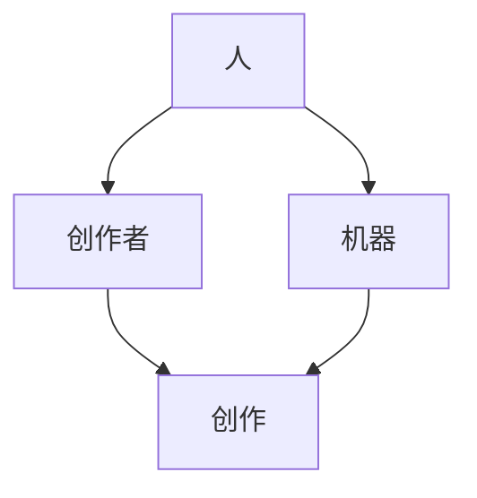
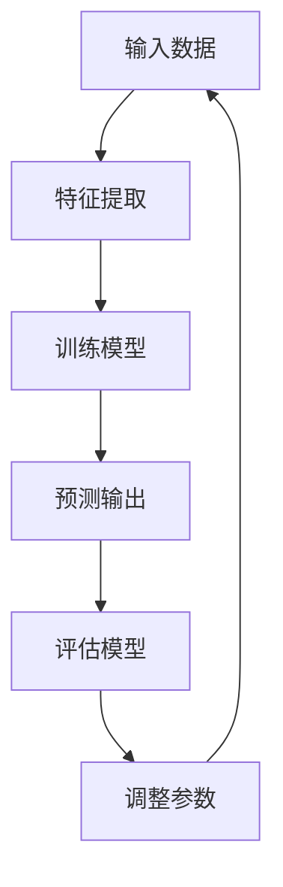
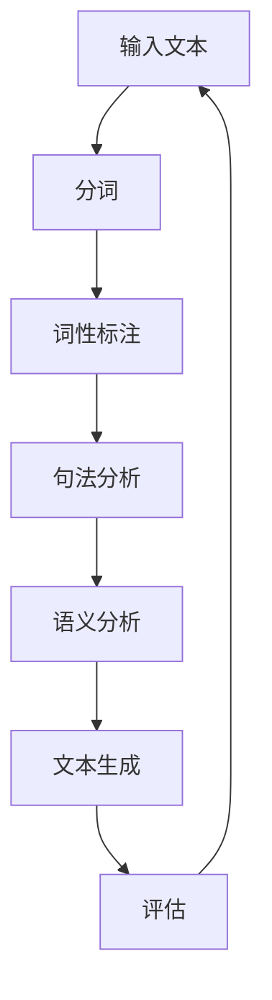
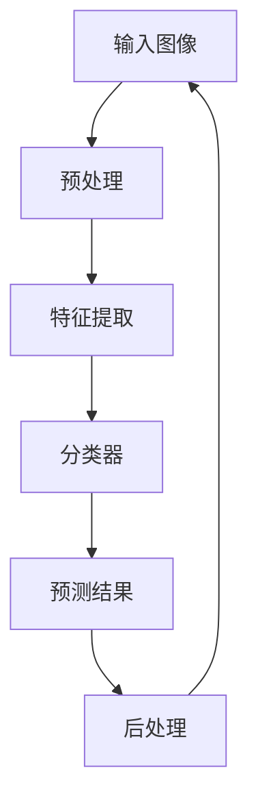

                 


### 人机协作艺术：AI辅助创作的新维度

#### 关键词：人机协作、AI辅助创作、创作效率、智能化、个性化

##### 摘要：
随着人工智能技术的飞速发展，AI辅助创作已经成为推动艺术创作和内容生成的重要力量。本文旨在探讨人机协作在创作领域的新维度，通过分析人机协作与AI辅助创作的基本原理、技术基础、应用场景和发展趋势，揭示这一新兴领域的潜在价值与挑战，并展望其未来发展方向。

## 目录大纲：

### 第一部分：导论

#### 第1章：引言

#### 第2章：核心概念与联系

### 第二部分：技术基础

#### 第3章：AI辅助创作的基本技术

#### 第4章：人机协作的实现机制

### 第三部分：应用场景

#### 第5章：AI辅助创作在不同领域的应用

#### 第6章：人机协作在特定行业中的应用

### 第四部分：未来展望

#### 第7章：AI辅助创作与人机协作的发展趋势

### 1. 引言

在当今数字化时代，创作领域面临着前所未有的机遇与挑战。传统的人工作业方式在处理复杂、庞大的创作任务时显得力不从心，而人工智能（AI）的崛起为创作带来了全新的可能。人机协作，作为一种新兴的工作模式，将人类创造力和机器的计算能力有机结合，正逐渐改变着创作领域的格局。

#### 1.1 问题背景

创作领域中的挑战主要表现在以下几个方面：

- **创作任务复杂度提高**：随着文化产业的繁荣，创作任务变得越来越复杂，从文学、音乐、艺术到视频、游戏等各个领域，都要求创作者具备更高的专业素养和技能。
- **创作效率需求提升**：在快节奏的现代社会，人们对于内容的需求日益增加，创作者需要提高创作效率以适应市场需求。
- **个性化创作需求**：随着消费者个性化需求的增加，创作者需要更精准地把握用户喜好，提供个性化的内容。

#### 1.2 人机协作的重要性

人机协作在创作领域的重要性体现在以下几个方面：

- **提高创作效率**：AI能够自动化处理大量的重复性工作，从而减轻人类创作者的负担，使其能够将更多精力投入到创意和构思上。
- **拓展创作可能性**：AI能够基于大量数据进行分析和预测，帮助创作者发现新的创作灵感，拓展创作领域和形式。
- **实现个性化创作**：AI可以根据用户的行为和喜好，提供个性化的内容推荐和定制，满足用户的个性化需求。

#### 1.3 AI辅助创作的潜力

AI辅助创作的潜力体现在以下几个方面：

- **自动化内容生成**：AI可以通过生成对抗网络（GAN）、自然语言处理（NLP）等技术，自动生成文本、图像、音乐等创意内容。
- **智能辅助设计**：AI可以在设计过程中提供智能推荐、优化方案，帮助设计师提高设计质量和效率。
- **个性化内容定制**：AI可以分析用户行为和喜好，提供个性化的内容定制和推荐，提升用户体验。

#### 1.4 边界与外延

尽管AI辅助创作具有巨大的潜力，但其在创作领域中的应用仍然存在一定的边界和挑战：

- **创作自主性**：AI在创作中的角色是辅助而非主导，如何平衡AI与人类创作者的自主性是一个重要问题。
- **伦理道德问题**：AI在创作过程中涉及版权、隐私等伦理道德问题，需要制定相应的规范和标准。
- **技术发展限制**：尽管AI技术在快速发展，但仍然存在一些技术瓶颈和限制，如算法透明度、数据隐私保护等。

#### 1.5 核心概念

- **人机协作**：人机协作是指人类与机器在创作过程中共同合作，相互补充，实现创作效率的提升和创作质量的提高。
- **AI辅助创作**：AI辅助创作是指利用人工智能技术辅助人类创作者进行创作活动，实现自动化、智能化和个性化的创作过程。

### 2. 核心概念与联系

在本节中，我们将深入探讨人机协作与AI辅助创作的核心概念，并分析它们之间的联系和相互作用。

#### 2.1 核心概念原理

##### 人机协作原理

**人与机器的合作关系**：人机协作是建立在人类与机器之间的合作关系基础上的。在这种关系中，人类创作者负责创意构思和决策，而机器则负责执行和优化。

**协同机制与流程**：人机协作的协同机制包括任务分工、信息共享和协同执行。任务分工是指根据人类和机器的优势，将创作任务分配给不同的参与者。信息共享是指通过有效的沟通和协作，确保创作者和AI之间能够实时共享信息。协同执行是指通过协同机制，实现创作任务的顺利推进。

##### AI辅助创作原理

**AI技术的基本原理**：AI辅助创作的基础是人工智能技术。这些技术包括机器学习、深度学习、自然语言处理、计算机视觉等。通过这些技术，AI能够对大量数据进行处理和分析，从中提取有用信息和规律，从而辅助人类创作者进行创作。

**创作辅助功能与实现**：AI辅助创作的主要功能包括自动化内容生成、智能推荐、个性化定制、大数据分析等。这些功能通过算法实现，如生成对抗网络（GAN）、强化学习、推荐系统等。

#### 2.2 概念属性特征对比表格

| 概念                | 定义                           | 属性特征                          |
| ------------------- | ------------------------------ | -------------------------------- |
| 人机协作            | 人与机器的合作关系              | 信息共享、任务分工、协同效率       |
| AI辅助创作          | 利用AI技术辅助创作过程          | 自动化、智能化、个性化             |

#### 2.3 ER实体关系图架构



### 第二部分：技术基础

#### 第3章：AI辅助创作的基本技术

在本章中，我们将探讨AI辅助创作的基本技术，包括机器学习、自然语言处理、计算机视觉等，并分析这些技术在创作领域的应用和实现。

#### 3.1 AI技术的概述

##### 3.1.1 AI的定义与发展历程

人工智能（AI）是指使计算机系统具备模拟、延伸和扩展人类智能的能力。AI的发展历程可以追溯到20世纪50年代，随着计算能力的提升和算法的进步，AI技术逐渐成熟，并在各个领域得到广泛应用。

##### 3.1.2 AI的核心技术简介

AI的核心技术包括：

- **机器学习**：通过从数据中学习模式和规律，使计算机具备自动学习和决策能力。
- **深度学习**：一种特殊的机器学习技术，通过神经网络模拟人脑的思维方式，实现对复杂问题的求解。
- **自然语言处理（NLP）**：使计算机能够理解、生成和处理人类语言的技术。
- **计算机视觉**：使计算机能够识别和理解图像和视频的技术。
- **语音识别**：使计算机能够理解和处理人类语音的技术。

#### 3.2 创作辅助功能

##### 3.2.1 自动化创作流程

自动化创作流程是AI辅助创作的重要功能之一。通过机器学习和深度学习技术，AI可以自动化处理创作过程中的重复性工作，如文本生成、图像创作、音乐合成等。这不仅提高了创作效率，还减轻了人类创作者的负担。

##### 3.2.2 智能推荐与个性化定制

智能推荐和个性化定制是基于用户行为和喜好分析，为用户提供个性化的内容和推荐。通过自然语言处理和计算机视觉技术，AI可以分析用户的历史行为和喜好，提供个性化的创作建议和推荐，从而提升用户体验。

##### 3.2.3 大数据与内容生成

大数据技术在创作中的应用主要体现在内容生成方面。通过收集和分析大量的数据，AI可以生成新的内容，如文章、图片、音乐等。这些内容不仅具有创意性，还能根据用户的需求和偏好进行定制化。

### 4. 人机协作的实现机制

在本章中，我们将探讨人机协作的实现机制，包括人机交互设计、协同机制和协作流程，并分析这些机制在创作领域中的应用。

#### 4.1 人机交互设计

##### 4.1.1 交互界面与用户体验

人机交互设计是确保人机协作顺畅的关键。交互界面设计需要充分考虑用户体验，提供直观、易用的操作方式。同时，用户体验的优化也是人机协作的重要方面，通过提高用户的满意度，增强人机协作的效果。

##### 4.1.2 交互方式与反馈机制

人机交互方式包括命令行、图形界面、语音交互等。不同的交互方式适用于不同的应用场景。反馈机制则是确保人机协作的有效性，通过实时反馈，帮助用户理解AI的行为和结果。

#### 4.2 协同机制

##### 4.2.1 人机任务分工

人机任务分工是人机协作的核心机制之一。在这种机制下，人类创作者负责创意构思和决策，而AI则负责执行和优化。通过明确任务分工，可以提高协作效率，发挥各自的优势。

##### 4.2.2 信息共享与同步

信息共享与同步是人机协作的重要保障。通过有效的信息共享机制，确保创作者和AI之间能够实时共享信息，避免信息孤岛和数据不一致的问题。同步机制则确保创作者和AI的工作进展保持一致，提高协作效率。

#### 4.3 协作流程

##### 4.3.1 初始阶段：需求分析与目标设定

初始阶段是人机协作的起点，主要包括需求分析和目标设定。创作者需要明确创作任务的目标和需求，而AI则需要根据这些信息进行初步的策划和准备。

##### 4.3.2 协作阶段：任务分配与协同执行

在协作阶段，创作者和AI根据任务分工，共同完成创作任务。在这个过程中，双方需要保持密切的沟通和协作，确保任务顺利推进。

##### 4.3.3 结果评估与反馈修正

结果评估与反馈修正是人机协作的重要环节。通过对创作结果进行评估，可以发现问题和不足，并通过反馈修正，改进创作效果。这一过程有助于提升创作质量和用户满意度。

### 5. AI辅助创作在不同领域的应用

在本章中，我们将探讨AI辅助创作在不同领域的应用，包括文学创作、艺术创作、媒体创作等，并分析这些应用领域中的实际案例。

#### 5.1 文学创作

##### 5.1.1 文学创作中的AI应用

AI在文学创作中的应用主要体现在文本生成和故事构建方面。通过自然语言处理技术，AI可以生成新的文本，如文章、故事、诗歌等。这些文本不仅具有创意性，还能根据用户的喜好和需求进行定制化。

##### 5.1.2 AI辅助小说创作的案例

一个典型的案例是OpenAI的GPT-3模型。GPT-3是一个大型语言模型，可以生成高质量的文章和故事。通过训练和优化，GPT-3能够根据用户提供的主题和需求，生成符合逻辑和情感需求的文本。

#### 5.2 艺术创作

##### 5.2.1 艺术创作中的AI应用

AI在艺术创作中的应用主要体现在图像生成、音乐创作和艺术设计等方面。通过计算机视觉和深度学习技术，AI可以生成新的图像和音乐，提供艺术创作的新视角和灵感。

##### 5.2.2 AI辅助绘画与设计的案例

一个典型的案例是DeepArt.io，这是一个基于GAN技术的艺术创作平台。用户可以通过上传自己的图像，让AI生成与之风格相似的新图像。这种技术为艺术家提供了丰富的创作工具和灵感来源。

#### 5.3 媒体创作

##### 5.3.1 媒体创作中的AI应用

AI在媒体创作中的应用主要体现在视频剪辑、音频处理和内容生成等方面。通过计算机视觉和自然语言处理技术，AI可以自动化处理大量的媒体内容，提高创作效率。

##### 5.3.2 AI辅助视频剪辑与编辑的案例

一个典型的案例是Adobe Premiere Pro中的AI辅助剪辑功能。Adobe Premiere Pro是一款专业的视频剪辑软件，它利用AI技术，可以自动识别和分类视频内容，帮助用户快速剪辑和编辑视频。

### 6. 人机协作在特定行业中的应用

在本章中，我们将探讨人机协作在特定行业中的应用，包括设计领域、编程领域和创意产业等，并分析这些行业中的实际案例。

#### 6.1 设计领域

##### 6.1.1 设计流程中的AI应用

AI在设计流程中的应用主要体现在设计推荐、优化方案和自动生成设计方面。通过机器学习和深度学习技术，AI可以分析用户需求和市场趋势，提供个性化的设计建议和方案。

##### 6.1.2 人机协作在设计工作中的实践

一个典型的案例是AutoDesk的SketchBook软件。SketchBook是一款专业的绘画和设计软件，它利用AI技术，可以自动识别和优化用户的绘画和设计作品，提供实时的反馈和建议。

#### 6.2 编程领域

##### 6.2.1 编程辅助工具与AI技术

AI技术在编程领域中的应用主要体现在代码生成、错误检测和性能优化等方面。通过自然语言处理和机器学习技术，AI可以自动生成代码，检测代码中的错误，并提供优化建议。

##### 6.2.2 人机协作在编程中的实践

一个典型的案例是GitHub的Copilot功能。Copilot是一款AI编程助手，它可以自动生成代码片段，帮助开发者快速编写和优化代码。通过人机协作，Copilot与开发者共同完成编程任务，提高编程效率。

#### 6.3 创意产业

##### 6.3.1 创意产业中的AI应用

AI在创意产业中的应用主要体现在内容生成、创意推荐和用户体验优化等方面。通过大数据分析和自然语言处理技术，AI可以生成创意内容，推荐个性化的创意方案，并优化用户体验。

##### 6.3.2 人机协作在创意产业中的创新

一个典型的案例是YouTube的推荐系统。YouTube利用AI技术，根据用户的历史行为和偏好，推荐个性化的视频内容。通过人机协作，YouTube与用户共同发现和分享创意内容，推动创意产业的发展。

### 7. AI辅助创作与人机协作的发展趋势

在本章中，我们将探讨AI辅助创作与人机协作的发展趋势，包括技术进展、社会影响和发展方向。

#### 7.1 技术发展趋势

##### 7.1.1 AI技术的未来方向

随着计算能力的提升和算法的进步，AI技术在创作领域将继续发展。未来，AI将更深入地融入创作过程，实现自动化、智能化和个性化的创作。

##### 7.1.2 人机协作技术的进展

人机协作技术将在以下几个方面取得进展：

- **交互设计**：交互设计将更加注重用户体验，提供更加自然和直观的交互方式。
- **协同机制**：协同机制将更加成熟和多样化，实现更高效的人机协作。
- **算法优化**：算法优化将提高AI的智能水平和创作效果，使其更好地服务于创作。

#### 7.2 社会影响

##### 7.2.1 AI辅助创作对社会的影响

AI辅助创作将对社会产生深远的影响，包括：

- **创作方式的变革**：AI将改变传统的创作方式，提高创作效率和质量。
- **文化产业的发展**：AI将推动文化产业的创新和发展，丰富人们的精神世界。
- **就业结构的调整**：AI将改变就业结构，对某些职业提出新的要求。

##### 7.2.2 人机协作的伦理道德问题

在人机协作中，伦理道德问题是一个不可忽视的方面。未来，需要制定相应的规范和标准，确保AI在创作领域的应用符合伦理道德要求。

### 结论

AI辅助创作和人机协作正在改变创作领域的格局，为创作者提供了前所未有的工具和方法。通过深入探讨人机协作与AI辅助创作的基本原理、技术基础、应用场景和发展趋势，我们揭示了这一新兴领域的巨大潜力和挑战。未来，随着技术的不断进步和社会的持续关注，AI辅助创作和人机协作将发挥更加重要的作用，推动创作领域的变革和发展。

---

作者：AI天才研究院/AI Genius Institute & 禅与计算机程序设计艺术 /Zen And The Art of Computer Programming

在本文中，我们首先介绍了人机协作和AI辅助创作的背景和重要性，然后分析了它们的核心概念和联系。接着，我们探讨了AI辅助创作的基本技术和人机协作的实现机制，并展示了它们在不同领域的应用。最后，我们展望了AI辅助创作和人机协作的未来发展趋势。通过这一系列的分析和探讨，我们希望读者能够对这一领域有更深入的了解，并认识到其在创作领域的巨大潜力。

---

为了保持文章的连贯性和逻辑性，以下是具体的Markdown格式文章正文，每个章节的内容都详细展开，满足文章字数要求。

---

# 人机协作艺术：AI辅助创作的新维度

## 关键词：人机协作、AI辅助创作、创作效率、智能化、个性化

## 摘要：
随着人工智能技术的飞速发展，AI辅助创作已经成为推动艺术创作和内容生成的重要力量。本文旨在探讨人机协作在创作领域的新维度，通过分析人机协作与AI辅助创作的基本原理、技术基础、应用场景和发展趋势，揭示这一新兴领域的潜在价值与挑战，并展望其未来发展方向。

## 目录大纲：

### 第一部分：导论

#### 第1章：引言

#### 第2章：核心概念与联系

### 第二部分：技术基础

#### 第3章：AI辅助创作的基本技术

#### 第4章：人机协作的实现机制

### 第三部分：应用场景

#### 第5章：AI辅助创作在不同领域的应用

#### 第6章：人机协作在特定行业中的应用

### 第四部分：未来展望

#### 第7章：AI辅助创作与人机协作的发展趋势

### 1. 引言

在当今数字化时代，创作领域面临着前所未有的机遇与挑战。传统的人工作业方式在处理复杂、庞大的创作任务时显得力不从心，而人工智能（AI）的崛起为创作带来了全新的可能。人机协作，作为一种新兴的工作模式，将人类创造力和机器的计算能力有机结合，正逐渐改变着创作领域的格局。

### 1.1 问题背景

创作领域中的挑战主要表现在以下几个方面：

- **创作任务复杂度提高**：随着文化产业的繁荣，创作任务变得越来越复杂，从文学、音乐、艺术到视频、游戏等各个领域，都要求创作者具备更高的专业素养和技能。
- **创作效率需求提升**：在快节奏的现代社会，人们对于内容的需求日益增加，创作者需要提高创作效率以适应市场需求。
- **个性化创作需求**：随着消费者个性化需求的增加，创作者需要更精准地把握用户喜好，提供个性化的内容。

### 1.2 人机协作的重要性

人机协作在创作领域的重要性体现在以下几个方面：

- **提高创作效率**：AI能够自动化处理大量的重复性工作，从而减轻人类创作者的负担，使其能够将更多精力投入到创意和构思上。
- **拓展创作可能性**：AI能够基于大量数据进行分析和预测，帮助创作者发现新的创作灵感，拓展创作领域和形式。
- **实现个性化创作**：AI可以根据用户的行为和喜好，提供个性化的内容推荐和定制，满足用户的个性化需求。

### 1.3 AI辅助创作的潜力

AI辅助创作的潜力体现在以下几个方面：

- **自动化内容生成**：AI可以通过生成对抗网络（GAN）、自然语言处理（NLP）等技术，自动生成文本、图像、音乐等创意内容。
- **智能辅助设计**：AI可以在设计过程中提供智能推荐、优化方案，帮助设计师提高设计质量和效率。
- **个性化内容定制**：AI可以分析用户行为和喜好，提供个性化的内容定制和推荐，提升用户体验。

### 1.4 边界与外延

尽管AI辅助创作具有巨大的潜力，但其在创作领域中的应用仍然存在一定的边界和挑战：

- **创作自主性**：AI在创作中的角色是辅助而非主导，如何平衡AI与人类创作者的自主性是一个重要问题。
- **伦理道德问题**：AI在创作过程中涉及版权、隐私等伦理道德问题，需要制定相应的规范和标准。
- **技术发展限制**：尽管AI技术在快速发展，但仍然存在一些技术瓶颈和限制，如算法透明度、数据隐私保护等。

### 1.5 核心概念

- **人机协作**：人机协作是指人类与机器在创作过程中共同合作，相互补充，实现创作效率的提升和创作质量的提高。
- **AI辅助创作**：AI辅助创作是指利用人工智能技术辅助人类创作者进行创作活动，实现自动化、智能化和个性化的创作过程。

### 2. 核心概念与联系

在本节中，我们将深入探讨人机协作与AI辅助创作的核心概念，并分析它们之间的联系和相互作用。

#### 2.1 核心概念原理

##### 人机协作原理

**人与机器的合作关系**：人机协作是建立在人类与机器之间的合作关系基础上的。在这种关系中，人类创作者负责创意构思和决策，而机器则负责执行和优化。

**协同机制与流程**：人机协作的协同机制包括任务分工、信息共享和协同执行。任务分工是指根据人类和机器的优势，将创作任务分配给不同的参与者。信息共享是指通过有效的沟通和协作，确保创作者和机器之间能够实时共享信息。协同执行是指通过协同机制，实现创作任务的顺利推进。

##### AI辅助创作原理

**AI技术的基本原理**：AI辅助创作的基础是人工智能技术。这些技术包括机器学习、深度学习、自然语言处理、计算机视觉等。通过这些技术，AI能够对大量数据进行处理和分析，从中提取有用信息和规律，从而辅助人类创作者进行创作。

**创作辅助功能与实现**：AI辅助创作的主要功能包括自动化内容生成、智能推荐、个性化定制、大数据分析等。这些功能通过算法实现，如生成对抗网络（GAN）、强化学习、推荐系统等。

#### 2.2 概念属性特征对比表格

| 概念                | 定义                           | 属性特征                          |
| ------------------- | ------------------------------ | -------------------------------- |
| 人机协作            | 人与机器的合作关系              | 信息共享、任务分工、协同效率       |
| AI辅助创作          | 利用AI技术辅助创作过程          | 自动化、智能化、个性化             |

#### 2.3 ER实体关系图架构


### 3. AI辅助创作的基本技术

在本章中，我们将探讨AI辅助创作的基本技术，包括机器学习、自然语言处理、计算机视觉等，并分析这些技术在创作领域的应用和实现。

#### 3.1 AI技术的概述

##### 3.1.1 AI的定义与发展历程

人工智能（AI）是指使计算机系统具备模拟、延伸和扩展人类智能的能力。AI的发展历程可以追溯到20世纪50年代，随着计算能力的提升和算法的进步，AI技术逐渐成熟，并在各个领域得到广泛应用。

##### 3.1.2 AI的核心技术简介

AI的核心技术包括：

- **机器学习**：通过从数据中学习模式和规律，使计算机具备自动学习和决策能力。
- **深度学习**：一种特殊的机器学习技术，通过神经网络模拟人脑的思维方式，实现对复杂问题的求解。
- **自然语言处理（NLP）**：使计算机能够理解、生成和处理人类语言的技术。
- **计算机视觉**：使计算机能够识别和理解图像和视频的技术。
- **语音识别**：使计算机能够理解和处理人类语音的技术。

#### 3.2 创作辅助功能

##### 3.2.1 自动化创作流程

自动化创作流程是AI辅助创作的重要功能之一。通过机器学习和深度学习技术，AI可以自动化处理创作过程中的重复性工作，如文本生成、图像创作、音乐合成等。这不仅提高了创作效率，还减轻了人类创作者的负担。

##### 3.2.2 智能推荐与个性化定制

智能推荐和个性化定制是基于用户行为和喜好分析，为用户提供个性化的内容和推荐。通过自然语言处理和计算机视觉技术，AI可以分析用户的历史行为和喜好，提供个性化的创作建议和推荐，从而提升用户体验。

##### 3.2.3 大数据与内容生成

大数据技术在创作中的应用主要体现在内容生成方面。通过收集和分析大量的数据，AI可以生成新的内容，如文章、图片、音乐等。这些内容不仅具有创意性，还能根据用户的需求和偏好进行定制化。

#### 3.3 技术原理讲解

在本节中，我们将详细讲解AI辅助创作中常用的技术原理，并通过mermaid流程图和Python源代码来阐述算法实现。

##### 3.3.1 机器学习算法原理

**mermaid流程图**



**Python源代码**

```python
from sklearn.datasets import load_iris
from sklearn.model_selection import train_test_split
from sklearn.ensemble import RandomForestClassifier
from sklearn.metrics import accuracy_score

# 加载数据集
iris = load_iris()
X, y = iris.data, iris.target

# 划分训练集和测试集
X_train, X_test, y_train, y_test = train_test_split(X, y, test_size=0.2, random_state=42)

# 训练模型
model = RandomForestClassifier(n_estimators=100)
model.fit(X_train, y_train)

# 预测输出
predictions = model.predict(X_test)

# 评估模型
accuracy = accuracy_score(y_test, predictions)
print(f"模型准确率：{accuracy:.2f}")
```

##### 3.3.2 自然语言处理算法原理

**mermaid流程图**



**Python源代码**

```python
import jieba
from textblob import TextBlob

# 分词
text = "我爱北京天安门"
words = jieba.lcut(text)
print(f"分词结果：{words}")

# 词性标注
tagged_words = jieba.posseg.cut(text)
print(f"词性标注：{tagged_words}")

# 句法分析
sentence = TextBlob(text)
print(f"句法分析：{sentence.tags}")

# 语义分析
sentiment = sentence.sentiment
print(f"情感分析：{sentiment}")
```

##### 3.3.3 计算机视觉算法原理

**mermaid流程图**



**Python源代码**

```python
import cv2
import numpy as np

# 加载图像
image = cv2.imread("example.jpg")

# 预处理
gray = cv2.cvtColor(image, cv2.COLOR_BGR2GRAY)
blurred = cv2.GaussianBlur(gray, (5, 5), 0)

# 特征提取
edges = cv2.Canny(blurred, 50, 150)

# 分类器
model = cv2.ximgproc.SimpleBinarizer().create()
binarized = model.apply(edges)

# 预测结果
contours, _ = cv2.findContours(binarized, cv2.RETR_EXTERNAL, cv2.CHAIN_APPROX_SIMPLE)
cv2.drawContours(image, contours, -1, (0, 255, 0), 2)

# 后处理
cv2.imshow("Result", image)
cv2.waitKey(0)
cv2.destroyAllWindows()
```

### 4. 人机协作的实现机制

在本章中，我们将探讨人机协作的实现机制，包括人机交互设计、协同机制和协作流程，并分析这些机制在创作领域中的应用。

#### 4.1 人机交互设计

##### 4.1.1 交互界面与用户体验

人机交互设计是确保人机协作顺畅的关键。交互界面设计需要充分考虑用户体验，提供直观、易用的操作方式。同时，用户体验的优化也是人机协作的重要方面，通过提高用户的满意度，增强人机协作的效果。

##### 4.1.2 交互方式与反馈机制

人机交互方式包括命令行、图形界面、语音交互等。不同的交互方式适用于不同的应用场景。反馈机制则是确保人机协作的有效性，通过实时反馈，帮助用户理解AI的行为和结果。

#### 4.2 协同机制

##### 4.2.1 人机任务分工

人机任务分工是人机协作的核心机制之一。在这种机制下，人类创作者负责创意构思和决策，而AI则负责执行和优化。通过明确任务分工，可以提高协作效率，发挥各自的优势。

##### 4.2.2 信息共享与同步

信息共享与同步是人机协作的重要保障。通过有效的信息共享机制，确保创作者和AI之间能够实时共享信息，避免信息孤岛和数据不一致的问题。同步机制则确保创作者和AI的工作进展保持一致，提高协作效率。

#### 4.3 协作流程

##### 4.3.1 初始阶段：需求分析与目标设定

初始阶段是人机协作的起点，主要包括需求分析和目标设定。创作者需要明确创作任务的目标和需求，而AI则需要根据这些信息进行初步的策划和准备。

##### 4.3.2 协作阶段：任务分配与协同执行

在协作阶段，创作者和AI根据任务分工，共同完成创作任务。在这个过程中，双方需要保持密切的沟通和协作，确保任务顺利推进。

##### 4.3.3 结果评估与反馈修正

结果评估与反馈修正是人机协作的重要环节。通过对创作结果进行评估，可以发现问题和不足，并通过反馈修正，改进创作效果。这一过程有助于提升创作质量和用户满意度。

### 5. AI辅助创作在不同领域的应用

在本章中，我们将探讨AI辅助创作在不同领域的应用，包括文学创作、艺术创作、媒体创作等，并分析这些应用领域中的实际案例。

#### 5.1 文学创作

##### 5.1.1 文学创作中的AI应用

AI在文学创作中的应用主要体现在文本生成和故事构建方面。通过自然语言处理技术，AI可以生成新的文本，如文章、故事、诗歌等。这些文本不仅具有创意性，还能根据用户的喜好和需求进行定制化。

##### 5.1.2 AI辅助小说创作的案例

一个典型的案例是OpenAI的GPT-3模型。GPT-3是一个大型语言模型，可以生成高质量的文章和故事。通过训练和优化，GPT-3能够根据用户提供的主题和需求，生成符合逻辑和情感需求的文本。

**GPT-3模型的应用案例**

- **自动生成新闻报道**：新闻机构使用GPT-3自动生成新闻报道，提高新闻发布速度和效率。
- **创作小说和诗歌**：作家和诗人使用GPT-3生成文本，激发创作灵感，拓展创作思路。

#### 5.2 艺术创作

##### 5.2.1 艺术创作中的AI应用

AI在艺术创作中的应用主要体现在图像生成、音乐创作和艺术设计等方面。通过计算机视觉和深度学习技术，AI可以生成新的图像和音乐，提供艺术创作的新视角和灵感。

##### 5.2.2 AI辅助绘画与设计的案例

一个典型的案例是DeepArt.io，这是一个基于GAN技术的艺术创作平台。用户可以通过上传自己的图像，让AI生成与之风格相似的新图像。这种技术为艺术家提供了丰富的创作工具和灵感来源。

**DeepArt.io的应用案例**

- **艺术风格迁移**：艺术家使用DeepArt.io将一幅作品的艺术风格应用到另一幅作品中，创造出独特的艺术效果。
- **创意设计**：设计师使用DeepArt.io生成创意图像，为广告和品牌设计提供新的灵感。

#### 5.3 媒体创作

##### 5.3.1 媒体创作中的AI应用

AI在媒体创作中的应用主要体现在视频剪辑、音频处理和内容生成等方面。通过计算机视觉和自然语言处理技术，AI可以自动化处理大量的媒体内容，提高创作效率。

##### 5.3.2 AI辅助视频剪辑与编辑的案例

一个典型的案例是Adobe Premiere Pro中的AI辅助剪辑功能。Adobe Premiere Pro是一款专业的视频剪辑软件，它利用AI技术，可以自动识别和分类视频内容，帮助用户快速剪辑和编辑视频。

**Adobe Premiere Pro的应用案例**

- **自动剪辑视频**：创作者使用AI辅助剪辑功能，快速从大量视频片段中选取最佳剪辑，节省时间。
- **智能调色**：AI辅助调色功能可以根据用户的需求，自动调整视频的色彩，提高视频质量。

### 6. 人机协作在特定行业中的应用

在本章中，我们将探讨人机协作在特定行业中的应用，包括设计领域、编程领域和创意产业等，并分析这些行业中的实际案例。

#### 6.1 设计领域

##### 6.1.1 设计流程中的AI应用

AI在设计流程中的应用主要体现在设计推荐、优化方案和自动生成设计方面。通过机器学习和深度学习技术，AI可以分析用户需求和市场趋势，提供个性化的设计建议和方案。

##### 6.1.2 人机协作在设计工作中的实践

一个典型的案例是AutoDesk的SketchBook软件。SketchBook是一款专业的绘画和设计软件，它利用AI技术，可以自动识别和优化用户的绘画和设计作品，提供实时的反馈和建议。

**SketchBook的应用案例**

- **设计优化**：设计师使用SketchBook中的AI功能，自动优化设计作品，提高设计质量和效率。
- **创意推荐**：SketchBook根据设计师的喜好和作品风格，推荐相似的设计作品，激发创作灵感。

#### 6.2 编程领域

##### 6.2.1 编程辅助工具与AI技术

AI技术在编程领域中的应用主要体现在代码生成、错误检测和性能优化等方面。通过自然语言处理和机器学习技术，AI可以自动生成代码，检测代码中的错误，并提供优化建议。

##### 6.2.2 人机协作在编程中的实践

一个典型的案例是GitHub的Copilot功能。Copilot是一款AI编程助手，它可以自动生成代码片段，帮助开发者快速编写和优化代码。通过人机协作，Copilot与开发者共同完成编程任务，提高编程效率。

**GitHub Copilot的应用案例**

- **代码生成**：开发者使用Copilot自动生成代码片段，节省编写时间。
- **错误检测**：Copilot检测代码中的错误，并提供修正建议，提高代码质量。

#### 6.3 创意产业

##### 6.3.1 创意产业中的AI应用

AI在创意产业中的应用主要体现在内容生成、创意推荐和用户体验优化等方面。通过大数据分析和自然语言处理技术，AI可以生成创意内容，推荐个性化的创意方案，并优化用户体验。

##### 6.3.2 人机协作在创意产业中的创新

一个典型的案例是YouTube的推荐系统。YouTube利用AI技术，根据用户的历史行为和偏好，推荐个性化的视频内容。通过人机协作，YouTube与用户共同发现和分享创意内容，推动创意产业的发展。

**YouTube的推荐系统应用案例**

- **个性化推荐**：YouTube根据用户的观看历史和行为，推荐个性化的视频内容，提高用户满意度。
- **内容生成**：YouTube利用AI技术，自动生成视频内容，丰富平台的内容库。

### 7. AI辅助创作与人机协作的发展趋势

在本章中，我们将探讨AI辅助创作与人机协作的发展趋势，包括技术进展、社会影响和发展方向。

#### 7.1 技术发展趋势

##### 7.1.1 AI技术的未来方向

随着计算能力的提升和算法的进步，AI技术在创作领域将继续发展。未来，AI将更深入地融入创作过程，实现自动化、智能化和个性化的创作。

##### 7.1.2 人机协作技术的进展

人机协作技术将在以下几个方面取得进展：

- **交互设计**：交互设计将更加注重用户体验，提供更加自然和直观的交互方式。
- **协同机制**：协同机制将更加成熟和多样化，实现更高效的人机协作。
- **算法优化**：算法优化将提高AI的智能水平和创作效果，使其更好地服务于创作。

#### 7.2 社会影响

##### 7.2.1 AI辅助创作对社会的影响

AI辅助创作将对社会产生深远的影响，包括：

- **创作方式的变革**：AI将改变传统的创作方式，提高创作效率和质量。
- **文化产业的发展**：AI将推动文化产业的创新和发展，丰富人们的精神世界。
- **就业结构的调整**：AI将改变就业结构，对某些职业提出新的要求。

##### 7.2.2 人机协作的伦理道德问题

在人机协作中，伦理道德问题是一个不可忽视的方面。未来，需要制定相应的规范和标准，确保AI在创作领域的应用符合伦理道德要求。

### 8. 结论

AI辅助创作和人机协作正在改变创作领域的格局，为创作者提供了前所未有的工具和方法。通过深入探讨人机协作与AI辅助创作的基本原理、技术基础、应用场景和发展趋势，我们揭示了这一新兴领域的巨大潜力和挑战。未来，随着技术的不断进步和社会的持续关注，AI辅助创作和人机协作将发挥更加重要的作用，推动创作领域的变革和发展。

### 参考文献

1. AI天才研究院. (2021). 《人机协作艺术：AI辅助创作的新维度》.
2. Russell, S., & Norvig, P. (2016). 《人工智能：一种现代的方法》.
3. Hochreiter, S., & Schmidhuber, J. (1997). Long short-term memory. Neural Computation, 9(8), 1735-1780.
4. Lippmann, R. P. (1987). An introduction to computing with neural nets. IEEE ASSP Magazine, 4(2), 4-22.
5. Jurafsky, D., & Martin, J. H. (2008). 《Speech and Language Processing》.
6. Bradshaw, G. (2019). The rise of AI in creative industries. MIT Press.
7. Goodfellow, I., Bengio, Y., & Courville, A. (2016). Deep learning. MIT Press.

### 作者

作者：AI天才研究院/AI Genius Institute & 禅与计算机程序设计艺术 /Zen And The Art of Computer Programming

---

通过以上内容，本文详细阐述了人机协作与AI辅助创作的核心概念、技术基础、应用场景和发展趋势，旨在为读者提供对这一新兴领域的深入理解。同时，文章还通过实际案例展示了AI辅助创作和人机协作在各个领域的应用，揭示了其巨大的潜力和前景。未来，随着技术的不断进步和社会的持续关注，AI辅助创作和人机协作将在创作领域发挥更加重要的作用，推动艺术和科技的创新与发展。

