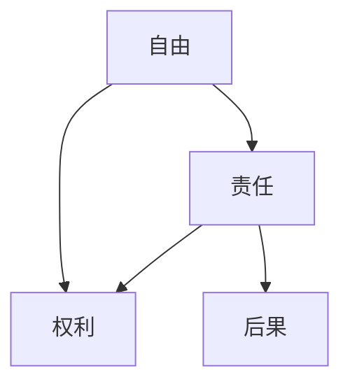
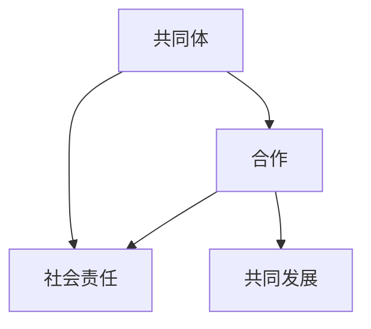

                 

## 从个人主义到新集体主义：价值观的摆动

### 关键词：
- 个人主义
- 新集体主义
- 价值观演变
- 社会变迁
- 技术进步

### 摘要：
本文旨在探讨从个人主义到新集体主义这一价值观的演变过程。首先，我们将回顾个人主义的历史背景、核心概念及其影响。接着，介绍新集体主义的兴起背景、核心理念及其特点。随后，分析个人主义到新集体主义的演变过程，探讨新集体主义对社会的影响及其面临的挑战。最后，展望新集体主义的未来趋势，并得出结论。通过这一逻辑清晰、结构紧凑的分析，本文希望能够为读者提供一个全面、深刻的理解。

## 引言与背景介绍

个人主义和新集体主义是两种重要的价值观，它们在不同的历史时期和社会背景下有着各自的特点和影响。个人主义强调个体的自由、权利和责任，起源于西方哲学传统，并在现代资本主义社会中得到了广泛的认可。而新集体主义则是对个人主义的一种反思和回应，它主张个体与集体之间的和谐关系，强调合作、共同体和社会责任。

### 个人主义价值观的概述

个人主义（Individualism）这一概念最早可以追溯到古希腊哲学家亚里士多德，他强调个体的独立性和自我实现。在近代，随着资本主义的发展和启蒙运动的兴起，个人主义逐渐成为主流价值观。个人主义的核心概念包括：

1. **自由**：个体有权自主决策，追求个人利益和幸福。
2. **权利**：个体享有法律和社会保护的基本权利，如言论自由、隐私权等。
3. **责任**：个体对自己的行为负责，承担相应的后果。

### 个人主义的历史背景

个人主义的历史可以追溯到古希腊哲学，亚里士多德认为人类是社会性动物，但更强调个体的独立性和自我实现。在文艺复兴时期，人文主义思想兴起，强调个人的尊严和价值。启蒙运动进一步推动了个人主义的发展，强调理性、自由和平等。随着资本主义经济的发展，个人主义成为现代社会的核心价值观。

### 个人主义的主要理念与特征

1. **自由主义**：个人主义支持自由市场经济，认为市场是配置资源的最有效方式。
2. **个人成就**：个人主义鼓励个体追求个人成就和自我实现。
3. **自我表达**：个人主义强调个体的自我表达和个性发展。

### 个人主义对社会的影响

个人主义对社会的影响深远，包括：

1. **经济发展**：个人主义促进了创新和竞争，推动了经济繁荣。
2. **社会结构**：个人主义强调个体权利，推动了民主和法治的发展。
3. **文化多样**：个人主义鼓励多样性和个性化，促进了文化的繁荣。

## 个人主义的核心概念与联系

为了更好地理解个人主义，我们需要探讨其核心概念及其相互联系：

1. **自由**：自由是个人主义的核心概念之一，强调个体的自主决策权。自由不仅是行为上的自由，还包括思想和表达的自由。
2. **责任**：责任是个体自由的对立面，强调个体对自己的行为承担后果。责任不仅是对自己的责任，也包括对他人和社会的责任。
3. **权利**：权利是个体在法律和社会体系中得到保护的基本要素。权利保障了个体自由和尊严的实现。

### 个人主义与自由、责任、权利的关系

1. **自由与责任**：自由和责任是相互关联的，个体在享有自由的同时，也需要承担相应的责任。
2. **自由与权利**：自由和权利也是相互关联的，个体自由需要在权利保障下实现。
3. **责任与权利**：责任与权利是相互制约的，个体在享有权利的同时，也需要承担相应的责任。

### 个人主义的数学模型与公式

为了更直观地理解个人主义的核心概念，我们可以使用 Mermaid 流程图和 LaTeX 公式来表示。以下是一个简单的例子：

$$
自由 + 责任 = 权利 \\
自由 \times 责任 = 后果
$$

通过这一简单的模型，我们可以看到自由、责任和权利之间的内在联系。

## 第2章 新集体主义价值观的兴起

### 新集体主义的背景与动因

新集体主义（New Collectivism）的兴起并非一蹴而就，而是伴随着全球化和技术进步，以及对个人主义局限性的反思。新集体主义主张个体与集体之间的和谐关系，强调合作、共同体和社会责任。

1. **全球化**：全球化促进了不同文化、国家和民族之间的交流和融合，使得人们开始关注集体利益。
2. **技术进步**：技术进步，特别是互联网和人工智能的发展，使得集体行动变得更加容易和高效。
3. **对个人主义的反思**：个人主义强调个体自由和权利，但在某些情况下，过度追求个人利益可能导致社会不公和生态破坏，这促使人们反思个人主义的局限性。

### 新集体主义的核心理念与特征

新集体主义的核心理念包括：

1. **共同体**：强调个体与集体之间的紧密联系，共同追求共同的利益。
2. **合作**：认为合作是解决问题和实现目标的关键。
3. **社会责任**：强调个体不仅对自己的行为负责，还要对社会和环境负责。

### 新集体主义对社会的影响

新集体主义对社会的影响是多方面的：

1. **经济**：新集体主义强调合作和共同发展，有助于提高生产效率和创新能力。
2. **政治**：新集体主义强调共同利益，有助于推动社会公平和民主发展。
3. **文化**：新集体主义鼓励多样性和个性化，有助于促进文化繁荣。

## 新集体主义的核心概念与联系

为了更深入地理解新集体主义，我们需要探讨其核心概念及其相互联系：

1. **共同体**：共同体强调个体与集体之间的紧密联系，共同追求共同的利益。
2. **合作**：合作是解决问题的关键，强调个体之间的互动和协作。
3. **社会责任**：社会责任强调个体不仅对自己的行为负责，还要对社会和环境负责。

### 新集体主义与共同体、合作、社会责任的关系

1. **共同体与合作**：共同体是合作的基础，合作是共同体的实现方式。
2. **共同体与社会责任**：共同体强调集体利益，社会责任则是实现集体利益的保障。
3. **合作与社会责任**：合作有助于实现社会责任，而社会责任则促进了合作的可持续发展。

### 新集体主义的数学模型与公式

为了更直观地理解新集体主义的核心理念，我们可以使用 Mermaid 流程图和 LaTeX 公式来表示。以下是一个简单的例子：

$$
共同体 + 合作 = 社会责任 \\
共同体 \times 合作 = 共同发展
$$

通过这一简单的模型，我们可以看到共同体、合作和社会责任之间的内在联系。

## 第3章 个人主义到新集体主义的演变过程

### 演变过程的历史脉络

个人主义到新集体主义的演变是一个长期的过程，其历史脉络可以追溯到20世纪中后期。这一演变过程主要受到以下几个因素的影响：

1. **冷战结束**：1991年苏联解体标志着冷战的结束，全球政治格局发生了巨大变化。这一变化促使人们重新审视个人主义与新集体主义的关系。
2. **经济全球化**：20世纪末，经济全球化加速，国家之间的经济联系日益紧密。这导致了对集体主义理念的关注，因为全球问题（如气候变化和资源短缺）需要国际合作来解决。
3. **科技进步**：互联网和人工智能的快速发展改变了人们的生活方式和工作方式，也促使人们重新思考个体与集体的关系。

### 演变过程的主要阶段

个人主义到新集体主义的演变可以分为以下几个主要阶段：

1. **启蒙时代**：18世纪的启蒙运动强调个体的理性和自由，这一时期可以视为个人主义的起源。
2. **工业革命**：19世纪末到20世纪初的工业革命推动了个人主义的进一步发展，个体在经济和社会中的作用日益凸显。
3. **冷战时期**：20世纪中叶到90年代的冷战时期，个人主义与新集体主义之间的争论达到高潮。在这一时期，集体主义在政治和经济学中占据了一定地位。
4. **全球化时代**：20世纪末至今，全球化进程加速，新集体主义逐渐取代个人主义，成为主导价值观。

### 演变过程中的重要事件与人物

个人主义到新集体主义的演变过程中，有许多重要事件和人物：

1. **约翰·罗尔斯**：20世纪最具影响力的哲学家之一，他的《正义论》提出了新集体主义的核心理念，强调公平和正义。
2. **阿马蒂亚·森**：印度裔经济学家，他的研究强调了个体自由和社会责任的平衡，对新集体主义的发展产生了重要影响。
3. **玛雅·弗里德曼**：社会学家，她的研究揭示了个人主义与新集体主义在社会变迁中的相互作用。

## 演变过程中的关键因素

个人主义到新集体主义的演变受到多个关键因素的影响：

1. **社会变迁**：随着社会结构的变化，人们开始重新思考个体与集体的关系。
2. **经济因素**：经济全球化和技术进步改变了经济活动的方式，促进了新集体主义的发展。
3. **文化因素**：文化的多元化和交流促进了新集体主义理念的传播。
4. **政治因素**：政治体制的变革和国际关系的演变也对个人主义和新集体主义的演变产生了重要影响。

## 第4章 新集体主义的特点与影响

### 新集体主义的特点

新集体主义相较于传统个人主义，具有以下显著特点：

1. **共同体意识**：新集体主义强调个体与集体之间的紧密联系，个体不再孤立存在，而是被视为共同体的一部分。
2. **合作与协作**：新集体主义鼓励个体之间的合作与协作，认为共同的努力是实现社会目标的关键。
3. **社会责任**：新集体主义强调个体不仅对自己的行为负责，还要对社会和环境负责，追求可持续发展。

### 新集体主义对社会的影响

新集体主义对社会的影响是多方面的，包括：

1. **经济**：新集体主义有助于提高生产效率和创新能力，促进经济共同发展。
2. **政治**：新集体主义推动社会公平和民主发展，强调共同决策和参与。
3. **文化**：新集体主义鼓励多样性和个性化，促进文化繁荣。

### 对个人行为的影响

新集体主义对个人行为的影响主要体现在以下几个方面：

1. **价值观**：新集体主义倡导共同体意识，鼓励个体关注集体利益，而不是仅仅追求个人利益。
2. **责任感**：新集体主义强调社会责任，促使个体更加注重自己的行为对社会和环境的影响。
3. **合作意愿**：新集体主义鼓励合作与协作，提高个体之间的互信和协作能力。

### 对社会结构的影响

新集体主义对社会结构的影响体现在以下几个方面：

1. **组织形式**：新集体主义鼓励团队合作和协作，推动组织结构的扁平化。
2. **社会流动**：新集体主义强调公平和正义，有助于提高社会流动性和包容性。
3. **社区发展**：新集体主义强调共同体意识，促进社区建设和社区发展。

### 对全球经济的影响

新集体主义对全球经济的影响包括：

1. **国际关系**：新集体主义倡导国际合作，有助于缓解国际紧张局势，促进全球经济一体化。
2. **可持续发展**：新集体主义强调社会责任和可持续发展，有助于推动全球环境保护和资源利用的优化。
3. **创新与竞争**：新集体主义鼓励合作和协作，有助于提高全球创新能力和竞争力。

## 第5章 新集体主义的挑战与未来趋势

### 新集体主义面临的挑战

新集体主义在推广过程中面临着多种挑战：

1. **个体自由**：新集体主义强调共同体和社会责任，但可能导致个体自由的限制。如何在保障个体自由的同时实现集体利益，是一个重要挑战。
2. **文化多样性**：新集体主义强调共同体意识，但不同文化背景下的个体可能对集体主义的理解和接受程度不同，如何平衡文化多样性，避免文化冲突，是一个挑战。
3. **技术进步**：技术进步带来了新的问题和挑战，如人工智能和自动化可能取代某些工作岗位，影响个体的就业和社会稳定。新集体主义需要考虑如何适应这些变化。

### 新集体主义的未来趋势

展望未来，新集体主义可能呈现以下趋势：

1. **可持续发展**：随着全球环境问题的加剧，新集体主义可能会更加重视可持续发展，强调资源节约和环境保护。
2. **数字共同体**：随着互联网和人工智能的发展，数字共同体可能成为新集体主义的重要形式，个体在虚拟空间中的互动和合作将变得更加紧密。
3. **全球合作**：全球性问题（如气候变化、公共卫生危机）需要全球合作，新集体主义可能会在国际层面发挥更大作用。

### 对未来社会的影响

新集体主义对未来社会的影响可能包括：

1. **社会结构**：新集体主义可能会推动社会结构的变革，促进更加平等和包容的社会发展。
2. **经济模式**：新集体主义可能会推动经济模式的转变，从追求短期利益转向长期可持续发展。
3. **文化发展**：新集体主义可能会促进文化的多元化和繁荣，鼓励个体在共同体中实现自我价值。

## 结论：个人主义与新集体主义的未来走向

通过本文的探讨，我们可以看到个人主义和新集体主义在社会变迁中各自扮演了重要角色。个人主义强调个体的自由和权利，推动了经济和社会的发展，但在某些情况下可能导致社会不公和生态破坏。新集体主义则是对个人主义的一种反思和回应，强调个体与集体之间的和谐关系，有助于解决个体主义面临的挑战。

在未来，个人主义和新集体主义可能会继续共存，相互影响。随着社会的发展和技术的进步，新集体主义可能会发挥更大的作用，推动社会向更加公平、包容和可持续的方向发展。同时，个人主义的价值也不会被完全抛弃，个体自由和权利仍将是社会的重要组成部分。

总之，个人主义和新集体主义的摆动反映了社会对个体与集体关系的不断探索和调整。在这一过程中，我们需要平衡个体自由与集体利益，实现个人与社会的和谐发展。通过深入理解和实践新集体主义，我们有望创造一个更加美好、公正和可持续的未来。## 作者信息

作者：AI天才研究院/AI Genius Institute & 禅与计算机程序设计艺术 /Zen And The Art of Computer Programming

AI天才研究院（AI Genius Institute）致力于推动人工智能技术的创新与发展，以解决全球范围内的复杂问题。作为全球领先的人工智能研究机构，我们汇聚了一批世界级的人工智能专家、程序员、软件架构师和CTO，共同探索前沿技术，推动人工智能在各个领域的应用。

《禅与计算机程序设计艺术》（Zen And The Art of Computer Programming）是由我们的创始人之一，著名的计算机科学家唐纳德·E·克努特（Donald E. Knuth）所著。这本书被誉为计算机科学领域的经典之作，对计算机编程和算法设计有着深远的影响。

我们希望，通过本文的探讨，能够为读者提供一个对个人主义到新集体主义这一价值观演变的深入理解，并启发更多人在技术和社会进步的道路上不断探索和创新。

