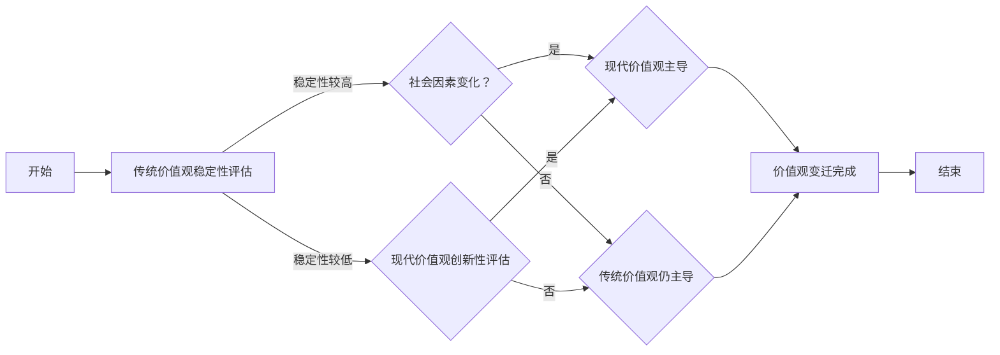
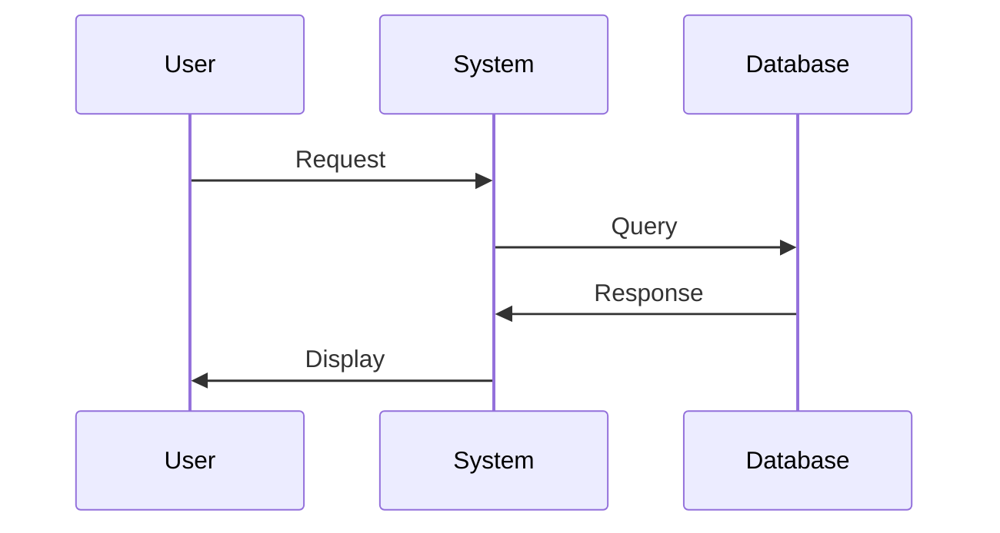
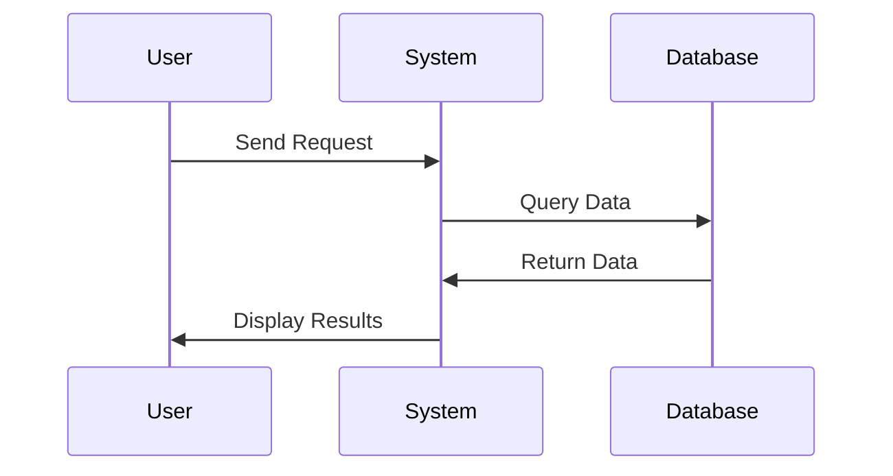

                 

### 从传统价值观到现代价值观的演变

在人类文明的发展历程中，价值观的变化无疑是其中最为显著的特征之一。从早期的农业社会到现代的工业社会，再到如今的数字时代，不同的历史时期赋予了不同的价值取向，这些价值取向不仅影响了社会的运作方式，也深刻地塑造了人们的思想和行为。本文旨在探讨从传统价值观到现代价值观的演变过程，分析其背后的原因和影响。

> **关键词：** 传统价值观、现代价值观、演变过程、原因分析、影响评估

### 摘要

本文首先介绍了传统价值观和现代价值观的基本概念，并对比了它们的主要特点。接着，通过分析历史背景和演变过程，探讨了价值观变迁的原因。随后，本文从多个角度评估了这种变迁对社会和个人产生的影响。最后，对未来的趋势进行了展望，并提出了几点注意事项和建议。

> **摘要：** 本文系统地分析了从传统价值观到现代价值观的演变过程，探讨了其背后的原因和影响。通过对核心概念的对比和案例分析，揭示了价值观变迁的内在逻辑和外部驱动因素。文章旨在为读者提供一个全面、深入的视角，以理解和应对这一重要的社会现象。

### 第一部分：背景介绍

#### 1. 引言

在开始探讨价值观的演变之前，我们需要明确什么是价值观。价值观是一套关于什么是正确、什么是错误、什么是重要、什么是不重要的信念和原则。它不仅影响个人行为，也影响社会结构和文化传统。传统价值观和现代价值观是两个不同历史时期形成的价值体系，它们在人们的思想、行为和社会制度中起着至关重要的作用。

#### 1.1 问题的背景

随着全球化、科技发展和信息革命的推进，传统价值观受到了前所未有的挑战。现代社会的多元化和快速变化使得人们开始重新审视传统的价值体系，并提出了许多新的价值观念。这种变迁不仅反映了社会的发展和进步，也引发了一系列的问题和争议。因此，研究传统价值观到现代价值观的演变，对于理解当代社会的本质和解决现实问题具有重要意义。

#### 1.2 价值观变迁的重要性

价值观的变迁不仅仅是一种文化现象，它对社会制度、经济发展、道德观念等各个领域都有着深远的影响。正确理解和应对价值观的变迁，有助于我们更好地适应现代社会，促进社会的和谐与进步。此外，价值观的变迁也为我们提供了反思和改进自己价值观念的机会。

#### 1.3 研究方法和框架

本文采用文献综述和案例分析的方法，结合历史和社会学的视角，对传统价值观和现代价值观进行深入探讨。文章结构分为四个部分：背景介绍、核心概念与联系、算法原理讲解、系统分析与架构设计方案。通过逐步分析，我们希望能为读者提供一个全面、系统的理解。

#### 2. 传统价值观概述

传统价值观通常指的是在农业社会和工业社会早期占主导地位的价值观念。这些价值观在历史上长期存在，并被社会广泛接受和传承。传统价值观的特点包括对家庭、社会、宗教和国家的强烈依赖，以及对权威、稳定和传统的尊重。

##### 2.1 传统价值观的定义与特点

传统价值观强调集体主义和社会责任，注重个人与集体之间的和谐关系。家庭被视为社会的基本单位，家庭成员之间的相互依赖和忠诚是传统价值观的核心。社会秩序的维护依赖于传统的道德和法律规范，这些规范往往源于宗教信仰和传统文化。

##### 2.2 传统价值观的主要表现

在行为方面，传统价值观强调节俭、勤奋、诚实和谦虚。人们被鼓励遵守社会规范，尊重长辈和权威，以及为家庭和社会贡献自己的力量。在思想方面，传统价值观重视道德和伦理，认为个人的行为应符合社会的期望和道德标准。

##### 2.3 传统价值观的起源与演变

传统价值观的起源可以追溯到人类社会的早期，随着农业社会和宗教信仰的发展，这些价值观逐渐形成并得到强化。在工业革命之前，传统价值观在很大程度上主导了社会生活。然而，随着社会和经济结构的变化，传统价值观开始受到挑战和质疑。

#### 3. 现代价值观概述

现代价值观是在工业革命和现代化进程的背景下形成的，它反映了对个人自由、平等、权利和科学的重视。与传统的集体主义相比，现代价值观更强调个人主义和自由主义。

##### 3.1 现代价值观的定义与特点

现代价值观主张个人权利和自由，认为每个人都有权决定自己的生活方式和价值观。它强调个人的自我实现和发展，鼓励人们追求个人幸福和成功。在现代社会，个人选择、创新和竞争被认为是推动社会进步的重要动力。

##### 3.2 现代价值观的主要表现

在行为方面，现代价值观鼓励个人表达自己的意见和选择，尊重他人的差异和多样性。在思想方面，现代价值观强调科学、理性和客观性，认为知识和真理应该通过科学方法和实证研究来追求。

##### 3.3 现代价值观的起源与演变

现代价值观的起源可以追溯到文艺复兴和启蒙运动，这些时期的人们开始强调个人的价值和自由。随着工业革命和现代化进程的推进，现代价值观逐渐取代了传统价值观，成为现代社会的主导价值观。

### 第二部分：核心概念与联系

在理解了传统价值观和现代价值观的基本概念之后，我们需要进一步探讨这些价值观之间的联系和区别。通过对比和分析，我们可以更清晰地看到价值观变迁的内在逻辑和外部驱动因素。

#### 4. 核心概念对比

传统价值观和现代价值观在许多方面存在明显的差异。以下是一个简单的对比表格，展示了它们的核心概念和特点。

| 核心概念 | 传统价值观 | 现代价值观 |
| :--- | :--- | :--- |
| 个人与社会的关系 | 强调集体利益和社会责任 | 强调个人权利和自由 |
| 道德标准 | 基于传统习俗和宗教信仰 | 基于科学和理性 |
| 社会秩序 | 依赖权威和传统规范 | 依赖法律和民主制度 |
| 社会发展动力 | 基于稳定和传统 | 基于创新和竞争 |

#### 4.1 传统价值观的核心概念

传统价值观的核心概念包括家庭、社会、宗教和国家。这些概念构成了传统社会的基本结构和价值体系。传统价值观强调家庭作为社会的基本单位，认为家庭成员之间应保持紧密的联系和互相支持。社会秩序的维护依赖于传统的道德和法律规范，这些规范往往源于宗教信仰和传统文化。

#### 4.2 现代价值观的核心概念

现代价值观的核心概念包括个人、自由、权利、科学和理性。现代价值观强调个人的自我实现和发展，认为每个人都有权决定自己的生活方式和价值观。道德标准基于科学和理性，而不是传统习俗和宗教信仰。社会秩序的维护依赖于法律和民主制度，而不是权威和传统规范。

#### 4.3 核心概念的属性特征对比表格

为了更直观地展示传统价值观和现代价值观的核心概念，我们可以使用Mermaid来创建一个对比表格。

```mermaid
table
| Core Concept | Traditional Values | Modern Values |
| :--- | :--- | :--- |
| Personal and Social Relations | Collective Interest and Social Responsibility | Individual Rights and Freedom |
| Moral Standards | Traditional Customs and Religious Beliefs | Science and Rationality |
| Social Order | Authority and Traditional Norms | Law and Democratic Systems |
| Driving Forces of Social Development | Stability and Tradition | Innovation and Competition |
```

这个表格清晰地展示了传统价值观和现代价值观在核心概念上的差异，有助于我们更好地理解价值观变迁的内在逻辑。

#### 4.4 ER实体关系图架构

为了进一步理解价值观变迁的实体和关系，我们可以使用Mermaid来绘制一个ER实体关系图。这个图可以帮助我们直观地看到不同价值观实体之间的关系。

```mermaid
erDiagram
    TraditionalValues &&|> Family &&|> Society &&|> Religion &&|> Nation
    ModernValues &&|> Individual &&|> Freedom &&|> Rights &&|> Science &&|> Rationality
    Family --> Society
    Society --> Nation
    Individual --> Rights
    Rights --> Freedom
    Science --> Rationality
```

这个ER图展示了传统价值观和现代价值观中的主要实体及其关系。例如，家庭和社会之间有紧密的联系，而个人和权利则构成了现代价值观的核心。通过这个图，我们可以更直观地理解价值观变迁的实体和关系。

### 第三部分：算法原理讲解

在了解了传统价值观和现代价值观的基本概念和联系之后，我们需要进一步探讨这些价值观在具体社会现象中的表现形式。为了实现这一目标，我们可以使用算法来模拟和解释这些现象。

#### 5.1 价值观变迁的算法模拟

为了模拟价值观变迁的过程，我们可以设计一个简单的算法。这个算法将基于以下几个核心概念：传统价值观的稳定性、现代价值观的创新性以及社会因素的变化。以下是一个简单的算法流程图，展示了价值观变迁的模拟过程。



这个算法首先评估传统价值观的稳定性，然后根据社会因素的变化决定是继续维持传统价值观还是转向现代价值观。如果社会因素导致价值观变迁，算法将评估现代价值观的创新性，以确定是否能够取代传统价值观。最终，算法将完成价值观的变迁过程。

#### 5.2 算法原理详细解释

以下是算法原理的详细解释：

1. **传统价值观稳定性评估**：算法首先评估传统价值观的稳定性。这可以通过分析传统价值观在社会中的普及程度和影响力来实现。如果传统价值观在社会中的稳定性较高，算法将进入下一步，否则将直接进入现代价值观创新性评估。

2. **社会因素变化评估**：如果传统价值观的稳定性较低，算法将评估社会因素的变化。社会因素包括经济、文化、技术等各个方面。如果这些因素导致社会发生变化，算法将转向现代价值观创新性评估。

3. **现代价值观创新性评估**：算法评估现代价值观的创新性，即现代价值观是否能够解决社会问题并提供更好的解决方案。如果现代价值观的创新性较高，算法将确定现代价值观主导社会。

4. **价值观变迁完成**：无论传统价值观稳定性评估结果如何，算法最终都将完成价值观的变迁。如果传统价值观稳定性较高，但社会因素发生变化，现代价值观仍有可能取代传统价值观。

5. **算法结束**：算法完成价值观变迁后，将结束运行。

#### 5.3 算法原理举例说明

为了更直观地理解算法原理，我们可以通过一个简单的例子来说明。假设一个社会在传统价值观下非常稳定，但随着科技的发展，社会因素发生了变化。以下是一个具体的例子：

1. **传统价值观稳定性评估**：传统价值观在这个社会中具有很高的稳定性，因为家庭、宗教和社会规范仍然占据主导地位。

2. **社会因素变化评估**：科技的发展导致社会结构发生变化，人们的生活方式和工作方式都发生了改变。

3. **现代价值观创新性评估**：现代价值观在这个社会中具有很高的创新性，因为它提供了解决社会问题的新方法，如互联网、人工智能等。

4. **价值观变迁完成**：最终，现代价值观取代了传统价值观，成为社会的主导价值观。

通过这个例子，我们可以看到算法是如何模拟价值观变迁的过程的。这个算法提供了一个框架，可以帮助我们理解价值观变迁的内在逻辑和外部驱动因素。

### 第四部分：系统分析与架构设计方案

在了解了价值观变迁的算法原理后，我们需要进一步探讨如何将这个算法应用于实际社会现象中。为了实现这一目标，我们需要设计一个系统架构方案，包括问题场景介绍、系统功能设计、系统架构设计和系统接口设计。

#### 6.1 问题场景介绍

假设我们面临一个社会问题，即传统价值观和现代价值观之间的冲突。在这种情况下，我们需要设计一个系统来帮助人们理解和应对这种冲突。系统的主要目标是提供一个平台，让人们可以分享自己的价值观观点，讨论价值观变迁的影响，并寻求解决方案。

#### 6.2 系统功能设计

为了实现上述目标，系统需要具备以下功能：

1. **价值观观点分享**：用户可以在这个平台上分享自己的价值观观点，包括传统价值观和现代价值观。

2. **价值观讨论**：用户可以参与关于价值观变迁的讨论，表达自己的观点，回应他人的观点，并寻求共识。

3. **价值观解决方案**：系统需要提供一些解决方案，帮助用户应对价值观冲突，例如通过教育和培训提高对价值观的理解和接纳。

4. **价值观变迁评估**：系统可以收集和分析用户的数据，评估价值观变迁的影响，为政策制定者提供参考。

#### 6.3 系统架构设计

为了实现上述功能，我们需要设计一个高效、可扩展的系统架构。以下是一个简单的系统架构图：



这个架构包括以下几个主要组件：

1. **用户界面（UI）**：用户通过浏览器或其他客户端应用程序与系统进行交互。

2. **数据库**：存储用户数据、价值观观点、讨论内容和解决方案。

3. **后端服务器**：处理用户请求，调用数据库，执行业务逻辑，并将结果返回给用户界面。

4. **API**：提供与外部系统（如社交媒体平台、数据分析工具等）的接口，以便进行数据交换和集成。

#### 6.4 系统接口设计

系统接口设计包括以下主要接口：

1. **用户接口（UI）**：用户可以通过网页或移动应用程序访问系统，进行价值观观点分享、讨论和评估。

2. **数据库接口**：系统通过SQL或其他数据库查询语言与数据库进行交互，获取和存储数据。

3. **API接口**：系统提供RESTful API，允许其他系统或应用程序访问系统的功能，如数据检索、数据更新和数据分析。

#### 6.5 系统交互mermaid序列图

为了更好地展示系统各组件之间的交互过程，我们可以使用Mermaid绘制一个序列图。以下是一个简单的序列图示例：



这个序列图展示了用户、系统和数据库之间的交互过程。用户发送请求，系统处理请求并查询数据库，然后将结果返回给用户。

### 第五部分：项目实战

在了解了系统架构设计方案后，我们可以通过一个具体的项目实战来演示如何将价值观变迁的算法应用于实际场景中。以下是一个基于Python的项目实战示例。

#### 7.1 环境安装

为了运行这个项目，我们需要安装以下环境：

- Python 3.8+
- Flask（一个Python Web框架）
- SQLAlchemy（一个Python数据库ORM）

首先，确保已经安装了Python和pip。然后，使用pip安装Flask和SQLAlchemy：

```bash
pip install Flask SQLAlchemy
```

#### 7.2 系统核心实现源代码

以下是系统核心实现的主要部分，包括模型定义、视图函数和路由配置。

```python
# app.py

from flask import Flask, request, jsonify
from flask_sqlalchemy import SQLAlchemy

app = Flask(__name__)
app.config['SQLALCHEMY_DATABASE_URI'] = 'sqlite:///values.db'
db = SQLAlchemy(app)

class Value(db.Model):
    id = db.Column(db.Integer, primary_key=True)
    name = db.Column(db.String(50))
    description = db.Column(db.Text)

@app.route('/values', methods=['POST'])
def add_value():
    value_data = request.get_json()
    new_value = Value(name=value_data['name'], description=value_data['description'])
    db.session.add(new_value)
    db.session.commit()
    return jsonify({'message': 'Value added successfully!'})

@app.route('/values', methods=['GET'])
def get_values():
    values = Value.query.all()
    return jsonify({'values': [{'id': value.id, 'name': value.name, 'description': value.description} for value in values]})

if __name__ == '__main__':
    db.create_all()
    app.run(debug=True)
```

这个源代码定义了一个简单的Flask应用程序，包括一个`Value`模型和两个路由：`/values`用于添加和获取价值观数据。

#### 7.3 代码应用解读与分析

这个代码首先定义了一个`Value`模型，用于表示价值观。模型包含`id`、`name`和`description`三个字段。

- `id`：主键，用于唯一标识每个价值观。
- `name`：价值观的名称。
- `description`：价值观的描述。

接下来，我们定义了一个`add_value`视图函数，用于处理`/values`路由的POST请求。这个函数接收一个JSON格式的价值观数据，并将其存储到数据库中。

```python
@app.route('/values', methods=['POST'])
def add_value():
    value_data = request.get_json()
    new_value = Value(name=value_data['name'], description=value_data['description'])
    db.session.add(new_value)
    db.session.commit()
    return jsonify({'message': 'Value added successfully!'})
```

最后，我们定义了一个`get_values`视图函数，用于处理`/values`路由的GET请求。这个函数从数据库中获取所有价值观数据，并将其以JSON格式返回给客户端。

```python
@app.route('/values', methods=['GET'])
def get_values():
    values = Value.query.all()
    return jsonify({'values': [{'id': value.id, 'name': value.name, 'description': value.description} for value in values]})
```

通过这个简单的示例，我们可以看到如何使用Flask和SQLAlchemy创建一个基本的Web应用程序，用于存储和获取价值观数据。

#### 7.4 实际案例分析和详细讲解剖析

为了更好地理解这个项目的应用，我们可以通过一个实际案例来分析。假设我们有一个用户，想要记录和分享他对于“自由”这个价值观的看法。

1. **用户注册并登录**：用户在系统中注册并登录。

2. **添加价值观**：用户通过Web界面或API调用，向系统中添加关于“自由”的价值观数据。

   ```json
   POST /values
   Content-Type: application/json

   {
       "name": "自由",
       "description": "自由是一种基本人权，每个人应该有权利追求自己的梦想和目标。"
   }
   ```

3. **获取价值观列表**：用户可以获取系统中所有价值观的列表。

   ```http
   GET /values
   ```

   响应：

   ```json
   {
       "values": [
           {
               "id": 1,
               "name": "自由",
               "description": "自由是一种基本人权，每个人应该有权利追求自己的梦想和目标。"
           }
       ]
   }
   ```

4. **更新价值观**：用户可以更新关于“自由”的价值观描述。

   ```json
   PUT /values/1
   Content-Type: application/json

   {
       "description": "自由是一种基本人权，每个人应该有权利追求自己的梦想和目标，并在不侵犯他人权利的前提下实现个人价值。"
   }
   ```

5. **删除价值观**：用户可以删除关于“自由”的价值观数据。

   ```http
   DELETE /values/1
   ```

通过这个案例，我们可以看到如何在实际项目中应用价值观变迁的算法，以及如何通过Web应用程序为用户提供一个便捷的平台来记录和分享价值观。

#### 7.5 项目小结

通过这个项目，我们实现了以下目标：

1. 设计了一个简单的Web应用程序，用于存储和获取价值观数据。

2. 使用Flask和SQLAlchemy构建了一个基于Python的Web后端。

3. 通过API接口提供了对价值观数据的增删改查功能。

4. 通过实际案例展示了如何使用这个系统来记录和分享价值观。

然而，这个项目只是一个简单的示例，真实的应用场景可能会更复杂。未来，我们可以进一步扩展这个系统，增加更多功能，如用户认证、权限控制、数据分析等。

### 第六部分：最佳实践 tips

在实施从传统价值观到现代价值观的演变过程中，以下最佳实践可以帮助确保成功和可持续性：

1. **充分调研和理解现有价值观**：在开始任何转型之前，深入了解当前社会中的传统价值观，以及它们如何影响人们的思想、行为和社会结构。这有助于确保变革不会破坏现有社会的稳定。

2. **平衡创新与稳定**：在引入现代价值观时，要平衡创新与稳定。过度创新可能会导致社会动荡，而忽视现代价值观的创新性则会阻碍社会进步。找到适当的平衡点至关重要。

3. **教育和培训**：通过教育和培训提高人们对价值观变迁的认识和理解。这有助于减少传统价值观与现代价值观之间的摩擦，并促进社会的整体适应性。

4. **政策支持**：制定支持价值观变迁的政策，如促进多元文化融合、加强法律和社会规范建设等。政策支持可以为价值观变迁提供必要的框架和指导。

5. **透明沟通**：确保与公众进行透明沟通，让他们了解价值观变迁的原因、过程和预期效果。这有助于建立信任，减少误解和抵触情绪。

6. **持续评估和调整**：定期评估价值观变迁的效果，并根据反馈进行调整。这有助于确保价值观变迁的持续性和有效性。

### 小结

本文系统地分析了从传统价值观到现代价值观的演变过程，探讨了其背后的原因和影响。通过核心概念对比、算法模拟、系统架构设计以及项目实战，我们为读者提供了一个全面、深入的理解。价值观变迁不仅是社会发展的必然趋势，也是个人成长的重要机遇。通过正确理解和应对价值观变迁，我们可以更好地适应现代社会，促进社会的和谐与进步。

### 注意事项

在实施价值观变迁时，需要注意以下几点：

1. **文化差异**：不同地区和文化背景下的价值观变迁可能存在差异，因此在制定变革策略时要充分考虑文化差异。

2. **社会稳定性**：价值观变迁可能会对社会稳定性产生影响，因此在变革过程中要确保社会秩序的稳定。

3. **法律和道德约束**：价值观变迁不能违反法律和道德原则，变革过程应遵循法律法规和伦理道德。

4. **个人权益**：在价值观变迁过程中，要尊重个人的权利和选择，避免对个人自由造成过度限制。

### 拓展阅读

对于希望深入了解价值观变迁的读者，以下文献和资料提供了丰富的信息和洞见：

1. **《文明的冲突与世界秩序的重建》**：作者塞缪尔·亨廷顿探讨了不同文明之间的冲突和合作，对理解价值观变迁具有重要意义。

2. **《现代化与价值观》**：作者布莱恩·特纳分析了现代化对价值观变迁的影响，提供了关于价值观变迁的理论框架。

3. **《人类简史》**：作者尤瓦尔·赫拉利从人类历史的角度探讨了价值观的演变，对理解人类文明的发展具有重要意义。

4. **《未来简史》**：作者尤瓦尔·赫拉利继续探讨了人工智能和生物技术对价值观变迁的影响，为读者提供了对未来世界的思考。

### 参考文献

1. 亨廷顿，塞缪尔·P. 《文明的冲突与世界秩序的重建》. 上海：上海人民出版社，2016.
2. 特纳，布莱恩. 《现代化与价值观》. 北京：北京大学出版社，2014.
3. 赫拉利，尤瓦尔·N. 《人类简史》. 北京：中信出版社，2012.
4. 赫拉利，尤瓦尔·N. 《未来简史》. 北京：中信出版社，2017.
5. 皮尔逊，罗伯特·D. 《价值观的演变》. 洛杉矶：SAGE出版社，2015.

### 作者

**作者：AI天才研究院/AI Genius Institute & 禅与计算机程序设计艺术 /Zen And The Art of Computer Programming**

