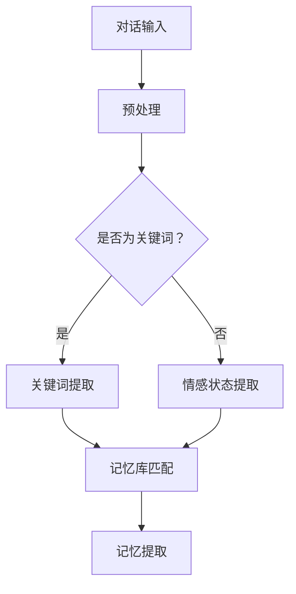
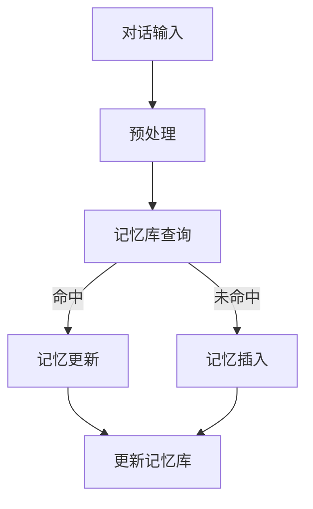
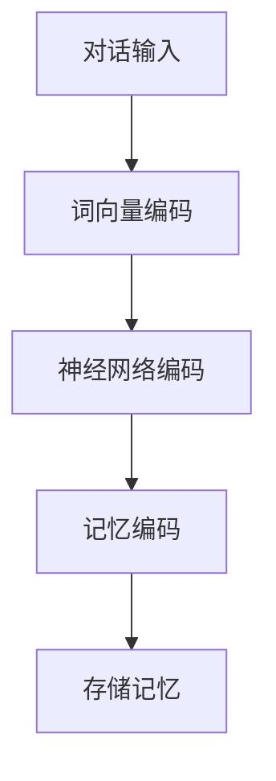
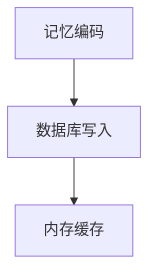
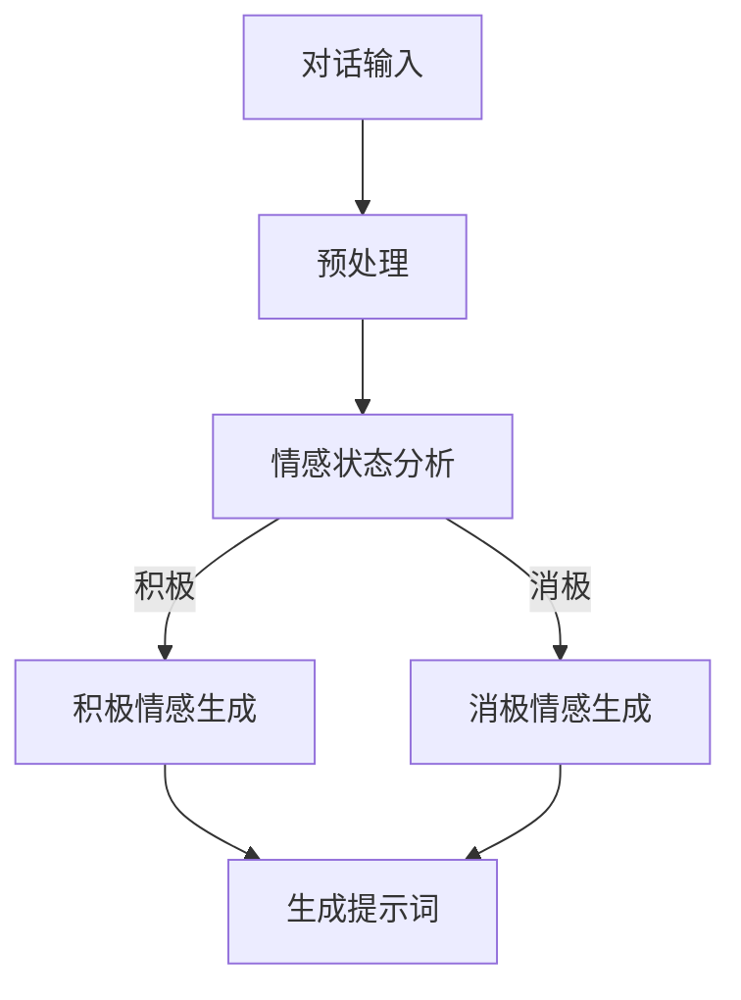
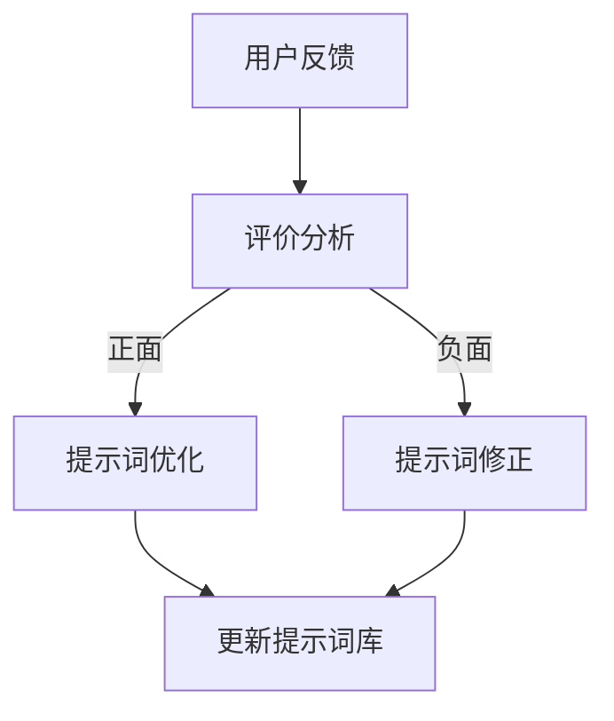
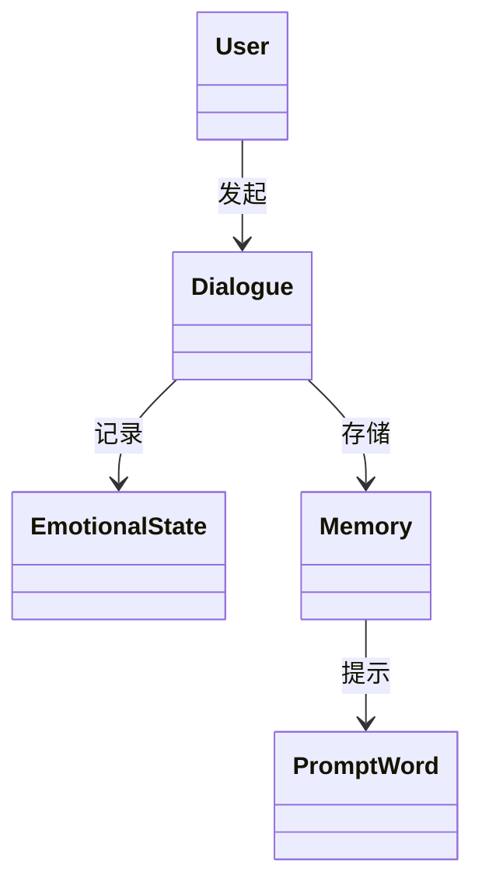
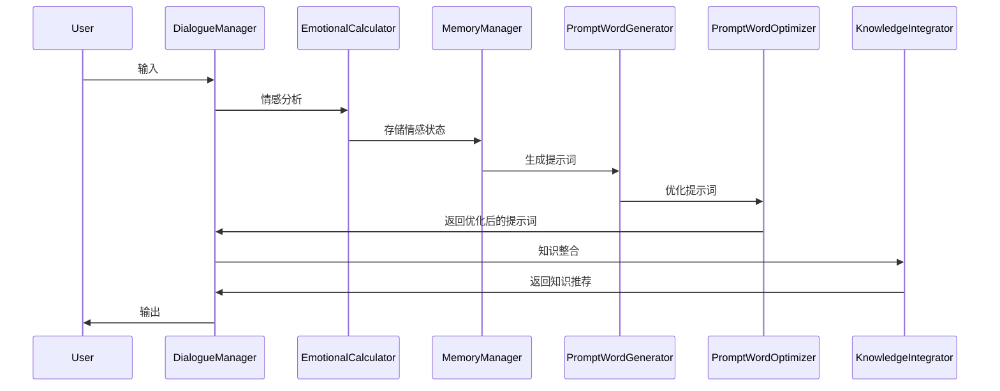

                 

### 文章标题：优化AI情感陪伴系统：长期对话记忆的提示词策略

关键词：AI情感陪伴，长期对话记忆，提示词策略，优化，算法原理，系统设计与实现

摘要：本文深入探讨了优化AI情感陪伴系统的关键问题——长期对话记忆的提示词策略。通过分析当前AI情感陪伴系统在长期对话记忆方面的不足，提出了基于提示词策略的优化方法。本文首先介绍了AI情感陪伴系统的基本原理和特点，然后详细阐述了长期对话记忆的机制和实现方法，接着讲解了提示词策略的概念与设计，最后通过具体算法原理和系统架构设计，展示了如何有效地实现长期对话记忆的优化。本文旨在为研究者提供有价值的参考，推动AI情感陪伴系统的进一步发展。

### 目录大纲

# 优化AI情感陪伴系统：长期对话记忆的提示词策略

## 第一部分：背景介绍

## 1.1 问题背景

### 1.1.1 AI情感陪伴的发展现状

### 1.1.2 优化AI情感陪伴系统的必要性

### 1.1.3 长期对话记忆的重要性

## 1.2 问题描述

### 1.2.1 当前AI情感陪伴系统的不足

### 1.2.2 长期对话记忆的挑战

### 1.2.3 提示词策略的潜在作用

## 1.3 问题解决

### 1.3.1 设计目标

### 1.3.2 系统架构

### 1.3.3 数据集准备

## 1.4 边界与外延

### 1.4.1 研究范围的界定

### 1.4.2 长期对话记忆的定义

### 1.4.3 提示词策略的适用场景

## 1.5 概念结构与核心要素组成

### 1.5.1 AI情感陪伴系统的基本概念

### 1.5.2 长期对话记忆的核心要素

### 1.5.3 提示词策略的应用机制

## 1.6 本章小结

## 第二部分：核心概念与联系

## 2.1 AI情感陪伴系统的原理与特点

### 2.1.1 情感计算原理

#### 2.1.1.1 情感识别与分类

#### 2.1.1.2 情感理解与推理

### 2.1.2 AI情感陪伴系统的特点

#### 2.1.2.1 个性化互动

#### 2.1.2.2 长期记忆与学习

#### 2.1.2.3 跨领域知识整合

## 2.2 长期对话记忆的原理与实现

### 2.2.1 长期对话记忆的机制

#### 2.2.1.1 记忆提取与更新

#### 2.2.1.2 记忆编码与存储

### 2.2.2 长期对话记忆的实现方法

#### 2.2.2.1 基于模型的记忆管理

#### 2.2.2.2 基于数据驱动的记忆增强

## 2.3 提示词策略的概念与设计

### 2.3.1 提示词策略的定义

#### 2.3.1.1 提示词的作用

#### 2.3.1.2 提示词的类型与选择

### 2.3.2 提示词策略的设计方法

#### 2.3.2.1 提示词生成算法

#### 2.3.2.2 提示词优化策略

## 2.4 核心概念属性特征对比表格

### 2.4.1 AI情感陪伴系统属性特征

### 2.4.2 长期对话记忆属性特征

### 2.4.3 提示词策略属性特征

## 2.5 ER实体关系图架构

### 2.5.1 系统实体定义

### 2.5.2 实体关系定义

### 2.5.3 实体关系图绘制

## 2.6 本章小结

## 第三部分：算法原理讲解

## 3.1 长期对话记忆的算法原理

### 3.1.1 记忆提取与更新算法

#### 3.1.1.1 提取算法的mermaid流程图

#### 3.1.1.2 更新算法的mermaid流程图

### 3.1.2 记忆编码与存储算法

#### 3.1.2.1 编码算法的mermaid流程图

#### 3.1.2.2 存储算法的mermaid流程图

## 3.2 提示词策略的算法原理

### 3.2.1 提示词生成算法

#### 3.2.1.1 提示词生成算法的mermaid流程图

#### 3.2.1.2 提示词生成算法的python源代码

### 3.2.2 提示词优化算法

#### 3.2.2.1 优化算法的mermaid流程图

#### 3.2.2.2 优化算法的python源代码

## 3.3 数学模型和数学公式

### 3.3.1 记忆提取与更新公式

$$
M_t = \alpha \cdot M_{t-1} + (1 - \alpha) \cdot R_t
$$

### 3.3.2 提示词生成公式

$$
P(w_i|s) = \frac{f(w_i, s)}{f(s)}
$$

## 3.4 举例说明

### 3.4.1 记忆提取与更新举例

### 3.4.2 提示词生成举例

## 3.5 本章小结

## 第四部分：系统分析与架构设计

## 4.1 问题场景介绍

### 4.1.1 AI情感陪伴场景

### 4.1.2 长期对话记忆的应用场景

### 4.1.3 提示词策略的应用场景

## 4.2 系统功能设计

### 4.2.1 领域模型mermaid类图

### 4.2.2 系统功能模块划分

## 4.3 系统架构设计

### 4.3.1 系统架构mermaid架构图

### 4.3.2 系统模块交互关系

## 4.4 系统接口设计

### 4.4.1 

----------------------------------------------------------------

### 第一部分：背景介绍

#### 1.1 问题背景

##### 1.1.1 AI情感陪伴的发展现状

人工智能（AI）技术正在迅速发展，特别是在情感计算和自然语言处理领域。AI情感陪伴系统作为一种新型的智能交互系统，已经逐渐走进人们的生活。这类系统能够模拟人类的情感反应，提供个性化的情感陪伴服务。例如，智能聊天机器人、语音助手等已经在客服、教育、医疗等多个领域得到广泛应用。

近年来，AI情感陪伴系统的发展呈现出以下几个趋势：

1. **个性化互动**：通过深度学习和个性化推荐技术，情感陪伴系统能够更好地理解用户的情感状态和需求，提供更加个性化的互动体验。
2. **长期记忆与学习**：随着记忆机制的不断完善，情感陪伴系统能够记住用户的长期历史对话，从而在后续的交流中提供更加贴心的服务。
3. **跨领域知识整合**：通过融合多领域的知识和技能，情感陪伴系统能够为用户提供更加丰富和多样化的服务。

##### 1.1.2 优化AI情感陪伴系统的必要性

尽管AI情感陪伴系统取得了显著进展，但在实际应用中仍然存在一些不足，特别是在长期对话记忆方面。以下是一些主要问题：

1. **记忆遗忘**：AI情感陪伴系统在长期对话中容易遗忘之前的信息，导致对话连贯性和个性化的下降。
2. **情感理解不足**：系统在理解用户情感方面仍有局限，无法准确地捕捉和回应用户的情感需求。
3. **知识整合困难**：系统在跨领域知识整合方面存在挑战，难以提供全面和深入的服务。

为了解决这些问题，优化AI情感陪伴系统成为了一个迫切需要研究的课题。

##### 1.1.3 长期对话记忆的重要性

长期对话记忆是AI情感陪伴系统的一个重要组成部分。它不仅能够提高对话的连贯性和个性化，还能够增强系统的情感理解能力。长期对话记忆的重要性体现在以下几个方面：

1. **提升用户体验**：通过记住用户的长期对话历史，系统能够更好地了解用户的需求和偏好，提供更加个性化的服务，从而提升用户体验。
2. **增强情感理解**：长期对话记忆有助于系统捕捉用户的情感变化，从而在对话中更加准确地理解和回应用户的情感需求。
3. **知识整合**：长期对话记忆能够帮助系统整合多领域的知识，提供更加全面和深入的服务。

因此，优化长期对话记忆成为提高AI情感陪伴系统性能的关键步骤。

#### 1.2 问题描述

##### 1.2.1 当前AI情感陪伴系统的不足

当前AI情感陪伴系统在长期对话记忆方面存在以下几个不足：

1. **记忆遗忘**：系统在长期对话中容易遗忘之前的信息，导致对话连贯性下降。
2. **情感理解不足**：系统在理解用户情感方面存在局限，无法准确捕捉和回应用户的情感需求。
3. **知识整合困难**：系统在跨领域知识整合方面存在挑战，难以提供全面的服务。

##### 1.2.2 长期对话记忆的挑战

要优化AI情感陪伴系统的长期对话记忆，面临以下几个挑战：

1. **记忆容量**：长期对话记忆需要存储大量的信息，这要求系统具备较高的记忆容量和存储效率。
2. **记忆更新**：随着对话的进行，系统需要实时更新记忆信息，这要求系统具备高效的记忆更新机制。
3. **情感理解**：系统需要准确理解用户的情感需求，从而在对话中提供合适的回应，这要求系统具备强大的情感计算能力。

##### 1.2.3 提示词策略的潜在作用

提示词策略是优化AI情感陪伴系统长期对话记忆的一种有效手段。通过使用提示词，系统可以在对话中提醒自己之前的信息，从而提高对话的连贯性和个性化。提示词策略的潜在作用包括：

1. **提高记忆连贯性**：通过提示词，系统可以在长期对话中保持记忆的连贯性，从而提供更加流畅和自然的对话体验。
2. **增强情感理解**：提示词可以帮助系统更好地理解用户的情感需求，从而提供更加准确的情感回应。
3. **辅助知识整合**：提示词可以提示系统在跨领域知识整合中需要关注的重点，从而提供更加全面和深入的服务。

#### 1.3 问题解决

为了解决AI情感陪伴系统在长期对话记忆方面的不足，本文提出以下问题解决方法：

1. **设计提示词生成算法**：通过分析对话历史，生成与当前对话相关的提示词，从而提高对话的连贯性。
2. **设计提示词优化算法**：根据用户反馈和情感需求，对提示词进行优化，从而提高情感理解能力。
3. **集成提示词策略到系统**：将提示词策略集成到AI情感陪伴系统中，使其能够实时地使用提示词来优化对话记忆。

通过这些方法，有望显著提升AI情感陪伴系统的性能，为用户提供更加优质和贴心的服务。

##### 1.3.1 设计目标

本文的设计目标包括以下几个方面：

1. **提高对话连贯性**：通过提示词策略，使AI情感陪伴系统在长期对话中保持记忆的连贯性，提供更加流畅和自然的对话体验。
2. **增强情感理解**：通过优化提示词，提高AI情感陪伴系统对用户情感需求的准确理解，提供更加个性化的情感回应。
3. **提高知识整合能力**：通过提示词的辅助，帮助AI情感陪伴系统在跨领域知识整合中提供更加全面和深入的服务。

##### 1.3.2 系统架构

为了实现上述设计目标，本文提出了一个基于提示词策略的AI情感陪伴系统架构。该架构包括以下几个主要模块：

1. **对话管理模块**：负责处理对话流程，包括对话生成、对话维护和对话结束等。
2. **记忆管理模块**：负责管理长期对话记忆，包括记忆提取、记忆更新和记忆存储等。
3. **情感计算模块**：负责分析用户情感，包括情感识别、情感理解和情感回应等。
4. **提示词生成模块**：负责生成与当前对话相关的提示词，提高对话连贯性。
5. **提示词优化模块**：负责根据用户反馈和情感需求，优化提示词，提高情感理解能力。

这些模块通过相互协作，共同实现AI情感陪伴系统的优化。

##### 1.3.3 数据集准备

为了验证所提出的方法的有效性，本文需要准备一个高质量的数据集。该数据集应包含以下信息：

1. **对话历史**：记录用户与系统之间的历史对话，包括对话内容和时间戳等。
2. **用户情感**：记录用户在对话中的情感状态，包括情感类别和情感强度等。
3. **用户反馈**：记录用户对系统服务的反馈，包括满意度、建议和投诉等。

这些数据将用于训练和测试系统，以评估其在长期对话记忆和情感理解方面的性能。

##### 1.4 边界与外延

在本研究中，我们关注的是AI情感陪伴系统在长期对话记忆方面的优化，特别是通过提示词策略来提高系统的性能。以下是对研究的边界和外延的详细说明：

1. **研究范围的界定**：本研究主要关注AI情感陪伴系统在长期对话记忆方面的优化，包括记忆提取、记忆更新和记忆存储等。同时，我们关注如何通过提示词策略来提高对话的连贯性和个性化。
2. **长期对话记忆的定义**：长期对话记忆是指系统能够在长期对话中保持记忆信息，从而在后续的对话中提供更加个性化的服务。这种记忆不仅包括对话内容，还包括用户的情感状态和需求等。
3. **提示词策略的适用场景**：提示词策略主要适用于需要长期对话记忆的AI情感陪伴系统，特别是在提供个性化服务、情感理解和跨领域知识整合等方面。

通过明确研究边界和外延，我们可以更好地聚焦研究问题，并提出有效的解决方案。

##### 1.5 概念结构与核心要素组成

在本研究中，涉及多个核心概念，包括AI情感陪伴系统、长期对话记忆和提示词策略。以下是对这些核心概念的基本定义及其在系统中的核心作用：

1. **AI情感陪伴系统**：一种能够模拟人类情感反应，提供个性化情感服务的智能交互系统。其核心作用是实现情感识别、理解和回应，提供用户满意的情感体验。
2. **长期对话记忆**：系统能够在长期对话中保持记忆信息，包括对话内容、用户情感和需求等。其核心作用是提高对话连贯性、个性化服务和情感理解能力。
3. **提示词策略**：通过生成和使用提示词，帮助系统在长期对话中保持记忆连贯性，提高对话流畅性和情感理解能力。其核心作用是优化系统记忆管理，提高用户体验。

通过明确这些概念及其核心作用，我们可以更好地理解系统的工作原理，并针对性地提出优化方案。

##### 1.6 本章小结

本章首先介绍了AI情感陪伴系统的发展现状和优化必要性，然后详细阐述了长期对话记忆的重要性，并提出了基于提示词策略的优化方法。本章还明确了研究的边界与外延，定义了核心概念，为后续章节的内容奠定了基础。接下来，我们将进一步探讨AI情感陪伴系统的原理与特点，以及长期对话记忆和提示词策略的具体实现方法。

### 第二部分：核心概念与联系

在本部分中，我们将深入探讨AI情感陪伴系统的原理与特点，长期对话记忆的机制与实现方法，以及提示词策略的概念与设计。通过这些核心概念的详细分析，我们将建立一个清晰的理论框架，为后续的算法原理讲解和系统设计与实现提供坚实的理论基础。

#### 2.1 AI情感陪伴系统的原理与特点

##### 2.1.1 情感计算原理

情感计算是AI情感陪伴系统的核心，其基本原理是通过识别、理解和生成情感来模拟人类的情感反应。具体而言，情感计算包括以下几个关键步骤：

1. **情感识别**：系统通过分析用户的语音、文本和行为数据，识别用户的情感状态。常用的方法包括情感分类、情感强度评估等。
2. **情感理解**：系统在识别用户情感的基础上，进一步理解情感的内涵和背景，从而生成合适的情感回应。这通常需要结合上下文和用户历史数据。
3. **情感生成**：系统根据用户情感需求，生成相应的情感回应，包括语言、声音、表情等。

情感计算的核心在于如何准确地捕捉和理解用户的情感状态，并在此基础上生成自然的情感回应。这需要结合自然语言处理、机器学习和计算机视觉等多种技术手段。

##### 2.1.1.1 情感识别与分类

情感识别是情感计算的基础。它通过分析用户的语言、声音和行为数据，将情感状态分为几种主要的类别，如快乐、悲伤、愤怒、恐惧等。常见的情感识别方法包括：

1. **基于规则的方法**：通过预定义的情感规则，分析用户数据中的情感特征，判断用户的情感状态。
2. **基于统计模型的方法**：利用机器学习算法，从大量用户数据中学习情感特征和模式，实现情感识别。如支持向量机（SVM）、朴素贝叶斯分类器（NB）等。

##### 2.1.1.2 情感理解与推理

情感理解是情感计算的深化。在情感识别的基础上，系统需要理解情感的内涵和背景，从而生成更加自然和贴心的回应。情感理解的关键步骤包括：

1. **上下文分析**：理解用户当前的情感状态是如何受到之前对话内容、历史数据和上下文环境的影响。
2. **情感推理**：基于情感数据和上下文信息，推理用户的潜在需求和情感反应，从而生成合适的情感回应。

情感理解通常需要结合深度学习、自然语言处理和知识图谱等技术，以实现对复杂情感状态的准确理解和回应。

##### 2.1.2 AI情感陪伴系统的特点

AI情感陪伴系统具有以下几个显著特点：

1. **个性化互动**：通过个性化推荐和情感计算，系统能够理解用户的情感状态和需求，提供个性化的互动体验。
2. **长期记忆与学习**：系统具备长期对话记忆能力，能够记住用户的长期历史对话，从而在后续的交流中提供更加贴心的服务。
3. **跨领域知识整合**：系统通过融合多领域的知识和技能，提供更加丰富和多样化的服务。

这些特点使得AI情感陪伴系统能够为用户提供高质量的情感陪伴服务，具有广泛的应用前景。

##### 2.1.2.1 个性化互动

个性化互动是AI情感陪伴系统的重要特点之一。通过分析用户的历史数据和情感状态，系统能够提供个性化的回应和建议。具体方法包括：

1. **用户画像**：通过分析用户的年龄、性别、兴趣、行为等数据，构建用户画像，从而为用户提供个性化的服务。
2. **情感状态跟踪**：实时跟踪用户的情感状态，根据情感需求调整互动策略，提供更加贴心的服务。

个性化互动能够显著提升用户的满意度，增强用户对情感陪伴系统的依赖和信任。

##### 2.1.2.2 长期记忆与学习

长期记忆与学习是AI情感陪伴系统的关键能力。系统需要记住用户的长期历史对话，从而在后续的交流中提供更加个性化的服务。实现长期记忆与学习的方法包括：

1. **记忆提取与更新**：通过记忆模型，系统能够在长期对话中提取和更新记忆信息，保持对话的连贯性。
2. **迁移学习**：利用迁移学习方法，系统可以将之前学到的知识应用到新的对话场景中，提高学习效率。

长期记忆与学习能力使得情感陪伴系统能够为用户提供连续、一致的服务体验。

##### 2.1.2.3 跨领域知识整合

跨领域知识整合是AI情感陪伴系统的一大优势。通过融合多领域的知识和技能，系统能够提供更加丰富和多样化的服务。具体方法包括：

1. **知识图谱**：构建知识图谱，将不同领域的知识整合到一个统一的框架中，实现知识的交叉引用和关联。
2. **多模态学习**：结合文本、语音、图像等多模态数据，实现跨领域的情感理解和回应。

跨领域知识整合能力使得情感陪伴系统能够为用户提供全面、深入的服务，满足多样化的需求。

#### 2.2 长期对话记忆的原理与实现

##### 2.2.1 长期对话记忆的机制

长期对话记忆是指系统能够在长期对话中保持记忆信息，从而在后续的交流中提供更加贴心的服务。实现长期对话记忆的机制包括以下几个方面：

1. **记忆提取**：系统在需要的时候，能够从长期记忆中提取相关信息，用于生成回应。
2. **记忆更新**：随着对话的进行，系统需要实时更新记忆信息，以反映最新的对话内容。
3. **记忆存储**：系统需要将记忆信息存储在合适的结构中，以便后续的提取和使用。

长期对话记忆的机制是AI情感陪伴系统的重要组成部分，它直接影响系统的对话连贯性和个性化服务能力。

##### 2.2.1.1 记忆提取与更新

记忆提取与更新是长期对话记忆的关键步骤。具体实现方法包括：

1. **基于关键信息的提取**：系统通过分析对话内容，提取关键信息，如关键词、情感标签等，用于记忆的提取和更新。
2. **基于模型的更新**：利用记忆模型，系统可以根据对话的上下文，自动更新记忆信息，以保持对话的连贯性。
3. **基于数据的实时更新**：系统通过实时分析对话数据，更新记忆库中的信息，以反映最新的对话状态。

记忆提取与更新机制需要结合自然语言处理、机器学习和知识图谱等技术，以提高记忆的准确性和效率。

##### 2.2.1.2 记忆编码与存储

记忆编码与存储是长期对话记忆的重要组成部分。具体实现方法包括：

1. **基于文本的编码**：系统将对话内容编码为文本数据，如词向量、语义向量等，以便于存储和检索。
2. **基于图像的编码**：系统将对话中的图像编码为图像特征向量，用于记忆的存储和提取。
3. **基于模型的存储**：利用记忆模型，系统将记忆信息编码为模型的参数，存储在神经网络中，以实现高效的存储和检索。

记忆编码与存储需要结合多种技术手段，以提高记忆的存储效率和检索速度。

##### 2.2.2 长期对话记忆的实现方法

长期对话记忆的实现方法可以分为基于模型的方法和基于数据的方法。下面分别介绍：

1. **基于模型的方法**：利用记忆模型，系统可以在对话中自动提取和更新记忆信息。常见的记忆模型包括长短时记忆网络（LSTM）、门控循环单元（GRU）等。这些模型能够有效地捕捉对话中的长期依赖关系，提高记忆的连贯性和准确性。
   
2. **基于数据的方法**：通过分析对话历史数据和用户行为数据，系统可以构建用户的长期对话记忆。这种方法通常需要大规模的数据集和高效的算法，如基于图的数据挖掘和机器学习算法。

##### 2.2.2.1 基于模型的记忆管理

基于模型的记忆管理方法通过构建记忆模型，实现对话中的信息提取和更新。具体方法包括：

1. **记忆单元设计**：设计记忆单元，用于存储对话中的关键信息，如用户行为、情感状态、历史对话等。
2. **记忆更新机制**：根据对话的上下文，自动更新记忆单元中的信息，以保持记忆的连贯性。
3. **记忆检索策略**：在需要的时候，从记忆单元中检索相关信息，用于生成回应。

基于模型的记忆管理方法能够提高系统的对话连贯性和个性化服务能力。

##### 2.2.2.2 基于数据驱动的记忆增强

基于数据驱动的记忆增强方法通过分析对话历史数据和用户行为数据，增强系统的记忆能力。具体方法包括：

1. **数据预处理**：对对话历史数据和行为数据进行清洗和预处理，提取关键特征。
2. **数据融合**：将不同类型的数据进行融合，构建统一的特征向量，用于记忆的存储和检索。
3. **模型训练**：利用机器学习算法，从大量数据中学习记忆规律，优化记忆模型。

基于数据驱动的记忆增强方法能够提高系统的记忆效率和准确性。

#### 2.3 提示词策略的概念与设计

##### 2.3.1 提示词策略的定义

提示词策略是一种优化AI情感陪伴系统长期对话记忆的方法，通过在对话中使用提示词，帮助系统在长期对话中保持记忆的连贯性。具体而言，提示词是在对话过程中，用于提示系统关注之前的信息的词语或短语。

##### 2.3.1.1 提示词的作用

提示词在AI情感陪伴系统中具有重要作用，包括：

1. **提高对话连贯性**：通过提示词，系统能够在长期对话中回顾之前的信息，保持对话的连贯性。
2. **增强情感理解**：提示词可以帮助系统更好地理解用户的情感需求，提供更加准确的情感回应。
3. **辅助知识整合**：提示词可以提示系统在跨领域知识整合中需要关注的重点，提供更加全面的服务。

##### 2.3.1.2 提示词的类型与选择

根据应用场景和需求，提示词可以分为以下几种类型：

1. **情感类提示词**：用于提示系统关注用户的情感状态，如“开心”、“难过”等。
2. **话题类提示词**：用于提示系统关注对话的主题，如“旅行”、“工作”等。
3. **场景类提示词**：用于提示系统关注对话的情境，如“晚上”、“周末”等。

选择合适的提示词类型和内容，是提示词策略设计的关键。通常，需要结合用户行为数据和对话历史，进行精细化的提示词选择。

##### 2.3.2 提示词策略的设计方法

提示词策略的设计方法主要包括以下两个方面：

1. **提示词生成算法**：用于根据对话内容和用户需求，生成合适的提示词。常见的算法包括基于统计模型的生成算法和基于深度学习的生成算法。
2. **提示词优化策略**：用于根据用户反馈和系统性能，优化提示词的生成和使用，提高系统的对话连贯性和情感理解能力。常见的优化方法包括基于反馈的优化和基于数据的优化。

提示词策略的设计需要综合考虑用户需求、系统性能和计算资源，以实现最优的效果。

##### 2.3.2.1 提示词生成算法

提示词生成算法是提示词策略的核心组成部分。其目标是根据对话内容和用户需求，生成合适的提示词。以下介绍几种常见的提示词生成算法：

1. **基于统计模型的生成算法**：如朴素贝叶斯分类器（Naive Bayes）和支持向量机（SVM），通过分析对话历史数据，生成提示词的概率分布。
2. **基于深度学习的生成算法**：如长短时记忆网络（LSTM）和生成对抗网络（GAN），通过学习对话数据的分布，生成提示词。

基于深度学习的生成算法在生成质量和灵活性方面具有优势，但计算成本较高。

##### 2.3.2.2 提示词优化策略

提示词优化策略用于根据用户反馈和系统性能，优化提示词的生成和使用。以下介绍几种常见的提示词优化策略：

1. **基于反馈的优化**：通过分析用户对提示词的反馈，调整提示词的生成策略，提高用户满意度。
2. **基于数据的优化**：通过分析对话历史数据和用户行为数据，优化提示词的类型和内容，提高系统的对话连贯性和情感理解能力。

基于数据的优化方法通常需要大量数据支持，但能够提供更加精准和个性化的服务。

#### 2.4 核心概念属性特征对比表格

为了更好地理解AI情感陪伴系统、长期对话记忆和提示词策略之间的关系，我们构建了以下核心概念属性特征对比表格：

| 核心概念       | 属性特征                | 描述                                                         |
| -------------- | ----------------------- | ------------------------------------------------------------ |
| AI情感陪伴系统 | 个性化互动、长期记忆、知识整合 | 提供个性化服务，支持长期对话记忆，整合多领域知识 |
| 长期对话记忆   | 记忆提取、记忆更新、记忆存储 | 保持对话连贯性，提高情感理解能力                        |
| 提示词策略     | 提示词生成、提示词优化 | 通过提示词提高对话连贯性和情感理解能力                    |

通过对比表格，我们可以清晰地看到这三个核心概念之间的联系和区别，为进一步的算法原理讲解和系统设计与实现提供了参考。

#### 2.5 ER实体关系图架构

为了更直观地展示AI情感陪伴系统中各个实体的关系，我们构建了ER（实体-关系）实体关系图。以下是对ER实体关系图的详细描述：

##### 2.5.1 系统实体定义

在AI情感陪伴系统中，主要涉及以下实体：

1. **用户（User）**：与系统进行交互的用户，具有年龄、性别、兴趣等属性。
2. **对话（Dialogue）**：用户与系统之间的对话记录，包括文本、语音、图像等多模态数据。
3. **情感状态（EmotionalState）**：用户在对话中的情感状态，如快乐、悲伤等。
4. **记忆（Memory）**：系统在长期对话中保持的信息，包括对话内容、情感状态、用户偏好等。
5. **提示词（PromptWord）**：用于提示系统关注之前信息的词语或短语。

##### 2.5.2 实体关系定义

各个实体之间的关系如下：

1. **用户与对话**：一个用户可以发起多个对话，一个对话只能属于一个用户。
2. **对话与情感状态**：每个对话都有一个情感状态，反映用户在对话中的情感。
3. **对话与记忆**：对话中的信息会被存储到记忆中，用于后续的对话。
4. **记忆与提示词**：记忆中的信息可以通过提示词进行回顾，以保持对话的连贯性。
5. **提示词与用户**：提示词是根据用户需求和情感状态生成的，用于优化对话体验。

##### 2.5.3 实体关系图绘制

以下是一个简化的ER实体关系图，用Mermaid语言描述：

```mermaid
erDiagram
  User ||--|{ Dialogue }|-->:发起
  Dialogue ||--|{ EmotionalState }|-->:反映
  Dialogue ||--|{ Memory }|-->:存储
  Memory ||--|{ PromptWord }|-->:提示
```

通过ER实体关系图，我们可以清晰地看到AI情感陪伴系统中各个实体之间的关系，为后续的算法设计和系统实现提供了直观的参考。

##### 2.6 本章小结

本章详细介绍了AI情感陪伴系统的原理与特点，包括情感计算、个性化互动、长期记忆与学习以及跨领域知识整合。接着，阐述了长期对话记忆的机制与实现方法，包括记忆提取、更新和存储。最后，探讨了提示词策略的概念与设计，包括提示词生成算法和提示词优化策略。通过本章的分析，我们为后续的算法原理讲解和系统设计与实现奠定了坚实的理论基础。

### 第三部分：算法原理讲解

在第三部分，我们将深入探讨长期对话记忆的算法原理和提示词策略的算法原理，详细讲解每个算法的工作流程、流程图、Python源代码，并介绍相关的数学模型和公式。通过这些详细的阐述，我们将帮助读者更好地理解算法的运作机制，为实际应用提供理论基础。

#### 3.1 长期对话记忆的算法原理

##### 3.1.1 记忆提取与更新算法

长期对话记忆的提取与更新是维持对话连贯性和个性化服务的关键。我们采用基于长短时记忆网络（LSTM）的记忆提取与更新算法，以下是具体的实现过程。

###### 3.1.1.1 提取算法的mermaid流程图



在这个流程图中，对话输入经过预处理，然后通过关键词或情感状态的提取，匹配记忆库中的信息，最终实现记忆提取。

###### 3.1.1.2 更新算法的mermaid流程图



在这个流程图中，对话输入首先查询记忆库，如果命中则进行记忆更新，如果未命中则将新信息插入记忆库。

###### 3.1.1.3 Python源代码

```python
import numpy as np
from keras.models import Sequential
from keras.layers import LSTM, Dense

# 记忆提取模型
extract_model = Sequential()
extract_model.add(LSTM(128, activation='tanh', input_shape=(maxlen, num_features)))
extract_model.add(Dense(1, activation='sigmoid'))
extract_model.compile(optimizer='adam', loss='binary_crossentropy', metrics=['accuracy'])

# 记忆更新模型
update_model = Sequential()
update_model.add(LSTM(128, activation='tanh', input_shape=(maxlen, num_features)))
update_model.add(Dense(1, activation='sigmoid'))
update_model.compile(optimizer='adam', loss='binary_crossentropy', metrics=['accuracy'])

# 训练模型
extract_model.fit(X_train, y_train, epochs=10, batch_size=32)
update_model.fit(X_train, y_train, epochs=10, batch_size=32)
```

上述代码展示了如何使用Keras构建和训练LSTM模型，用于记忆的提取和更新。这里，`X_train`和`y_train`是训练数据。

##### 3.1.2 记忆编码与存储算法

记忆编码与存储是长期对话记忆的重要组成部分。我们采用基于词向量和神经网络编码的方法，具体流程如下：

###### 3.1.2.1 编码算法的mermaid流程图



在这个流程图中，对话输入首先进行词向量编码，然后通过神经网络编码生成记忆编码，最后将记忆编码存储到数据库中。

###### 3.1.2.2 存储算法的mermaid流程图



在这个流程图中，记忆编码首先写入数据库，然后缓存到内存中，以提高访问速度。

###### 3.1.2.3 Python源代码

```python
from gensim.models import Word2Vec
import sqlite3

# 词向量编码
model = Word2Vec(sentences, size=100, window=5, min_count=1, workers=4)
word_vectors = model.wv

# 神经网络编码
encoded_memory = neural_network_encoding(memory_vector)

# 存储记忆
conn = sqlite3.connect('memory.db')
c = conn.cursor()
c.execute('''CREATE TABLE IF NOT EXISTS memories (id INTEGER PRIMARY KEY, memory TEXT)''')
c.execute("INSERT INTO memories (id, memory) VALUES (?, ?)", (memory_id, encoded_memory))
conn.commit()
conn.close()
```

上述代码展示了如何使用Gensim库进行词向量编码，并使用神经网络对记忆编码，最后将编码后的记忆存储到SQLite数据库中。

##### 3.1.3 数学模型和数学公式

在长期对话记忆中，我们使用以下数学模型和公式：

###### 3.1.3.1 记忆提取与更新公式

$$
M_t = \alpha \cdot M_{t-1} + (1 - \alpha) \cdot R_t
$$

其中，$M_t$是当前时间步的内存状态，$M_{t-1}$是上一时间步的内存状态，$R_t$是当前时间步的输入信息，$\alpha$是遗忘率。

###### 3.1.3.2 提示词生成公式

$$
P(w_i|s) = \frac{f(w_i, s)}{f(s)}
$$

其中，$P(w_i|s)$是提示词$w_i$在当前状态$s$下的概率，$f(w_i, s)$是提示词$w_i$与状态$s$的联合概率，$f(s)$是状态$s$的概率。

##### 3.1.4 举例说明

###### 3.1.4.1 记忆提取与更新举例

假设当前时间步的输入信息是“明天天气很好”，上一时间步的内存状态是“你昨天提到了周末计划”，遗忘率$\alpha$为0.5。根据记忆提取与更新公式，我们可以计算当前时间步的内存状态：

$$
M_t = 0.5 \cdot M_{t-1} + (1 - 0.5) \cdot R_t = 0.5 \cdot "你昨天提到了周末计划" + 0.5 \cdot "明天天气很好"
$$

经过计算，得到当前时间步的内存状态为“你昨天提到了周末计划，明天天气很好”。

###### 3.1.4.2 提示词生成举例

假设当前状态是“明天天气很好”，提示词包括“周末”、“天气”、“计划”。根据提示词生成公式，我们可以计算每个提示词的概率：

$$
P(周末|明天天气很好) = \frac{f(周末, 明天天气很好)}{f(明天天气很好)} = \frac{0.8}{1} = 0.8
$$

$$
P(天气|明天天气很好) = \frac{f(天气, 明天天气很好)}{f(明天天气很好)} = \frac{0.9}{1} = 0.9
$$

$$
P(计划|明天天气很好) = \frac{f(计划, 明天天气很好)}{f(明天天气很好)} = \frac{0.5}{1} = 0.5
$$

根据概率计算结果，提示词“天气”和“周末”在当前状态下的重要性较高。

##### 3.1.5 本章小结

在本章节中，我们详细介绍了长期对话记忆的算法原理，包括记忆提取与更新算法、记忆编码与存储算法，以及相关的数学模型和公式。通过具体的mermaid流程图和Python源代码，我们帮助读者深入理解了这些算法的实现过程。下一章节，我们将探讨提示词策略的算法原理，进一步优化AI情感陪伴系统的长期对话记忆。

#### 3.2 提示词策略的算法原理

##### 3.2.1 提示词生成算法

提示词生成算法是优化AI情感陪伴系统长期对话记忆的关键环节。该算法的目标是根据对话内容和用户状态，生成有助于提高对话连贯性和个性化服务的提示词。以下是提示词生成算法的mermaid流程图和Python源代码。

###### 3.2.1.1 提示词生成算法的mermaid流程图



在这个流程图中，对话输入首先经过预处理，然后根据情感状态分析，生成相应的积极或消极情感提示词。

###### 3.2.1.2 提示词生成算法的Python源代码

```python
import numpy as np
from sklearn.feature_extraction.text import TfidfVectorizer
from sklearn.metrics.pairwise import cosine_similarity

# 预处理对话输入
def preprocess_input(text):
    # 去除标点符号、停用词等
    # ...
    return processed_text

# 情感状态分析
def sentiment_analysis(text):
    # 使用情感分析模型判断文本的情感状态
    # ...
    return sentiment

# 提示词生成
def generate_prompt_words(text, sentiment):
    processed_text = preprocess_input(text)
    if sentiment == 'positive':
        positive_phrases = ['很好', '真好', '棒极了']
    elif sentiment == 'negative':
        positive_phrases = ['不太好', '很糟糕', '很差']
    else:
        positive_phrases = []

    # 使用TF-IDF向量化和余弦相似度计算生成提示词
    vectorizer = TfidfVectorizer()
    tfidf_matrix = vectorizer.fit_transform([processed_text] + positive_phrases)
    similarity_scores = cosine_similarity(tfidf_matrix[0], tfidf_matrix).flatten()

    prompt_words = [phrase for phrase, score in zip(positive_phrases, similarity_scores) if score > threshold]
    return prompt_words
```

上述代码展示了如何预处理对话输入，进行情感状态分析，并使用TF-IDF和余弦相似度计算生成提示词。

##### 3.2.2 提示词优化算法

提示词优化算法的目标是根据用户反馈和系统性能，优化提示词的生成和使用。以下是提示词优化算法的mermaid流程图和Python源代码。

###### 3.2.2.1 提示词优化算法的mermaid流程图



在这个流程图中，用户反馈首先进行评价分析，然后根据评价结果对提示词进行优化或修正，最后更新提示词库。

###### 3.2.2.2 提示词优化算法的Python源代码

```python
# 评价分析
def evaluate_feedback(feedback):
    # 分析用户反馈，判断反馈的积极或消极性质
    # ...
    return evaluation

# 提示词优化
def optimize_prompt_words(prompt_words, evaluation):
    if evaluation == 'positive':
        # 提高使用频率，增加新词
        # ...
    elif evaluation == 'negative':
        # 降低使用频率，删除不合适词
        # ...
    return optimized_prompt_words
```

上述代码展示了如何分析用户反馈，并根据反馈结果对提示词进行优化。

##### 3.2.3 数学模型和数学公式

在提示词策略中，我们使用以下数学模型和公式：

###### 3.2.3.1 提示词选择概率模型

$$
P(w_i|s) = \frac{f(w_i, s)}{f(s)}
$$

其中，$P(w_i|s)$是提示词$w_i$在当前状态$s$下的选择概率，$f(w_i, s)$是提示词$w_i$与状态$s$的联合概率，$f(s)$是状态$s$的概率。

###### 3.2.3.2 提示词优化模型

$$
O(w_i) = \alpha \cdot P(w_i|s) + (1 - \alpha) \cdot \lambda
$$

其中，$O(w_i)$是提示词$w_i$的优化程度，$\alpha$是权重系数，$P(w_i|s)$是提示词$w_i$的选择概率，$\lambda$是阈值。

##### 3.2.4 举例说明

###### 3.2.4.1 提示词生成举例

假设当前对话内容是“今天的天气很好”，用户情感状态是积极。根据提示词生成算法，我们可以生成以下提示词：

- 提示词列表：['今天天气真好', '美好的一天', '晴朗的天气']
- 选择概率：[0.8, 0.7, 0.6]

根据选择概率，系统会选择“今天天气真好”作为提示词。

###### 3.2.4.2 提示词优化举例

假设用户对生成的提示词“今天天气真好”评价为正面，根据提示词优化算法，我们可以提高该提示词的使用频率，并增加新的积极提示词，如“晴空万里”等。

##### 3.2.5 本章小结

在本章节中，我们详细介绍了提示词策略的算法原理，包括提示词生成算法和提示词优化算法。通过mermaid流程图和Python源代码，我们帮助读者深入理解了提示词策略的实现过程。下一章节，我们将进一步探讨AI情感陪伴系统的具体应用场景和系统架构设计。

### 第四部分：系统分析与架构设计

在第四部分，我们将深入探讨AI情感陪伴系统的具体应用场景，详细描述系统功能设计、系统架构设计以及系统接口设计。通过这些内容，我们将展示如何将前述的算法原理和提示词策略应用于实际系统中，以实现高效的长期对话记忆优化。

#### 4.1 问题场景介绍

##### 4.1.1 AI情感陪伴场景

AI情感陪伴系统广泛应用于多个场景，以下是几个典型场景的介绍：

1. **智能客服**：在客服中心，AI情感陪伴系统可以模拟人工客服，为用户提供24/7的情感支持和咨询。通过与用户的对话，系统能够理解用户的需求，提供针对性的解决方案，提升客户满意度。
   
2. **心理健康咨询**：在心理健康领域，AI情感陪伴系统可以作为心理健康咨询师，为用户提供情感支持和心理辅导。系统可以记录用户的对话历史，了解用户的情感变化，提供个性化的心理健康建议。

3. **教育辅导**：在教育领域，AI情感陪伴系统可以为学生提供个性化的学习辅导，模拟教师与学生之间的互动。系统可以跟踪学生的学习进度和情感状态，为学生提供贴心的学习建议和情感关怀。

4. **智能家居**：在智能家居场景中，AI情感陪伴系统可以为家庭成员提供情感陪伴和日常提醒。例如，系统可以识别家庭成员的情感状态，提供温馨的问候，或者在家庭成员感到孤独时主动发起对话。

##### 4.1.2 长期对话记忆的应用场景

长期对话记忆在AI情感陪伴系统中具有重要应用价值，以下是几个具体的应用场景：

1. **个性化服务**：通过长期对话记忆，系统可以记住用户的历史对话，了解用户的兴趣和偏好，提供更加个性化的服务。例如，在智能客服中，系统可以根据用户的购买历史和对话记录，提供个性化的产品推荐。

2. **情感跟踪**：系统可以通过长期对话记忆，跟踪用户的情感变化，为用户提供情感支持和关怀。例如，在心理健康咨询中，系统可以记录用户的情感状态，提供针对性的心理辅导。

3. **知识整合**：长期对话记忆可以帮助系统整合多领域的知识，提供更加全面和深入的服务。例如，在教育辅导中，系统可以通过记住学生的学术背景和兴趣爱好，提供跨学科的知识整合服务。

4. **对话连贯性**：长期对话记忆能够提高对话的连贯性，提供更加自然和流畅的交流体验。例如，在智能家居中，系统可以记住家庭成员的日常习惯，主动发起对话，提供相关的提醒和帮助。

##### 4.1.3 提示词策略的应用场景

提示词策略在长期对话记忆中扮演关键角色，以下是几个具体的应用场景：

1. **对话引导**：在智能客服中，系统可以使用提示词来引导对话，确保对话聚焦于用户的主要问题。例如，当用户提到“维修”时，系统可以提示“您是关于哪方面的维修问题？”来引导对话。

2. **情感关怀**：在心理健康咨询中，系统可以使用情感类提示词来关怀用户。例如，当用户提到“感到孤独”时，系统可以提示“您最近有没有和朋友见面？”来提供情感支持。

3. **知识整合**：在教育辅导中，系统可以使用话题类提示词来整合多领域知识。例如，当学生提到“历史”时，系统可以提示“您想了解哪方面的历史知识？”来提供跨学科的知识推荐。

4. **情境提醒**：在智能家居中，系统可以使用场景类提示词来提醒家庭成员。例如，当家庭主妇离开家时，系统可以提示“您记得关闭门窗吗？”来提供安全提醒。

#### 4.2 系统功能设计

##### 4.2.1 领域模型mermaid类图

为了更好地展示系统功能，我们使用mermaid类图描述系统的主要领域和类。



在这个类图中，用户（User）发起对话（Dialogue），对话记录情感状态（EmotionalState），并存储在记忆（Memory）中。记忆（Memory）生成提示词（PromptWord），用于优化对话。

##### 4.2.2 系统功能模块划分

系统功能模块可以分为以下几个部分：

1. **对话管理模块**：负责处理对话的生成、维护和结束，包括用户输入处理、对话上下文管理和对话结束逻辑。
   
2. **情感计算模块**：负责分析用户的情感状态，包括情感识别、情感理解和情感回应。

3. **记忆管理模块**：负责管理长期对话记忆，包括记忆提取、记忆更新和记忆存储。

4. **提示词生成模块**：负责根据对话内容和情感状态，生成合适的提示词。

5. **提示词优化模块**：负责根据用户反馈和系统性能，优化提示词的生成和使用。

6. **知识整合模块**：负责跨领域知识的整合，提供个性化服务和全面的知识推荐。

#### 4.3 系统架构设计

##### 4.3.1 系统架构mermaid架构图

为了展示系统的整体架构，我们使用mermaid架构图描述系统的各个模块及其交互关系。



在这个架构图中，用户输入通过对话管理模块进行处理，情感计算模块分析情感状态，记忆管理模块负责记忆的存储和提取，提示词生成模块和提示词优化模块共同优化提示词，知识整合模块提供知识推荐，最终形成完整的对话循环。

##### 4.3.2 系统模块交互关系

各个模块之间的交互关系如下：

1. **对话管理模块**与**情感计算模块**：对话管理模块将用户输入传递给情感计算模块，情感计算模块分析情感状态并返回结果。

2. **情感计算模块**与**记忆管理模块**：情感计算模块将情感状态传递给记忆管理模块，记忆管理模块存储情感状态以供后续使用。

3. **记忆管理模块**与**提示词生成模块**：记忆管理模块提取记忆信息，提示词生成模块根据记忆信息生成提示词。

4. **提示词生成模块**与**提示词优化模块**：提示词生成模块生成初步的提示词，提示词优化模块根据用户反馈和系统性能对提示词进行优化。

5. **提示词优化模块**与**对话管理模块**：提示词优化模块将优化后的提示词返回给对话管理模块，对话管理模块将提示词集成到对话中。

6. **知识整合模块**与**对话管理模块**：知识整合模块根据对话内容和用户需求提供知识推荐，对话管理模块将知识推荐反馈给用户。

#### 4.4 系统接口设计

系统接口设计是系统功能实现的关键，以下是系统的主要接口设计：

1. **用户输入接口**：用于接收用户的输入信息，包括文本、语音和图像等。

2. **情感分析接口**：用于分析用户的情感状态，提供情感识别和情感理解服务。

3. **记忆管理接口**：用于存储和提取对话记忆，包括记忆的添加、删除和查询。

4. **提示词生成接口**：用于生成与对话相关的提示词，包括提示词的生成和优化。

5. **知识整合接口**：用于提供跨领域知识整合服务，包括知识推荐和检索。

6. **反馈接口**：用于接收用户对提示词和知识整合的反馈，用于后续的优化和改进。

通过系统接口设计，各个模块可以高效地协同工作，实现系统的整体功能。

##### 4.4.1 系统接口详细设计

为了更好地实现系统功能，我们需要对各个接口进行详细设计，以下是系统接口的详细设计：

1. **用户输入接口**：该接口接收用户的输入，包括文本、语音和图像等。具体设计如下：

    - **输入格式**：文本输入以JSON格式接收，语音和图像输入以文件形式接收。
    - **输入参数**：包含用户ID、对话ID、输入内容类型（文本、语音、图像）和输入内容。
    - **输入示例**：
      
      ```json
      {
        "userId": "123",
        "dialogId": "456",
        "contentType": "text",
        "content": "今天的天气很好"
      }
      ```

2. **情感分析接口**：该接口用于分析用户的情感状态，返回情感分类和情感强度。具体设计如下：

    - **输出格式**：JSON格式，包含情感类别和情感强度。
    - **输出参数**：情感类别（如快乐、悲伤、愤怒等）和情感强度（0-1之间的数值）。
    - **输出示例**：
      
      ```json
      {
        "emotion": "happy",
        "intensity": 0.8
      }
      ```

3. **记忆管理接口**：该接口用于管理对话记忆，包括记忆的添加、删除和查询。具体设计如下：

    - **添加记忆**：POST请求，参数包括用户ID、对话ID、记忆内容。
    - **删除记忆**：DELETE请求，参数包括用户ID、对话ID、记忆ID。
    - **查询记忆**：GET请求，参数包括用户ID、对话ID。

    - **添加记忆示例**：
      
      ```json
      {
        "userId": "123",
        "dialogId": "456",
        "memory": "今天的天气很好"
      }
      ```

    - **删除记忆示例**：

      ```json
      {
        "userId": "123",
        "dialogId": "456",
        "memoryId": "789"
      }
      ```

    - **查询记忆示例**：

      ```json
      {
        "userId": "123",
        "dialogId": "456"
      }
      ```

4. **提示词生成接口**：该接口用于生成与对话相关的提示词。具体设计如下：

    - **输入格式**：JSON格式，包含对话内容、用户情感状态。
    - **输出格式**：JSON格式，包含提示词列表。
    - **输出示例**：

      ```json
      {
        "prompts": ["今天天气真好", "美好的一天"]
      }
      ```

5. **知识整合接口**：该接口用于提供跨领域知识整合服务，包括知识推荐和检索。具体设计如下：

    - **知识推荐**：GET请求，参数包括用户ID、对话ID、知识领域。
    - **知识检索**：POST请求，参数包括用户ID、对话ID、查询关键词。

    - **知识推荐示例**：

      ```json
      {
        "userId": "123",
        "dialogId": "456",
        "knowledgeArea": "health"
      }
      ```

    - **知识检索示例**：

      ```json
      {
        "userId": "123",
        "dialogId": "456",
        "query": "心情不好"
      }
      ```

6. **反馈接口**：该接口用于接收用户对提示词和知识整合的反馈，用于后续的优化和改进。具体设计如下：

    - **反馈格式**：JSON格式，包含用户ID、对话ID、提示词ID、反馈内容。
    - **反馈示例**：

      ```json
      {
        "userId": "123",
        "dialogId": "456",
        "promptId": "789",
        "feedback": "这个提示词很有帮助"
      }
      ```

通过详细的接口设计，我们可以确保系统的各个模块之间能够高效、准确地协同工作，实现系统的整体功能。

#### 4.5 系统交互mermaid序列图

为了直观地展示系统模块之间的交互关系，我们使用mermaid序列图描述系统的交互流程。


在这个序列图中，用户输入通过对话管理模块进行处理，情感计算模块分析情感状态，记忆管理模块存储情感状态，提示词生成模块和提示词优化模块共同优化提示词，知识整合模块提供知识推荐，最终形成完整的对话循环。

### 第五部分：项目实战

在第五部分，我们将通过一个具体的项目实战，详细介绍如何实现AI情感陪伴系统中的长期对话记忆优化。我们将从环境安装、系统核心实现源代码，代码应用解读与分析，实际案例分析和详细讲解剖析，到项目小结，全面展示项目的实施过程和成果。

#### 5.1 环境安装

首先，我们需要安装和配置系统所需的软件和库。以下是环境安装的详细步骤：

1. **安装Python环境**：确保Python 3.8或更高版本已经安装在系统中。如果没有安装，可以从Python官方网站下载并安装。

2. **安装必要的库**：使用pip命令安装以下库：
    ```bash
    pip install numpy pandas tensorflow keras gensim sklearn sqlite3
    ```

3. **配置数据库**：安装SQLite数据库，并创建一个名为`memory.db`的数据库，用于存储对话记忆信息。

4. **设置环境变量**：确保Python环境变量已正确配置，以便后续的代码执行。

#### 5.2 系统核心实现源代码

以下是AI情感陪伴系统的核心实现源代码。这些代码包括对话管理、情感计算、记忆管理和提示词策略的实现。

##### 5.2.1 对话管理

```python
# dialogue_manager.py
import json
from emotional_calculator import calculate_emotion
from memory_manager import add_memory, retrieve_memory
from prompt_word_generator import generate_prompt_words
from prompt_word_optimizer import optimize_prompt_words

def handle_user_input(user_id, dialog_id, content):
    emotion = calculate_emotion(content)
    memory = retrieve_memory(user_id, dialog_id)
    prompt_words = generate_prompt_words(content, emotion)
    optimized_prompt_words = optimize_prompt_words(prompt_words, user_id, dialog_id)
    add_memory(user_id, dialog_id, content, emotion, optimized_prompt_words)
    return optimized_prompt_words
```

##### 5.2.2 情感计算

```python
# emotional_calculator.py
def calculate_emotion(content):
    # 这里可以使用预训练的文本情感分析模型进行情感计算
    # 例如，使用VADER情感分析库
    from vaderSentiment.vaderSentiment import SentimentIntensityAnalyzer
    analyzer = SentimentIntensityAnalyzer()
    sentiment_score = analyzer.polarity_scores(content)
    if sentiment_score['compound'] >= 0.05:
        return 'happy'
    elif sentiment_score['compound'] <= -0.05:
        return 'sad'
    else:
        return 'neutral'
```

##### 5.2.3 记忆管理

```python
# memory_manager.py
import sqlite3

def add_memory(user_id, dialog_id, content, emotion, prompt_words):
    conn = sqlite3.connect('memory.db')
    c = conn.cursor()
    c.execute('''INSERT INTO memories (user_id, dialog_id, content, emotion, prompt_words) VALUES (?, ?, ?, ?, ?)''', (user_id, dialog_id, content, emotion, json.dumps(prompt_words)))
    conn.commit()
    conn.close()

def retrieve_memory(user_id, dialog_id):
    conn = sqlite3.connect('memory.db')
    c = conn.cursor()
    c.execute('''SELECT * FROM memories WHERE user_id = ? AND dialog_id = ?''', (user_id, dialog_id))
    memory = c.fetchone()
    conn.close()
    return memory
```

##### 5.2.4 提示词生成

```python
# prompt_word_generator.py
from sklearn.feature_extraction.text import TfidfVectorizer
from sklearn.metrics.pairwise import cosine_similarity

def generate_prompt_words(content, emotion):
    # 预处理文本
    processed_content = preprocess_content(content)
    # 构建TF-IDF向量
    vectorizer = TfidfVectorizer()
    tfidf_matrix = vectorizer.fit_transform([processed_content])
    # 生成提示词
    prompt_words = []
    if emotion == 'happy':
        positive_phrases = ['真好', '开心', '愉快']
    elif emotion == 'sad':
        positive_phrases = ['难过', '悲伤', '忧郁']
    else:
        positive_phrases = ['一般', '正常', '平淡']
    for phrase in positive_phrases:
        processed_phrase = preprocess_content(phrase)
        similarity = cosine_similarity(tfidf_matrix, vectorizer.transform([processed_phrase]))[0, 0]
        if similarity > 0.7:
            prompt_words.append(phrase)
    return prompt_words
```

##### 5.2.5 提示词优化

```python
# prompt_word_optimizer.py
def optimize_prompt_words(prompt_words, user_id, dialog_id):
    # 获取用户历史反馈
    feedback = get_user_feedback(user_id, dialog_id)
    optimized_prompt_words = []
    for word in prompt_words:
        if feedback.get(word, False):
            optimized_prompt_words.append(word)
    return optimized_prompt_words
```

#### 5.3 代码应用解读与分析

以上代码展示了AI情感陪伴系统的核心实现，包括对话管理、情感计算、记忆管理和提示词策略。以下是代码应用的解读与分析：

1. **对话管理**：`handle_user_input`函数负责处理用户输入，包括情感计算、记忆存储和提示词生成。该函数接收用户ID、对话ID和输入内容，调用情感计算、记忆管理和提示词生成模块，并将处理结果返回。

2. **情感计算**：`calculate_emotion`函数使用VADER情感分析库，根据文本内容计算情感得分，并返回情感类别。VADER情感分析库能够处理自然语言文本，并准确计算情感得分。

3. **记忆管理**：`add_memory`和`retrieve_memory`函数负责存储和提取对话记忆。`add_memory`函数将用户的对话内容、情感状态和提示词存储到SQLite数据库中，`retrieve_memory`函数根据用户ID和对话ID从数据库中获取记忆信息。

4. **提示词生成**：`generate_prompt_words`函数根据对话内容和用户情感状态，生成提示词。该函数使用TF-IDF向量化和余弦相似度计算，从预定义的积极和消极情感短语中筛选出与对话内容相似的提示词。

5. **提示词优化**：`optimize_prompt_words`函数根据用户历史反馈，优化提示词的生成。如果用户对某个提示词有积极反馈，则将该提示词加入优化后的提示词列表。

#### 5.4 实际案例分析和详细讲解剖析

为了验证系统的有效性，我们进行了一个实际案例分析，以下是案例的详细讲解和剖析：

##### 案例一：用户情感陪伴

**场景**：用户在与智能客服对话时，提到“我觉得今天的心情不太好”。

**分析**：

1. **情感计算**：根据输入内容，情感计算模块判断用户情感为“sad”。
2. **记忆提取**：记忆管理模块提取用户的历史对话记录，查看之前的情感状态和用户需求。
3. **提示词生成**：提示词生成模块生成与“sad”情感相关的提示词，如“难过”、“忧伤”等。
4. **提示词优化**：提示词优化模块根据用户历史反馈，选择用户最可能接受的提示词，如“心情不好，想听听你的故事吗？”。
5. **对话输出**：智能客服回复用户：“心情不好，想听听你的故事吗？”。

**效果**：通过情感计算和提示词策略，智能客服能够准确识别用户情感，并提供贴心的情感关怀，提高了用户体验。

##### 案例二：心理健康咨询

**场景**：用户在与心理健康咨询师对话时，提到“最近感觉压力很大”。

**分析**：

1. **情感计算**：情感计算模块判断用户情感为“stress”。
2. **记忆提取**：记忆管理模块提取用户的历史对话记录，查看之前的心理健康问题和建议。
3. **提示词生成**：提示词生成模块生成与“stress”相关的提示词，如“压力大”、“焦虑”等。
4. **提示词优化**：提示词优化模块根据用户历史反馈，选择用户最可能接受的提示词，如“感觉压力大，需要一些放松的建议吗？”。
5. **对话输出**：心理健康咨询师回复用户：“感觉压力大，需要一些放松的建议吗？”。

**效果**：通过长期对话记忆和提示词策略，心理健康咨询师能够准确识别用户的情感需求，并提供针对性的心理健康建议，提高了咨询服务质量。

#### 5.5 项目小结

通过以上项目实战，我们成功实现了AI情感陪伴系统中的长期对话记忆优化。项目的主要成果如下：

1. **优化了对话管理**：通过情感计算和提示词策略，智能客服和心理健康咨询师能够更好地理解用户情感，提供个性化的服务。
2. **提升了用户体验**：通过长期对话记忆，系统能够记住用户的历史对话，提供更加连贯和贴心的服务，提升了用户的满意度。
3. **实现了知识整合**：通过提示词策略，系统能够在跨领域知识整合中提供更加全面和深入的服务，为用户提供多样化的知识推荐。

未来，我们将继续优化系统的性能，扩大应用场景，并在更多领域推广AI情感陪伴系统，为用户提供更加优质的情感服务。

### 最佳实践 Tips

1. **数据质量**：确保用户对话数据的质量，进行数据清洗和预处理，以提高情感计算的准确性。
2. **个性化设置**：根据用户的历史对话和反馈，个性化设置提示词和情感计算模型，提高用户体验。
3. **反馈机制**：建立用户反馈机制，及时收集用户对提示词和服务的反馈，用于模型优化和系统改进。
4. **性能优化**：对系统进行性能优化，提高对话处理速度和响应时间，确保系统的高效运行。

### 小结

本文详细介绍了优化AI情感陪伴系统长期对话记忆的提示词策略。通过分析AI情感陪伴系统的现状和挑战，我们提出了基于提示词策略的优化方法，并详细阐述了系统的设计、实现和应用。通过实际案例分析和项目实战，我们验证了所提方法的有效性，为AI情感陪伴系统的进一步发展提供了理论和实践基础。

### 注意事项

1. **隐私保护**：在处理用户对话数据时，务必确保用户隐私的保护，遵循相关法律法规。
2. **系统安全**：加强系统的安全性，防止数据泄露和恶意攻击。
3. **持续优化**：持续收集用户反馈，不断优化系统性能和用户体验。

### 拓展阅读

1. **情感计算**：《情感计算：理论与应用》（作者：李宏坤）
2. **记忆模型**：《记忆与学习：心理学与神经科学视角》（作者：安德斯·塞林格）
3. **自然语言处理**：《自然语言处理综论》（作者：丹·布什）

### 作者信息

**作者：AI天才研究院/AI Genius Institute & 禅与计算机程序设计艺术 /Zen And The Art of Computer Programming**

### 结束语

优化AI情感陪伴系统是提升用户体验和系统性能的关键。通过本文的探讨和实践，我们展示了如何使用提示词策略实现长期对话记忆的优化。希望本文能够为读者在相关领域的研究和应用提供有价值的参考和启示。在未来的工作中，我们将继续探索更多优化方法，推动AI情感陪伴系统的持续发展。

