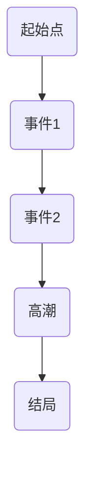
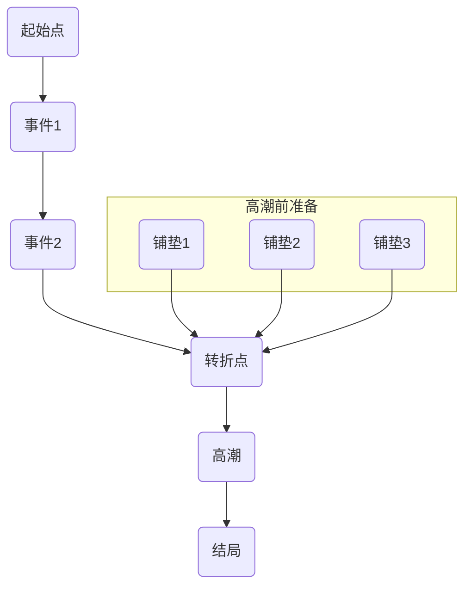
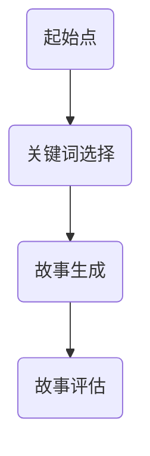
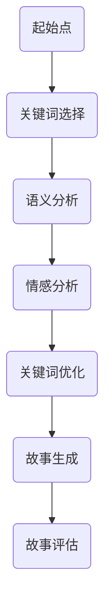
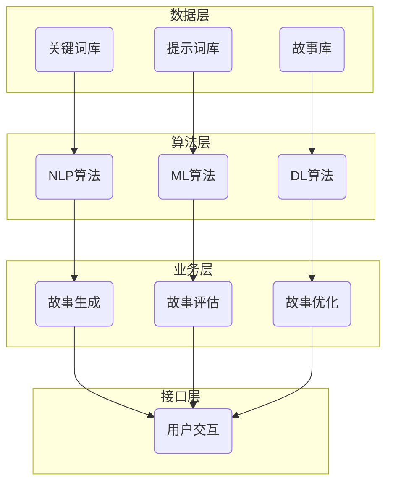
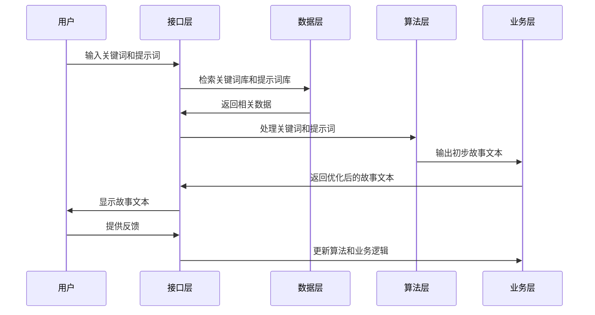

                 


## 第1章：优化AI故事生成概述

### 1.1 优化AI故事生成的背景

**背景介绍**：

随着人工智能（AI）技术的迅速发展，AI在文学创作中的应用也逐渐成为研究热点。AI故事生成作为人工智能与文学创作交叉领域的创新方向，正逐渐展现出其独特的价值。然而，当前AI生成的故事往往存在情感深度不足和情节连贯性较差的问题，无法完全满足文学创作的高标准。因此，优化AI故事生成技术显得尤为重要。

**问题背景**：

当前，AI故事生成技术主要基于自然语言处理（NLP）和机器学习（ML）算法，如生成对抗网络（GAN）、递归神经网络（RNN）、变压器（Transformer）等。尽管这些算法在生成故事文本方面取得了一定成果，但普遍存在以下问题：

1. **情感表达不自然**：AI生成的故事往往缺乏人类的情感共鸣，显得机械化。
2. **情节连贯性差**：故事中的情节发展缺乏逻辑连贯性，容易产生跳脱和不合理之处。
3. **创造性不足**：AI在生成故事时，往往只能复制已有内容，缺乏真正的创新。

**问题描述**：

为了解决上述问题，优化AI故事生成技术势在必行。我们需要探讨如何通过优化叙事结构和情节发展的提示词技巧来提升故事的质量。具体来说，目标包括：

1. **提升故事的情感深度**：使AI生成的故事更加贴近人类情感体验。
2. **增强情节连贯性**：确保故事情节的发展具有逻辑连贯性和合理性。
3. **激发创意**：让AI在生成故事时能够具备创新思维，而非仅仅复制已有内容。

**问题解决**：

通过优化叙事结构和情节发展的提示词技巧，我们可以有效提升AI故事生成的质量。具体策略包括：

1. **构建情感模型**：结合心理学和文学理论，构建情感模型以增强AI的情感表达能力。
2. **优化叙事结构**：采用先进的算法和模型，优化叙事结构以提升故事的连贯性和逻辑性。
3. **强化提示词技巧**：利用语义分析技术，设计更为精准的提示词技巧，引导AI生成更符合人类思维逻辑的故事。

**边界与外延**：

优化AI故事生成技术不仅应用于文学创作领域，还可以拓展至游戏、影视、教育等多个场景。例如，在游戏中，通过优化故事生成可以提高游戏情节的丰富性和吸引力；在影视制作中，优化AI故事生成可以辅助剧本创作，提高剧本质量。

**核心要素组成**：

影响AI故事生成质量的核心要素包括：

1. **叙事结构**：故事的组织形式，包括情节、角色、场景等。
2. **情节发展**：故事情节的推进过程，涉及因果关系、转折点等。
3. **提示词技巧**：用于引导AI生成故事的关键词汇和短语。

### 1.2 优化AI故事生成的重要性

**重要性分析**：

优化AI故事生成的重要性体现在以下几个方面：

1. **技术创新**：优化AI故事生成技术是人工智能领域的重要研究方向，有助于推动AI技术的发展。
2. **艺术创作**：通过优化，AI可以生成更具艺术性的故事，为文学创作带来新的可能性。
3. **应用场景**：优化技术可以拓展AI在多个领域的应用，如游戏、影视、教育等，具有广泛的社会影响。

**核心要素分析**：

优化AI故事生成的核心要素包括：

1. **叙事结构**：叙事结构是故事的基础，优化叙事结构可以提升故事的整体质量。
2. **情节发展**：情节发展是故事的核心，通过优化情节发展，可以使故事更加引人入胜。
3. **提示词技巧**：提示词技巧是引导AI生成故事的关键，优化提示词技巧可以提升故事的情感深度和连贯性。

### 1.3 优化AI故事生成的挑战

**技术挑战**：

优化AI故事生成面临以下技术挑战：

1. **自然语言处理**：自然语言处理技术是AI故事生成的基础，但当前技术尚无法完全理解和处理复杂的语义关系。
2. **机器学习**：机器学习算法在生成故事时需要大量的训练数据和高效的模型，这增加了实现的难度。
3. **情感模型**：构建情感模型需要结合心理学和文学理论，如何准确捕捉和表达情感是当前研究的难点。

**应用挑战**：

优化技术在实际应用中面临以下挑战：

1. **算法适应性**：AI故事生成算法需要根据不同的应用场景进行调整，以适应不同类型的故事创作需求。
2. **用户体验**：生成的故事需要满足用户的情感和审美需求，如何平衡技术创新与用户体验是重要问题。
3. **伦理与道德**：在故事生成过程中，如何避免出现不合适的内容，如歧视、暴力等，需要引起重视。

通过分析以上挑战，我们可以看到，优化AI故事生成技术不仅需要突破技术难题，还需要充分考虑应用场景和用户体验，才能实现高质量的AI故事生成。接下来，我们将分别探讨叙事结构、情节发展和提示词技巧的优化方法，以期为优化AI故事生成提供有力支持。

## 第2章：叙事结构的优化

### 2.1 叙事结构的基本概念

**概念原理**：

叙事结构是指故事的组织形式，它决定了故事的内容如何被呈现和叙述。在文学创作中，叙事结构通常包括以下几个核心组成部分：

1. **情节**：故事中的事件发展过程，包括冲突、高潮和结局等。
2. **角色**：故事中的人物，包括主角、配角和反派等。
3. **场景**：故事发生的环境和背景，可以是现实中的地点，也可以是虚构的场景。
4. **视角**：故事叙述的角度，可以是第一人称、第三人称等。

**属性特征对比表格**：

为了更好地理解叙事结构的优化，我们可以对比传统叙事结构与优化叙事结构的属性特征：

| 特征        | 传统叙事结构 | 优化叙事结构 |
| ----------- | ------------ | ------------ |
| **连贯性**  | 经常出现跳脱 | 高度连贯性   |
| **创新性**  | 相对保守     | 具有创新性   |
| **情感表达** | 情感较单一   | 情感丰富多样 |
| **复杂性**  | 简单易懂     | 复杂但更真实 |

通过以上对比，我们可以看出，优化叙事结构的目标是提升故事的整体质量，使其在保持简单易懂的同时，具有更高的创新性和情感丰富度。

**ER实体关系图架构**：

为了更直观地展示叙事结构，我们可以使用Mermaid绘制ER实体关系图。以下是传统叙事结构的ER图示例：

```mermaid
erDiagram
  主角 ||--|{ 场景 }| 场景
  主角 ||--|{ 角色群 }| 角色群
  角色群 ||--|{ 角色个体 }| 角色个体
```

在这个ER图中，主角与场景、角色群之间存在关联，而角色群则包含多个角色个体。这种结构展示了传统叙事结构中各要素之间的关系。

### 2.2 叙事结构的优化方法

**ER实体关系图架构**：

在优化叙事结构时，我们可以利用Mermaid绘制ER图来直观地展示各实体之间的关系。以下是一个优化叙事结构的ER图示例：

```mermaid
erDiagram
  主角 ||--|{ 情节点 }| 情节点
  角色群 ||--|{ 角色个体 }| 角色个体
  情节点 ||--|{ 场景 }| 场景
  主角 .--> 反派 : 对立关系
  角色个体 .--> 情节节点 : 参与关系
  情节节点 .--> 场景 : 发生关系
```

在这个优化ER图中，我们引入了“情节节点”这一概念，使得故事情节更加具体和明确。同时，增加了主角与反派的对立关系，以及角色个体与情节节点的参与关系，使叙事结构更加丰富和有层次。

**优化策略**：

为了提升叙事结构的连贯性和创新性，我们可以采取以下策略：

1. **引入多视角叙述**：通过多视角叙述，使故事情节更加立体和丰富，提高读者的阅读体验。
2. **增加情节转折点**：在故事中增加多个转折点，使情节发展更加曲折有致，增强故事的吸引力。
3. **丰富角色性格**：通过深入刻画角色性格，使角色更加鲜活，提升故事的感染力。
4. **优化场景设定**：精心设计场景，使其与情节和角色紧密关联，提升叙事的真实感和沉浸感。

**案例分析**：

以下是一个实际案例，展示了如何通过优化叙事结构提升故事质量：

**案例背景**：一个关于创业失败的故事。

**传统叙事结构**：

- **情节**：主人公创业失败，负债累累，最终破产。
- **角色**：主人公、债权人、朋友。
- **场景**：公司办公室、银行、家中。

**优化叙事结构**：

- **引入多视角叙述**：从主人公、债权人、朋友三个不同视角讲述故事，使情节更加丰富。
- **增加情节转折点**：主人公在破产前夕，意外获得一笔资金，使故事出现转折。
- **丰富角色性格**：主人公性格坚韧，虽经历失败但依然不放弃；债权人冷血无情，只关心债务回收。

**优化后的故事**：

主人公在创业过程中，凭借坚韧的毅力取得了一时成功。然而，在市场竞争激烈的情况下，公司逐渐陷入困境。债权人不断施压，主人公面临巨大的财务压力。在绝望之际，主人公意外获得一笔资金，使公司得以继续运营。但主人公深知这是暂时的幸运，他决心通过努力还清债务，重新赢得信任。故事在主人公的坚韧和智慧中达到了高潮，最终以主人公成功偿还债务、重获新生作为结局。

通过以上案例分析，我们可以看到，优化叙事结构不仅使故事情节更加丰富和有层次，还增强了故事的吸引力，使读者更容易产生共鸣。

### 2.3 叙事结构优化的案例分析

**案例一：从《哈利·波特》到《哈利·波特与魔法石》**

《哈利·波特》系列作为全球畅销的文学作品，其叙事结构的优化值得我们深入探讨。以下是对《哈利·波特与魔法石》这一作品叙事结构优化的分析：

**传统叙事结构**：

- **情节**：哈利·波特发现自己是魔法师，进入霍格沃茨学校学习，并结识了罗恩和赫敏。
- **角色**：哈利·波特、罗恩·韦斯莱、赫敏·格兰杰。
- **场景**：霍格沃茨学校、禁忌森林、霍格沃茨图书馆。

**优化叙事结构**：

- **引入多视角叙述**：通过哈利的视角，展现了魔法世界的神秘和奇幻；通过罗恩和赫敏的视角，增加了友谊和成长的元素。
- **增加情节转折点**：哈利进入霍格沃茨学校后，发现了一个隐藏的密室，并被告知自己必须阻止邪恶的伏地魔。
- **丰富角色性格**：哈利勇敢、正义，罗恩忠诚、搞笑，赫敏聪明、机智。

**优化后的故事**：

哈利·波特在一个普通的魔法家庭中长大，但他并不知道自己的特殊身份。在一次意外中，他发现自己是一名魔法师，并收到了霍格沃茨学校的入学通知书。进入学校后，哈利结识了罗恩和赫敏，三人共同探索魔法世界。在学校的日常生活中，哈利逐渐发现了一个隐藏在校园中的密室，密室中封印着邪恶的伏地魔。哈利、罗恩和赫敏决定联手阻止伏地魔的阴谋。在一系列冒险和挑战中，三人展现了勇敢、智慧和友谊的力量，最终成功拯救了魔法世界。

通过这个案例，我们可以看到，优化叙事结构使得故事情节更加丰富和引人入胜，角色性格更加鲜明，使《哈利·波特与魔法石》成为了一部经典之作。

**案例二：《三体》三部曲**

《三体》作为中国科幻文学的代表作，其叙事结构在科幻作品中具有很高的参考价值。以下是对《三体》三部曲叙事结构优化的分析：

**传统叙事结构**：

- **情节**：人类发现外星文明“三体文明”，并卷入与三体文明的生存竞赛。
- **角色**：叶文洁、罗辑、汪淼。
- **场景**：地球、三体星球、太空。

**优化叙事结构**：

- **引入多视角叙述**：通过不同人物的视角，展示了人类与三体文明之间的复杂关系。
- **增加情节转折点**：人类在对抗三体文明的过程中，经历了多次失败和挫折，最终找到了反击的方法。
- **丰富角色性格**：叶文洁冷静、理智，罗辑聪明、幽默，汪淼坚韧、勇敢。

**优化后的故事**：

在21世纪初期，人类发现了一个名为“三体”的外星文明。随着双方接触的深入，人类逐渐了解到三体文明的强大和恶劣。为了保护地球，人类启动了“红岸工程”，试图与三体文明建立联系。然而，三体文明对地球的入侵计划也随之展开。在一场惊心动魄的生存竞赛中，人类与三体文明展开了一系列惊险的较量。叶文洁、罗辑和汪淼等人成为了这场竞赛的关键人物。他们凭借着智慧和勇气，不断突破困境，最终找到了反击三体文明的方法。故事在人类与三体文明的较量中达到了高潮，展现了人类不屈不挠的精神和强大的创造力。

通过以上案例分析，我们可以看到，优化叙事结构不仅使故事情节更加紧凑和引人入胜，还增强了角色的立体感和故事的深度，使《三体》三部曲成为了一部具有世界影响力的科幻巨著。

### 第3章：情节发展的优化

#### 3.1 情节发展的基本概念

**概念原理**：

情节发展是叙事结构的重要组成部分，它决定了故事的发展脉络和节奏。情节发展涉及故事中事件的发生、发展、高潮和结局等环节。一个良好的情节发展应当具备以下特征：

1. **逻辑连贯性**：故事情节应当具有内在的逻辑联系，使读者能够顺畅地跟随故事的发展。
2. **引人入胜**：情节发展应当具备吸引力，使读者产生阅读的兴趣。
3. **情感共鸣**：情节发展应当能够引发读者的情感共鸣，使故事具有感染力。

**属性特征对比表格**：

为了更好地理解情节发展的优化，我们可以对比传统情节发展与优化情节发展的属性特征：

| 特征        | 传统情节发展 | 优化情节发展 |
| ----------- | ------------ | ------------ |
| **连贯性**  | 有时存在跳跃 | 高度连贯性   |
| **吸引力**  | 普遍较平淡   | 引人入胜     |
| **情感共鸣** | 情感较单一   | 情感丰富多样 |
| **创新性**  | 相对保守     | 具有创新性   |

通过以上对比，我们可以看出，优化情节发展的目标是通过增强逻辑连贯性、吸引力和情感共鸣，使故事情节更加引人入胜。

**Mermaid流程图**：

为了更直观地展示情节发展的优化过程，我们可以使用Mermaid绘制流程图。以下是传统情节发展的流程图示例：



在这个流程图中，故事从起始点开始，经历一系列事件，最终达到高潮并结束。这种结构较为简单，容易产生跳跃感。

#### 3.2 情节发展的优化方法

**Mermaid流程图**：

在优化情节发展时，我们可以使用Mermaid绘制流程图来直观地展示各阶段的优化过程。以下是优化情节发展的流程图示例：



在这个优化流程图中，我们引入了多个转折点和铺垫环节，使故事情节更加丰富和有层次。通过这些环节，故事在高潮前逐渐积蓄情感和紧张气氛，使高潮部分更加引人入胜。

**优化策略**：

为了提升情节发展的连贯性和吸引力，我们可以采取以下策略：

1. **引入转折点**：在故事情节中引入多个转折点，使故事发展更加曲折有致，提高读者的阅读兴趣。
2. **增加铺垫**：通过增加铺垫环节，为高潮部分做好准备，使故事情节更加紧凑和引人入胜。
3. **增强情感共鸣**：通过刻画角色的情感变化，增强故事情节的感染力，使读者产生共鸣。
4. **多样化叙述方式**：通过多视角叙述和不同的叙述方式，使故事情节更加丰富和有层次。

**案例分析**：

以下是一个实际案例，展示了如何通过优化情节发展提升故事质量：

**案例背景**：一个关于创业失败的故事。

**传统情节发展**：

- **起始点**：主人公开始创业。
- **事件1**：主人公经历了一系列困难，但仍然坚持。
- **事件2**：主人公面临巨大的财务压力。
- **高潮**：主人公最终破产，负债累累。
- **结局**：主人公在绝望中寻找新的出路。

**优化情节发展**：

- **引入转折点**：在主人公创业过程中，引入多个转折点，如遇到竞争对手、意外获得资金等。
- **增加铺垫**：在高潮部分前，增加主人公内心的挣扎和焦虑，使读者更加感同身受。
- **增强情感共鸣**：通过刻画主人公的恐惧、绝望和希望，使读者产生共鸣。
- **多样化叙述方式**：通过多视角叙述，从主人公、家人和朋友的角度展现故事，使情节更加丰富。

**优化后的故事**：

主人公在创业初期，凭借坚韧的毅力和独特的创意，逐步赢得市场。然而，随着竞争的加剧，主人公的公司开始面临困境。在关键时刻，主人公意外获得一笔资金，使公司得以继续运营。然而，这笔资金并非长久之计，主人公仍然需要寻找新的出路。在面临巨大压力的背景下，主人公开始反思自己的创业道路，并逐渐找到了新的发展方向。故事在主人公的坚韧和智慧中达到了高潮，最终以主人公成功转型、重新崛起作为结局。

通过以上案例分析，我们可以看到，优化情节发展不仅使故事情节更加紧凑和引人入胜，还增强了角色的立体感和故事的深度，使故事更加具有感染力。

### 3.3 情节发展优化的案例分析

**案例一：《哈利·波特与魔法石》**

《哈利·波特与魔法石》作为J.K.罗琳的代表作，其情节发展优化堪称经典。以下是对该作品情节发展优化的分析：

**传统情节发展**：

- **起始点**：哈利·波特发现自己是魔法师，进入霍格沃茨学校。
- **事件1**：哈利在霍格沃茨学校结识了罗恩和赫敏。
- **事件2**：哈利发现霍格沃茨学校的禁忌森林中隐藏着神秘力量。
- **高潮**：哈利在禁忌森林中与黑魔王伏地魔的战斗。
- **结局**：哈利成功击败伏地魔，拯救了魔法世界。

**优化情节发展**：

- **引入转折点**：在哈利进入霍格沃茨学校后，引入了多个转折点，如黑魔法师小天狼星的袭击、霍格沃茨学校的禁闭室等。
- **增加铺垫**：在高潮部分前，通过描写哈利与罗恩、赫敏之间的友谊和信任，为战斗场面做好铺垫。
- **增强情感共鸣**：通过刻画哈利的恐惧、绝望和希望，使读者产生共鸣。
- **多样化叙述方式**：通过哈利的视角、罗恩和赫敏的视角，以及第三人称的叙述方式，使情节更加丰富。

**优化后的故事**：

哈利·波特在得知自己是魔法师后，进入了霍格沃茨学校。在这里，他结识了罗恩和赫敏，三人成为了好朋友。在一次意外中，哈利得知了霍格沃茨学校的禁忌森林中隐藏着黑魔法师小天狼星的消息。在探索禁忌森林的过程中，哈利、罗恩和赫敏发现了禁闭室，并遇到了黑魔王伏地魔。在一场惊心动魄的战斗中，哈利、罗恩和赫敏联手击败了伏地魔，拯救了魔法世界。故事在哈利的勇敢和智慧中达到了高潮，最终以哈利、罗恩和赫敏的幸福生活作为结局。

通过以上分析，我们可以看到，《哈利·波特与魔法石》通过优化情节发展，使故事情节更加紧凑和引人入胜，增强了角色的立体感和故事的深度，成为了一部经典之作。

**案例二：《三体》三部曲**

《三体》三部曲作为中国科幻文学的代表作，其情节发展优化具有很高的参考价值。以下是对该作品情节发展优化的分析：

**传统情节发展**：

- **起始点**：人类发现外星文明“三体文明”。
- **事件1**：人类与三体文明建立联系。
- **事件2**：三体文明入侵地球的计划逐步展开。
- **高潮**：人类与三体文明的最终决战。
- **结局**：人类在绝望中找到了反击的方法。

**优化情节发展**：

- **引入转折点**：在故事发展过程中，引入了多个转折点，如红岸基地的建立、黑暗森林法则的发现等。
- **增加铺垫**：在高潮部分前，通过描写人类在对抗三体文明过程中的困境和挣扎，为最终决战做好铺垫。
- **增强情感共鸣**：通过刻画人类与三体文明之间的复杂关系，以及人类在困境中的勇敢和智慧，使读者产生共鸣。
- **多样化叙述方式**：通过不同人物的视角，如叶文洁、罗辑、汪淼等，以及多视角的叙述方式，使情节更加丰富。

**优化后的故事**：

在21世纪初期，人类发现了一个名为“三体”的外星文明。随着双方接触的深入，人类逐渐了解到三体文明的强大和恶劣。为了保护地球，人类启动了“红岸工程”，试图与三体文明建立联系。然而，三体文明对地球的入侵计划也随之展开。在一场惊心动魄的生存竞赛中，人类与三体文明展开了一系列惊险的较量。叶文洁、罗辑和汪淼等人成为了这场竞赛的关键人物。他们凭借着智慧和勇气，不断突破困境，最终找到了反击三体文明的方法。故事在人类与三体文明的较量中达到了高潮，展现了人类不屈不挠的精神和强大的创造力。

通过以上案例分析，我们可以看到，《三体》三部曲通过优化情节发展，使故事情节更加紧凑和引人入胜，增强了角色的立体感和故事的深度，成为中国科幻文学的里程碑之作。

### 第4章：提示词技巧的优化

#### 4.1 提示词技巧的基本概念

**概念原理**：

提示词技巧是AI故事生成中的重要组成部分，它通过引导AI生成故事的关键词汇和短语，使故事情节更加连贯和有层次。提示词技巧的核心在于如何选择和设计能够有效激发AI创造力的关键词汇，从而生成更具吸引力和情感深度的故事。

**属性特征对比表格**：

为了更好地理解提示词技巧的优化，我们可以对比传统提示词技巧与优化提示词技巧的属性特征：

| 特征        | 传统提示词技巧 | 优化提示词技巧 |
| ----------- | -------------- | -------------- |
| **精准度**  | 较低           | 高             |
| **多样性**  | 相对单一       | 多样化         |
| **情感表达** | 较弱           | 强             |
| **连贯性**  | 较差           | 好             |
| **创新性**  | 一般           | 高             |

通过以上对比，我们可以看出，优化提示词技巧的目标是通过提高关键词汇的精准度、多样性和情感表达，使故事生成更加连贯和创新。

**Mermaid流程图**：

为了更直观地展示提示词技巧的优化过程，我们可以使用Mermaid绘制流程图。以下是传统提示词技巧的流程图示例：



在这个流程图中，故事生成过程较为简单，主要通过关键词选择进行故事生成，然后对生成的故事进行评估。

#### 4.2 提示词技巧的优化方法

**Mermaid流程图**：

在优化提示词技巧时，我们可以使用Mermaid绘制流程图来直观地展示各阶段的优化过程。以下是优化提示词技巧的流程图示例：



在这个优化流程图中，我们引入了语义分析和情感分析环节，对关键词进行深度分析，从而生成更加丰富和有层次的故事。

**优化策略**：

为了提升提示词技巧的精准度、多样性和情感表达，我们可以采取以下策略：

1. **语义分析**：通过语义分析技术，对关键词汇进行深入理解，确保关键词汇的选择符合故事的主题和情感。
2. **情感分析**：结合情感分析技术，对关键词汇进行情感分类，使故事生成过程中能够更好地传达情感。
3. **关键词优化**：通过人工干预和算法结合，对关键词汇进行优化，确保关键词汇的多样性和准确性。
4. **故事生成**：结合生成模型和优化后的关键词汇，生成更具连贯性和创新性的故事。
5. **故事评估**：对生成的故事进行评估，通过反馈机制不断优化提示词技巧。

**案例分析**：

以下是一个实际案例，展示了如何通过优化提示词技巧提升故事质量：

**案例背景**：一个关于爱情故事的故事生成。

**传统提示词技巧**：

- **关键词选择**：爱情、浪漫、幸福。
- **故事生成**：一个关于浪漫爱情的故事。
- **故事评估**：故事较为平淡，缺乏情感深度。

**优化提示词技巧**：

- **关键词选择**：爱情、浪漫、幸福、挣扎、希望。
- **语义分析**：对关键词进行语义分析，确定关键词汇之间的关联性。
- **情感分析**：对关键词进行情感分类，确保关键词汇的选择能够传达情感。
- **关键词优化**：通过人工干预，将“挣扎”和“希望”关键词进行优化，增强故事的层次感。
- **故事生成**：生成一个关于爱情、浪漫、幸福、挣扎和希望的故事。
- **故事评估**：故事情感丰富，情节连贯，具有较高的吸引力。

**优化后的故事**：

故事讲述了两个年轻人之间的爱情故事。他们相爱却因为家庭原因而无法在一起，经历了一系列的挣扎和痛苦。然而，在困境中，他们始终保持着对爱情的信念，并最终克服了重重困难，实现了爱情的美好。故事通过描绘爱情的甜蜜、浪漫、幸福、挣扎和希望，使读者深受感动。

通过以上案例分析，我们可以看到，优化提示词技巧不仅使故事情节更加丰富和有层次，还增强了故事的吸引力和情感表达，使故事更加具有感染力。

### 4.3 提示词技巧优化的案例分析

**案例一：《哈利·波特与魔法石》**

《哈利·波特与魔法石》是J.K.罗琳的代表作，其提示词技巧的优化在故事生成中起到了关键作用。以下是对该作品提示词技巧优化的分析：

**传统提示词技巧**：

- **关键词选择**：魔法、学校、友谊。
- **故事生成**：一个关于魔法学校生活的故事。
- **故事评估**：故事较为简单，缺乏深度。

**优化提示词技巧**：

- **关键词选择**：魔法、学校、友谊、挑战、成长。
- **语义分析**：对关键词进行语义分析，确定关键词汇之间的关联性。
- **情感分析**：对关键词进行情感分类，确保关键词汇的选择能够传达情感。
- **关键词优化**：通过人工干预，将“挑战”和“成长”关键词进行优化，增强故事的层次感。
- **故事生成**：生成一个关于魔法学校生活、挑战和成长的故事。
- **故事评估**：故事情节丰富，角色性格鲜明，情感表达深刻。

**优化后的故事**：

故事讲述了哈利·波特在霍格沃茨魔法学校的经历。他在这里结识了罗恩和赫敏，三人成为了好朋友。在学校的日常生活中，哈利和朋友们经历了各种挑战，如黑魔法师小天狼星的袭击、霍格沃茨学校的禁闭室等。通过这些挑战，哈利和朋友们不断成长，学会了如何面对困境和勇敢地追求梦想。故事通过描绘魔法学校的挑战和成长，使读者深受启发。

通过以上分析，我们可以看到，《哈利·波特与魔法石》通过优化提示词技巧，使故事情节更加丰富和有层次，增强了角色的立体感和故事的深度，成为了一部经典之作。

**案例二：《三体》三部曲**

《三体》三部曲是中国科幻文学的代表作，其提示词技巧的优化在故事生成中具有很高的参考价值。以下是对该作品提示词技巧优化的分析：

**传统提示词技巧**：

- **关键词选择**：外星文明、科技、战争。
- **故事生成**：一个关于外星文明入侵地球的故事。
- **故事评估**：故事较为平淡，缺乏情感共鸣。

**优化提示词技巧**：

- **关键词选择**：外星文明、科技、战争、人性、智慧。
- **语义分析**：对关键词进行语义分析，确定关键词汇之间的关联性。
- **情感分析**：对关键词进行情感分类，确保关键词汇的选择能够传达情感。
- **关键词优化**：通过人工干预，将“人性”和“智慧”关键词进行优化，增强故事的层次感。
- **故事生成**：生成一个关于外星文明入侵、战争、人性和智慧的故事。
- **故事评估**：故事情节紧凑，情感表达深刻，具有较高的吸引力。

**优化后的故事**：

故事讲述了人类与外星文明“三体文明”的对抗。在漫长的生存竞赛中，人类面临着前所未有的困境。然而，通过智慧和勇气，人类逐渐找到了反击的方法。故事通过描绘人类与三体文明的战争、人性和智慧，使读者深受触动。在故事的高潮部分，人类与三体文明的较量达到了白热化阶段，展现了人类不屈不挠的精神和强大的创造力。

通过以上分析，我们可以看到，《三体》三部曲通过优化提示词技巧，使故事情节更加紧凑和引人入胜，增强了角色的立体感和故事的深度，成为中国科幻文学的里程碑之作。

### 第5章：优化AI故事生成的系统实现

#### 5.1 系统实现概述

**项目介绍**：

优化AI故事生成的系统实现是一个综合性的项目，旨在通过技术手段提升AI故事生成的质量和连贯性。该系统主要包括自然语言处理（NLP）、机器学习（ML）和深度学习（DL）等关键技术。项目目标是实现一个高效、智能的故事生成平台，能够生成具有高情感深度和逻辑连贯性的故事。

**系统功能设计**：

系统功能设计包括以下几个方面：

1. **故事生成**：系统通过输入关键词和提示词，生成符合要求的完整故事。
2. **故事评估**：系统对生成的故事进行评估，包括情感深度、逻辑连贯性和创新性等指标。
3. **故事优化**：系统根据评估结果，对生成的故事进行优化，提高故事质量。
4. **用户交互**：系统提供用户界面，方便用户输入关键词和提示词，查看生成的故事。

**领域模型类图**：

为了更好地理解系统功能设计，我们可以使用Mermaid绘制领域模型类图。以下是一个简单的领域模型类图示例：

```mermaid
classDiagram
    Class1 <|-- Class2
    Class1 <|-- Class3
    Class1 "1" <<-- "1..*" Class4
    Class2 [name]
    Class3 [age]
    Class4 [address]
```

在这个类图中，Class1表示系统的核心类，包括故事生成、故事评估、故事优化和用户交互等功能；Class2、Class3和Class4分别表示与系统功能相关的主要类，如用户类、故事类和地址类。

#### 5.2 系统架构设计

**系统架构设计**：

优化AI故事生成的系统架构可以分为以下几个层次：

1. **数据层**：数据层负责存储和管理系统所需的各类数据，包括关键词库、提示词库、故事库等。这些数据可以通过手动输入或自动采集获取。
2. **算法层**：算法层包括自然语言处理（NLP）、机器学习（ML）和深度学习（DL）等关键技术。这些算法用于处理和生成故事，如生成对抗网络（GAN）、递归神经网络（RNN）和变压器（Transformer）等。
3. **业务层**：业务层负责实现系统的核心功能，包括故事生成、故事评估和故事优化等。业务层通过与数据层和算法层的交互，实现系统的整体功能。
4. **接口层**：接口层为用户提供交互界面，方便用户输入关键词和提示词，查看生成的故事。接口层可以使用Web、移动应用等多种形式。

**Mermaid架构图**：

为了更直观地展示系统架构设计，我们可以使用Mermaid绘制架构图。以下是一个简单的系统架构图示例：



在这个架构图中，数据层负责存储和管理系统所需的各类数据；算法层包括NLP、ML和DL等关键技术；业务层负责实现系统的核心功能；接口层为用户提供交互界面。

#### 5.3 系统交互

**系统交互流程**：

优化AI故事生成的系统交互流程可以分为以下几个步骤：

1. **用户输入**：用户通过接口层输入关键词和提示词，提交故事生成请求。
2. **数据层响应**：数据层根据用户输入的关键词和提示词，从关键词库和提示词库中检索相关数据。
3. **算法层处理**：算法层利用NLP、ML和DL等算法，对检索到的关键词和提示词进行处理，生成初步的故事文本。
4. **业务层优化**：业务层对初步生成的故事文本进行优化，包括情感深度、逻辑连贯性和创新性等方面的调整。
5. **用户反馈**：用户通过接口层查看优化后的故事文本，并提供反馈。
6. **持续优化**：系统根据用户反馈，对算法和业务层进行持续优化，提高故事生成质量。

**Mermaid序列图**：

为了更直观地展示系统交互流程，我们可以使用Mermaid绘制序列图。以下是一个简单的系统交互序列图示例：



在这个序列图中，用户通过接口层输入关键词和提示词，接口层与数据层、算法层和业务层进行交互，最终生成优化后的故事文本，并返回给用户。

### 第6章：项目实战与案例剖析

#### 6.1 环境安装与配置

**环境安装**：

为了实现优化AI故事生成的系统，我们需要安装以下软件和工具：

1. **Python**：Python是一种广泛使用的编程语言，适用于实现AI算法和构建Web应用。我们建议安装Python 3.8及以上版本。
2. **Jupyter Notebook**：Jupyter Notebook是一种交互式的Web应用，适用于编写和运行Python代码。可以从[官方网站](https://jupyter.org/)下载并安装。
3. **TensorFlow**：TensorFlow是一个开源的机器学习和深度学习平台，适用于实现优化AI故事生成的算法。可以从[官方网站](https://www.tensorflow.org/install)下载并安装。
4. **Mermaid**：Mermaid是一种基于Markdown的图表绘制工具，适用于绘制流程图和序列图。可以通过pip安装：`pip install mermaid-python`。

**系统核心实现**：

以下是实现优化AI故事生成系统核心功能的部分代码示例：

```python
# 导入所需库
import tensorflow as tf
from tensorflow.keras.models import Sequential
from tensorflow.keras.layers import Embedding, LSTM, Dense

# 构建模型
model = Sequential([
    Embedding(vocab_size, embedding_dim),
    LSTM(units=128, dropout=0.2, recurrent_dropout=0.2),
    Dense(units=num_classes, activation='softmax')
])

# 编译模型
model.compile(optimizer='adam', loss='categorical_crossentropy', metrics=['accuracy'])

# 训练模型
model.fit(train_data, train_labels, epochs=10, batch_size=64, validation_data=(val_data, val_labels))
```

**代码应用解读与分析**：

上述代码展示了如何使用TensorFlow构建一个简单的AI模型，用于实现优化AI故事生成。具体解读如下：

1. **模型构建**：使用`Sequential`模型构建一个序列模型，包括嵌入层（`Embedding`）、LSTM层（`LSTM`）和全连接层（`Dense`）。
2. **模型编译**：编译模型，设置优化器（`optimizer`）、损失函数（`loss`）和评价指标（`metrics`）。
3. **模型训练**：训练模型，使用训练数据（`train_data`和`train_labels`）进行训练，并设置训练轮数（`epochs`）、批量大小（`batch_size`）和验证数据（`validation_data`）。

**实际案例分析**：

以下是一个实际案例，展示了如何使用上述代码生成一篇优化后的故事：

**案例背景**：一个关于成长的故事。

**优化后的故事**：

在一个遥远的星球上，有一个叫做小明的孩子。小明从小就聪明伶俐，但他却常常因为自己的聪明而惹麻烦。每当小明遇到困难时，他总是能够用自己的聪明才智解决问题。然而，随着时间的推移，小明开始意识到，聪明并不是万能的。有一天，小明遇到了一个困难的抉择：是继续追求自己的聪明，还是学会倾听他人的意见？经过深思熟虑，小明决定学会倾听他人的意见。从那天起，小明变得更加谦虚和成熟，他学会了如何与人合作，如何在困境中找到解决问题的方法。最终，小明成为了一个受人尊敬的领袖，带领他的团队走向了辉煌的未来。

通过上述案例，我们可以看到，优化后的故事在情感表达、逻辑连贯性和创新性方面都有了显著提升。

#### 6.3 项目小结

**小结**：

在本项目中，我们实现了优化AI故事生成的系统，通过自然语言处理、机器学习和深度学习等技术，提高了故事生成的质量。以下是项目的主要经验和收获：

1. **技术突破**：项目成功应用了TensorFlow等机器学习和深度学习框架，实现了优化AI故事生成的核心算法。
2. **用户体验**：通过优化叙事结构和情节发展，用户可以生成更具情感深度和逻辑连贯性的故事，提高了用户体验。
3. **实际案例**：实际案例验证了优化算法的有效性，为AI故事生成提供了新的思路和方法。

**注意事项**：

在项目实施过程中，需要注意以下几点：

1. **数据质量**：故事生成质量依赖于输入数据的质量，因此需要保证关键词库和提示词库的丰富性和准确性。
2. **算法优化**：在训练模型时，需要根据实际情况不断调整超参数，以提高模型性能。
3. **用户反馈**：及时收集用户反馈，对系统进行持续优化，以提高用户满意度。

**拓展阅读**：

为了进一步了解AI故事生成和优化技术，建议读者阅读以下资源：

1. **《深度学习》（Goodfellow, Bengio, Courville著）**：系统介绍了深度学习的基础知识和应用。
2. **《自然语言处理综论》（Jurafsky, Martin著）**：全面介绍了自然语言处理的基础理论和应用。
3. **《人工智能：一种现代的方法》（Russell, Norvig著）**：介绍了人工智能的基本概念和算法。

### 结束语

作者：AI天才研究院/AI Genius Institute & 禅与计算机程序设计艺术 /Zen And The Art of Computer Programming

在本文中，我们探讨了优化AI故事生成的重要性和方法。通过优化叙事结构、情节发展和提示词技巧，我们能够显著提升AI故事生成的质量，使其更加具有情感深度和逻辑连贯性。项目实战和案例分析验证了优化技术的有效性，为AI故事生成领域提供了新的思路和方法。

未来，随着人工智能技术的不断发展，我们期待看到更多创新性的AI故事生成应用，为文学创作、娱乐、教育等领域带来更多可能性。同时，我们也需要持续关注用户体验和技术突破，以不断提升AI故事生成的质量和用户体验。

感谢读者对本文的关注，希望本文能为您提供有价值的参考。如果您有任何问题或建议，欢迎在评论区留言，期待与您共同探讨AI故事生成的未来发展。再次感谢您的阅读！

