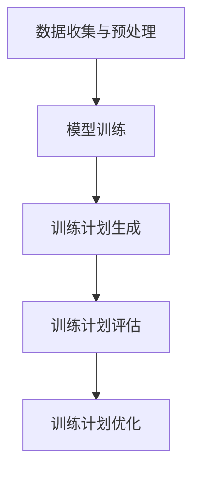
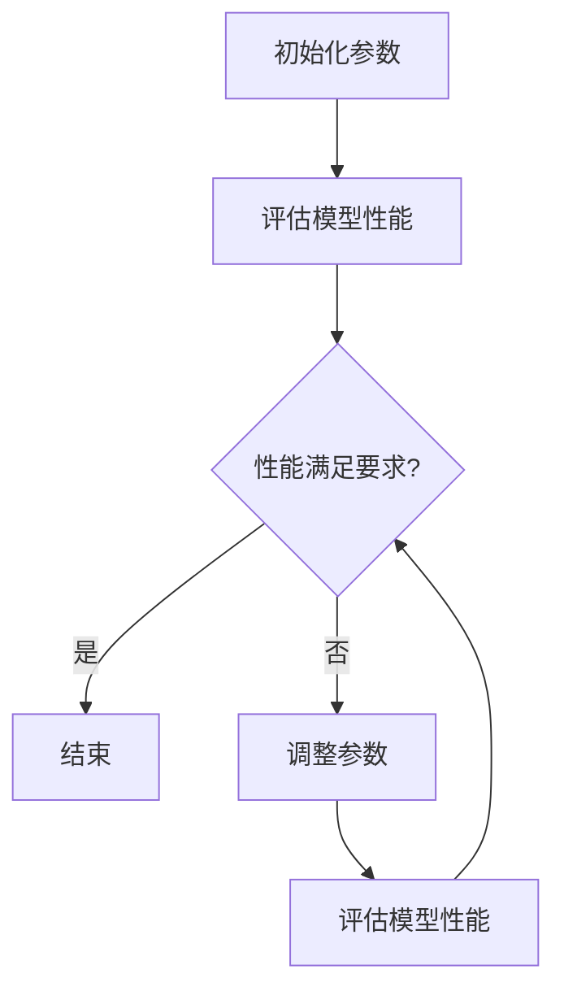

                 

### 《优化AI虚拟健身教练：个性化训练计划的提示词设计》

> 关键词：AI虚拟健身教练、个性化训练计划、提示词设计、机器学习、自然语言处理

> 摘要：本文将深入探讨AI虚拟健身教练在个性化训练计划中的关键作用，特别是在提示词设计方面的优化策略。通过分析AI技术的发展历程，揭示虚拟健身教练的兴起原因及其优势与挑战，本文将详细阐述个性化训练计划的概念、优势与挑战，最终提出一种基于机器学习和自然语言处理技术的提示词设计方法，以实现更高效、更精准的个性化训练计划。

## 第一部分：引言

### 第1章：AI虚拟健身教练概述

#### 1.1 人工智能与虚拟健身教练的兴起

##### 1.1.1 AI技术的快速进步

随着人工智能（AI）技术的迅猛发展，越来越多的领域开始利用AI技术提升效率和实现智能化。其中，健身领域成为AI技术的重要应用场景之一。AI虚拟健身教练，作为一种新兴的智能健身解决方案，正逐渐受到广泛关注。

##### 1.1.2 虚拟健身教练的兴起原因

虚拟健身教练的兴起原因主要包括以下几个方面：

1. **个性化需求**：随着人们对健康生活方式的追求，个性化的健身需求日益增长。虚拟健身教练可以通过个性化训练计划满足用户的特定需求。
2. **便捷性**：传统的健身教练通常需要在特定的时间和地点提供服务，而虚拟健身教练不受时间和地点的限制，用户可以随时随地进行健身训练。
3. **成本效益**：相比于传统的健身教练，虚拟健身教练的成本更低，更易于大规模推广。
4. **技术进步**：AI技术和大数据分析技术的进步为虚拟健身教练提供了强大的技术支持。

##### 1.1.3 AI虚拟健身教练的优势与挑战

**优势**：

1. **个性化**：虚拟健身教练可以根据用户的身体数据和个人偏好制定个性化的训练计划。
2. **高效性**：AI技术可以帮助虚拟健身教练快速处理大量数据，提供精准的健身指导。
3. **可扩展性**：虚拟健身教练可以同时服务于多个用户，具有很高的扩展性。

**挑战**：

1. **数据隐私**：虚拟健身教练需要收集用户的个人健康数据，数据隐私保护成为一大挑战。
2. **用户体验**：如何提升虚拟健身教练的用户体验，使其更加自然、真实，是当前的一个重要问题。
3. **技术成熟度**：虽然AI技术在不断进步，但在某些领域，如自然语言处理和机器人技术，仍需进一步成熟。

#### 1.2 个人化训练计划的重要性

##### 1.2.1 个性化训练计划的定义

个性化训练计划是指根据用户的个人特征（如年龄、体重、健身目标等）以及历史数据（如以往的健身记录、健康状况等），为用户量身定制的健身计划。

##### 1.2.2 个性化训练计划的优势

1. **提高训练效果**：个性化训练计划可以更好地满足用户的健身需求，提高训练效果。
2. **增强用户参与度**：个性化的训练计划可以提升用户的参与度和积极性。
3. **降低受伤风险**：通过个性化训练计划，可以降低因不适合的训练计划导致的受伤风险。

##### 1.2.3 个性化训练计划的挑战

1. **数据收集与处理**：需要收集和处理大量的用户数据，对数据的质量和准确性有较高要求。
2. **算法复杂度**：个性化训练计划的生成和优化算法相对复杂，需要较高的技术门槛。
3. **用户体验**：如何确保个性化训练计划的用户体验，使其既高效又易于使用，是当前的一个重要挑战。

#### 1.3 本书目标与结构

##### 1.3.1 本书的目标

本书旨在探讨如何通过AI技术和自然语言处理技术，优化AI虚拟健身教练的个性化训练计划，提高其精准度和用户体验。

##### 1.3.2 本书章节结构

本书将分为以下几个部分：

1. **AI虚拟健身教练概述**：介绍AI虚拟健身教练的背景、优势与挑战。
2. **AI虚拟健身教练的核心技术**：详细阐述AI虚拟健身教练所依赖的关键技术，如数据收集与处理、机器学习算法、自然语言处理等。
3. **个性化训练计划的实现**：介绍个性化训练计划的实现方法，包括用户数据收集与处理、训练计划生成算法、评估与优化策略等。
4. **实际案例分析与实战**：通过实际案例，展示个性化训练计划的实现过程和效果。
5. **总结与展望**：总结本书的主要贡献，并对个性化训练计划的未来发展进行展望。

### 第2章：AI虚拟健身教练的核心技术

#### 2.1 数据收集与处理

##### 2.1.1 数据来源

AI虚拟健身教练需要收集多种类型的数据，包括用户身体数据、健身记录、用户偏好等。这些数据可以从多个渠道获取，如健身设备、用户填写的信息表、社交媒体等。

##### 2.1.2 数据预处理

数据预处理是数据收集与处理的重要环节，主要包括数据清洗、数据转换和数据归一化。数据清洗的目的是去除数据中的噪声和异常值，保证数据质量。数据转换和归一化则是为了将不同类型的数据统一到一个标准格式，便于后续处理。

##### 2.1.3 数据可视化

数据可视化是一种通过图形化方式展示数据的方法，可以帮助用户更好地理解数据。在AI虚拟健身教练中，数据可视化可以用来展示用户的身体数据、健身记录、训练计划等。

#### 2.2 机器学习算法

##### 2.2.1 监督学习

监督学习是一种机器学习算法，它需要根据已有的输入和输出数据，通过学习过程建立模型，从而预测新的输入数据。在AI虚拟健身教练中，监督学习算法可以用于生成个性化训练计划，根据用户的身体数据和健身目标，预测最合适的训练方案。

##### 2.2.2 无监督学习

无监督学习是一种不需要标签的机器学习算法，它通过对数据的学习，自动发现数据中的模式和结构。在AI虚拟健身教练中，无监督学习可以用于用户数据的聚类分析，识别不同的用户群体，为个性化训练计划提供参考。

##### 2.2.3 强化学习

强化学习是一种通过试错方式学习的机器学习算法，它通过奖励机制来指导学习过程。在AI虚拟健身教练中，强化学习可以用于训练计划优化，通过不断调整训练方案，提高训练效果。

#### 2.3 自然语言处理

##### 2.3.1 语言模型

语言模型是一种基于统计的文本生成模型，它可以用来预测下一个词或句子。在AI虚拟健身教练中，语言模型可以用于生成训练计划说明，为用户提供自然、易懂的指导。

##### 2.3.2 对话系统

对话系统是一种人与机器之间进行自然语言交互的系统，它可以用于用户与虚拟健身教练之间的沟通。在AI虚拟健身教练中，对话系统可以帮助用户更好地理解训练计划，提出问题并获得答案。

##### 2.3.3 提示词生成

提示词生成是一种自然语言处理技术，它可以根据用户的输入，生成相关的提示词，帮助用户更好地理解训练计划。在AI虚拟健身教练中，提示词生成可以用于生成个性化的训练计划说明，提高用户体验。

## 第二部分：个性化训练计划的实现

### 第3章：用户数据收集与处理

#### 3.1 用户数据类型

##### 3.1.1 身体数据

身体数据是个性化训练计划的重要基础，包括用户的体重、身高、体脂率、肌肉量等。这些数据通常通过智能手环、体脂秤等设备收集。

##### 3.1.2 健身目标

健身目标是用户希望通过训练计划实现的特定目标，如减脂、增肌、塑形等。用户可以在注册时或训练过程中设定健身目标。

##### 3.1.3 用户偏好

用户偏好包括用户对训练方式、训练强度、训练时间等方面的偏好。这些偏好可以帮助虚拟健身教练更好地满足用户的个性化需求。

#### 3.2 用户数据分析

##### 3.2.1 数据清洗

数据清洗的目的是去除数据中的噪声和异常值，保证数据质量。在用户数据分析中，数据清洗包括去除重复数据、纠正错误数据、填补缺失数据等。

##### 3.2.2 数据特征提取

数据特征提取是将原始数据转换为可用于模型训练的特征表示。在用户数据分析中，数据特征提取包括提取用户的身体数据特征、健身目标特征、用户偏好特征等。

##### 3.2.3 数据可视化分析

数据可视化分析可以帮助用户和虚拟健身教练更好地理解用户数据。通过数据可视化，可以直观地展示用户的身体数据变化、健身目标实现进度、用户偏好分布等。

### 第4章：训练计划生成算法

#### 4.1 训练计划生成框架

##### 4.1.1 训练计划生成步骤

训练计划生成包括以下几个步骤：

1. **数据收集与预处理**：收集用户的身体数据、健身目标和用户偏好，进行数据清洗和特征提取。
2. **模型训练**：利用收集到的数据训练机器学习模型，如监督学习模型、无监督学习模型等。
3. **训练计划生成**：根据用户的特征和模型预测，生成个性化的训练计划。
4. **训练计划评估**：评估训练计划的效果，如用户满意度、健身效果等。
5. **训练计划优化**：根据评估结果，对训练计划进行优化。

##### 4.1.2 训练计划生成算法

训练计划生成算法可以分为以下几种类型：

1. **基于规则的算法**：根据预设的规则生成训练计划，如根据用户的体重、身高、健身目标等参数，选择合适的训练动作和强度。
2. **基于机器学习的算法**：利用机器学习模型生成训练计划，如基于用户的身体数据、健身目标和用户偏好，通过监督学习模型预测最合适的训练计划。
3. **基于优化的算法**：通过优化算法生成训练计划，如根据用户的身体数据、健身目标和用户偏好，使用优化算法寻找最优的训练计划。

##### 4.1.3 训练计划生成算法选择

在选择训练计划生成算法时，需要考虑以下几个方面：

1. **算法复杂度**：算法的复杂度决定了训练计划生成的速度和效率。
2. **预测准确性**：算法的预测准确性直接影响训练计划的效果。
3. **可解释性**：算法的可解释性有助于用户理解训练计划的生成过程。

#### 4.2 算法实现

##### 4.2.1 算法流程图

以下是一个简单的训练计划生成算法流程图：



##### 4.2.2 算法Python实现

以下是一个简单的训练计划生成算法的Python实现示例：

```python
import pandas as pd
from sklearn.ensemble import RandomForestClassifier
from sklearn.model_selection import train_test_split

# 数据收集与预处理
data = pd.read_csv('user_data.csv')
data = preprocess_data(data)

# 模型训练
X = data.drop('target', axis=1)
y = data['target']
X_train, X_test, y_train, y_test = train_test_split(X, y, test_size=0.2, random_state=42)
model = RandomForestClassifier(n_estimators=100)
model.fit(X_train, y_train)

# 训练计划生成
predictions = model.predict(X_test)

# 训练计划评估
accuracy = model.score(X_test, y_test)
print("Accuracy:", accuracy)

# 训练计划优化
optimized_predictions = optimize_predictions(predictions)
```

#### 4.3 数学模型与公式

##### 4.3.1 优化目标

优化目标是通过优化算法寻找最优的训练计划，使得训练效果最大化。优化目标可以表示为：

$$
\min_{x} J(x) = \sum_{i=1}^{n} (y_i - f(x_i))^2
$$

其中，$x$ 是训练计划参数，$y_i$ 是实际训练结果，$f(x_i)$ 是预测的训练结果。

##### 4.3.2 公式推导

训练计划生成的公式推导主要涉及机器学习模型。以随机森林模型为例，其预测公式可以表示为：

$$
f(x) = \sum_{j=1}^{m} w_j \cdot h_j(x)
$$

其中，$w_j$ 是模型参数，$h_j(x)$ 是基函数，$m$ 是基函数的数量。

##### 4.3.3 参数设置

在训练计划生成算法中，需要设置多个参数，如随机森林模型中的树数量、基函数类型等。参数设置可以根据实验结果进行调整，以达到最优的训练效果。

### 第5章：个性化训练计划的评估与优化

#### 5.1 训练计划评估指标

##### 5.1.1 评估指标定义

训练计划评估指标主要包括以下几种：

1. **准确率**：预测结果与实际结果一致的样本占比。
2. **召回率**：实际结果为正类别的样本中被正确预测为正类别的占比。
3. **F1值**：准确率和召回率的调和平均值。
4. **均方误差（MSE）**：预测结果与实际结果之间的平均平方误差。
5. **均绝对误差（MAE）**：预测结果与实际结果之间的平均绝对误差。

##### 5.1.2 指标计算方法

以下是一个简单的评估指标计算方法示例：

```python
from sklearn.metrics import accuracy_score, recall_score, f1_score, mean_squared_error, mean_absolute_error

# 准确率
accuracy = accuracy_score(y_true, y_pred)
print("Accuracy:", accuracy)

# 召回率
recall = recall_score(y_true, y_pred)
print("Recall:", recall)

# F1值
f1 = f1_score(y_true, y_pred)
print("F1 Score:", f1)

# 均方误差
mse = mean_squared_error(y_true, y_pred)
print("MSE:", mse)

# 均绝对误差
mae = mean_absolute_error(y_true, y_pred)
print("MAE:", mae)
```

#### 5.2 训练计划优化策略

##### 5.2.1 优化算法选择

优化算法的选择取决于训练计划评估指标和具体问题。以下是一些常用的优化算法：

1. **梯度下降**：通过不断调整模型参数，使得预测结果与实际结果之间的误差最小化。
2. **随机优化**：通过随机搜索，寻找最优的模型参数。
3. **遗传算法**：模拟生物进化过程，通过交叉、变异等操作，寻找最优解。
4. **粒子群优化**：模拟鸟群觅食过程，通过群体智能，寻找最优解。

##### 5.2.2 优化策略设计

优化策略的设计需要考虑以下几个方面：

1. **优化目标**：根据评估指标，确定优化目标。
2. **优化范围**：确定模型参数的优化范围。
3. **迭代次数**：确定优化的迭代次数。
4. **评估方式**：确定评估模型性能的方法。

##### 5.2.3 优化流程图

以下是一个简单的优化流程图：



### 第6章：实际案例分析与实战

#### 6.1 案例背景

##### 6.1.1 案例简介

某健身平台计划推出一款AI虚拟健身教练服务，旨在为用户提供个性化的训练计划。该服务需要通过收集用户的身体数据、健身目标和用户偏好，生成个性化的训练计划，并不断优化训练计划，提高用户满意度。

##### 6.1.2 案例目标

通过本案例，实现以下目标：

1. **收集并处理用户数据**：收集用户的体重、身高、体脂率等身体数据，以及健身目标和用户偏好。
2. **生成个性化训练计划**：根据用户的身体数据、健身目标和用户偏好，生成个性化的训练计划。
3. **评估训练计划效果**：评估训练计划的效果，如用户满意度、健身效果等。
4. **优化训练计划**：根据评估结果，优化训练计划，提高用户满意度。

#### 6.2 系统设计与实现

##### 6.2.1 系统功能设计

系统功能设计包括以下几个方面：

1. **用户注册与登录**：用户可以注册账号并登录系统，填写身体数据、健身目标和用户偏好。
2. **数据收集与处理**：系统收集用户的身体数据、健身目标和用户偏好，并进行数据预处理。
3. **训练计划生成**：系统根据用户的身体数据、健身目标和用户偏好，生成个性化的训练计划。
4. **训练计划展示**：系统将生成的训练计划展示给用户，用户可以查看并执行训练计划。
5. **训练计划评估**：系统对训练计划的效果进行评估，如用户满意度、健身效果等。
6. **训练计划优化**：系统根据评估结果，对训练计划进行优化，提高用户满意度。

##### 6.2.2 系统架构设计

系统架构设计包括以下几个方面：

1. **前端**：使用React框架搭建用户界面，实现用户注册、登录、数据填写、训练计划展示等功能。
2. **后端**：使用Spring Boot框架搭建服务端，实现数据收集与处理、训练计划生成、训练计划评估、训练计划优化等功能。
3. **数据库**：使用MySQL数据库存储用户数据、训练计划数据等。

##### 6.2.3 系统接口设计与交互

系统接口设计包括以下几个方面：

1. **用户注册与登录接口**：用户可以通过注册接口注册账号，通过登录接口登录系统。
2. **数据收集与处理接口**：系统可以通过数据收集与处理接口，收集用户的身体数据、健身目标和用户偏好，并进行预处理。
3. **训练计划生成接口**：系统可以通过训练计划生成接口，根据用户的身体数据、健身目标和用户偏好，生成个性化的训练计划。
4. **训练计划展示接口**：系统可以通过训练计划展示接口，将生成的训练计划展示给用户。
5. **训练计划评估接口**：系统可以通过训练计划评估接口，对训练计划的效果进行评估。
6. **训练计划优化接口**：系统可以通过训练计划优化接口，根据评估结果，对训练计划进行优化。

#### 6.3 系统核心代码解读与分析

##### 6.3.1 数据收集与处理

以下是一个简单的数据收集与处理Python代码示例：

```python
import pandas as pd
from sklearn.model_selection import train_test_split

# 数据收集
data = pd.read_csv('user_data.csv')

# 数据预处理
data = preprocess_data(data)

# 数据划分
X = data.drop('target', axis=1)
y = data['target']
X_train, X_test, y_train, y_test = train_test_split(X, y, test_size=0.2, random_state=42)
```

在这个示例中，首先使用pandas读取用户数据，然后进行预处理，包括去除重复数据、纠正错误数据、填补缺失数据等。最后，将数据划分为训练集和测试集，用于后续的模型训练和评估。

##### 6.3.2 训练计划生成

以下是一个简单的训练计划生成Python代码示例：

```python
from sklearn.ensemble import RandomForestClassifier
from sklearn.model_selection import train_test_split

# 模型训练
model = RandomForestClassifier(n_estimators=100)
model.fit(X_train, y_train)

# 训练计划生成
predictions = model.predict(X_test)
```

在这个示例中，使用随机森林模型进行训练，然后使用训练好的模型生成训练计划。

##### 6.3.3 训练计划评估与优化

以下是一个简单的训练计划评估与优化Python代码示例：

```python
from sklearn.metrics import accuracy_score, mean_squared_error

# 训练计划评估
accuracy = accuracy_score(y_test, predictions)
mse = mean_squared_error(y_test, predictions)
print("Accuracy:", accuracy)
print("MSE:", mse)

# 训练计划优化
optimized_predictions = optimize_predictions(predictions)
```

在这个示例中，使用准确率和均方误差评估训练计划的效果，然后根据评估结果进行优化。

#### 6.4 项目小结

通过本案例，我们实现了AI虚拟健身教练的个性化训练计划生成与优化。首先，我们收集并处理了用户数据，然后使用机器学习模型生成个性化的训练计划，并评估和优化了训练计划的效果。项目过程中，我们遇到了一些挑战，如数据质量和模型性能的优化，但通过不断尝试和改进，我们最终实现了项目目标。

### 第7章：总结与展望

#### 7.1 本书总结

本书系统地介绍了AI虚拟健身教练的个性化训练计划的优化方法。首先，我们分析了AI虚拟健身教练的背景、优势与挑战，然后详细阐述了个性化训练计划的概念、优势与挑战。接着，我们探讨了AI虚拟健身教练的核心技术，包括数据收集与处理、机器学习算法、自然语言处理等。在此基础上，我们介绍了个性化训练计划的实现方法，包括用户数据收集与处理、训练计划生成算法、评估与优化策略等。最后，我们通过实际案例，展示了个性化训练计划的实现过程和效果。

#### 7.2 注意事项与最佳实践

在实施AI虚拟健身教练的个性化训练计划时，需要注意以下几点：

1. **数据隐私保护**：确保用户数据的隐私和安全，遵循相关的法律法规。
2. **用户体验优化**：注重用户体验，确保训练计划的易用性和可操作性。
3. **算法性能优化**：不断优化算法，提高训练计划的准确性和效果。
4. **持续更新与改进**：根据用户反馈和实际效果，持续更新和改进训练计划。

#### 7.3 拓展阅读

为了深入了解AI虚拟健身教练的个性化训练计划，读者可以参考以下拓展阅读：

1. **相关书籍**：
   - 《人工智能：一种现代方法》（第三版），Stuart J. Russell & Peter Norvig著。
   - 《Python机器学习》，Sebastian Raschka & Vahid Mirjalili著。

2. **论文与研究报告**：
   - "Personalized Exercise Recommendations Using Machine Learning"，作者：Tianhao Li，2019。
   - "An Introduction to Machine Learning with Applications in Information Security"，作者：Xiaojin Zhu，2011。

3. **在线资源**：
   - Coursera上的《机器学习》课程，由吴恩达教授主讲。
   - Kaggle上的机器学习竞赛和项目，提供丰富的实践机会。

#### 7.4 附录

以下是本书中提到的一些关键术语和参考文献：

##### 7.4.1 术语表

- **人工智能**：模拟人类智能的技术和方法。
- **虚拟健身教练**：利用AI技术提供个性化健身指导的虚拟教练。
- **个性化训练计划**：根据用户的身体数据、健身目标和用户偏好生成的健身计划。
- **数据收集与处理**：收集并整理用户数据的过程。
- **机器学习**：通过数据学习，自动改进性能的方法。
- **自然语言处理**：使计算机能够理解和生成人类语言的技术。

##### 7.4.2 参考文献

- Russell, S. J., & Norvig, P. (2016). 《人工智能：一种现代方法》（第三版）。
- Raschka, S., & Mirjalili, V. (2018). 《Python机器学习》。
- Li, T. (2019). "Personalized Exercise Recommendations Using Machine Learning"。
- Zhu, X. (2011). "An Introduction to Machine Learning with Applications in Information Security"。

以上是《优化AI虚拟健身教练：个性化训练计划的提示词设计》的完整内容。希望本文能够帮助读者更好地理解AI虚拟健身教练的个性化训练计划及其提示词设计，并为相关研究和实践提供参考。作者：AI天才研究院/AI Genius Institute & 禅与计算机程序设计艺术 /Zen And The Art of Computer Programming。

