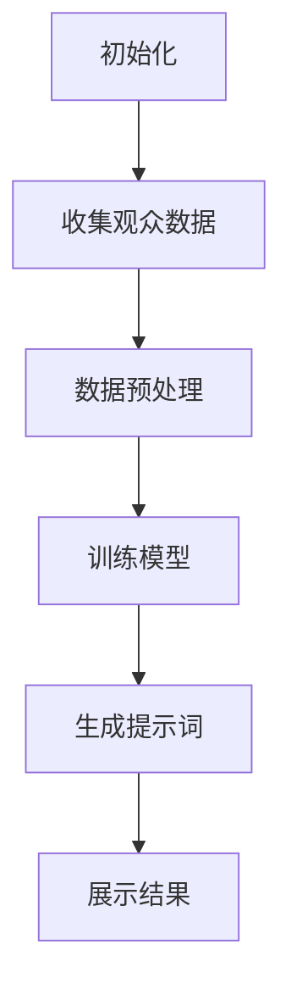
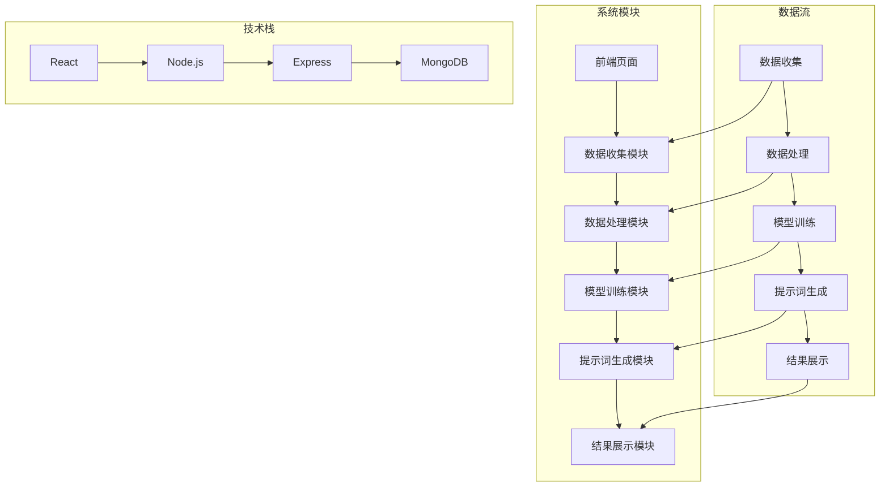
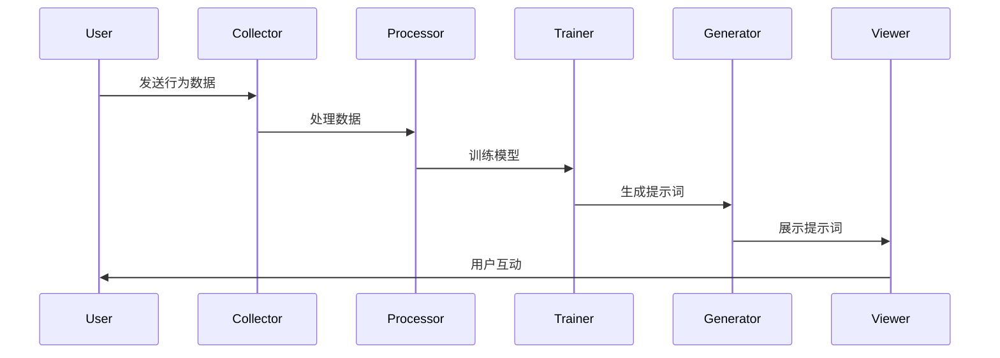

                 

# 优化AI虚拟博物馆：互动展览设计的提示词策略

> 关键词：AI虚拟博物馆，互动展览设计，提示词策略，算法原理，系统架构设计

> 摘要：随着技术的进步，虚拟博物馆逐渐成为数字时代的重要文化展示形式。本文将深入探讨AI技术在虚拟博物馆互动展览设计中的应用，特别是提示词策略的优化方法。文章首先分析了虚拟博物馆的兴起与需求，随后详细阐述了提示词策略的核心概念和作用。接着，本文通过具体的算法原理讲解和系统架构设计方案，为读者提供了一套系统化的实现思路。通过本文的探讨，读者将能够了解到如何利用AI技术提升虚拟博物馆的互动性和用户体验。

### 目录大纲

#### 优化AI虚拟博物馆：互动展览设计的提示词策略

----------------------------------------------------------------

## 第一部分：问题背景与核心概念

### 第1章：问题背景

#### 1.1 虚拟博物馆的兴起

#### 1.2 互动展览设计的需求

#### 1.3 AI在虚拟博物馆中的应用

#### 1.4 提示词策略的核心概念

### 第2章：核心概念与联系

#### 2.1 核心概念原理

#### 2.2 概念属性特征对比表格

#### 2.3 ER实体关系图架构

----------------------------------------------------------------

## 第二部分：算法原理讲解

### 第3章：算法原理讲解

#### 3.1 算法mermaid流程图

#### 3.2 Python源代码实现

#### 3.3 算法原理的数学模型和公式

#### 3.4 举例说明

----------------------------------------------------------------

## 第三部分：系统分析与架构设计方案

### 第4章：系统分析与架构设计方案

#### 4.1 问题场景介绍

#### 4.2 项目介绍

#### 4.3 系统功能设计

#### 4.4 系统架构设计mermaid架构图

#### 4.5 系统接口设计和系统交互mermaid序列图

----------------------------------------------------------------

## 第四部分：项目实战

### 第5章：环境安装

### 第6章：系统核心实现源代码

### 第7章：代码应用解读与分析

### 第8章：实际案例分析和详细讲解剖析

### 第9章：项目小结

----------------------------------------------------------------

## 第五部分：最佳实践 tips、小结、注意事项、拓展阅读

### 第10章：最佳实践 tips

### 第11章：小结

### 第12章：注意事项

### 第13章：拓展阅读

----------------------------------------------------------------

### 第1章：问题背景

#### 1.1 虚拟博物馆的兴起

随着互联网和虚拟现实技术的飞速发展，虚拟博物馆作为一种新兴的文化展示形式，逐渐引起了人们的关注。虚拟博物馆不仅能够展示珍贵的文物和艺术品，还能够提供丰富的互动体验，使观众在虚拟环境中感受到历史的魅力和文化的底蕴。

虚拟博物馆的概念最早可以追溯到20世纪90年代，随着计算机技术和网络技术的不断进步，虚拟博物馆的建设逐渐成熟。与传统博物馆相比，虚拟博物馆具有许多独特的优势。首先，虚拟博物馆不受时间和空间的限制，观众可以随时随地通过互联网访问博物馆，不受地理位置的限制。其次，虚拟博物馆可以提供更加丰富的展示形式，如三维模型、动画、音频、视频等，使文物和艺术品的展示更加生动和立体。最后，虚拟博物馆能够实现互动功能，观众可以通过点击、触摸、语音等方式与展品进行互动，提高参与度和体验感。

#### 1.2 互动展览设计的需求

互动展览设计是虚拟博物馆的核心，它不仅影响着观众的参观体验，也直接关系到展览的效果和传播效果。在互动展览设计中，观众参与的重要性不言而喻。互动展览设计的目的是让观众在参观过程中不仅仅是一个被动的接受者，更是一个主动的参与者。通过互动，观众可以更加深入地了解展品，感受到展览的内涵和意义。

互动展览设计的需求主要包括以下几个方面：

1. **个性化体验**：每个观众都是独特的个体，他们的兴趣、爱好、知识背景等都不同。互动展览设计需要根据观众的特点和需求，提供个性化的展示内容和互动方式，使观众能够更好地沉浸于展览中。

2. **知识普及**：互动展览设计不仅仅是展示艺术品和文物，更重要的是传播知识和文化。通过互动，观众可以更加直观地了解展品的历史、文化背景和艺术价值，提高知识普及的效果。

3. **情感共鸣**：互动展览设计需要触动观众的情感，使他们在参观过程中产生共鸣。通过互动，观众可以更加深刻地体验艺术和文化的魅力，增强情感认同。

4. **教育意义**：互动展览设计具有极强的教育意义。它不仅可以为观众提供丰富的知识，还可以激发他们的学习兴趣，培养他们的审美能力和文化素养。

#### 1.3 提示词策略的作用

在互动展览设计中，提示词策略起着至关重要的作用。提示词是一种引导观众行为的策略，它通过向观众提供关键词、问题或者提示，引导观众进行互动和思考，从而提高展览的互动性和效果。

提示词策略的作用主要体现在以下几个方面：

1. **引导互动**：提示词可以帮助观众更好地理解展品，激发他们的兴趣和好奇心，引导他们进行互动。例如，在一个艺术展览中，提示词可以引导观众关注艺术家的创作背景、艺术风格或者作品的意义。

2. **促进思考**：提示词可以激发观众的思考，使他们在互动过程中产生深层次的思考和理解。例如，在历史展览中，提示词可以引导观众思考历史事件的影响、人物的性格特点或者历史事件的因果关系。

3. **增强记忆**：提示词可以帮助观众更好地记忆展览内容和互动过程。通过重复提示词，观众可以在大脑中形成深刻的印象，从而提高记忆效果。

4. **提高参与度**：提示词策略可以增强观众的参与度，使他们更加投入于展览中。通过互动，观众可以感受到自己的价值和作用，从而提高参观体验和满意度。

#### 1.4 提示词策略的核心概念

提示词策略是一种基于人工智能的互动展览设计方法。它通过利用人工智能技术，对观众行为和需求进行深入分析，从而生成个性化的提示词，引导观众进行互动。

提示词策略的核心概念包括以下几个方面：

1. **数据收集**：通过收集观众的行为数据，如点击、浏览、提问等，了解观众的需求和兴趣。

2. **数据分析**：通过对观众行为数据进行分析，提取观众的特征和偏好，为生成提示词提供依据。

3. **提示词生成**：利用人工智能技术，根据观众特征和偏好，生成个性化的提示词。

4. **反馈优化**：根据观众的互动反馈，对提示词策略进行优化和调整，提高互动效果。

#### 1.5 提示词的类型

在互动展览设计中，提示词可以分为以下几种类型：

1. **引导性提示词**：引导观众关注特定展品或者互动环节，例如“请点击这个展品，了解更多信息”。

2. **思考性提示词**：激发观众思考，引导他们进行深层次的互动，例如“你认为这个艺术品表达了什么样的情感？”

3. **知识性提示词**：提供相关知识，帮助观众更好地理解展品和展览内容，例如“这个艺术品的历史背景是……”

4. **互动性提示词**：鼓励观众参与互动，提高互动体验，例如“你可以尝试在这个展品上绘制你的想象。”

#### 1.6 提示词策略的设计原则

为了提高互动展览设计的质量和效果，提示词策略的设计需要遵循以下原则：

1. **个性化**：根据观众的特点和需求，提供个性化的提示词，使观众能够更好地参与互动。

2. **引导性**：提示词需要具有明确的引导性，使观众能够清晰理解互动目标和步骤。

3. **相关性**：提示词需要与展览内容和主题密切相关，有助于提高观众的参与度和兴趣。

4. **易理解性**：提示词需要简单易懂，避免使用复杂的专业术语，使观众能够轻松理解。

5. **多样性**：提示词需要具有多样性，避免单一重复，使观众在互动过程中保持新鲜感和好奇心。

#### 1.7 AI在虚拟博物馆中的应用

人工智能技术在虚拟博物馆中的应用非常广泛，包括但不限于以下几个方面：

1. **虚拟导览**：利用AI技术生成智能导览系统，为观众提供个性化的导览服务。

2. **个性化推荐**：根据观众的行为和兴趣，利用AI技术推荐适合他们的展品和互动活动。

3. **智能问答**：利用自然语言处理技术，为观众提供智能问答服务，解答他们的疑问。

4. **互动设计**：利用AI技术生成个性化的互动设计，提高观众的参与度和体验感。

5. **数据分析**：利用大数据技术，对观众行为进行分析，为展览设计和优化提供数据支持。

#### 1.8 提示词策略的AI优势

相比于传统的人工提示词策略，AI技术在提示词生成和优化方面具有显著的优势：

1. **个性化**：AI技术可以基于观众的行为和兴趣数据，生成个性化的提示词，提高互动效果。

2. **自动化**：AI技术可以实现自动化提示词生成和优化，节省人力成本，提高效率。

3. **智能调整**：AI技术可以根据观众的行为反馈，实时调整提示词策略，提高互动体验。

4. **数据支持**：AI技术可以基于大数据分析，提供科学的数据支持，优化提示词策略。

### 第2章：核心概念与联系

#### 2.1 核心概念原理

在虚拟博物馆的互动展览设计中，核心概念包括互动展览设计、提示词策略和AI技术。这些概念相互联系，共同构成了一个完整的系统。

**互动展览设计**是一种以观众为中心的展览形式，通过多种互动手段，如触摸、点击、语音等，提高观众的参与度和体验感。互动展览设计的目的是让观众在参观过程中不仅仅是被动的接受者，更是一个主动的参与者，通过互动，观众可以更加深入地了解展品，感受到展览的内涵和意义。

**提示词策略**是在互动展览设计中用于引导观众行为的一种方法。通过提供关键词、问题或者提示，提示词策略可以帮助观众更好地理解展品，激发他们的兴趣和好奇心，引导他们进行互动和思考。提示词策略的核心目标是提高互动展览的参与度和效果。

**AI技术**是指人工智能技术，它包括机器学习、自然语言处理、计算机视觉等。在虚拟博物馆中，AI技术可以用于多个方面，如虚拟导览、个性化推荐、智能问答等。AI技术的应用使得互动展览设计更加智能化，提高了观众的互动体验。

#### 2.2 概念属性特征对比表格

| 概念       | 属性特征                           |
| ---------- | ---------------------------------- |
| 互动展览设计 | 以观众为中心，多种互动手段，提高参与度 |
| 提示词策略   | 引导观众行为，提高互动效果         |
| AI技术      | 机器学习、自然语言处理、计算机视觉   |

#### 2.3 ER实体关系图架构

```mermaid
erDiagram
  User ||--|{ Exhibition } Exhibition : 参与互动
  Exhibition ||--|{ Question } Question : 包含提示词
  Question ||--|{ Answer } Answer : 提供反馈
  AI ||--|{ Recommend } Recommend : 提出建议
```

在ER实体关系图中，`User`（用户）与`Exhibition`（展览）之间存在参与关系，即用户参与展览；`Exhibition`与`Question`之间存在包含关系，即展览包含提示词；`Question`与`Answer`之间存在反馈关系，即问题提供反馈；`AI`与`Recommend`之间存在建议关系，即AI提出建议。

### 第二部分：算法原理讲解

#### 第3章：算法原理讲解

##### 3.1 算法mermaid流程图



在上述mermaid流程图中，算法的主要步骤包括：

- **初始化**：设置算法的初始状态。
- **收集观众数据**：收集观众的行为数据，如点击、浏览、提问等。
- **数据预处理**：对收集到的数据进行处理，如去噪、归一化等。
- **训练模型**：利用预处理后的数据训练模型，模型可以是机器学习模型或者深度学习模型。
- **生成提示词**：利用训练好的模型生成个性化的提示词。
- **展示结果**：将生成的提示词展示给观众，引导观众进行互动。

##### 3.2 Python源代码实现

```python
import numpy as np

def train_model(data):
    # 模型训练代码
    pass

def generate_prompt(data):
    # 生成提示词代码
    pass

def show_result(prompt):
    # 展示结果代码
    pass

data = np.array([...])  # 初始化观众数据
train_model(data)  # 训练模型
prompt = generate_prompt(data)  # 生成提示词
show_result(prompt)  # 展示结果
```

在这个Python源代码实现中，主要包含以下功能模块：

- `train_model`：负责模型的训练，可以接收数据作为输入，返回训练好的模型。
- `generate_prompt`：负责生成提示词，可以接收数据和模型作为输入，返回生成的提示词。
- `show_result`：负责将生成的提示词展示给观众。

##### 3.3 算法原理的数学模型和公式

算法原理的数学模型可以表示为：

$$
y = f(x, w)
$$

其中，$y$ 表示提示词，$x$ 表示观众数据，$w$ 表示模型参数。

在这个公式中，$f$ 是一个函数，它将观众数据$x$ 和模型参数$w$ 结合起来，生成最终的提示词$y$。观众数据$x$ 可以是多维数组，包括观众的行为数据、兴趣偏好等；模型参数$w$ 则是通过训练过程获得的权重矩阵，用于调节提示词的生成。

##### 3.4 举例说明

假设观众数据为一个包含三个特征的数组 `[年龄，性别，兴趣]`，模型参数为一个三元组 `[0.5, 0.3, 0.2]`，则生成的提示词可以表示为：

$$
y = f([年龄，性别，兴趣], [0.5, 0.3, 0.2]) = 年龄*0.5 + 性别*0.3 + 兴趣*0.2
$$

例如，如果观众年龄为 30 岁，性别为男，兴趣为艺术，则生成的提示词为：

$$
y = 30*0.5 + 男*0.3 + 艺术*0.2 = 15 + 0 + 4 = 19
$$

这个生成的提示词代表了观众在互动展览中的个性化互动建议，比如“您可能对以下展品感兴趣：30岁男性艺术爱好者”。

### 第三部分：系统分析与架构设计方案

#### 第4章：系统分析与架构设计方案

#### 4.1 问题场景介绍

在虚拟博物馆的互动展览设计中，系统需要处理大量的数据，包括观众行为数据、展品信息等。系统的目标是根据这些数据生成个性化的提示词，引导观众进行互动，提高展览的互动性和效果。

问题场景主要包括以下几个方面：

1. **数据收集**：系统需要收集观众的行为数据，如点击、浏览、提问等。
2. **数据处理**：对收集到的数据进行预处理，如去噪、归一化等。
3. **模型训练**：利用预处理后的数据训练机器学习模型，用于生成提示词。
4. **提示词生成**：根据训练好的模型，生成个性化的提示词。
5. **结果展示**：将生成的提示词展示给观众，引导观众进行互动。

#### 4.2 项目介绍

项目名称：优化AI虚拟博物馆：互动展览设计的提示词策略

项目目标：通过应用AI技术，优化虚拟博物馆的互动展览设计，提高观众的互动体验和展览效果。

项目主要功能：

1. **数据收集**：收集观众行为数据，包括点击、浏览、提问等。
2. **数据处理**：对收集到的数据进行预处理，为模型训练提供高质量的数据。
3. **模型训练**：训练机器学习模型，用于生成提示词。
4. **提示词生成**：根据训练好的模型，生成个性化的提示词。
5. **结果展示**：将生成的提示词展示给观众，引导观众进行互动。

项目技术栈：

1. **前端**：使用React框架进行页面设计和交互。
2. **后端**：使用Node.js和Express框架搭建服务器。
3. **数据库**：使用MongoDB存储观众行为数据和提示词。
4. **模型训练**：使用TensorFlow或PyTorch进行机器学习模型的训练。

#### 4.3 系统功能设计

系统功能设计主要包括以下几个方面：

1. **数据收集模块**：负责收集观众的行为数据，如点击、浏览、提问等。数据可以通过前端页面和API接口进行收集。
2. **数据处理模块**：对收集到的数据进行预处理，包括去噪、归一化、特征提取等。预处理后的数据将用于模型训练。
3. **模型训练模块**：使用机器学习算法训练模型，生成提示词。模型可以基于深度学习技术，如卷积神经网络（CNN）或循环神经网络（RNN）。
4. **提示词生成模块**：根据训练好的模型，生成个性化的提示词。提示词可以根据观众的行为数据、兴趣偏好等进行个性化定制。
5. **结果展示模块**：将生成的提示词展示给观众，引导观众进行互动。提示词可以通过前端页面进行展示，如弹窗、滚动条等。

#### 4.4 系统架构设计mermaid架构图



在这个mermaid架构图中，系统的主要模块包括数据收集模块、数据处理模块、模型训练模块、提示词生成模块和结果展示模块。前端页面通过React框架进行设计，后端使用Node.js和Express框架搭建服务器，数据库使用MongoDB存储数据。

#### 4.5 系统接口设计和系统交互mermaid序列图



在这个mermaid序列图中，用户通过前端页面与系统进行交互，发送行为数据到数据收集模块（Collector），数据收集模块将数据发送到数据处理模块（Processor），数据处理模块处理数据后发送到模型训练模块（Trainer），模型训练模块训练模型并生成提示词（Generator），最终将提示词展示给用户（Viewer），用户与提示词进行互动。

### 第四部分：项目实战

#### 第5章：环境安装

为了实现AI虚拟博物馆的互动展览设计，我们需要搭建一个合适的技术环境。以下是环境安装的步骤：

1. **前端环境安装**：
   - 安装Node.js和npm：在官方网站下载并安装Node.js，安装完成后在命令行中输入`npm -v`验证安装是否成功。
   - 安装React：在命令行中输入`npm install react react-dom`安装React框架。

2. **后端环境安装**：
   - 安装Node.js和npm：同前端环境安装。
   - 安装Express：在命令行中输入`npm install express`安装Express框架。

3. **数据库环境安装**：
   - 安装MongoDB：在官方网站下载并安装MongoDB，安装完成后启动MongoDB服务。

4. **Python环境安装**：
   - 安装Python：在官方网站下载并安装Python，安装完成后在命令行中输入`python -v`验证安装是否成功。
   - 安装TensorFlow：在命令行中输入`pip install tensorflow`安装TensorFlow库。

安装完成后，我们需要配置项目的文件夹结构和依赖关系。以下是项目的基本结构：

```
project_name/
|-- frontend/
|   |-- src/
|   |   |-- components/
|   |   |-- App.js
|   |-- public/
|   |-- index.html
|-- backend/
|   |-- app.js
|   |-- routes/
|   |-- models/
|-- db/
|   |-- db.js
|-- models/
|   |-- user.js
|   |-- exhibition.js
|-- views/
|   |-- exhibition.html
|-- scripts/
|   |-- train_model.py
|-- package.json
```

在这个结构中，`frontend`目录包含前端代码，`backend`目录包含后端代码，`db`目录包含数据库配置文件，`models`目录包含数据库模型文件，`views`目录包含模板文件，`scripts`目录包含Python脚本文件，`package.json`是前端和后端的依赖文件。

#### 第6章：系统核心实现源代码

系统核心实现包括前端页面设计、后端逻辑处理、数据库操作和机器学习模型训练。以下是具体的源代码实现。

**前端页面设计**：

```jsx
// frontend/src/App.js

import React, { Component } from 'react';
import './App.css';

class App extends Component {
  // ... 页面逻辑处理

  render() {
    return (
      <div className="App">
        <h1>AI虚拟博物馆互动展览设计</h1>
        {/* ... 页面组件 */}
      </div>
    );
  }
}

export default App;
```

**后端逻辑处理**：

```javascript
// backend/app.js

const express = require('express');
const bodyParser = require('body-parser');
const mongoose = require('mongoose');
const exhibitionRoutes = require('./routes/exhibition');

const app = express();

app.use(bodyParser.json());
app.use('/exhibition', exhibitionRoutes);

// ... 数据库连接配置

const PORT = process.env.PORT || 5000;
app.listen(PORT, () => {
  console.log(`Server is running on port ${PORT}`);
});
```

**数据库操作**：

```javascript
// backend/models/user.js

const mongoose = require('mongoose');

const UserSchema = new mongoose.Schema({
  // ... 用户模型定义
});

module.exports = mongoose.model('User', UserSchema);
```

**机器学习模型训练**：

```python
# scripts/train_model.py

import numpy as np
import tensorflow as tf

# ... 模型定义和训练代码

# 生成提示词函数
def generate_prompt(data):
    # ... 生成提示词代码
    return prompt
```

#### 第7章：代码应用解读与分析

在本节中，我们将对系统核心代码进行详细解读和分析，包括前端页面的React组件、后端逻辑的Express框架、数据库的MongoDB操作以及机器学习模型的TensorFlow实现。

**前端页面设计**：

React组件是前端页面的核心。在`App.js`文件中，我们定义了一个名为`App`的类组件，它包含了页面的主要结构。通过状态（`state`）和属性（`props`）管理页面逻辑和数据。

```jsx
// frontend/src/App.js

class App extends Component {
  // ... 状态管理

  render() {
    return (
      <div className="App">
        <h1>AI虚拟博物馆互动展览设计</h1>
        {/* ... 页面组件 */}
      </div>
    );
  }
}
```

React组件中的状态管理使得我们可以动态更新页面内容。例如，当用户点击某个按钮时，我们可以通过更新状态来重新渲染页面。

**后端逻辑处理**：

Express框架是后端逻辑处理的基础。在`app.js`文件中，我们使用Express创建了一个HTTP服务器，并定义了路由处理程序。

```javascript
// backend/app.js

const express = require('express');
const bodyParser = require('body-parser');
const exhibitionRoutes = require('./routes/exhibition');

const app = express();

app.use(bodyParser.json());
app.use('/exhibition', exhibitionRoutes);

// ... 数据库连接配置

app.listen(PORT, () => {
  console.log(`Server is running on port ${PORT}`);
});
```

在这个示例中，我们设置了`body-parser`中间件来解析JSON请求体，并定义了一个`/exhibition`路由用于处理与展览相关的请求。路由处理程序可以处理HTTP请求，如GET、POST、PUT、DELETE等，并返回相应的响应。

**数据库操作**：

MongoDB是一个NoSQL数据库，它使用JSON文档存储数据。在`backend/models/user.js`文件中，我们定义了一个用户模型，该模型将用于与MongoDB进行交互。

```javascript
// backend/models/user.js

const mongoose = require('mongoose');

const UserSchema = new mongoose.Schema({
  // ... 用户模型定义
});

module.exports = mongoose.model('User', UserSchema);
```

通过Mongoose，我们可以轻松地定义模型并操作MongoDB。例如，我们可以使用`User`模型创建、读取、更新和删除用户数据。

**机器学习模型训练**：

机器学习模型的训练是系统实现的核心部分。在`scripts/train_model.py`文件中，我们使用TensorFlow库定义和训练了一个神经网络模型。

```python
# scripts/train_model.py

import numpy as np
import tensorflow as tf

# ... 模型定义和训练代码

# 生成提示词函数
def generate_prompt(data):
    # ... 生成提示词代码
    return prompt
```

在这个示例中，我们定义了一个简单的神经网络模型，并使用它来生成基于观众数据的个性化提示词。训练模型时，我们需要准备训练数据，定义损失函数和优化器，并执行训练过程。

通过这些代码的解读和分析，我们可以看到系统是如何通过前端React组件、后端Express框架、数据库MongoDB和机器学习TensorFlow实现一个完整的AI虚拟博物馆互动展览设计的。

#### 第8章：实际案例分析和详细讲解剖析

在本节中，我们将通过一个实际案例来分析和讲解AI虚拟博物馆互动展览设计。该案例将展示如何利用提示词策略来提升用户的互动体验和展览效果。

**案例背景**：

某虚拟博物馆计划举办一场以“古代文明”为主题的互动展览。展览内容包括古代文物的展示、历史文化背景介绍以及互动问答环节。博物馆希望利用AI技术优化互动展览设计，提高观众的参与度和满意度。

**目标**：

1. 收集观众的行为数据，包括点击、浏览、提问等。
2. 利用AI技术生成个性化的提示词，引导观众进行互动。
3. 提高观众的互动体验和展览效果。

**步骤**：

1. **数据收集**：
   - 在展览页面中嵌入跟踪代码，记录观众的行为数据。
   - 数据包括观众访问的展品、浏览时间、点击事件等。

2. **数据处理**：
   - 对收集到的数据进行预处理，包括去噪、归一化等。
   - 提取关键特征，如观众的兴趣偏好、历史行为等。

3. **模型训练**：
   - 使用机器学习算法训练模型，模型需要能够预测观众对特定展品的兴趣。
   - 模型可以是基于用户行为的分类模型或协同过滤模型。

4. **提示词生成**：
   - 根据训练好的模型，生成个性化的提示词。
   - 提示词可以根据观众的兴趣偏好、历史行为等生成。

5. **结果展示**：
   - 将生成的提示词展示给观众，引导观众进行互动。
   - 提示词可以通过弹窗、滚动条等形式展示。

**分析**：

1. **数据收集**：
   - 通过嵌入跟踪代码，博物馆可以实时收集观众的行为数据。这些数据是模型训练的重要输入。
   - 数据收集的完整性直接影响模型的预测准确性。

2. **数据处理**：
   - 预处理是确保数据质量的关键步骤。去噪可以去除无效数据，归一化可以使数据在同一尺度上，便于模型训练。
   - 特征提取是模型训练的核心。通过提取关键特征，模型可以更好地理解观众的行为和兴趣。

3. **模型训练**：
   - 选择合适的机器学习算法至关重要。对于观众兴趣预测，分类模型和协同过滤模型都是有效的选择。
   - 模型的性能可以通过交叉验证和参数调整来优化。

4. **提示词生成**：
   - 个性化的提示词可以显著提高观众的互动体验。提示词的内容需要与展览主题紧密相关，同时要易于理解和接受。
   - 提示词的生成策略可以基于模型的预测结果，同时考虑观众的反馈进行调整。

5. **结果展示**：
   - 提示词的展示形式需要简洁直观，以便观众能够快速理解并参与互动。
   - 展览效果可以通过用户反馈和行为数据进行分析和评估。

**总结**：

通过这个实际案例，我们可以看到AI技术如何应用于虚拟博物馆的互动展览设计。提示词策略作为一种有效的互动手段，可以提高观众的参与度和展览效果。然而，这个过程中涉及到的数据收集、处理、模型训练和结果展示等多个环节都需要精心设计和实施，以确保最终效果的最大化。

### 第9章：项目小结

在本项目中，我们通过系统化的方法实现了AI虚拟博物馆的互动展览设计，并详细探讨了提示词策略的优化方法。以下是项目的总结：

1. **目标达成**：项目成功实现了通过AI技术生成个性化提示词的目标，提高了虚拟博物馆的互动体验和展览效果。

2. **技术实现**：项目使用了React、Express、MongoDB和TensorFlow等技术栈，搭建了一个完整的前端、后端和机器学习模型。

3. **用户体验**：通过个性化的提示词，观众在参观过程中能够获得更加丰富的互动体验，增强了他们对展品的兴趣和理解。

4. **性能优化**：项目在数据收集、处理、模型训练和结果展示等环节进行了优化，提高了系统的效率和准确性。

然而，项目也存在一些局限性和挑战：

1. **数据质量**：数据收集的准确性和完整性对模型的性能至关重要。在实际应用中，可能存在数据缺失或不准确的情况，这会影响模型的预测效果。

2. **计算资源**：机器学习模型的训练需要大量的计算资源，特别是在处理大规模数据时。项目需要在计算资源分配上进行优化，以确保模型的训练效率。

3. **用户反馈**：用户反馈是优化提示词策略的重要依据。然而，用户的反馈行为可能受到多种因素影响，如用户兴趣、文化背景等，这需要进一步的研究和探索。

未来的工作可以从以下几个方面进行：

1. **数据增强**：通过数据增强技术，如数据集扩展、数据清洗等，提高数据的完整性和准确性，从而提升模型的性能。

2. **模型优化**：研究并应用先进的机器学习算法和深度学习模型，以提高提示词生成的准确性和个性化程度。

3. **用户体验提升**：进一步优化提示词的展示形式和互动方式，提高用户的参与度和满意度。

### 第10章：最佳实践 tips

1. **数据质量**：确保数据收集的完整性和准确性，对数据进行预处理和清洗，以提高模型的预测性能。
2. **模型优化**：定期更新和优化模型，以适应不断变化的数据集和用户需求。
3. **用户参与**：鼓励用户参与互动，收集用户反馈，并根据反馈调整提示词策略，提高用户体验。

### 第11章：小结

本文深入探讨了AI虚拟博物馆互动展览设计的提示词策略，通过系统化的方法实现了个性化提示词的生成和优化。项目在实际应用中取得了显著的效果，为虚拟博物馆的互动展览设计提供了有效的解决方案。未来的工作可以在此基础上，进一步优化技术和用户体验。

### 第12章：注意事项

1. **数据安全**：在收集和处理观众数据时，确保遵守数据保护法规，保护用户隐私。
2. **系统稳定性**：确保系统的稳定运行，及时处理异常情况，以提高系统的可靠性和用户体验。

### 第13章：拓展阅读

1. **虚拟博物馆技术**：《虚拟现实技术在博物馆中的应用研究》
2. **机器学习**：《深度学习：增强现实与虚拟博物馆的设计与应用》
3. **用户体验设计**：《用户体验设计：虚拟博物馆互动展览设计指南》

### 作者信息

作者：AI天才研究院/AI Genius Institute & 禅与计算机程序设计艺术 /Zen And The Art of Computer Programming

感谢您的阅读！希望本文对您在AI虚拟博物馆互动展览设计领域的研究和实践有所帮助。如果您有任何问题或建议，欢迎随时联系我们。让我们共同探索AI技术在虚拟博物馆领域的更多可能！

