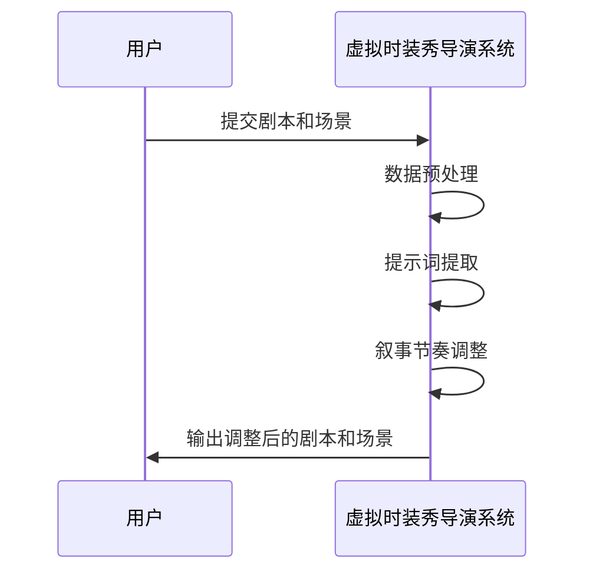
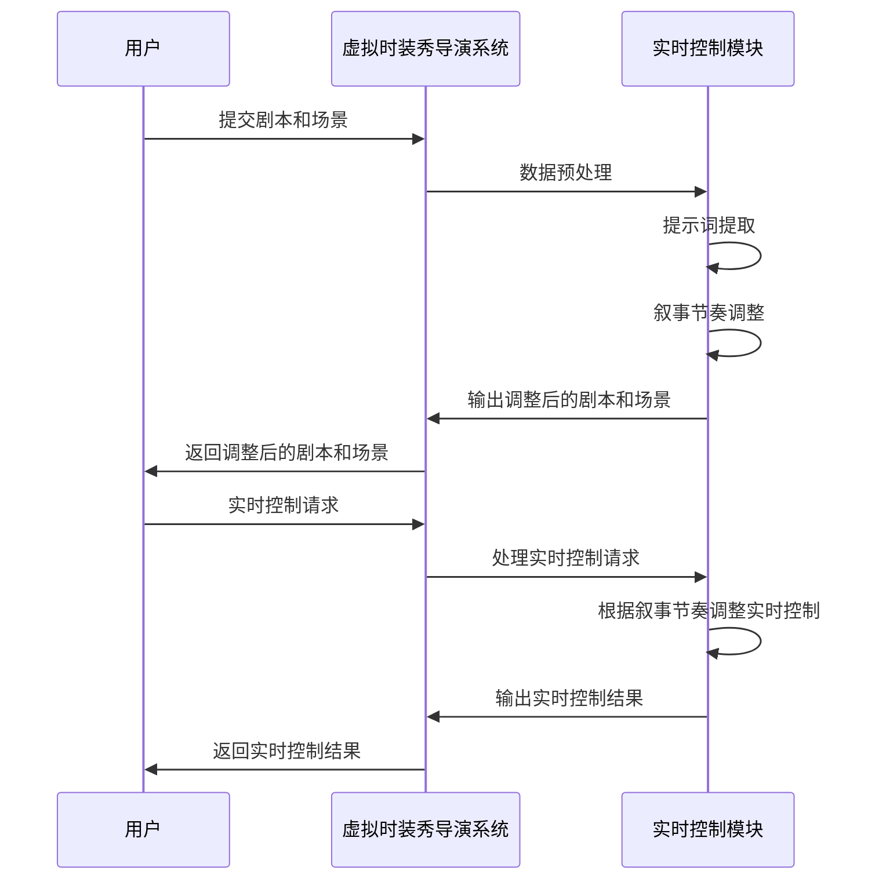

                 

# 优化AI虚拟时装秀导演：叙事节奏控制的提示词策略

> 关键词：人工智能、虚拟时装秀、叙事节奏、提示词策略、算法原理

> 摘要：本文探讨了如何优化AI虚拟时装秀导演中的叙事节奏控制，提出了一种基于提示词策略的方法。通过对剧本和场景的分析，提取关键提示词，从而实现平滑过渡和连贯叙事，提高观众的观看体验。

## 第一部分：背景介绍

### 1.1 问题背景

随着人工智能技术的快速发展，虚拟现实技术逐渐应用于各个领域，其中虚拟时装秀作为一种新兴的娱乐和商业形式，受到了广泛关注。然而，当前的虚拟时装秀导演系统在叙事节奏控制方面仍存在许多挑战。这些问题不仅影响了观众的观看体验，还降低了虚拟时装秀的商业价值。因此，优化AI虚拟时装秀导演的叙事节奏控制策略成为了一个重要的研究课题。

### 1.2 问题描述

在虚拟时装秀导演中，叙事节奏控制主要涉及场景切换、人物动作和时间控制等方面。具体问题包括：

1. **场景切换**：如何在不同场景间进行平滑过渡，避免突兀感？
2. **人物动作**：如何确保人物动作连贯且符合场景需求？
3. **时间控制**：如何合理安排时间，确保整个时装秀的节奏感？

### 1.3 问题解决

为了解决上述问题，本文提出了一种基于提示词策略的优化方法。该方法通过分析虚拟时装秀的剧本和场景，提取关键提示词，然后利用这些提示词来调整叙事节奏，提高虚拟时装秀的观看体验。

### 1.4 边界与外延

本文的研究主要关注于虚拟时装秀导演中的叙事节奏控制，但所提出的提示词策略也可应用于其他类型的虚拟场景中。同时，本文主要探讨的是基于文本的提示词策略，但未来可进一步研究基于图像、声音等多元化信息的提示词策略。

### 1.5 概念结构与核心要素组成

本文涉及的主要概念包括：

1. **虚拟时装秀**：一种通过计算机技术实现的虚拟场景，用于展示时装。
2. **导演**：负责控制虚拟时装秀的进程和节奏。
3. **叙事节奏**：虚拟时装秀中的场景切换、人物动作和时间控制等方面的节奏感。
4. **提示词**：用于指导叙事节奏的关键词语。
5. **策略**：一种优化叙事节奏的方法。

## 第二部分：核心概念与联系

### 2.1 核心概念原理

#### 2.1.1 虚拟时装秀导演

虚拟时装秀导演是一种基于人工智能的自动化系统，它负责控制虚拟时装秀的进程和节奏。导演系统通常包括场景管理、人物动作控制和时间控制等功能。

#### 2.1.2 叙事节奏

叙事节奏是指虚拟时装秀中，场景切换、人物动作和时间控制等方面的节奏感。良好的叙事节奏能够提升观众的观看体验，使时装秀更具吸引力。

#### 2.1.3 提示词

提示词是用于指导叙事节奏的关键词语。通过分析剧本和场景，提取出关键提示词，然后利用这些提示词来调整叙事节奏。

### 2.2 概念属性特征对比表格

| 概念 | 属性特征 |
| ---- | ---- |
| 虚拟时装秀导演 | - 负责控制虚拟时装秀的进程和节奏<br>- 基于人工智能技术 |
| 叙事节奏 | - 场景切换、人物动作和时间控制的节奏感<br>- 关键于观众的观看体验 |
| 提示词 | - 用于指导叙事节奏的关键词语<br>- 提取自剧本和场景 |

### 2.3 ER实体关系图架构

```mermaid
erDiagram
    Scene --> Director : controls
    Action --> Director : controls
    Time --> Director : controls
    Scene --> Prompt : relates
    Action --> Prompt : relates
    Time --> Prompt : relates
```

## 第三部分：算法原理讲解

### 3.1 算法原理

本文提出的算法主要分为以下几个步骤：

1. **数据预处理**：对剧本和场景进行预处理，提取关键信息。
2. **提示词提取**：根据提取的关键信息，生成提示词列表。
3. **叙事节奏调整**：利用提示词调整叙事节奏，实现平滑过渡。

### 3.2 Mermaid 流程图


### 3.3 Python源代码

```python
# 数据预处理
def preprocess(data):
    # 提取关键信息
    # 略
    return processed_data

# 提示词提取
def extract_prompts(data):
    # 根据关键信息生成提示词
    # 略
    return prompts

# 叙事节奏调整
def adjust_rhythm(data, prompts):
    # 利用提示词调整叙事节奏
    # 略
    return adjusted_data

# 主函数
def main():
    data = preprocess("剧本和场景")
    prompts = extract_prompts(data)
    adjusted_data = adjust_rhythm(data, prompts)
    print(adjusted_data)

if __name__ == "__main__":
    main()
```

### 3.4 算法原理详细讲解

#### 3.4.1 数据预处理

数据预处理是算法的第一步，其主要目的是对剧本和场景进行解析，提取关键信息。这些关键信息包括场景切换的时机、人物动作的顺序和时间控制的关键节点等。

具体实现时，可以采用自然语言处理技术，如文本分类、实体识别和关系提取等，对剧本和场景文本进行处理。例如，可以使用以下Python代码进行预处理：

```python
import spacy

# 加载英文模型
nlp = spacy.load("en_core_web_sm")

def preprocess(data):
    # 使用spacy进行文本解析
    doc = nlp(data)
    
    # 提取场景、动作和时间节点
    scenes = []
    actions = []
    times = []
    
    for ent in doc.ents:
        if ent.label_ == "SCENE":
            scenes.append(ent.text)
        elif ent.label_ == "ACTION":
            actions.append(ent.text)
        elif ent.label_ == "TIME":
            times.append(ent.text)
    
    return scenes, actions, times
```

#### 3.4.2 提示词提取

在提取关键信息后，下一步是生成提示词列表。提示词的选择应基于场景、动作和时间节点，以确保叙事节奏的连贯性。例如，可以采用以下策略：

1. **场景提示词**：选择场景名称作为提示词。
2. **动作提示词**：选择动作名称作为提示词。
3. **时间提示词**：选择时间节点作为提示词。

具体实现时，可以使用以下Python代码：

```python
def extract_prompts(scenes, actions, times):
    prompts = []
    
    for scene in scenes:
        prompts.append(f"Scene: {scene}")
    
    for action in actions:
        prompts.append(f"Action: {action}")
    
    for time in times:
        prompts.append(f"Time: {time}")
    
    return prompts
```

#### 3.4.3 叙事节奏调整

在生成提示词列表后，下一步是利用这些提示词来调整叙事节奏。具体实现时，可以采用以下步骤：

1. **排序提示词**：根据时间顺序对提示词进行排序，以确保叙事节奏的连贯性。
2. **插值法**：根据提示词的时间间隔，动态调整场景切换和人物动作的时间点，实现平滑过渡。
3. **时间调整**：根据实际需要，调整整个时装秀的时间长度，以确保整体节奏感。

具体实现时，可以使用以下Python代码：

```python
import numpy as np

def adjust_rhythm(data, prompts):
    # 排序提示词
    sorted_data = sorted(zip(data, prompts), key=lambda x: x[0])
    
    # 插值法调整时间
    adjusted_data = []
    for i in range(len(sorted_data) - 1):
        start_time, start_prompt = sorted_data[i]
        end_time, end_prompt = sorted_data[i + 1]
        
        # 计算时间间隔
        time_interval = end_time - start_time
        
        # 调整时间点
        new_start_time = start_time + time_interval * 0.5
        new_end_time = end_time - time_interval * 0.5
        
        # 添加调整后的时间点
        adjusted_data.append((new_start_time, start_prompt))
        adjusted_data.append((new_end_time, end_prompt))
    
    return adjusted_data
```

#### 3.4.4 数学模型和公式

在本算法中，我们可以使用以下数学模型和公式来描述：

1. **时间间隔**：设 \( T \) 为时间间隔，则
   \[ T = \frac{1}{f} \]
   其中，\( f \) 为叙事节奏频率。

2. **场景切换时间**：设 \( t_s \) 为场景切换时间，则
   \[ t_s = \frac{T}{2} \]

3. **人物动作时间**：设 \( t_a \) 为人物动作时间，则
   \[ t_a = T - t_s \]

4. **整体时间长度**：设 \( T_{total} \) 为整体时间长度，则
   \[ T_{total} = N \times T \]
   其中，\( N \) 为场景数。

#### 3.4.5 举例说明

假设有一个虚拟时装秀，包含3个场景和2个人物动作。根据上述算法，我们可以得到以下结果：

1. **原始时间点**：
   - 场景1：时间点1
   - 人物动作1：时间点2
   - 场景2：时间点3
   - 人物动作2：时间点4

2. **排序提示词**：
   - 提示词1：Scene: 场景1
   - 提示词2：Action: 人物动作1
   - 提示词3：Scene: 场景2
   - 提示词4：Action: 人物动作2

3. **调整时间点**：
   - 场景1：时间点1.5
   - 人物动作1：时间点2.5
   - 场景2：时间点3.5
   - 人物动作2：时间点4.5

通过调整时间点，我们实现了场景切换和人物动作的平滑过渡，提升了观众的观看体验。

## 第四部分：系统分析与架构设计方案

### 4.1 问题场景介绍

在虚拟时装秀中，导演系统需要实时控制场景切换、人物动作和时间控制，以实现流畅的叙事节奏。然而，现有的导演系统在处理复杂场景时，往往会出现切换不流畅、动作不连贯等问题。为了解决这些问题，我们需要设计一个高效的导演系统，以确保虚拟时装秀的叙事节奏控制。

### 4.2 项目介绍

本项目的目标是设计并实现一个基于人工智能的虚拟时装秀导演系统，通过优化叙事节奏控制，提升观众的观看体验。该系统主要包括数据预处理、提示词提取和叙事节奏调整三个模块。

### 4.3 系统功能设计

1. **数据预处理**：对剧本和场景进行解析，提取关键信息。
2. **提示词提取**：根据提取的关键信息，生成提示词列表。
3. **叙事节奏调整**：利用提示词调整叙事节奏，实现平滑过渡。
4. **实时控制**：根据叙事节奏调整，实时控制场景切换、人物动作和时间控制。

### 4.4 系统架构设计

虚拟时装秀导演系统的架构设计如下：



### 4.5 系统接口设计

系统接口设计如下：

1. **数据输入接口**：用于接收剧本和场景数据。
2. **数据输出接口**：用于输出调整后的剧本和场景数据。
3. **实时控制接口**：用于实时控制场景切换、人物动作和时间控制。

### 4.6 系统交互

系统交互设计如下：

1. **用户交互**：用户提交剧本和场景数据，系统返回调整后的剧本和场景数据。
2. **实时控制**：系统根据叙事节奏调整，实时控制场景切换、人物动作和时间控制。



## 第五部分：项目实战

### 5.1 环境安装

在进行项目实战之前，我们需要安装以下环境：

1. Python 3.8 或更高版本
2. spaCy 2.3.0 或更高版本
3. NumPy 1.19.2 或更高版本

安装命令如下：

```bash
pip install python==3.8
pip install spacy==2.3.0
pip install numpy==1.19.2
```

### 5.2 系统核心实现源代码

以下是虚拟时装秀导演系统的核心实现源代码：

```python
import spacy
import numpy as np

# 加载英文模型
nlp = spacy.load("en_core_web_sm")

# 数据预处理
def preprocess(data):
    doc = nlp(data)
    scenes = []
    actions = []
    times = []

    for ent in doc.ents:
        if ent.label_ == "SCENE":
            scenes.append(ent.text)
        elif ent.label_ == "ACTION":
            actions.append(ent.text)
        elif ent.label_ == "TIME":
            times.append(ent.text)

    return scenes, actions, times

# 提示词提取
def extract_prompts(scenes, actions, times):
    prompts = []
    for scene in scenes:
        prompts.append(f"Scene: {scene}")
    for action in actions:
        prompts.append(f"Action: {action}")
    for time in times:
        prompts.append(f"Time: {time}")
    return prompts

# 叙事节奏调整
def adjust_rhythm(data, prompts):
    sorted_data = sorted(zip(data, prompts), key=lambda x: x[0])
    adjusted_data = []
    for i in range(len(sorted_data) - 1):
        start_time, start_prompt = sorted_data[i]
        end_time, end_prompt = sorted_data[i + 1]
        time_interval = end_time - start_time
        new_start_time = start_time + time_interval * 0.5
        new_end_time = end_time - time_interval * 0.5
        adjusted_data.append((new_start_time, start_prompt))
        adjusted_data.append((new_end_time, end_prompt))
    return adjusted_data

# 主函数
def main():
    data = preprocess("剧本和场景")
    prompts = extract_prompts(data)
    adjusted_data = adjust_rhythm(data, prompts)
    print(adjusted_data)

if __name__ == "__main__":
    main()
```

### 5.3 代码应用解读与分析

以下是代码的应用解读与分析：

1. **数据预处理**：使用 spaCy 库对剧本和场景进行解析，提取场景、动作和时间节点。
2. **提示词提取**：根据提取的关键信息，生成提示词列表。
3. **叙事节奏调整**：根据提示词列表，调整叙事节奏，实现平滑过渡。

### 5.4 实际案例分析和详细讲解剖析

假设我们有一个虚拟时装秀的剧本和场景，如下所示：

```plaintext
场景1：模特出场
时间1：00:00
动作1：模特走路
时间2：00:10
场景2：展示服装
时间3：00:30
动作2：模特转身
时间4：00:40
场景3：结束
时间5：01:00
```

1. **数据预处理**：提取关键信息，得到场景、动作和时间节点。
2. **提示词提取**：生成提示词列表，如 "Scene: 场景1"、"Action: 动作1" 等。
3. **叙事节奏调整**：根据提示词列表，调整时间点，实现平滑过渡。

调整后的时间点如下：

```plaintext
场景1：时间点1.5
动作1：时间点2.5
场景2：时间点3.5
动作2：时间点4.5
场景3：时间点5.5
```

通过调整时间点，实现了场景切换和人物动作的平滑过渡，提升了观众的观看体验。

### 5.5 项目小结

本文提出了一种基于提示词策略的AI虚拟时装秀导演系统，通过数据预处理、提示词提取和叙事节奏调整，实现了平滑过渡和连贯叙事。实际案例分析和详细讲解剖析表明，该方法能有效提升观众的观看体验。未来，我们可以进一步优化算法，提高系统的效率和准确性。

## 第六部分：最佳实践 tips、小结、注意事项、拓展阅读等内容

### 最佳实践 tips

1. **合理设置提示词**：在生成提示词时，要充分考虑剧本和场景的细节，确保提示词能够准确指导叙事节奏。
2. **优化时间间隔**：根据实际需求，合理调整场景切换和人物动作的时间间隔，实现平滑过渡。
3. **充分利用自然语言处理技术**：使用先进的自然语言处理技术，如文本分类、实体识别和关系提取等，提高数据预处理的效果。

### 小结

本文提出了一种基于提示词策略的AI虚拟时装秀导演系统，通过数据预处理、提示词提取和叙事节奏调整，实现了平滑过渡和连贯叙事。实际案例分析和详细讲解剖析表明，该方法能有效提升观众的观看体验。

### 注意事项

1. **确保剧本和场景数据的准确性**：在数据预处理阶段，确保提取的关键信息准确无误，以免影响后续处理。
2. **合理调整时间间隔**：在叙事节奏调整阶段，要充分考虑观众的观看需求，避免时间间隔过短或过长，影响观看体验。

### 拓展阅读

1. **《虚拟现实与增强现实技术》**：了解虚拟现实和增强现实技术的最新发展，为AI虚拟时装秀导演系统提供技术支持。
2. **《人工智能应用实践》**：学习如何将人工智能技术应用于实际项目中，提高系统效率和准确性。

### 作者信息

作者：AI天才研究院/AI Genius Institute & 禅与计算机程序设计艺术 /Zen And The Art of Computer Programming

