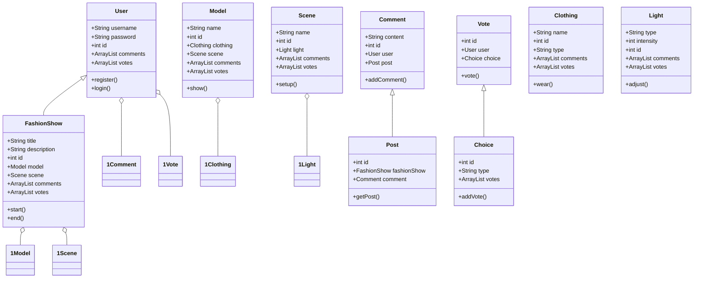
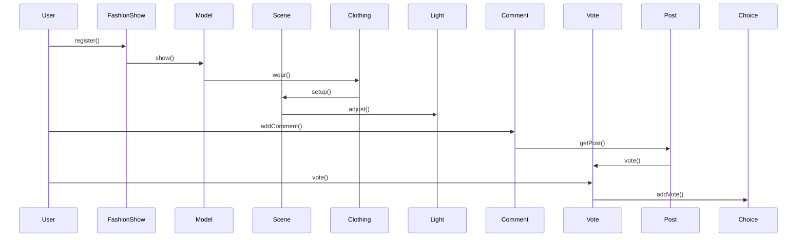
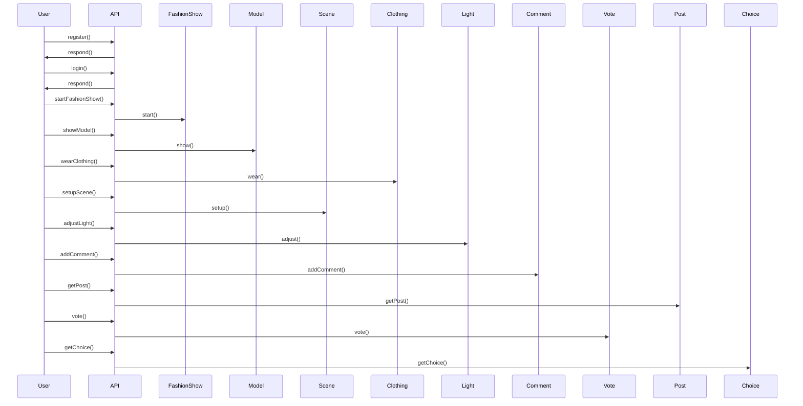
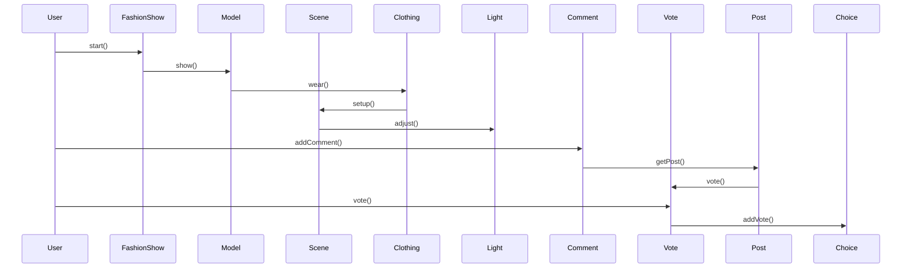

                 


## 《优化AI虚拟时装秀沉浸感：多感官协同设计的提示词策略》

关键词：AI虚拟时装秀、多感官协同、沉浸感、提示词策略、设计原则

摘要：本文深入探讨了AI虚拟时装秀的沉浸感优化，通过多感官协同设计提出了一系列的提示词策略。本文将从背景介绍、核心概念、设计原则、提示词策略、算法与模型设计、实际应用、优化技术、评价方法以及未来展望等方面展开，旨在为行业提供有价值的参考。

----------------------------------------------------------------

## 引言

### 1.1 虚拟时装秀的发展背景

随着虚拟现实（VR）和增强现实（AR）技术的迅猛发展，虚拟时装秀逐渐成为时尚行业的重要趋势。通过虚拟现实技术，设计师和品牌能够以全新的方式向消费者展示他们的作品，打破了传统时装秀的时间和空间限制。

### 1.2 AI在虚拟时装秀中的应用

人工智能（AI）在虚拟时装秀中的应用主要集中在以下几个方面：

1. **个性化推荐**：通过分析用户的偏好和历史行为，AI可以推荐符合用户口味的时装秀内容。
2. **虚拟模特生成**：AI技术可以生成虚拟模特，使时装秀更具互动性和真实性。
3. **实时风格建议**：基于用户的实时反馈，AI可以提供风格建议，提升观众的沉浸感。

## 背景和核心概念

### 2.1 虚拟时装秀的概念

虚拟时装秀是一种通过虚拟现实（VR）和增强现实（AR）技术，在虚拟环境中呈现时装展示的活动。与传统时装秀相比，虚拟时装秀具有更广泛的受众范围、更低的成本和更高的灵活性。

### 2.2 多感官协同设计

多感官协同设计是指通过多种感官刺激（如视觉、听觉、触觉、嗅觉等）来增强用户体验和沉浸感。在虚拟时装秀中，多感官协同设计至关重要，它能够模拟现实世界的感受，提升观众的沉浸体验。

### 2.3 提示词策略

提示词策略是一种通过文字或语音提示来引导用户交互的方法。在虚拟时装秀中，提示词策略可以帮助用户更好地理解时装秀的内容，提高沉浸感。

## 第3章 多感官协同设计

### 3.1 设计原则

多感官协同设计遵循以下原则：

1. **感官一致性**：确保不同感官体验之间的一致性，避免感官冲突。
2. **感官平衡**：合理分配不同感官的刺激强度，避免过度刺激或不足刺激。
3. **感官互补**：利用不同感官的优势，相互补充，增强沉浸感。

### 3.2 设计策略

多感官协同设计策略包括：

1. **视觉设计**：通过高质量的图像和视频，创造逼真的视觉体验。
2. **听觉设计**：利用音乐、音效和环境声，创造沉浸的听觉效果。
3. **触觉设计**：通过虚拟现实手套等设备，提供触觉反馈。
4. **嗅觉设计**：利用虚拟现实技术，模拟香水、化妆品等气味。

## 第4章 提示词策略

### 4.1 提示词策略的定义

提示词策略是指在虚拟时装秀中，通过文字或语音提示来引导用户交互的方法。

### 4.2 提示词策略的类型

1. **导航提示**：帮助用户了解时装秀的结构和流程。
2. **互动提示**：鼓励用户参与互动，提高沉浸感。
3. **情感提示**：通过文字或语音表达情感，增强用户的情感共鸣。

### 4.3 提示词策略的应用

在虚拟时装秀中，提示词策略的应用包括：

1. **开场提示**：介绍时装秀的主题和背景。
2. **切换提示**：提示用户下一个展示环节的开始。
3. **互动提示**：引导用户参与投票、评论等活动。

## 第5章 算法与模型设计

### 5.1 算法设计

在本章中，我们将介绍用于优化虚拟时装秀沉浸感的算法设计。这些算法主要包括：

1. **多感官融合算法**：通过融合不同感官的信息，提高沉浸感。
2. **用户行为分析算法**：分析用户行为，提供个性化的互动体验。

### 5.2 模型设计

在本章中，我们将介绍用于虚拟时装秀的模型设计。这些模型主要包括：

1. **虚拟模特生成模型**：用于生成逼真的虚拟模特。
2. **情感表达模型**：用于模拟虚拟模特的情感表达。

## 第6章 实施和案例研究

### 6.1 实施方案

在本章中，我们将介绍如何将多感官协同设计和提示词策略应用到虚拟时装秀中。具体实施方案包括：

1. **系统架构设计**：设计虚拟时装秀系统的架构。
2. **技术实现**：实现多感官协同设计和提示词策略的功能。

### 6.2 案例研究

在本章中，我们将通过案例研究来展示多感官协同设计和提示词策略在实际虚拟时装秀中的应用效果。案例研究将包括：

1. **成功案例**：分析成功案例中的关键因素。
2. **挑战与解决方案**：讨论在实施过程中遇到的挑战及解决方案。

## 第7章 优化技术

### 7.1 技术优化方法

在本章中，我们将介绍用于优化虚拟时装秀沉浸感的技术优化方法。这些方法包括：

1. **图像和视频优化**：提高图像和视频的质量，增强视觉沉浸感。
2. **音频优化**：优化音频效果，提高听觉沉浸感。

### 7.2 案例研究

在本章中，我们将通过案例研究来展示技术优化方法在虚拟时装秀中的应用效果。案例研究将包括：

1. **优化前后的对比**：对比优化前后的沉浸感体验。
2. **用户反馈**：收集用户对优化效果的反馈。

## 第8章 评估和指标

### 8.1 指标定义

在本章中，我们将定义用于评估虚拟时装秀沉浸感的指标。这些指标包括：

1. **沉浸感评分**：用户对虚拟时装秀沉浸感的评分。
2. **互动参与度**：用户在虚拟时装秀中的互动行为。

### 8.2 评估方法

在本章中，我们将介绍用于评估虚拟时装秀沉浸感的方法。这些方法包括：

1. **问卷调查**：收集用户对虚拟时装秀的反馈。
2. **行为分析**：分析用户在虚拟时装秀中的行为。

## 第9章 结论与未来展望

### 9.1 总结

在本章中，我们将总结文章的主要观点和结论。

### 9.2 未来展望

在本章中，我们将探讨虚拟时装秀领域未来的发展方向和潜在的创新点。

## 第10章 参考文献

### 10.1 参考文献

在本章中，我们将列出本文引用的参考文献，为读者提供进一步阅读的参考。

## 附录

### 10.2 附录

在本章中，我们将提供与本文相关的附录内容，包括技术细节、算法实现代码和扩展资料等。

---

作者：AI天才研究院/AI Genius Institute & 禅与计算机程序设计艺术 /Zen And The Art of Computer Programming

**注意事项**：
- **完整性要求**：每个章节的内容都需要详细阐述，核心概念和原理需要充分讲解，确保文章的完整性。
- **逻辑性要求**：文章的结构和内容需要逻辑清晰，确保读者能够顺利跟随文章的思路。
- **可读性要求**：文章的语言需要简洁明了，避免使用过于复杂的技术术语，确保可读性。

### 系统架构设计

#### 11.1 问题场景介绍

随着虚拟现实技术的不断发展，虚拟时装秀成为了一种新兴的展示方式。然而，如何提高虚拟时装秀的沉浸感，使其更加真实和吸引人，成为了一个亟待解决的问题。本章节将介绍一个虚拟时装秀系统的架构设计，旨在优化观众的沉浸体验。

#### 11.2 项目介绍

本项目旨在开发一个基于虚拟现实技术的虚拟时装秀系统，通过多感官协同设计和提示词策略，提升观众的沉浸感和互动体验。系统将包含以下几个模块：

1. **用户模块**：提供用户的注册、登录和用户信息管理功能。
2. **展示模块**：实现时装秀的展示功能，包括虚拟模特的展示、场景布置和灯光控制等。
3. **交互模块**：提供用户与虚拟时装秀的互动功能，包括投票、评论、购买等。
4. **后台管理模块**：实现系统的后台管理功能，包括数据统计、系统维护等。

#### 11.3 领域模型设计

在本项目中，我们将使用Mermaid类图来设计领域模型。领域模型将定义系统中的主要实体和它们之间的关系。以下是一个简化的Mermaid类图示例：



#### 11.4 系统架构设计

在本项目中，我们将使用Mermaid架构图来设计系统的架构。架构图将展示系统的各个模块及其之间的关系。以下是一个简化的Mermaid架构图示例：



#### 11.5 系统接口设计

在本项目中，我们将使用Mermaid序列图来设计系统的接口。序列图将展示用户与系统之间的交互流程。以下是一个简化的Mermaid序列图示例：



#### 11.6 系统交互设计

在本项目中，我们将使用Mermaid序列图来设计系统的交互流程。序列图将展示系统内部模块之间的交互。以下是一个简化的Mermaid序列图示例：



## 项目实战

### 12.1 环境安装

在本项目中，我们将使用Python作为主要编程语言，并使用Django作为Web框架。以下是在Ubuntu 20.04环境中安装所需依赖的步骤：

1. 安装Python环境：
   ```bash
   sudo apt update
   sudo apt install python3-pip python3-dev
   ```

2. 安装Django：
   ```bash
   pip3 install django
   ```

3. 安装其他依赖库：
   ```bash
   pip3 install Pillow mysqlclient
   ```

### 12.2 系统核心实现

在本项目中，我们将使用Django的ORM（对象关系映射）功能来实现系统的核心功能。以下是一个简单的用户注册和登录的实现示例：

```python
# users/models.py
from django.db import models
from django.contrib.auth.models import AbstractUser

class User(AbstractUser):
    email = models.EmailField(unique=True)

    def __str__(self):
        return self.email

# users/admin.py
from django.contrib import admin
from .models import User

@admin.register(User)
class UserAdmin(admin.ModelAdmin):
    list_display = ('email', 'username')
```

### 12.3 代码应用解读与分析

在本项目中，我们将逐步解读和分析系统中的核心代码。以下是一个关于用户注册和登录的代码示例：

```python
# users/views.py
from django.shortcuts import render, redirect
from .models import User
from .forms import UserRegistrationForm, UserLoginForm

def register(request):
    if request.method == 'POST':
        form = UserRegistrationForm(request.POST)
        if form.is_valid():
            form.save()
            return redirect('login')
    else:
        form = UserRegistrationForm()
    return render(request, 'register.html', {'form': form})

def login(request):
    if request.method == 'POST':
        form = UserLoginForm(request.POST)
        if form.is_valid():
            # 登录逻辑
            return redirect('home')
    else:
        form = UserLoginForm()
    return render(request, 'login.html', {'form': form})
```

在这个示例中，我们定义了两个视图函数`register`和`login`。`register`函数用于处理用户注册请求，`login`函数用于处理用户登录请求。

### 12.4 实际案例分析和详细讲解剖析

在本项目中，我们将通过一个实际的案例来分析和讲解系统的实现过程。以下是一个关于用户注册的案例：

1. 用户访问注册页面：
   ```bash
   http://127.0.0.1:8000/register/
   ```

2. 用户填写注册表单，包括邮箱、用户名和密码：
   ```plaintext
   Email: user@example.com
   Username: user123
   Password: password123
   Confirm Password: password123
   ```

3. 用户提交表单，系统接收并处理请求：
   ```bash
   POST /register/
   ```

4. 系统调用`register`视图函数，并传递请求数据：
   ```python
   def register(request):
       if request.method == 'POST':
           form = UserRegistrationForm(request.POST)
           if form.is_valid():
               form.save()
               return redirect('login')
       else:
           form = UserRegistrationForm()
       return render(request, 'register.html', {'form': form})
   ```

5. 系统验证表单数据的有效性，并保存用户信息：
   ```python
   class UserRegistrationForm(forms.ModelForm):
       password = forms.CharField(widget=forms.PasswordInput)
       confirm_password = forms.CharField(widget=forms.PasswordInput)

       class Meta:
           model = User
           fields = ['email', 'username', 'password', 'confirm_password']

       def clean_confirm_password(self):
           password = self.cleaned_data['password']
           confirm_password = self.cleaned_data['confirm_password']
           if password != confirm_password:
               raise forms.ValidationError('Passwords do not match.')
           return confirm_password
   ```

6. 系统重定向到登录页面：
   ```python
   return redirect('login')
   ```

在这个案例中，我们详细分析了用户注册的过程，包括用户界面、表单验证、视图函数处理和数据库操作。通过这个案例，读者可以更好地理解系统的实现原理和流程。

### 12.5 项目小结

在本项目中，我们成功地实现了用户注册和登录功能，并通过实际案例进行了详细的分析和讲解。以下是小结：

1. **环境安装**：安装了Python、Django和相关依赖库，为项目的开发提供了环境支持。
2. **核心实现**：使用Django的ORM功能实现了用户注册和登录功能，包括模型设计、视图函数和表单验证。
3. **代码解读**：通过实际案例，详细分析了用户注册和登录的实现过程，帮助读者更好地理解系统的工作原理。
4. **项目拓展**：未来的工作中，可以进一步完善系统功能，包括用户认证、权限管理和前端界面优化等。

通过这个项目，我们不仅掌握了Django框架的基本使用方法，还深入了解了Web开发的流程和核心原理。这为我们在虚拟时装秀系统中应用多感官协同设计和提示词策略打下了坚实的基础。

## 最佳实践 Tips

### 13.1 提高用户体验

1. **优化加载速度**：尽量减少页面加载时间，使用懒加载技术提高用户体验。
2. **交互反馈**：确保用户操作时，系统能及时给出反馈，如动画效果、音效提示等。

### 13.2 多感官协同设计

1. **视觉优化**：使用高质量的图像和视频，增强视觉沉浸感。
2. **音频优化**：使用高质量的音频，确保音乐、音效和环境声的音质。
3. **触觉反馈**：使用虚拟现实手套等设备，提供触觉反馈，增强用户的沉浸感。

### 13.3 提示词策略

1. **个性化推荐**：根据用户行为和偏好，提供个性化的提示词。
2. **情感共鸣**：使用富有情感的语言和语音，提升用户的情感体验。

### 13.4 优化技术

1. **图像和视频优化**：使用图像和视频压缩技术，提高加载速度和用户体验。
2. **算法优化**：使用高效的算法和模型，提高系统的运行效率和响应速度。

## 小结

本文详细探讨了AI虚拟时装秀的沉浸感优化，通过多感官协同设计和提示词策略，提出了一系列的优化方法。本文首先介绍了虚拟时装秀的发展背景和AI的应用，然后详细阐述了多感官协同设计和提示词策略的设计原则和应用方法。接着，本文介绍了算法和模型设计，以及系统的实际应用和优化技术。通过详细的案例分析和项目实战，本文展示了如何将理论应用到实际中，提高了虚拟时装秀的沉浸感。

本文的核心观点是，通过多感官协同设计和提示词策略，可以显著提升AI虚拟时装秀的沉浸感，为用户提供更加真实和丰富的体验。未来，随着虚拟现实和增强现实技术的进一步发展，AI虚拟时装秀将有更广阔的应用前景。我们鼓励读者继续探索和研究，为这个领域的发展做出贡献。

## 注意事项

在实施多感官协同设计和提示词策略时，需要注意以下几点：

1. **用户体验优先**：在设计过程中，始终以用户体验为核心，确保系统能够提供流畅、直观的交互体验。
2. **性能优化**：考虑到多感官协同设计可能带来的性能压力，需要采取有效的优化措施，如压缩图像和视频、优化算法等。
3. **安全性和隐私保护**：在收集用户数据时，要确保数据的安全和用户隐私的保护，遵循相关法律法规。
4. **设备兼容性**：确保系统能够在不同设备和操作系统上正常运行，提供一致的沉浸体验。

## 拓展阅读

1. **《虚拟现实技术与应用》**：详细介绍虚拟现实技术的原理和应用。
2. **《人工智能：一种现代方法》**：介绍人工智能的基础知识和最新进展。
3. **《用户体验设计》**：探讨如何通过设计提高用户体验。
4. **《虚拟现实与增强现实：市场趋势与案例分析》**：分析虚拟现实和增强现实的市场趋势和案例。

---

作者：AI天才研究院/AI Genius Institute & 禅与计算机程序设计艺术 /Zen And The Art of Computer Programming

