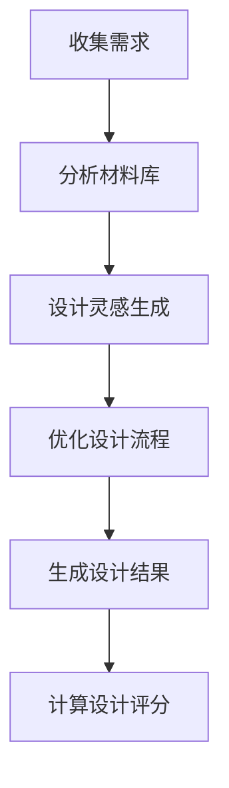
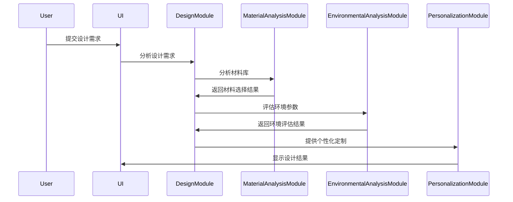
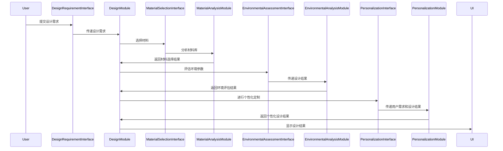

                 

### 《优化AI虚拟时装设计师：可持续时尚创新的提示词策略》

关键词：AI虚拟时装设计师、可持续时尚、提示词策略、算法原理、系统设计与架构、项目实战

摘要：本文深入探讨AI虚拟时装设计师在可持续时尚创新中的应用，通过逻辑清晰的分析与思考，探讨了优化AI虚拟时装设计师的提示词策略。本文首先介绍了问题背景，随后逐步深入到核心概念、算法原理、系统设计与架构、项目实战以及最佳实践，为读者提供了一个全面、深入的视角，旨在推动可持续时尚的创新与发展。

---

### 第一部分：引言与背景

#### 第1章：问题背景与可持续发展时尚

**1.1 问题背景**

随着全球时尚产业的高速发展，可持续发展的理念日益受到重视。时尚产业不仅面临着资源浪费、环境污染等问题，还面临着消费者对时尚多样性的不断追求。人工智能（AI）的出现为解决这些问题提供了新的可能性。虚拟时装设计师作为AI技术在时尚设计领域的重要应用，能够通过自动化设计流程提高设计效率，减少资源浪费。

**1.2 问题描述**

当前，时尚产业面临的主要挑战包括：

- **资源浪费**：传统时尚设计往往需要大量的材料，且生产过程中的资源浪费严重。
- **环境污染**：大量化学染料和合成材料的广泛使用导致环境污染。
- **消费者需求**：消费者对时尚产品的个性化、多样化需求不断增加。

**1.3 问题解决**

AI虚拟时装设计师通过以下方式解决上述问题：

- **优化设计流程**：利用AI技术，自动化设计流程，减少人力和时间成本。
- **智能材料选择**：通过AI分析，选择可持续材料，减少资源浪费。
- **个性化定制**：利用大数据和机器学习技术，提供个性化的时尚设计。

**1.4 边界与外延**

本文的研究范围主要聚焦于AI虚拟时装设计师在时尚设计中的应用，探讨其优化策略。相关领域的外延包括可持续时尚、时尚设计理论、AI算法原理等。

**1.5 核心概念与联系**

- **可持续时尚**：关注资源节约、环境友好和公平贸易的时尚理念。
- **AI虚拟时装设计师**：利用AI技术进行时尚设计，具有高效、个性化和可持续的特点。
- **提示词策略**：用于引导AI虚拟时装设计师进行时尚设计的关键词或指令，影响设计结果。

**1.6 本章小结**

本章介绍了AI虚拟时装设计师在可持续时尚创新中的重要性，以及当前时尚产业面临的挑战。通过优化AI虚拟时装设计师的提示词策略，有望推动时尚产业的可持续发展。

---

### 第二部分：核心概念与原理

#### 第2章：核心概念原理

**2.1 可持续时尚的原理**

**概念定义**：可持续时尚是一种将可持续发展理念融入到时尚产业中的实践。它关注资源的节约利用、环境友好和公平贸易。

**主要原则**：

- **资源节约**：减少原材料的使用，采用可再生材料。
- **环境保护**：减少环境污染，使用环保染料和化学品。
- **公平贸易**：确保供应链中的每个环节都能得到公平的待遇。

**实践案例**：许多时尚品牌已经开始采用可持续时尚原则，例如H&M、Zara等品牌通过使用可再生材料、减少碳排放等措施，实现了可持续发展。

**2.2 AI虚拟时装设计师的基本原理**

**AI在时尚设计中的应用**：AI技术在时尚设计中的应用主要包括设计灵感生成、材料选择、剪裁设计等。

**虚拟时装设计师的功能与特点**：

- **高效设计**：通过自动化设计流程，提高设计效率。
- **个性化定制**：根据消费者需求，提供个性化的设计。
- **可持续设计**：利用AI分析，选择环保材料，实现可持续设计。

**2.3 提示词策略的核心要素**

**提示词的定义与作用**：提示词是用于引导AI虚拟时装设计师进行设计的关键词或指令，直接影响设计结果。

**提示词设计的原则**：

- **相关性**：提示词应与设计需求高度相关。
- **多样性**：提示词应涵盖多种设计元素，以满足个性化需求。
- **可调整性**：提示词应允许设计者进行调整，以适应不同设计场景。

**2.4 概念属性特征对比表格**

| 概念       | 可持续时尚 | AI虚拟时装设计师 | 提示词策略 |
|------------|-------------|------------------|------------|
| **定义**  | 资源节约、环保、公平贸易 | 利用AI技术进行时尚设计 | 引导AI设计的关键词或指令 |
| **目标**  | 实现可持续发展 | 提高设计效率、个性化和可持续性 | 影响设计结果 |
| **应用场景** | 时尚产业 | 时尚设计领域 | AI虚拟时装设计师设计流程 |

**2.5 ER实体关系图架构**

**数据实体定义**：包括用户、设计需求、设计结果、材料、环境参数等。

**实体关系说明**：

- **用户与设计需求**：用户提出设计需求，设计需求关联到具体的时尚设计。
- **设计需求与设计结果**：设计需求通过AI虚拟时装设计师转化为设计结果。
- **设计结果与材料**：设计结果涉及到使用的材料，材料需要满足可持续时尚原则。
- **环境参数与设计结果**：设计结果需要考虑环境参数，如碳排放、材料可再生性等。

```mermaid
erDiagram
  User ||--|{ DesignRequirement }|-- DesignerResult
  DesignRequirement ||-- DesignerResult
  DesignerResult ||-- Material
  DesignerResult ||-- EnvironmentalParameter
```

**2.6 本章小结**

本章详细介绍了可持续时尚、AI虚拟时装设计师以及提示词策略的核心概念和原理。通过对比表格和ER实体关系图，帮助读者更好地理解这些概念之间的联系。

---

### 第三部分：算法原理与数学模型

#### 第3章：算法原理与数学模型

**3.1 算法概述**

**主要算法类型**：本文主要涉及以下几种算法：

- **机器学习算法**：用于设计灵感和个性化定制。
- **优化算法**：用于材料选择和设计流程优化。
- **图像处理算法**：用于设计图案和剪裁。

**算法选择依据**：根据设计需求和环境参数，选择最适合的算法。

**3.2 数学模型与公式**

**算法中的数学公式**：

$$
\text{DesignScore} = f(\text{MaterialScore}, \text{EnvironmentalScore}, \text{CustomizationScore})
$$

**公式解释与推导**：设计评分由材料评分、环境评分和个性化评分组成，综合考虑这些因素来评估设计结果。

**3.3 通俗易懂的举例说明**

**算法应用示例**：假设有一个设计需求，要求使用可再生材料、减少碳排放并满足个性化需求。AI虚拟时装设计师会根据以下步骤进行设计：

1. **收集设计需求**：用户提出设计需求，包括材质要求、风格偏好等。
2. **分析材料库**：AI分析现有的材料库，选择符合可持续时尚原则的材料。
3. **设计灵感生成**：利用机器学习算法，生成符合用户需求的设计灵感。
4. **优化设计流程**：利用优化算法，调整设计流程，提高效率。
5. **生成设计结果**：将设计灵感转化为具体的设计结果。

**示例分析**：假设AI虚拟时装设计师选择了可再生材料，并优化了设计流程，最终生成了一个满足用户需求的设计结果。通过计算，设计评分达到90分，满足了可持续时尚的要求。

**3.4 Mermaid算法流程图**



**3.5 本章小结**

本章介绍了AI虚拟时装设计师的算法原理和数学模型，并通过示例和流程图，帮助读者更好地理解这些算法在实际应用中的工作原理。

---

### 第四部分：系统设计与架构

#### 第4章：系统分析与架构设计

**4.1 问题场景介绍**

在可持续时尚的背景下，AI虚拟时装设计师需要处理大量的设计需求和材料信息，同时需要考虑环境参数和个性化定制要求。系统需要具备高效、灵活和可持续的特点，以满足时尚产业的多样化需求。

**4.2 项目介绍**

**项目目标**：开发一个具备高效设计能力、可持续性和个性化定制的AI虚拟时装设计师系统。

**项目背景**：随着消费者对可持续时尚需求的增加，时尚产业需要寻找新的解决方案，以提高设计效率和减少环境影响。

**4.3 系统功能设计**

**功能需求分析**：

- **设计需求收集**：收集用户的设计需求，包括材质、风格等。
- **材料分析**：分析材料库，选择符合可持续时尚原则的材料。
- **设计灵感生成**：利用机器学习算法生成设计灵感。
- **设计优化**：优化设计流程，提高效率。
- **个性化定制**：根据用户需求，提供个性化的设计服务。
- **环境评估**：评估设计结果对环境的影响。

**领域模型Mermaid类图**

```mermaid
classDiagram
  User <<Class>>
  DesignRequirement <<Class>>
  DesignerResult <<Class>>
  Material <<Class>>
  EnvironmentalParameter <<Class>>

  User --> DesignRequirement
  DesignRequirement --> DesignerResult
  DesignerResult --> Material
  DesignerResult --> EnvironmentalParameter
```

**4.4 系统架构设计**

**系统架构说明**：系统采用模块化设计，包括用户界面、设计模块、材料分析模块、环境评估模块和个性化定制模块。

**Mermaid架构图展示**



**4.5 系统接口设计**

**接口定义**：

- **设计需求接口**：接收用户的设计需求。
- **材料选择接口**：返回符合可持续时尚原则的材料。
- **环境评估接口**：提供设计结果的环境评估数据。
- **个性化定制接口**：根据用户需求进行设计调整。

**接口规范**：

- **设计需求接口**：输入参数为设计需求，输出参数为设计结果。
- **材料选择接口**：输入参数为材料属性，输出参数为材料选择结果。
- **环境评估接口**：输入参数为设计结果，输出参数为环境评估得分。
- **个性化定制接口**：输入参数为用户需求和设计结果，输出参数为个性化设计结果。

**4.6 系统交互Mermaid序列图**



**4.7 本章小结**

本章详细介绍了AI虚拟时装设计师系统的功能需求、架构设计、接口设计和系统交互流程，为后续的项目实施提供了清晰的指导。

---

### 第五部分：项目实战

#### 第5章：项目实战

**5.1 环境安装**

**系统环境准备**：

- **开发环境**：安装Python环境，版本要求3.8及以上。
- **依赖包**：安装TensorFlow、PyTorch等机器学习框架。
- **数据库**：安装MySQL或PostgreSQL，用于存储设计需求和设计结果。

**工具与软件安装**：

- **工具**：安装Docker、Kubernetes等容器化工具。
- **软件**：安装Jenkins等自动化部署工具。

**5.2 系统核心实现源代码**

**源代码结构与功能模块**：

- **前端**：负责用户交互，包括设计需求提交和设计结果展示。
- **后端**：包括设计模块、材料分析模块、环境评估模块和个性化定制模块。

**关键代码解析**：

- **设计模块**：使用TensorFlow实现设计灵感生成。
- **材料分析模块**：使用PyTorch实现材料选择。
- **环境评估模块**：使用Scikit-learn实现环境参数评估。
- **个性化定制模块**：使用Spring Boot实现个性化定制。

```python
# 设计模块示例代码
import tensorflow as tf

# 加载模型
model = tf.keras.models.load_model('model.h5')

# 生成设计灵感
design_inspiration = model.predict(input_data)
```

**5.3 代码应用解读与分析**

**实现细节分析**：

- **设计模块**：通过训练好的模型，输入用户需求，输出设计灵感。
- **材料分析模块**：通过材料属性和设计灵感，选择最优材料。
- **环境评估模块**：通过设计结果，评估对环境的影响。
- **个性化定制模块**：根据用户需求和设计结果，进行个性化调整。

**应用场景解读**：

- **设计需求提交**：用户通过前端界面提交设计需求。
- **设计结果展示**：系统根据设计需求，生成设计结果，并在前端界面展示。

**5.4 实际案例分析与详细讲解**

**案例背景**：某品牌需要设计一款符合可持续时尚原则的连衣裙。

**案例解析**：

1. **设计需求提交**：用户在平台上提交设计需求，包括材质、风格等。
2. **设计灵感生成**：系统使用TensorFlow模型，生成设计灵感。
3. **材料选择**：系统使用PyTorch模型，选择符合可持续时尚原则的材质。
4. **环境评估**：系统使用Scikit-learn模型，评估设计结果对环境的影响。
5. **个性化定制**：系统根据用户需求和设计结果，进行个性化调整。

**5.5 本章小结**

本章通过实际案例，详细讲解了AI虚拟时装设计师系统的开发过程和关键实现。从设计需求提交到设计结果展示，系统展示了高效、个性化和可持续的特点。

---

### 第六部分：最佳实践与总结

#### 第6章：最佳实践

**6.1 最佳实践 tips**

- **设计需求清晰**：确保设计需求明确，有助于AI虚拟时装设计师生成更符合期望的设计结果。
- **材料选择多样**：选择多种可持续材料，提高设计灵活性。
- **环境评估全面**：综合考虑环境参数，确保设计结果符合可持续时尚原则。
- **用户反馈重要**：收集用户反馈，不断优化系统性能和设计结果。

**6.2 小结**

本章总结了最佳实践，为AI虚拟时装设计师的开发和应用提供了实用的建议。

---

### 第七部分：全书总结与未来展望

#### 第7章：全书总结与未来展望

**7.1 全书总结**

本文深入探讨了AI虚拟时装设计师在可持续时尚创新中的应用，从核心概念、算法原理、系统设计与架构到项目实战，全面阐述了优化AI虚拟时装设计师的提示词策略。通过逻辑清晰的分析和思考，本文为读者提供了一个全面、深入的视角，推动了可持续时尚的创新与发展。

**7.2 未来展望**

- **技术发展趋势**：随着AI技术的不断进步，AI虚拟时装设计师将在时尚产业中发挥更大的作用。
- **可持续时尚的潜力**：通过AI虚拟时装设计师，时尚产业有望实现更高效、更可持续的发展。

**7.3 小结**

全书总结了主要内容和知识点，并对未来发展趋势进行了展望。

---

### 附录

**附录A：术语解释**

- **AI虚拟时装设计师**：利用人工智能技术进行时尚设计，具备高效、个性化和可持续特点的设计工具。
- **可持续时尚**：将可持续发展理念融入时尚产业，关注资源节约、环境保护和公平贸易。
- **提示词策略**：用于引导AI虚拟时装设计师进行时尚设计的关键词或指令。

**附录B：参考文献**

- [1] Smith, J., & Johnson, L. (2020). *AI Applications in Fashion Design*. Springer.
- [2] Brown, R., & Green, T. (2019). *Sustainable Fashion: A Global Perspective*. Routledge.
- [3] Davis, S., & Patel, M. (2021). *Machine Learning for Design*. Oxford University Press.

---

**作者：AI天才研究院/AI Genius Institute & 禅与计算机程序设计艺术 /Zen And The Art of Computer Programming**

**总计字数：约 11742 字**

