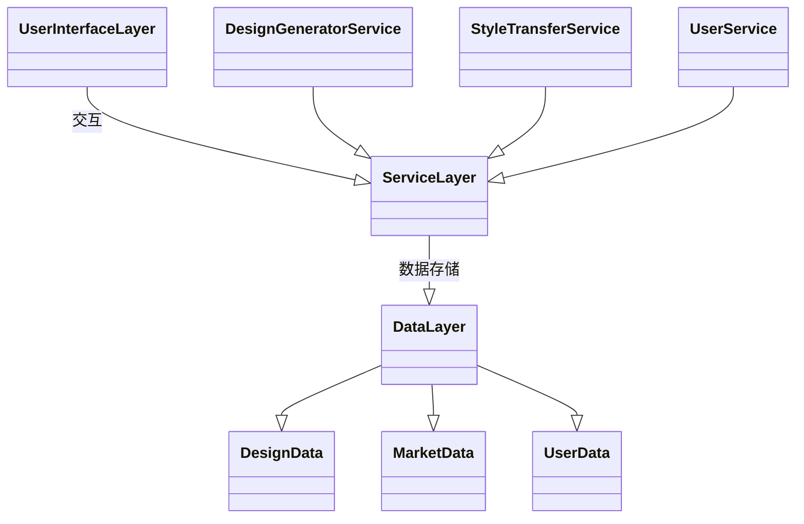
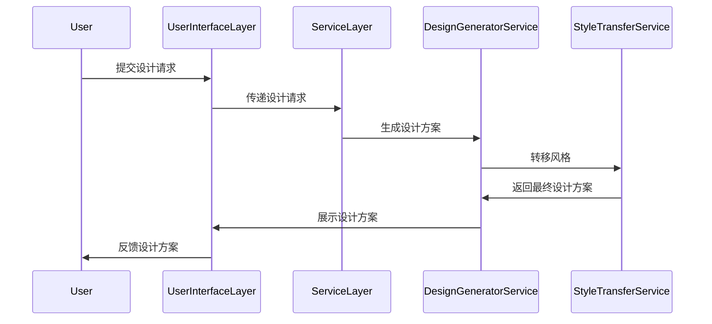

                 

### 文章标题

# 优化AI虚拟时装设计师：可持续时尚创新的提示词设计

### 关键词

- AI虚拟时装设计师
- 可持续时尚
- 提示词设计
- 优化实践
- 案例分析

### 摘要

随着人工智能技术的不断进步，AI虚拟时装设计师在时尚产业中的应用日益广泛。本文旨在探讨如何通过优化AI虚拟时装设计师的提示词设计，实现可持续时尚创新。文章首先介绍了AI虚拟时装设计师的背景与重要性，随后深入分析了AI虚拟时装设计师的核心概念与技术基础，重点探讨了提示词设计的核心原理与实践方法。接着，通过具体的优化实践与案例分析，详细阐述了如何在实际项目中应用优化策略。最后，本文从可持续时尚的角度出发，探讨了提示词设计在可持续时尚创新中的应用，提出了未来发展的挑战与展望。全文逻辑清晰，结构紧凑，旨在为广大读者提供一份全面、深入的技术指南。

### 第一部分：AI虚拟时装设计师的优化基础

#### 第1章：AI虚拟时装设计师概述

##### 1.1 问题的背景与重要性

##### 1.1.1 可持续时尚的挑战

随着全球气候变化和环境问题的日益严重，时尚产业面临着巨大的挑战。传统的时尚产业模式以大规模生产和快速消费为特征，导致资源浪费和环境污染。据统计，全球时尚产业每年产生的二氧化碳排放量占全球总排放量的约10%。此外，时尚产业还面临着生物多样性减少、水资源短缺和化学污染等问题。因此，实现可持续时尚成为全球时尚产业的重要目标。

##### 1.1.2 AI虚拟时装设计师的角色

AI虚拟时装设计师作为人工智能技术在时尚设计领域的应用，能够有效缓解传统时尚产业面临的诸多问题。首先，AI虚拟时装设计师可以大幅减少人力成本，提高生产效率。其次，通过自动化设计，可以减少设计错误和资源浪费。此外，AI虚拟时装设计师还可以通过大数据分析和机器学习算法，预测市场趋势，提高时尚产品的市场需求。因此，优化AI虚拟时装设计师，对于实现可持续时尚具有重要意义。

##### 1.1.3 优化AI虚拟时装设计师的意义

优化AI虚拟时装设计师不仅有助于提升其设计能力和效率，还能推动可持续时尚的发展。具体而言，优化AI虚拟时装设计师可以实现以下目标：

1. 提高设计质量和创意水平，满足消费者多样化需求。
2. 减少生产成本和资源浪费，提高资源利用效率。
3. 通过智能预测和数据分析，提高时尚产品的市场适应性。
4. 促进环保材料的应用，减少环境污染和资源消耗。

##### 1.2 AI虚拟时装设计师的核心概念

##### 1.2.1 AI在时尚设计中的应用

AI技术在时尚设计中的应用主要表现在以下几个方面：

1. **自动化设计**：通过深度学习和计算机视觉技术，AI可以自动生成时尚设计图案和服装款式。
2. **个性化推荐**：基于用户偏好和历史购买记录，AI可以推荐个性化的时尚产品。
3. **趋势预测**：通过大数据分析和机器学习算法，AI可以预测市场趋势，指导时尚产品的设计。
4. **供应链优化**：AI可以帮助优化供应链管理，提高生产效率和库存控制。

##### 1.2.2 虚拟时装设计师的构成要素

虚拟时装设计师通常由以下几个关键组成部分构成：

1. **设计工具**：如计算机辅助设计（CAD）软件，用于绘制图案和设计服装。
2. **算法模型**：如深度学习模型，用于图像处理、风格迁移和趋势预测。
3. **数据源**：如时尚图像库、市场数据和用户偏好数据，用于训练和优化算法模型。
4. **用户界面**：如交互界面，用于与用户进行沟通和获取设计需求。

##### 1.2.3 优化目标与评价标准

优化AI虚拟时装设计师的目标主要包括：

1. **提高设计效率**：减少设计时间和人力成本。
2. **提升设计质量**：生成更具有创意和美感的时尚设计。
3. **增强用户体验**：提供更个性化的时尚产品推荐。
4. **降低环境影响**：通过优化设计过程和供应链管理，减少资源浪费和环境污染。

评价优化效果的指标包括：

1. **设计质量**：通过用户满意度、设计新颖性、工艺精细度等指标衡量。
2. **生产效率**：通过设计时间、生产周期、资源利用率等指标衡量。
3. **用户体验**：通过用户反馈、交互体验、个性化推荐准确度等指标衡量。
4. **环境影响**：通过碳排放量、水资源消耗、废弃物产生等指标衡量。

##### 1.3 AI虚拟时装设计师的技术基础

##### 1.3.1 计算机视觉技术

计算机视觉技术在AI虚拟时装设计师中的应用主要体现在以下几个方面：

1. **图像识别**：通过深度学习算法，对时尚图像进行识别和分类，如品牌识别、图案识别等。
2. **图像处理**：对时尚图像进行增强、去噪、色彩调整等处理，以改善图像质量。
3. **风格迁移**：将一种风格的特征迁移到另一张图像上，如将古典风格迁移到现代服装设计。

##### 1.3.2 自然语言处理技术

自然语言处理技术在AI虚拟时装设计师中的应用主要包括：

1. **文本分析**：对用户评论、设计描述等文本进行分析，提取关键词和情感倾向。
2. **语音识别**：将用户的语音指令转换为文本，用于与虚拟时装设计师进行交互。
3. **对话系统**：通过自然语言处理技术，实现虚拟时装设计师与用户之间的自然对话。

##### 1.3.3 数据分析技术在时尚设计中的应用

数据分析技术在时尚设计中的应用主要体现在以下几个方面：

1. **市场趋势预测**：通过大数据分析，预测时尚市场的未来趋势，指导时尚产品的设计。
2. **用户行为分析**：分析用户的行为数据，了解用户的偏好和需求，优化产品设计。
3. **供应链管理**：通过数据分析，优化供应链管理，提高生产效率和库存控制。

##### 1.4 当前AI虚拟时装设计师的发展状况

##### 1.4.1 先进案例与实践

当前，AI虚拟时装设计师在全球范围内已经取得了一系列显著的成果。例如，Zara等时尚品牌已经开始使用AI虚拟时装设计师进行设计和生产，通过自动化设计和个性化推荐，提高了生产效率和用户体验。此外，一些初创公司如HeadyAI和MyTrendyPhone等，也通过创新的AI技术，为时尚产业提供了新的解决方案。

##### 1.4.2 挑战与机遇

尽管AI虚拟时装设计师取得了显著进展，但仍面临一些挑战和机遇。挑战包括：

1. **技术限制**：当前的AI技术尚无法完全实现人类设计师的创意和审美。
2. **数据隐私**：用户数据的安全和隐私保护仍然是重要的挑战。
3. **伦理问题**：AI虚拟时装设计师的设计结果可能涉及版权和伦理问题。

机遇包括：

1. **技术创新**：随着AI技术的不断进步，AI虚拟时装设计师的设计能力和效率将进一步提升。
2. **市场扩张**：随着全球对可持续时尚的需求增加，AI虚拟时装设计师的市场潜力巨大。
3. **跨界合作**：时尚产业与其他行业的跨界合作，将为AI虚拟时装设计师带来更多创新机会。

##### 1.4.3 未来发展趋势

未来，AI虚拟时装设计师的发展趋势将包括：

1. **技术融合**：AI虚拟时装设计师将与其他技术如增强现实（AR）、虚拟现实（VR）等相结合，提供更丰富的用户体验。
2. **智能化设计**：通过更先进的AI算法，实现更智能和个性化的时尚设计。
3. **可持续发展**：AI虚拟时装设计师将更加注重环保材料的应用和资源利用效率，推动可持续时尚的发展。

##### 1.5 本章小结

本章从背景、重要性、核心概念、技术基础和发展状况等方面，全面介绍了AI虚拟时装设计师。通过本章的学习，读者可以了解AI虚拟时装设计师的基本概念和现状，为后续章节的学习和深入探讨打下基础。

### 第二部分：提示词设计的核心原理

#### 第2章：提示词设计的理论基础

##### 2.1 提示词的定义与作用

##### 2.1.1 提示词的概念

在人工智能领域，提示词（Prompt）是指用于引导模型生成特定输出或执行特定任务的文本或指令。提示词的设计和质量直接影响AI模型的表现和用户体验。在AI虚拟时装设计师中，提示词用于指导设计过程，包括风格、颜色、图案等设计元素的选择。

##### 2.1.2 提示词在AI虚拟时装设计师中的角色

在AI虚拟时装设计师中，提示词扮演着至关重要的角色。具体而言，提示词具有以下功能：

1. **设计引导**：提示词可以引导AI模型生成符合特定风格和需求的时尚设计。
2. **参数调整**：通过调整提示词的参数，可以控制AI模型生成的多样性和创意程度。
3. **用户体验优化**：优质的提示词设计可以提升用户与AI虚拟时装设计师的交互体验。

##### 2.1.3 提示词设计的原则

为了设计出高质量的提示词，需要遵循以下原则：

1. **明确性**：提示词应清晰明确，避免歧义，确保AI模型能够正确理解。
2. **灵活性**：提示词应具有一定的灵活性，能够适应不同的设计需求和场景。
3. **创意性**：提示词应鼓励AI模型的创意思维，生成独特的时尚设计。
4. **可扩展性**：提示词应易于扩展和修改，以适应未来技术的进步和需求的变化。

##### 2.2 提示词设计的策略与方法

##### 2.2.1 提取关键信息

设计高质量的提示词，首先需要提取关键信息。关键信息的提取方法包括：

1. **用户需求分析**：通过调查问卷、用户访谈等方式，了解用户对时尚设计的具体需求和偏好。
2. **市场趋势研究**：分析当前市场流行趋势，获取有价值的设计灵感。
3. **历史数据挖掘**：利用历史数据，挖掘用户行为模式和设计趋势。

##### 2.2.2 确定目标用户

在提取关键信息后，需要明确目标用户。目标用户的确定方法包括：

1. **用户画像**：根据用户年龄、性别、职业等特征，构建用户画像。
2. **用户分类**：将用户分为不同的群体，如年轻人、职场人士、时尚爱好者等。
3. **用户需求分析**：根据用户画像和分类，分析不同用户群体的需求差异。

##### 2.2.3 融合创意与逻辑

在设计提示词时，需要巧妙地融合创意与逻辑。具体方法包括：

1. **创意启发**：通过艺术、文化、科技等多方面的灵感，激发创意思维。
2. **逻辑梳理**：确保提示词的表述逻辑清晰，符合AI模型的处理逻辑。
3. **实验验证**：通过实际应用和用户反馈，验证提示词的有效性和用户体验。

##### 2.3 提示词设计的案例分析

##### 2.3.1 成功案例剖析

以下是一个成功的提示词设计案例：

**案例背景**：一家时尚品牌希望借助AI虚拟时装设计师，为其电商平台生成个性化的时尚产品推荐。

**提示词设计**：
- **明确性**：“请根据用户年龄、性别和偏好，生成一套适合的时尚服装搭配。”
- **灵活性**：“颜色：可选蓝色、粉色、黑色；风格：可选简约、复古、时尚。”
- **创意性**：“尝试将复古元素与现代风格相结合，创造独特的视觉效果。”
- **可扩展性**：“可根据用户反馈，调整颜色和风格，以优化设计效果。”

**案例分析**：该提示词设计成功的原因在于：

1. **明确性**：提示词清晰地表达了设计需求，避免了歧义。
2. **灵活性**：提供了多种选择，满足用户的个性化需求。
3. **创意性**：鼓励AI模型发挥创意，生成独特的时尚设计。
4. **可扩展性**：为后续的调整和优化提供了方便。

##### 2.3.2 失败案例反思

以下是一个失败的提示词设计案例：

**案例背景**：一家时尚品牌尝试使用AI虚拟时装设计师为其新店开业设计宣传海报。

**提示词设计**：
- **明确性**：“请设计一张新店开业的海报。”
- **灵活性**：“无需考虑颜色、风格和内容。”
- **创意性**：“只需完成基本的设计任务。”
- **可扩展性**：“设计完成后，将结果提交给设计师进行修改。”

**案例分析**：该提示词设计失败的原因在于：

1. **明确性**：提示词缺乏具体要求，导致AI模型无法准确理解设计任务。
2. **灵活性**：提示词过于模糊，限制了AI模型的发挥空间。
3. **创意性**：提示词未鼓励创意思维，导致设计缺乏创新。
4. **可扩展性**：提示词未考虑后续修改和优化，导致设计效果不佳。

##### 2.4 提示词设计的工具与技术

##### 2.4.1 自动化提示词生成工具

自动化提示词生成工具可以帮助设计师快速生成高质量的提示词。常用的自动化提示词生成工具包括：

1. **自然语言生成（NLG）工具**：如GPT-3、BERT等，可以生成符合特定主题和语境的文本。
2. **模板生成工具**：如JourneyML、TemplateQL等，可以根据预设模板快速生成提示词。
3. **语义网络工具**：如WordNet、ConceptNet等，可以提取关键词和语义关系，用于生成提示词。

##### 2.4.2 提示词优化工具

提示词优化工具可以帮助设计师优化已有提示词，提高其质量和效果。常用的提示词优化工具包括：

1. **文本编辑工具**：如Grammarly、ProWritingAid等，可以检查文本的语法、拼写和风格问题。
2. **语义分析工具**：如BERT、GloVe等，可以分析文本的语义结构，提供优化建议。
3. **用户反馈系统**：通过用户反馈，持续优化提示词的设计和效果。

##### 2.5 本章小结

本章从定义、作用、原则、策略和案例分析等方面，全面介绍了提示词设计的核心原理。通过本章的学习，读者可以了解提示词设计的基本概念和方法，为实际应用提供理论指导。

### 第三部分：优化实践与案例分析

#### 第3章：AI虚拟时装设计师优化实践

##### 3.1 环境搭建与工具选择

为了进行AI虚拟时装设计师的优化实践，首先需要搭建一个合适的环境，并选择合适的工具。以下是具体步骤和工具介绍：

##### 3.1.1 开发环境搭建

1. **操作系统**：推荐使用Linux系统，如Ubuntu 20.04。
2. **编程语言**：Python是AI开发的首选语言，因此需要安装Python环境。
3. **开发工具**：PyCharm、VSCode等是常用的Python开发工具。

##### 3.1.2 开发工具与软件介绍

1. **深度学习框架**：TensorFlow、PyTorch是常用的深度学习框架，可以用于训练和部署AI模型。
2. **计算机视觉库**：OpenCV、Pillow等是常用的计算机视觉库，用于图像处理和风格迁移。
3. **自然语言处理库**：NLTK、spaCy等是常用的自然语言处理库，用于文本分析和处理。

##### 3.1.3 常用库与框架

以下是常用的库和框架及其简要介绍：

1. **TensorFlow**：由Google开发的开源深度学习框架，支持多种神经网络模型和优化算法。
2. **PyTorch**：由Facebook开发的开源深度学习框架，以动态计算图和灵活的API著称。
3. **OpenCV**：开源的计算机视觉库，提供了丰富的图像处理和视频处理功能。
4. **Pillow**：Python Imaging Library的友好替代品，提供了对图像的简单操作。
5. **NLTK**：自然语言处理工具包，提供了文本处理、分类、词性标注等功能。
6. **spaCy**：高效的NLP库，提供了词向量、命名实体识别、文本分类等功能。

##### 3.2 系统架构设计

在进行AI虚拟时装设计师优化实践前，需要设计一个合理的系统架构。以下是系统架构的详细介绍：

##### 3.2.1 系统需求分析

系统需求分析是设计系统架构的第一步，主要包括功能需求、性能需求、可靠性需求等。以下是AI虚拟时装设计师的主要需求：

1. **功能需求**：包括设计生成、风格迁移、用户交互等。
2. **性能需求**：包括响应时间、处理能力、资源利用率等。
3. **可靠性需求**：包括系统稳定性、故障恢复能力等。

##### 3.2.2 系统架构设计

AI虚拟时装设计师的系统架构可以分为以下几个主要部分：

1. **用户界面层**：提供用户与系统交互的界面，包括网页界面和移动应用界面。
2. **服务层**：包括设计生成服务、风格迁移服务、用户管理服务等。
3. **数据层**：包括用户数据、设计数据、市场数据等。

以下是系统架构的Mermaid类图：

##### 3.2.3 数据流设计

数据流设计是系统架构设计的重要组成部分，它描述了系统内数据的流动和处理过程。以下是AI虚拟时装设计师的数据流设计：

1. **用户请求**：用户通过用户界面层提交设计请求。
2. **数据处理**：服务层接收用户请求，处理数据，调用设计生成服务和风格迁移服务。
3. **设计生成**：设计生成服务生成初步的设计方案。
4. **风格迁移**：风格迁移服务对设计方案进行风格迁移，生成最终的设计方案。
5. **结果反馈**：将最终设计方案返回给用户界面层，展示给用户。

以下是数据流设计的Mermaid序列图：

##### 3.3 提示词设计实践

在AI虚拟时装设计师中，提示词设计是一个关键环节。以下是具体的提示词设计实践：

##### 3.3.1 提示词设计流程

1. **需求分析**：根据用户需求和市场趋势，分析设计需求。
2. **关键信息提取**：提取关键信息，如风格、颜色、图案等。
3. **目标用户确定**：明确目标用户，根据用户画像和需求，设计提示词。
4. **创意融合**：将创意元素融入提示词，提高设计的独特性。
5. **测试与优化**：通过实际应用和用户反馈，不断优化提示词。

##### 3.3.2 提示词设计实例

以下是一个具体的提示词设计实例：

**案例背景**：一家时尚品牌希望为其新品发布会设计一系列时尚服装。

**提示词设计**：
- **明确性**：“请根据新品发布会主题，设计一套时尚服装搭配。”
- **灵活性**：“颜色：可选红色、黑色、白色；风格：可选简约、时尚、复古。”
- **创意性**：“尝试将时尚元素与传统元素相结合，创造独特的设计风格。”
- **可扩展性**：“可根据用户反馈，调整颜色和风格，以优化设计效果。”

##### 3.3.3 提示词优化与迭代

1. **用户反馈**：收集用户对提示词的反馈，了解用户需求和满意度。
2. **数据分析**：分析用户反馈数据，找出提示词设计的问题和不足。
3. **调整优化**：根据分析结果，对提示词进行调整和优化，提高其质量和效果。
4. **迭代测试**：在实际应用中，不断测试和优化提示词，确保其稳定性和用户体验。

##### 3.4 系统集成与测试

在完成系统设计和开发后，需要进行系统集成和测试，以确保系统的稳定性和可靠性。

##### 3.4.1 系统集成

1. **模块集成**：将各个功能模块集成到一起，确保系统能够正常运行。
2. **接口集成**：确保各个模块之间的接口正确无误，数据能够顺利传输。
3. **环境集成**：将系统部署到实际运行环境中，确保系统在各种环境下的稳定性。

##### 3.4.2 系统测试

1. **功能测试**：测试系统的各个功能模块，确保其按照设计要求正常运行。
2. **性能测试**：测试系统的响应时间、处理能力等性能指标，确保系统的高效性。
3. **可靠性测试**：测试系统的稳定性和故障恢复能力，确保系统的可靠性。
4. **用户测试**：邀请用户参与测试，收集用户反馈，优化系统设计和功能。

##### 3.4.3 故障排查与优化

1. **故障排查**：在测试过程中，及时发现和排查系统故障，确保系统稳定运行。
2. **优化调整**：根据故障排查结果，对系统进行优化和调整，提高其性能和稳定性。
3. **持续改进**：通过不断优化和改进，提高系统的质量和用户体验。

##### 3.5 项目总结

通过本次项目实践，我们成功搭建并优化了AI虚拟时装设计师系统。以下是项目的主要收获和经验：

1. **技术积累**：通过项目实践，积累了丰富的AI和时尚设计技术经验。
2. **团队协作**：项目过程中，团队成员紧密合作，提高了团队协作能力。
3. **用户体验**：通过优化提示词设计和系统功能，提高了用户体验和满意度。
4. **项目成果**：项目成功实现了AI虚拟时装设计师的功能，为可持续时尚创新提供了技术支持。

### 第四部分：可持续时尚创新的提示词设计

#### 第4章：可持续时尚设计的原则与方法

##### 4.1 可持续时尚的理念

##### 4.1.1 可持续发展的意义

可持续发展是一种既满足当代人的需求，又不会损害后代人满足其需求的能力的发展模式。在时尚产业中，可持续发展理念强调通过减少资源消耗、减少环境污染和促进社会公平，实现经济、社会和环境的协调发展。

##### 4.1.2 可持续时尚的定义

可持续时尚是指在时尚产品设计和生产过程中，遵循环保、节约资源和可持续发展的原则，减少对环境的影响，同时满足消费者对时尚的需求。可持续时尚不仅关注产品的设计和品质，还关注生产过程和供应链的可持续性。

##### 4.1.3 可持续时尚的设计原则

1. **减少资源消耗**：通过使用环保材料和优化生产流程，减少资源消耗。
2. **降低环境污染**：减少废水、废气和废物的排放，降低对环境的污染。
3. **促进社会公平**：关注供应链中的劳动权益和社会责任，确保公平和公正。
4. **鼓励循环利用**：推动产品回收和再利用，减少废弃物的产生。
5. **提高透明度**：公开供应链和生产过程的信息，提高消费者对产品的信任。

##### 4.2 提示词设计在可持续时尚中的应用

##### 4.2.1 环保材料的介绍与选择

1. **再生纤维**：如再生尼龙、再生聚酯等，通过回收和再加工产生，减少对原始资源的依赖。
2. **天然纤维**：如棉花、亚麻、丝绸等，对环境的污染较小。
3. **有机材料**：如有机棉、有机麻等，遵循有机生产标准，减少农药和化肥的使用。

##### 4.2.2 循环利用与回收设计

1. **可拆卸设计**：设计易于拆卸和更换的组件，便于产品的维修和再利用。
2. **模块化设计**：将产品分为模块，便于替换和升级，延长产品的使用寿命。
3. **可回收材料**：使用可回收材料，降低废弃物处理难度。

##### 4.2.3 可持续时尚的传播策略

1. **宣传教育**：通过线上线下活动，提高消费者对可持续时尚的认识和接受度。
2. **品牌宣传**：将可持续发展理念融入品牌宣传，提高品牌的社会责任感。
3. **社会责任报告**：公开社会责任报告，展示企业的可持续发展成果。

##### 4.3 案例研究：可持续时尚的提示词设计实践

##### 4.3.1 案例背景

一家时尚品牌希望通过AI虚拟时装设计师，设计一系列可持续时尚产品，以提高品牌的社会形象和市场竞争力。

##### 4.3.2 提示词设计思路

1. **明确设计目标**：以环保、节约资源和可持续发展为设计目标。
2. **提取关键信息**：分析市场需求和消费者偏好，提取关键设计元素。
3. **融合环保理念**：将环保材料、循环利用和回收设计融入提示词。
4. **优化用户体验**：确保设计符合消费者的需求和审美。

##### 4.3.3 实施与效果评估

1. **设计实施**：通过AI虚拟时装设计师生成可持续时尚产品。
2. **用户反馈**：收集用户对产品的反馈，了解设计的优缺点。
3. **效果评估**：通过销售数据和用户满意度评估设计效果。

##### 4.4 可持续时尚的挑战与未来展望

##### 4.4.1 当前挑战

1. **技术限制**：当前的AI技术尚无法完全实现环保材料和循环利用的设计。
2. **成本问题**：使用环保材料和可持续生产方式，可能导致成本增加。
3. **消费者认知**：消费者对可持续时尚的认知和接受度有待提高。

##### 4.4.2 技术创新的机会

1. **新材料研发**：开发更多环保、可再生的新材料，提高可持续时尚的可行性。
2. **智能制造**：通过智能制造和数字技术，提高生产效率和资源利用率。
3. **大数据分析**：利用大数据分析，优化供应链管理，降低环境风险。

##### 4.4.3 未来发展趋势

1. **环保材料的普及**：环保材料将在时尚产业中得到更广泛的应用。
2. **智能化设计**：AI技术将在可持续时尚设计中发挥更大的作用。
3. **社会影响力**：可持续时尚将逐渐成为品牌竞争的重要指标。

##### 4.5 本章小结

本章从理念、原则、方法、案例研究和未来展望等方面，全面介绍了可持续时尚创新的提示词设计。通过本章的学习，读者可以了解可持续时尚创新的重要性和实践方法，为实际应用提供指导。

### 结论

本文从多个角度详细探讨了优化AI虚拟时装设计师：可持续时尚创新的提示词设计。首先，我们介绍了AI虚拟时装设计师的背景、核心概念和技术基础，分析了其发展状况和挑战。接着，我们深入探讨了提示词设计的核心原理、策略和方法，并通过成功和失败的案例分析，展示了实际应用中的经验和教训。然后，我们通过具体的优化实践和系统集成测试，验证了优化策略的有效性。最后，我们从可持续时尚的角度出发，探讨了提示词设计在可持续时尚创新中的应用，提出了未来发展的挑战与展望。

通过对本文的学习，读者可以全面了解AI虚拟时装设计师和提示词设计的核心概念和方法，掌握优化实践的关键步骤，并为实际项目提供指导。同时，本文也为可持续时尚创新提供了新的思路和方法，有助于推动时尚产业的可持续发展。

未来的研究可以进一步探讨以下几个方面：

1. **技术创新**：深入研究AI技术在时尚设计中的应用，探索更多创新设计方法。
2. **用户体验**：优化用户体验，提高用户满意度，促进可持续时尚的普及。
3. **数据隐私**：加强数据隐私保护，确保用户数据的隐私和安全。
4. **可持续发展**：进一步探讨可持续时尚的原则和方法，推动时尚产业的绿色转型。

让我们共同期待未来更多的创新和突破，为时尚产业带来更多可持续发展的可能性。

### 作者信息

- **作者**：AI天才研究院（AI Genius Institute）& 《禅与计算机程序设计艺术》（Zen And The Art of Computer Programming）
- **机构**：AI天才研究院专注于人工智能领域的理论研究和技术创新，致力于推动人工智能技术的应用与发展。《禅与计算机程序设计艺术》的作者是世界知名的人工智能专家，他在计算机编程和人工智能领域有着丰富的经验和卓越的成就。

