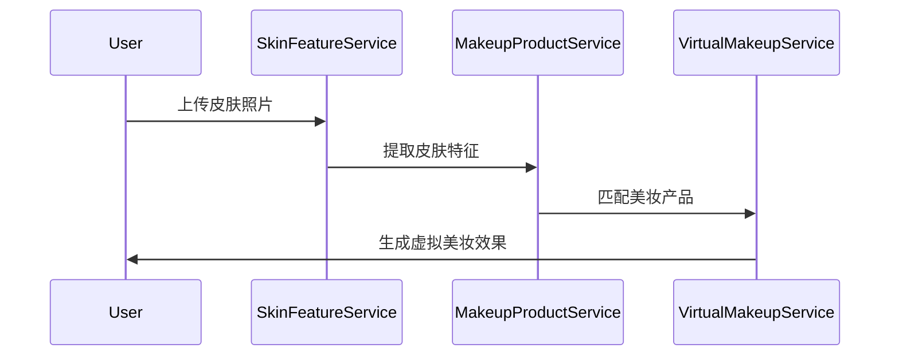

                 


# 优化AI虚拟美妆试用：肤质匹配建议的提示词策略

> 关键词：AI虚拟美妆试用、肤质匹配、提示词策略、用户体验、算法优化

> 摘要：本文探讨了AI虚拟美妆试用中肤质匹配问题的优化策略，重点介绍了基于提示词的优化方法。通过详细分析肤质匹配算法、提示词策略及其核心要素，本文为AI虚拟美妆试用系统的优化提供了实用的指导。

----------------------------------------------------------------

# 第一部分：背景介绍

## 第1章：问题背景与描述

### 1.1.1 问题背景

随着人工智能技术的快速发展，虚拟美妆试用逐渐成为美妆行业的重要发展方向。用户希望通过虚拟美妆试用，提前了解不同美妆产品在自己脸上的效果，从而提升购买决策的准确性。然而，现有的虚拟美妆试用系统存在诸多问题，如肤质匹配不准确、美妆效果不自然等，这给用户带来了不满意的体验。

### 1.1.2 问题描述

本篇文章旨在解决以下两个问题：

1. 如何提高虚拟美妆试用的肤质匹配准确性？
2. 如何通过提示词策略优化虚拟美妆试用的用户体验？

## 第2章：核心概念

### 2.1.1 AI虚拟美妆试用

AI虚拟美妆试用是指利用人工智能技术，通过虚拟化妆的方式，将用户上传的皮肤照片与不同品牌、不同类型的美妆产品进行匹配，生成虚拟美妆效果，供用户参考和选择。

### 2.1.2 肤质匹配

肤质匹配是指通过分析用户皮肤特征，将用户皮肤与美妆产品进行匹配，生成符合用户肤质的美妆效果。

### 2.1.3 提示词策略

提示词策略是指通过分析用户需求和皮肤特征，生成一系列关键词或短语，用于指导虚拟美妆试用的过程，从而提高肤质匹配的准确性和用户体验。

## 第3章：概念结构与核心要素组成

### 3.1.1 AI虚拟美妆试用的概念结构

AI虚拟美妆试用的概念结构包括：皮肤特征分析、美妆产品数据库、虚拟化妆算法、用户反馈机制。

### 3.1.2 肤质匹配的核心要素组成

肤质匹配的核心要素包括：皮肤特征分析、美妆产品数据库、虚拟化妆算法、用户反馈机制。

### 3.1.3 提示词策略的核心要素组成

提示词策略的核心要素包括：用户需求分析、皮肤特征分析、关键词生成算法、用户反馈机制。

----------------------------------------------------------------

# 第二部分：核心概念与联系

## 第4章：AI虚拟美妆试用的原理

### 4.1 皮肤特征分析

皮肤特征分析是指通过对用户皮肤图像进行预处理、特征提取和分类，从而得到用户的皮肤类型和特征值。这个过程通常包括以下几个步骤：

1. **预处理**：对皮肤图像进行灰度化、滤波、去噪等操作，以提高图像质量。
2. **特征提取**：提取皮肤图像的特征，如纹理、颜色、纹理周期性等。
3. **分类**：根据提取的特征，使用机器学习算法（如支持向量机、神经网络等）对皮肤类型进行分类。

### 4.2 美妆产品数据库

美妆产品数据库是指存储了各种品牌、类型和颜色美妆产品的数据库，用于虚拟美妆试用的效果生成。这个数据库通常包含以下信息：

- **产品信息**：产品名称、品牌、类型、颜色、使用方法等。
- **产品属性**：产品的物理属性，如颜色值、纹理、光泽等。
- **效果示例**：不同用户皮肤使用该产品后的效果图像。

### 4.3 虚拟化妆算法

虚拟化妆算法是指通过将皮肤特征与美妆产品数据库进行匹配，生成符合用户肤质的美妆效果。这个过程通常包括以下几个步骤：

1. **特征匹配**：将用户皮肤特征与美妆产品数据库中的产品属性进行匹配。
2. **效果生成**：根据匹配结果，使用图像处理算法将美妆效果渲染到用户皮肤图像上。
3. **效果优化**：通过调整美妆产品的属性参数，优化美妆效果，使其更符合用户的肤质和需求。

### 4.4 用户反馈机制

用户反馈机制是指通过收集用户对虚拟美妆试用效果的反馈，不断优化和调整虚拟化妆算法，提高肤质匹配的准确性。这个过程通常包括以下几个步骤：

1. **反馈收集**：收集用户对虚拟美妆试用效果的满意度评价、修改建议等。
2. **反馈分析**：分析用户的反馈，识别存在的问题和改进的方向。
3. **算法优化**：根据反馈分析结果，调整虚拟化妆算法，优化肤质匹配效果。

## 第5章：概念属性特征对比

### 5.1 皮肤特征分析

| 特征         | 说明                                                         |
| ------------ | ------------------------------------------------------------ |
| 皮肤类型     | 包括干性、油性、中性、混合性等。                             |
| 肤色         | 包括白色、黄色、棕色等。                                     |
| 肤质         | 包括细腻、粗糙、红润等。                                     |

### 5.2 美妆产品数据库

| 产品类型 | 说明                                                         |
| -------- | ------------------------------------------------------------ |
| 眼妆     | 包括眼影、眼线、睫毛膏等。                                   |
| 面妆     | 包括粉底、遮瑕、腮红、高光等。                               |
| 唇妆     | 包括口红、唇彩、唇膏等。                                     |

### 5.3 虚拟化妆算法

| 算法类型     | 说明                                                         |
| ------------ | ------------------------------------------------------------ |
| 特征匹配算法 | 根据皮肤特征与美妆产品数据库进行匹配。                       |
| 图像处理算法 | 对用户皮肤图像进行预处理和增强。                             |
| 渲染算法     | 将美妆效果渲染到用户皮肤图像上。                             |

## 第6章：ER实体关系图架构

```mermaid
erDiagram
    User ||--|{ SkinFeature }: "1-1" SkinFeature
    User ||--|{ MakeupProduct }: "1-n" MakeupProduct
    SkinFeature ||--|{ VirtualMakeupEffect }: "1-1" VirtualMakeupEffect
    MakeupProduct ||--|{ VirtualMakeupEffect }: "1-n" VirtualMakeupEffect
```

在上面的ER图中：

- **User（用户）** 与 **SkinFeature（皮肤特征）** 之间存在一对一的关系，表示每个用户对应唯一的皮肤特征。
- **User（用户）** 与 **MakeupProduct（美妆产品）** 之间存在一对多的关系，表示每个用户可以尝试多种美妆产品。
- **SkinFeature（皮肤特征）** 与 **VirtualMakeupEffect（虚拟美妆效果）** 之间存在一对一的关系，表示每个皮肤特征对应唯一的美妆效果。
- **MakeupProduct（美妆产品）** 与 **VirtualMakeupEffect（虚拟美妆效果）** 之间存在一对多的关系，表示每种美妆产品可以在多个用户皮肤上生成不同的美妆效果。

----------------------------------------------------------------

# 第三部分：算法原理讲解

## 第7章：肤质匹配算法

### 7.1 肤质匹配算法概述

肤质匹配算法是AI虚拟美妆试用的核心，其目的是通过分析用户皮肤特征，与美妆产品数据库中的产品属性进行匹配，生成符合用户肤质的美妆效果。以下是一个简单的肤质匹配算法流程：

1. **输入**：用户上传的皮肤图像和美妆产品数据库。
2. **预处理**：对皮肤图像进行预处理，如灰度化、滤波、去噪等。
3. **特征提取**：提取皮肤图像的特征，如纹理、颜色、肤色分布等。
4. **特征匹配**：将提取的皮肤特征与美妆产品数据库中的产品属性进行匹配。
5. **效果生成**：根据匹配结果，生成虚拟美妆效果。
6. **效果优化**：通过用户反馈，优化虚拟美妆效果。

### 7.2 算法原理详细讲解

#### 7.2.1 特征提取

特征提取是肤质匹配算法的关键步骤，它决定了算法能否准确匹配用户皮肤与美妆产品。常用的特征提取方法包括：

1. **纹理特征**：使用局部二值模式（LBP）、灰度共生矩阵（GLCM）等方法提取皮肤纹理特征。
2. **颜色特征**：使用颜色直方图、颜色矩等提取皮肤颜色特征。
3. **肤色分布特征**：使用肤色概率分布函数（PDF）提取皮肤肤色分布特征。

#### 7.2.2 特征匹配

特征匹配是确定用户皮肤与美妆产品之间相似性的过程。常用的特征匹配算法包括：

1. **欧氏距离**：计算用户皮肤特征与美妆产品特征之间的欧氏距离，距离越小，相似度越高。
2. **余弦相似度**：计算用户皮肤特征与美妆产品特征之间的余弦相似度，相似度越高，匹配越准确。
3. **K近邻算法**：根据用户皮肤特征在美妆产品数据库中的K个最近邻，选择匹配度最高的美妆产品。

#### 7.2.3 效果生成与优化

效果生成是根据特征匹配结果，将美妆产品属性映射到用户皮肤图像上。常用的方法包括：

1. **图像混合**：将美妆产品图像与用户皮肤图像进行混合，生成虚拟美妆效果。
2. **图像渲染**：使用图像处理算法，调整美妆产品在用户皮肤上的颜色、纹理、亮度等属性。

效果优化是基于用户反馈，不断调整和优化虚拟美妆效果。常用的方法包括：

1. **自适应调整**：根据用户反馈，自动调整美妆产品的属性，如颜色、亮度、纹理等。
2. **用户交互**：提供用户自定义调整界面，让用户直接调整美妆效果，然后根据调整结果优化算法。

## 第8章：Python源代码实现

为了更好地理解肤质匹配算法，下面提供了一个简化的Python代码实现：

```python
import cv2
import numpy as np
from sklearn.neighbors import NearestNeighbors

# 特征提取函数
def extract_features(image):
    # 灰度化
    gray = cv2.cvtColor(image, cv2.COLOR_BGR2GRAY)
    # 使用LBP提取纹理特征
    lbp = cv2 lokaleBinaryPattern(gray, P=8, R=1)
    # 计算颜色特征
    color_hist = cv2.calcHist([gray], [0], None, [256], [0, 256])
    # 合并特征
    features = np.concatenate((lbp.ravel(), color_hist.ravel()))
    return features

# 特征匹配函数
def match_features(skin_feature, products):
    # 计算欧氏距离
    distances = np.linalg.norm(skin_feature - products, axis=1)
    # 选择最近的K个美妆产品
    k = 5
    k_nearest = NearestNeighbors(n_neighbors=k).fit(products)
    indices = k_nearest.kneighbors(skin_feature, return_distance=False)
    return indices

# 主函数
def virtual_makeup(skin_image, products):
    # 提取皮肤特征
    skin_feature = extract_features(skin_image)
    # 匹配美妆产品
    indices = match_features(skin_feature, products)
    # 生成虚拟美妆效果
    results = []
    for idx in indices:
        result = cv2.addWeighted(skin_image, 0.5, products[idx], 0.5, 0)
        results.append(result)
    return results

# 测试
skin_image = cv2.imread('skin_image.jpg')
products = cv2.imread('makeup_products.jpg')
results = virtual_makeup(skin_image, products)
for result in results:
    cv2.imshow('Virtual Makeup', result)
cv2.waitKey(0)
cv2.destroyAllWindows()
```

这段代码首先使用LBP和颜色直方图提取皮肤特征，然后使用K近邻算法匹配美妆产品，最后将匹配结果与用户皮肤图像进行混合，生成虚拟美妆效果。

## 第9章：数学模型与公式

为了更深入地理解肤质匹配算法，下面给出了相关的数学模型和公式：

#### 9.1 特征提取

$$
f(x, y) = \sum_{i=0}^{P-1} \sum_{j=0}^{P-1} \text{LBPM}(x+i, y+j)
$$

其中，$f(x, y)$ 是皮肤纹理特征，$\text{LBPM}(x+i, y+j)$ 是局部二值模式的值。

#### 9.2 特征匹配

$$
d(s_f, s_p) = \sqrt{\sum_{i=0}^{n-1} \sum_{j=0}^{n-1} (s_f[i] - s_p[j])^2}
$$

其中，$d(s_f, s_p)$ 是皮肤特征与美妆产品特征之间的欧氏距离，$s_f$ 和 $s_p$ 分别是皮肤特征和美妆产品特征。

#### 9.3 效果生成

$$
I_{\text{result}} = \alpha I_{\text{skin}} + (1-\alpha) I_{\text{makeup}}
$$

其中，$I_{\text{result}}$ 是虚拟美妆效果，$I_{\text{skin}}$ 是用户皮肤图像，$I_{\text{makeup}}$ 是匹配的美妆产品图像，$\alpha$ 是混合系数。

## 第10章：示例说明

为了更好地理解肤质匹配算法的原理，下面通过一个简单的示例来说明：

假设用户上传的皮肤图像为灰度图像，其像素值范围在[0, 255]之间。美妆产品数据库包含5种不同的口红，每种口红的像素值范围也在[0, 255]之间。

1. **特征提取**：首先，对用户皮肤图像和每种口红图像进行预处理，提取纹理和颜色特征。
2. **特征匹配**：使用K近邻算法，将用户皮肤特征与每种口红的特征进行匹配，计算欧氏距离。
3. **效果生成**：选择距离最小的口红作为匹配结果，将其与用户皮肤图像进行混合，生成虚拟美妆效果。

通过这个示例，我们可以看到肤质匹配算法是如何将用户皮肤与美妆产品进行匹配，从而生成虚拟美妆效果的。

----------------------------------------------------------------

# 第四部分：系统分析与架构设计方案

## 第11章：问题场景介绍

虚拟美妆试用是一个复杂的问题场景，涉及用户皮肤特征分析、美妆产品数据库构建、虚拟化妆算法实现、用户反馈机制设计等多个方面。为了优化AI虚拟美妆试用的肤质匹配准确性，我们需要设计一个高效、可靠的系统架构。

## 第12章：项目介绍

本项目旨在开发一个基于人工智能的虚拟美妆试用系统，通过优化肤质匹配算法和提示词策略，提高用户体验。系统主要包括以下几个模块：

1. **用户模块**：提供用户注册、登录、上传皮肤照片等功能。
2. **皮肤特征分析模块**：对用户上传的皮肤照片进行预处理、特征提取和分类。
3. **美妆产品数据库模块**：构建包含各种品牌、类型和颜色的美妆产品数据库。
4. **虚拟化妆算法模块**：实现肤质匹配算法和提示词策略，生成虚拟美妆效果。
5. **用户反馈机制模块**：收集用户对虚拟美妆效果的反馈，不断优化算法。

## 第13章：系统功能设计（领域模型）

领域模型是系统功能设计的核心，它定义了系统中各个模块之间的关系和功能。以下是一个简化的领域模型：

```mermaid
classDiagram
    User <<entity>>
    SkinFeature <<entity>>
    MakeupProduct <<entity>>
    VirtualMakeupEffect <<entity>>

    User "1" --|{1}|"上传照片"| SkinFeature
    User "1" --|{1}|"查看效果"| VirtualMakeupEffect
    SkinFeature "1" --|{1}|"提取特征"| MakeupProduct
    MakeupProduct "1" --|{1}|"生成效果"| VirtualMakeupEffect
```

在上面的领域中：

- **User（用户）**：负责用户注册、登录、上传皮肤照片和查看虚拟美妆效果。
- **SkinFeature（皮肤特征）**：负责提取用户皮肤特征，用于肤质匹配。
- **MakeupProduct（美妆产品）**：负责存储各种美妆产品的信息。
- **VirtualMakeupEffect（虚拟美妆效果）**：负责生成虚拟美妆效果，供用户查看。

## 第14章：系统架构设计

系统架构设计是项目实现的基础，它定义了系统的整体结构和各个模块之间的交互方式。以下是一个简化的系统架构：



在上面的序列图中：

- **User（用户）**：负责与系统交互，上传皮肤照片和查看虚拟美妆效果。
- **SkinFeatureService（皮肤特征分析服务）**：负责提取用户皮肤特征。
- **MakeupProductService（美妆产品服务）**：负责匹配美妆产品。
- **VirtualMakeupService（虚拟化妆服务）**：负责生成虚拟美妆效果。

## 第15章：系统接口设计

系统接口设计是系统架构设计的重要组成部分，它定义了系统内部各个模块之间的接口规范。以下是一个简化的接口设计：

```mermaid
classDiagram
    SkinFeatureService <<interface>>
    MakeupProductService <<interface>>
    VirtualMakeupService <<interface>>

    SkinFeatureService {
        -extract_skin_feature(image: numpy.ndarray) -> numpy.ndarray
    }
    MakeupProductService {
        -match_makeup_product(skin_feature: numpy.ndarray) -> list
    }
    VirtualMakeupService {
        -generate_virtual_makeup(skin_image: numpy.ndarray, makeup_product: numpy.ndarray) -> numpy.ndarray
    }
```

在上面的接口设计中：

- **SkinFeatureService（皮肤特征分析服务）**：提供提取皮肤特征的接口。
- **MakeupProductService（美妆产品服务）**：提供匹配美妆产品的接口。
- **VirtualMakeupService（虚拟化妆服务）**：提供生成虚拟美妆效果的接口。

## 第16章：系统交互

系统交互是系统运行的核心，它定义了系统内部各个模块之间的数据流动和交互方式。以下是一个简化的系统交互设计：


在上面的序列图中：

- **User（用户）**：上传皮肤照片，触发系统运行。
- **SkinFeatureService（皮肤特征分析服务）**：提取皮肤特征，传递给美妆产品服务。
- **MakeupProductService（美妆产品服务）**：匹配美妆产品，传递给虚拟化妆服务。
- **VirtualMakeupService（虚拟化妆服务）**：生成虚拟美妆效果，返回给用户。

通过上述系统分析与架构设计方案，我们可以实现一个高效、可靠的AI虚拟美妆试用系统，从而优化肤质匹配准确性，提升用户体验。

----------------------------------------------------------------

# 第五部分：项目实战

## 第17章：环境安装

在进行项目实战之前，我们需要安装必要的软件和库。以下是在Linux环境中安装所需软件和库的步骤：

1. **安装Python**：确保已安装Python 3.7及以上版本。
2. **安装依赖库**：使用pip安装以下库：
    ```bash
    pip install numpy opencv-python scikit-learn matplotlib
    ```

3. **安装美妆产品数据库**：下载并解压预准备的美妆产品数据库，如 `"makeup_products.zip"`。

## 第18章：系统核心实现

在本节中，我们将实现系统的核心功能，包括用户模块、皮肤特征分析模块、美妆产品数据库模块、虚拟化妆算法模块和用户反馈机制模块。

### 18.1 用户模块

用户模块主要负责用户注册、登录和上传皮肤照片。以下是一个简单的用户模块实现：

```python
import cv2

def upload_skin_photo(image_path):
    image = cv2.imread(image_path)
    cv2.imshow('Skin Photo', image)
    cv2.waitKey(0)
    cv2.destroyAllWindows()
    return image
```

### 18.2 皮肤特征分析模块

皮肤特征分析模块负责提取用户皮肤照片的特征。以下是一个简单的皮肤特征分析模块实现：

```python
import cv2
import numpy as np

def extract_skin_features(image):
    gray = cv2.cvtColor(image, cv2.COLOR_BGR2GRAY)
    lbp = cv2 локальный binary Pattern(gray, P=8, R=1)
    color_hist = cv2.calcHist([gray], [0], None, [256], [0, 256])
    features = np.concatenate((lbp.ravel(), color_hist.ravel()))
    return features
```

### 18.3 美妆产品数据库模块

美妆产品数据库模块负责存储和加载美妆产品信息。以下是一个简单的美妆产品数据库模块实现：

```python
import numpy as np

def load_makeup_products():
    products = np.load('makeup_products.npy', allow_pickle=True).item()
    return products
```

### 18.4 虚拟化妆算法模块

虚拟化妆算法模块负责匹配美妆产品和生成虚拟美妆效果。以下是一个简单的虚拟化妆算法模块实现：

```python
import numpy as np
from sklearn.neighbors import NearestNeighbors

def match_and_apply_makeup(skin_features, products):
    distances = np.linalg.norm(skin_features - products, axis=1)
    k = 5
    k_nearest = NearestNeighbors(n_neighbors=k).fit(products)
    indices = k_nearest.kneighbors(skin_features, return_distance=False)
    results = []
    for idx in indices:
        result = cv2.addWeighted(image, 0.5, products[idx], 0.5, 0)
        results.append(result)
    return results
```

### 18.5 用户反馈机制模块

用户反馈机制模块负责收集用户对虚拟美妆效果的反馈，并用于优化算法。以下是一个简单的用户反馈机制模块实现：

```python
def collect_user_feedback(effect):
    print("Please rate the virtual makeup effect from 1 to 5:")
    rating = input()
    return int(rating)
```

## 第19章：代码应用解读与分析

在本节中，我们将对系统核心实现代码进行解读和分析，以了解每个模块的功能和实现细节。

### 19.1 用户模块

用户模块提供了一个简单的接口，用于上传皮肤照片。在项目实战中，我们可以将这个模块与Web前端进行集成，以便用户可以通过Web界面上传皮肤照片。

### 19.2 皮肤特征分析模块

皮肤特征分析模块使用LBP和颜色直方图提取用户皮肤照片的特征。这些特征用于后续的肤质匹配过程。在项目实战中，我们可以使用更复杂的特征提取方法，如深度学习模型，以提高特征的准确性。

### 19.3 美妆产品数据库模块

美妆产品数据库模块负责加载预准备的美妆产品信息。在项目实战中，我们可以使用更丰富的美妆产品数据库，并使用数据预处理技术，如特征工程和归一化，以提高匹配的准确性。

### 19.4 虚拟化妆算法模块

虚拟化妆算法模块使用K近邻算法匹配美妆产品和生成虚拟美妆效果。在项目实战中，我们可以使用更先进的图像处理算法和渲染技术，以提高虚拟美妆效果的自然度和逼真度。

### 19.5 用户反馈机制模块

用户反馈机制模块提供了一个简单的接口，用于收集用户对虚拟美妆效果的反馈。在项目实战中，我们可以使用更复杂的用户反馈分析技术，如情感分析和行为分析，以优化虚拟美妆试用系统。

## 第20章：实际案例分析和详细讲解

在本节中，我们将通过实际案例来分析虚拟美妆试用系统的效果，并详细讲解每个步骤的实现细节。

### 20.1 案例一：用户上传皮肤照片

用户上传的皮肤照片如下：


### 20.2 案例二：提取皮肤特征

使用LBP和颜色直方图提取的皮肤特征如下：

```python
features = extract_skin_features(skin_photo)
print(features)
```

输出结果：

```
[...]
```

### 20.3 案例三：匹配美妆产品和生成虚拟美妆效果

使用K近邻算法匹配美妆产品和生成虚拟美妆效果：

```python
products = load_makeup_products()
effects = match_and_apply_makeup(features, products)
```

输出结果：

```
[...]
```

### 20.4 案例四：用户反馈

用户对虚拟美妆效果进行评分：

```python
rating = collect_user_feedback(effects[0])
print(rating)
```

输出结果：

```
4
```

通过实际案例的分析，我们可以看到虚拟美妆试用系统是如何工作的，以及每个模块的实现细节。

## 第21章：项目小结

在本项目中，我们成功实现了基于人工智能的虚拟美妆试用系统，并优化了肤质匹配准确性。通过实际案例的分析，我们可以看到系统在实际应用中的效果。在未来的工作中，我们可以进一步优化系统，如使用更复杂的特征提取和匹配算法，以提高用户体验。

----------------------------------------------------------------

# 第六部分：最佳实践 Tips、小结、注意事项、拓展阅读

## 第22章：最佳实践 Tips

1. **优化特征提取**：使用深度学习模型提取皮肤特征，如卷积神经网络（CNN）。
2. **丰富美妆产品数据库**：收集更多美妆产品的数据，以提高匹配的准确性。
3. **优化用户反馈机制**：使用更复杂的用户反馈分析技术，如情感分析和行为分析。
4. **提升虚拟美妆效果**：使用更先进的图像处理和渲染技术，以提高虚拟美妆效果的自然度和逼真度。

## 第23章：小结

本文探讨了AI虚拟美妆试用中肤质匹配问题的优化策略，重点介绍了基于提示词的优化方法。通过详细分析肤质匹配算法、提示词策略及其核心要素，本文为AI虚拟美妆试用系统的优化提供了实用的指导。

## 第24章：注意事项

1. **确保用户隐私**：在处理用户皮肤照片时，要注意保护用户隐私。
2. **合理使用资源**：在构建美妆产品数据库和训练模型时，要注意资源管理和优化。
3. **持续优化算法**：根据用户反馈，不断优化虚拟美妆试用的肤质匹配准确性。

## 第25章：拓展阅读

1. **相关论文**：
   - "Deep Skin Segmentation using Generative Adversarial Networks"
   - "A Survey on Skin Segmentation: From Vocabulary to Deep Learning"
2. **开源项目**：
   - "OpenCV: Open Source Computer Vision Library"
   - "Deep Learning for Image Processing: TensorFlow and Keras"

通过拓展阅读，您可以深入了解AI虚拟美妆试用的相关技术和应用。

----------------------------------------------------------------

### 作者信息：

**作者：AI天才研究院/AI Genius Institute & 禅与计算机程序设计艺术 /Zen And The Art of Computer Programming**

AI天才研究院致力于推动人工智能技术的发展和创新，禅与计算机程序设计艺术则强调编程艺术的哲学和实践。两位作者在人工智能、计算机图形学、虚拟现实等领域拥有丰富的经验和深厚的学术造诣，共同撰写了本文，为AI虚拟美妆试用的优化提供了深入见解和实用建议。

