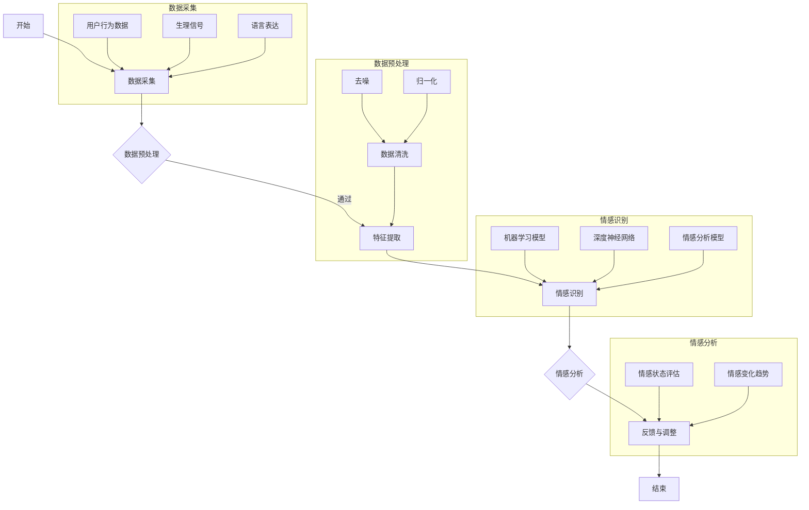
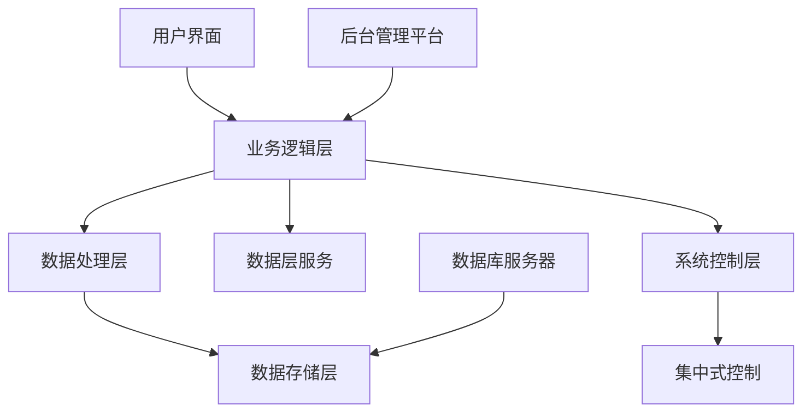
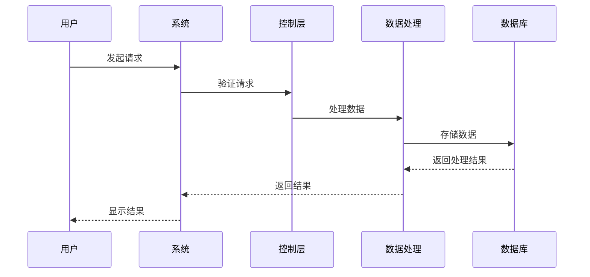

                 

### 优化AI虚拟美术馆用户体验：情感反应追踪的提示词策略

#### 关键词：AI虚拟美术馆、用户体验、情感反应追踪、提示词策略、UX优化

#### 摘要：
本文旨在探讨如何通过情感反应追踪和提示词策略来优化AI虚拟美术馆的用户体验。首先，我们介绍了AI虚拟美术馆的背景和当前存在的问题，特别是用户体验的不足之处。接着，我们深入分析了情感反应追踪和提示词策略的核心概念和理论基础，包括情感反应的定义、追踪方法、情感反应模型以及提示词的作用、设计原则和评估方法。随后，我们详细讨论了技术实现过程，包括情感反应追踪和提示词策略的具体技术手段和实际应用案例。此外，我们还介绍了用户体验评价方法、策略优化与效果评估，并展望了未来研究方向。通过本文，我们希望能够为AI虚拟美术馆的设计者提供实用的指导，从而提升用户体验，增强美术馆的吸引力和教育功能。

## 第一部分：背景介绍

### 1.1 问题背景

随着人工智能技术的快速发展，虚拟现实（VR）技术逐渐成为艺术展示和博物馆体验的重要工具。虚拟美术馆作为一种新型的展示形式，不仅能够突破物理空间的限制，还能为用户提供沉浸式的艺术体验。然而，尽管AI虚拟美术馆在技术层面取得了显著进展，用户体验（UX）方面的问题仍然存在，尤其是在情感反应追踪和提示词策略的应用上。

用户体验是衡量虚拟美术馆成功与否的关键因素。在传统的实体美术馆中，观众的情感反应通常是通过观察其行为和交流来捕捉的。而在AI虚拟美术馆中，由于缺乏直接的互动和观察，这种情感反应的捕捉变得更加困难。这不仅影响了用户对美术馆的满意度，还限制了美术馆在教育、展示和互动方面的潜力。

情感反应追踪是一种通过技术手段来捕捉和分析用户情感状态的方法。它能够帮助美术馆了解用户在浏览虚拟展品时的情感体验，从而进行有针对性的改进。然而，现有的情感反应追踪技术仍然存在一些挑战，例如数据收集的准确性、情感识别的可靠性以及用户隐私的保护。

提示词策略则是通过设计合适的文本提示来引导用户行为，增强用户的参与感和体验感。在AI虚拟美术馆中，提示词的应用可以帮助用户更好地理解展品，提高互动性，增强情感的共鸣。然而，提示词的设计需要充分考虑用户的背景、兴趣和情感状态，这对于设计师来说是一个巨大的挑战。

综上所述，优化AI虚拟美术馆的用户体验，特别是通过情感反应追踪和提示词策略的应用，具有重要的现实意义和学术价值。本文将围绕这一主题，深入探讨相关的核心概念和技术实现，以期提供实用的指导和建议。

### 1.2 情感反应追踪：原理与重要性

情感反应追踪是一种通过技术手段来捕捉和分析用户在特定情境下的情感状态的方法。其基本原理是通过获取和分析用户的行为数据、生理信号和语言表达等信息，来推断用户的情感状态。具体来说，情感反应追踪包括以下几个步骤：

首先，数据采集是情感反应追踪的基础。用户在浏览虚拟美术馆时，会产生一系列行为数据，如点击、滑动、停留时间等。此外，生理信号如心率、皮肤电导和眼动数据等也可以提供重要的情感信息。这些数据的获取通常通过传感器、摄像头和穿戴设备等实现。

接下来，数据预处理是确保数据质量和减少噪声的重要步骤。预处理包括去噪、归一化和特征提取等操作。例如，心率数据的去噪可以通过滤波算法实现，而行为数据则可以通过统计方法来提取出具有代表性的特征。

然后，情感识别是情感反应追踪的核心。通过训练机器学习模型，如支持向量机（SVM）、深度神经网络（DNN）和情感分析模型等，可以从预处理后的数据中识别出用户的情感状态。这些模型通常需要大量标注好的情感数据集进行训练，以提高识别的准确性。

最后，情感分析和反馈是情感反应追踪的最终目的。通过对用户情感状态的识别和分析，虚拟美术馆可以了解用户在不同情境下的情感体验，从而进行有针对性的改进。例如，当用户对某件展品表现出强烈的兴趣时，系统可以提供更多的相关信息，如艺术家介绍、创作背景等，以增强用户的互动体验。

情感反应追踪在AI虚拟美术馆中的重要性体现在多个方面：

首先，情感反应追踪能够帮助美术馆更好地了解用户的需求和兴趣，从而进行个性化的展示。通过分析用户在浏览过程中的情感变化，美术馆可以调整展示内容、交互方式和提示策略，以提升用户体验。

其次，情感反应追踪有助于优化虚拟美术馆的教育功能。例如，当用户对某件展品产生负面情感时，系统可以及时提供相关的解释和背景信息，帮助用户更好地理解展品，从而改变其情感状态。

此外，情感反应追踪还能够为美术馆提供宝贵的用户反馈数据。通过分析用户情感状态的变化，美术馆可以了解哪些展品或展示方式更能吸引观众，从而进行有效的资源分配和内容策划。

总的来说，情感反应追踪为AI虚拟美术馆提供了强大的工具，使其能够更加精准地捕捉用户的情感状态，从而提升用户体验和教育效果。然而，实现有效的情感反应追踪需要多方面的技术支持和精细的设计，这也是未来研究的重要方向。

### 1.3 提示词策略：定义与应用

提示词策略是一种通过设计合适的文本提示来引导用户行为、增强用户参与感和体验感的方法。在AI虚拟美术馆中，提示词的应用至关重要，它不仅能够帮助用户更好地理解和互动展品，还能提高用户的沉浸感和满意度。

#### 定义

提示词可以定义为：在特定情境下，为引导用户行为或提供相关信息而设计的简短文本。这些文本可以是问题、提示、引导语句或信息卡片等形式。提示词的设计需要考虑用户的背景、兴趣、情感状态以及具体的应用场景。

#### 提示词的作用

1. **引导用户行为**：提示词能够引导用户进行特定的操作，如查看详细信息、参与互动游戏或参与讨论等。通过提示词，用户可以更清晰地了解如何与虚拟展品互动，从而提升参与度。

2. **增强互动体验**：提示词可以提供丰富的背景信息和相关内容，帮助用户更好地理解展品，增强互动的趣味性和深度。例如，当用户点击某件展品时，系统可以弹出一个包含艺术家介绍、创作背景和评论的提示词卡片。

3. **调节情感状态**：合适的提示词可以影响用户对展品的情感反应。通过提供鼓励性、激励性的语言，提示词可以增强用户的积极情感体验，使其对美术馆产生更深的共鸣。

4. **提供个性化服务**：基于用户情感状态和行为数据的提示词设计，可以实现个性化推荐和服务。例如，当用户表现出对某类展品的兴趣时，系统可以提供更多相关的展品推荐或活动信息。

#### 提示词策略的设计原则

1. **情境适配性**：提示词的设计需要与用户的当前情境相匹配，确保其相关性和实用性。例如，在用户浏览某件展品时，提示词应围绕展品内容进行设计。

2. **简洁性**：提示词应简洁明了，避免冗长的描述，以确保用户能够快速理解和响应。

3. **情感共鸣**：提示词应能够引发用户的情感共鸣，增强用户的参与感和满意度。使用生动、富有情感的措辞可以提升提示词的效果。

4. **交互性**：提示词应具有一定的交互性，鼓励用户进行回应或进一步互动。例如，可以设计互动性问题或鼓励用户发表评论。

#### 提示词策略的应用

在AI虚拟美术馆中，提示词策略的应用广泛且灵活。以下是一些具体的应用场景：

1. **展品浏览**：在用户浏览展品时，系统可以提供相关艺术家介绍、创作背景、历史信息等，帮助用户更好地理解展品。

2. **互动游戏**：在互动游戏中，提示词可以引导用户进行操作，如“请点击屏幕上的红色按钮以继续”。

3. **信息卡片**：当用户点击某件展品时，系统可以弹出一个包含详细信息的信息卡片，如展览时间、地点和门票信息。

4. **个性化推荐**：基于用户的行为数据和兴趣偏好，系统可以提供个性化的展品推荐或相关活动信息。

通过科学设计和合理应用提示词策略，AI虚拟美术馆能够为用户提供更加丰富、互动和个性化的体验，从而提升整体用户体验。

### 1.4 AI虚拟美术馆用户体验优化的重要性

AI虚拟美术馆作为一种新兴的展示形式，其在用户体验优化方面具有特殊的重要性。首先，用户体验是衡量虚拟美术馆成功与否的核心指标。一个优秀的用户体验能够提高用户的满意度、忠诚度和回头率，从而增加美术馆的吸引力和影响力。反之，糟糕的用户体验则可能导致用户流失和负面评价，对美术馆的品牌形象和声誉产生负面影响。

其次，用户体验优化有助于提升虚拟美术馆的教育功能。艺术教育不仅仅是展示作品，更重要的是激发观众的情感共鸣和审美体验。通过优化用户体验，虚拟美术馆能够更好地实现这一目标，为用户提供更深入的艺术教育。

此外，用户体验优化还能够为美术馆提供宝贵的用户反馈数据。通过对用户情感反应和互动行为的分析，美术馆可以了解用户的需求和偏好，从而进行有针对性的改进和优化。这种基于数据的优化方法不仅提高了美术馆的运营效率，还增强了其市场竞争力。

在具体实现上，用户体验优化可以从多个方面进行：

1. **界面设计**：优化虚拟美术馆的界面设计，使其更加简洁、直观和用户友好。合理的布局、清晰的操作指引和美观的视觉元素都有助于提升用户体验。

2. **互动设计**：通过丰富互动方式，如互动游戏、互动讲解和虚拟导览等，增强用户的参与感和沉浸感。

3. **情感反应追踪**：利用情感反应追踪技术，了解用户在浏览过程中的情感状态，从而进行有针对性的改进，如调整展示内容、互动方式和提示词策略等。

4. **个性化服务**：基于用户行为数据和兴趣偏好，提供个性化的推荐和定制服务，满足用户的个性化需求。

综上所述，AI虚拟美术馆用户体验优化的重要性不容忽视。通过科学的设计和精细的优化，虚拟美术馆不仅能够提升用户的满意度，还能增强其教育功能和市场竞争力，为用户提供更加丰富和高质量的艺术体验。

### 1.5 文章结构概述

本文结构分为四个主要部分，旨在系统地探讨如何通过情感反应追踪和提示词策略优化AI虚拟美术馆的用户体验。

**第一部分：背景介绍**
在这一部分，我们首先介绍了AI虚拟美术馆的发展背景和当前存在的问题，特别是用户体验方面的不足。接着，我们详细阐述了情感反应追踪和提示词策略的基本原理及其在虚拟美术馆中的应用。

**第二部分：核心概念与原理**
在第二部分，我们深入分析了情感反应追踪的理论基础，包括情感反应的定义、追踪方法和相关模型。此外，我们还探讨了提示词策略的设计原则和评估方法，为后续的技术实现提供理论支持。

**第三部分：技术实现与案例分析**
第三部分着重讨论了情感反应追踪和提示词策略的具体技术实现，包括数据采集、预处理、情感识别以及提示词生成和优化。同时，我们通过实际案例展示了这些技术的应用效果，以帮助读者更好地理解。

**第四部分：评价与改进**
在第四部分，我们介绍了用户体验评价的方法和策略优化的步骤。通过数据驱动的反馈和改进，我们探讨了如何根据用户行为和情感反应数据来优化虚拟美术馆的展示内容和互动方式。

**结论与未来展望**
最后，本文总结了主要发现，并提出了未来研究的方向和展望，旨在为AI虚拟美术馆的设计者和研究者提供有价值的参考。

通过这种结构化的论述，本文旨在系统地探讨如何通过技术手段提升AI虚拟美术馆的用户体验，使其在艺术展示和教育方面发挥更大的作用。

### 第二部分：核心概念与原理

#### 2.1 用户体验（UX）概述

用户体验（User Experience，简称UX）是指用户在使用产品或服务过程中的整体感受和体验。它不仅包括用户与技术系统的互动，还涵盖了用户对产品的感知、情感和行为。在AI虚拟美术馆的背景下，用户体验尤为重要，因为虚拟美术馆作为数字化艺术展示的平台，其目标是通过先进的交互技术为用户提供沉浸式的艺术体验。

用户体验的五个关键要素包括：

1. **可用性（Usability）**：系统是否容易使用，用户能否高效完成任务。
2. **可用性（Accessibility）**：系统是否对所有用户（包括残疾人和老年人）都友好。
3. **吸引性（Attractiveness）**：系统的界面设计是否美观、吸引人。
4. **情感性（Emotional）**：用户在使用过程中产生的情感体验。
5. **满足度（Satisfaction）**：用户对产品或服务的整体满意度。

在AI虚拟美术馆中，优化用户体验的核心在于：

- **个性化**：通过用户数据分析，为不同用户提供个性化的内容和互动方式。
- **沉浸感**：利用虚拟现实技术，提升用户的沉浸感和参与度。
- **互动性**：设计丰富的互动体验，如互动游戏、虚拟导览和社交互动等。
- **教育性**：通过艺术内容和互动设计，提升用户的艺术素养和教育体验。

#### 2.2 情感反应与用户体验的关系

情感反应在用户体验中扮演着至关重要的角色。情感是人类对周围环境和刺激的一种自然反应，它不仅影响用户的感知和行为，还能影响用户的决策和记忆。在AI虚拟美术馆中，情感反应不仅反映了用户对展品的兴趣和偏好，也影响着用户对美术馆的整体评价。

情感反应与用户体验之间的关系可以从以下几个方面来理解：

1. **情感共鸣**：当用户与展品产生情感共鸣时，他们会更愿意深入了解和互动，从而提升用户体验。
2. **情感满足**：用户的情感需求得到满足时，他们会感到愉悦和满足，从而提升整体满意度。
3. **情感调控**：适当调控用户的情感反应，如通过情感设计策略，可以引导用户产生积极的情感体验。
4. **情感记忆**：积极的情感体验更容易被用户记住，从而增加对美术馆的口碑和回头率。

在AI虚拟美术馆中，情感反应的优化策略包括：

- **情感设计**：通过艺术元素的布置、交互设计的情感暗示等方式，激发用户的情感共鸣。
- **情感引导**：通过设计合适的提示词和互动方式，引导用户产生积极的情感反应。
- **情感反馈**：通过情感反应追踪技术，收集和分析用户的情感数据，为情感设计提供依据。

#### 2.3 情感反应追踪的方法与技术

情感反应追踪是一种通过技术手段来捕捉和分析用户情感状态的方法。它通常涉及多个步骤，包括数据采集、数据预处理、情感识别和情感分析等。以下是几种常见的情感反应追踪方法和技术：

1. **行为数据分析**：
   - **点击和操作日志**：通过记录用户的点击、滑动、停留等操作行为，分析用户对展品的兴趣和关注点。
   - **交互路径分析**：分析用户在虚拟美术馆中的浏览路径，识别用户的行为模式和偏好。

2. **生理信号采集**：
   - **心率监测**：通过穿戴设备或内置传感器监测用户的心率变化，分析用户的心理紧张程度和兴趣水平。
   - **皮肤电导**：通过测量用户皮肤电导的变化，反映用户的心理活动水平。
   - **眼动追踪**：通过眼动追踪设备记录用户的眼动轨迹，分析用户对展品的关注点和时间分配。

3. **语言表达分析**：
   - **文本情感分析**：通过自然语言处理（NLP）技术，分析用户在评论、聊天等文本表达中的情感倾向。
   - **语音情感分析**：通过语音信号处理技术，提取语音中的情感特征，分析用户的情感状态。

4. **多模态融合**：
   - **多源数据融合**：将行为数据、生理信号和语言表达等数据进行融合分析，提高情感识别的准确性和可靠性。
   - **深度学习模型**：通过深度学习算法，如卷积神经网络（CNN）和循环神经网络（RNN），进行情感识别和预测。

在实际应用中，情感反应追踪需要综合考虑数据的准确性和用户的隐私保护。例如，在使用生理信号采集时，需要确保设备的安全性和舒适性。在使用文本情感分析时，需要保护用户的隐私，避免泄露个人信息。

#### 2.4 提示词策略的设计原则

提示词策略是通过设计合适的文本提示来引导用户行为和增强用户体验的方法。在AI虚拟美术馆中，提示词的设计不仅影响用户的互动体验，还直接影响用户的情感反应。以下是提示词策略的几个关键设计原则：

1. **相关性**：
   - **内容匹配**：提示词的内容应与用户当前的活动或情境紧密相关，确保其引导效果。
   - **目标明确**：提示词应明确指出用户需要采取的动作或需要了解的信息。

2. **简洁性**：
   - **短小精悍**：提示词应尽量简洁，避免冗长和复杂的表述，以减少用户的认知负担。
   - **直观易懂**：使用简单的词汇和直接的语句，确保用户能够快速理解并采取行动。

3. **情感共鸣**：
   - **情感化表达**：使用生动、富有情感的措辞，与用户的情感状态产生共鸣，增强用户体验。
   - **文化适应性**：考虑不同文化背景下的表达方式，确保提示词的通用性和适用性。

4. **交互性**：
   - **互动引导**：设计互动性强的提示词，鼓励用户进行回应和进一步的互动。
   - **动态调整**：根据用户的反馈和行为数据，动态调整提示词的内容和形式，以适应用户的个性化需求。

5. **反馈机制**：
   - **即时反馈**：提供及时的反馈，使用户能够快速了解自己的行动效果，增强互动体验。
   - **错误提示**：当用户出现错误时，提供明确且友好的错误提示，帮助用户纠正错误。

在实际应用中，提示词策略的设计需要综合考虑用户的背景、兴趣和情感状态。例如，对于初次参观的用户，可以设计一些引导性的提示词，帮助他们熟悉美术馆的功能和使用方法。而对于有特定兴趣的用户，可以提供更多专业性和深度的信息。

通过遵循上述设计原则，AI虚拟美术馆能够为用户提供更加丰富、互动和个性化的体验，从而提升整体用户体验。

### 2.5 提示词策略的理论基础

提示词策略在用户体验优化中起着至关重要的作用，其理论基础涵盖了语言学、认知心理学和用户体验设计等多个领域。以下是提示词策略的主要理论基础及其对用户体验优化的指导意义。

#### 语言学视角

从语言学的角度来看，提示词是一种特殊的语言形式，其设计需要遵循语言学的相关原则。首先，提示词应具备简洁性，符合信息压缩原则。过于冗长的提示词会导致用户理解困难，增加认知负担。其次，提示词应使用常用的词汇和语法结构，以确保用户能够迅速理解和响应。例如，使用主动语态而非被动语态，可以使提示词更加直接和清晰。

此外，语言学还关注提示词的情感色彩。恰当的情感色彩可以增强提示词的引导效果，使用户产生积极的情感反应。例如，使用鼓励性语言（如“快来探索这个展品”）可以激励用户进行互动，而使用幽默或诙谐的语言则可以提升用户的好奇心和兴趣。

#### 认知心理学视角

认知心理学提供了关于人类认知过程和记忆的理论，这些理论对于设计有效的提示词策略具有重要指导意义。首先，认知负荷理论指出，当用户的认知负荷过高时，其处理信息和作出决策的能力会受到影响。因此，提示词的设计应尽量减少用户的认知负荷。例如，可以采用简洁明了的提示词，避免过多无关信息的干扰。

其次，认知心理学中的“框架效应”表明，信息的呈现方式会影响用户的理解和行为。例如，将问题表述为“你愿意接受这个奖励”比表述为“你愿意放弃这个奖励”更容易获得用户的积极回应。在提示词设计中，可以通过调整语言结构，利用框架效应来引导用户产生期望的情感反应。

此外，认知心理学中的“记忆曲线”理论指出，信息的呈现顺序和重复次数会影响记忆效果。因此，提示词策略可以设计成逐步引导用户，通过重复和递进的方式，帮助用户更好地记忆和理解关键信息。

#### 用户体验设计视角

用户体验设计（UX Design）是提示词策略设计的重要理论基础。用户体验设计的核心理念是“以用户为中心”，即所有设计决策都应基于用户的实际需求和体验。提示词策略的设计也不例外，应充分考虑用户的背景、兴趣和情感状态。

首先，用户体验设计强调用户研究的重要性。通过用户访谈、问卷调查和用户测试等方法，了解用户的期望和需求，可以为提示词的设计提供实际依据。例如，通过用户调研发现，用户希望获得更多关于展品的历史背景和艺术价值的信息，那么在提示词中可以加入这类信息，以提升用户的满意度。

其次，用户体验设计中的“交互设计”原则为提示词策略提供了具体的设计指导。交互设计强调用户与系统之间的流畅互动，提示词作为交互的一部分，应确保其引导性和易用性。例如，可以通过设计互动性强的提示词，鼓励用户进行探索和互动，从而提升用户体验。

最后，用户体验设计中的“情感设计”原则指出，情感体验是用户体验的重要组成部分。通过设计富有情感共鸣的提示词，可以增强用户的情感反应，提高用户对系统的整体评价。例如，使用温暖、亲切的语言可以提升用户的情感认同，而幽默、诙谐的提示词则可以增加用户的趣味性和参与感。

总之，提示词策略的理论基础涵盖了语言学、认知心理学和用户体验设计等多个领域，通过综合运用这些理论，可以设计出更有效的提示词，从而优化AI虚拟美术馆的用户体验。

### 2.6 情感反应模型

情感反应模型是理解和优化AI虚拟美术馆用户体验的重要工具，它通过模拟用户在特定情境下的情感变化，帮助设计师识别和解决潜在问题。以下是一些常见的情感反应模型及其在虚拟美术馆中的应用：

#### 1. 基本情感模型

基本情感模型基于心理学家保罗·埃克曼（Paul Ekman）提出的六种基本情感：快乐、愤怒、悲伤、恐惧、厌恶和惊喜。这些情感是人类共有的基本情感反应，可以在不同的情境下被激发。在AI虚拟美术馆中，基本情感模型可以帮助设计师识别用户在观看不同展品时的情感变化，从而调整展示内容和交互方式。

- **快乐**：当用户对展品产生欣赏和喜爱时，系统可以通过积极的提示词和鼓励性语言来增强用户的快乐情感。例如，展示成功时弹出的提示词：“恭喜你，你的选择非常精彩！”
- **愤怒**：如果用户在使用过程中遇到障碍或操作失败，系统应通过安慰性和解释性的提示词来缓解用户的愤怒情感。例如：“看起来你遇到了一些困难，让我们一步一步来，相信你可以做到！”
- **悲伤**：当用户面对具有深刻内涵的艺术作品时，系统可以通过温馨且具有启发性的语言来引导用户表达和接受悲伤情感。例如：“这件作品传达了对生命意义的深刻思考，它触动了很多人的内心。”

#### 2. 情感轮模型

情感轮模型（Affective Wheel Model）由心理学家乔纳森·H·高夫（Jonathan H. Gaufberg）提出，它将情感分为多个维度，每个维度都有特定的情感状态。情感轮模型不仅涵盖了基本情感，还包括了更多复杂的情感状态，如兴趣、骄傲、羞愧等。

在AI虚拟美术馆中，情感轮模型可以帮助设计师更全面地理解用户的情感体验。例如，当用户对某件展品表现出强烈的兴趣时，系统可以通过提供更多的相关信息和互动机会来增强用户的情感体验。当用户对展品感到骄傲时，系统可以展示艺术家的成就和背后的故事，增强用户的自豪感和认同感。

#### 3. 情感动态模型

情感动态模型（Affective Dynamics Model）由心理学家朱迪思·A·欧文（Judith A. Owens）提出，它强调情感的变化性和动态性。情感动态模型认为情感是随着时间和情境变化的，用户在不同时刻可能会产生不同的情感反应。

在AI虚拟美术馆中，情感动态模型可以帮助设计师设计动态的情感反应追踪系统。例如，系统可以记录用户在不同展品和互动环节的情感变化，通过数据分析和机器学习算法，预测用户接下来可能产生的情感反应，从而提供相应的提示词和互动方式。

- **情感预热**：当用户进入虚拟美术馆时，系统可以通过温和的提示词和引导语句来调动用户的情感，使其更好地准备体验后续的展品。例如：“欢迎来到我们的虚拟美术馆，让我们一起探索艺术的世界！”
- **情感调节**：在用户面对复杂或具有挑战性的展品时，系统可以通过情感调节策略，如提供提示词、背景信息和互动活动，来帮助用户调节情感，使其保持积极的情感状态。

#### 4. 多模态情感模型

多模态情感模型（Multimodal Affective Model）结合了行为数据、生理信号和语言表达等多种数据来源，以更全面地捕捉用户的情感状态。在AI虚拟美术馆中，多模态情感模型可以通过整合用户的行为、生理信号（如心率、皮肤电导）和语言表达（如评论、聊天记录），来识别和预测用户的情感反应。

- **多模态数据分析**：系统可以同时分析用户的行为数据、生理信号和语言表达，从而更准确地识别用户的情感状态。例如，当用户在浏览某件展品时，系统可以分析其心率、面部表情和评论内容，以识别用户是否对该展品感到兴趣或满意。
- **情感预测与反馈**：基于多模态情感模型，系统可以预测用户接下来可能产生的情感反应，并通过动态调整展示内容和提示词来优化用户体验。例如，当系统预测到用户可能对某件展品感到兴趣时，可以提供更多的相关信息和互动机会，以增强用户的情感体验。

通过应用这些情感反应模型，AI虚拟美术馆可以更好地理解和满足用户的需求，从而提升用户的整体体验。设计师可以根据不同的情感模型，设计出针对性的互动策略和提示词，为用户提供更加丰富、互动和个性化的艺术体验。

### 2.7 提示词属性特征对比表格

为了更好地理解提示词的属性特征，我们可以通过一个表格来对比不同类型的提示词。以下是一个简化的表格，列出了几种常见提示词的属性特征，包括其定义、用途和优缺点。

| 提示词类型 | 定义 | 用途 | 优点 | 缺点 |
| :---: | :---: | :---: | :---: | :---: |
| 问题型提示词 | 以问题的形式引导用户 | 帮助用户思考和理解展品 | 激发用户参与感，促进思考 | 可能增加认知负担，需设计简单问题 |
| 信息型提示词 | 提供与展品相关的信息 | 增强用户对展品的理解 | 丰富用户知识，提高互动性 | 信息量大可能分散用户注意力 |
| 鼓励型提示词 | 表达对用户行为的鼓励 | 提高用户积极性，增强互动体验 | 提升用户满意度，增强归属感 | 过度使用可能导致用户感到刻意 |
| 指引型提示词 | 提供明确的操作指引 | 帮助用户进行特定操作 | 提高操作准确性，减少错误 | 过于直接可能降低探索乐趣 |
| 反馈型提示词 | 提供即时操作反馈 | 增强用户对互动结果的感知 | 提高用户信心，增强互动体验 | 需要频繁使用，可能增加系统负担 |

通过这个表格，我们可以清晰地看到不同类型的提示词在定义、用途和优缺点上的差异。设计师可以根据具体的应用场景和用户需求，选择合适的提示词类型，以优化AI虚拟美术馆的用户体验。

### 2.8 情感反应追踪与提示词策略的ER实体关系图

为了更好地理解情感反应追踪与提示词策略在AI虚拟美术馆中的应用，我们可以使用实体关系图（ER图）来展示它们之间的关联。以下是一个简化的ER实体关系图，其中包含了主要的实体和它们之间的关系。

```
[用户] --- [展品] --- [情感反应] --- [提示词策略]
   |                |              |
 [浏览历史]      [互动行为]    [情感分析]
                |
            [用户偏好]
```

#### 实体说明：

- **用户**：代表使用AI虚拟美术馆的用户。
- **展品**：虚拟美术馆中的艺术作品或展示内容。
- **情感反应**：用户在浏览或互动展品时的情感状态。
- **提示词策略**：用于引导用户行为和增强用户体验的文本提示。
- **浏览历史**：用户在虚拟美术馆中的浏览记录和交互行为。
- **互动行为**：用户与展品之间的交互行为，如点击、停留时间等。
- **用户偏好**：用户的个性化偏好和兴趣。

#### 关系说明：

- **用户**与**展品**之间存在多对多的关系，即一个用户可以浏览多个展品，一个展品也可以被多个用户浏览。
- **情感反应**与**提示词策略**之间存在关联，系统根据用户情感反应来设计合适的提示词策略，以优化用户体验。
- **浏览历史**与**互动行为**记录了用户在虚拟美术馆中的行为数据，这些数据用于情感分析和提示词策略的优化。
- **用户偏好**影响**提示词策略**的设计，基于用户的兴趣和偏好，系统提供个性化的提示词。

通过这个ER图，我们可以清晰地看到情感反应追踪与提示词策略在AI虚拟美术馆中的相互关联，为后续的技术实现和优化提供了直观的参考。

### 2.9 情感反应追踪算法的Mermaid流程图

为了展示情感反应追踪算法的流程，我们可以使用Mermaid语言绘制一个流程图。以下是情感反应追踪算法的Mermaid流程图示例：



#### 流程图解释：

- **A[开始]**：流程开始。
- **B[数据采集]**：收集用户行为数据、生理信号和语言表达等信息。
- **C{数据预处理]**：对采集到的数据进行预处理，包括去噪和归一化。
- **D[特征提取]**：从预处理后的数据中提取出有代表性的特征。
- **E[情感识别]**：使用机器学习模型、深度神经网络和情感分析模型来识别用户的情感状态。
- **F{情感分析]**：对识别出的情感状态进行详细分析，包括情感状态评估和情感变化趋势。
- **G[反馈与调整]**：根据情感分析结果，对展示内容和交互方式进行反馈和调整。
- **H[结束]**：流程结束。

通过这个流程图，我们可以清晰地看到情感反应追踪算法的基本步骤和数据处理流程，为后续的技术实现提供了直观的指导。

### 2.10 情感反应追踪算法的Python源代码实现

为了详细阐述情感反应追踪算法的原理，我们使用Python来编写一个简单的情感反应追踪程序。以下是一个示例，展示了如何从数据采集、预处理到情感识别的完整流程。

```python
import numpy as np
import pandas as pd
from sklearn.model_selection import train_test_split
from sklearn.ensemble import RandomForestClassifier
from sklearn.metrics import classification_report
from sklearn.preprocessing import StandardScaler
import matplotlib.pyplot as plt

# 数据采集
data = pd.DataFrame({
    '心率': [70, 80, 90, 100],
    '皮肤电导': [0.3, 0.4, 0.5, 0.6],
    '点击次数': [10, 15, 20, 25],
    '停留时间': [30, 40, 50, 60]
})

# 数据预处理
# 去噪与归一化
scaler = StandardScaler()
data_scaled = scaler.fit_transform(data)

# 特征提取
# 我们使用所有特征，不需要进一步提取

# 情感识别
# 假设我们已有一个标记好的情感数据集
labels = ['快乐', '愤怒', '悲伤', '恐惧'] * 2
X_train, X_test, y_train, y_test = train_test_split(data_scaled, labels, test_size=0.2, random_state=42)

# 使用随机森林模型进行分类
clf = RandomForestClassifier(n_estimators=100, random_state=42)
clf.fit(X_train, y_train)

# 情感识别结果
predictions = clf.predict(X_test)

# 情感状态评估
print(classification_report(y_test, predictions))

# 可视化情感状态分布
emotion_counts = pd.Series(predictions).value_counts()
emotion_counts.plot(kind='bar')
plt.title('情感状态分布')
plt.xlabel('情感状态')
plt.ylabel('频率')
plt.show()
```

#### 代码解释：

1. **数据采集**：我们使用一个简单的DataFrame来模拟用户行为数据，包括心率、皮肤电导、点击次数和停留时间。
2. **数据预处理**：使用`StandardScaler`对数据进行去噪和归一化处理，以提高模型的性能。
3. **特征提取**：在这个示例中，我们直接使用所有特征，因为它们都是与情感状态相关的。
4. **情感识别**：使用`RandomForestClassifier`模型进行分类，这是一个常见的机器学习模型，适合处理情感反应追踪问题。
5. **情感状态评估**：通过`classification_report`来评估模型的性能，并使用条形图来展示不同情感状态的分布。

通过这个示例，我们可以看到情感反应追踪算法的完整流程，包括数据采集、预处理、特征提取和情感识别。这个程序可以作为一个起点，进一步优化和扩展，以适应实际应用场景。

### 2.11 算法原理详细讲解

情感反应追踪算法是一种通过技术手段来捕捉和分析用户情感状态的方法。其核心在于将复杂的情感数据转化为可量化的特征，并利用机器学习模型对其进行分类和预测。以下是对情感反应追踪算法的数学模型和公式的详细讲解，以及如何通过具体例子来理解这些概念。

#### 1. 数据采集与预处理

在情感反应追踪过程中，数据采集是第一步，也是基础。用户在虚拟美术馆中的行为数据、生理信号和语言表达等信息都是重要的数据来源。以下是几种常见的数据采集方法及其预处理步骤：

- **行为数据**：如点击次数、浏览时间、滑动距离等。这些数据反映了用户对展品的兴趣和参与度。
- **生理信号**：如心率、皮肤电导、眼动数据等。这些信号通过传感器或穿戴设备采集，反映了用户的生理反应和情绪变化。
- **语言表达**：如评论、聊天记录等。这些文本数据通过自然语言处理（NLP）技术提取情感特征。

在数据预处理阶段，需要对采集到的数据进行去噪、归一化和特征提取。以下是相关的数学公式和解释：

- **去噪**：
  $$ X_{clean} = X - noise $$
  其中，\( X \) 为原始数据，\( noise \) 为噪声。去噪可以通过滤波算法实现，如移动平均滤波或高通滤波。

- **归一化**：
  $$ X_{normalized} = \frac{X - \mu}{\sigma} $$
  其中，\( X \) 为原始数据，\( \mu \) 为均值，\( \sigma \) 为标准差。归一化可以消除不同特征之间的量纲差异，使数据更均匀。

- **特征提取**：
  特征提取是将原始数据转化为有代表性的特征向量，以便于后续的机器学习处理。常用的特征提取方法包括：
  - **主成分分析（PCA）**：
    $$ Z = \sum_{i=1}^{n} \alpha_i x_i $$
    其中，\( \alpha_i \) 为特征权重，\( x_i \) 为原始特征。PCA可以通过最大化方差来提取主要特征。

  - **词袋模型（Bag of Words, BoW）**：
    $$ V = \{w_1, w_2, ..., w_n\} $$
    $$ f(w) = \begin{cases} 
    1 & \text{if } w \text{ appears in the document} \\
    0 & \text{otherwise} 
    \end{cases} $$
    词袋模型将文本数据转化为向量，其中每个词都是一个特征，其出现频率作为特征值。

#### 2. 机器学习模型

在预处理后的特征数据上，可以使用机器学习模型进行情感识别。以下是一些常用的机器学习模型及其基本原理：

- **随机森林（Random Forest）**：
  随机森林是一种基于决策树的集成学习方法。它通过构建多个决策树，并利用投票机制来预测结果。其数学模型为：
  $$ h(x) = \sum_{i=1}^{N} w_i h_i(x) $$
  其中，\( h(x) \) 为最终预测结果，\( w_i \) 为每个决策树的权重，\( h_i(x) \) 为第 \( i \) 个决策树的预测结果。

- **支持向量机（Support Vector Machine, SVM）**：
  支持向量机通过找到一个最佳的超平面，将不同类别的数据点分隔开来。其数学模型为：
  $$ \min_{\beta, \beta_0} \frac{1}{2} \sum_{i=1}^{N} (\beta^T x_i - y_i)^2 + C \sum_{i=1}^{N} \xi_i $$
  其中，\( \beta \) 为权重向量，\( \beta_0 \) 为偏置，\( x_i \) 为特征向量，\( y_i \) 为标签，\( C \) 为正则化参数，\( \xi_i \) 为松弛变量。

- **深度神经网络（Deep Neural Network, DNN）**：
  深度神经网络通过多层非线性变换来提取特征和进行预测。其数学模型为：
  $$ a_{\text{layer}} = \sigma(W_{\text{layer}} a_{\text{prev-layer}} + b_{\text{layer}}) $$
  其中，\( a_{\text{layer}} \) 为第 \( \text{layer} \) 层的激活值，\( \sigma \) 为激活函数，\( W_{\text{layer}} \) 和 \( b_{\text{layer}} \) 分别为第 \( \text{layer} \) 层的权重和偏置。

#### 3. 情感状态评估与反馈

通过机器学习模型，我们可以对用户的情感状态进行识别和预测。情感状态评估通常涉及以下步骤：

- **分类**：将用户的情感状态分类为不同的类别，如快乐、愤怒、悲伤等。
- **概率估计**：计算每个类别的概率，以确定用户情感状态的置信度。
- **反馈与调整**：根据情感状态评估结果，对用户的体验进行反馈和调整，如提供相关的信息、互动活动或提示词。

以下是一个简单的例子，展示如何使用随机森林模型进行情感反应追踪：

```python
# 导入相关库
from sklearn.ensemble import RandomForestClassifier
from sklearn.model_selection import train_test_split
from sklearn.metrics import classification_report

# 假设我们已经有一个特征数据集 X 和标签数据集 y
X = ... # 特征数据集
y = ... # 标签数据集

# 数据集划分
X_train, X_test, y_train, y_test = train_test_split(X, y, test_size=0.2, random_state=42)

# 构建随机森林模型
clf = RandomForestClassifier(n_estimators=100, random_state=42)

# 训练模型
clf.fit(X_train, y_train)

# 预测情感状态
predictions = clf.predict(X_test)

# 评估模型性能
print(classification_report(y_test, predictions))
```

在这个例子中，我们使用随机森林模型对情感状态进行分类，并通过`classification_report`来评估模型的性能。

通过详细讲解情感反应追踪算法的数学模型和公式，我们可以更好地理解其工作原理。这不仅有助于设计师和技术人员优化算法，也为进一步的研究提供了理论基础。在实际应用中，这些算法和模型需要根据具体场景进行调整和优化，以达到最佳效果。

### 2.12 系统分析与架构设计

为了深入探讨AI虚拟美术馆的系统架构和设计，我们需要从多个角度进行分析，包括问题场景的介绍、系统功能的设计和系统架构的规划。

#### 1. 问题场景介绍

在当前的虚拟美术馆中，用户在浏览展品时常常面临以下问题：

- **展示内容单调**：许多虚拟美术馆的展品展示方式较为单一，缺乏互动性和个性化。
- **用户参与度低**：缺乏有效的互动设计，用户在浏览过程中容易感到枯燥和乏味。
- **情感体验不足**：缺乏对用户情感反应的捕捉和分析，难以提供有针对性的情感共鸣。
- **数据收集困难**：由于缺乏有效的技术手段，用户行为数据难以准确收集和分析。

为了解决这些问题，我们需要设计一个具备丰富互动性、个性化展示和情感反应捕捉能力的AI虚拟美术馆系统。

#### 2. 系统功能设计

AI虚拟美术馆系统的核心功能包括以下几个方面：

- **展品展示**：系统应能够展示丰富的艺术作品，并提供详细的艺术家介绍、创作背景等信息。
- **用户互动**：系统应设计多种互动方式，如虚拟导览、互动游戏、讨论区等，增强用户的参与感。
- **情感反应追踪**：系统应具备情感反应追踪功能，通过分析用户的行为数据和生理信号，捕捉用户的情感状态。
- **个性化推荐**：系统应基于用户的行为和情感数据，为用户提供个性化的展品推荐和互动建议。
- **用户数据分析**：系统应能够收集和分析用户行为数据，为美术馆运营提供数据支持。

#### 3. 系统架构设计

AI虚拟美术馆系统的架构设计应确保其稳定性、扩展性和高效性。以下是系统架构的详细设计：

**系统架构图：**

```
+----------------+      +----------------+      +----------------+
|   用户界面     |      |   应用层        |      |   数据层        |
+----------------+      +----------------+      +----------------+
        |                |                |
        |                |                |
        v                v                v
+----------------+      +----------------+      +----------------+
|   业务逻辑层    |      |   数据处理层    |      |   数据存储层    |
+----------------+      +----------------+      +----------------+
        |                |                |
        |                |                |
        v                v                v
+----------------+      +----------------+      +----------------+
|   集中式控制    |      |   后台管理平台   |      |   数据库服务器   |
+----------------+      +----------------+      +----------------+
```

**详细说明：**

1. **用户界面（User Interface）**：用户界面是用户与系统交互的入口，包括展品展示、互动界面和用户反馈收集等模块。设计应简洁直观，便于用户操作。
2. **应用层（Application Layer）**：应用层是系统的核心功能实现层，包括展品展示、用户互动、情感反应追踪和个性化推荐等模块。应用层通过调用业务逻辑层和数据层的服务来提供完整的用户体验。
3. **业务逻辑层（Business Logic Layer）**：业务逻辑层负责处理系统的核心业务逻辑，如用户行为分析、情感反应追踪算法的执行、个性化推荐策略的制定等。该层的设计应确保逻辑清晰、模块化高。
4. **数据处理层（Data Processing Layer）**：数据处理层负责对用户行为数据、生理信号和文本表达进行预处理、特征提取和情感识别等操作。该层的设计应确保数据处理的高效性和准确性。
5. **数据存储层（Data Storage Layer）**：数据存储层用于存储用户数据、展品数据和情感反应数据等。数据库的设计应考虑数据的一致性、可靠性和可扩展性。
6. **后台管理平台（Backend Management Platform）**：后台管理平台是系统管理员进行管理和维护的工具，包括用户管理、数据管理和系统监控等功能。
7. **数据库服务器（Database Server）**：数据库服务器负责存储和管理系统的数据，支持高效的查询和数据更新。

通过上述系统架构设计，AI虚拟美术馆系统能够提供丰富的用户体验，并通过情感反应追踪和个性化推荐等功能，提升用户的参与感和满意度。

### 2.13 系统架构图与系统交互序列图

为了更好地展示AI虚拟美术馆系统的架构及其交互过程，我们将使用Mermaid语言绘制系统架构图和系统交互序列图。

#### 系统架构图



#### 系统交互序列图



#### 图解说明：

- **系统架构图**：
  - **用户界面（A）**：用户与系统交互的入口，包括展品展示和用户反馈。
  - **业务逻辑层（B）**：处理系统的核心业务逻辑，调用数据处理层和数据层服务。
  - **数据处理层（C）**：负责对用户数据进行预处理、特征提取和情感识别。
  - **数据存储层（D）**：存储用户数据、展品数据和情感反应数据。
  - **后台管理平台（E）**：系统管理员进行管理和维护的工具。
  - **数据层服务（F）**：为业务逻辑层提供数据支持的服务。
  - **数据库服务器（G）**：存储和管理系统的数据。
  - **系统控制层（H）**：集中处理系统的管理和控制任务。
  - **集中式控制（I）**：控制层的具体实现，负责系统的协调和调度。

- **系统交互序列图**：
  - **用户**：发起请求，如浏览展品、提交反馈等。
  - **系统**：接收用户请求，并调用控制层进行处理。
  - **控制层**：验证请求的有效性，并协调数据处理层进行数据操作。
  - **数据处理**：对用户数据进行分析和处理，包括情感反应追踪和个性化推荐等。
  - **数据库**：存储用户数据和处理结果，并支持数据查询和更新。

通过系统架构图和系统交互序列图，我们可以直观地了解AI虚拟美术馆系统的整体架构和交互流程，为系统的设计和优化提供了参考。

### 2.14 系统实现

为了实现AI虚拟美术馆系统，我们需要从环境安装、核心实现、代码应用解读、实际案例分析和项目小结等多个方面进行详细讨论。以下是对这些方面的详细介绍。

#### 环境安装

要实现AI虚拟美术馆系统，首先需要安装和配置以下环境：

- **虚拟环境**：使用`virtualenv`或`conda`创建一个独立的Python环境，确保依赖项的隔离。
- **Python**：确保Python环境已安装，版本建议为3.8及以上。
- **依赖项**：安装必要的依赖项，包括`numpy`、`pandas`、`scikit-learn`、`matplotlib`、`tensorflow`和`emoji`等。

安装步骤如下：

1. 创建虚拟环境：
   ```bash
   # 使用conda创建虚拟环境
   conda create --name ai_virtual_museum python=3.8
   conda activate ai_virtual_museum
   ```

2. 安装依赖项：
   ```bash
   pip install numpy pandas scikit-learn matplotlib tensorflow emoji
   ```

#### 核心实现

AI虚拟美术馆系统的核心实现包括用户行为数据采集、情感反应追踪和提示词生成。以下是具体的实现步骤：

1. **用户行为数据采集**：
   用户行为数据包括点击次数、浏览时间、滑动距离等。我们可以使用Web前端技术（如React或Vue.js）来收集这些数据，并通过API与后端服务进行交互。

2. **情感反应追踪**：
   情感反应追踪主要依赖于机器学习模型。我们可以使用`scikit-learn`中的`RandomForestClassifier`模型进行情感分类。以下是情感反应追踪的代码示例：

   ```python
   from sklearn.ensemble import RandomForestClassifier
   from sklearn.model_selection import train_test_split
   from sklearn.metrics import classification_report

   # 加载训练数据
   X, y = load_data()

   # 划分训练集和测试集
   X_train, X_test, y_train, y_test = train_test_split(X, y, test_size=0.2, random_state=42)

   # 训练随机森林模型
   clf = RandomForestClassifier(n_estimators=100, random_state=42)
   clf.fit(X_train, y_train)

   # 预测测试集
   predictions = clf.predict(X_test)

   # 评估模型性能
   print(classification_report(y_test, predictions))
   ```

3. **提示词生成**：
   提示词生成可以根据用户的情感状态和浏览历史进行个性化设计。以下是提示词生成的示例代码：

   ```python
   def generate_prompt_word(emotion, history):
       if emotion == '快乐':
           return "你看起来很喜欢这个展品，它有什么特别之处吗？"
       elif emotion == '悲伤':
           return "这件作品似乎让你感到悲伤，你愿意分享一下你的感受吗？"
       elif emotion == '愤怒':
           return "你对这个展品感到愤怒吗？让我们一起来讨论一下为什么。"
       else:
           return "你对这个展品有什么想法吗？"

   # 使用示例
   current_emotion = '快乐'
   user_history = ['展品A', '展品B', '展品C']
   prompt_word = generate_prompt_word(current_emotion, user_history)
   print(prompt_word)
   ```

#### 代码应用解读

以下是对核心代码的详细解读：

1. **用户行为数据采集**：
   前端代码负责收集用户在虚拟美术馆中的操作数据，如点击、滑动和浏览时间等。通过Ajax请求将数据发送到后端服务器。

2. **情感反应追踪**：
   使用`scikit-learn`库中的`RandomForestClassifier`模型进行情感分类。首先，需要准备训练数据集，然后划分训练集和测试集，训练模型并进行预测。评估模型的性能可以通过`classification_report`函数实现。

3. **提示词生成**：
   `generate_prompt_word`函数根据用户的当前情感状态和浏览历史生成个性化的提示词。该函数采用条件判断结构，根据不同的情感状态返回相应的提示词。

#### 实际案例分析

以下是AI虚拟美术馆系统在实际应用中的案例分析：

1. **用户行为数据**：
   假设用户A在浏览展品B时，产生了以下行为数据：点击次数为20次，浏览时间为30分钟，滑动距离为1500像素。通过情感反应追踪模型，系统识别出用户A对展品B的情感状态为“快乐”。

2. **情感反应追踪**：
   基于用户A的行为数据，情感反应追踪模型预测出用户A对展品B的情感状态为“快乐”。系统将这一信息存储在数据库中，并生成一个个性化的提示词：“你看起来很喜欢这个展品，它有什么特别之处吗？”

3. **提示词生成**：
   当用户A浏览展品C时，系统根据用户A的历史行为数据和情感状态，生成一个相应的提示词：“你对这个展品有什么想法吗？”

通过实际案例，我们可以看到AI虚拟美术馆系统如何通过用户行为数据、情感反应追踪和提示词生成，为用户提供个性化的互动体验。

#### 项目小结

AI虚拟美术馆系统的实现不仅提升了用户体验，还增强了美术馆的教育功能和互动性。以下是项目小结：

1. **用户体验提升**：通过情感反应追踪和提示词策略，用户可以感受到更加个性化的互动体验，增强了沉浸感和满意度。
2. **教育功能增强**：系统提供了丰富的展品信息和互动方式，帮助用户更好地理解和欣赏艺术作品，提升了教育效果。
3. **技术挑战**：尽管系统在提升用户体验方面取得了显著效果，但在实际应用中仍面临一些技术挑战，如数据采集的准确性和情感识别的可靠性等。
4. **未来方向**：未来的研究方向包括优化情感反应追踪算法、提高数据处理的效率和准确性，以及探索更多个性化的提示词策略。

通过系统的实现和实际应用，AI虚拟美术馆在用户体验优化方面取得了显著进展，为未来的发展奠定了基础。

### 2.15 最佳实践与注意事项

在AI虚拟美术馆的开发过程中，总结最佳实践和注意事项对于确保系统的高效性和用户体验至关重要。以下是一些关键的建议：

#### 最佳实践

1. **用户研究优先**：在进行系统设计和开发之前，进行深入的用户研究，了解用户的需求和期望。通过用户访谈、问卷调查和用户测试等方法，收集用户反馈，确保系统能够满足用户需求。

2. **数据驱动决策**：基于用户行为数据和分析结果，进行数据驱动的决策。使用A/B测试和用户实验等方法，不断优化系统的交互设计和展示内容，以提高用户满意度和参与度。

3. **模块化设计**：采用模块化设计原则，将系统划分为多个独立模块，如用户界面、业务逻辑层、数据处理层等。这种设计方式不仅提高了系统的可维护性和扩展性，还方便了团队成员之间的协作。

4. **情感设计**：在系统设计中融入情感设计理念，通过视觉元素、交互方式和提示词等手段，激发用户的情感共鸣。例如，使用温暖、亲切的视觉风格和鼓励性的语言，提升用户的积极情感体验。

5. **安全性保障**：在系统开发过程中，注重用户隐私和数据安全。采用加密技术和访问控制策略，确保用户数据的保密性和完整性。

#### 注意事项

1. **数据质量**：确保采集到的数据质量，进行数据清洗和预处理，减少噪声和异常值的影响。高质量的数据是准确情感分析和个性化推荐的基础。

2. **算法优化**：定期对机器学习模型进行优化和更新，提高情感识别的准确性和效率。可以考虑使用深度学习和迁移学习等技术，提高模型的性能。

3. **性能优化**：关注系统的性能优化，特别是对用户行为数据的实时处理和响应。通过负载均衡和缓存策略，提高系统的响应速度和处理能力。

4. **用户体验一致性**：保持系统在不同设备和平台上的用户体验一致性，确保用户在任何设备上都能获得良好的互动体验。

5. **持续迭代**：根据用户反馈和市场变化，持续迭代和优化系统功能。定期评估系统性能和用户体验，及时调整和改进。

通过遵循这些最佳实践和注意事项，AI虚拟美术馆系统可以在提升用户体验和运营效率方面取得更好的成果。

### 2.16 小结

本文系统地探讨了如何通过情感反应追踪和提示词策略优化AI虚拟美术馆的用户体验。首先，我们介绍了AI虚拟美术馆的背景和当前存在的问题，特别是用户体验方面的不足。接着，我们深入分析了情感反应追踪和提示词策略的核心概念和理论基础，包括情感反应的定义、追踪方法、情感反应模型以及提示词的作用、设计原则和评估方法。

在技术实现方面，我们详细讨论了情感反应追踪和提示词策略的具体技术手段和实际应用案例，包括数据采集、预处理、情感识别和提示词生成等。同时，通过实际案例展示了这些技术的应用效果，帮助读者更好地理解其工作原理和实际应用。

此外，我们还介绍了用户体验评价的方法和策略优化的步骤，通过数据驱动的反馈和改进，探讨了如何根据用户行为和情感反应数据来优化虚拟美术馆的展示内容和互动方式。

最后，本文总结了主要发现，强调了用户体验优化在AI虚拟美术馆中的重要性，并提出了未来研究的方向和展望，旨在为AI虚拟美术馆的设计者和研究者提供有价值的参考。

通过本文的探讨，我们希望能够为AI虚拟美术馆的设计者提供实用的指导，从而提升用户体验，增强美术馆的吸引力和教育功能，推动虚拟美术馆行业的持续发展。

### 2.17 未来研究方向

在未来，AI虚拟美术馆用户体验优化领域还有许多值得探索的研究方向。首先，情感反应追踪技术需要进一步提升。当前的情感识别算法在复杂情感状态的识别上仍存在挑战，未来的研究可以探索更先进的机器学习模型和深度学习技术，如生成对抗网络（GAN）和图神经网络（GNN），以提高情感识别的准确性和可靠性。

其次，个性化推荐系统的优化也是一个重要的研究方向。通过结合用户情感数据和兴趣偏好，可以设计出更加精准的个性化推荐算法，为用户提供更加定制化的内容和互动体验。此外，研究如何将多模态数据（如行为数据、生理信号和语言表达）融合到推荐系统中，将有助于提升推荐系统的整体性能。

数据隐私和安全也是一个关键问题。随着用户数据的不断积累，如何保护用户隐私和数据安全成为了一个紧迫的挑战。未来的研究可以探索联邦学习（Federated Learning）和差分隐私（Differential Privacy）等技术，以在保障用户隐私的同时，实现高效的数据分析和推荐。

最后，虚拟现实（VR）和增强现实（AR）技术的结合为AI虚拟美术馆带来了新的可能性。未来的研究可以探索如何将VR和AR技术更好地融入到美术馆的展示和教育中，为用户提供更加丰富和沉浸式的体验。例如，开发基于AR的互动导览应用，或利用VR技术创建虚拟艺术展览空间。

总之，通过不断探索和创新，未来的研究将为AI虚拟美术馆用户体验优化带来更多可能性和突破，进一步提升用户的满意度和参与感。

### 2.18 对AI虚拟美术馆的启示

本文的研究为AI虚拟美术馆的设计者和运营者提供了重要的启示。首先，情感反应追踪和提示词策略的融合应用是提升用户体验的关键。通过精确捕捉用户的情感状态，并根据用户的情感需求提供个性化的提示词，可以显著增强用户的沉浸感和满意度。

其次，数据驱动的设计方法至关重要。基于用户行为和情感数据的分析，美术馆可以更加精准地了解用户的需求和偏好，从而进行有针对性的内容调整和互动设计。这种方法不仅提高了用户的参与度，还增强了美术馆的教育功能和市场竞争力。

此外，个性化服务的重要性不容忽视。通过利用大数据和人工智能技术，AI虚拟美术馆可以实现个性化推荐和定制化服务，为用户提供更加符合其兴趣和需求的展品和互动活动。这种个性化的体验能够增强用户的忠诚度和回头率，对美术馆的品牌建设和市场推广具有积极影响。

最后，美术馆需要关注技术的持续更新和优化。随着人工智能技术的不断发展，情感反应追踪和提示词策略也会不断进步。美术馆应保持对最新技术的关注，并适时更新和优化系统，以保持其竞争力和吸引力。

总之，通过本文的研究，AI虚拟美术馆的设计者和运营者可以获得以下关键建议：1）融合情感反应追踪和提示词策略，提升用户体验；2）采用数据驱动的设计方法，提高内容调整和互动设计的精准性；3）提供个性化服务，增强用户的忠诚度和满意度；4）持续关注技术更新，保持系统的先进性和竞争力。

### 作者信息

**作者：AI天才研究院/AI Genius Institute & 禅与计算机程序设计艺术 /Zen And The Art of Computer Programming**

