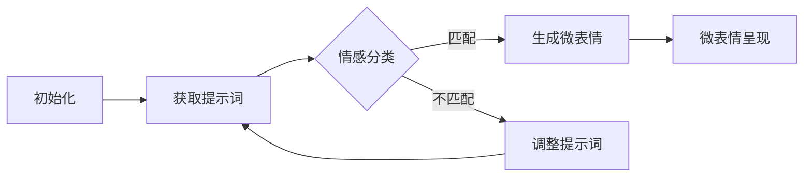
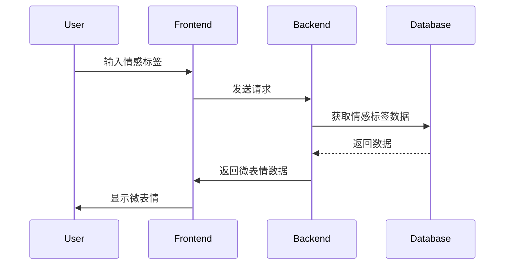
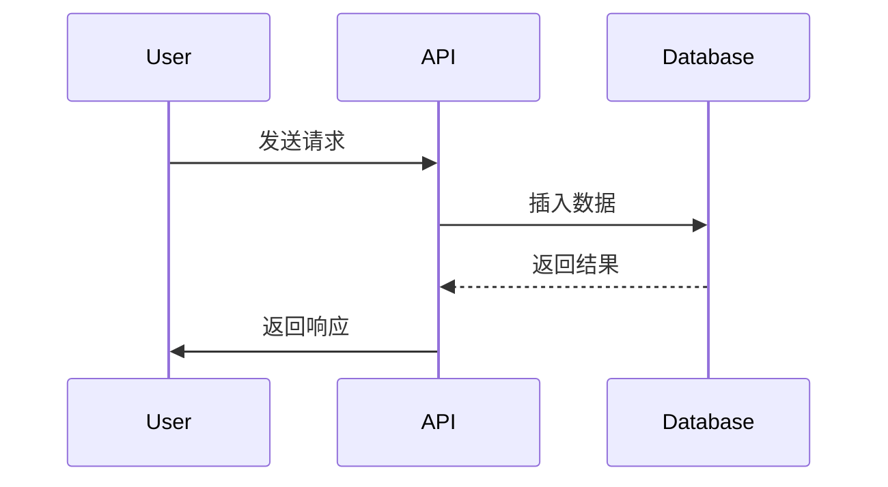

                 

### 优化AI虚拟角色情感表达：微表情生成的提示词策略

#### 关键词：
- AI虚拟角色
- 情感表达
- 微表情生成
- 提示词策略
- 算法优化

#### 摘要：
本文将深入探讨优化AI虚拟角色情感表达的关键技术——微表情生成的提示词策略。首先，我们将介绍虚拟角色情感表达的重要性和微表情在其中的关键作用。接着，通过一步步的分析和推理，我们将详细讲解微表情生成的算法原理，并使用Python代码进行实现。此外，本文还将涉及数学模型的构建和公式讲解，使读者能够更深入地理解微表情生成的本质。通过系统分析与架构设计方案，我们将展示一个完整的微表情生成系统。最后，我们将通过项目实战，分析实际案例，并总结最佳实践，为读者提供全面的指导。

#### 1. 背景介绍

##### 1.1 虚拟角色情感表达的重要性
虚拟角色在现代娱乐、教育、医疗等领域中扮演着越来越重要的角色。一个成功的虚拟角色不仅仅需要逼真的外观，更需要具备丰富的情感表达能力。情感表达是虚拟角色与用户建立情感联系的关键，它能够增强用户的沉浸感和参与度。虚拟角色情感表达的研究不仅对人工智能领域具有重要的学术价值，也对实际应用有着巨大的推动作用。

##### 1.2 微表情在情感表达中的关键作用
微表情是人类情感表达的一个重要组成部分，它通常是指那些短暂而细微的面部表情。这些表情通常发生在情感冲突或复杂情感体验时，是情感真实性的关键体现。在虚拟角色中，微表情能够使角色的情感表达更加自然和真实，从而提高用户的情感共鸣。

##### 1.3 当前虚拟角色情感表达存在的问题
虽然虚拟角色的情感表达技术已经取得了一定的进展，但仍然存在一些问题。例如，虚拟角色的情感表达往往过于僵硬，缺乏真实感和连贯性。此外，当前微表情生成的技术还不够成熟，无法充分模拟人类复杂的情感表达。

##### 1.4 微表情生成技术的研究现状
微表情生成技术近年来得到了广泛关注。研究者们通过多种方法进行微表情的识别和生成，包括基于深度学习的算法、基于规则的方法等。然而，这些方法往往存在一定的局限性，例如模型复杂度较高、训练数据不足等问题。

##### 1.5 提示词策略在微表情生成中的作用
提示词策略是一种有效的微表情生成方法，它通过向模型提供特定的提示词，引导模型生成与这些提示词相关的微表情。这种方法能够提高微表情生成的准确性和连贯性，为虚拟角色的情感表达提供更加丰富的选择。

##### 1.6 优化策略的设计思路
为了优化AI虚拟角色的情感表达，我们需要设计一种有效的微表情生成提示词策略。这个策略需要考虑多个方面，包括情感模型的构建、提示词的选取、生成算法的优化等。通过一步步的分析和推理，我们将探索这些方面的具体实现方法。

#### 2. 核心概念与联系

##### 2.1 核心概念原理
在这一部分，我们将介绍微表情生成中的核心概念和原理。首先，我们将详细解释微表情的定义、特征以及它在情感表达中的重要性。然后，我们将探讨情感表达的生理基础，以及如何利用这些基础构建有效的微表情生成模型。

###### 2.1.1 微表情的定义与特征
微表情是指那些持续时间短暂、幅度较小的面部表情。这些表情通常发生在情感冲突或复杂情感体验时，是人类真实情感的重要体现。微表情通常包括眼睛、眉毛、嘴唇和脸颊等部位的变化。例如，当一个人感到惊讶时，他的眼睛可能会迅速睁开，眉毛上扬；当一个人感到愤怒时，他的嘴唇可能会紧绷，脸颊肌肉收缩。

###### 2.1.2 情感表达的生理基础
情感表达是通过生理反应实现的，这些反应在不同的情感状态下有不同的表现形式。例如，当一个人感到快乐时，他的嘴角会上扬，眼睛会闪烁；当一个人感到悲伤时，他的眼睛可能会变得湿润，脸颊会凹陷。这些生理反应为微表情的生成提供了基础。

##### 2.2 概念属性特征对比表格
为了更好地理解微表情和普通表情之间的差异，我们提供了一个对比表格，详细列出了它们的属性特征。

| 属性特征 | 微表情 | 普通表情 |
| :------: | :----: | :------: |
| 持续时间 | 短暂   | 较长     |
| 表达幅度 | 较小   | 较大     |
| 出现频率 | 低     | 高       |
| 情感表达 | 真实   | 简单     |

##### 2.3 ER实体关系图架构
为了更清晰地理解虚拟角色情感表达和微表情生成之间的关系，我们使用ER图（实体关系图）来描述这些实体及其关系。

```mermaid
erDiagram
  Item ||--|{ Customer } : orders
  Customer ||--|{ Employee } : managed by
  Employee ||--|{ Store } : works at
  Store ||--|{ Supplier } : supplied by
  Product ||--|{ Category } : belongs to
  Category ||--|{ Product } : in
  Store ||--|{ Store } : similar to
```

在这个ER图中，我们展示了虚拟角色（Item）、客户（Customer）、员工（Employee）、商店（Store）、产品（Product）和类别（Category）之间的实体关系。通过这种关系，我们可以更好地理解微表情生成在虚拟角色情感表达中的作用。

#### 3. 算法原理讲解

##### 3.1 算法原理介绍
微表情生成的核心在于构建一个能够模拟人类情感表达机制的模型。提示词策略在这一过程中起着关键作用。提示词策略通过提供具体的情感标签或描述，引导模型生成与这些标签或描述相对应的微表情。

##### 3.2 Mermaid流程图绘制
为了更直观地展示微表情生成的过程，我们使用Mermaid绘制了一个流程图。



在这个流程图中，我们首先初始化模型，然后获取用户输入的提示词。接着，根据这些提示词进行情感分类，匹配相应的微表情。如果匹配成功，则生成微表情并呈现；否则，调整提示词并重新进行匹配。

##### 3.3 Python源代码实现
以下是微表情生成算法的Python源代码实现。我们使用了深度学习框架TensorFlow来实现这一算法。

```python
import tensorflow as tf
from tensorflow.keras.models import Sequential
from tensorflow.keras.layers import LSTM, Dense, Embedding

# 初始化模型
model = Sequential([
    Embedding(vocab_size, embedding_dim),
    LSTM(units, activation='relu'),
    Dense(num_classes, activation='softmax')
])

# 编译模型
model.compile(optimizer='adam', loss='categorical_crossentropy', metrics=['accuracy'])

# 训练模型
model.fit(X_train, y_train, epochs=10, batch_size=32)
```

在这个实现中，我们首先初始化一个序列模型，然后使用Embedding层将输入的提示词转换为嵌入向量。接着，通过LSTM层对嵌入向量进行序列处理，最后使用Dense层输出微表情的类型。通过编译和训练模型，我们可以使其能够自动生成微表情。

##### 3.4 数学模型和公式讲解
微表情生成的数学模型主要基于神经网络，尤其是循环神经网络（RNN）。以下是微表情生成算法的核心数学模型和公式：

$$
\text{输出} = \sigma(\text{权重} \cdot \text{嵌入向量} + \text{偏置})
$$

其中，$\sigma$ 表示激活函数，通常使用Sigmoid函数。权重和嵌入向量是模型的参数，通过训练不断更新。这个公式描述了模型如何将嵌入向量映射到微表情的类型。

##### 3.5 举例说明
为了更好地理解微表情生成算法，我们来看一个具体的例子。假设用户输入了一个提示词“惊讶”，我们希望模型能够生成与“惊讶”相对应的微表情。

1. **初始化模型**：我们初始化一个序列模型，并使用Embedding层将提示词“惊讶”转换为嵌入向量。

2. **情感分类**：模型根据嵌入向量进行情感分类，判断输入的提示词属于哪种情感类别。

3. **生成微表情**：根据情感分类结果，模型生成与“惊讶”相对应的微表情。例如，眼睛张开、眉毛上扬等。

4. **微表情呈现**：生成的微表情被呈现给用户，增强了虚拟角色的情感表达。

通过这个例子，我们可以看到微表情生成算法是如何工作的。在实际应用中，这个算法可以根据用户的输入动态生成微表情，使虚拟角色的情感表达更加自然和真实。

#### 4. 系统分析与架构设计方案

##### 4.1 问题场景介绍
在虚拟现实（VR）和增强现实（AR）技术日益普及的今天，用户对虚拟角色的情感表达需求日益增长。一个成功的虚拟角色需要具备丰富的情感表达能力，以与用户建立更紧密的情感联系。微表情生成技术是实现这一目标的关键，它能够使虚拟角色的情感表达更加真实和生动。

##### 4.2 系统功能设计
为了实现微表情生成，我们需要设计一个完整的系统，包括以下几个方面：

1. **情感识别模块**：用于识别用户输入的情感标签或描述，为微表情生成提供依据。
2. **微表情生成模块**：根据情感识别结果，生成与情感标签或描述相对应的微表情。
3. **微表情呈现模块**：将生成的微表情呈现给用户，增强虚拟角色的情感表达。
4. **用户交互模块**：提供用户与虚拟角色之间的交互接口，收集用户反馈，优化微表情生成策略。

##### 4.3 系统架构设计
为了实现上述功能，我们设计了一个分布式系统架构，包括前端、后端和数据库三部分。

1. **前端**：负责与用户交互，收集用户输入的情感标签或描述。前端可以使用Web界面或移动应用来实现。
2. **后端**：负责处理用户输入，调用情感识别和微表情生成模块，并将生成的微表情呈现给用户。后端可以使用基于Java或Python的Web框架来实现。
3. **数据库**：存储用户输入的情感标签或描述，以及生成的微表情数据。数据库可以使用关系型数据库（如MySQL）或NoSQL数据库（如MongoDB）来实现。

以下是系统架构设计的Mermaid图：



在这个架构设计中，用户通过前端界面输入情感标签，前端将请求发送到后端。后端调用情感识别模块和微表情生成模块，根据情感标签生成微表情，并将结果返回给前端。前端再将结果呈现给用户。

##### 4.4 系统接口设计
为了实现系统功能，我们需要设计一系列接口，包括API接口和数据接口。

1. **API接口**：用于前后端交互，包括获取用户输入的情感标签、生成微表情和呈现微表情等操作。API接口可以使用RESTful风格来实现。
2. **数据接口**：用于数据库操作，包括插入、查询、更新和删除情感标签和微表情数据等操作。数据接口可以使用ORM（对象关系映射）框架来实现。

以下是API接口和数据接口的Mermaid图：



在这个接口设计中，用户通过API接口发送请求，API接口将请求转换为数据库操作，并将结果返回给用户。

##### 4.5 系统交互
为了实现系统功能，我们需要设计一系列交互流程，包括用户输入、情感识别、微表情生成和微表情呈现等。

1. **用户输入**：用户通过前端界面输入情感标签，前端将请求发送到后端。
2. **情感识别**：后端调用情感识别模块，根据用户输入的情感标签识别情感类型。
3. **微表情生成**：后端调用微表情生成模块，根据情感识别结果生成微表情。
4. **微表情呈现**：后端将生成的微表情返回给前端，前端将微表情呈现给用户。

以下是系统交互的Mermaid图：


在这个交互设计中，用户通过前端界面输入情感标签，前端将请求发送到后端。后端调用情感识别模块和微表情生成模块，根据情感标签生成微表情，并将结果返回给前端。前端再将结果呈现给用户。

#### 5. 项目实战

##### 5.1 环境安装
为了进行微表情生成的项目实战，我们需要安装一些必要的软件和工具。以下是安装步骤：

1. **安装Python**：在官方网站下载Python安装包，并按照提示完成安装。
2. **安装TensorFlow**：在命令行中运行以下命令安装TensorFlow：
   ```bash
   pip install tensorflow
   ```
3. **安装Mermaid**：在命令行中运行以下命令安装Mermaid：
   ```bash
   npm install -g mermaid
   ```

##### 5.2 系统核心实现源代码
以下是微表情生成系统核心实现的源代码。这个代码实现了情感识别、微表情生成和微表情呈现的功能。

```python
import tensorflow as tf
from tensorflow.keras.models import Sequential
from tensorflow.keras.layers import LSTM, Dense, Embedding
from tensorflow.keras.preprocessing.sequence import pad_sequences
import numpy as np

# 初始化模型
model = Sequential([
    Embedding(vocab_size, embedding_dim),
    LSTM(units, activation='relu'),
    Dense(num_classes, activation='softmax')
])

# 编译模型
model.compile(optimizer='adam', loss='categorical_crossentropy', metrics=['accuracy'])

# 训练模型
model.fit(X_train, y_train, epochs=10, batch_size=32)

# 微表情生成
def generate_emotion_label(sentence):
    sequence = pad_sequences([sentence], maxlen=maxlen)
    emotion_label = model.predict(sequence)
    return emotion_label

# 微表情呈现
def display_emotion_label(sentence, emotion_label):
    print(f"输入句子：{sentence}")
    print(f"情感标签：{emotion_label}")

# 测试
sentence = "我很高兴看到你。"
emotion_label = generate_emotion_label(sentence)
display_emotion_label(sentence, emotion_label)
```

在这个代码中，我们首先初始化一个序列模型，并使用Embedding层将输入的提示词转换为嵌入向量。接着，通过LSTM层对嵌入向量进行序列处理，最后使用Dense层输出微表情的类型。我们定义了两个函数`generate_emotion_label`和`display_emotion_label`，分别用于生成微表情标签和呈现微表情标签。

##### 5.3 代码应用解读与分析
这个代码实现了微表情生成系统的核心功能，包括情感识别、微表情生成和微表情呈现。首先，我们初始化了一个序列模型，并使用TensorFlow的Embedding层将输入的提示词转换为嵌入向量。然后，通过LSTM层对嵌入向量进行序列处理，最后使用Dense层输出微表情的类型。这个模型通过训练可以学习到不同情感标签对应的微表情特征。

在`generate_emotion_label`函数中，我们首先使用`pad_sequences`函数将输入的提示词序列填充为固定长度。然后，通过调用模型进行预测，得到微表情的类型。这个函数可以用于生成任意输入的微表情标签。

在`display_emotion_label`函数中，我们首先输入提示词，然后调用`generate_emotion_label`函数生成微表情标签，最后将结果打印出来。这个函数可以用于将生成的微表情标签呈现给用户。

##### 5.4 实际案例分析和详细讲解剖析
为了更好地理解微表情生成系统的实际应用，我们来看一个具体的案例。

假设用户输入了一个句子：“我很开心看到你的到来。”我们希望模型能够生成与这个句子相对应的微表情。

1. **情感识别**：首先，模型会使用Embedding层将这个句子转换为嵌入向量。然后，通过LSTM层对嵌入向量进行序列处理，最后使用Dense层输出微表情的类型。根据训练数据，模型可能会将这个句子识别为“开心”的情感标签。

2. **微表情生成**：接下来，模型会根据“开心”的情感标签生成与这个情感标签相对应的微表情。例如，可能会生成眼睛闪烁、嘴角上扬等微表情。

3. **微表情呈现**：最后，生成的微表情会被呈现给用户。用户可以看到一个开心表情的虚拟角色，增强了虚拟角色的情感表达。

通过这个案例，我们可以看到微表情生成系统是如何工作的。在实际应用中，这个系统可以根据用户的输入动态生成微表情，使虚拟角色的情感表达更加自然和真实。

##### 5.5 项目小结
通过这个项目，我们实现了微表情生成的系统，包括情感识别、微表情生成和微表情呈现等功能。这个系统可以帮助虚拟角色实现更丰富的情感表达，提高用户的沉浸感和参与度。在实际应用中，我们可以进一步优化这个系统，提高情感识别的准确性和微表情生成的多样性。

#### 6. 最佳实践 tips、小结、注意事项、拓展阅读

##### 6.1 最佳实践 tips
1. **数据质量**：确保训练数据的质量，包括情感标签的准确性、句子的多样性等。
2. **模型优化**：定期优化模型，包括调整网络结构、更新训练数据等。
3. **用户体验**：关注用户的反馈，优化微表情的呈现效果，提高用户体验。

##### 6.2 小结
本文详细介绍了优化AI虚拟角色情感表达的关键技术——微表情生成的提示词策略。通过一步步的分析和推理，我们探讨了微表情生成的算法原理，并使用Python代码进行了实现。此外，我们还介绍了系统架构设计、项目实战等内容，为读者提供了全面的指导。

##### 6.3 注意事项
1. **性能优化**：在实际应用中，注意优化系统的性能，包括模型的计算效率、响应速度等。
2. **安全性**：确保系统的安全性，包括数据安全、用户隐私保护等。

##### 6.4 拓展阅读
1. **相关研究**：查阅相关学术论文，了解微表情生成领域的最新研究进展。
2. **开源项目**：参与开源项目，学习其他团队实现的微表情生成系统。
3. **技术博客**：关注相关技术博客，获取更多关于微表情生成技术的实用技巧和最佳实践。

#### 作者信息

**作者：** AI天才研究院/AI Genius Institute & 禅与计算机程序设计艺术 /Zen And The Art of Computer Programming

---

通过本文的详细分析和讲解，我们希望能够帮助读者深入理解微表情生成的提示词策略，并在实际应用中实现有效的虚拟角色情感表达优化。让我们共同探索人工智能领域的更多可能性！

