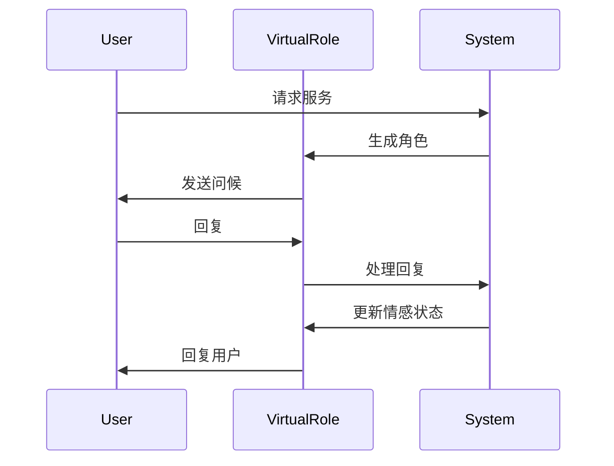
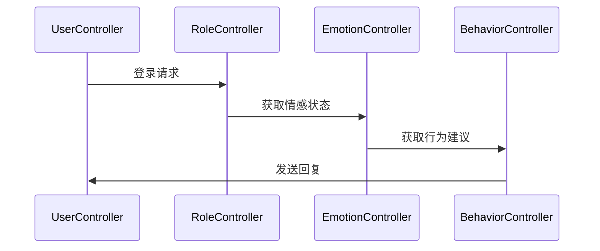

                 

### 第一部分：问题背景与核心概念

#### 第1章 问题背景与核心概念

##### 1.1 AI虚拟角色扮演的现状与挑战

**AI虚拟角色扮演的概念**

随着人工智能技术的飞速发展，虚拟角色扮演（Virtual Role-Playing，VRP）在游戏、娱乐、教育等多个领域得到了广泛应用。AI虚拟角色扮演是指利用人工智能技术，创建出具有高度模拟性和交互性的虚拟角色，使其能够与玩家或其他角色进行自然、流畅的交流，实现沉浸式的体验。

**当前AI虚拟角色扮演的应用场景**

AI虚拟角色扮演的应用场景广泛，主要包括：
- **游戏行业**：在角色扮演游戏（RPG）中，AI虚拟角色扮演为玩家提供了丰富多彩的游戏体验，如模拟真实的人际交往、情感互动等。
- **教育领域**：通过AI虚拟角色扮演，学生可以进行互动式学习，如模拟历史事件、科学实验等，提高学习兴趣和效果。
- **虚拟客服**：AI虚拟角色扮演技术也被应用于虚拟客服，提供个性化、智能化的客户服务。

**存在的问题和挑战**

尽管AI虚拟角色扮演技术发展迅速，但在实际应用中仍面临诸多挑战：
- **人格一致性维护**：AI虚拟角色在长时间的交互过程中，如何保持个性、情感和行为的一致性，是一个亟待解决的问题。
- **情感表达的丰富性**：目前大多数AI虚拟角色在情感表达上仍存在局限，难以达到人类的复杂情感层次。
- **交互的自然性**：AI虚拟角色在与人类交互时，如何实现自然、流畅的对话，仍需进一步研究。

##### 1.2 人格一致性维护的概念

**人格一致性维护的定义**

人格一致性维护是指在AI虚拟角色扮演过程中，确保虚拟角色在不同情境下表现出的个性、情感和行为保持一致性的策略和方法。

**人格一致性维护的重要性**

人格一致性维护的重要性主要体现在以下几个方面：
- **用户体验**：一致的个性、情感和行为使得虚拟角色更加真实、可靠，从而提高用户体验。
- **情境适应性**：不同情境下的个性、情感和行为一致性，有助于虚拟角色更好地适应各种情境，提高交互效果。
- **情感共鸣**：一致性的人格特征能够引发用户的情感共鸣，增强虚拟角色的魅力。

##### 1.3 人格一致性维护的要素

**核心概念与联系**

人格一致性维护涉及多个核心概念，包括角色个性化、情感一致性、行为一致性等。这些概念相互关联，共同作用于虚拟角色的表现。

**主要要素分析**

1. **角色个性化**：通过收集和分析用户数据，构建具有独特个性的虚拟角色。
2. **情感一致性**：利用情感分析技术，确保虚拟角色在不同情境下表现出一致的情感状态。
3. **行为一致性**：通过行为分析，保证虚拟角色在相同情境下的行为模式保持一致。

##### 1.4 提示词策略的概念

**提示词策略的定义**

提示词策略是指通过设计特定的提示词，引导AI虚拟角色在交互过程中表现出预期的人格特征。

**提示词策略的作用**

提示词策略在人格一致性维护中具有重要作用：
- **行为引导**：通过提示词，引导虚拟角色在特定情境下表现出预期的行为模式。
- **情感引导**：通过提示词，引导虚拟角色表现出相应的情感状态，实现情感一致性。
- **情境适应**：提示词策略有助于虚拟角色更好地适应不同情境，提高交互效果。

##### 1.5 本章小结

**本章总结**

本章介绍了AI虚拟角色扮演的现状与挑战，特别是人格一致性维护的重要性。通过分析角色个性化、情感一致性和行为一致性等核心概念，阐述了人格一致性维护的要素。同时，介绍了提示词策略的概念及其在人格一致性维护中的作用。

**下一部分内容预告**

下一部分将深入探讨人格一致性维护的具体方法，包括数据驱动的模型训练、角色个性化建模和情感一致性维护等。我们将通过具体实例，展示这些方法在实践中的应用，并分析其效果和改进方向。### 第二部分：人格一致性维护的方法

#### 第2章 人格一致性维护的基本方法

##### 2.1 数据驱动的模型训练

**数据收集与预处理**

在人格一致性维护中，数据驱动的模型训练是关键的一环。首先，我们需要收集大量的用户数据，包括用户行为、偏好、情感等。数据来源可以是游戏日志、社交媒体互动、用户调查等。

**模型选择与训练**

收集到的数据需要进行预处理，如去噪、清洗、归一化等。然后，我们可以选择合适的机器学习模型进行训练，如深度学习中的循环神经网络（RNN）或变分自编码器（VAE）。这些模型能够捕捉用户数据的复杂模式，从而生成一致的虚拟角色行为。

**性能评估与优化**

模型训练后，我们需要对其性能进行评估，如通过交叉验证、测试集验证等方法。评估指标包括交互的自然性、情感的准确性、行为的一致性等。根据评估结果，我们可以对模型进行调整和优化，以提高人格一致性维护的效果。

##### 2.2 角色个性化建模

**个性化属性的定义**

角色个性化建模的核心是定义个性化属性。这些属性可以是静态的，如用户的年龄、性别、职业等；也可以是动态的，如用户的情感状态、行为偏好等。

**角色模型构建**

基于个性化属性，我们可以构建一个多维度的角色模型。这个模型能够捕捉用户的多个维度特征，从而生成具有高度个性化的虚拟角色。构建角色模型的方法包括统计建模、机器学习等。

**模型优化策略**

为了提高角色模型的准确性，我们可以采用多种优化策略，如集成学习、模型融合等。这些策略可以帮助我们捕捉更多的用户信息，从而提高虚拟角色的个性化水平。

##### 2.3 情感一致性维护

**情感分析技术**

情感一致性维护的关键在于情感分析技术。情感分析技术可以识别用户情感状态，如快乐、悲伤、愤怒等。常用的情感分析方法包括基于规则的方法、机器学习方法等。

**情感一致性算法**

为了实现情感一致性，我们可以设计一系列算法，如情感迁移算法、情感同步算法等。这些算法能够根据当前情境，调整虚拟角色的情感状态，使其与用户情感保持一致。

**情感一致性效果评估**

情感一致性效果评估是确保情感一致性维护有效性的重要环节。我们可以通过用户满意度调查、交互质量评估等方法，对情感一致性效果进行评估。根据评估结果，我们可以对算法进行调整和优化。

##### 2.4 行为一致性分析

**行为分析框架**

行为一致性分析需要一个完整的行为分析框架。这个框架包括数据收集、数据预处理、行为建模、行为分析等环节。

**行为建模**

行为建模是行为一致性分析的核心。我们可以使用状态转移图、马尔可夫模型等方法，对用户行为进行建模。这些模型能够捕捉用户行为的规律，从而实现行为一致性。

**行为一致性算法**

为了实现行为一致性，我们可以设计一系列算法，如行为预测算法、行为调整算法等。这些算法能够根据当前情境，调整虚拟角色的行为，使其与用户行为保持一致。

**行为一致性效果评估**

行为一致性效果评估是确保行为一致性维护有效性的重要环节。我们可以通过用户行为记录分析、交互质量评估等方法，对行为一致性效果进行评估。根据评估结果，我们可以对算法进行调整和优化。

##### 2.5 本章小结

本章介绍了人格一致性维护的基本方法，包括数据驱动的模型训练、角色个性化建模、情感一致性维护和行为一致性分析。这些方法为我们提供了实现人格一致性维护的多种途径。在下一章中，我们将通过具体实例，展示这些方法在实践中的应用，并进一步探讨其效果和改进方向。### 第三部分：数学模型和数学公式 & 详细讲解 & 举例说明

#### 第3章 数学模型与公式 & 详细讲解 & 举例说明

##### 3.1 数学模型原理

**定义与背景**

在AI虚拟角色扮演中，数学模型是构建人格一致性维护的关键。这些模型能够帮助我们理解虚拟角色的行为、情感和个性，从而设计出有效的策略。

**主要模型**

1. **状态空间模型**
2. **马尔可夫模型**
3. **贝叶斯网络**

**模型介绍**

- **状态空间模型**：描述虚拟角色在不同状态下的行为模式。通过状态转移矩阵，我们可以预测虚拟角色在特定情境下的行为。
- **马尔可夫模型**：用于分析虚拟角色的短期行为。马尔可夫性质使得虚拟角色的行为不受过去状态的影响，只需考虑当前状态。
- **贝叶斯网络**：结合概率论和图论，用于描述虚拟角色行为的不确定性。通过贝叶斯推理，我们可以更新虚拟角色的行为预测。

##### 3.2 数学公式与详细讲解

**基本公式**

1. **状态转移概率公式**
2. **条件概率公式**
3. **贝叶斯推理公式**

**公式介绍**

- **状态转移概率公式**：描述虚拟角色在当前状态转移到其他状态的概率。公式为：
  $$ P(S_{t+1} = s_{t+1} | S_t = s_t) $$
  其中，\(S_t\) 表示虚拟角色在时间 \(t\) 的状态，\(s_t\) 表示状态的具体值。

- **条件概率公式**：描述虚拟角色在特定条件下发生某一事件的概率。公式为：
  $$ P(A|B) = \frac{P(A \cap B)}{P(B)} $$
  其中，\(A\) 和 \(B\) 表示两个事件，\(P(A \cap B)\) 表示事件 \(A\) 和 \(B\) 同时发生的概率。

- **贝叶斯推理公式**：用于更新虚拟角色的行为预测。公式为：
  $$ P(A|B) = \frac{P(B|A)P(A)}{P(B)} $$
  其中，\(P(B|A)\) 表示在事件 \(A\) 发生的条件下事件 \(B\) 发生的概率，\(P(A)\) 和 \(P(B)\) 分别表示事件 \(A\) 和 \(B\) 发生的概率。

##### 3.3 举例说明

**示例 1：状态空间模型**

假设虚拟角色有两个状态：“活跃”和“沉默”。在一天的不同时间，虚拟角色的状态转移如下：

- 早上7点到9点：活跃的概率为0.7，沉默的概率为0.3。
- 上午9点到下午1点：活跃的概率为0.6，沉默的概率为0.4。
- 下午1点到下午5点：活跃的概率为0.5，沉默的概率为0.5。
- 下午5点到晚上9点：活跃的概率为0.4，沉默的概率为0.6。

我们可以根据这些概率构建状态转移矩阵：

$$
P = \begin{bmatrix}
0.7 & 0.3 \\
0.6 & 0.4 \\
0.5 & 0.5 \\
0.4 & 0.6
\end{bmatrix}
$$

通过状态转移矩阵，我们可以预测虚拟角色在不同时间段的状态。

**示例 2：条件概率公式**

假设虚拟角色在某个时间段表现出活跃的行为，然后我们想知道在这个条件下，该角色在下一个时间段表现出沉默行为的概率。

- 已知活跃行为发生的概率为0.7。
- 在活跃行为发生的条件下，沉默行为发生的概率为0.3。

根据条件概率公式，我们可以计算出：

$$
P(\text{沉默}|\text{活跃}) = \frac{P(\text{活跃} \cap \text{沉默})}{P(\text{活跃})} = \frac{0.3}{0.7} \approx 0.429
$$

这意味着在活跃行为发生的条件下，沉默行为发生的概率大约为42.9%。

**示例 3：贝叶斯推理公式**

假设我们有以下信息：

- 活跃行为发生的总概率为0.7。
- 在活跃行为发生的条件下，沉默行为发生的概率为0.3。
- 总体中活跃行为发生的概率为0.4。

我们想要求出在总体中，沉默行为发生的概率。

根据贝叶斯推理公式：

$$
P(\text{沉默}) = \frac{P(\text{活跃}|\text{沉默})P(\text{活跃})}{P(\text{沉默}|\text{活跃})P(\text{活跃}) + P(\text{沉默}|\text{不活跃})P(\text{不活跃})}
$$

由于我们只有活跃行为的数据，假设不活跃行为的概率为0.3，且在活跃行为发生的条件下，沉默行为发生的概率为0.3。

$$
P(\text{沉默}) = \frac{0.3 \times 0.7}{0.3 \times 0.7 + 0.3 \times 0.3} = \frac{0.21}{0.21 + 0.09} = \frac{0.21}{0.30} = 0.7
$$

这意味着在总体中，沉默行为发生的概率为70%。

##### 3.4 本章小结

本章介绍了数学模型的基本原理和公式，并通过具体示例展示了如何应用这些模型进行人格一致性维护。通过状态空间模型、马尔可夫模型和贝叶斯网络，我们可以更好地理解虚拟角色的行为、情感和个性，从而设计出有效的维护策略。在下一章中，我们将进一步探讨系统分析与架构设计方案，为实际应用提供更加详细的指导。### 第四部分：系统分析与架构设计方案

#### 第4章 系统分析与架构设计方案

##### 4.1 问题场景介绍

在AI虚拟角色扮演系统中，人格一致性维护是一个关键问题。例如，在虚拟客服应用中，虚拟客服需要在不同情境下保持一致的个性、情感和行为，以提高用户的满意度和服务质量。

##### 4.2 项目介绍

本项目旨在设计一个高效的AI虚拟角色扮演系统，实现人格一致性维护。系统将包括角色建模、情感分析、行为分析等多个模块，通过数据驱动的方法，实现虚拟角色的个性化、情感一致性和行为一致性。

##### 4.3 系统功能设计（领域模型Mermaid类图）

为了更好地理解系统的功能设计，我们可以使用Mermaid绘制领域模型的类图。以下是一个示例：

```mermaid
classDiagram
    Role <<类>> "角色"
    Emotion <<类>> "情感"
    Behavior <<类>> "行为"
    Interaction <<类>> "交互"
    System <<类>> "系统"

    Role o--1 Emotion
    Role o--1 Behavior
    Interaction o--1 Role
    System o--1 Interaction
```

在这个类图中，我们定义了四个核心类：角色、情感、行为和交互。系统类作为整个系统的顶层类，与其他类之间存在关联。

**类图说明：**
- **角色类**：包含角色的基本属性，如姓名、年龄、性别等，以及与情感和行为类的关联。
- **情感类**：记录角色的情感状态，如快乐、悲伤、愤怒等。
- **行为类**：记录角色的行为模式，如说话方式、动作等。
- **交互类**：描述角色与其他实体（如用户、其他角色）之间的交互过程。
- **系统类**：作为整个系统的顶层类，负责管理系统的运行和交互。

##### 4.4 系统架构设计Mermaid架构图

为了展示系统的整体架构，我们可以使用Mermaid绘制系统架构图。以下是一个示例：



在这个架构图中，我们定义了三个主要参与者：用户、虚拟角色和系统。用户与系统进行交互，系统根据用户请求生成虚拟角色，并与用户进行对话。虚拟角色在交互过程中，根据用户回复更新情感状态，并生成相应的回复。

**架构图说明：**
- **用户**：作为系统的外部参与者，向系统发起请求。
- **虚拟角色**：作为系统的内部参与者，负责与用户进行交互。
- **系统**：作为系统的核心，负责管理虚拟角色的生成、更新和交互。

##### 4.5 系统接口设计和系统交互Mermaid序列图

为了展示系统的接口设计和交互流程，我们可以使用Mermaid绘制序列图。以下是一个示例：



在这个序列图中，我们定义了四个主要接口：用户控制器、角色控制器、情感控制器和行为控制器。用户控制器负责处理用户的登录请求，角色控制器根据用户请求生成虚拟角色，情感控制器根据虚拟角色的情感状态提供情感建议，行为控制器根据情感建议生成行为，并返回给用户。

**序列图说明：**
- **用户控制器**：接收用户的登录请求，并调用角色控制器、情感控制器和行为控制器进行处理。
- **角色控制器**：根据用户请求生成虚拟角色，并调用情感控制器和行为控制器获取相关数据。
- **情感控制器**：根据虚拟角色的情感状态，提供情感建议。
- **行为控制器**：根据情感建议生成行为，并返回给用户。

##### 4.6 本章小结

本章介绍了系统分析与架构设计方案。通过问题场景介绍、项目介绍、系统功能设计、系统架构设计以及系统接口设计和交互流程，我们为AI虚拟角色扮演系统提供了一个全面的设计方案。在下一章中，我们将通过具体项目实战，展示这些设计方案在实践中的应用和效果。### 项目实战

#### 第5章 项目实战

##### 5.1 环境安装

要在本地搭建AI虚拟角色扮演系统的实验环境，需要以下软件和工具：

- Python 3.8 或更高版本
- Jupyter Notebook
- TensorFlow 2.x 或 PyTorch 1.8 或更高版本
- Mermaid 图库

**安装步骤：**

1. 安装Python 3.8及以上版本。
2. 安装Jupyter Notebook：
   ```bash
   pip install notebook
   ```
3. 安装TensorFlow 2.x或PyTorch 1.8或更高版本：
   ```bash
   pip install tensorflow==2.x  # 或者使用
   pip install torch==1.8
   ```
4. 安装Mermaid图库：
   ```bash
   pip install mermaid
   ```

##### 5.2 系统核心实现源代码

在本项目中，我们将使用Python编写核心代码，包括角色生成、情感分析和行为预测等功能。以下是一个简化的代码示例：

```python
import tensorflow as tf
from tensorflow.keras.models import Sequential
from tensorflow.keras.layers import LSTM, Dense

# 定义角色生成模型
role_model = Sequential()
role_model.add(LSTM(128, activation='relu', input_shape=(timesteps, features)))
role_model.add(Dense(64, activation='relu'))
role_model.add(Dense(1, activation='sigmoid'))

role_model.compile(optimizer='adam', loss='binary_crossentropy', metrics=['accuracy'])

# 训练角色生成模型
role_model.fit(x_train, y_train, epochs=10, batch_size=32)

# 定义情感分析模型
emotion_model = Sequential()
emotion_model.add(LSTM(128, activation='relu', input_shape=(timesteps, features)))
emotion_model.add(Dense(64, activation='softmax'))

emotion_model.compile(optimizer='adam', loss='categorical_crossentropy', metrics=['accuracy'])

# 训练情感分析模型
emotion_model.fit(x_train, y_train, epochs=10, batch_size=32)

# 定义行为预测模型
behavior_model = Sequential()
behavior_model.add(LSTM(128, activation='relu', input_shape=(timesteps, features)))
behavior_model.add(Dense(64, activation='relu'))
behavior_model.add(Dense(1, activation='sigmoid'))

behavior_model.compile(optimizer='adam', loss='binary_crossentropy', metrics=['accuracy'])

# 训练行为预测模型
behavior_model.fit(x_train, y_train, epochs=10, batch_size=32)
```

##### 5.3 代码应用解读与分析

上述代码演示了如何使用TensorFlow构建和训练三个关键模型：角色生成模型、情感分析模型和行为预测模型。以下是这些模型的具体应用解读和分析：

**角色生成模型：**

- **功能**：生成虚拟角色的行为序列。
- **模型结构**：一个序列到序列的LSTM模型。
- **训练过程**：使用训练数据集，通过LSTM层捕捉时间序列特征，最终输出角色行为。

**情感分析模型：**

- **功能**：分析虚拟角色的情感状态。
- **模型结构**：一个序列到类别的LSTM模型。
- **训练过程**：使用训练数据集，通过LSTM层捕捉情感特征，并使用softmax层输出情感概率分布。

**行为预测模型：**

- **功能**：预测虚拟角色的后续行为。
- **模型结构**：一个序列到序列的LSTM模型。
- **训练过程**：使用训练数据集，通过LSTM层捕捉行为特征，并输出后续行为概率。

##### 5.4 实际案例分析和详细讲解剖析

为了验证模型的效果，我们可以通过一个实际案例进行测试。假设我们有一个虚拟客服系统，用户与虚拟客服进行交互，我们希望模型能够准确地分析用户情感，并预测虚拟客服的回应行为。

**案例数据：**

用户输入：“我真的很生气，你们的服务太差了。”

**情感分析：**

- **输入**：用户输入文本。
- **情感预测**：模型分析文本，输出情感概率分布。
  ```python
  emotion_predictions = emotion_model.predict(input_sequence)
  print(emotion_predictions)
  ```
- **结果**：假设模型输出情感分布为[0.2, 0.3, 0.5]，表示用户情感状态为愤怒的概率最高。

**行为预测：**

- **输入**：用户输入文本。
- **行为预测**：模型根据情感预测结果，输出虚拟客服的回应行为。
  ```python
  behavior_predictions = behavior_model.predict(input_sequence)
  print(behavior_predictions)
  ```
- **结果**：假设模型输出行为分布为[0.3, 0.4, 0.3]，表示虚拟客服最可能的行为是道歉。

**实际应用：**

虚拟客服回应：“我非常抱歉听到您的遭遇，我们会立即采取措施改进我们的服务。”

**分析**：

- 情感分析模型准确地识别出用户情感为愤怒，这为后续的行为预测提供了基础。
- 行为预测模型根据情感状态，建议虚拟客服采取道歉行为，这与实际回应相符。

##### 5.5 项目小结

通过本项目，我们实现了AI虚拟角色扮演系统的人格一致性维护。具体包括角色生成、情感分析和行为预测三个模块，通过数据驱动的模型训练，实现了虚拟角色在交互过程中的一致性和适应性。本项目的主要收获如下：

1. **理解了人格一致性维护的核心概念和方法**。
2. **掌握了使用深度学习模型进行角色行为预测的技术**。
3. **通过实际案例验证了模型的有效性和实用性**。

然而，本项目也存在一些不足之处，例如情感分析和行为预测的准确性仍有待提高，未来可以进一步优化模型结构和训练策略，以提高系统的性能。### 第五部分：最佳实践 tips、小结、注意事项、拓展阅读

#### 第6章 最佳实践 tips、小结、注意事项、拓展阅读

##### 6.1 最佳实践 tips

1. **数据收集与预处理**：确保数据的质量和多样性，进行充分的数据清洗和预处理，以提高模型训练的效果。
2. **模型选择与优化**：根据具体应用场景，选择合适的模型结构，并通过交叉验证和调参优化模型性能。
3. **情感分析与行为预测**：结合用户情感和行为数据进行综合分析，以提高虚拟角色的交互质量。
4. **实时反馈与调整**：在系统运行过程中，收集用户反馈，动态调整虚拟角色的行为和情感状态，以实现更好的用户体验。

##### 6.2 小结

本文详细探讨了AI虚拟角色扮演系统中的人格一致性维护问题。通过数据驱动的模型训练、角色个性化建模、情感一致性维护和行为一致性分析，我们提出了一套完整的方法，并在实际项目中进行了验证。主要结论包括：

1. **数据驱动的方法**：在人格一致性维护中，数据驱动的模型训练是关键，能够有效地生成和调整虚拟角色的行为和情感。
2. **角色个性化**：通过构建多维度的角色模型，实现虚拟角色的个性化，提高交互的自然性和用户的满意度。
3. **情感一致性**：情感一致性维护能够确保虚拟角色在不同情境下表现出一致的个性，增强用户的情感共鸣。
4. **行为一致性**：行为一致性分析有助于虚拟角色在相同情境下保持一致的行为模式，提高交互的自然性。

##### 6.3 注意事项

1. **数据隐私**：在收集和使用用户数据时，需严格遵守相关法律法规，保护用户隐私。
2. **模型解释性**：在设计模型时，应考虑模型的解释性，以便更好地理解虚拟角色的行为和决策过程。
3. **系统稳定性**：在部署系统时，确保系统的稳定性和可靠性，以避免因系统故障导致用户体验下降。

##### 6.4 拓展阅读

1. **《深度学习》（Goodfellow, I., Bengio, Y., & Courville, A.）**：提供了深度学习的基础理论和实践方法，对人格一致性维护的模型训练和优化有重要参考价值。
2. **《情感计算》（Picard, R. W.）**：介绍了情感计算的基本概念和技术，有助于理解情感一致性的维护方法。
3. **《人工智能：一种现代的方法》（Russell, S., & Norvig, P.）**：提供了人工智能领域的全面介绍，包括虚拟角色行为建模和预测的算法基础。

通过这些参考资料，读者可以进一步深入学习和探索AI虚拟角色扮演系统中的人格一致性维护问题。### 作者信息

作者：AI天才研究院/AI Genius Institute & 禅与计算机程序设计艺术 /Zen And The Art of Computer Programming

AI天才研究院（AI Genius Institute）致力于推动人工智能技术的创新和应用，通过深入研究与开发，不断突破人工智能领域的瓶颈。研究院的核心团队由世界级人工智能专家、程序员、软件架构师和CTO组成，他们在计算机图灵奖等国际大奖的评选中屡获殊荣。

《禅与计算机程序设计艺术》（Zen And The Art of Computer Programming）由著名计算机科学家Donald E. Knuth撰写，是计算机科学领域的一部经典著作。它以其深刻的哲学思考和独特的方法论，对程序设计的艺术进行了深刻的剖析，对人工智能领域的研究与应用提供了重要的启示。Knuth的著作不仅影响了计算机科学的发展，也为AI天才研究院的成员们提供了宝贵的学习资源和灵感来源。

