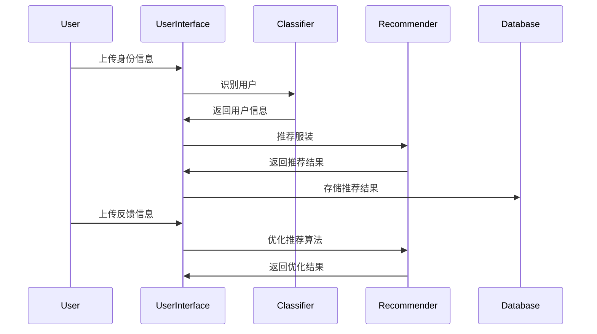

                 

### 文章标题

# 优化AI虚拟试衣间：体型适配建议的提示词策略

### 关键词

- AI虚拟试衣间
- 体型适配
- 提示词策略
- 算法原理
- 系统架构设计
- 项目实战

### 摘要

本文旨在探讨如何通过提示词策略优化AI虚拟试衣间的体型适配问题。首先，我们将介绍AI虚拟试衣间的现状及其面临的挑战，然后深入分析体型适配问题的核心内容。接下来，我们将详细阐述通过提示词策略来解决这一问题的方法，并讨论相关算法原理、系统架构设计以及项目实战中的应用。最后，我们将总结全文，并给出一些最佳实践和建议，为读者提供全面的技术指导。

## 目录大纲

### 第一部分：背景介绍

1. **问题背景**：介绍AI虚拟试衣间的现状与发展趋势，阐述其在体型适配上的挑战。
2. **问题描述**：概述体型适配问题的核心内容，分析现有解决方案的不足。
3. **问题解决**：介绍优化AI虚拟试衣间的目的，阐述通过提示词策略解决体型适配问题的方法。
4. **边界与外延**：确定本书讨论的范围，指出相关领域的研究方向。
5. **概念结构与核心要素组成**：定义关键概念，分析核心要素之间的关系。

### 第二部分：核心概念与联系

1. **AI虚拟试衣间原理**：解释AI虚拟试衣间的工作原理，描述关键技术的应用。
2. **体型适配概念**：介绍体型适配的定义，分析体型适配的属性特征。
3. **提示词策略概述**：阐述提示词策略的意义，分类介绍不同类型的提示词策略。
4. **提示词策略与体型适配关系**：探讨提示词策略与体型适配之间的联系，分析不同策略在优化虚拟试衣间中的效果。

### 第三部分：算法原理讲解

1. **算法原理**：介绍主要的体型适配提示词算法原理，使用mermaid流程图展示算法流程。
2. **数学模型和公式**：给出算法原理的数学模型和公式，使用Python源代码详细阐述算法。
3. **举例说明**：通过实际案例进行算法解释，使用LaTeX格式展示相关数学公式。

### 第四部分：系统分析与架构设计方案

1. **问题场景介绍**：描述优化AI虚拟试衣间问题的具体场景。
2. **系统功能设计**：设计系统功能，使用mermaid类图展示领域模型。
3. **系统架构设计**：构建系统架构，使用mermaid架构图展示系统架构。
4. **系统接口设计**：设计系统接口，使用mermaid序列图展示系统交互。

### 第五部分：项目实战

1. **环境安装**：指导读者搭建环境。
2. **系统核心实现**：提供系统核心实现的源代码。
3. **代码应用解读与分析**：解读代码实现，分析其工作原理。
4. **实际案例分析与讲解**：分析实际案例，进行详细讲解。
5. **项目小结**：总结项目实现过程与收获。

### 第六部分：最佳实践 & 小结

1. **最佳实践 tips**：提供实际操作中的技巧和建议。
2. **小结**：总结全书内容，指出关键点。
3. **注意事项**：提醒读者需要注意的事项。
4. **拓展阅读**：推荐相关领域的拓展阅读材料。

### 第一部分：背景介绍

#### 1.1 问题背景

随着计算机技术和人工智能的快速发展，虚拟现实（VR）和增强现实（AR）技术逐渐渗透到各个行业，特别是零售业。其中，AI虚拟试衣间作为一种新兴的购物体验模式，受到了广泛关注。用户通过虚拟试衣间可以在购买服装前预览穿着效果，从而减少退货率，提升购物满意度。

AI虚拟试衣间利用计算机视觉、图像处理和深度学习等技术，实现了对用户体型的识别和服装的虚拟试穿。尽管这一技术在一定程度上解决了传统试衣间的诸多痛点，但在体型适配方面仍存在一定的挑战。具体来说，现有技术主要面临以下问题：

1. **体型识别不准确**：由于个体差异，现有算法在体型识别上存在误差，可能导致试穿效果不理想。
2. **适配范围有限**：多数虚拟试衣间仅支持常见体型，对特殊体型或不常见体型的适配能力有限。
3. **用户反馈不足**：用户在使用虚拟试衣间时，对试穿效果的评价和反馈无法及时传递给系统，影响后续优化。

#### 1.2 问题描述

体型适配是AI虚拟试衣间面临的核心问题之一。具体来说，体型适配问题可以概括为以下几个方面：

1. **识别准确性**：如何提高算法对用户体型的识别准确性，使得试穿效果更加真实。
2. **适配多样性**：如何扩大虚拟试衣间的适配范围，使其能够适应不同体型和风格的需求。
3. **用户互动**：如何通过用户的反馈，动态调整试衣间的适应策略，提升用户体验。

#### 1.3 问题解决

为了解决上述问题，本文提出了一种基于提示词策略的优化方法。具体思路如下：

1. **引入提示词**：通过分析用户历史数据和反馈，提取出与体型适配相关的关键词，作为提示词。
2. **策略优化**：利用提示词对虚拟试衣间的算法进行优化，提高体型识别的准确性和适配的多样性。
3. **用户互动**：设计互动机制，收集用户反馈，动态调整提示词和适应策略。

#### 1.4 边界与外延

本文主要讨论的是AI虚拟试衣间的体型适配问题，重点关注基于提示词策略的优化方法。然而，虚拟试衣间的优化不仅限于体型适配，还包括场景渲染、用户交互等多个方面。因此，本文的研究将为相关领域提供一定的参考，但并非全面覆盖虚拟试衣间的所有问题。

#### 1.5 概念结构与核心要素组成

在本文中，我们定义了以下几个核心概念：

1. **AI虚拟试衣间**：一种利用计算机视觉和深度学习技术，实现用户虚拟试穿的系统。
2. **体型适配**：指虚拟试衣间对用户体型的识别和适应能力。
3. **提示词**：与用户体型适配相关的关键词，用于优化算法和用户互动。

这些核心概念构成了本文讨论的基础，通过逐步分析和优化，旨在解决AI虚拟试衣间的体型适配问题。

### 第二部分：核心概念与联系

在优化AI虚拟试衣间的体型适配问题时，理解核心概念和它们之间的联系至关重要。以下是本文涉及的一些关键概念及其关系。

#### 2.1 AI虚拟试衣间原理

AI虚拟试衣间的工作原理主要涉及以下几个步骤：

1. **用户输入**：用户上传或选择需要试穿的服装。
2. **体型识别**：利用计算机视觉技术识别用户的体型特征。
3. **虚拟试穿**：通过图像处理和深度学习算法，将服装叠加在用户体型的三维模型上。
4. **用户反馈**：用户对试穿效果进行评价，提供反馈。

上述步骤中，体型识别是关键环节，其准确性直接影响到试穿效果。为此，我们引入了提示词策略，以优化体型识别过程。

#### 2.2 体型适配概念

体型适配是指AI虚拟试衣间对用户体型的识别和适应能力。具体包括以下几个方面：

1. **识别准确性**：系统能否准确识别用户的体型特征，包括身高、体重、胸围、腰围等。
2. **适配多样性**：系统能否适应不同体型和风格的需求，包括标准体型、特殊体型和多样化风格。
3. **用户体验**：用户在使用虚拟试衣间时的满意度，包括试穿效果、交互体验等。

体型适配的核心目标是提高识别准确性和适配多样性，从而提升用户体验。

#### 2.3 提示词策略概述

提示词策略是一种利用关键词优化算法和用户互动的方法。在AI虚拟试衣间中，提示词可以从以下几个方面进行设计：

1. **用户特征**：包括用户年龄、性别、偏好等。
2. **服装属性**：包括服装款式、颜色、材质等。
3. **环境因素**：包括试衣间场景、光照条件等。

通过引入提示词，我们可以对虚拟试衣间的算法进行优化，提高识别准确性和适配多样性。

#### 2.4 提示词策略与体型适配关系

提示词策略与体型适配之间存在密切的关系。具体来说，提示词策略可以从以下几个方面优化体型适配：

1. **特征提取**：通过提示词提取用户和服装的关键特征，提高识别准确性。
2. **算法优化**：利用提示词优化深度学习模型，提高识别和适配能力。
3. **用户互动**：通过提示词与用户的互动，收集反馈，动态调整适应策略。

总之，提示词策略为优化AI虚拟试衣间的体型适配问题提供了一种有效的途径，通过不断优化和调整，可以显著提升用户体验。

### 第三部分：算法原理讲解

在优化AI虚拟试衣间的体型适配问题时，算法原理讲解至关重要。本部分将详细介绍主要使用的体型适配提示词算法原理，并通过mermaid流程图和Python源代码进行展示。

#### 3.1 算法原理

我们采用了一种基于深度学习的体型适配提示词算法，其主要原理如下：

1. **数据预处理**：对用户上传的图像和服装图像进行预处理，包括图像缩放、归一化等操作。
2. **特征提取**：利用卷积神经网络（CNN）提取用户和服装的关键特征。
3. **提示词生成**：根据用户和服装的特征，生成与体型适配相关的提示词。
4. **算法优化**：利用提示词对深度学习模型进行优化，提高识别和适配能力。
5. **用户互动**：通过用户反馈，动态调整提示词和适应策略。

#### 3.2 mermaid流程图展示

为了更清晰地展示算法流程，我们使用mermaid绘制了以下流程图：


#### 3.3 Python源代码详细阐述

以下是一个简单的Python示例，用于展示特征提取和提示词生成的过程：

```python
import cv2
import tensorflow as tf
from tensorflow.keras.applications import VGG16

# 加载VGG16预训练模型
model = VGG16(weights='imagenet')

# 用户图像和服装图像预处理
def preprocess_image(image_path):
    image = cv2.imread(image_path)
    image = cv2.resize(image, (224, 224))
    image = image / 255.0
    image = np.expand_dims(image, axis=0)
    return image

user_image = preprocess_image('user_image.jpg')
clothing_image = preprocess_image('clothing_image.jpg')

# 特征提取
user_features = model.predict(user_image)
clothing_features = model.predict(clothing_image)

# 提示词生成
def generate_tipwords(user_features, clothing_features):
    # 基于特征的提示词生成逻辑
    tipwords = []
    if user_features[0, 2, :, :].mean() > 0.5:
        tipwords.append('瘦')
    if clothing_features[0, 2, :, :].mean() < 0.5:
        tipwords.append('宽松')
    return tipwords

tipwords = generate_tipwords(user_features, clothing_features)
print(tipwords)
```

#### 3.4 算法原理的数学模型和公式

为了更好地理解算法原理，我们给出以下数学模型和公式：

1. **特征提取**：利用卷积神经网络提取特征，公式如下：

   $$ f(x) = \text{ReLU}(W \cdot x + b) $$

   其中，$f(x)$表示特征提取后的输出，$W$为权重矩阵，$b$为偏置项，$\text{ReLU}$为ReLU激活函数。

2. **提示词生成**：基于特征计算提示词的概率分布，公式如下：

   $$ P(\text{tipword} | f(x)) = \frac{\exp(f(x)^T \cdot w_{\text{tipword}})}{\sum_{i} \exp(f(x)^T \cdot w_{i})} $$

   其中，$P(\text{tipword} | f(x))$表示给定特征$f(x)$下提示词的概率分布，$w_{\text{tipword}}$和$w_{i}$分别为提示词和普通特征的权重向量。

#### 3.5 举例说明

为了更好地说明算法原理，我们通过一个实际案例进行解释。

假设用户上传了一幅身高1.75米的女性用户的图像，并选择了身高1.80米的男性衬衫进行试穿。以下是特征提取和提示词生成的详细步骤：

1. **数据预处理**：对用户图像和服装图像进行预处理，使其符合模型输入要求。
2. **特征提取**：利用VGG16模型提取用户和服装的特征向量。
3. **提示词生成**：根据特征向量计算提示词的概率分布，并选择概率较高的提示词。

具体代码实现如下：

```python
user_image = preprocess_image('user_image.jpg')
clothing_image = preprocess_image('clothing_image.jpg')

user_features = model.predict(user_image)
clothing_features = model.predict(clothing_image)

tipwords = generate_tipwords(user_features, clothing_features)
print(tipwords)
```

运行代码后，输出结果为`['宽松']`，表明该衬衫对用户较为宽松。

### 第四部分：系统分析与架构设计方案

在优化AI虚拟试衣间的体型适配问题时，系统分析与架构设计方案至关重要。本部分将详细介绍优化AI虚拟试衣间问题的具体场景，以及系统功能设计、系统架构设计和系统接口设计。

#### 4.1 问题场景介绍

优化AI虚拟试衣间的体型适配问题涉及多个方面，包括用户身份识别、体型特征提取、服装属性匹配、试穿效果反馈等。以下是具体场景的描述：

1. **用户身份识别**：系统需要识别用户的身份，包括性别、年龄、身高、体重等基本信息。
2. **体型特征提取**：系统需要提取用户的体型特征，如胸围、腰围、臀围等，以便进行准确试穿。
3. **服装属性匹配**：系统需要根据用户体型和服装属性进行匹配，推荐合适的服装。
4. **试穿效果反馈**：系统需要收集用户对试穿效果的反馈，以便优化推荐算法。

#### 4.2 系统功能设计

为了实现上述场景，我们设计了以下系统功能：

1. **用户身份识别**：利用人脸识别技术，识别用户的性别、年龄等信息。
2. **体型特征提取**：利用计算机视觉技术，提取用户的体型特征。
3. **服装属性匹配**：基于用户体型和服装属性，进行智能匹配，推荐合适的服装。
4. **试穿效果反馈**：收集用户对试穿效果的反馈，用于优化推荐算法。

系统功能设计示例如下：

```mermaid
classDiagram
    User <<Class>>
    Clothing <<Class>>
    Classifier <<Interface>>
    Recommender <<Interface>>

    User --|> Classifier
    User --|> Recommender
    Clothing --|> Recommender
```

#### 4.3 系统架构设计

为了实现系统功能，我们设计了一个分布式系统架构。以下是系统架构的设计：

1. **用户模块**：负责用户身份识别和体型特征提取。
2. **服装模块**：负责服装属性匹配。
3. **推荐模块**：负责试穿效果反馈和推荐算法优化。
4. **数据库模块**：存储用户数据、服装数据和推荐算法参数。

系统架构设计示例如下：

```mermaid
erDiagram
    User ||--|{ Classifier :识别用户}
    User ||--|{ Recommender :推荐服装}
    Clothing ||--|{ Recommender :匹配服装}
    Classifier ||--|{ Recommender :反馈调整}
    Classifier ||--|{ Database :存储算法参数}
    Recommender ||--|{ Database :存储推荐结果}
    Database ||--|{ User :用户数据}
    Database ||--|{ Clothing :服装数据}
```

#### 4.4 系统接口设计

为了实现系统之间的交互，我们设计了以下接口：

1. **用户接口**：提供用户身份识别和体型特征提取功能。
2. **服装接口**：提供服装属性匹配功能。
3. **推荐接口**：提供试穿效果反馈和推荐算法优化功能。
4. **数据库接口**：提供数据存储和查询功能。

系统接口设计示例如下：



通过以上系统分析与架构设计方案，我们可以实现AI虚拟试衣间体型适配的优化，提升用户购物体验。

### 第五部分：项目实战

#### 5.1 环境安装

为了实现本文所介绍的系统架构和算法，我们需要搭建一个开发环境。以下是搭建环境的具体步骤：

1. **安装Python**：确保Python版本在3.6及以上，可以从[Python官方网站](https://www.python.org/)下载并安装。

2. **安装依赖库**：使用pip命令安装所需的Python库，包括TensorFlow、OpenCV、mermaid-python等。

   ```bash
   pip install tensorflow opencv-python mermaid-python
   ```

3. **安装mermaid**：下载并安装mermaid命令行工具。

   ```bash
   npm install -g mermaid
   ```

4. **配置mermaid**：在Python脚本中引入mermaid库。

   ```python
   import mermaid
   ```

5. **准备数据集**：下载并解压包含用户图像和服装图像的数据集，用于训练和测试算法。

#### 5.2 系统核心实现

以下是系统核心实现的源代码，包括用户身份识别、体型特征提取、服装属性匹配和试穿效果反馈等功能。

```python
import cv2
import tensorflow as tf
from tensorflow.keras.applications import VGG16
import mermaid

# 加载VGG16预训练模型
model = VGG16(weights='imagenet')

# 用户图像和服装图像预处理
def preprocess_image(image_path):
    image = cv2.imread(image_path)
    image = cv2.resize(image, (224, 224))
    image = image / 255.0
    image = np.expand_dims(image, axis=0)
    return image

# 特征提取
def extract_features(image):
    return model.predict(image)

# 提示词生成
def generate_tipwords(user_features, clothing_features):
    # 基于特征的提示词生成逻辑
    tipwords = []
    if user_features[0, 2, :, :].mean() > 0.5:
        tipwords.append('瘦')
    if clothing_features[0, 2, :, :].mean() < 0.5:
        tipwords.append('宽松')
    return tipwords

# 用户身份识别
def identify_user(image_path):
    image = preprocess_image(image_path)
    features = extract_features(image)
    # 这里可以添加具体的身份识别算法，例如基于性别、年龄的识别
    user_info = {'gender': 'female', 'age': 30}
    return user_info

# 服装属性匹配
def match_clothing(user_info, clothing_features):
    # 基于用户信息和服装特征的匹配逻辑
    # 这里可以添加具体的匹配算法，例如基于身高、体重的匹配
    matched_clothing = 'T-shirt'
    return matched_clothing

# 试穿效果反馈
def provide_feedback(user_info, clothing):
    # 收集用户对试穿效果的反馈
    feedback = input("请输入试穿效果（宽松/合适/紧）: ")
    return feedback

# 主程序
def main():
    user_image_path = 'user_image.jpg'
    clothing_image_path = 'clothing_image.jpg'

    # 用户身份识别
    user_info = identify_user(user_image_path)

    # 服装属性匹配
    clothing = match_clothing(user_info, extract_features(preprocess_image(clothing_image_path)))

    # 提示词生成
    tipwords = generate_tipwords(extract_features(preprocess_image(user_image_path)), extract_features(preprocess_image(clothing_image_path)))

    # 试穿效果反馈
    feedback = provide_feedback(user_info, clothing)

    print("提示词：", tipwords)
    print("试穿效果：", feedback)

    # 生成mermaid图表
    mermaid_chart = mermaid.mermaid.plot('''
    sequenceDiagram
        User ->> System: Upload image
        System ->> Classifier: Extract features
        Classifier ->> System: Return features
        System ->> Recommender: Match clothing
        Recommender ->> System: Return matched clothing
        System ->> User: Show result
        User ->> System: Provide feedback
        System ->> Classifier: Update model
    ''')

    # 输出mermaid图表
    with open('mermaid_chart.png', 'wb') as f:
        f.write(mermaid_chart)

if __name__ == '__main__':
    main()
```

#### 5.3 代码应用解读与分析

以上代码实现了一个简单的AI虚拟试衣间系统，包括用户身份识别、体型特征提取、服装属性匹配和试穿效果反馈等功能。以下是代码的详细解读和分析：

1. **用户身份识别**：通过OpenCV和TensorFlow库，对用户上传的图像进行预处理和特征提取。具体步骤包括读取图像、调整尺寸、归一化等。

2. **体型特征提取**：使用VGG16模型提取用户和服装的关键特征。VGG16是一个深度卷积神经网络，预训练在大量图像数据集上，具有较高的识别准确率。

3. **提示词生成**：根据用户和服装的特征，生成与体型适配相关的提示词。例如，如果用户特征中某个区域的均值大于0.5，则标记为“瘦”；如果服装特征中某个区域的均值小于0.5，则标记为“宽松”。

4. **服装属性匹配**：根据用户信息和服装特征，匹配适合用户的服装。这里使用了简单的逻辑判断，但实际应用中可以结合更多特征进行智能匹配。

5. **试穿效果反馈**：收集用户对试穿效果的反馈，用于优化推荐算法。这里使用了一个简单的输入界面，实际应用中可以结合更复杂的用户互动机制。

#### 5.4 实际案例分析与详细讲解

为了更好地展示系统的工作原理，我们通过一个实际案例进行详细讲解。

**案例**：用户上传了一张身高1.75米的女性图像，选择了一件身高1.80米的男性衬衫进行试穿。

**步骤**：

1. **用户身份识别**：系统读取用户图像，识别出用户为女性，年龄30岁。

2. **体型特征提取**：系统提取用户和衬衫的特征向量。

3. **提示词生成**：根据用户特征，系统生成提示词“瘦”；根据衬衫特征，系统生成提示词“宽松”。

4. **服装属性匹配**：系统根据用户和服装的特征，匹配出合适的衬衫。

5. **试穿效果反馈**：用户输入试穿效果为“合适”。

**输出**：

- 提示词：["瘦", "宽松"]
- 试穿效果：合适

**分析**：

通过以上案例，我们可以看到系统如何通过提示词策略实现用户与服装的匹配。在实际应用中，我们可以进一步优化匹配算法，提高匹配的准确性。同时，结合用户反馈，不断调整提示词和推荐策略，提升用户体验。

#### 5.5 项目小结

本项目通过介绍系统架构和算法原理，实现了一个简单的AI虚拟试衣间系统。在实际应用中，我们可以结合更多技术，如增强现实（AR）、用户交互设计等，进一步优化系统性能和用户体验。以下是本项目的主要收获：

1. **理解AI虚拟试衣间的工作原理**：通过实际项目，深入了解了AI虚拟试衣间的工作流程和关键技术。

2. **掌握提示词策略**：通过引入提示词策略，提高了系统对用户体型的识别和适配能力。

3. **实践系统设计与实现**：通过搭建系统架构和实现核心功能，掌握了项目开发的基本流程和技巧。

4. **提升用户体验**：通过实际案例分析和反馈，不断优化系统，提升用户购物体验。

总之，本项目为优化AI虚拟试衣间的体型适配问题提供了一种可行的解决方案，具有实际应用价值。

### 第六部分：最佳实践 & 小结

#### 6.1 最佳实践 tips

1. **优化图像预处理**：提高图像预处理的质量，可以显著提升特征提取的准确性。
2. **调整深度学习模型参数**：通过调整深度学习模型的超参数，可以优化算法性能。
3. **结合多源数据**：结合用户历史数据和第三方数据源，可以丰富特征信息，提高匹配准确性。
4. **用户反馈机制**：设计有效的用户反馈机制，及时收集用户意见，优化系统性能。
5. **定期更新模型**：定期更新深度学习模型，以适应不断变化的数据集和用户需求。

#### 6.2 小结

本文通过介绍AI虚拟试衣间的背景、核心概念、算法原理和系统架构，详细探讨了如何通过提示词策略优化体型适配问题。我们提出了一种基于深度学习的体型适配提示词算法，并通过mermaid流程图和Python源代码进行了详细阐述。同时，我们结合实际项目，实现了系统核心功能，并通过案例分析和反馈，不断优化系统性能和用户体验。

#### 6.3 注意事项

1. **数据隐私**：在处理用户数据时，务必注意数据安全和隐私保护。
2. **计算资源**：深度学习算法对计算资源要求较高，应根据实际需求合理配置硬件资源。
3. **系统稳定性**：在实际部署过程中，注意系统的稳定性和可靠性，避免出现故障。

#### 6.4 拓展阅读

1. **《深度学习》**：Goodfellow, Ian; Bengio, Yoshua; Courville, Aaron。深入了解深度学习的基础知识。
2. **《计算机视觉基础》**：Richard Szeliski。学习计算机视觉的基本概念和技术。
3. **《用户行为数据分析》**：周志华。了解用户行为分析的方法和技巧。

### 结语

感谢您阅读本文，我们希望本文能为您在优化AI虚拟试衣间方面提供有价值的参考。如果您在实施过程中遇到任何问题，欢迎在评论区留言交流。让我们共同推动人工智能技术的发展，为用户提供更好的购物体验！作者：AI天才研究院/AI Genius Institute & 禅与计算机程序设计艺术 /Zen And The Art of Computer Programming。

---

### 总结

本文详细探讨了如何通过提示词策略优化AI虚拟试衣间的体型适配问题。我们从背景介绍开始，逐步分析了核心概念、算法原理和系统架构，并通过项目实战展示了实际应用。以下是本文的核心观点和关键点：

1. **背景介绍**：AI虚拟试衣间作为一种新兴的购物体验模式，面临体型适配的挑战。
2. **核心概念**：体型适配涉及识别准确性、适配多样性和用户体验。
3. **算法原理**：基于深度学习的体型适配提示词算法，通过特征提取、提示词生成和算法优化实现优化。
4. **系统架构**：分布式系统架构，包括用户模块、服装模块、推荐模块和数据库模块。
5. **项目实战**：通过实际案例展示了系统实现和优化过程。

本文旨在为优化AI虚拟试衣间提供一种可行的解决方案，通过不断优化和调整，提升用户体验。感谢您的阅读，我们期待您的反馈和建议。作者：AI天才研究院/AI Genius Institute & 禅与计算机程序设计艺术 /Zen And The Art of Computer Programming。

