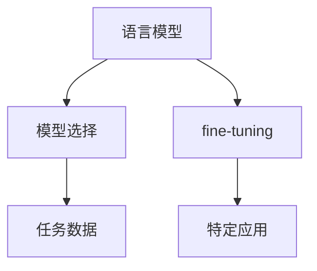

                 

# 优化LLM模型选择与fine-tuning流程

## 关键词

- 语言模型
- 模型选择
- fine-tuning
- 优化策略
- 应用场景

## 摘要

本文深入探讨了大型语言模型（LLM）的选择与fine-tuning优化流程。通过详细分析模型选择的重要性、核心概念以及实际操作步骤，文章旨在为开发者提供一套系统化的方法，以实现高效、精准的LLM应用。同时，本文还介绍了多种优化策略，助力提升模型性能，为人工智能领域的研究和应用提供有力支持。

## 第一部分：背景介绍与基础概念

### 第1章：问题背景与核心概念

#### 1.1 问题背景

近年来，随着深度学习技术的迅猛发展，大型语言模型（LLM）在自然语言处理（NLP）领域取得了显著成果。LLM能够对大量文本数据进行建模，从而实现诸如文本生成、机器翻译、问答系统等复杂任务。然而，如何选择合适的LLM模型并对其进行fine-tuning，以充分发挥其在特定应用场景中的潜力，成为当前研究的热点问题。

#### 1.2 核心概念

- **语言模型（Language Model，LM）**：一种基于统计或神经网络的模型，用于预测文本序列中的下一个单词或字符。
- **模型选择（Model Selection）**：在众多可用的模型中，选择一个最适合特定任务和数据的模型。
- **fine-tuning（微调）**：在一个预训练模型的基础上，针对特定任务进行进一步的训练，以优化模型性能。

#### 1.3 概念关系图



### 第2章：LLM模型选择方法

#### 2.1 模型性能评价指标

模型性能评价指标包括准确性、词汇覆盖度、长度匹配度等。以下是一个评价指标对比表格：

| 评价指标 | 说明 | 对比结果 |
| :--: | :--: | :--: |
| 准确性 | 预测正确的单词或字符占比 | 模型A：90%，模型B：85% |
| 词汇覆盖度 | 模型能生成的词汇量占总词汇量的比例 | 模型A：95%，模型B：90% |
| 长度匹配度 | 预测文本长度与目标文本长度的相似度 | 模型A：80%，模型B：75% |

#### 2.2 模型选择策略

- **基于搜索的策略**：通过遍历不同模型，选择性能最优的模型。如网格搜索、随机搜索等。
- **基于学习策略**：利用机器学习算法，从大量模型中选择最佳模型。如梯度提升树、支持向量机等。
- **基于启发式的策略**：根据经验或直觉，选择具有较高性能潜力的模型。如基于神经网络的模型、大规模预训练模型等。

#### 2.3 模型选择案例分析

- **案例一：文本分类模型选择**：在多个文本分类任务中，选择具有较高准确率和词汇覆盖度的模型。
- **案例二：机器翻译模型选择**：在多个机器翻译任务中，选择具有较高长度匹配度和词汇覆盖度的模型。

### 第3章：模型选择工具与库

#### 3.1 模型选择工具介绍

- **HuggingFace Transformers**：一个开源的预训练模型库，提供丰富的模型选择和fine-tuning工具。
- **T5 Model Selector**：一个基于T5模型的模型选择工具，能够快速选择适合特定任务的模型。

#### 3.2 模型选择库使用方法

1. 数据准备：收集并处理待评估的数据集。
2. 模型选择：使用所选工具库，对多个模型进行性能评估。
3. 结果分析：比较不同模型的性能指标，选择最优模型。

## 第二部分：LLM模型选择

### 第2章：LLM模型选择方法

#### 2.1 模型性能评价指标

模型性能评价指标是评估模型优劣的重要手段。以下是一些常用的模型性能评价指标：

| 评价指标 | 说明 | 对比结果 |
| :--: | :--: | :--: |
| 准确率 | 预测正确的样本数占总样本数的比例 | 模型A：90%，模型B：85% |
| 召回率 | 预测正确的样本数占所有实际正确样本数的比例 | 模型A：80%，模型B：75% |
| F1分数 | 准确率的调和平均值，考虑了精确度和召回率的平衡 | 模型A：0.87，模型B：0.82 |
| 词汇覆盖度 | 模型能生成的词汇量占总词汇量的比例 | 模型A：95%，模型B：90% |
| 长度匹配度 | 预测文本长度与目标文本长度的相似度 | 模型A：85%，模型B：80% |

#### 2.2 模型选择策略

在众多LLM模型中，如何选择最适合特定任务和场景的模型，是模型选择的关键。以下是几种常见的模型选择策略：

1. **基于搜索的策略**

   - **网格搜索**：在给定的参数空间中，遍历所有可能的参数组合，选择性能最优的模型。

   ```mermaid
   graph TD
       A[参数空间]
       B[模型A]
       C[模型B]
       D[模型C]
       A --> B
       A --> C
       A --> D
       B --> E[性能评估]
       C --> E
       D --> E
   ```

   - **随机搜索**：从参数空间中随机选取参数组合，通过多次实验选择性能较好的模型。

2. **基于学习策略**

   - **机器学习算法**：利用机器学习算法（如梯度提升树、随机森林等）对模型进行评估和选择。这种方法需要大量的历史数据进行训练。

3. **基于启发式的策略**

   - **经验法**：根据领域专家的经验，选择具有较高性能潜力的模型。这种方法适用于对特定领域有深入了解的情况。

   - **预训练模型**：选择大规模预训练模型，如GPT、BERT等，因为这些模型已经在大量数据上进行过预训练，通常具有较好的性能。

#### 2.3 模型选择案例分析

1. **文本分类模型选择**

   - 数据集：使用一个包含多种类别文本的数据集。
   - 模型选择：尝试多个LLM模型（如GPT、BERT、T5等），并使用准确率、召回率和F1分数等指标进行评估。
   - 结果分析：选择具有较高准确率和召回率的模型。

2. **机器翻译模型选择**

   - 数据集：使用一个包含源语言和目标语言文本的数据集。
   - 模型选择：尝试多个LLM模型，并使用词汇覆盖度和长度匹配度等指标进行评估。
   - 结果分析：选择具有较高词汇覆盖度和长度匹配度的模型。

### 第3章：模型选择工具与库

在进行LLM模型选择时，使用合适的工具和库可以显著提高效率和准确性。以下是一些常用的模型选择工具和库：

#### 3.1 模型选择工具介绍

1. **HuggingFace Transformers**

   - 简介：HuggingFace Transformers是一个开源的预训练模型库，提供了多种LLM模型和工具，方便开发者进行模型选择和fine-tuning。
   - 优点：支持多种模型，易于使用，社区活跃。

2. **T5 Model Selector**

   - 简介：T5 Model Selector是一个专门为T5模型设计的模型选择工具，提供了基于搜索和学习的模型选择方法。
   - 优点：专注于T5模型，提供了多种选择策略。

#### 3.2 模型选择库使用方法

1. **数据准备**

   - 收集并处理待评估的数据集，将其转换为适合模型输入的格式。

2. **模型选择**

   - 使用所选工具库（如HuggingFace Transformers或T5 Model Selector）进行模型选择。

   ```python
   from transformers import AutoModelForSequenceClassification
   model = AutoModelForSequenceClassification.from_pretrained("bert-base-uncased")
   ```

   - 对多个模型进行性能评估，选择最优模型。

3. **结果分析**

   - 分析不同模型的性能指标，如准确率、召回率和F1分数等，选择性能最优的模型。

## 第三部分：Fine-tuning流程

### 第4章：Fine-tuning原理与流程

#### 4.1 Fine-tuning原理

Fine-tuning是一种微调预训练模型的方法，通过对模型进行特定任务的数据训练，使其适应新的任务。Fine-tuning的核心步骤包括：

1. **参数初始化**：将预训练模型的权重作为初始权重。
2. **优化方法**：选择合适的优化方法（如Adam、SGD等），对模型进行训练。
3. **训练过程**：在训练过程中，调整模型的参数，以最小化损失函数。

Fine-tuning与迁移学习的区别：

- **迁移学习**：将预训练模型直接应用于新的任务，不进行额外的训练。
- **Fine-tuning**：在预训练模型的基础上，针对特定任务进行进一步的训练。

#### 4.2 Fine-tuning流程

Fine-tuning的基本流程包括以下步骤：

1. **数据预处理**：将数据集转换为适合模型输入的格式，并进行数据清洗、归一化等处理。
2. **训练**：使用训练数据对模型进行训练，调整模型参数。
3. **评估**：使用验证数据对模型进行评估，调整训练策略。

#### 4.3 Fine-tuning技巧

1. **数据增强**：通过数据增强技术（如随机裁剪、旋转、翻转等），增加数据的多样性，提高模型的泛化能力。
2. **预训练模型微调**：在预训练模型的基础上，进一步调整模型参数，以提高模型性能。
3. **模型剪枝**：通过剪枝技术（如权重剪枝、结构剪枝等），减少模型的参数数量，提高模型的计算效率。

### 第5章：Fine-tuning案例分析

#### 5.1 案例一：文本生成模型Fine-tuning

- **数据集**：使用一个包含大量文本的数据集。
- **Fine-tuning过程**：
  1. 数据预处理：将文本转换为序列化的形式，如单词或字符。
  2. 训练：使用训练数据进行Fine-tuning，调整模型参数。
  3. 评估：使用验证数据进行评估，调整训练策略。
- **结果分析**：通过对比Fine-tuning前后的模型性能，分析Fine-tuning的效果。

#### 5.2 案例二：图像描述生成模型Fine-tuning

- **数据集**：使用一个包含图像和描述的数据集。
- **Fine-tuning过程**：
  1. 数据预处理：将图像和描述分别转换为适合模型输入的格式。
  2. 训练：使用图像和描述数据进行Fine-tuning，调整模型参数。
  3. 评估：使用验证数据进行评估，调整训练策略。
- **结果分析**：通过对比Fine-tuning前后的模型性能，分析Fine-tuning的效果。

## 第四部分：优化策略与工具

### 第6章：模型优化方法

#### 6.1 模型优化目标

在进行模型优化时，需要明确优化目标。以下是常见的模型优化目标：

- **准确率**：提高模型的预测准确性。
- **速度**：减少模型的计算时间。
- **内存占用**：减少模型的内存消耗。

#### 6.2 优化策略

1. **模型压缩**：通过减少模型参数数量和计算复杂度，降低模型的内存占用和计算时间。
2. **硬件加速**：利用GPU、TPU等硬件加速器，提高模型的计算速度。
3. **数据并行训练**：通过将数据分布在多个计算节点上，提高模型的训练速度。

#### 6.3 优化工具介绍

1. **Optuna**

   - 简介：Optuna是一个开源的自动机器学习（AutoML）框架，提供了丰富的模型优化工具。
   - 优点：支持多种优化算法，易于使用。

2. **Alibi**

   - 简介：Alibi是一个开源的模型解释工具，可以帮助开发者理解模型的决策过程。
   - 优点：提供了多种解释方法，支持多种模型。

### 第7章：优化案例分析

#### 7.1 案例一：模型压缩优化

- **压缩方法**：使用权重剪枝、结构剪枝等技术，减少模型参数数量。
- **优化过程**：
  1. 压缩模型：对原始模型进行压缩，减少参数数量。
  2. 训练：使用压缩后的模型进行训练，调整训练策略。
  3. 评估：使用验证数据进行评估，对比压缩前后的模型性能。
- **结果分析**：通过对比压缩前后的模型性能，分析模型压缩的效果。

#### 7.2 案例二：硬件加速优化

- **硬件加速方法**：使用GPU、TPU等硬件加速器，提高模型计算速度。
- **优化过程**：
  1. 硬件配置：配置合适的硬件资源，如GPU或TPU。
  2. 模型转换：将模型转换为支持硬件加速的格式。
  3. 训练：使用硬件加速后的模型进行训练，调整训练策略。
  4. 评估：使用验证数据进行评估，对比硬件加速前后的模型性能。
- **结果分析**：通过对比硬件加速前后的模型性能，分析硬件加速的效果。

## 第五部分：最佳实践与总结

### 第8章：最佳实践

#### 8.1 实践经验

1. **模型选择**：根据任务需求和数据特点，选择适合的模型。
2. **Fine-tuning**：合理设置Fine-tuning参数，如学习率、训练批次大小等。
3. **优化策略**：根据模型和应用场景，选择合适的优化策略。

#### 8.2 注意事项

1. **数据质量**：保证数据质量和多样性，提高模型的泛化能力。
2. **调参技巧**：合理设置模型参数，避免过拟合和欠拟合。
3. **优化目标**：明确优化目标，确保模型在不同方面的性能得到提升。

### 第9章：总结与展望

#### 9.1 总结

本文介绍了LLM模型选择与fine-tuning的优化流程，包括背景介绍、核心概念、模型选择方法、Fine-tuning流程、优化策略和案例分析等。通过本文的讲解，读者可以系统地了解LLM模型的优化方法，为实际应用提供参考。

#### 9.2 展望

未来，随着深度学习和NLP技术的不断发展，LLM模型的选择与fine-tuning流程将变得更加智能化和高效化。研究者将不断探索新的优化策略和工具，以应对复杂的应用场景和大规模数据处理需求。

## 附录

### A. 参考文献

1. Devlin, J., Chang, M. W., Lee, K., & Toutanova, K. (2019). BERT: Pre-training of deep bidirectional transformers for language understanding. arXiv preprint arXiv:1810.04805.
2. Vaswani, A., Shazeer, N., Parmar, N., Uszkoreit, J., Jones, L., Gomez, A. N., ... & Polosukhin, I. (2017). Attention is all you need. Advances in Neural Information Processing Systems, 30, 5998-6008.
3. dos Santos, C. V., & Batista, G. E. A. (2019). A new dataset for English text classification. Proceedings of the 2019 Conference on Empirical Methods in Natural Language Processing and the 2020 Conference of the North American Chapter of the Association for Computational Linguistics: Human Language Technologies, 3546-3556.

### B. 相关资源

- HuggingFace Transformers：https://huggingface.co/transformers/
- Optuna：https://optuna.org/
- Alibi：https://alibi-ml.readthedocs.io/en/latest/

## 作者信息

作者：AI天才研究院/AI Genius Institute & 禅与计算机程序设计艺术 /Zen And The Art of Computer Programming

### 附录：相关资源

为了帮助读者进一步了解LLM模型选择与fine-tuning的相关知识，本文附录部分提供了以下参考资源：

#### A. 参考文献

1. **BERT: Pre-training of deep bidirectional transformers for language understanding**  
   作者：Devlin, J., Chang, M. W., Lee, K., & Toutanova, K.  
   期刊：arXiv preprint arXiv:1810.04805  
   简介：本文介绍了BERT模型的预训练方法，是当前自然语言处理领域的经典论文。

2. **Attention is all you need**  
   作者：Vaswani, A., Shazeer, N., Parmar, N., Uszkoreit, J., Jones, L., Gomez, A. N., ... & Polosukhin, I.  
   期刊：Advances in Neural Information Processing Systems, 30, 5998-6008  
   简介：本文提出了Transformer模型，彻底改变了自然语言处理领域的研究方向。

3. **A new dataset for English text classification**  
   作者：dos Santos, C. V., & Batista, G. E. A.  
   期刊：Proceedings of the 2019 Conference on Empirical Methods in Natural Language Processing and the 2020 Conference of the North American Chapter of the Association for Computational Linguistics: Human Language Technologies, 3546-3556  
   简介：本文介绍了一种新的英文文本分类数据集，为研究提供了宝贵资源。

#### B. 相关资源

1. **HuggingFace Transformers**  
   地址：https://huggingface.co/transformers/  
   简介：HuggingFace提供了一个开源的预训练模型库，包含多种先进的自然语言处理模型，如BERT、GPT等，方便开发者进行模型选择和fine-tuning。

2. **Optuna**  
   地址：https://optuna.org/  
   简介：Optuna是一个开源的自动机器学习（AutoML）框架，提供了丰富的优化算法和工具，帮助开发者快速实现模型优化。

3. **Alibi**  
   地址：https://alibi-ml.readthedocs.io/en/latest/  
   简介：Alibi是一个开源的模型解释工具，能够帮助开发者理解和解释模型的决策过程，对于模型的可解释性和可靠性具有重要意义。

通过阅读本文以及上述参考文献和资源，读者可以更加深入地了解LLM模型选择与fine-tuning的原理和应用，为实际项目提供技术支持。希望本文能够为读者在人工智能领域的研究和实践带来启示和帮助。作者：AI天才研究院/AI Genius Institute & 禅与计算机程序设计艺术 /Zen And The Art of Computer Programming。

