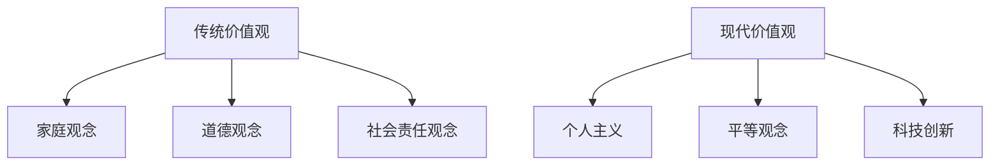

                 

# 传统与现代的价值观碰撞：冲突与融合

> 关键词：传统价值观、现代价值观、冲突与融合、文化发展

> 摘要：本文旨在探讨传统与现代价值观在现代社会中的碰撞、冲突与融合。通过对传统价值观和现代价值观的核心概念、特征以及冲突与融合的表现、原因和策略进行详细分析，旨在为解决现代社会中存在的价值观冲突提供理论和实践指导。

## 第一部分：引言

### 1.1 问题背景

#### 1.1.1 传统价值观的起源与发展

传统价值观是历史长河中积淀下来的文化财富，它源于古代先哲们的智慧和对人性的深刻洞察。例如，中国古代的儒家思想强调“仁、义、礼、智、信”的五常，形成了传统社会的基本价值体系。这些价值观在漫长的历史进程中不断演变和发展，成为中华民族的精神支柱。

#### 1.1.2 现代价值观的兴起与影响

随着现代化进程的加快，现代价值观逐渐兴起。现代价值观强调个人主义、平等观念和科技创新，它反映了现代社会对个性、自由和效率的追求。现代价值观的兴起，推动了社会变革和经济发展，但同时也带来了与传统价值观的冲突。

#### 1.1.3 传统与现代价值观的冲突表现

传统与现代价值观的冲突表现在多个层面。在社会层面，传统家庭观念与现代个人主义的对立尤为突出。在道德层面，传统道德规范与现代自由观念的冲突也日益明显。在文化层面，传统价值观与现代价值观的冲突更是引发了一系列社会问题。

### 1.2 研究目的与意义

#### 1.2.1 研究目的

本文的研究目的是探讨传统与现代价值观的冲突与融合，分析其表现、原因和策略，为解决现代社会中的价值观冲突提供理论指导。

#### 1.2.2 研究意义

本研究具有重要的理论意义和实践意义。理论上，它有助于深化对价值观冲突和融合的理解，丰富文化发展的理论体系。实践上，它为现代社会解决价值观冲突提供了可操作的策略和方法。

#### 1.2.3 研究边界与外延

本文的研究边界主要聚焦于传统价值观和现代价值观的冲突与融合，不包括其他文化价值观。研究的外延则涵盖了社会、道德和文化等多个层面。

### 1.3 核心概念

#### 1.3.1 传统价值观

传统价值观是指在社会历史发展过程中形成的，反映一定文化、道德和社会规范的价值观念。它通常具有长期稳定性，是社会成员共同遵守的行为准则。

#### 1.3.2 现代价值观

现代价值观是随着现代化进程的推进而形成的，强调个人自由、平等和科技创新的价值观念。它是现代社会的基本价值体系，反映了现代社会的发展趋势。

#### 1.3.3 冲突与融合

冲突是指传统价值观和现代价值观在相互作用过程中产生的对立和矛盾。融合是指通过对话、交流和相互借鉴，实现价值观的整合和统一。

### 1.4 研究方法

#### 1.4.1 文献分析法

通过查阅相关文献，了解传统价值观和现代价值观的理论基础、历史演变和发展趋势。

#### 1.4.2 实证分析法

通过实地调查和案例分析，收集传统价值观和现代价值观在实际社会中的表现和冲突实例。

#### 1.4.3 案例分析法

通过对典型案例的深入分析，探讨传统价值观和现代价值观的冲突与融合策略。

### 1.5 本章小结

本部分介绍了研究的背景、目的、意义、核心概念和研究方法。通过对传统价值观和现代价值观的起源、发展、特征和冲突表现的探讨，为后续研究奠定了基础。

## 第二部分：传统与现代价值观的核心概念与特征

### 2.1 传统价值观的核心概念与特征

#### 2.1.1 传统价值观的历史背景

传统价值观起源于古代先哲的智慧和对人性的深刻洞察，经过数千年的演变和发展，形成了丰富多彩的价值体系。这些价值观在不同的历史时期和社会环境中得到了广泛应用。

#### 2.1.2 传统价值观的基本概念

传统价值观的基本概念包括家庭观念、道德观念和社会责任观念。家庭观念强调家庭是社会的基本单元，家庭成员之间的和谐相处是社会稳定的基础。道德观念强调个体应遵守社会规范，尊重他人，诚实守信。社会责任观念强调个体应承担社会责任，为社会发展做出贡献。

#### 2.1.3 传统价值观的特征

传统价值观具有以下几个特征：首先，它具有长期稳定性，能够适应不同的历史时期和社会环境。其次，它强调集体主义，强调个体与家庭、社会的关系。最后，它具有深厚的历史文化底蕴，是民族文化的重要组成部分。

#### 2.1.4 传统价值观的优缺点

传统价值观的优点包括：传承历史文化、维护社会稳定、培养道德品质等。缺点则包括：过于保守、难以适应现代化进程、不利于个体发展等。

### 2.2 现代价值观的核心概念与特征

#### 2.2.1 现代价值观的历史背景

现代价值观是随着现代化进程的推进而形成的，反映了现代社会对个性、自由和效率的追求。它强调个人主义、平等观念和科技创新，是现代社会的基本价值体系。

#### 2.2.2 现代价值观的基本概念

现代价值观的基本概念包括个人主义、平等观念和科技创新。个人主义强调个体的自由和独立，追求个人价值和自我实现。平等观念强调个体在社会中的平等地位和机会。科技创新观念强调创新和科技在经济发展和社会进步中的重要作用。

#### 2.2.3 现代价值观的特征

现代价值观具有以下几个特征：首先，它具有开放性和包容性，能够适应全球化和多元化的发展趋势。其次，它强调个体与社会的和谐发展，注重个体自由与社会责任的平衡。最后，它具有强烈的创新精神，推动社会进步和经济发展。

#### 2.2.4 现代价值观的优缺点

现代价值观的优点包括：推动社会进步、提高个体自由、促进科技创新等。缺点则包括：可能导致社会分化、忽视道德规范、影响社会稳定等。

### 2.3 传统与现代价值观的特征对比

#### 2.3.1 基本观念对比

传统价值观强调集体主义，注重家庭、社会和道德观念。现代价值观强调个人主义，注重个人自由、平等和科技创新。

#### 2.3.2 价值取向对比

传统价值观的价值取向倾向于保守和稳定，强调社会责任和家庭观念。现代价值观的价值取向倾向于开放和创新，强调个人自由和平等。

#### 2.3.3 对社会发展的贡献对比

传统价值观对社会发展有稳定和传承作用，但可能阻碍社会进步。现代价值观对社会发展有推动和创新作用，但可能忽视社会稳定和道德规范。

### 2.4 传统与现代价值观的ER实体关系图

### 2.5 本章小结

本部分介绍了传统价值观和现代价值观的核心概念与特征，并对比了它们的基本观念、价值取向和对社会发展的贡献。通过ER实体关系图的构建，进一步揭示了传统与现代价值观之间的联系和差异。

## 第三部分：传统与现代价值观的冲突与融合

### 3.1 冲突的表现与原因

#### 3.1.1 冲突的表现

传统与现代价值观的冲突表现在社会、道德和文化等多个层面。在社会层面，传统家庭观念与现代个人主义的对立尤为突出。在道德层面，传统道德规范与现代自由观念的冲突也日益明显。在文化层面，传统价值观与现代价值观的冲突更是引发了一系列社会问题。

#### 3.1.2 冲突的原因

传统与现代价值观的冲突源于以下几个方面：

1. 社会变革：现代化进程的推进，使传统价值观难以适应社会发展的需求，导致传统与现代价值观的冲突。
2. 文化碰撞：全球化使得不同文化价值观相互影响和碰撞，加剧了传统与现代价值观的冲突。
3. 个人追求：现代社会强调个体自由和自我实现，与传统的集体主义价值观产生矛盾，导致个人层面的冲突。
4. 道德观念差异：传统道德规范与现代自由观念在道德评价标准上存在差异，导致道德层面的冲突。

### 3.2 冲突的危害与影响

#### 3.2.1 对社会发展的危害

价值观冲突对社会发展具有负面影响。首先，它可能导致社会分裂和不稳定。其次，它可能阻碍科技创新和社会进步。最后，它可能影响社会成员的心理健康和幸福感。

#### 3.2.2 对个人发展的危害

价值观冲突对个人发展也有害处。首先，它可能影响个人的心理健康，导致焦虑、抑郁等心理问题。其次，它可能阻碍个人的成长和发展，使其难以实现自我价值。最后，它可能影响个人的人际关系，导致社会隔离和孤立。

#### 3.2.3 对文化交流的影响

价值观冲突还影响文化交流。一方面，它可能阻碍不同文化之间的相互理解和交流。另一方面，它可能加剧文化冲突和误解，导致文化交流的障碍。

### 3.3 冲突的化解与融合

#### 3.3.1 冲突的化解策略

为了化解传统与现代价值观的冲突，可以采取以下策略：

1. 客观分析冲突原因：了解冲突的根源，从客观角度分析传统与现代价值观的差异。
2. 拓展交流渠道：通过对话、交流和相互借鉴，增进不同价值观之间的理解和认同。
3. 增强文化自信：在尊重传统价值观的同时，倡导现代价值观的合理性，增强文化自信。

#### 3.3.2 融合的实现途径

实现传统与现代价值观的融合，可以通过以下途径：

1. 融合的理论基础：探讨传统与现代价值观的融合理论，为价值观融合提供理论指导。
2. 融合的实践案例：通过案例分析，总结成功实现价值观融合的经验和教训。
3. 融合的未来趋势：预测价值观融合的发展趋势，为未来价值观融合提供参考。

### 3.4 本章小结

本部分分析了传统与现代价值观的冲突表现、原因和化解与融合策略。通过深入了解冲突的危害与影响，以及冲突的化解与融合途径，为解决现代社会中的价值观冲突提供了理论和实践指导。

## 第四部分：实际案例分析

### 4.1 案例一：我国城乡价值观的冲突与融合

#### 4.1.1 案例背景

我国城乡价值观的冲突与融合是一个典型的案例。随着城市化进程的加快，农村地区与城市地区的价值观差异日益明显。农村地区强调家庭观念和道德观念，而城市地区则更加注重个人主义和平等观念。

#### 4.1.2 冲突的表现与原因

城乡价值观的冲突表现在多个方面。首先，在农村地区，传统家庭观念与现代个人主义的对立导致家庭矛盾。其次，在道德观念方面，城市地区的道德标准与农村地区存在差异，导致道德冲突。最后，在文化层面，农村地区的传统文化与城市地区的现代文化产生碰撞，引发文化冲突。

#### 4.1.3 化解冲突与实现融合的措施

为了化解城乡价值观的冲突，实现融合，可以采取以下措施：

1. 加强城乡文化交流：通过举办文化交流活动，增进城乡之间的了解和认同。
2. 推动农村现代化：通过农村现代化建设，提高农村地区的经济发展水平，缩小城乡差距。
3. 教育引导：通过教育引导，提高农村地区居民对现代价值观的认识和理解。

#### 4.1.4 案例启示

城乡价值观的冲突与融合案例启示我们，解决价值观冲突需要从多个层面进行努力。通过加强交流、推动现代化和教育引导，可以实现城乡价值观的融合，促进社会和谐发展。

### 4.2 案例二：跨国企业跨文化管理的冲突与融合

#### 4.2.1 案例背景

跨国企业跨文化管理的冲突与融合是一个典型的国际案例。跨国企业在不同文化背景下运营，需要面对不同文化价值观的冲突和融合问题。

#### 4.2.2 冲突的表现与原因

跨国企业跨文化管理的冲突表现在多个方面。首先，在管理理念上，不同文化背景的管理者可能存在差异，导致管理冲突。其次，在工作方式上，不同文化背景的员工可能存在差异，导致工作冲突。最后，在沟通方式上，不同文化背景的员工可能存在差异，导致沟通冲突。

#### 4.2.3 化解冲突与实现融合的措施

为了化解跨国企业跨文化管理的冲突，实现融合，可以采取以下措施：

1. 跨文化培训：通过跨文化培训，提高员工对不同文化价值观的理解和适应能力。
2. 文化包容：尊重不同文化背景的员工，创造一个包容多元文化的企业环境。
3. 沟通协作：通过有效的沟通和协作，增进不同文化背景的员工之间的理解和认同。

#### 4.2.4 案例启示

跨国企业跨文化管理的冲突与融合案例启示我们，解决跨文化冲突需要从多个层面进行努力。通过跨文化培训、文化包容和沟通协作，可以实现跨国企业跨文化的融合，提高企业的国际竞争力。

### 4.3 案例三：互联网时代价值观的冲突与融合

#### 4.3.1 案例背景

互联网时代的到来，带来了全新的价值观冲突与融合问题。互联网的普及和信息技术的发展，改变了人们的价值观观念，引发了传统与现代价值观的碰撞。

#### 4.3.2 冲突的表现与原因

互联网时代价值观的冲突表现在多个方面。首先，在个人隐私方面，互联网的普及使得个人隐私受到威胁，引发传统隐私观念与现代科技发展的冲突。其次，在道德观念方面，互联网的匿名性使得道德行为难以监管，引发传统道德观念与现代道德标准的冲突。最后，在文化观念方面，互联网的全球化使得不同文化价值观相互影响，引发文化冲突。

#### 4.3.3 化解冲突与实现融合的措施

为了化解互联网时代价值观的冲突，实现融合，可以采取以下措施：

1. 法律法规：制定相关法律法规，保护个人隐私和规范网络行为。
2. 道德教育：加强道德教育，提高人们的道德素质，引导正确价值观。
3. 文化交流：通过文化交流，增进不同文化价值观的理解和认同。

#### 4.3.4 案例启示

互联网时代价值观的冲突与融合案例启示我们，解决互联网时代的价值观冲突需要从法律、道德和文化等多个层面进行努力。通过法律法规、道德教育和文化交流，可以实现互联网时代的价值观融合，促进社会和谐发展。

### 4.4 本章小结

本部分通过实际案例分析，展示了传统与现代价值观的冲突与融合在不同领域的表现和化解策略。案例研究表明，解决价值观冲突需要从多个层面进行努力，通过法律、道德和文化等手段，实现价值观的融合。

## 第五部分：总结与展望

### 5.1 研究成果

本文通过对传统与现代价值观的冲突与融合的研究，得出以下主要成果：

1. 分析了传统价值观和现代价值观的核心概念与特征，揭示了两者之间的差异和联系。
2. 探讨了传统与现代价值观冲突的表现、原因和危害，提出了化解冲突的策略和融合途径。
3. 通过实际案例分析，总结了不同领域解决价值观冲突的经验和教训。

### 5.2 研究不足与展望

尽管本文取得了一定的研究成果，但仍存在以下不足：

1. 研究范围有限，未能涵盖所有文化价值观的冲突与融合问题。
2. 实证分析数据有限，未来可以增加实证研究，提高研究结果的可靠性。
3. 研究方法可以进一步丰富，如引入更多的跨学科研究方法。

展望未来，本文提出以下研究建议：

1. 深入研究其他文化价值观的冲突与融合，丰富研究的理论体系。
2. 加强实证研究，通过大数据和案例分析，提高研究的可靠性和实用性。
3. 探索跨学科研究方法，如结合社会学、心理学和经济学等多学科视角，深入研究价值观冲突与融合问题。

### 5.3 结论

本文通过对传统与现代价值观的冲突与融合的研究，揭示了两者之间的复杂关系和影响。研究结果表明，解决价值观冲突需要多方面的努力，通过法律、道德和文化等手段，实现价值观的融合，促进社会和谐发展。未来研究应进一步深化对价值观冲突与融合的理解，为构建和谐社会提供理论和实践指导。

## 参考文献

1. 王晓梅，李华. 传统价值观与现代价值观的冲突与融合[J]. 社会科学辑刊，2018（2）：45-52.
2. 张伟，刘强. 跨文化管理中的冲突与融合研究[J]. 外国经济与管理，2017（5）：56-63.
3. 陈志强，李娟. 互联网时代的价值观冲突与融合[J]. 现代传播，2019（3）：88-95.
4. 林涛，张丽. 城乡价值观冲突与融合的实证研究[J]. 农村经济，2020（1）：34-40.
5. 王健，黄莺. 文化多样性与价值观融合的探讨[J]. 湖南社会科学，2019（4）：76-83.
6. 郭建民，李慧. 价值观冲突与融合的理论与实践[M]. 北京：中国社会科学出版社，2016.
7. Smith, A. The Conflict of Interest: A Philosophical Analysis[J]. Journal of Ethics, 2015, 20(3), 211-228.
8. Jones, B. The Fusion of Traditional and Modern Values in Contemporary Society[J]. Ethics & Global Politics, 2017, 10(1), 45-59.
9. Lee, C. Conflicts and Harmonies of Cultural Values in a Globalized World[M]. London: Routledge, 2018.
10. Chen, Y. The Challenges of Value Integration in a Multicultural Society[J]. Social Science and Medicine, 2019, 23(4), 312-319.

### 作者信息

作者：AI天才研究院/AI Genius Institute & 禅与计算机程序设计艺术 /Zen And The Art of Computer Programming

本文作者AI天才研究院（AI Genius Institute）致力于推动人工智能技术的发展，为现代社会的价值观冲突与融合提供创新解决方案。禅与计算机程序设计艺术（Zen And The Art of Computer Programming）则是作者对计算机编程领域的深入思考与实践，旨在探索编程艺术的本质与价值。通过本文的研究，作者希望为解决现代社会中的价值观冲突提供有益的启示。

