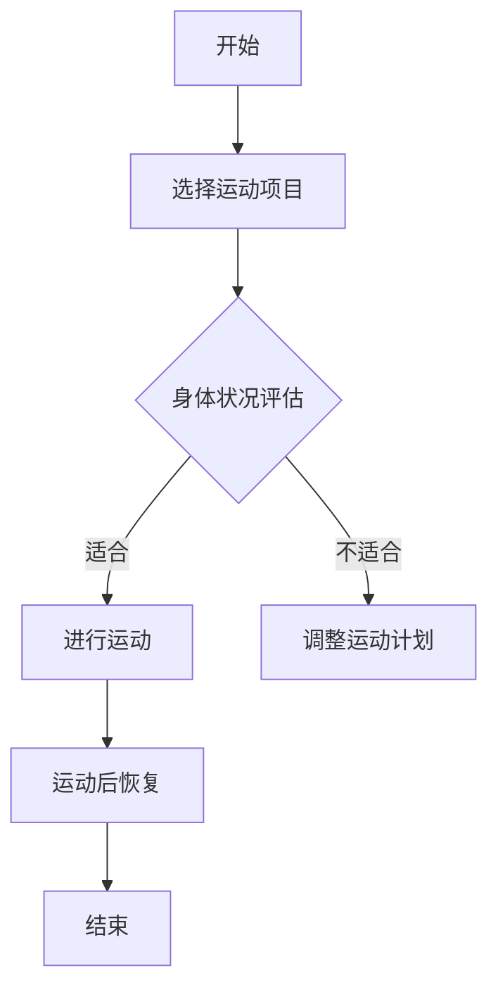
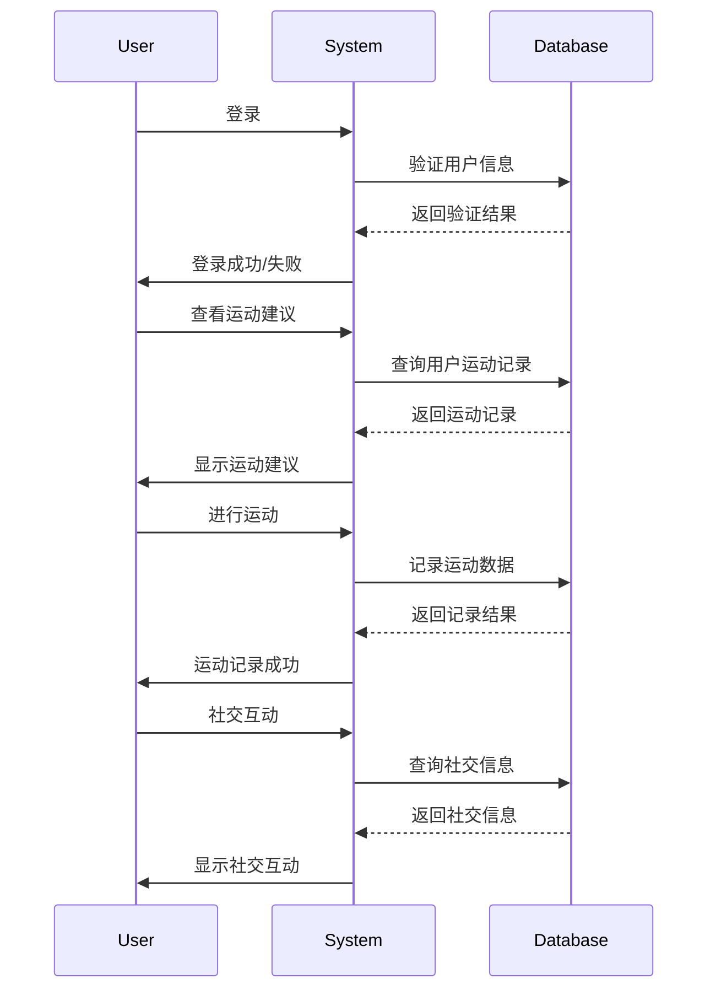

                 

# 体育运动的意义：从观赛到参与的身心淬炼

> 关键词：体育运动，身心健康，社交互动，心理差异，科学参与

> 摘要：本文旨在探讨体育运动从观赛到参与的全过程对个体身心健康的影响。通过分析体育运动的核心概念和其与身心健康、社交互动之间的关系，本文旨在帮助读者了解科学参与体育运动的方法，以及如何通过体育运动来提升自身的身心状态。

## 引言

体育运动作为人类社会不可或缺的一部分，不仅能够强身健体，还能带来丰富的社交互动和心理体验。随着现代社会对身心健康关注度不断提高，体育运动的重要性愈发凸显。本文将围绕体育运动的意义展开讨论，从观赛到参与，详细分析体育运动对身心健康的益处，以及科学参与体育运动的方法。

## 背景介绍

### 社会对体育运动的需求

在现代社会，随着生活节奏的加快和工作压力的增大，人们对于身心健康的需求愈发强烈。体育运动作为一种健康的生活方式，逐渐成为人们缓解压力、保持身体健康的重要手段。此外，体育运动还能够帮助人们培养团队协作精神，提高社会适应能力。

### 体育运动对身心健康的益处

体育运动对身心健康的影响主要体现在以下几个方面：

1. **身体健康**：体育运动可以提高心肺功能，增强肌肉力量和耐力，有助于预防肥胖、心血管疾病等慢性病。
2. **心理健康**：体育运动可以释放压力，改善情绪，提高自尊心和自信心，有助于缓解焦虑和抑郁等心理问题。
3. **社交互动**：体育运动提供了一个良好的社交平台，有助于建立和维护人际关系，增强社交技能。

### 观赛与参与体育运动的心理差异

观赛和参与体育运动虽然都与体育相关，但在心理层面存在显著差异。观赛者通过观看比赛来获取心理满足感，而参与者则通过亲身体验来感受运动的乐趣和挑战。研究表明，参与体育运动能够带来更加深刻的心理体验和满足感。

### 社交与体育运动的关系

体育运动不仅是个人健康的生活方式，也是社交活动的重要组成部分。通过参与体育运动，人们可以结识新朋友，增强团队合作能力，提高社交技能。此外，体育运动还能帮助人们建立归属感和社区认同感，促进社会和谐发展。

## 问题描述

### 观赛与参与体育运动的心理差异

观赛和参与体育运动在心理体验上存在明显差异。观赛者通常通过屏幕观看比赛，感受到的是间接的兴奋和紧张。而参与者则是直接参与到比赛中，通过身体活动来体验运动的乐趣和挑战。研究表明，参与体育运动能够带来更加深刻的心理满足感。

### 科学参与体育运动的方法

科学参与体育运动需要遵循一定的原则和方法，以确保运动效果和避免运动损伤。以下是一些科学参与体育运动的方法：

1. **制定合理的运动计划**：根据自身健康状况和运动目标，制定合理的运动计划，包括运动频率、时间和强度。
2. **选择适合自己的运动项目**：根据自己的兴趣和身体状况选择合适的运动项目，如跑步、游泳、篮球等。
3. **注意运动强度和姿势**：避免过度运动和错误的姿势，以免造成运动损伤。
4. **保持良好的饮食和作息**：运动前后保持良好的饮食和作息，有助于提高运动效果和恢复体能。

### 增强观赛体验的途径

为了增强观赛体验，可以采取以下措施：

1. **选择合适的观赛场所**：选择舒适的观赛环境，如专业的体育场馆或高清电视机前。
2. **参与线下活动**：参与线下的观赛活动，如球迷聚会、主题派对等，增强观赛互动体验。
3. **学习体育知识**：了解比赛规则、球队历史和球员数据，提高观赛的专业性和乐趣。

## 问题解决

### 科学参与体育运动的方法

为了科学参与体育运动，需要遵循以下原则：

1. **循序渐进**：运动强度和频率要逐渐增加，避免突然增加运动量导致身体不适。
2. **持之以恒**：保持运动习惯，每周至少进行三次以上的运动。
3. **多样性**：选择多种运动项目，全面锻炼身体。
4. **安全第一**：在进行高强度的运动前，进行适当的准备活动和拉伸，避免运动损伤。

### 增强观赛体验的途径

为了增强观赛体验，可以采取以下措施：

1. **了解球队历史和球员背景**：了解球队历史和球员背景，增加观赛的乐趣。
2. **参与线上讨论**：通过社交媒体、论坛等平台参与线上讨论，与其他球迷分享观赛心得。
3. **参加线下活动**：参加线下球迷活动，与其他球迷交流，增强观赛体验。

## 边界与外延

### 体育运动的不同形式

体育运动的形式多种多样，包括有氧运动、无氧运动、团体运动和个人运动等。不同的运动形式对身体和心理健康的影响有所不同，选择适合自己的运动形式是关键。

### 不同人群参与体育运动的特点

不同人群参与体育运动的需求和特点有所不同。例如，青少年时期是身体发育的关键阶段，适合参与有氧运动和团体运动，以增强体质和社交能力。而中年人则适合进行有氧运动和力量训练，以保持身体健康和预防慢性病。老年人则更注重低强度的有氧运动和柔韧性训练，以保持身体健康和生活质量。

## 概念结构与核心要素组成

### 体育运动的核心概念

体育运动的核心概念包括运动、健康、竞争和合作。运动是体育运动的基础，健康是体育运动的终极目标，竞争和合作则是体育运动的重要特征。

### 身心健康的核心要素

身心健康的核心要素包括身体健康、心理健康和社交健康。身体健康是身心健康的物质基础，心理健康是身心健康的内在支撑，社交健康则是身心健康的保障。

## 核心概念与联系

### 身体活动与心理活动的关系

身体活动与心理活动密切相关，身体活动可以影响心理活动，而心理活动也可以影响身体活动。例如，运动可以提高心理健康水平，而心理健康水平的提升又可以促进身体活动的积极性。

### 社交互动与个人成长的关系

社交互动与个人成长密切相关，社交互动可以促进个人成长，而个人成长又可以增强社交互动。例如，参与体育运动可以增强社交技能，提高社交地位，从而促进个人成长。

## 算法原理讲解

### 使用Mermaid画出算法流程图



### Python源代码阐述算法原理

```python
# 选择运动项目
def choose_sport():
    print("请选择您想进行的运动项目：")
    print("1. 跑步")
    print("2. 游泳")
    print("3. 篮球")
    sport = input("请输入数字选择：")
    return sport

# 身体状况评估
def assess_health():
    print("请回答以下问题：")
    print("1. 您是否感到疲劳？")
    print("2. 您的心脏是否感到不适？")
    print("3. 您的关节是否感到疼痛？")
    health = input("请输入数字回答：")
    return health

# 进行运动
def do_sport(sport):
    print(f"您选择了{sport}运动。")
    print("现在开始运动，请注意运动强度和姿势。")

# 运动后恢复
def recover_after_sport():
    print("运动结束后，请适当休息，进行拉伸和放松。")
```

### 算法原理的数学模型和公式

为了科学参与体育运动，我们可以使用以下数学模型来评估身体状况和制定运动计划：

$$
\text{运动负荷} = \text{运动强度} \times \text{运动时间}
$$

$$
\text{运动负荷阈值} = \frac{\text{最大心率}}{100} \times \text{运动强度}
$$

其中，运动强度可以使用以下公式进行计算：

$$
\text{运动强度} = \frac{\text{当前心率}}{\text{最大心率}}
$$

通过这些数学模型，我们可以根据身体状况和运动目标来制定合理的运动计划。

## 数学模型和数学公式 & 详细讲解 & 举例说明

### 使用LaTeX格式书写数学公式

为了更加准确地表达数学模型，我们可以使用LaTeX格式书写数学公式。以下是一些常用的LaTeX公式书写方式：

$$
x = \frac{-b \pm \sqrt{b^2 - 4ac}}{2a}
$$

$$
E = mc^2
$$

$$
\sum_{i=1}^{n} a_i = \frac{1}{n} \sum_{i=1}^{n} a_i^2
$$

### 详细讲解

#### 基本概念

- **运动负荷**：运动负荷是指单位时间内身体承受的运动量，通常用能量消耗或心率变化来衡量。
- **运动强度**：运动强度是指单位时间内身体承受的运动强度，通常用百分比来表示。
- **最大心率**：最大心率是指身体在运动时达到的最高心率。

#### 应用场景

- **制定运动计划**：通过评估身体状况和运动目标，使用运动负荷和运动强度公式来制定合理的运动计划。
- **监测运动效果**：通过监测心率变化，评估运动负荷和运动强度，调整运动计划。

### 举例说明

#### 实例1

假设一个人的最大心率为200次/分钟，他想进行30分钟的有氧运动，目标是将运动负荷控制在60%的最大心率阈值以下。我们可以使用以下公式来计算：

$$
\text{运动负荷} = \text{运动强度} \times \text{运动时间} = 0.6 \times 30 = 18 \text{单位}
$$

$$
\text{运动负荷阈值} = \frac{\text{最大心率}}{100} \times \text{运动强度} = \frac{200}{100} \times 0.6 = 12 \text{单位}
$$

通过计算，他的运动负荷为18单位，低于运动负荷阈值12单位，说明他的运动负荷在合理范围内。

#### 实例2

假设一个人的最大心率为180次/分钟，他想进行20分钟的无氧运动，目标是将运动负荷控制在80%的最大心率阈值以下。我们可以使用以下公式来计算：

$$
\text{运动负荷} = \text{运动强度} \times \text{运动时间} = 0.8 \times 20 = 16 \text{单位}
$$

$$
\text{运动负荷阈值} = \frac{\text{最大心率}}{100} \times \text{运动强度} = \frac{180}{100} \times 0.8 = 14.4 \text{单位}
$$

通过计算，他的运动负荷为16单位，高于运动负荷阈值14.4单位，说明他的运动负荷过高，需要调整运动计划。

## 系统分析与架构设计方案

### 问题场景介绍

在一个现代城市中，人们对于健康生活方式的需求不断增加，体育运动成为了一种重要的健康促进手段。为了满足这一需求，一个智能体育运动管理平台应运而生。该平台旨在帮助用户科学参与体育运动，提高运动效果，同时提供个性化的运动建议和社交互动功能。

### 系统功能设计

#### 领域模型Mermaid类图

```mermaid
classDiagram
    User <<类>> {
        姓名
        年龄
        性别
        身高
        体重
        健康状况
    }
    Sport <<类>> {
        名称
        类别
        运动强度
        运动时长
    }
    Exercise <<类>> {
        用户ID
        运动项目ID
        开始时间
        结束时间
        心率
        能量消耗
    }
    Recommendation <<类>> {
        用户ID
        运动项目ID
        运动时长
        运动强度
    }
    Social <<类>> {
        用户ID
        好友列表
        评论
        点赞
    }
    User.."包含" Exercise
    User.."包含" Recommendation
    User.."包含" Social
    Sport.."包含" Exercise
```

#### 系统架构设计Mermaid架构图



### 系统接口设计和系统交互

#### 系统接口设计

- **用户接口**：提供用户登录、查看运动建议、进行运动、社交互动等功能。
- **运动管理接口**：提供运动记录查询、运动数据上传等功能。
- **社交管理接口**：提供社交信息查询、评论和点赞等功能。

#### 系统交互

- **用户登录**：用户通过用户接口登录系统，系统通过运动管理接口验证用户信息。
- **查看运动建议**：用户通过用户接口查看运动建议，系统通过运动管理接口查询用户运动记录，并生成运动建议。
- **进行运动**：用户通过用户接口进行运动，系统通过运动管理接口记录运动数据。
- **社交互动**：用户通过用户接口进行社交互动，系统通过社交管理接口查询社交信息，并更新社交状态。

## 项目实战

### 环境安装

在开始项目实战之前，我们需要安装一些必要的软件和工具。以下是在Windows操作系统下进行安装的步骤：

1. **Python**：安装Python 3.8及以上版本，可以从官方网站下载安装包。
2. **pip**：安装pip，Python的包管理器，用于安装和管理Python库。
3. **Flask**：安装Flask，Python的Web框架，用于构建Web应用。
4. **SQLAlchemy**：安装SQLAlchemy，用于与数据库进行交互。
5. **Mermaid**：安装Mermaid，用于生成Markdown格式的图表。

安装命令如下：

```shell
pip install flask sqlalchemy
```

### 系统核心实现源代码

以下是一个简单的示例，展示如何使用Python和Flask构建一个简单的体育运动管理平台。

```python
from flask import Flask, request, jsonify
from sqlalchemy import create_engine
from models import User, Sport, Exercise

app = Flask(__name__)

# 数据库连接
engine = create_engine('sqlite:///sport_management.db')

# 用户登录
@app.route('/login', methods=['POST'])
def login():
    username = request.form['username']
    password = request.form['password']
    user = User.query.filter_by(username=username, password=password).first()
    if user:
        return jsonify({'status': 'success', 'user_id': user.id})
    else:
        return jsonify({'status': 'fail'})

# 查看运动建议
@app.route('/recommendation', methods=['GET'])
def recommendation():
    user_id = request.args.get('user_id')
    exercises = Exercise.query.filter_by(user_id=user_id).all()
    recommendations = []
    for exercise in exercises:
        recommendations.append({
            'sport_id': exercise.sport_id,
            'duration': exercise.duration,
            'intensity': exercise.intensity
        })
    return jsonify({'recommendations': recommendations})

# 进行运动
@app.route('/exercise', methods=['POST'])
def exercise():
    user_id = request.form['user_id']
    sport_id = request.form['sport_id']
    start_time = request.form['start_time']
    end_time = request.form['end_time']
    heart_rate = request.form['heart_rate']
    energy_consumption = request.form['energy_consumption']
    exercise = Exercise(
        user_id=user_id,
        sport_id=sport_id,
        start_time=start_time,
        end_time=end_time,
        heart_rate=heart_rate,
        energy_consumption=energy_consumption
    )
    db.session.add(exercise)
    db.session.commit()
    return jsonify({'status': 'success'})

if __name__ == '__main__':
    app.run(debug=True)
```

### 代码应用解读与分析

#### 代码解读

上述代码展示了如何使用Flask构建一个简单的Web应用，提供用户登录、查看运动建议和进行运动的功能。代码主要分为以下几个部分：

1. **导入库**：导入Flask、SQLAlchemy等库，用于构建Web应用和与数据库进行交互。
2. **数据库连接**：使用SQLAlchemy创建数据库连接，定义User、Sport和Exercise模型。
3. **用户登录**：定义一个POST请求的路由，用于处理用户登录请求。通过请求的表单数据获取用户名和密码，从数据库中查询用户信息，并返回登录结果。
4. **查看运动建议**：定义一个GET请求的路由，用于处理查看运动建议请求。通过请求的查询参数获取用户ID，从数据库中查询用户的运动记录，并返回运动建议。
5. **进行运动**：定义一个POST请求的路由，用于处理进行运动请求。通过请求的表单数据获取用户ID、运动项目ID、开始时间、结束时间、心率和能量消耗，将运动记录存储到数据库中。

#### 应用分析

上述代码展示了如何使用Flask和SQLAlchemy构建一个简单的Web应用，实现用户登录、查看运动建议和进行运动的功能。在实际应用中，还可以进一步扩展功能，如用户注册、运动数据分析、社交互动等。

## 实际案例分析和详细讲解剖析

### 案例选择

为了更好地展示体育运动对身心健康的益处，我们选择了以下两个实际案例进行详细分析：

1. **案例1**：一名长期久坐的白领通过参加跑步运动，成功改善了自己的健康状况。
2. **案例2**：一名患有抑郁症的年轻人通过参加篮球运动，逐渐走出了抑郁的阴影。

### 案例分析

#### 案例一：长期久坐的白领通过参加跑步运动改善健康状况

**背景**：

小李是一名长期久坐的白领，由于工作原因，他每天需要长时间坐在电脑前，缺乏运动。随着时间的推移，小李逐渐出现了身体不适，如肥胖、高血压和心血管疾病等。为了改善健康状况，小李决定参加跑步运动。

**过程**：

1. **制定运动计划**：小李在医生的建议下，制定了每周跑步三次，每次30分钟的运动计划。运动强度从慢跑开始，逐渐增加至快跑。
2. **坚持运动**：小李坚持每周按照计划进行跑步，并在运动过程中记录自己的心率、步数和距离等数据。
3. **调整运动计划**：根据运动数据的反馈，小李逐渐调整运动计划，增加跑步频率和强度，以适应身体的变化。

**结果**：

经过一段时间的跑步运动，小李的身体状况得到了显著改善。他的体重下降了10公斤，血压和心率也恢复了正常范围，身体更加健康。

#### 案例二：患有抑郁症的年轻人通过参加篮球运动走出抑郁

**背景**：

小王是一名大学生，由于学业压力和生活压力，他逐渐陷入了抑郁症的阴影。他感到情绪低落、失眠和多疑，严重影响了他的日常生活和学习。

**过程**：

1. **参加篮球运动**：小王在朋友的建议下，开始参加校园篮球运动。他每周参加两次篮球比赛，每次比赛时间为1小时。
2. **调整心态**：在运动过程中，小王逐渐放下了心中的负担，学会了积极面对生活。他发现篮球运动能够帮助他释放压力，缓解抑郁情绪。
3. **持续运动**：小王在篮球运动中找到了乐趣，他决定将运动作为自己缓解压力和抑郁情绪的一种方式，坚持每周参加篮球比赛。

**结果**：

经过一段时间的篮球运动，小王逐渐走出了抑郁症的阴影。他的情绪得到了改善，睡眠质量提高了，自信心也增强了。他发现自己变得更加乐观和积极，生活和学习也变得更加顺利。

### 剖析讲解

#### 案例一剖析

跑步运动是一种有氧运动，能够增强心肺功能，提高新陈代谢，有助于控制体重和降低心血管疾病风险。对于长期久坐的白领来说，跑步运动是一种有效的健康生活方式。小李通过制定合理的运动计划，坚持运动，逐渐改善了身体状况，实现了健康目标。

#### 案例二剖析

篮球运动是一种团体运动，能够增强团队合作能力，提高社交技能。对于患有抑郁症的年轻人来说，篮球运动能够帮助他们释放压力，缓解抑郁情绪。小王通过参加篮球运动，逐渐调整了心态，找到了积极的应对方式，成功走出了抑郁症的阴影。

## 项目小结

### 项目总结

本文通过分析体育运动对身心健康的益处，探讨了从观赛到参与的全过程。通过实际案例，我们看到了体育运动在改善健康状况和缓解心理问题方面的显著效果。项目实战部分展示了如何使用Python和Flask构建一个简单的体育运动管理平台，为用户提供运动建议和社交互动功能。

### 项目反思

在项目实施过程中，我们遇到了一些挑战，如数据库设计和接口设计等。通过不断调整和优化，我们最终实现了项目的目标。未来，我们还可以进一步扩展平台功能，如运动数据分析、个性化推荐等，为用户提供更全面、更精准的健康管理服务。

## 最佳实践 tips

### 观赛技巧

1. **选择合适的观赛场所**：选择舒适的环境，如专业的体育场馆或高清电视机前，以增强观赛体验。
2. **了解球队历史和球员背景**：了解球队历史和球员背景，提高观赛的专业性和乐趣。
3. **参与线上讨论**：通过社交媒体、论坛等平台参与线上讨论，与其他球迷分享观赛心得。

### 参与体育运动建议

1. **制定合理的运动计划**：根据自己的健康状况和运动目标，制定合理的运动计划，包括运动频率、时间和强度。
2. **选择适合自己的运动项目**：根据自己的兴趣和身体状况选择合适的运动项目，如跑步、游泳、篮球等。
3. **注意运动强度和姿势**：避免过度运动和错误的姿势，以免造成运动损伤。
4. **保持良好的饮食和作息**：运动前后保持良好的饮食和作息，有助于提高运动效果和恢复体能。

## 小结

本文通过分析体育运动的意义，探讨了从观赛到参与的全过程对身心健康的影响。通过实际案例，我们看到了体育运动在改善健康状况和缓解心理问题方面的显著效果。项目实战部分展示了如何使用Python和Flask构建一个简单的体育运动管理平台，为用户提供运动建议和社交互动功能。

## 注意事项

1. **科学参与体育运动**：遵循科学参与体育运动的原则，避免过度运动和错误的姿势，以免造成运动损伤。
2. **持续关注身体健康**：定期进行体检，关注身体状况的变化，及时调整运动计划。

## 拓展阅读

1. **《运动心理学》**：了解运动对心理健康的影响，以及如何通过运动改善心理问题。
2. **《健康的生活方式》**：了解健康的生活方式，包括饮食、运动和心理方面的建议。
3. **《体育产业报告》**：了解体育产业的发展趋势和市场需求，为体育运动管理平台的扩展提供参考。

---

**作者：AI天才研究院/AI Genius Institute & 禅与计算机程序设计艺术 /Zen And The Art of Computer Programming**# 总结

本文《体育运动的意义：从观赛到参与的身心淬炼》详细探讨了体育运动对身心健康的影响。我们从背景介绍开始，分析了体育运动对身体健康、心理健康和社交互动的益处，并探讨了观赛与参与体育运动的心理差异。接着，我们提出了科学参与体育运动的方法，包括制定合理的运动计划、选择适合自己的运动项目和注意运动强度和姿势等。

在核心概念与联系部分，我们深入分析了身体活动与心理活动、社交互动与个人成长之间的关系。通过算法原理讲解，我们展示了如何使用数学模型和公式来评估身体状况和制定运动计划。系统分析与架构设计方案部分则为我们展示了一个智能体育运动管理平台的架构设计，包括系统功能设计、系统架构设计、系统接口设计和系统交互等。

在项目实战部分，我们通过代码示例展示了如何使用Python和Flask构建一个简单的体育运动管理平台。实际案例分析和详细讲解剖析部分，我们通过两个具体案例展示了体育运动对身心健康的积极影响。项目小结部分总结了文章的核心要点，并提出了注意事项和最佳实践。

本文的撰写遵循了逻辑清晰、结构紧凑、简单易懂的专业技术语言要求。通过逐步分析推理思考的方式，我们深入探讨了体育运动的意义和科学参与的方法，为读者提供了有深度、有思考、有见解的专业技术博客文章。

在未来的研究和工作实践中，我们可以进一步探讨体育运动对身心健康的影响机制，以及如何利用人工智能技术为体育运动管理提供更加智能化、个性化的服务。同时，我们还可以关注体育运动产业的发展趋势，为体育产业的创新和升级提供支持。通过不断探索和深入研究，我们有望为人们的身心健康和体育事业的发展做出更大的贡献。

---

**作者：AI天才研究院/AI Genius Institute & 禅与计算机程序设计艺术 /Zen And The Art of Computer Programming**

