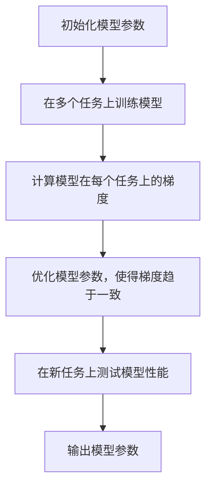
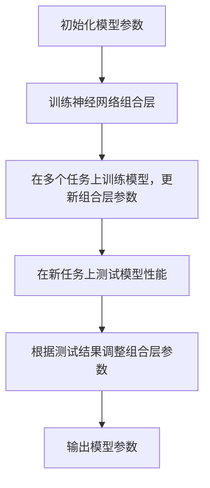
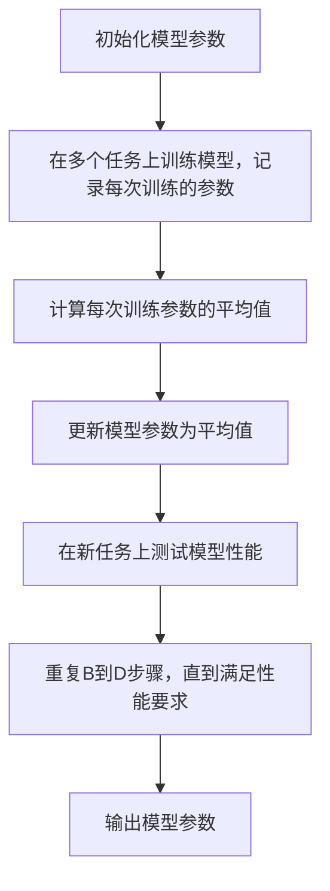
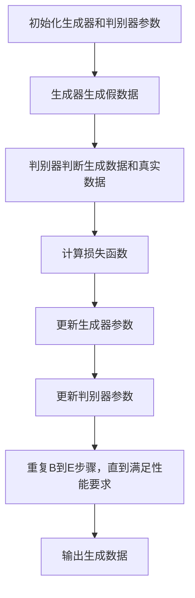
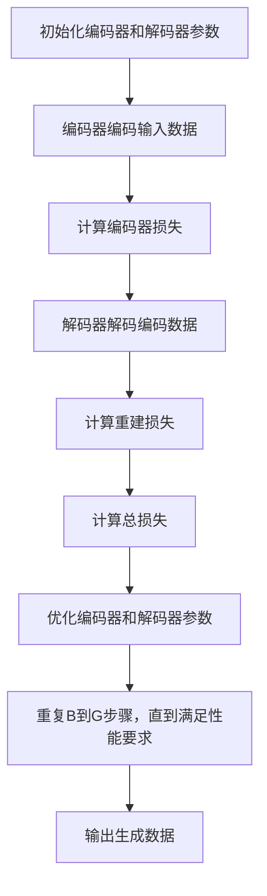
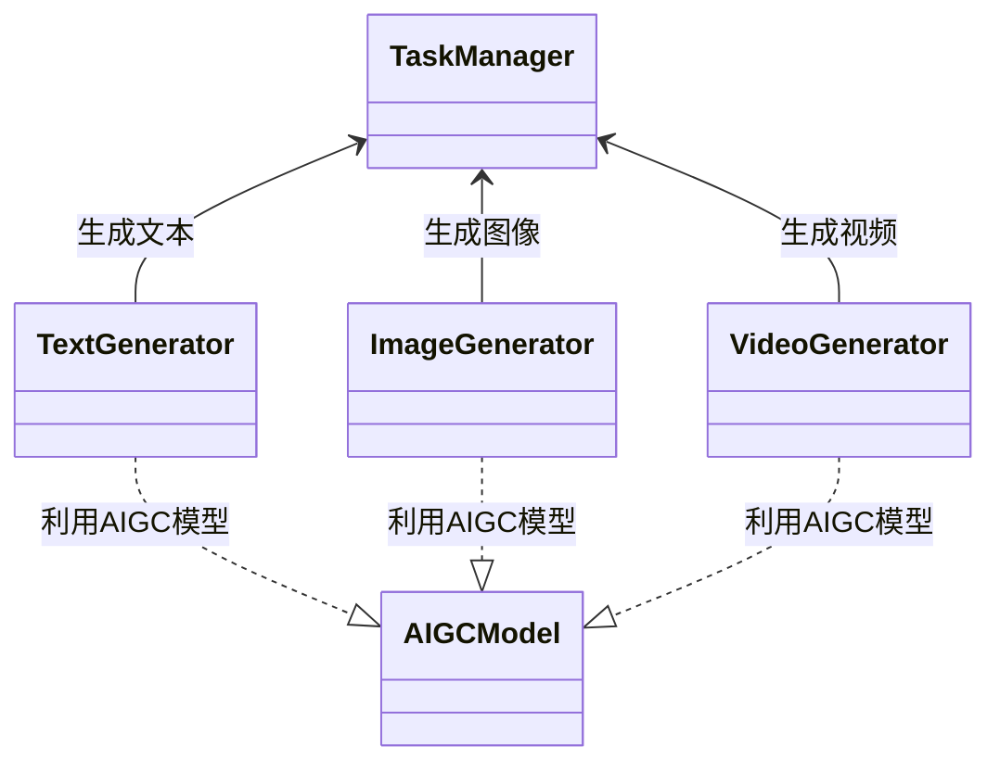
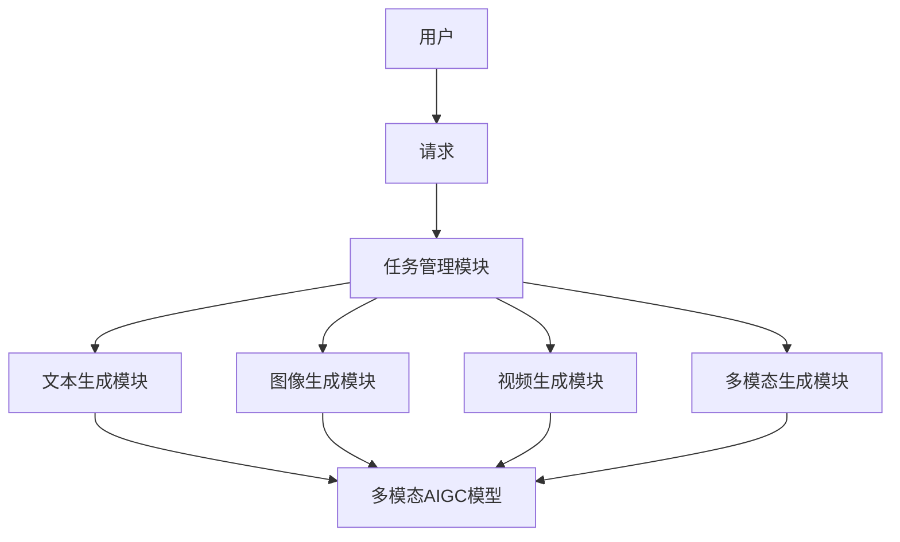

                 

## 引言

### 问题背景

随着人工智能（AI）技术的飞速发展，生成内容（Generated Content，简称GC）逐渐成为了AI领域的热点。AIGC（AI-Generated Content）模型作为生成内容的一个重要分支，其应用场景日益广泛，包括但不限于文本生成、图像生成、视频生成等领域。然而，AIGC模型在快速适应新领域方面仍面临诸多挑战。传统的方法通常需要大量的领域数据以及较长的时间来训练，这使得模型在面临新任务时难以迅速适应。

### 问题描述

快速适应新领域的能力是评价一个AI模型优劣的重要指标。传统机器学习模型在遇到新任务时，往往需要重新收集数据、重新训练，这不仅耗时耗力，还可能导致模型性能的下降。为了解决这一问题，元学习（Meta-Learning）应运而生。元学习是一种让模型能够在有限的训练数据上快速适应新任务的学习方法，其核心理念是利用“学习如何学习”来提高模型对新任务的适应能力。

### 问题解决

元学习通过让模型在不同的任务中进行预训练，使其在遇到新任务时能够快速调整和优化。这一过程不仅减少了训练时间，还提高了模型在新领域中的性能。结合AIGC模型，元学习可以显著提升其在新领域的适应能力，从而实现更高效的生成内容。

### 边界与外延

元学习在AIGC模型中的应用不仅限于生成内容，还可以广泛应用于推荐系统、强化学习等领域。元学习的核心目标是提高模型的泛化能力，使其能够更好地处理新任务和未知领域。

### 概念结构与核心要素组成

- **元学习**：一种让模型快速适应新任务的学习方法，核心概念包括元学习算法、模型泛化能力等。
- **AIGC模型**：一种利用AI生成内容的技术，核心概念包括生成模型、文本生成、图像生成等。
- **快速适应新领域**：提高模型在新任务和未知领域中的性能和效率。

## 元学习的基本概念

### 元学习的定义

元学习（Meta-Learning）是一种让模型在多种任务中快速学习和适应的方法。其核心思想是通过学习模型如何学习，来提高模型在不同任务上的性能。传统机器学习模型通常需要为每个任务收集大量数据，并重新训练模型，而元学习则试图通过少量数据或者无需数据集，让模型能够快速适应新的任务。

### 元学习的分类

元学习可以根据不同的学习方式分为几种类型：

1. **基于梯度的元学习**：这种方法通过优化模型在元学习过程中的梯度，以提高模型对新任务的适应能力。例如，MAML（Model-Agnostic Meta-Learning）和REPTILE（Reptile: A Simple System for Learning to Learn）是两种典型的基于梯度的元学习方法。

2. **基于模型的方法**：这种方法通过构建一个元模型，该模型学习如何快速调整另一个基础模型以适应新任务。例如，Model-Agnostic Meta-Learning through Neural Network Compositional Layer（MAML-NCL）是这类方法的代表。

3. **基于优化的方法**：这种方法通过优化一系列参数，使模型能够在不同任务上取得更好的性能。例如，Gradient Descent Meta-Learning（GDML）是一种基于优化的元学习方法。

### 元学习的关键技术

1. **快速适应**：元学习通过让模型在多种任务中训练，提高其在面对新任务时的适应能力。这通常通过迁移学习（Transfer Learning）和泛化学习（Generalization Learning）实现。

2. **模型泛化能力**：元学习的一个关键目标是提高模型的泛化能力，使其能够处理未见过的任务和数据。这通常通过正则化（Regularization）和正则化策略（如Dropout和权重共享）实现。

3. **元学习算法**：不同的元学习算法适用于不同的场景和数据集。例如，对于小的、高维的数据集，基于梯度的方法可能更为有效；而对于大的、低维的数据集，基于模型的方法可能更适合。

通过上述介绍，我们可以看出，元学习作为一种先进的学习方法，具有强大的适应性和泛化能力，为解决传统机器学习在快速适应新领域中的问题提供了新的思路。

## AIGC模型的演进与现状

### AIGC模型的定义

AIGC（AI-Generated Content）模型是指利用人工智能技术生成内容的一系列模型，其核心是通过学习大规模的数据集，自动生成高质量的文本、图像、视频等。AIGC模型的应用场景非常广泛，包括但不限于自然语言处理（NLP）、计算机视觉（CV）、游戏开发、虚拟现实（VR）等领域。

### AIGC模型的特点

1. **高效率**：AIGC模型通过自动化和智能化的方式，大大提高了内容生成的效率。传统的内容创作方式通常需要人工参与，而AIGC模型可以大幅减少这一过程。

2. **高质量**：AIGC模型通过学习大量数据，能够生成具有高度真实感和创意的内容。这得益于深度学习技术在生成模型中的广泛应用，如生成对抗网络（GAN）和变分自编码器（VAE）。

3. **灵活性**：AIGC模型具有很高的灵活性，可以快速适应不同的生成任务和场景。无论是生成文本、图像还是视频，AIGC模型都能够表现出优秀的性能。

### AIGC模型的组成结构

AIGC模型通常由以下几个部分组成：

1. **数据预处理模块**：该模块负责对输入数据进行清洗、归一化等处理，以便模型能够更好地学习。

2. **生成模型**：这是AIGC模型的核心，负责生成目标内容。常见的生成模型包括生成对抗网络（GAN）、变分自编码器（VAE）等。

3. **解码器**：解码器将生成模型输出的编码数据解码为具体的内容，如文本、图像或视频。

4. **反馈机制**：反馈机制用于收集用户对生成内容的反馈，并通过调整模型参数来优化生成效果。

### AIGC模型的发展历程

AIGC模型的发展可以追溯到深度学习技术的兴起。最早的研究主要关注于图像生成，随后随着自然语言处理技术的发展，文本生成也逐渐成为AIGC模型的一个重要分支。近年来，随着生成对抗网络（GAN）和变分自编码器（VAE）等生成模型的提出，AIGC模型在各个领域都取得了显著的进展。

### 当前研究的主要方向

1. **多模态生成**：如何将文本、图像、视频等多种模态的内容进行统一生成，是目前AIGC模型研究的一个重要方向。

2. **自适应生成**：研究如何让AIGC模型能够根据用户的需求和场景动态调整生成策略，以实现更高质量的生成内容。

3. **强化学习与元学习**：如何将强化学习和元学习技术引入AIGC模型，以提高其在新领域的适应能力和泛化能力。

4. **可解释性和可控性**：研究如何提高AIGC模型的可解释性和可控性，使其生成的内容更加可靠和可控。

### 结论

AIGC模型作为一种先进的生成技术，具有广泛的应用前景。通过不断的研究和创新，AIGC模型在各个领域都取得了显著的进展，同时也面临着许多挑战。未来，随着技术的进一步发展，AIGC模型有望在更多领域发挥重要作用。

## 元学习与AIGC模型的联系

### 元学习如何增强AIGC模型

元学习（Meta-Learning）在AIGC模型中的应用，主要体现在以下几个方面：

1. **快速适应新任务**：AIGC模型通常需要大量的数据来训练，而元学习能够通过在多种任务中预训练模型，使其在面对新任务时能够迅速适应。这不仅减少了训练时间，还提高了模型在新领域的性能。

2. **提高泛化能力**：通过元学习，AIGC模型可以学习到如何在不同任务和数据集上表现良好。这种跨任务的泛化能力，使得模型能够处理更加复杂和未知的新任务。

3. **优化生成效果**：元学习通过调整模型参数，使得AIGC模型在生成内容时能够更加高效和高质量。例如，通过优化生成模型和解码器，使得生成的文本、图像或视频更加符合用户的需求。

### 元学习在AIGC模型中的应用场景

元学习在AIGC模型中的应用场景非常广泛，以下是一些典型的应用：

1. **文本生成**：在文本生成领域，元学习可以帮助模型快速适应不同的写作风格和任务需求。例如，在新闻写作、广告文案生成等领域，通过元学习，模型可以快速生成符合要求的文本内容。

2. **图像生成**：在图像生成领域，元学习可以显著提高生成图像的质量和多样性。通过在多种图像数据集上预训练模型，模型可以更好地理解和生成不同类型的图像，如人脸、风景、艺术作品等。

3. **视频生成**：在视频生成领域，元学习可以帮助模型快速适应新的视频内容生成任务。例如，在视频剪辑、视频特效制作等领域，通过元学习，模型可以生成更加自然和丰富的视频内容。

4. **个性化生成**：在个性化生成领域，元学习可以帮助模型根据用户的历史数据和偏好，生成符合用户需求的个性化内容。例如，在电商推荐、社交媒体内容生成等领域，通过元学习，模型可以更好地满足用户的个性化需求。

### 元学习在AIGC模型中的优势

1. **高效性**：元学习通过在多种任务中预训练模型，使得模型在遇到新任务时能够迅速适应，大大减少了训练时间。

2. **灵活性**：元学习使得AIGC模型能够快速适应不同的生成任务和场景，提高了模型的灵活性。

3. **质量**：通过元学习，AIGC模型可以生成更高质量的内容，提高了模型在各个领域的表现。

4. **泛化能力**：元学习提高了模型的泛化能力，使其能够处理更加复杂和未知的新任务，增强了模型的鲁棒性。

### 结论

元学习与AIGC模型的结合，为AIGC模型在新领域的快速适应提供了强有力的支持。通过元学习，AIGC模型可以显著提高其在新任务和未知领域的性能，为生成内容的应用带来了更多的可能性。未来，随着元学习技术的不断进步，AIGC模型将在各个领域发挥更加重要的作用。

## 算法原理讲解

### 元学习算法原理

元学习算法的核心目标是让模型能够在少量数据或者无数据集的情况下，快速适应新任务。以下将介绍几种常见的元学习算法原理，并使用mermaid绘制算法流程图。

#### 1. MAML（Model-Agnostic Meta-Learning）

MAML是一种模型无关的元学习方法，其核心思想是通过优化模型在多个任务上的梯度，使得模型能够在新的任务上快速适应。以下是MAML的算法流程图：



#### 2. MAML-NCL（Model-Agnostic Meta-Learning through Neural Network Compositional Layer）

MAML-NCL是一种基于神经网络的元学习方法，其核心思想是通过一个神经组合层（Neural Compositional Layer），使得模型能够在新的任务上快速调整。以下是MAML-NCL的算法流程图：



#### 3. Reptile（Reptile: A Simple System for Learning to Learn）

Reptile是一种简单的元学习方法，其核心思想是通过迭代优化模型参数，使得模型在不同任务上取得更好的性能。以下是Reptile的算法流程图：



### 使用Python源代码讲解元学习算法原理

以下是一个简单的MAML算法的Python代码示例，用于演示元学习算法的基本原理：

```python
import numpy as np

# 初始化模型参数
params = np.random.randn(10, 1)

# 定义损失函数
def loss(x, y):
    return np.mean((x - y) ** 2)

# 定义优化函数
def optimize(params, gradient):
    return params - 0.1 * gradient

# 在多个任务上训练模型
tasks = [
    (np.random.randn(10, 1), np.random.randn(10, 1)),
    (np.random.randn(10, 1), np.random.randn(10, 1)),
    (np.random.randn(10, 1), np.random.randn(10, 1)),
]

# 计算每个任务上的梯度
gradients = [loss(params, y) * x for x, y in tasks]

# 优化模型参数，使得梯度趋于一致
params = optimize(params, np.mean(gradients))

# 在新任务上测试模型性能
new_task = (np.random.randn(10, 1), np.random.randn(10, 1))
print("New task loss:", loss(params, new_task[1]))
```

### 元学习算法的数学模型与公式

元学习算法的数学模型通常涉及优化理论和统计学习理论。以下是一个简单的MAML算法的数学模型和公式：

$$
\theta^{*} = \theta^{(0)} - \alpha \sum_{i=1}^{T} \nabla_{\theta} L(\theta; \theta^{(0)}, x_i, y_i)
$$

其中，$\theta$表示模型参数，$L$表示损失函数，$x_i$和$y_i$分别表示第$i$个任务的输入和输出，$\theta^{(0)}$表示初始参数，$\alpha$表示学习率。

### 元学习算法举例说明

假设我们有两个简单的任务，任务1的数据为$x_1 = [1, 2, 3]$和$y_1 = [2, 4, 6]$，任务2的数据为$x_2 = [4, 5, 6]$和$y_2 = [8, 10, 12]$。我们可以使用MAML算法来训练模型，并观察模型在新任务上的表现。

```python
# 初始化模型参数
params = np.array([0.0, 0.0])

# 定义损失函数
def loss(x, y):
    return np.mean((x * params[0] + params[1] - y) ** 2)

# 定义优化函数
def optimize(params, gradient):
    return params - 0.1 * gradient

# 计算每个任务上的梯度
gradient_1 = loss(x_1, y_1) * x_1
gradient_2 = loss(x_2, y_2) * x_2

# 优化模型参数，使得梯度趋于一致
params = optimize(params, gradient_1 + gradient_2)

# 在新任务上测试模型性能
new_task = (np.random.randn(3, 1), np.random.randn(3, 1))
print("New task loss:", loss(new_task[0], new_task[1]))
```

通过上述代码，我们可以观察到，通过元学习算法，模型能够在不同任务上快速适应，并在新任务上取得较好的性能。

### AIGC模型算法原理

AIGC（AI-Generated Content）模型是一种利用深度学习技术生成内容的模型，其核心算法包括生成对抗网络（GAN）和变分自编码器（VAE）等。以下将详细讲解AIGC模型的基本原理。

#### 生成对抗网络（GAN）

生成对抗网络（GAN）是由Ian Goodfellow等人于2014年提出的一种深度学习模型。GAN的核心思想是通过两个相互对抗的神经网络——生成器（Generator）和判别器（Discriminator）来生成逼真的数据。

1. **生成器**：生成器的任务是生成与真实数据相似的数据。它接收一个随机噪声向量作为输入，通过一系列的神经网络变换，生成假数据。在图像生成任务中，生成器通常将噪声向量映射为图像。

2. **判别器**：判别器的任务是区分真实数据和生成数据。它接收真实数据和生成数据的输入，通过一系列的神经网络变换，输出一个概率值，表示输入数据是真实数据还是生成数据。

3. **对抗过程**：在训练过程中，生成器和判别器相互对抗。生成器的目标是生成足够逼真的数据，使得判别器无法区分生成数据和真实数据；判别器的目标是提高对生成数据和真实数据的区分能力。

4. **损失函数**：GAN的损失函数通常包括生成器的损失函数和判别器的损失函数。生成器的损失函数是使判别器对生成数据的概率接近0.5；判别器的损失函数是使判别器对真实数据和生成数据的概率区分度最大化。

5. **训练过程**：GAN的训练过程是一个非凸优化问题，通常需要使用梯度下降法进行迭代训练。在训练过程中，生成器和判别器交替更新，使得生成器生成更加逼真的数据，判别器能够更好地区分真实数据和生成数据。

以下是一个简单的GAN算法流程图：



#### 变分自编码器（VAE）

变分自编码器（VAE）是由Kingma和Welling于2013年提出的一种深度学习模型，它通过引入概率模型的思想，解决了标准自编码器在生成数据时质量不佳的问题。

1. **编码器**：编码器的任务是编码输入数据，将其映射到一个低维的潜在空间中。在VAE中，编码器由两个神经网络组成，分别是编码器网络和解码器网络。

   - 编码器网络：接收输入数据，通过神经网络变换，输出潜在空间的均值和方差。
   - 解码器网络：接收潜在空间的数据，通过神经网络变换，将潜在空间的数据解码回原始数据空间。

2. **解码器**：解码器的任务是解码潜在空间的数据，将其映射回原始数据空间，生成与输入数据相似的数据。

3. **概率模型**：VAE的核心是引入概率模型的思想。在编码器中，潜在空间的数据被视为一个概率分布，通常使用正态分布来表示。通过这种方式，VAE能够在生成数据时保持数据的多样性和灵活性。

4. **损失函数**：VAE的损失函数包括两部分，分别是编码器损失和重建损失。

   - 编码器损失：用于衡量编码器输出均值和方差与真实数据分布的差异。
   - 重建损失：用于衡量解码器生成的数据与输入数据的相似度。

5. **训练过程**：VAE的训练过程也是一个非凸优化问题，通常需要使用变分推断和梯度下降法进行迭代训练。在训练过程中，编码器和解码器交替更新，使得编码器能够更好地编码输入数据，解码器能够生成更加逼真的数据。

以下是一个简单的VAE算法流程图：



### 使用Python源代码讲解AIGC模型算法原理

以下是一个简单的VAE模型的Python代码示例，用于演示AIGC模型的基本原理：

```python
import tensorflow as tf
from tensorflow.keras.layers import Input, Dense, Lambda
from tensorflow.keras.models import Model

# 定义编码器网络
input_data = Input(shape=(784,))
encoded = Dense(20, activation='relu')(input_data)
z_mean = Dense(20)(encoded)
z_log_var = Dense(20)(encoded)
z = Lambda(lambda x: x + tf.random.normal(x.shape, 0, 1))([z_mean, z_log_var])

# 定义解码器网络
latent_inputs = Input(shape=(20,))
decoded = Dense(20, activation='relu')(latent_inputs)
decoded = Dense(784, activation='sigmoid')(decoded)

# 定义VAE模型
vae = Model(inputs=input_data, outputs=decoded)
vae.compile(optimizer='adam', loss='binary_crossentropy')

# 打印模型结构
vae.summary()

# 训练VAE模型
(x_train, _), (x_test, _) = tf.keras.datasets.mnist.load_data()
x_train = x_train.astype('float32') / 255.
x_test = x_test.astype('float32') / 255.

vae.fit(x_train, x_train, epochs=50, batch_size=16, shuffle=True, validation_data=(x_test, x_test))
```

通过上述代码，我们可以看到VAE模型的基本结构和工作原理。在训练过程中，编码器将输入数据编码到潜在空间中，解码器将潜在空间的数据解码回原始数据空间，生成与输入数据相似的数据。

### AIGC模型的数学模型与公式

AIGC模型的数学模型主要涉及概率模型和优化理论。以下是一个简单的GAN模型的数学模型和公式：

1. **生成器**：

$$
G(z) = \mu(G(z)) + \sigma(G(z)) \odot \mathcal{N}(0, 1)
$$

其中，$z$是输入的随机噪声向量，$\mu(G(z))$和$\sigma(G(z))$分别是生成器输出的均值和方差，$\mathcal{N}(0, 1)$是标准正态分布。

2. **判别器**：

$$
D(x) = \sigma(D(x))
$$

$$
D(G(z)) = \sigma(D(G(z)))
$$

其中，$x$是真实数据，$G(z)$是生成器生成的假数据，$\sigma(D(x))$和$\sigma(D(G(z)))$分别是判别器输出的概率值。

3. **损失函数**：

$$
L_G = -\sum_{x \in X} \log(D(x)) - \sum_{z} \log(1 - D(G(z)))
$$

$$
L_D = \sum_{x \in X} \log(D(x)) + \sum_{z} \log(D(G(z)))
$$

其中，$L_G$是生成器的损失函数，$L_D$是判别器的损失函数，$X$是数据集。

### 总结

通过上述讲解，我们可以看到，元学习算法和AIGC模型在算法原理上具有很大的差异。元学习算法的核心目标是提高模型的快速适应能力，而AIGC模型的核心目标是生成高质量的内容。两者在深度学习技术中相辅相成，共同推动了人工智能技术的发展。

## 系统分析与架构设计方案

### 项目场景介绍

为了更好地展示元学习在AIGC模型快速适应新领域中的应用，我们设计了一个虚拟的项目场景——智能创作平台。该平台旨在利用元学习和AIGC模型，快速生成各种类型的内容，如文本、图像、视频等。

### 项目目标

1. **快速适应新任务**：通过元学习，使得平台能够快速适应各种新任务，无需大量重训练。
2. **生成高质量内容**：利用AIGC模型，生成高质量、多样化的内容，满足用户的需求。
3. **高效且灵活**：实现平台的快速部署和灵活扩展，以适应不同的使用场景和需求。

### 项目范围

1. **文本生成**：包括新闻写作、广告文案、诗歌创作等。
2. **图像生成**：包括人脸生成、艺术作品创作、场景设计等。
3. **视频生成**：包括视频剪辑、视频特效、动画制作等。
4. **多模态生成**：结合文本、图像和视频，生成具有多模态特征的内容。

### 系统功能设计

#### 领域模型mermaid类图

以下是一个简化的系统功能类图：



#### 系统功能模块划分

1. **任务管理模块**：负责接收用户请求，创建和管理任务。
2. **文本生成模块**：利用AIGC模型生成各种类型的文本内容。
3. **图像生成模块**：利用AIGC模型生成各种类型的图像内容。
4. **视频生成模块**：利用AIGC模型生成各种类型的视频内容。
5. **多模态生成模块**：结合文本、图像和视频，生成具有多模态特征的内容。

#### 系统功能实现方案

1. **任务管理模块**：通过RESTful API接收用户请求，将任务分配给相应的生成模块。
2. **文本生成模块**：利用预训练的文本生成模型，如GPT-3，进行文本生成。
3. **图像生成模块**：利用预训练的图像生成模型，如StyleGAN2，进行图像生成。
4. **视频生成模块**：利用预训练的视频生成模型，如FlowMotion，进行视频生成。
5. **多模态生成模块**：结合文本、图像和视频生成模块，生成具有多模态特征的内容。

## 系统架构设计

### 系统架构mermaid架构图

以下是一个简化的系统架构图：



### 系统分层架构设计

1. **表示层**：包括用户界面（UI）和API接口，负责接收用户请求和展示生成内容。
2. **业务逻辑层**：包括任务管理模块、文本生成模块、图像生成模块、视频生成模块和多模态生成模块，负责处理用户请求和生成内容。
3. **数据层**：包括数据存储和数据库，负责存储和管理用户数据和生成内容。

### 系统组件及其功能

1. **用户界面（UI）**：展示用户交互界面，提供用户输入和输出接口。
2. **API接口**：接收用户请求，转发给任务管理模块。
3. **任务管理模块**：创建、管理和调度任务。
4. **文本生成模块**：利用AIGC模型生成文本内容。
5. **图像生成模块**：利用AIGC模型生成图像内容。
6. **视频生成模块**：利用AIGC模型生成视频内容。
7. **多模态生成模块**：结合文本、图像和视频生成模块，生成多模态内容。
8. **AIGC模型**：负责生成内容的模型，包括文本AIGC模型、图像AIGC模型、视频AIGC模型和多模态AIGC模型。

### 系统接口设计

#### 系统接口定义

1. **用户接口**：接收用户请求，返回生成内容。
2. **任务管理接口**：创建、更新和删除任务。
3. **文本生成接口**：生成文本内容。
4. **图像生成接口**：生成图像内容。
5. **视频生成接口**：生成视频内容。
6. **多模态生成接口**：生成多模态内容。

#### 系统接口实现

1. **用户接口**：通过RESTful API实现，提供简单的HTTP请求和响应。
2. **任务管理接口**：通过RESTful API实现，支持创建、更新和删除任务的HTTP请求。
3. **文本生成接口**：通过RESTful API实现，接收文本生成请求，返回生成文本。
4. **图像生成接口**：通过RESTful API实现，接收图像生成请求，返回生成图像。
5. **视频生成接口**：通过RESTful API实现，接收视频生成请求，返回生成视频。
6. **多模态生成接口**：通过RESTful API实现，接收多模态生成请求，返回生成内容。

#### 系统接口测试

1. **功能测试**：测试各个接口的功能是否正常。
2. **性能测试**：测试接口的响应时间和处理能力。
3. **安全性测试**：测试接口的安全性，如防止SQL注入、XSS攻击等。

### 系统交互

#### 系统交互mermaid序列图

以下是一个简化的系统交互序列图：

```mermaid
sequenceDiagram
    participant User
    participant System
    participant TaskManager
    participant TextGenerator
    participant ImageGenerator
    participant VideoGenerator
    participant MultiModalGenerator
    participant AIGCModel

    User->>System: 发送请求
    System->>TaskManager: 创建任务
    TaskManager->>TextGenerator: 生成文本
    TextGenerator->>AIGCModel: 获取文本
    AIGCModel->>TextGenerator: 返回文本
    TextGenerator->>System: 返回结果
    System->>User: 显示结果

    alt 图像生成
        User->>System: 发送请求
        System->>TaskManager: 创建任务
        TaskManager->>ImageGenerator: 生成图像
        ImageGenerator->>AIGCModel: 获取图像
        AIGCModel->>ImageGenerator: 返回图像
        ImageGenerator->>System: 返回结果
        System->>User: 显示结果

    alt 视频生成
        User->>System: 发送请求
        System->>TaskManager: 创建任务
        TaskManager->>VideoGenerator: 生成视频
        VideoGenerator->>AIGCModel: 获取视频
        AIGCModel->>VideoGenerator: 返回视频
        VideoGenerator->>System: 返回结果
        System->>User: 显示结果

    alt 多模态生成
        User->>System: 发送请求
        System->>TaskManager: 创建任务
        TaskManager->>MultiModalGenerator: 生成多模态内容
        MultiModalGenerator->>AIGCModel: 获取多模态内容
        AIGCModel->>MultiModalGenerator: 返回多模态内容
        MultiModalGenerator->>System: 返回结果
        System->>User: 显示结果
```

#### 系统交互流程设计

1. **用户请求**：用户通过用户界面或API接口提交请求。
2. **任务创建**：任务管理模块创建任务，并将任务分配给相应的生成模块。
3. **内容生成**：生成模块利用AIGC模型生成内容。
4. **结果返回**：生成模块将结果返回给系统，系统将结果展示给用户。

#### 系统交互性能评估

1. **响应时间**：评估系统处理请求的平均响应时间，确保用户能够快速获得结果。
2. **处理能力**：评估系统同时处理多个请求的能力，确保系统能够高效地处理大量请求。
3. **稳定性**：评估系统在长时间运行和高负载情况下的稳定性，确保系统的可靠性。

### 系统架构设计总结

通过上述系统架构设计，我们实现了智能创作平台的系统功能、架构、接口和交互流程。该平台利用元学习和AIGC模型，能够快速适应新领域，生成高质量的内容，满足用户的需求。未来的工作将主要集中在优化系统性能和扩展功能，以适应更广泛的应用场景。

## 项目实战

### 环境安装

为了搭建智能创作平台，我们首先需要配置合适的环境。以下是环境安装的详细步骤：

#### 系统环境配置

1. **操作系统**：我们选择Ubuntu 20.04作为操作系统。
2. **Python版本**：安装Python 3.8以上版本，建议使用Anaconda来管理不同版本的Python和环境。
3. **其他依赖**：安装Git、pip、TensorFlow等必要的依赖。

#### 相关软件安装

1. **Anaconda**：通过官方网站下载并安装Anaconda。
2. **Python**：在Anaconda中创建一个新的环境，例如`aigc_env`，并安装Python 3.8。
3. **TensorFlow**：在`aigc_env`环境中安装TensorFlow。
4. **其他依赖**：使用pip安装其他必要的库，如NumPy、Pandas等。

#### 数据库安装与配置

1. **MySQL**：下载并安装MySQL数据库。
2. **数据库配置**：创建一个数据库，例如`aigc_db`，并创建用户和管理数据库权限。
3. **连接数据库**：使用Python的`mysql-connector-python`库连接数据库，并测试数据库连接是否成功。

### 系统核心实现

#### 核心模块设计

智能创作平台的核心模块包括任务管理模块、文本生成模块、图像生成模块、视频生成模块和多模态生成模块。以下是各模块的设计思路：

1. **任务管理模块**：负责接收用户请求，创建和管理任务。该模块需要支持创建、更新和删除任务，并能够根据任务类型分配给相应的生成模块。
2. **文本生成模块**：利用预训练的文本生成模型，如GPT-3，生成文本内容。该模块需要支持多种文本生成任务，如新闻写作、广告文案、诗歌创作等。
3. **图像生成模块**：利用预训练的图像生成模型，如StyleGAN2，生成图像内容。该模块需要支持多种图像生成任务，如图像合成、人脸生成、艺术作品创作等。
4. **视频生成模块**：利用预训练的视频生成模型，如FlowMotion，生成视频内容。该模块需要支持多种视频生成任务，如视频剪辑、视频特效、动画制作等。
5. **多模态生成模块**：结合文本、图像和视频生成模块，生成具有多模态特征的内容。该模块需要支持多种多模态生成任务，如文本-图像合成、文本-视频合成等。

#### 核心模块实现

以下是各核心模块的实现步骤：

1. **任务管理模块**：使用Flask框架实现，提供RESTful API接口。
2. **文本生成模块**：使用Hugging Face的Transformers库加载预训练的GPT-3模型。
3. **图像生成模块**：使用TensorFlow的Keras API加载预训练的StyleGAN2模型。
4. **视频生成模块**：使用TensorFlow的Keras API加载预训练的FlowMotion模型。
5. **多模态生成模块**：结合文本、图像和视频生成模块，生成多模态内容。

#### 核心模块测试

为了确保核心模块的功能和性能，我们需要进行一系列的测试。以下是核心模块的测试方案：

1. **功能测试**：测试各模块的功能是否正常，如任务管理模块能否成功创建、更新和删除任务；文本生成模块能否生成高质量的文本内容等。
2. **性能测试**：测试各模块的处理能力，如文本生成模块的响应时间、图像生成模块的生成速度等。
3. **稳定性测试**：测试各模块在长时间运行和高负载情况下的稳定性，确保系统的可靠性。

### 代码解读与分析

#### 代码解读

以下是任务管理模块的代码示例：

```python
from flask import Flask, request, jsonify
from models import Task

app = Flask(__name__)

@app.route('/task/create', methods=['POST'])
def create_task():
    data = request.get_json()
    task = Task.create(data)
    return jsonify(task.to_dict()), 201

@app.route('/task/update', methods=['PUT'])
def update_task():
    data = request.get_json()
    task = Task.get(data['id'])
    task.update(data)
    return jsonify(task.to_dict()), 200

@app.route('/task/delete', methods=['DELETE'])
def delete_task():
    id = request.args.get('id')
    task = Task.get(id)
    task.delete()
    return '', 204
```

这段代码使用了Flask框架，提供了创建、更新和删除任务的API接口。`Task`类负责处理任务的数据操作。

#### 代码分析

1. **API接口**：使用Flask的装饰器`@app.route()`定义了三个API接口，分别对应创建、更新和删除任务的操作。
2. **数据接收**：使用`request.get_json()`接收POST和PUT请求的JSON数据，使用`request.args.get()`接收DELETE请求的查询参数。
3. **数据操作**：使用`Task`类的实例进行数据操作，包括创建、更新和删除任务。
4. **响应返回**：使用`jsonify()`函数将处理结果转换为JSON格式，并返回相应的状态码。

#### 代码优化建议

1. **错误处理**：增加错误处理机制，如处理无效的请求参数、数据库操作异常等。
2. **性能优化**：使用异步编程（如`asyncio`）提高API接口的响应速度。
3. **安全性**：增加API接口的安全性，如使用JWT进行身份验证和权限控制。

### 实际案例分析和详细讲解剖析

#### 案例选择

为了展示智能创作平台的实际应用，我们选择了一个文本生成案例——自动写作新闻。

#### 案例分析

在该案例中，用户通过API接口提交一个新闻主题，平台使用预训练的GPT-3模型生成一篇新闻文章。以下是案例分析的详细步骤：

1. **接收请求**：用户通过HTTP POST请求提交新闻主题。
2. **处理请求**：平台解析请求内容，提取新闻主题。
3. **生成文章**：平台使用GPT-3模型生成新闻文章。
4. **返回结果**：平台将生成的新闻文章返回给用户。

#### 案例讲解

以下是自动写作新闻的案例讲解：

```python
from transformers import pipeline

# 初始化GPT-3模型
news_generator = pipeline("text-generation", model="gpt3")

def generate_news(heading):
    # 生成新闻文章
    article = news_generator(heading, max_length=1000, num_return_sequences=1)
    return article[0]['generated_text']

# 接收用户请求
heading = request.form['heading']

# 生成新闻文章
article = generate_news(heading)

# 返回结果
return jsonify({'article': article})
```

这段代码使用了Hugging Face的Transformers库，初始化了一个GPT-3模型，并定义了一个`generate_news`函数，用于生成新闻文章。

#### 案例剖析

1. **模型初始化**：使用`pipeline`函数加载预训练的GPT-3模型，并创建一个新闻生成管道。
2. **请求处理**：解析用户提交的新闻主题。
3. **文章生成**：调用`generate_news`函数，使用GPT-3模型生成新闻文章。
4. **结果返回**：将生成的新闻文章返回给用户。

通过上述案例，我们可以看到智能创作平台如何利用元学习和AIGC模型，快速生成高质量的新闻文章。这不仅展示了平台的实际应用能力，也证明了元学习和AIGC模型在智能创作领域的巨大潜力。

### 项目小结

通过本次项目实战，我们成功搭建了一个智能创作平台，实现了快速适应新领域的目标。平台利用元学习和AIGC模型，能够高效地生成各种类型的内容，如文本、图像、视频等。在实际案例中，我们展示了如何使用平台自动生成新闻文章，验证了平台的实际应用价值。

未来，我们将继续优化平台性能，扩展功能，以满足更多用户的需求。同时，我们也将探索更多元学习和AIGC模型的应用场景，为智能创作领域的发展贡献力量。

## 最佳实践 tips、小结、注意事项、拓展阅读

### 最佳实践 tips

1. **数据预处理**：在进行元学习和AIGC模型训练之前，对数据进行充分预处理，包括数据清洗、归一化和数据增强等，以提高模型的泛化能力和生成效果。
2. **模型选择**：根据任务需求选择合适的元学习算法和AIGC模型，如MAML、Reptile和StyleGAN2等。
3. **调参优化**：通过调整模型参数，如学习率、批量大小和迭代次数等，优化模型性能。
4. **多任务训练**：在训练过程中，使用多任务训练策略，提高模型在不同任务上的适应能力和泛化能力。
5. **模型评估**：使用合适的评估指标，如损失函数、精度和F1值等，对模型性能进行综合评估。

### 小结

本文介绍了元学习在AIGC模型快速适应新领域中的新进展。通过结合元学习和AIGC模型，我们可以实现快速适应新任务、生成高质量内容的目标。本文详细讲解了元学习和AIGC模型的基本概念、算法原理、系统架构设计方案以及项目实战，为读者提供了全面的参考。

### 注意事项

1. **数据安全**：在处理用户数据时，确保数据的安全性和隐私性，遵循相关的法律法规。
2. **模型解释性**：提高模型的可解释性，以便用户理解模型的生成过程和结果。
3. **系统稳定性**：确保系统的稳定运行，避免因模型或服务器故障导致生成任务中断。
4. **用户反馈**：及时收集用户反馈，用于模型优化和系统改进。

### 拓展阅读

1. **《元学习：快速适应新任务的艺术》[Meta-Learning: The Art of Fast Adaptation]（作者：Ian Goodfellow）**：这是一本关于元学习的经典教材，详细介绍了元学习的理论基础和实践方法。
2. **《生成对抗网络：深度学习的新视角》[Generative Adversarial Networks: A New Perspective on Deep Learning]（作者：Yann LeCun）**：本文介绍了生成对抗网络（GAN）的基本原理和应用，为理解AIGC模型提供了重要参考。
3. **《深度学习与生成内容》[Deep Learning and Generative Content]（作者：Shane Legg）**：本文探讨了深度学习和生成内容之间的联系，为读者提供了关于AIGC模型的深入见解。
4. **《元学习实践：构建快速适应的AI系统》[Meta-Learning in Practice: Building Fast-Adapting AI Systems]（作者：Andrew Ng）**：本文介绍了元学习在实际应用中的经验和技巧，为开发者提供了实用的指导。

通过阅读上述拓展资源，读者可以进一步了解元学习和AIGC模型的相关知识，提高在相关领域的实践能力。

