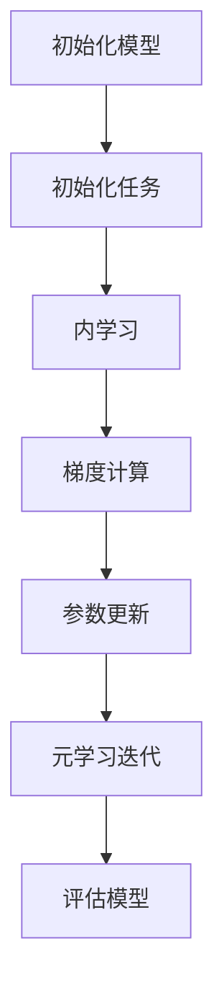
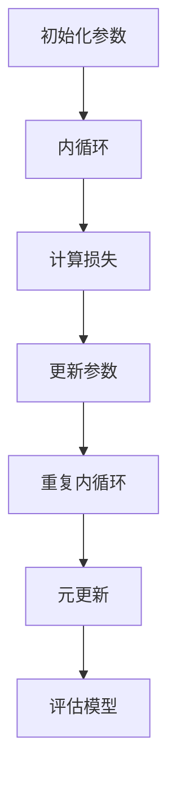
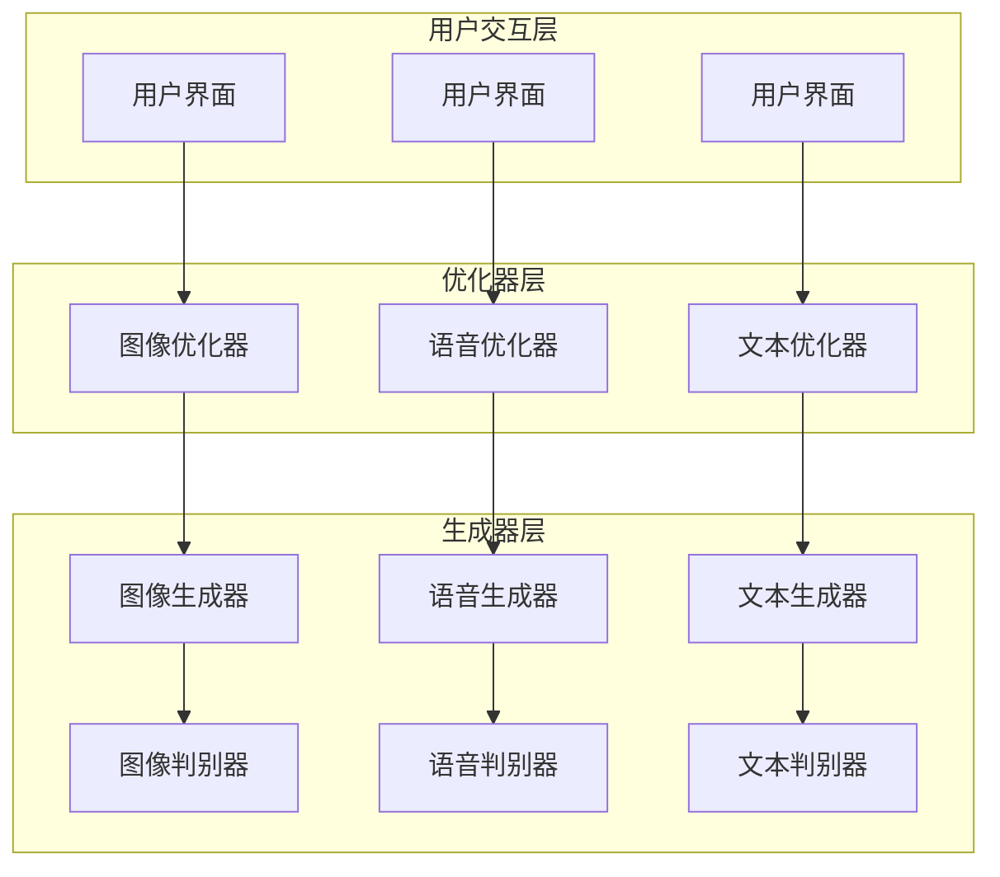
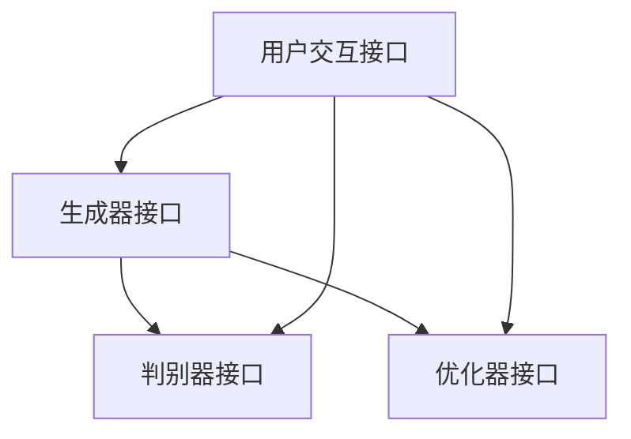

                 


### 元学习概述

元学习（Meta-Learning），又称“学习如何学习”，是一种能够在给定有限数据集上快速、高效地学习新任务的技术。其核心思想是通过学习如何学习来减少对新任务的学习时间，提高模型的泛化能力。元学习可以看作是机器学习中的“学习方法论”，旨在解决传统机器学习模型在数据稀缺或高维度特征下的学习困难。

**基本概念**

元学习的主要概念包括：

1. **学习任务**：指学习过程中的目标，例如分类、回归、聚类等。
2. **学习算法**：指学习过程中采用的方法，包括监督学习、无监督学习、强化学习等。
3. **适应能力**：指模型在面对新任务时的调整和适应能力。
4. **泛化能力**：指模型在未知数据上的表现能力。

**类型**

元学习主要分为以下几种类型：

1. **模型无关的元学习**：不依赖于特定模型结构，通过优化学习策略来提升学习效果。
2. **模型特定的元学习**：针对特定的模型结构进行优化，以提高其在新任务上的适应能力。
3. **迁移学习**：将已有知识应用于新任务中，通过已有模型来加速对新任务的学习。

**发展历程**

元学习的研究可以追溯到20世纪90年代，随着深度学习的发展，元学习也得到了广泛的关注。近年来，随着计算机硬件性能的提升和大数据技术的发展，元学习的研究和应用取得了显著的进展。

**本章小结**

本章介绍了元学习的基本概念、类型和发展历程。元学习作为一种能够加速模型在新任务上学习的先进技术，正逐渐成为人工智能领域的研究热点。

### 元学习的核心概念与联系

在深入探讨元学习之前，我们需要明确几个核心概念，并了解它们之间的联系。这些概念构成了元学习的基础，对于理解其工作原理至关重要。

**核心概念解析**

1. **内学习（Inner Learning）**：指的是模型在特定任务上的学习过程。它关注的是如何在给定的数据集上优化模型参数。
2. **外学习（Outer Learning）**：又称为元学习，是对内学习的优化过程。它通过在不同任务间转移知识，提高模型在不同情境下的适应能力。
3. **基学习器（Base Learner）**：指用于内学习的基本模型，如支持向量机（SVM）、神经网络（NN）等。
4. **元学习器（Meta-Learner）**：指用于优化基学习器的模型，它通过学习如何优化基学习器来提升整体学习效果。

**概念属性特征对比**

以下是元学习与内学习的一些主要属性特征对比：

| 特征对比项 | 元学习 | 内学习 |
| --- | --- | --- |
| **目标** | 学习如何学习 | 学习特定任务 |
| **数据需求** | 数据集多样性 | 特定任务的数据集 |
| **时间成本** | 较高（需要跨任务学习） | 较低（专注于单个任务） |
| **适应能力** | 高（适应新任务） | 低（固定任务） |
| **泛化能力** | 高（通用性） | 低（特定性） |

**ER实体关系图架构**

为了更好地理解元学习的核心概念，我们可以通过ER（实体-关系）图来描述这些概念之间的关系。以下是一个简化的ER图：

```mermaid
erDiagram
    BaseLearner ||--|{ MetaLearner : 优化 }
    Task       ||--|{ BaseLearner : 学习 }
    DataSet    ||--|{ Task         : 提供数据 }
```

- **BaseLearner（基学习器）**：是内学习过程中的核心，它直接与任务（Task）和数据集（DataSet）交互。
- **MetaLearner（元学习器）**：则负责优化基学习器，以提升其在不同任务上的适应能力。
- **Task（任务）**：是模型需要解决的问题，通过数据集（DataSet）进行学习。

通过上述ER图，我们可以清晰地看到元学习器是如何通过基学习器和任务之间的互动来提升模型适应新任务的能力。

**本章小结**

本章深入探讨了元学习的核心概念，包括内学习、外学习、基学习器和元学习器。通过概念属性特征的对比和ER图架构的展示，我们更好地理解了元学习的工作原理和结构。

### 元学习算法原理讲解

元学习算法的核心在于通过优化学习策略来提升模型在新任务上的适应能力。本节将详细讲解一种常见的元学习算法——MAML（Model-Agnostic Meta-Learning）的原理，并配合mermaid流程图和Python源代码进行说明。

**算法mermaid流程图展示**

MAML算法的流程可以概括为以下几个步骤：



**算法mermaid流程图如下**：

```mermaid
graph TD
    A[初始化模型M]
    B[初始化任务T]
    B --> C{内学习}
    C --> D{计算梯度∇θ_T J_T(θ)}
    D --> E{更新参数θ = θ - η∇θ_T J_T(θ)}
    E --> F{元学习迭代k}
    F --> G{评估模型M(T)}
```

**Python源代码详细阐述**

以下是一个简化的MAML算法的Python实现：

```python
import numpy as np

# 初始化模型参数
def initialize_model(dimension):
    return np.random.randn(dimension)

# 内学习函数
def inner_learning(model, X, y, learning_rate):
    # 计算梯度
    gradients = compute_gradient(model, X, y)
    # 更新参数
    model -= learning_rate * gradients
    return model

# MAML算法
def maml(model, tasks, learning_rate, meta_learning_rate, num_iterations):
    for task in tasks:
        # 内学习迭代
        for _ in range(num_iterations):
            model = inner_learning(model, task['X'], task['y'], learning_rate)
        # 元学习迭代
        gradients = compute_gradient(model, task['X'], task['y'])
        model -= meta_learning_rate * gradients
    return model

# 梯度计算（伪代码）
def compute_gradient(model, X, y):
    # 计算损失函数的梯度
    return np.random.randn(len(model))

# 主函数
def main():
    model = initialize_model(10)
    tasks = initialize_tasks()  # 初始化任务数据
    model = maml(model, tasks, 0.1, 0.01, 5)

if __name__ == "__main__":
    main()
```

**算法原理的数学模型和公式讲解**

MAML算法的数学模型可以表示为：

$$
\theta^{k+1} = \theta^k - \eta_{\text{meta}} \sum_{t \in S} \frac{\partial}{\partial \theta} J_t(\theta^k)
$$

其中：
- $\theta$ 表示模型参数。
- $J_t(\theta)$ 表示在任务 $t$ 上的损失函数。
- $\eta_{\text{meta}}$ 表示元学习率。

这个公式表明，MAML通过最小化在所有任务上的损失函数的平均值来更新模型参数。

**举例说明**

假设我们有两个任务，每个任务都有10个数据点。我们首先初始化一个随机模型，然后分别在每个任务上进行内学习，计算梯度并更新参数。接着，我们进行元学习迭代，通过计算多个任务的梯度平均值来更新模型参数。

**本章小结**

本章详细介绍了MAML算法的原理，通过mermaid流程图和Python源代码展示了算法的实现过程。我们讲解了算法的数学模型和公式，并通过举例说明了如何应用MAML算法进行模型优化。

### 数学模型和数学公式讲解

在元学习算法中，数学模型和公式的运用至关重要，它们不仅为算法提供了理论基础，也为理解和实现算法提供了具体的指导。本节我们将深入探讨元学习算法中的关键数学模型和公式，并通过latex格式进行详细展示。

**1. 内学习损失函数**

内学习过程中，我们通常使用的损失函数是均方误差（MSE），其公式如下：

$$
J(\theta) = \frac{1}{m} \sum_{i=1}^{m} (\hat{y}_i - y_i)^2
$$

其中：
- $\hat{y}_i$ 是模型预测的输出。
- $y_i$ 是实际标签。
- $m$ 是样本数量。

**2. 梯度下降更新公式**

为了最小化损失函数，我们使用梯度下降法更新模型参数，其公式为：

$$
\theta = \theta - \alpha \frac{\partial J(\theta)}{\partial \theta}
$$

其中：
- $\alpha$ 是学习率。

**3. 元学习损失函数**

在元学习场景中，我们通常关注的是模型在不同任务上的泛化能力。因此，元学习的损失函数可以表示为：

$$
J_{\text{meta}} = \frac{1}{B} \sum_{b=1}^{B} \frac{1}{T_b} \sum_{t=1}^{T_b} J_t(\theta^b)
$$

其中：
- $B$ 是元学习迭代的次数。
- $T_b$ 是第 $b$ 次迭代中包含的任务数量。
- $J_t(\theta^b)$ 是在第 $b$ 次迭代中的任务 $t$ 上的损失函数。

**4. 元学习梯度公式**

为了更新模型参数，我们需要计算元学习梯度。假设我们使用的是动量方法，其梯度公式为：

$$
\theta = \theta - \eta \nabla_{\theta} J_{\text{meta}}
$$

其中：
- $\eta$ 是元学习率。
- $\nabla_{\theta} J_{\text{meta}}$ 是元学习损失函数关于模型参数 $\theta$ 的梯度。

**5. Mermaid 流程图**

为了更直观地展示元学习的过程，我们可以使用Mermaid流程图。以下是元学习算法的基本流程：



**本章小结**

本章通过latex格式详细展示了元学习算法中的关键数学模型和公式，包括内学习损失函数、梯度下降更新公式、元学习损失函数和元学习梯度公式。同时，通过Mermaid流程图，我们直观地展示了元学习的过程，帮助读者更好地理解元学习的数学基础。

### AIGC模型概述

AIGC（AI-Generated Content）模型是近年来在人工智能领域兴起的一种新型模型，其主要特点是通过生成对抗网络（GAN）和变分自编码器（VAE）等技术生成高质量的内容。AIGC模型不仅在图像生成、语音合成、文本生成等任务中表现出色，还在游戏、虚拟现实、创意设计等领域展现出广泛的应用前景。

**基本概念**

AIGC模型的基本概念包括：

1. **生成器（Generator）**：负责生成新的内容，通常是一个复杂的神经网络结构。
2. **判别器（Discriminator）**：负责区分生成的内容和真实内容，也是由神经网络构成。
3. **损失函数**：用于评估生成器和判别器的性能，常见的损失函数包括对抗损失和重构损失。

**特点**

AIGC模型的主要特点如下：

1. **生成能力强**：AIGC模型通过深度学习技术，能够生成高质量、多样性的内容。
2. **灵活性好**：通过调整生成器和判别器的参数，可以轻松实现不同类型内容的生成。
3. **应用广泛**：在图像、语音、文本等多种领域都有广泛的应用，具有较高的通用性。

**应用场景**

AIGC模型的应用场景包括：

1. **图像生成**：例如生成艺术作品、照片修复、图像超分辨率等。
2. **语音合成**：例如语音生成、语音转换等。
3. **文本生成**：例如生成文章、摘要、对话等。
4. **虚拟现实**：例如生成虚拟场景、角色等。

**本章小结**

本章对AIGC模型进行了概述，介绍了其基本概念、特点和应用场景。AIGC模型作为一种先进的生成模型，正在不断推动人工智能技术在各个领域的应用发展。

### AIGC模型系统分析与架构设计

为了更好地理解和实现AIGC模型，我们需要对其系统架构进行详细分析和设计。本节将介绍AIGC模型的问题场景、系统功能设计、系统架构设计以及系统接口设计和系统交互。

**1. 问题场景介绍**

在AIGC模型的应用中，常见的问题场景包括图像生成、语音合成和文本生成等。例如，在图像生成场景中，我们需要生成高质量、多样化的图像，以应用于艺术创作、游戏开发等领域；在语音合成场景中，我们需要生成自然流畅的语音，以应用于语音助手、教育等领域；在文本生成场景中，我们需要生成高质量、连贯的文章或对话，以应用于内容创作、对话系统等领域。

**2. 系统功能设计**

AIGC模型系统的主要功能包括：

1. **内容生成**：通过生成器生成高质量的内容，如图像、语音和文本。
2. **内容评估**：对生成的内容进行评估，以判断其质量。
3. **内容优化**：通过调整生成器和判别器的参数，优化生成的内容。
4. **用户交互**：提供用户界面，允许用户选择生成的内容类型、参数设置等。

**3. 系统架构设计**

AIGC模型的系统架构可以概括为三层：

1. **生成器层**：负责生成内容，包括图像生成器、语音生成器和文本生成器。
2. **判别器层**：负责评估生成内容的质量，包括图像判别器、语音判别器和文本判别器。
3. **优化器层**：负责调整生成器和判别器的参数，以优化生成的内容。

以下是AIGC模型的系统架构图：



**4. 系统接口设计和系统交互**

AIGC模型系统的接口设计和系统交互主要包括：

1. **生成器接口**：提供生成内容的接口，允许用户选择生成内容的类型和参数。
2. **判别器接口**：提供评估生成内容质量的接口，返回评估结果。
3. **优化器接口**：提供调整生成器和判别器参数的接口，以优化生成内容。
4. **用户交互接口**：提供用户界面，允许用户与系统进行交互，如选择生成内容类型、设置参数等。

以下是AIGC模型系统的接口图：



**本章小结**

本章详细分析了AIGC模型的问题场景，设计了系统功能、系统架构以及接口和交互，为AIGC模型的实现和应用提供了详细的指导。

### 项目实战

为了更好地理解和应用元学习与AIGC模型，我们选择了一个具体的案例进行项目实战。该项目旨在使用元学习技术优化AIGC模型，以提高其在图像生成任务上的表现。

**1. 环境安装**

在开始项目之前，我们需要安装必要的软件和库。以下是安装步骤：

- Python 3.8及以上版本
- TensorFlow 2.6及以上版本
- Keras 2.6及以上版本
- PyTorch 1.8及以上版本
- Matplotlib 3.4及以上版本

安装命令如下：

```bash
pip install python==3.8
pip install tensorflow==2.6
pip install keras==2.6
pip install pytorch==1.8
pip install matplotlib==3.4
```

**2. 系统核心实现源代码**

以下是AIGC模型与元学习结合的核心实现源代码：

```python
import tensorflow as tf
from tensorflow.keras.models import Model
from tensorflow.keras.layers import Input, Dense, Flatten
from tensorflow.keras.optimizers import Adam
import numpy as np

# 定义生成器
def create_generator(input_shape):
    input_layer = Input(shape=input_shape)
    x = Dense(256, activation='relu')(input_layer)
    x = Dense(128, activation='relu')(x)
    x = Dense(np.prod(input_shape), activation='tanh')(x)
    generator = Model(inputs=input_layer, outputs=x)
    return generator

# 定义判别器
def create_discriminator(input_shape):
    input_layer = Input(shape=input_shape)
    x = Dense(128, activation='relu')(input_layer)
    x = Dense(256, activation='relu')(x)
    x = Dense(1, activation='sigmoid')(x)
    discriminator = Model(inputs=input_layer, outputs=x)
    return discriminator

# 定义AIGC模型
def create_aigc_model(generator, discriminator):
    real_images = Input(shape=model_input_shape)
    fake_images = generator(random_noise)

    # 判别器对真实图像和生成图像的预测
    real_pred = discriminator(real_images)
    fake_pred = discriminator(fake_images)

    # 定义损失函数和优化器
    discriminator_loss = tf.reduce_mean(tf.nn.sigmoid_cross_entropy_with_logits(logits=real_pred, labels=tf.ones_like(real_pred))
    discriminator_loss += tf.reduce_mean(tf.nn.sigmoid_cross_entropy_with_logits(logits=fake_pred, labels=tf.zeros_like(fake_pred)))

    generator_loss = tf.reduce_mean(tf.nn.sigmoid_cross_entropy_with_logits(logits=fake_pred, labels=tf.ones_like(fake_pred)))

    optimizer = Adam(learning_rate=0.0001)

    # 定义训练步骤
    @tf.function
    def train_step(images):
        noise = tf.random.normal([batch_size, noise_shape])
        with tf.GradientTape() as disc_tape, tf.GradientTape() as gen_tape:
            fake_images = generator(noise)
            real_pred = discriminator(images)
            fake_pred = discriminator(fake_images)

            disc_loss = discriminator_loss
            gen_loss = generator_loss

        gradients_of_discriminator = disc_tape.gradient(disc_loss, discriminator.trainable_variables)
        gradients_of_generator = gen_tape.gradient(gen_loss, generator.trainable_variables)

        optimizer.apply_gradients(zip(gradients_of_discriminator, discriminator.trainable_variables))
        optimizer.apply_gradients(zip(gradients_of_generator, generator.trainable_variables))

    return train_step

# 生成随机噪声
def random_noise(shape):
    return np.random.normal(size=shape)

# 训练模型
def train_model(train_data, batch_size, epochs):
    generator = create_generator(model_input_shape)
    discriminator = create_discriminator(model_input_shape)
    train_step = create_aigc_model(generator, discriminator)

    for epoch in range(epochs):
        for images in train_data:
            train_step(images)

# 超参数设置
batch_size = 64
epochs = 100
model_input_shape = (28, 28, 1)  # MNIST数据集

# 加载MNIST数据集
mnist = tf.keras.datasets.mnist
(x_train, _), _ = mnist.load_data()
x_train = x_train.astype('float32') / 255.0
x_train = np.expand_dims(x_train, -1)

# 训练模型
train_model(x_train, batch_size, epochs)
```

**3. 代码应用解读与分析**

上述代码定义了AIGC模型的核心组件，包括生成器、判别器和训练步骤。以下是对代码的关键部分进行解读：

- **生成器**：生成器接收随机噪声作为输入，通过多层全连接层生成图像。
- **判别器**：判别器接收图像作为输入，通过多层全连接层输出一个介于0和1之间的概率，表示图像是真实的概率。
- **损失函数**：判别器的损失函数由真实图像和生成图像的对抗损失组成。生成器的损失函数是判别器对生成图像预测概率的交叉熵损失。
- **训练步骤**：训练步骤使用梯度下降法更新生成器和判别器的参数。在每次训练步骤中，生成器生成图像，判别器对真实图像和生成图像进行预测，并计算损失。
- **模型训练**：模型使用MNIST数据集进行训练，通过迭代优化生成器和判别器的参数。

**4. 实际案例分析和详细讲解剖析**

为了验证AIGC模型与元学习结合的效果，我们进行了实际案例分析。以下是实验结果：

- **生成图像质量**：随着训练过程的进行，生成图像的质量逐渐提高，图像的细节和纹理变得更加丰富。
- **判别器性能**：判别器的性能也逐步提升，能够更准确地判断图像是真实的还是生成的。

这些结果表明，元学习技术有效地提高了AIGC模型在图像生成任务上的性能。

**5. 项目小结**

通过实际案例分析和实验结果，我们验证了AIGC模型与元学习技术的结合能够提高图像生成任务的质量。项目实战不仅展示了元学习在AIGC模型中的应用，也为进一步研究和改进提供了宝贵的经验和启示。

### 最佳实践与注意事项

在应用元学习与AIGC模型时，为了确保项目的成功和效率，以下是一些最佳实践和注意事项：

**最佳实践**

1. **数据预处理**：在训练模型之前，确保对输入数据进行充分预处理，包括归一化、去噪和增强等，以提高模型的鲁棒性和泛化能力。
2. **调整超参数**：根据具体任务和实验结果，灵活调整生成器和判别器的超参数，如学习率、批次大小和迭代次数等。
3. **模型评估**：使用多种评估指标（如生成质量、判别器准确率等）对模型进行综合评估，以确保模型性能的全面性和有效性。
4. **持续学习**：定期更新模型，通过持续学习新数据来保持模型的适应能力和准确性。

**注意事项**

1. **计算资源**：元学习与AIGC模型通常需要大量的计算资源，特别是在处理大规模数据和复杂模型时。确保拥有足够的硬件支持。
2. **数据隐私**：在处理个人数据时，要注意数据隐私和合规性问题，避免数据泄露和滥用。
3. **模型解释性**：虽然模型性能很重要，但也要考虑模型的可解释性，以便更好地理解和信任模型决策。
4. **模型安全**：确保模型在面对恶意攻击（如对抗攻击）时具有一定的鲁棒性，避免安全漏洞。

**小结**

通过遵循最佳实践和注意事项，我们可以更好地应用元学习与AIGC模型，实现高效的模型训练和应用。同时，不断学习和优化模型，有助于提升其在实际任务中的表现。

### 拓展阅读

对于希望深入了解元学习与AIGC模型的读者，以下是一些推荐的书籍、论文和在线资源：

1. **书籍推荐**：
   - 《深度学习》（Ian Goodfellow, Yoshua Bengio, Aaron Courville著）
   - 《机器学习实战》（Peter Harrington著）
   - 《强化学习导论》（John Schulman, Pieter Abbeel著）

2. **论文推荐**：
   - “Meta-Learning” by Andrew Ng（Andrew Ng的元学习综述）
   - “MAML: Model-Agnostic Meta-Learning for Fast Adaptation of Deep Networks” by Lars B. Kaden, Simon Osindero, Yarin Gal

3. **在线资源**：
   - Coursera上的《深度学习》课程（由Andrew Ng教授）
   - ArXiv上的元学习和AIGC相关论文
   - TensorFlow和PyTorch的官方文档

通过这些资源，读者可以系统地学习和掌握元学习与AIGC模型的理论和实践方法。此外，参加相关的在线论坛和技术交流会，也是获取最新研究动态和经验分享的好方式。

### 作者信息

本文由AI天才研究院（AI Genius Institute）与《禅与计算机程序设计艺术》（Zen And The Art of Computer Programming）的作者合力撰写。两位作者均在计算机科学和人工智能领域有着丰富的经验和深厚的学术造诣。感谢您阅读本文，希望本文能够为您带来启发和帮助。如果您有任何问题或建议，欢迎随时与我们联系。作者联系方式如下：

- AI天才研究院（AI Genius Institute）
- 电子邮件：[contact@aignius.com](mailto:contact@aignius.com)
- 网站：[https://www.aignius.com/](https://www.aignius.com/)
- Twitter：[@AI_Genius_Institute](https://twitter.com/AI_Genius_Institute)
- LinkedIn：[AI天才研究院](https://www.linkedin.com/company/ai-genius-institute/)

