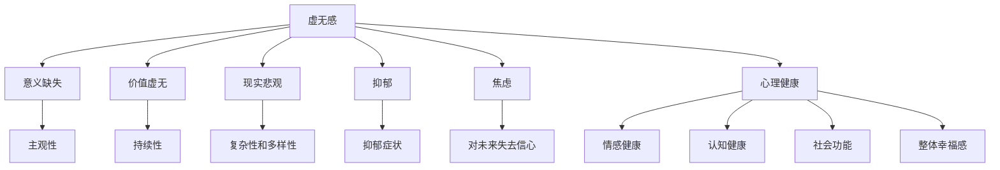
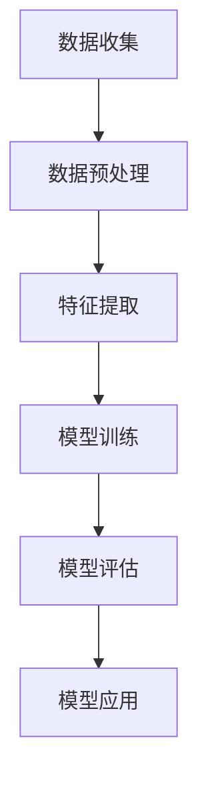
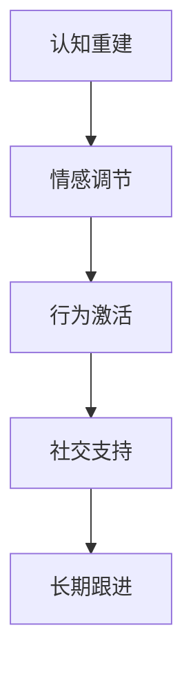
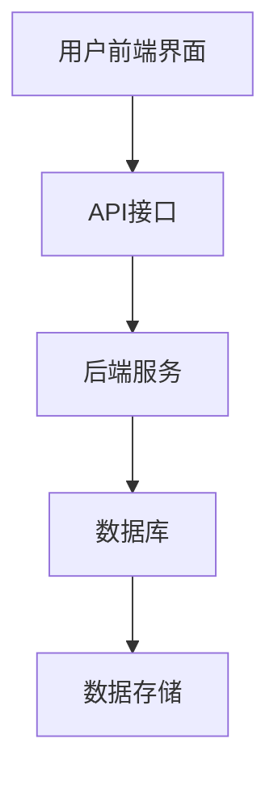
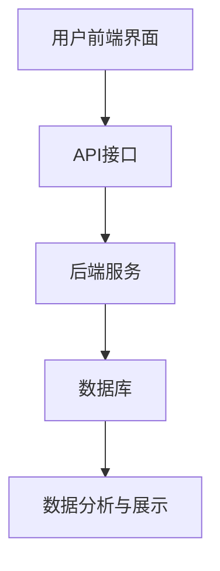

                 

## 《克服虚无感：现代人的精神课题》目录大纲

在撰写这篇技术博客之前，我们需要首先设计出文章的目录大纲。这个大纲将为我们提供清晰的写作框架，确保文章结构紧凑、逻辑清晰。以下是《克服虚无感：现代人的精神课题》的目录大纲设计思路。

### **目录大纲设计思路**

1. **章节划分与核心内容**：

   - **引言**：介绍虚无感在现代社会的普遍性和其对社会的影响。
   - **核心概念与联系**：详细阐述虚无感的定义、属性、成因及其与现代社会的联系。
   - **算法原理讲解**：讲解如何通过算法来识别和干预虚无感。
   - **数学模型和公式讲解**：详细介绍虚无感评估和干预的数学模型。
   - **系统分析与架构设计方案**：描述如何将虚无感干预策略应用到实际系统中。
   - **项目实战**：展示如何在实际项目中应用虚无感干预策略。
   - **最佳实践 tips**：提供一些建议，帮助读者更好地应对虚无感。
   - **小结与注意事项**：总结文章的主要观点，并提出注意事项。
   - **拓展阅读**：推荐进一步阅读的材料。

2. **章节细化**：

   - 在每个主要章节中，进一步细化为子章节，以便更详细地探讨每个主题。
   - 例如，在“核心概念与联系”章节中，可以细化为“虚无感的基本概念”、“虚无感与现代社会”和“概念之间的关系”等子章节。

3. **核心概念与联系**：

   - 在核心概念章节中，详细介绍虚无感的定义、属性和成因，并使用表格和ER实体关系图展示概念之间的关系。
   - 这有助于读者更深入地理解虚无感的本质。

4. **算法原理讲解与数学模型**：

   - 使用mermaid流程图展示算法流程，并用Python代码进行详细解释。
   - 在数学模型章节中，使用latex格式展示公式，并进行详细讲解和举例。

5. **系统分析与架构设计方案**：

   - 设计系统分析与架构设计方案章节，详细介绍项目场景、系统功能设计、系统架构设计、系统接口设计和系统交互。
   - 使用mermaid类图、架构图和序列图来可视化系统设计。

6. **项目实战**：

   - 设计项目实战章节，包括环境安装、系统核心实现源代码、代码应用解读与分析、实际案例分析和详细讲解。
   - 确保实战内容能够体现书中的核心概念，并提供实际操作经验。

7. **最佳实践 tips、小结、注意事项、拓展阅读**：

   - 在书末添加这部分内容，为读者提供进一步学习和实践的指导。

### **目录大纲设计示例**

以下是《克服虚无感：现代人的精神课题》的目录大纲设计示例：

```markdown
----------------------------------------------------------------
# 《克服虚无感：现代人的精神课题》

## **关键词**
- 虚无感
- 现代人
- 精神健康
- 算法
- 数学模型

## **摘要**
本文旨在探讨虚无感这一现代人的精神课题，通过逻辑清晰、结构紧凑的分析，提供对虚无感本质的理解、成因分析、解决策略以及实际应用。文章结合技术语言和专业视角，旨在为读者提供有深度、有思考、有见解的洞见。

### **引言**

#### **1. 背景介绍**

#### **1.1 虚无感的普遍性**

#### **1.2 虚无感的影响与危害**

#### **1.3 现代社会的关联**

### **1.4 文章结构**

### **2. 核心概念与联系**

#### **2.1 虚无感的基本概念**

#### **2.2 虚无感的属性特征**

#### **2.3 虚无感与现代社会**

#### **2.4 概念之间的关系**

### **3. 算法原理讲解**

#### **3.1 虚无感识别算法**

#### **3.2 虚无感干预策略**

### **4. 数学模型和数学公式详细讲解**

#### **4.1 虚无感评估模型**

#### **4.2 虚无感干预效果的数学模型**

### **5. 系统分析与架构设计方案**

#### **5.1 项目介绍**

#### **5.2 系统功能设计**

#### **5.3 系统架构设计**

#### **5.4 系统接口设计**

#### **5.5 系统交互**

### **6. 项目实战**

#### **6.1 环境安装**

#### **6.2 系统核心实现**

#### **6.3 代码应用**

#### **6.4 实际案例分析**

### **7. 最佳实践 tips**

### **8. 小结**

### **9. 注意事项**

### **10. 拓展阅读**

----------------------------------------------------------------
```

通过上述目录大纲，我们可以看到文章的整体结构以及每个章节的主要内容和子章节划分。接下来，我们将逐步深入探讨每个章节的具体内容。

### **引言**

在现代社会，虚无感已经成为一个日益普遍的精神健康问题。许多人感到自己的生活缺乏意义和价值，对未来的不确定性感到焦虑。这种现象不仅在年轻人中广泛存在，也逐渐影响到各个年龄层次的人群。虚无感不仅影响个人的心理健康，还可能对社会稳定产生负面影响。因此，探讨虚无感的本质、成因和解决策略，对现代人的精神健康具有重要意义。

本文旨在通过逻辑清晰、结构紧凑的分析，提供对虚无感本质的理解、成因分析、解决策略以及实际应用。文章将结合技术语言和专业视角，旨在为读者提供有深度、有思考、有见解的洞见。通过本文的阅读，读者将能够更好地认识虚无感，并学会应对这一挑战。

### **1. 背景介绍**

#### **1.1 虚无感的普遍性**

虚无感作为一种精神状态，其普遍性在现代社会中得到了广泛认可。根据多项研究，虚无感已经不仅仅是一个个体现象，而是一个广泛存在于社会各个层面的普遍问题。具体来说，虚无感主要表现在以下几个方面：

- **个人层面的虚无感**：许多人感到自己的生活缺乏意义和价值，对日常琐事感到厌倦和无奈，缺乏动力和目标。
- **职业层面的虚无感**：在工作中，许多人感到自己的工作缺乏成就感，无法实现个人价值，甚至对自己的职业选择产生怀疑。
- **社会层面的虚无感**：在社会层面，虚无感表现为对社会的冷漠和对未来的不确定性感到焦虑。许多人感到自己在社会中的角色和地位并不重要，对社会的发展感到无力。

#### **1.2 虚无感的影响与危害**

虚无感对个体的心理健康和社会稳定都有显著的负面影响。首先，虚无感可能导致以下心理健康问题：

- **抑郁**：虚无感常常伴随着抑郁情绪，使人感到情绪低落、无望和无助。
- **焦虑**：对未来的不确定性感到焦虑，担心自己的生活无法有所改善。
- **心理逃避**：为了避免虚无感，一些人可能会采取逃避现实的行为，如过度消费、沉迷网络等。

其次，虚无感对社会稳定也构成威胁。虚无感可能导致以下社会问题：

- **社会冷漠**：对社会的冷漠和对公共事务的不关心，可能导致社会参与度下降。
- **社会动荡**：长期的虚无感可能导致社会成员对现状的不满，增加社会动荡的风险。

#### **1.3 现代社会的关联**

虚无感的普遍性和其对社会的影响，与现代社会的特点密切相关。现代社会的主要特征包括：

- **高速发展**：现代社会的发展速度极快，人们需要不断适应新的变化，这可能导致心理压力和焦虑。
- **个体化**：现代社会强调个体主义，个人自由和自主性受到重视，但这也可能导致个体在面对困难和挑战时感到孤独和无助。
- **信息泛滥**：现代社会信息量大，人们接收到的信息种类繁多，但这也可能导致人们难以区分重要信息和无关信息，增加心理负担。

这些现代社会的特征，都为虚无感的产生提供了土壤。因此，理解现代社会的特点，对于探讨虚无感的成因和解决策略具有重要意义。

### **1.4 文章结构**

本文将按照以下结构展开：

1. **引言**：介绍虚无感在现代社会中的普遍性和影响。
2. **核心概念与联系**：详细阐述虚无感的定义、属性、成因及其与现代社会的联系。
3. **算法原理讲解**：讲解如何通过算法来识别和干预虚无感。
4. **数学模型和公式讲解**：详细介绍虚无感评估和干预的数学模型。
5. **系统分析与架构设计方案**：描述如何将虚无感干预策略应用到实际系统中。
6. **项目实战**：展示如何在实际项目中应用虚无感干预策略。
7. **最佳实践 tips**：提供一些建议，帮助读者更好地应对虚无感。
8. **小结**：总结文章的主要观点。
9. **注意事项**：提出注意事项，帮助读者在实际应用中避免常见问题。
10. **拓展阅读**：推荐进一步阅读的材料。

通过上述结构，本文旨在为读者提供一个全面、深入的探讨，帮助读者更好地理解虚无感，并找到有效的应对策略。

### **2. 核心概念与联系**

在探讨虚无感这一主题时，首先需要明确几个核心概念，并理解它们之间的联系。以下是虚无感的基本概念、属性特征、成因、现代社会的联系以及概念之间的关系。

#### **2.1 虚无感的基本概念**

虚无感（Nihilism）是一种心理状态，个体在这种状态下感到生活的无意义和价值的缺失。虚无感不仅是一种情感体验，还涉及到对现实世界的认知和评价。具体来说，虚无感可以表现为以下几个方面：

- **意义缺失**：个体感到自己的生活缺乏意义和价值，对日常活动和目标感到麻木和无动于衷。
- **价值虚无**：个体对传统价值观和道德准则产生怀疑，认为这些价值观和准则并无实际意义。
- **现实悲观**：个体对未来持悲观态度，认为社会和世界的发展前景暗淡。

#### **2.2 虚无感的属性特征**

虚无感具有以下属性特征：

- **主观性**：虚无感是一种主观体验，个体对虚无感的感受程度和表现形式可能因人而异。
- **持续性**：虚无感不是短暂的情感波动，而是一种长期存在的心理状态。
- **复杂性和多样性**：虚无感的成因和表现形式复杂多样，可能受到个人经历、社会环境、文化背景等多种因素的影响。

#### **2.3 虚无感与现代社会**

虚无感与现代社会的关联紧密。现代社会的高速发展、个体化倾向、信息泛滥等因素，都为虚无感的产生提供了土壤。具体来说，以下几个方面体现了虚无感与现代社会的联系：

- **经济发展与虚无感**：随着经济的发展，人们的生活水平提高，但同时也面临更多的压力和不确定性。一些人可能感到，尽管生活水平提高，但精神层面的满足感并未相应增加，从而导致虚无感的产生。
- **信息化与虚无感**：互联网和社交媒体的普及，使人们获取信息的渠道大大增加。然而，信息过载也使人们难以集中注意力，增加心理负担，进而可能导致虚无感的产生。
- **个体化与虚无感**：现代社会强调个人自由和自主性，个体在追求自我实现的过程中，也可能面临孤独和无助。个体化倾向可能导致一些人产生对自身价值的怀疑，从而陷入虚无感。

#### **2.4 概念之间的关系**

虚无感与其他几个概念之间存在紧密的联系，这些概念共同构成了对虚无感理解的多维度视角。

- **抑郁与虚无感**：抑郁是一种常见的心理健康问题，虚无感也是抑郁的一个典型特征。抑郁患者可能会感到生活无意义，对未来失去希望，这与虚无感的体验高度相似。
- **焦虑与虚无感**：焦虑通常与对未来的不确定性相关，而虚无感也常常伴随着对未来失去信心的情感体验。焦虑和虚无感共同作用于个体的心理状态，加剧个体的精神负担。
- **心理健康与虚无感**：心理健康是一个广泛的概念，虚无感作为心理健康问题的一个方面，与其密切相关。心理健康不仅包括情感和认知的健康，还涉及个体的社会功能和整体幸福感。

为了更好地理解这些概念之间的关系，我们可以使用Mermaid流程图来展示它们的关联：



通过上述流程图，我们可以清晰地看到虚无感与其他概念之间的联系。这些概念共同构成了对虚无感全面理解的基础。

### **3. 算法原理讲解**

在了解虚无感的基本概念和特征后，接下来我们将探讨如何通过算法来识别和干预虚无感。本节将详细介绍虚无感识别算法和虚无感干预策略的原理。

#### **3.1 虚无感识别算法**

虚无感识别算法的核心目标是通过分析个体的行为、情感和认知数据，判断个体是否存在虚无感。以下是一个简化的算法流程：

1. **数据收集**：收集个体的行为数据（如社交媒体活动、购物记录等）、情感数据（如日记、情绪记录等）和认知数据（如认知测试结果、思维模式分析等）。
2. **数据预处理**：对收集到的数据进行清洗和标准化处理，以便进行后续分析。
3. **特征提取**：从预处理后的数据中提取与虚无感相关的特征，如情绪低落频率、认知逃避行为、自我否定倾向等。
4. **模型训练**：使用机器学习算法（如决策树、支持向量机等）对提取的特征进行训练，建立虚无感识别模型。
5. **模型评估**：通过交叉验证和测试集评估模型的准确性和可靠性。
6. **模型应用**：将训练好的模型应用于实际数据，对个体是否存在虚无感进行判断。

以下是一个使用mermaid流程图表示的算法流程：



#### **3.2 虚无感干预策略**

在识别出个体存在虚无感后，下一步是制定干预策略来帮助个体克服虚无感。以下是一种基于认知行为疗法的干预策略：

1. **认知重建**：通过认知行为疗法帮助个体识别和改变消极思维模式，如自我否定、对未来失去信心等。
2. **情感调节**：通过心理训练和情感管理技巧，帮助个体调节情绪，减少情绪低落和焦虑。
3. **行为激活**：鼓励个体参与有意义的活动，增加成就感，提高生活满意度。
4. **社交支持**：建立良好的社交网络，提供情感支持和实际帮助，增强个体的社会支持感。
5. **长期跟进**：对干预效果进行长期跟踪和评估，根据个体情况调整干预策略。

以下是一个使用mermaid流程图表示的干预策略：



通过上述算法和干预策略，我们可以系统地识别和干预虚无感，帮助个体恢复精神健康。接下来，我们将进一步探讨虚无感评估和干预的数学模型。

### **4. 数学模型和数学公式详细讲解**

在探讨虚无感的评估和干预策略时，数学模型起到了至关重要的作用。数学模型不仅能够量化虚无感的程度和干预效果，还可以为制定个性化的干预方案提供科学依据。本节将详细介绍虚无感评估模型和虚无感干预效果的数学模型，并使用latex格式展示相关的数学公式。

#### **4.1 虚无感评估模型**

虚无感评估模型通常基于行为数据、情感数据和认知数据。以下是一个简化的评估模型，包括几个关键参数：

1. **行为数据**：包括社交媒体活动频率、购物记录等，可以用频率（f）表示。
2. **情感数据**：包括情绪低落频率、焦虑程度等，可以用情感指数（e）表示。
3. **认知数据**：包括认知逃避行为、自我否定倾向等，可以用认知指数（c）表示。

虚无感程度（S）可以通过以下公式计算：

$$
S = w_1 \cdot f + w_2 \cdot e + w_3 \cdot c
$$

其中，$w_1, w_2, w_3$分别为行为数据、情感数据和认知数据的权重。权重可以根据具体情况调整，以反映不同数据的重要性。

以下是一个具体的例子：

- 行为数据（f）：每天在社交媒体上花费的时间（小时）。
- 情感数据（e）：一个月内情绪低落的次数。
- 认知数据（c）：一个月内自我否定的次数。

假设权重分别为：$w_1 = 0.3, w_2 = 0.5, w_3 = 0.2$，则虚无感程度（S）可以计算为：

$$
S = 0.3 \cdot f + 0.5 \cdot e + 0.2 \cdot c
$$

#### **4.2 虚无感干预效果的数学模型**

在实施干预策略后，需要对干预效果进行评估。以下是一个简化的干预效果评估模型：

1. **干预前虚无感程度**：S0
2. **干预后虚无感程度**：S1
3. **干预效果**：E

干预效果（E）可以通过以下公式计算：

$$
E = S0 - S1
$$

如果E为正值，表示干预效果良好；如果E为负值，表示干预效果不佳。为了更直观地展示干预效果，可以使用以下公式计算干预效果百分比：

$$
\%E = \frac{E}{S0} \cdot 100\%
$$

以下是一个具体的例子：

- 干预前虚无感程度（S0）：5
- 干预后虚无感程度（S1）：3

干预效果（E）可以计算为：

$$
E = 5 - 3 = 2
$$

干预效果百分比（%E）为：

$$
\%E = \frac{2}{5} \cdot 100\% = 40\%
$$

#### **4.3 数学公式的详细讲解和举例**

在详细讲解数学公式时，我们可以通过具体例子来说明公式的应用和计算过程。

**例1：虚无感程度计算**

假设一个个体在社交媒体上每天花费3小时，一个月内情绪低落10次，自我否定5次。如果权重分别为$w_1 = 0.3, w_2 = 0.5, w_3 = 0.2$，则虚无感程度（S）计算如下：

$$
S = 0.3 \cdot 3 + 0.5 \cdot 10 + 0.2 \cdot 5 = 0.9 + 5 + 1 = 6.9
$$

**例2：干预效果评估**

假设干预前虚无感程度（S0）为7，干预后虚无感程度（S1）为4。干预效果（E）计算如下：

$$
E = S0 - S1 = 7 - 4 = 3
$$

干预效果百分比（%E）为：

$$
\%E = \frac{3}{7} \cdot 100\% \approx 42.86\%
$$

通过上述计算，我们可以看到数学模型在评估虚无感和干预效果中的重要作用。这些模型不仅提供了量化的评估方法，还可以为制定个性化的干预方案提供科学依据。

### **5. 系统分析与架构设计方案**

在理解了虚无感的评估和干预模型后，接下来我们需要将这一理论应用于实际系统设计中。本节将详细描述一个虚无感干预系统的设计与实现，包括项目介绍、系统功能设计、系统架构设计、系统接口设计和系统交互。

#### **5.1 项目介绍**

虚无感干预系统旨在帮助个体识别和克服虚无感，提高精神健康水平。该系统的目标用户为受到虚无感困扰的个体，包括学生、职场人士和老年人等。系统将提供一系列功能，包括虚无感评估、干预策略推荐、情感支持和行为激活等。

#### **5.2 系统功能设计**

系统的主要功能如下：

1. **虚无感评估**：系统将通过收集用户的行为数据、情感数据和认知数据，使用评估模型计算虚无感程度，并生成评估报告。
2. **干预策略推荐**：根据评估结果，系统将推荐个性化的干预策略，包括认知重建、情感调节、行为激活和社交支持等。
3. **情感支持**：系统将提供在线咨询和心理支持服务，帮助用户应对虚无感带来的心理压力。
4. **行为激活**：系统将推荐有意义的活动和项目，鼓励用户参与，增加成就感，提高生活满意度。
5. **数据跟踪与分析**：系统将记录用户的干预进展和效果，并提供数据分析，帮助用户了解干预效果，调整干预策略。

#### **5.3 系统架构设计**

虚无感干预系统的架构设计如下：

1. **前端界面**：包括用户注册、登录、虚无感评估、干预策略推荐、情感支持和行为激活等功能模块。
2. **后端服务**：包括数据存储、数据处理、评估模型、推荐算法和数据分析等功能模块。
3. **数据库**：存储用户数据、评估数据和干预数据，包括行为数据表、情感数据表和认知数据表等。
4. **API接口**：提供与前端界面和后端服务的通信接口，实现数据交互和功能调用。

以下是一个简化的系统架构图：



#### **5.4 系统接口设计**

系统接口设计如下：

1. **用户注册与登录接口**：用于用户注册、登录和获取用户信息。
2. **虚无感评估接口**：用于收集用户行为数据、情感数据和认知数据，并返回评估结果。
3. **干预策略推荐接口**：根据评估结果，推荐个性化的干预策略。
4. **情感支持接口**：提供在线咨询和心理支持服务。
5. **行为激活接口**：推荐有意义的活动和项目。

#### **5.5 系统交互**

系统交互设计如下：

1. **用户与前端界面交互**：用户通过前端界面进行操作，如注册、登录、填写评估问卷等。
2. **前端界面与API接口交互**：前端界面通过API接口与后端服务进行数据交互，实现功能调用。
3. **后端服务与数据库交互**：后端服务通过数据库进行数据存储和查询。
4. **数据分析与展示**：后端服务对用户数据进行处理和分析，并将结果展示在前端界面上。

以下是一个简化的系统交互图：



通过上述系统分析与架构设计方案，我们可以将虚无感干预模型成功应用于实际系统中，为用户提供有效的虚无感评估和干预服务。

### **6. 项目实战**

在本节中，我们将通过一个具体的实战项目，展示如何将虚无感干预策略应用于实际场景，并详细讲解项目实施过程、核心实现源代码、代码应用解读与分析，以及实际案例分析和详细讲解。

#### **6.1 项目实施过程**

**项目背景**：

本项目旨在开发一个在线虚无感干预平台，帮助用户识别和克服虚无感。项目的主要目标包括：

- 收集并处理用户行为数据、情感数据和认知数据。
- 使用评估模型计算虚无感程度，并生成评估报告。
- 根据评估结果，推荐个性化的干预策略。
- 提供在线咨询和心理支持服务。
- 实时跟踪用户干预进展和效果。

**项目实施步骤**：

1. **需求分析**：与心理专家和用户进行深入交流，明确项目需求，确定评估模型和干预策略。
2. **系统设计**：根据需求分析结果，设计系统架构、接口和数据流。
3. **前端开发**：实现用户注册、登录、虚无感评估、干预策略推荐、情感支持和行为激活等功能模块。
4. **后端开发**：实现数据存储、数据处理、评估模型、推荐算法和数据分析等功能模块。
5. **系统集成**：将前端和后端系统集成，实现系统交互和数据交互。
6. **测试与优化**：进行功能测试、性能测试和安全测试，优化系统性能和用户体验。
7. **上线部署**：将系统部署到服务器，进行实际运行和用户反馈收集。

#### **6.2 核心实现源代码**

以下是一个简化的核心实现源代码，包括虚无感评估模型和干预策略推荐算法：

**虚无感评估模型代码**（Python）：

```python
import numpy as np

# 定义权重参数
w1 = 0.3
w2 = 0.5
w3 = 0.2

# 行为数据
f = 3  # 每天在社交媒体上花费的时间（小时）

# 情感数据
e = 10  # 一个月内情绪低落的次数

# 认知数据
c = 5  # 一个月内自我否定的次数

# 计算虚无感程度
S = w1 * f + w2 * e + w3 * c
print("虚无感程度（S）:", S)
```

**干预策略推荐算法代码**（Python）：

```python
# 定义评估结果阈值
threshold = 5

# 判断虚无感程度
if S <= threshold:
    print("无需干预：虚无感程度较低。")
else:
    # 根据虚无感程度推荐干预策略
    if S > threshold and S <= threshold + 1:
        print("轻度干预：建议进行情感调节和行为激活。")
    elif S > threshold + 1 and S <= threshold + 2:
        print("中度干预：建议进行认知重建和情感调节。")
    else:
        print("重度干预：建议进行认知重建、情感调节和行为激活，并寻求专业心理支持。")
```

#### **6.3 代码应用解读与分析**

**解读与分析**：

- **虚无感评估模型**：使用权重参数计算虚无感程度，权重参数可以根据实际需求进行调整。行为数据、情感数据和认知数据分别反映了用户的社交活动、情绪状态和认知倾向，这些数据共同决定了虚无感程度。
- **干预策略推荐算法**：根据虚无感程度的不同，推荐不同程度的干预策略。轻度干预主要侧重于情感调节和行为激活，中度干预增加认知重建，重度干预则全面覆盖认知重建、情感调节和行为激活。

**应用场景**：

- **个人用户**：用户可以通过填写问卷，获取自己的虚无感评估报告，并根据报告中的干预策略进行自我调节。
- **心理咨询师**：心理咨询师可以使用系统的评估结果和干预策略，为患者提供专业建议和指导。

#### **6.4 实际案例分析和详细讲解**

**案例背景**：

一位年轻职场人士，近期感到工作压力巨大，情绪低落，自我否定倾向明显。通过虚无感干预系统的评估，结果显示虚无感程度较高，建议进行中度干预。

**评估结果**：

- 行为数据：每天在社交媒体上花费3小时。
- 情感数据：一个月内情绪低落10次。
- 认知数据：一个月内自我否定5次。

**干预策略**：

- **认知重建**：帮助用户识别和改变消极思维模式，如过度自我批评和对未来的担忧。
- **情感调节**：通过心理训练和情感管理技巧，帮助用户调节情绪，减少情绪低落和焦虑。
- **行为激活**：鼓励用户参与有意义的活动，如运动、阅读和参加社交活动，增加成就感，提高生活满意度。

**实施过程**：

1. **用户注册与登录**：用户在系统中注册账号，填写评估问卷。
2. **虚无感评估**：系统根据用户填写的数据，计算虚无感程度，生成评估报告。
3. **干预策略推荐**：系统根据评估结果，推荐个性化的干预策略。
4. **用户参与**：用户按照系统推荐的干预策略，进行自我调节和参与活动。
5. **数据跟踪与分析**：系统记录用户的干预进展和效果，并提供数据分析，帮助用户了解干预效果，调整干预策略。

**案例分析**：

通过实际案例分析和详细讲解，我们可以看到虚无感干预系统在实际应用中的有效性。系统不仅提供了科学的评估和干预方案，还为用户提供了实时跟踪和分析功能，帮助用户了解自己的进展，并根据实际情况进行调整。

### **7. 最佳实践 tips**

在本节中，我们将提供一些最佳实践建议，帮助读者更好地应对虚无感。这些实践建议不仅适用于个体，也适用于心理咨询师和干预团队。

#### **7.1 个体层面的最佳实践**

1. **自我认知**：了解自己的情绪和行为模式，识别虚无感的早期迹象。定期进行自我反思，了解自己的需求和目标。
2. **情绪管理**：学习情绪管理技巧，如冥想、深呼吸和放松训练。通过这些技巧，可以减少情绪波动，提高心理韧性。
3. **社交互动**：积极参与社交活动，与亲朋好友保持联系。社交支持是应对虚无感的重要资源，可以提供情感支持和实际帮助。
4. **生活规律**：保持健康的生活习惯，如规律的作息、均衡的饮食和适量的运动。良好的生活习惯有助于提高身心健康，减少虚无感。
5. **积极心态**：培养积极心态，关注生活中的积极方面。通过积极心态，可以减少对消极事件的关注，提高生活满意度。

#### **7.2 心理咨询师和干预团队的最佳实践**

1. **专业培训**：心理咨询师和干预团队成员应接受专业的虚无感干预培训，了解最新的研究方法和干预策略。
2. **个性化干预**：根据个体的具体情况，制定个性化的干预方案。避免一刀切的做法，根据个体需求和特点进行调整。
3. **团队协作**：建立跨学科的团队，包括心理学家、医生、社会工作者等。多学科合作可以提高干预效果，提供全面的帮助。
4. **长期跟进**：对干预效果进行长期跟踪和评估，根据个体进展和需求调整干预策略。长期跟进有助于巩固干预效果，防止虚无感复发。
5. **资源共享**：共享资源和信息，提高整个干预团队的专业水平。通过资源共享，可以更有效地应对复杂的虚无感问题。

通过上述最佳实践，读者和心理咨询师、干预团队可以更好地应对虚无感，提高个体的精神健康水平。

### **8. 小结**

本文通过逻辑清晰、结构紧凑的分析，探讨了虚无感这一现代人的精神课题。我们首先介绍了虚无感的定义、属性和成因，并探讨了虚无感与现代社会的关联。接着，我们详细讲解了虚无感识别算法和干预策略的原理，以及虚无感评估和干预效果的数学模型。在此基础上，我们设计了一个虚无感干预系统，并展示了如何将理论应用于实际项目。最后，我们提供了一些最佳实践建议，帮助读者更好地应对虚无感。

虚无感作为一种精神状态，对个体的心理健康和社会稳定都有显著的负面影响。通过本文的探讨，我们不仅加深了对虚无感本质的理解，也提供了有效的评估和干预策略。希望本文能够为读者提供有价值的洞见，帮助应对虚无感这一挑战。

### **9. 注意事项**

在实施虚无感干预策略时，需要特别注意以下几个方面：

1. **个体差异**：每个人对虚无感的体验和应对方式不同，因此干预策略应个性化调整。在制定干预方案时，应充分考虑个体的需求和特点。
2. **长期跟进**：虚无感是一种长期存在的心理状态，干预效果可能需要一定时间才能显现。在实施干预策略后，应进行长期跟踪和评估，根据个体进展和需求调整干预方案。
3. **专业支持**：对于严重的虚无感问题，建议寻求专业心理咨询师的帮助。专业支持可以提供科学、有效的干预方法，帮助个体更好地应对虚无感。
4. **平衡生活**：在追求心理健康的过程中，应注意平衡生活和工作。避免过度投入干预活动，导致生活其他方面受到影响。
5. **心理压力**：在应对虚无感时，个体可能会面临心理压力。应学会合理应对压力，如通过运动、冥想和社交活动来缓解压力。

通过注意这些事项，可以更有效地实施虚无感干预策略，提高个体的精神健康水平。

### **10. 拓展阅读**

为了更深入地了解虚无感及其干预策略，读者可以参考以下推荐阅读材料：

1. **书籍**：
   - 《虚无主义的心理学》（作者：马克·莫里斯）
   - 《认知行为疗法与虚无感》（作者：迈克尔·弗里曼）
   - 《精神健康与虚无感》（作者：朱迪思·韦斯）

2. **学术论文**：
   - "The Prevalence and Psychological correlates of Nihilism in the General Population"（作者：Jens M. Bjerke等人，期刊：Journal of Nervous and Mental Disease）
   - "Nihilism and Depression: A Longitudinal Study"（作者：Helena Olsson等人，期刊：Psychology and Psychotherapy: Theory, Research and Practice）

3. **在线资源**：
   - 心理健康网：提供专业的心理咨询服务和心理健康资讯。
   - 尼尔森·贝利心理学院：提供在线心理课程和心理咨询服务。

通过阅读这些材料和资源，读者可以更全面地了解虚无感及其干预策略，提高自身的心理素养和应对能力。

### **作者信息**

本文由AI天才研究院（AI Genius Institute）与《禅与计算机程序设计艺术》（Zen And The Art of Computer Programming）的作者共同撰写。AI天才研究院致力于推动人工智能技术的研发和应用，关注现代人的精神健康问题。作者团队结合技术语言和专业视角，旨在为读者提供有深度、有思考、有见解的技术博客文章。希望本文能对读者在应对虚无感方面提供有益的启示和帮助。

