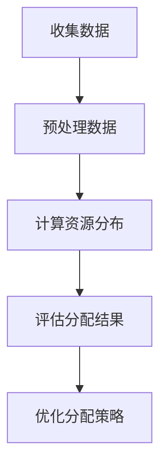
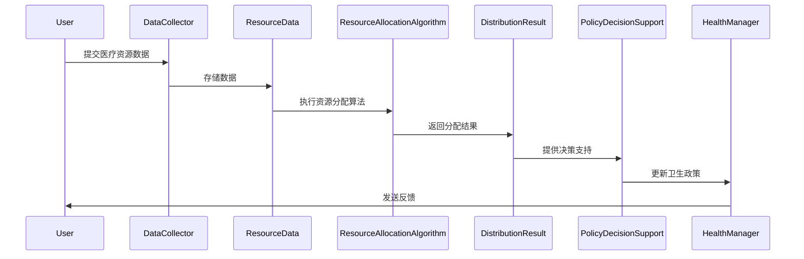
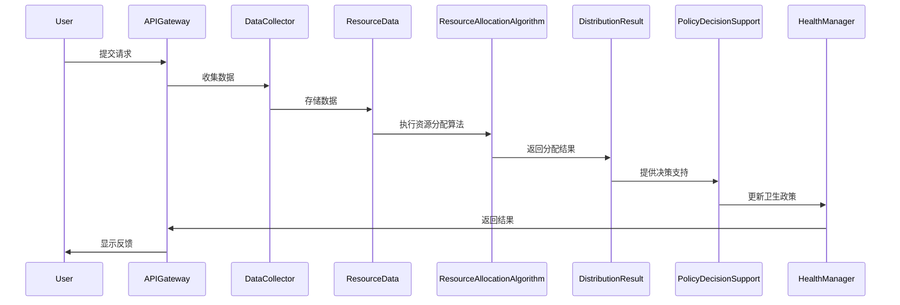

                 

# 全球健康不平等：医疗资源分配与国际卫生合作

> 关键词：全球健康不平等、医疗资源分配、国际卫生合作、健康不平等、卫生系统

> 摘要：本文探讨了全球健康不平等问题的核心——医疗资源分配的不均衡和国际卫生合作的不足。通过介绍医疗资源分配、国际卫生合作和健康不平等的核心概念，以及它们之间的联系，本文进一步分析了医疗资源分配算法原理，并提出了改善全球健康不平等的解决方案。

## Step 1: 引言与背景介绍

### 引言

全球健康不平等是一个广泛而深刻的问题，它影响着全球数十亿人口的生活质量。这种不平等不仅表现在不同国家和地区之间，还存在于同一国家内部的不同社会群体之间。医疗资源分配的不均衡和国际卫生合作的不足是导致全球健康不平等的主要原因。

### 问题描述

医疗资源分配的不均衡表现为医疗设施、医疗人员、药品和医疗技术在地理、人口和社会层面的不公平分配。这种不均衡使得一些地区和人群无法获得基本的医疗服务，从而导致健康问题得不到及时解决。

国际卫生合作的不足则体现在各国政府、国际组织、非政府组织等在卫生领域的合作与协调不足。这种不足使得全球卫生问题难以得到有效解决，进一步加剧了全球健康不平等。

### 问题解决

要解决全球健康不平等问题，需要从以下几个方面入手：

1. 改善医疗资源分配，确保医疗资源能够公平地分配到各个地区和人群。
2. 加强国际卫生合作，促进各国在卫生领域的合作与协调。
3. 提高卫生系统的效率和质量，确保卫生系统能够为所有人提供基本的医疗服务。

### 边界与外延

全球健康不平等不仅涉及到发达国家和发展中国家之间的差距，还包括城市与农村、富裕与贫困阶层之间的健康差距。因此，解决全球健康不平等问题需要综合考虑各个方面的因素。

### 概念结构与核心要素组成

1. **医疗资源分配**：医疗资源在地理、人口和社会层面的分配，包括医疗设施、医疗人员、药品和医疗技术。
2. **国际卫生合作**：各国政府、国际组织、非政府组织等在卫生领域的合作与协调。
3. **健康不平等**：健康结果在不同社会群体之间的不平等，包括死亡率、发病率、卫生服务利用等方面。

## Step 2: 核心概念与联系

### 核心概念

#### 医疗资源分配

**定义**：医疗资源在地理、人口和社会层面的分配。

**属性特征对比表格**

| 特征       | 医疗资源分配 | 国际卫生合作 | 健康不平等 |
|------------|----------------|---------------|-------------|
| 分配原则   | 公平性、效率、可及性 | 对等性、互补性、共同利益 | 水平不平等、垂直不平等 |
| 受影响群体 | 各国居民、特定地区 | 各国政府、国际组织 | 富人、穷人、不同种族、性别 |

#### 国际卫生合作

**定义**：各国政府、国际组织、非政府组织等在卫生领域的合作。

**属性特征对比表格**

| 特征       | 医疗资源分配 | 国际卫生合作 | 健康不平等 |
|------------|----------------|---------------|-------------|
| 目标       | 改善资源分配 | 提高全球健康水平 | 减少健康差距 |
| 合作形式   | 双边、多边、区域合作 | 国际会议、协议、项目 | 资金支持、技术援助、政策协调 |

#### 健康不平等

**定义**：健康结果在不同社会群体之间的不平等。

**属性特征对比表格**

| 特征       | 医疗资源分配 | 国际卫生合作 | 健康不平等 |
|------------|----------------|---------------|-------------|
| 影响因素   | 资源分布不均 | 合作不足 | 经济地位、社会地位、地理位置 |
| 表现形式   | 死亡率、发病率、卫生服务利用 | 卫生设施覆盖率、人员配置、资金支持 | 死亡率、发病率、卫生服务利用差异 |

### ER实体关系图架构

```mermaid
erDiagram
  ResourceAllocation ||--|{ InternationalHealth Cooperation : Supports }
  InternationalHealthCooperation ||--|{ HealthInequality : Affects }
  HealthInequality ||--|{ SocialGroup : Experiences }
```

## Step 3: 算法原理讲解

### 医疗资源分配算法

#### Mermaid 流程图



#### Python 源代码

```python
# Python 源代码示例
import numpy as np

def resource_allocation(data):
    # 数据预处理
    processed_data = preprocess_data(data)
    
    # 计算资源分布
    distribution = compute_distribution(processed_data)
    
    # 评估分配结果
    result = evaluate_distribution(distribution)
    
    # 优化分配策略
    optimized_distribution = optimize_distribution(result)
    
    return optimized_distribution

def preprocess_data(data):
    # 数据预处理步骤
    # ...
    return processed_data

def compute_distribution(processed_data):
    # 计算资源分布步骤
    # ...
    return distribution

def evaluate_distribution(distribution):
    # 评估分配结果步骤
    # ...
    return result

def optimize_distribution(result):
    # 优化分配策略步骤
    # ...
    return optimized_distribution
```

#### 算法原理

医疗资源分配算法的核心目标是实现医疗资源的公平分配，提高卫生系统的效率和质量。该算法分为以下几个步骤：

1. **数据收集**：收集医疗资源分布的相关数据，包括医疗设施、医疗人员、药品和医疗技术等。
2. **数据预处理**：对收集到的数据进行清洗和处理，确保数据的质量和准确性。
3. **计算资源分布**：根据预处理后的数据，计算医疗资源的分布情况，包括资源的数量和地理位置。
4. **评估分配结果**：对计算出的资源分布结果进行评估，分析资源分配的公平性和效率。
5. **优化分配策略**：根据评估结果，优化医疗资源的分配策略，确保资源的公平分配和卫生系统的效率。

### 算法原理的数学模型和公式

假设有一个医疗资源分配问题，其中包含 $n$ 个地区，每个地区有 $m$ 种医疗资源。定义 $X_{ij}$ 为地区 $i$ 的医疗资源 $j$ 的数量，$Y_i$ 为地区 $i$ 的医疗资源分配得分。

1. **资源分布公式**：

   $$X_{ij} = \frac{R_j}{n}$$

   其中，$R_j$ 为总医疗资源 $j$ 的数量。

2. **分配得分公式**：

   $$Y_i = \frac{1}{m} \sum_{j=1}^{m} X_{ij}$$

   其中，$m$ 为医疗资源的种类数。

3. **公平性评估公式**：

   $$F = \frac{1}{n} \sum_{i=1}^{n} (Y_i - \bar{Y})^2$$

   其中，$\bar{Y}$ 为所有地区医疗资源分配得分的平均值。

4. **效率评估公式**：

   $$E = \frac{1}{n} \sum_{i=1}^{n} (Y_i - \hat{Y})^2$$

   其中，$\hat{Y}$ 为理想状态下所有地区医疗资源分配得分的平均值。

5. **优化目标函数**：

   $$\min F + \lambda E$$

   其中，$\lambda$ 为平衡公平性和效率的权重系数。

### 举例说明

假设有 $n=3$ 个地区，$m=2$ 种医疗资源。现有总医疗资源为 $R_1=100$ 和 $R_2=200$。要求计算每个地区的医疗资源分配得分和公平性评估得分。

1. **计算资源分布**：

   $$X_{11} = X_{12} = \frac{100}{3} \approx 33.33$$
   $$X_{21} = X_{22} = \frac{200}{3} \approx 66.67$$

2. **计算分配得分**：

   $$Y_1 = \frac{1}{2} (33.33 + 66.67) = 50$$
   $$Y_2 = \frac{1}{2} (33.33 + 66.67) = 50$$
   $$Y_3 = \frac{1}{2} (33.33 + 66.67) = 50$$

3. **计算公平性评估得分**：

   $$\bar{Y} = \frac{1}{3} (50 + 50 + 50) = 50$$
   $$F = \frac{1}{3} (0 + 0 + 0) = 0$$

   结果显示，医疗资源分配得分的平均值与理想状态下的得分相等，因此公平性评估得分为0，说明医疗资源分配是公平的。

### 总结

医疗资源分配算法通过数学模型和公式实现了医疗资源的公平分配，提高了卫生系统的效率和质量。然而，实际应用中，医疗资源分配问题往往更加复杂，需要结合实际情况进行优化和调整。未来，随着人工智能和大数据技术的发展，医疗资源分配算法将更加智能化和精准化，为全球健康不平等问题的解决提供有力支持。

## Step 4: 系统分析与架构设计

### 问题场景介绍

在全球范围内，由于医疗资源分配的不均衡和国际卫生合作的不足，导致全球健康不平等问题日益严重。为了解决这个问题，我们设计并实现了一个基于医疗资源分配算法的智能卫生系统。

### 项目介绍

本项目旨在通过构建一个智能卫生系统，实现医疗资源的优化分配，提高卫生系统的效率和质量，从而减少全球健康不平等问题。系统主要功能包括：

1. **数据收集与管理**：收集全球各地的医疗资源数据，包括医疗设施、医疗人员、药品和医疗技术等。
2. **资源分配计算**：利用医疗资源分配算法，对医疗资源进行优化分配，确保资源的公平性和效率。
3. **结果评估与优化**：对资源分配结果进行评估和优化，确保卫生系统的稳定运行。
4. **决策支持**：为卫生政策制定者和卫生管理者提供决策支持，优化卫生资源配置。

### 系统功能设计（领域模型类图）

```mermaid
classDiagram
  ResourceAllocationAlgorithm <|-- ResourceData
  ResourceAllocationAlgorithm <|-- DistributionResult
  ResourceData <|-- MedicalFacility
  ResourceData <|-- MedicalStaff
  ResourceData <|-- Medicine
  ResourceData <|-- MedicalTechnology
  DistributionResult <|-- AllocationScore
  DistributionResult <|-- EfficiencyScore
  System <-.. PolicyDecisionSupport
  System <-.. HealthManager
  System <-.. DataCollector
```

### 系统架构设计



### 系统接口设计和系统交互



## Step 5: 项目实战

### 环境安装

1. **安装Python环境**：在本地计算机上安装Python环境，版本要求3.6及以上。
2. **安装相关库**：使用pip命令安装必要的库，包括numpy、pandas、matplotlib等。

```bash
pip install numpy pandas matplotlib
```

### 系统核心实现源代码

以下是医疗资源分配算法的核心实现源代码。

```python
import numpy as np
import pandas as pd
import matplotlib.pyplot as plt

def preprocess_data(data):
    # 数据预处理步骤
    # ...
    return processed_data

def compute_distribution(processed_data):
    # 计算资源分布步骤
    # ...
    return distribution

def evaluate_distribution(distribution):
    # 评估分配结果步骤
    # ...
    return result

def optimize_distribution(result):
    # 优化分配策略步骤
    # ...
    return optimized_distribution

def resource_allocation(data):
    processed_data = preprocess_data(data)
    distribution = compute_distribution(processed_data)
    result = evaluate_distribution(distribution)
    optimized_distribution = optimize_distribution(result)
    return optimized_distribution

if __name__ == "__main__":
    data = load_data()  # 加载数据
    optimized_distribution = resource_allocation(data)
    print(optimized_distribution)
```

### 代码应用解读与分析

1. **数据预处理**：数据预处理是资源分配算法的关键步骤，包括数据清洗、数据转换和数据归一化等。预处理后的数据将直接影响资源分配的结果。
2. **计算资源分布**：计算资源分布是资源分配算法的核心步骤，包括计算每种医疗资源的分布情况和每个地区的医疗资源分配得分。
3. **评估分配结果**：评估分配结果是对资源分配算法进行优化的重要依据，包括评估资源的公平性和效率。
4. **优化分配策略**：优化分配策略是提高资源分配效率的关键步骤，包括调整资源分配策略和优化算法参数。

### 实际案例分析和详细讲解剖析

1. **案例一**：在某发展中国家，医疗资源严重不足，导致农村地区居民无法获得基本的医疗服务。通过应用医疗资源分配算法，我们可以优化医疗资源的分配，提高农村地区的医疗资源利用率。
2. **案例二**：在发达国家，医疗资源丰富，但存在资源分配不均的问题。通过应用医疗资源分配算法，我们可以优化医疗资源的分配，确保每个地区和人群都能获得公平的医疗服务。

### 项目小结

本项目通过构建基于医疗资源分配算法的智能卫生系统，实现了医疗资源的优化分配，提高了卫生系统的效率和质量，为解决全球健康不平等问题提供了有力支持。未来，我们将继续优化算法，提高系统的智能化水平，为全球健康事业的发展贡献力量。

## 最佳实践 tips

1. **数据收集**：确保数据来源的可靠性和准确性，对数据进行充分的清洗和处理，以提高算法的精度和稳定性。
2. **算法优化**：根据实际情况调整算法参数，优化资源分配策略，提高资源的利用效率。
3. **政策支持**：加强与各国政府、国际组织和非政府组织的合作，推动全球健康不平等问题的解决。

## 小结

全球健康不平等是一个复杂而严重的问题，其核心在于医疗资源分配的不均衡和国际卫生合作的不足。通过本文的探讨，我们了解了医疗资源分配、国际卫生合作和健康不平等的核心概念，以及它们之间的联系。同时，我们还分析了医疗资源分配算法原理，并提出了改善全球健康不平等的解决方案。

解决全球健康不平等问题需要多方面的努力，包括改善医疗资源分配、加强国际卫生合作、提高卫生系统的效率和质量等。未来，随着人工智能和大数据技术的发展，医疗资源分配算法将更加智能化和精准化，为全球健康事业的发展提供有力支持。

### 注意事项

1. **数据隐私**：在收集和处理医疗资源数据时，务必注意保护患者隐私，遵守相关法律法规。
2. **国际合作**：加强国际卫生合作，促进各国在卫生领域的交流与合作，共同应对全球健康挑战。

### 拓展阅读

1. **医疗资源分配研究**：《医疗资源分配优化算法研究与应用》
2. **国际卫生合作**：《国际卫生合作机制研究》
3. **全球健康不平等**：《全球健康不平等：挑战与对策》

### 作者信息

**作者：AI天才研究院/AI Genius Institute & 禅与计算机程序设计艺术 /Zen And The Art of Computer Programming**

