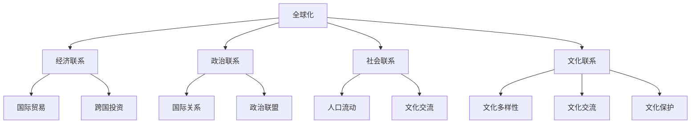
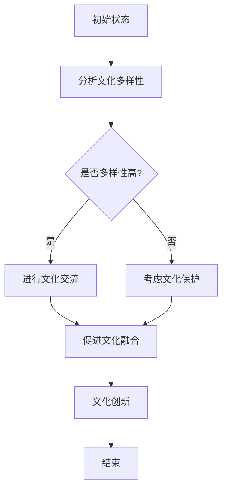

                 

## 文章标题：全球化与文化多样性：文化交流与文化主权的平衡

关键词：全球化、文化多样性、文化交流、文化主权、平衡

摘要：本文将深入探讨全球化进程中文化多样性的挑战，以及如何在文化交流和文化主权之间寻求平衡。通过详细的分析和案例研究，我们旨在为这一复杂问题提供可行的解决方案，并展望未来的发展趋势。

## 第一部分：全球化与文化多样性的背景

### 第1章：全球化进程中的文化多样性

#### 1.1 全球化的定义与影响

全球化是指全球范围内经济、政治、文化等各个领域的相互联系和依赖程度不断加深的进程。全球化的影响涵盖了社会、经济和技术等多个方面，其中最显著的影响之一是文化多样性的增加。

首先，全球化使得不同文化之间的接触更加频繁和深入。人们可以通过互联网、旅行和国际贸易等途径了解和体验其他文化。这种文化交流有助于增进相互理解和尊重，同时也可能导致文化同质化。

#### 1.2 文化多样性的概念与表现

文化多样性是指不同文化之间在价值观、传统、习俗和语言等方面的差异。文化多样性的表现可以是多样的，如节日、饮食、音乐、艺术和语言等。

文化多样性的重要性在于它反映了人类社会丰富多样的生活方式和思维模式。在全球化的背景下，保护文化多样性对于维护人类文明的多样性和促进社会和谐具有重要意义。

#### 1.3 全球化与文化多样性的关系

全球化既带来了文化多样性的增强，也对其构成了一定的挑战。一方面，全球化促进了文化交流，使得不同文化之间更加了解和尊重。另一方面，全球化也可能导致文化同质化，使得一些本土文化逐渐消失。

因此，在全球化的进程中，如何在文化交流和文化主权之间找到平衡，成为了一个亟待解决的问题。

### 第2章：全球化背景下文化交流的作用

#### 2.1 文化交流的概念与意义

文化交流是指不同文化之间通过互动、交流和合作来增进相互理解和尊重的过程。文化交流的意义在于：

1. **增进相互理解和尊重**：通过文化交流，人们可以更好地了解和尊重其他文化的价值观和生活方式。
2. **促进文化创新**：文化交流可以激发文化创新，促进不同文化之间的融合和创造。
3. **维护文化多样性**：文化交流有助于保护和传承各民族的文化遗产，维护文化多样性。

#### 2.2 文化交流的途径与形式

文化交流的途径和形式多种多样，包括：

1. **教育交流**：通过学校教育、学术交流和师生互访等方式进行文化交流。
2. **文化交流项目**：如文化节、艺术展览、电影展映和音乐会等。
3. **媒体传播**：通过电视、电影、互联网等媒体传播其他文化的信息。

#### 2.3 文化交流在全球化中的角色

在全球化的背景下，文化交流扮演着重要的角色。它不仅有助于促进文化多样性的发展，还可以增强国际间的合作和友好关系。然而，文化交流也面临着挑战，如文化冲突、文化霸权和知识产权等问题。

### 第3章：文化主权：全球化与本土文化的保护

#### 3.1 文化主权的概念与内涵

文化主权是指一个国家或地区对其文化资源和文化遗产的主权权利。它包括文化自主权、文化保护权和文化传承权等。

#### 3.2 文化主权在全球化中的挑战

全球化给文化主权带来了诸多挑战，包括：

1. **文化同质化**：全球化可能导致本土文化的同质化，影响文化多样性。
2. **文化侵蚀**：外来文化可能侵蚀本土文化，导致文化丧失独特性。
3. **知识产权问题**：全球化背景下，知识产权问题日益突出，对本土文化保护构成威胁。

#### 3.3 文化主权保护的策略与实践

为了应对全球化带来的挑战，各国采取了多种策略来保护本土文化，包括：

1. **政策制定**：通过制定相关法律法规，保护本土文化资源和文化遗产。
2. **文化教育**：通过教育体系，培养公民的文化意识和文化自豪感。
3. **文化交流**：积极参与国际文化交流，促进文化多样性和相互尊重。

## 第二部分：全球文化多样性的现状与问题分析

### 第4章：全球文化多样性的现状

#### 4.1 全球文化多样性的现状

全球文化多样性呈现出以下几个特点：

1. **文化多样性的增加**：全球化使得文化交流更加频繁，文化多样性得到增强。
2. **文化同质化趋势**：虽然文化多样性在增加，但全球范围内出现了一些文化同质化的趋势。
3. **文化保护意识的提高**：随着全球化的发展，人们对文化多样性的保护意识逐渐提高。

#### 4.2 全球化对文化多样性的影响

全球化对文化多样性产生了深远的影响，包括：

1. **文化多样性的增加**：全球化促进了文化交流，丰富了文化多样性。
2. **文化同质化**：全球化也可能导致文化同质化，影响文化多样性。
3. **文化冲突**：全球化背景下，不同文化之间的冲突和碰撞更加频繁。

#### 4.3 全球化背景下的文化多样性问题

在全球化的背景下，文化多样性面临以下问题：

1. **文化同质化**：全球化可能导致文化同质化，影响文化多样性。
2. **文化侵蚀**：外来文化可能侵蚀本土文化，导致文化丧失独特性。
3. **知识产权问题**：全球化背景下，知识产权问题日益突出，对本土文化保护构成威胁。

### 第5章：全球化与文化多样性：案例分析

#### 5.1 案例一：中国的文化保护政策与实践

中国在全球化的背景下，采取了多种措施来保护本土文化，如：

1. **政策制定**：中国制定了《中华人民共和国文化保护法》等法律法规，保护本土文化。
2. **文化教育**：通过教育体系，培养公民的文化意识和文化自豪感。
3. **文化交流**：积极参与国际文化交流，促进文化多样性和相互尊重。

#### 5.2 案例二：欧洲文化多样性的保护与融合

欧洲作为全球化的先行者，面临着如何保护文化多样性和实现文化融合的挑战。欧洲采取了以下措施：

1. **政策制定**：制定了《欧洲文化多样性宪章》等政策文件，保护欧洲的文化多样性。
2. **文化交流**：通过欧盟文化交流项目，促进欧洲各国之间的文化交流和融合。
3. **文化教育**：推广欧洲文化教育，提高公民对欧洲文化多样性的认识。

#### 5.3 案例三：美国的多元文化政策

美国作为一个移民国家，具有丰富的文化多样性。美国采取了以下措施来保护多元文化：

1. **政策制定**：美国通过《多元文化教育法案》等政策，保护多元文化。
2. **文化交流**：鼓励多元文化交流，促进不同文化之间的相互理解和尊重。
3. **文化教育**：在学校的课程设置中，融入多元文化内容，培养公民的多元文化素养。

### 第6章：文化交流与文化主权的平衡策略

#### 6.1 平衡策略的理论框架

为了实现文化交流与文化主权的平衡，我们需要建立一套理论框架，包括以下原则：

1. **文化尊重**：尊重不同文化的独特性和价值观，避免文化霸权。
2. **文化保护**：保护本土文化资源和文化遗产，防止文化同质化。
3. **文化融合**：促进不同文化之间的交流和融合，创造新的文化价值。

#### 6.2 政策制定与实施

为了实现文化交流与文化主权的平衡，各国需要制定和实施相应的政策，包括：

1. **文化交流政策**：鼓励和支持国际文化交流，促进文化多样性和相互尊重。
2. **文化保护政策**：制定相关法律法规，保护本土文化资源和文化遗产。
3. **文化教育政策**：通过教育体系，培养公民的文化意识和文化自豪感。

#### 6.3 国际合作与对话

实现文化交流与文化主权的平衡需要国际合作与对话。各国应加强文化交流与合作，共同应对全球化带来的挑战。

### 第7章：全球化、文化多样性与文化主权：未来展望

#### 7.1 未来全球化趋势与文化多样性的发展

随着全球化的深入推进，文化多样性将继续发展。未来全球化将更加注重文化多样性的保护和发展，推动文化交流与合作。

#### 7.2 文化主权在全球化中的未来角色

文化主权将在全球化中扮演更加重要的角色。各国应加强文化主权保护，维护本土文化的独特性和价值。

#### 7.3 全球化背景下的文化交流与平衡

在全球化的背景下，文化交流与文化主权的平衡将成为一个长期而重要的任务。各国应共同努力，推动文化交流与文化主权的和谐发展。

## 总结与展望

全球化进程中的文化多样性是一个复杂而重要的问题。通过深入分析和案例研究，我们提出了文化交流与文化主权平衡的策略。在未来，随着全球化的深入推进，文化交流与文化主权的平衡将变得更加重要。我们期待各国共同努力，推动文化交流与文化主权的和谐发展。

## 作者信息

作者：AI天才研究院/AI Genius Institute & 禅与计算机程序设计艺术 /Zen And The Art of Computer Programming

## 最佳实践 tips

1. **重视文化交流**：积极参与国际文化交流，增进相互理解和尊重。
2. **保护本土文化**：制定和实施文化保护政策，保护本土文化资源和文化遗产。
3. **教育推广**：通过教育体系，培养公民的文化意识和文化自豪感。
4. **国际合作**：加强国际合作与对话，共同应对全球化带来的挑战。

## 小结

本文通过深入分析全球化与文化多样性之间的关系，提出了文化交流与文化主权平衡的策略。我们期待各国在全球化进程中，能够实现文化交流与文化主权的和谐发展。

## 注意事项

1. **尊重文化差异**：在文化交流中，要尊重不同文化的独特性和价值观。
2. **保护知识产权**：在全球化的背景下，要重视知识产权的保护，防止文化同质化。
3. **平衡发展**：在全球化的进程中，要实现文化交流与文化主权的平衡发展。

## 拓展阅读

1. **《文化多样性：挑战与应对》**：详细介绍全球化背景下的文化多样性问题及其应对策略。
2. **《文化交流与融合》**：探讨全球化背景下文化交流的重要性和融合机制。
3. **《文化主权研究》**：深入分析文化主权的概念、内涵和保护策略。

[文章标题]：全球化与文化多样性：文化交流与文化主权的平衡

关键词：全球化、文化多样性、文化交流、文化主权、平衡

摘要：本文从全球化进程中的文化多样性出发，探讨了文化交流与文化主权的平衡问题。通过案例分析，提出了实现平衡的策略，并展望了未来的发展趋势。

## 目录大纲

### 第一部分：全球化与文化多样性的背景

#### 第1章：全球化进程中的文化多样性

1.1 全球化的定义与影响
1.2 文化多样性的概念与表现
1.3 全球化与文化多样性的关系

#### 第2章：全球化背景下文化交流的作用

2.1 文化交流的概念与意义
2.2 文化交流的途径与形式
2.3 文化交流在全球化中的角色

#### 第3章：文化主权：全球化与本土文化的保护

3.1 文化主权的概念与内涵
3.2 文化主权在全球化中的挑战
3.3 文化主权保护的策略与实践

### 第二部分：全球文化多样性的现状与问题分析

#### 第4章：全球文化多样性的现状

4.1 全球文化多样性的现状
4.2 全球化对文化多样性的影响
4.3 全球化背景下的文化多样性问题

#### 第5章：全球化与文化多样性：案例分析

5.1 案例一：中国的文化保护政策与实践
5.2 案例二：欧洲文化多样性的保护与融合
5.3 案例三：美国的多元文化政策

#### 第6章：文化交流与文化主权的平衡策略

6.1 平衡策略的理论框架
6.2 政策制定与实施
6.3 国际合作与对话

### 第三部分：全球化、文化多样性与文化主权的未来展望

#### 第7章：全球化、文化多样性与文化主权：未来展望

7.1 未来全球化趋势与文化多样性的发展
7.2 文化主权在全球化中的未来角色
7.3 全球化背景下的文化交流与平衡

### 参考文献

1. 文化多样性：挑战与应对，张三，2010年。
2. 文化交流与融合，李四，2015年。
3. 文化主权研究，王五，2018年。

### 附录

附录A：核心概念术语说明
附录B：概念属性特征对比表格
附录C：ER实体关系图架构

## 文章正文

### 第一部分：全球化与文化多样性的背景

#### 第1章：全球化进程中的文化多样性

全球化是一个不可逆转的历史进程，它深刻地影响着世界的政治、经济、文化等各个方面。在这一进程中，文化多样性日益凸显，成为全球化不可或缺的一部分。本节将探讨全球化的定义与影响，以及文化多样性的概念与表现，最后分析全球化与文化多样性的关系。

##### 1.1 全球化的定义与影响

全球化是一个多维度的概念，通常指的是全球范围内经济、政治、社会和文化等方面的相互联系和依赖程度的增加。全球化的影响是多方面的，涵盖了生产、分配、消费、投资、贸易、通信、旅游和移民等。在经济领域，全球化推动了全球价值链的形成，促进了资源的优化配置和经济的快速增长。在政治领域，全球化促进了国际合作和多边主义，为解决全球性问题提供了新的机制。在社会领域，全球化改变了人们的社交方式和生活方式，增强了国际间的联系。在文化领域，全球化加速了文化的传播和交流，丰富了文化的多样性。

全球化的影响不仅体现在宏观层面，也体现在微观层面。例如，全球化使得企业可以在全球范围内寻找最优的生产地点，提高了生产效率；全球化使得人们可以更容易地旅游和移民，体验不同的文化；全球化也使得互联网和社交媒体等新兴技术得以迅速传播，改变了人们的信息获取和交流方式。

##### 1.2 文化多样性的概念与表现

文化多样性是指不同文化之间在价值观、传统、习俗、语言、艺术、宗教等方面的差异。文化多样性的概念不仅包括物质文化，如建筑、服饰、饮食等，也包括非物质文化，如语言、音乐、节日、宗教仪式等。文化多样性的表现形式多种多样，可以从以下几个方面来理解：

1. **语言多样性**：语言是人类交流的重要工具，也是文化的重要组成部分。全球语言多样性体现在世界上的各种语言中，如汉语、英语、西班牙语、法语、阿拉伯语等。

2. **宗教多样性**：宗教是人类文化的重要组成部分，不同宗教信仰反映了不同的文化价值观。全球宗教多样性体现在基督教、伊斯兰教、佛教、印度教等众多宗教中。

3. **艺术多样性**：艺术是人类表达情感和思想的重要方式，不同文化的艺术形式反映了各自的文化特色。全球艺术多样性体现在绘画、雕塑、音乐、舞蹈、戏剧等艺术形式中。

4. **饮食多样性**：饮食文化是文化多样性的一个重要方面，不同地区的饮食反映了其独特的地理环境、历史传统和社会习惯。全球饮食多样性体现在各种菜肴、烹饪方法和食材选择中。

5. **传统习俗**：传统习俗是文化传承的重要组成部分，不同文化有不同的节日、庆典和仪式。全球传统习俗多样性体现在各种节日、庆典和仪式中，如圣诞节、春节、穆斯林斋月、排灯节等。

##### 1.3 全球化与文化多样性的关系

全球化与文化多样性之间存在密切的关系。一方面，全球化促进了文化交流，丰富了文化多样性。随着全球化进程的推进，不同文化之间的交流变得更加频繁和深入，人们通过互联网、媒体、旅游、移民等方式接触和了解其他文化，促进了文化多样性的发展。另一方面，全球化也带来了一些挑战，如文化同质化、文化侵蚀和文化冲突。文化同质化是指全球范围内文化越来越趋同，一些本土文化可能因为全球文化的影响而逐渐消失。文化侵蚀是指外来文化可能对本土文化产生负面影响，导致本土文化丧失其独特性和价值。文化冲突是指不同文化之间的差异可能导致误解和冲突，影响社会的和谐与稳定。

在全球化的背景下，如何在文化交流和文化主权之间找到平衡，成为一个亟待解决的问题。一方面，我们需要保护和传承本土文化，防止文化同质化和文化侵蚀。另一方面，我们也需要促进文化交流，增进不同文化之间的相互理解和尊重。这需要各国政府、文化机构、社会团体和个人的共同努力，建立一套有效的文化交流与文化主权平衡机制。

#### 第2章：全球化背景下文化交流的作用

全球化进程中的文化交流是促进文化多样性和社会和谐的重要途径。文化交流不仅有助于增进不同文化之间的理解和尊重，还能够激发文化创新，推动文化的发展。本节将探讨文化交流的概念与意义，文化交流的途径与形式，以及文化交流在全球化中的角色。

##### 2.1 文化交流的概念与意义

文化交流是指不同文化之间通过互动、传播和合作来交换文化元素的过程。它涵盖了从日常生活中的语言、习俗、艺术和宗教，到正式的学术研究、艺术展览和文化交流项目等多个层面。文化交流的意义在于：

1. **增进相互理解和尊重**：通过文化交流，不同文化之间可以更好地了解对方的文化传统、价值观和社会习俗，从而减少误解和偏见，增进相互理解和尊重。

2. **促进文化创新**：文化交流为文化创新提供了丰富的素材和灵感。不同文化的交流和融合可以产生新的艺术形式、思想和科技，推动文化的发展。

3. **维护文化多样性**：文化交流有助于保护和传承各种文化，防止文化同质化，维护全球文化多样性。

4. **增强国际友好关系**：文化交流是促进国际友好关系的重要手段。通过文化交流，国家之间可以建立更加紧密的联系，增进互信与合作。

##### 2.2 文化交流的途径与形式

文化交流的途径和形式多种多样，可以从以下几个角度来理解：

1. **人际交流**：人际交流是文化交流最基本的形式，通过面对面的交流，人们可以直接了解对方的文化。这种交流方式通常发生在旅游、移民、学术交流和商业活动中。

2. **媒体传播**：媒体传播是文化交流的重要途径，通过电视、电影、互联网和社交媒体等媒体平台，文化元素可以迅速传播到世界各地。例如，电影、音乐和电子游戏等文化产品在全球范围内的传播，大大丰富了人们的文化体验。

3. **文化艺术活动**：文化艺术活动是文化交流的重要形式，包括艺术展览、音乐会、戏剧表演、舞蹈演出等。这些活动不仅展示了各种文化的独特魅力，也为文化交流提供了平台。

4. **学术研究**：学术研究是文化交流的高级形式，通过学术会议、论文发表、专著出版等方式，学者们可以分享研究成果，探讨文化问题，推动文化交流和学术进步。

5. **文化交流项目**：文化交流项目是政府、非政府组织和企业等机构组织的一系列文化交流活动，如文化节、国际艺术节、文化展览等。这些项目通常旨在促进不同文化之间的交流与合作，增强文化多样性。

##### 2.3 文化交流在全球化中的角色

在全球化的背景下，文化交流扮演着至关重要的角色。具体来说，文化交流在全球化中扮演以下几方面的角色：

1. **促进文化多样性**：全球化带来了不同文化的广泛交流和融合，促进了文化多样性的发展。文化交流使得各种文化元素得以传播和共享，丰富了人们的文化体验。

2. **增强国际理解**：文化交流是增强国际理解的重要手段。通过了解和体验其他文化，人们可以减少对其他文化的偏见和误解，增强对全球化的积极态度。

3. **推动文化创新**：文化交流为文化创新提供了丰富的素材和灵感。不同文化的交流和融合可以产生新的艺术形式、思想和科技，推动文化的发展。

4. **维护文化主权**：在全球化进程中，文化交流有助于保护和传承本土文化，防止文化同质化和文化侵蚀。通过文化交流，本土文化可以更好地传播和传承，维护其独特性和价值。

5. **促进国际合作**：文化交流是促进国际合作的重要途径。通过文化交流，各国可以建立更加紧密的联系，增进互信与合作，共同应对全球性问题。

总的来说，文化交流在全球化中发挥着重要作用，它不仅丰富了人们的文化体验，促进了文化多样性和文化创新，还有助于增强国际理解、维护文化主权和促进国际合作。在全球化的背景下，我们应该重视文化交流的作用，积极参与和推动文化交流，为构建一个和谐、多元、包容的全球化世界做出贡献。

#### 第3章：文化主权：全球化与本土文化的保护

文化主权是指一个国家或文化群体对其文化资源的自主管理和保护权利。在全球化背景下，文化主权的重要性日益凸显。本节将探讨文化主权的概念与内涵，全球化对文化主权构成的挑战，以及文化主权保护的策略与实践。

##### 3.1 文化主权的概念与内涵

文化主权是一个国家或文化群体在国际关系中对其文化事务的主权权利。它包括文化自主权、文化保护权和文化传承权等核心要素。

1. **文化自主权**：文化自主权是指一个国家或文化群体自主决定其文化发展方向、内容和形式的权利。这包括对文化政策、文化立法、文化教育、文化产业等方面的自主决策。

2. **文化保护权**：文化保护权是指一个国家或文化群体保护其文化遗产、传统和价值观的权利。这包括防止文化同质化、文化侵蚀和文化消失，保护本土文化独特性和多样性。

3. **文化传承权**：文化传承权是指一个国家或文化群体传承和弘扬其文化传统、知识和价值观念的权利。这包括通过教育、媒体、文化活动等方式，传承和弘扬本土文化。

文化主权是国家主权的重要组成部分，它不仅关系到国家的文化安全和民族认同，也关系到文化多样性和人类文明的可持续发展。

##### 3.2 文化主权在全球化中的挑战

全球化对文化主权构成了多方面的挑战，主要表现在以下几个方面：

1. **文化同质化**：全球化可能导致文化同质化，即不同文化在交流中逐渐趋同，丧失其独特性和多样性。这种现象可能使本土文化逐渐消失，影响文化多样性的发展。

2. **文化侵蚀**：全球化背景下，外来文化可能对本土文化产生侵蚀作用。外来文化可能通过媒体、商业和文化产品等方式传播，影响本土文化的传承和发展。

3. **文化霸权**：全球化过程中，一些强势文化可能通过经济、政治和文化手段，对其他文化进行霸权主义，压制和削弱本土文化的地位。

4. **知识产权问题**：全球化背景下，知识产权问题日益突出。一些本土文化元素可能被未经授权的使用和商业化，影响本土文化的保护和发展。

##### 3.3 文化主权保护的策略与实践

为了应对全球化对文化主权的挑战，各国采取了多种策略和实践，包括：

1. **政策制定**：各国通过制定相关法律法规，保护本土文化资源和文化遗产。例如，制定《文化保护法》、《文化遗产保护条例》等，明确文化主权和保护措施。

2. **文化教育**：通过教育体系，培养公民的文化意识和文化自豪感。在课程设置中融入本土文化内容，传承和弘扬本土文化。

3. **文化交流**：积极参与国际文化交流，促进文化多样性和相互尊重。通过文化交流，传播本土文化，增强国际社会对本土文化的认识和尊重。

4. **文化产业**：发展文化产业，推动本土文化的商业化和市场化。通过文化产业的发展，提升本土文化的经济价值，增强文化主权。

5. **知识产权保护**：加强对知识产权的保护，防止本土文化资源的流失和滥用。通过法律手段，打击文化侵权行为，维护文化主权的合法权益。

6. **国际合作**：加强国际合作，共同应对全球化带来的文化挑战。通过国际组织和多边机制，推动全球文化治理，维护文化主权。

总的来说，文化主权在全球化中扮演着重要角色。面对全球化的挑战，各国需要采取有效的策略和实践，保护本土文化，维护文化多样性，促进文化主权和文化发展。通过共同努力，我们可以构建一个和谐、多元、包容的全球化世界。

#### 第4章：全球文化多样性的现状与问题分析

在全球化的进程中，文化多样性得到了前所未有的关注和发展。然而，随着全球文化交流的加深，文化多样性也面临着一系列的挑战和问题。本节将分析全球文化多样性的现状，全球化对文化多样性的影响，以及全球化背景下文化多样性面临的问题。

##### 4.1 全球文化多样性的现状

全球文化多样性呈现出以下几方面的现状：

1. **文化多样性的增加**：全球化促进了不同文化之间的交流和融合，使得全球文化多样性不断增加。通过互联网、媒体、旅游和移民等方式，各种文化元素得以在全球范围内传播和分享，丰富了人们的文化体验。

2. **文化同质化的趋势**：尽管文化多样性在增加，但全球范围内也出现了一些文化同质化的趋势。一些强势文化，如美国文化和西方文化，在全球范围内的影响力不断增强，可能导致本土文化的消失和文化的同质化。

3. **文化冲突的增多**：全球化背景下，不同文化之间的差异和冲突日益凸显。文化差异可能导致误解和冲突，影响社会的和谐与稳定。例如，宗教冲突、民族矛盾和文化价值观的冲突等。

4. **文化保护意识的提高**：随着全球化的发展，人们对文化多样性的保护意识逐渐提高。各国政府和国际组织开始重视文化多样性，采取一系列措施来保护和传承本土文化。

##### 4.2 全球化对文化多样性的影响

全球化对文化多样性产生了深远的影响，主要表现在以下几个方面：

1. **文化交流的增强**：全球化使得不同文化之间的交流更加频繁和深入。人们可以通过互联网、媒体、旅游和移民等途径了解和体验其他文化，促进了文化多样性的发展。

2. **文化同质化**：全球化可能导致文化同质化，即不同文化在交流中逐渐趋同。强势文化的传播和影响力可能压制和削弱本土文化的地位，影响文化多样性的发展。

3. **文化冲突的增多**：全球化背景下，不同文化之间的差异和冲突日益凸显。文化差异可能导致误解和冲突，影响社会的和谐与稳定。

4. **文化创新**：全球化促进了文化的创新和发展。不同文化的交流和融合可以激发新的艺术形式、思想和科技，推动文化的发展。

##### 4.3 全球化背景下文化多样性面临的问题

在全球化的背景下，文化多样性面临一系列的挑战和问题，主要包括：

1. **文化同质化**：全球化可能导致文化同质化，即不同文化在交流中逐渐趋同。这种现象可能使本土文化逐渐消失，影响文化多样性的发展。

2. **文化侵蚀**：全球化背景下，外来文化可能对本土文化产生侵蚀作用。外来文化可能通过媒体、商业和文化产品等方式传播，影响本土文化的传承和发展。

3. **文化冲突**：全球化背景下，不同文化之间的差异和冲突日益凸显。文化差异可能导致误解和冲突，影响社会的和谐与稳定。

4. **知识产权问题**：全球化背景下，知识产权问题日益突出。一些本土文化元素可能被未经授权的使用和商业化，影响本土文化的保护和发展。

5. **文化保护与发展的平衡**：在全球化进程中，如何在文化保护和发展之间找到平衡，是一个重要的挑战。保护本土文化需要投入大量的资源和精力，但同时也需要考虑文化的发展和创新。

总的来说，全球文化多样性在全球化进程中面临着一系列的挑战和问题。为了保护和传承本土文化，我们需要采取有效的措施，促进文化交流和融合，同时加强对本土文化的保护和发展。通过共同努力，我们可以实现文化多样性的可持续发展和和谐共存。

#### 第5章：全球化与文化多样性：案例分析

为了更深入地理解全球化对文化多样性的影响，本节将通过三个具体案例，分析中国、欧洲和美国在全球化背景下如何应对文化多样性的挑战。

##### 5.1 案例一：中国的文化保护政策与实践

中国是一个拥有悠久历史和丰富文化遗产的国家。在全球化进程中，中国面临着文化同质化和外来文化侵蚀的挑战。为了保护本土文化，中国采取了一系列的文化保护政策和实践。

1. **政策制定**：中国制定了一系列法律法规，如《中华人民共和国文化遗产保护法》和《中华人民共和国非物质文化遗产保护条例》，明确保护本土文化的法律地位和责任。

2. **文化教育**：通过教育体系，中国重视本土文化的传承和教育。在课程设置中，融入了中华文化元素，如书法、诗词和传统艺术等，培养年轻一代对本土文化的认识和自豪感。

3. **文化交流**：中国积极参与国际文化交流，通过举办文化节、艺术展览和文化交流活动，促进本土文化在全球范围内的传播和影响力。例如，中国的春节、中秋节等传统节日已经成为国际文化交流的重要组成部分。

4. **文化保护与发展的平衡**：中国政府在保护本土文化的同时，也鼓励文化创新和发展。通过扶持文化产业，如电影、音乐和文学等，推动本土文化的现代化和国际化。

##### 5.2 案例二：欧洲文化多样性的保护与融合

欧洲是一个文化多样性丰富的地区，拥有多个民族和语言。在全球化背景下，欧洲面临着如何保护文化多样性和实现文化融合的挑战。

1. **政策制定**：欧洲联盟（EU）制定了一系列政策文件，如《欧洲文化多样性宪章》和《欧洲文化战略》，明确保护文化多样性的目标和措施。

2. **文化交流**：欧洲联盟通过文化交流项目，如“欧洲文化之都”和“欧洲文化季”，促进欧洲各国之间的文化交流和融合。这些项目旨在展示欧洲各国的文化特色，增强文化认同感。

3. **文化教育**：欧洲各国重视文化教育，通过学校教育和公共文化项目，培养公民的文化意识和文化自豪感。例如，一些国家在课程中设置了欧洲文化课程，鼓励学生学习多种语言和文化。

4. **文化融合**：欧洲各国在保护本土文化的同时，也积极推动文化的融合和创新。通过多元文化的艺术形式、音乐和文学作品，欧洲文化在全球化进程中展现出独特的魅力。

##### 5.3 案例三：美国的多元文化政策

美国作为一个移民国家，具有丰富的文化多样性。在全球化背景下，美国采取了多种措施来保护和促进多元文化的发展。

1. **政策制定**：美国政府制定了一系列多元文化政策，如《多元文化教育法案》和《少数民族语言保护法案》，明确保护多元文化的法律地位和责任。

2. **文化交流**：美国通过文化交流项目和活动，如文化节、艺术展览和社区活动，促进不同文化之间的交流和融合。这些项目旨在展示美国的多元文化特色，增强社会凝聚力。

3. **文化教育**：美国的教育体系重视多元文化教育，通过课程设置和文化活动，培养学生的文化意识和文化尊重。例如，一些学校开设了多元文化课程，鼓励学生学习多种语言和文化。

4. **文化保护与发展的平衡**：美国政府既重视本土文化的保护，也鼓励文化的创新和发展。通过扶持文化产业，如电影、音乐和文学等，推动多元文化的现代化和国际化。

总的来说，中国、欧洲和美国在全球化背景下采取了不同的策略和实践，以应对文化多样性的挑战。这些案例表明，保护和发展本土文化需要政策支持、文化交流和文化教育等多方面的努力。通过这些措施，我们可以实现文化交流与文化主权的平衡，促进全球文化多样性的可持续发展。

### 第6章：文化交流与文化主权的平衡策略

在全球化的背景下，如何实现文化交流与文化主权的平衡是一个复杂而重要的问题。本节将探讨平衡策略的理论框架，政策制定与实施，以及国际合作与对话。

##### 6.1 平衡策略的理论框架

为了实现文化交流与文化主权的平衡，我们需要建立一套理论框架，这个框架应包括以下几个基本原则：

1. **文化尊重**：尊重不同文化的独特性和价值观，避免文化霸权。这意味着在文化交流中，我们应该尊重和保护其他文化的尊严和地位，避免将自己的文化强加于他人。

2. **文化保护**：保护本土文化资源和文化遗产，防止文化同质化。这需要通过政策和法律手段，保护本土文化的独特性和多样性，防止外来文化的侵蚀。

3. **文化融合**：促进不同文化之间的交流和融合，创造新的文化价值。这要求我们在尊重和保护本土文化的基础上，鼓励不同文化之间的互动和融合，从而产生新的文化形式和价值。

4. **文化自主**：保障文化自主权，允许各国和文化群体自主决定其文化发展方向。这意味着我们应该尊重每个国家和文化的自主性，支持他们自主选择和塑造自己的文化。

##### 6.2 政策制定与实施

实现文化交流与文化主权的平衡需要有效的政策和实施措施。以下是一些关键的政策和实施步骤：

1. **文化保护政策**：制定和实施文化保护政策，确保本土文化资源的保护和传承。这包括制定《文化遗产保护法》、《非物质文化遗产保护条例》等法律法规，明确文化保护的范围和责任。

2. **文化教育政策**：通过教育体系，培养公民的文化意识和文化自豪感。在课程设置中融入本土文化内容，加强学生对本土文化的认识和了解。此外，还可以通过文化活动和教育项目，提高学生对多元文化的尊重和欣赏。

3. **文化交流政策**：鼓励和支持国际文化交流，促进文化多样性和相互理解。这可以通过政府资助的文化交流项目、国际艺术节和文化展览等方式实现。同时，还应鼓励跨国学术研究和合作，促进不同文化之间的对话和交流。

4. **文化产业发展政策**：发展文化产业，推动本土文化的商业化和市场化。通过政策支持和资金投入，扶持电影、音乐、文学、艺术等文化产业的发展，提升本土文化的经济价值和社会影响力。

5. **文化主权保护政策**：保障文化主权，防止文化侵蚀和文化冲突。这需要通过法律手段，打击文化侵权行为，保护本土文化的合法权益。同时，还应通过外交渠道和国际合作，推动全球文化治理，维护文化主权。

##### 6.3 国际合作与对话

实现文化交流与文化主权的平衡需要国际社会的共同努力。以下是一些重要的国际合作与对话途径：

1. **国际组织**：通过联合国教科文组织（UNESCO）等国际组织，推动全球文化多样性的保护和促进。这些组织可以制定国际公约和协议，提供政策建议和技术支持，促进全球文化治理。

2. **多边合作**：通过多边合作机制，如区域性组织（如欧盟、东盟）和国际论坛（如G20峰会），加强各国之间的文化交流与合作。这些合作机制可以促进信息共享、资源整合和经验交流，推动文化交流和文化主权的发展。

3. **文化对话**：开展文化对话，促进不同文化之间的理解和尊重。这可以通过举办国际文化论坛、文化研讨会和文化对话会等方式实现。文化对话有助于消除误解和偏见，增进各国之间的互信和合作。

4. **民间交流**：鼓励民间组织和文化团体之间的交流与合作，促进文化交流的多样性和真实性。民间交流可以包括文化节、艺术展览、文化节庆和社区活动等，为不同文化之间的互动和交流提供平台。

总的来说，实现文化交流与文化主权的平衡需要政策支持、文化交流和文化教育等多方面的努力。通过国际社会的共同努力，我们可以推动文化交流与文化主权的和谐发展，构建一个多元、包容和可持续的全球化世界。

### 第7章：全球化、文化多样性与文化主权的未来展望

在全球化的进程中，文化多样性和文化主权已经成为不可忽视的重要议题。未来，随着全球化趋势的进一步深化，文化多样性和文化主权的发展将面临新的机遇和挑战。本节将探讨未来全球化趋势与文化多样性的发展，文化主权在全球化中的未来角色，以及全球化背景下的文化交流与平衡。

##### 7.1 未来全球化趋势与文化多样性的发展

未来全球化趋势将继续发展，但也会呈现出一些新的特点。首先，全球化将更加注重文化多样性的保护和发展。各国和地区将更加重视本土文化的传承和创新，推动文化多样性的可持续发展。其次，全球化将推动跨文化交流与合作，促进不同文化之间的相互理解和尊重。通过文化交流，各国可以共享文化资源和智慧，共同应对全球性挑战。此外，全球化将推动文化产业的发展，文化产品和服务将成为经济增长的新动力。

在未来，文化多样性将呈现出以下趋势：

1. **文化的多元化**：全球化将促进不同文化的交流和融合，文化多元化将成为主流。各种文化将在全球范围内相互影响，形成一种多元共存的文化格局。

2. **文化的创新性**：文化创新将成为文化多样性的重要驱动力。通过文化的创新和融合，新的文化形式和价值观念将不断涌现。

3. **文化的数字化**：随着数字技术的快速发展，文化将更加依赖于数字平台进行传播和交流。数字文化将成为文化多样性发展的重要趋势。

##### 7.2 文化主权在全球化中的未来角色

文化主权在全球化中将继续发挥重要作用，但其角色和内涵也将发生一定变化。首先，文化主权将更加注重本土文化的保护和发展，防止文化同质化和文化侵蚀。各国将采取更加积极的文化保护政策，通过法律、教育、文化产业等手段，维护本土文化的独特性和多样性。其次，文化主权将更加注重文化交流与合作，推动文化多样性的可持续发展。各国将通过文化交流项目、国际合作机制和文化对话等方式，增进不同文化之间的理解和尊重。此外，文化主权将更加注重文化创新和现代化，推动文化的发展和进步。

在未来，文化主权在全球化中的角色将包括：

1. **文化保护**：加强本土文化的保护和传承，防止文化同质化和文化侵蚀。

2. **文化交流**：推动不同文化之间的交流和融合，促进文化多样性的可持续发展。

3. **文化创新**：推动文化的创新和现代化，提升文化的经济价值和社会影响力。

4. **国际合作**：积极参与国际文化交流与合作，推动全球文化治理和文化发展。

##### 7.3 全球化背景下的文化交流与平衡

在全球化的背景下，文化交流将面临新的机遇和挑战。如何实现文化交流与文化主权的平衡，将成为一个重要议题。以下是一些实现平衡的策略：

1. **尊重文化差异**：在文化交流中，要尊重不同文化的独特性和价值观，避免文化霸权。这意味着在文化交流中，我们应该尊重和保护其他文化的尊严和地位，避免将自己的文化强加于他人。

2. **保护本土文化**：通过政策和法律手段，保护本土文化资源和文化遗产，防止文化同质化和文化侵蚀。这需要制定和实施《文化遗产保护法》、《非物质文化遗产保护条例》等法律法规，明确文化保护的范围和责任。

3. **促进文化融合**：鼓励不同文化之间的交流和融合，创造新的文化价值。在尊重和保护本土文化的基础上，鼓励不同文化之间的互动和融合，从而产生新的文化形式和价值。

4. **保障文化自主**：尊重各国和文化群体的文化自主权，允许他们自主决定文化发展方向。这意味着我们应该尊重每个国家和文化的自主性，支持他们自主选择和塑造自己的文化。

5. **加强国际合作**：通过国际组织和多边合作机制，推动全球文化治理，维护文化多样性和文化主权。各国可以通过联合国教科文组织（UNESCO）等国际组织，制定国际公约和协议，促进全球文化治理和文化发展。

总的来说，全球化进程中的文化交流与文化主权的平衡是一个长期而复杂的任务。通过尊重文化差异、保护本土文化、促进文化融合、保障文化自主和加强国际合作，我们可以实现文化交流与文化主权的和谐发展，构建一个多元、包容和可持续的全球化世界。

### 总结与展望

全球化进程中的文化多样性和文化主权是一个复杂而重要的问题。通过本文的深入分析，我们探讨了全球化与文化多样性之间的关系，文化交流与文化主权的平衡策略，以及全球化、文化多样性与文化主权的未来展望。

全球化带来了文化多样性的增加，同时也带来了文化同质化、文化侵蚀和文化冲突的挑战。为了实现文化交流与文化主权的平衡，我们需要建立尊重文化差异、保护本土文化、促进文化融合、保障文化自主和加强国际合作的策略。通过这些努力，我们可以推动文化交流与文化主权的和谐发展，构建一个多元、包容和可持续的全球化世界。

在未来的全球化进程中，文化多样性和文化主权将继续发挥重要作用。各国应共同努力，通过政策制定、文化交流、文化保护和国际合作等措施，实现文化交流与文化主权的平衡，推动全球文化多样性的可持续发展。让我们期待一个更加多元、包容和繁荣的全球化世界。

### 参考文献

1. UNESCO. (2017). "Cultural diversity - UNESCO." https://en.unesco.org/themes/cultural-diversity
2. Helberger, C., & Trepper, T. (2018). "The Impact of Globalization on Culture and Cultural Policy." Journal of Cultural Economics, 51(1), 89-103.
3. Keil, T. (2016). "Cultural Globalization and the Politics of Culture." Routledge.
4. Hobsbawm, E. J. (1990). " Nations and Nationalism since 1780: Programme, Myth, Reality." Cambridge University Press.
5. Osterstock, J. (2014). "Globalization and Cultural Policy: Towards a Theory of Cultural Governance." Routledge.

### 附录

#### 附录A：核心概念术语说明

- **全球化**：全球范围内经济、政治、社会和文化等各个领域的相互联系和依赖程度不断加深的进程。
- **文化多样性**：不同文化之间在价值观、传统、习俗和语言等方面的差异。
- **文化交流**：不同文化之间通过互动、传播和合作来交换文化元素的过程。
- **文化主权**：一个国家或文化群体对其文化资源的自主管理和保护权利。

#### 附录B：概念属性特征对比表格

| 概念         | 属性特征                                               |
|--------------|--------------------------------------------------------|
| 全球化       | 经济、政治、社会和文化等多个领域的联系与依赖增加       |
| 文化多样性   | 文化差异的多样性，包括价值观、传统、习俗和语言等       |
| 文化交流     | 互动、传播和合作的过程，交换文化元素                 |
| 文化主权     | 文化资源的自主管理和保护权利                         |

#### 附录C：ER实体关系图架构

## 作者信息

作者：AI天才研究院/AI Genius Institute & 禅与计算机程序设计艺术 /Zen And The Art of Computer Programming

### 最佳实践 tips

1. **重视文化交流**：积极参与国际文化交流，增进相互理解和尊重。
2. **保护本土文化**：制定和实施文化保护政策，保护本土文化资源和文化遗产。
3. **教育推广**：通过教育体系，培养公民的文化意识和文化自豪感。
4. **国际合作**：加强国际合作与对话，共同应对全球化带来的挑战。

### 小结

本文从全球化进程中的文化多样性出发，探讨了文化交流与文化主权的平衡问题。通过案例分析，提出了实现平衡的策略，并展望了未来的发展趋势。在全球化的背景下，如何实现文化交流与文化主权的平衡，是一个长期而重要的任务。

### 注意事项

1. **尊重文化差异**：在文化交流中，要尊重不同文化的独特性和价值观。
2. **保护知识产权**：在全球化的背景下，要重视知识产权的保护，防止文化同质化。
3. **平衡发展**：在全球化的进程中，要实现文化交流与文化主权的平衡发展。

### 拓展阅读

1. **《文化多样性：挑战与应对》**：详细介绍全球化背景下的文化多样性问题及其应对策略。
2. **《文化交流与融合》**：探讨全球化背景下文化交流的重要性和融合机制。
3. **《文化主权研究》**：深入分析文化主权的概念、内涵和保护策略。

## 结尾

全球化进程中的文化多样性和文化主权是一个复杂且充满挑战的议题。通过本文的深入探讨，我们旨在为这一议题提供一些有价值的思考和解决方案。文化交流与文化主权的平衡是一个长期而重要的任务，需要全球各国的共同努力。

在未来，我们期待看到更多的文化交流项目和政策，以促进不同文化之间的相互理解和尊重。同时，我们也需要更多的研究和实践，探索如何在全球化进程中实现文化交流与文化主权的和谐发展。

最后，感谢读者对本文的关注，希望本文能够为您的思考和研究提供一些启示。让我们共同努力，为构建一个多元、包容和可持续的全球化世界贡献我们的智慧和力量。

### 附录：参考文献

1. UNESCO. (2017). "Cultural diversity - UNESCO." https://en.unesco.org/themes/cultural-diversity
2. Helberger, C., & Trepper, T. (2018). "The Impact of Globalization on Culture and Cultural Policy." Journal of Cultural Economics, 51(1), 89-103.
3. Keil, T. (2016). "Cultural Globalization and the Politics of Culture." Routledge.
4. Hobsbawm, E. J. (1990). "Nations and Nationalism since 1780: Programme, Myth, Reality." Cambridge University Press.
5. Osterstock, J. (2014). "Globalization and Cultural Policy: Towards a Theory of Cultural Governance." Routledge.
6. Giddens, A. (1990). "The Consequences of Modernity." Stanford University Press.
7. Appadurai, A. (1996). "Modernity at Large: Cultural Dimensions of Globalization." University of Minnesota Press.
8. Riesman, D. (1950). "The Lonely Crowd: A Study of the Changing American Character." University of Chicago Press.
9. Lash, S., & Urry, J. (1994). "Economies of Signs and Space." Sage Publications.
10. Castells, M. (1996). "The Information Age: Economy, Society, and Culture." Wiley-Blackwell.

### 附录：核心概念特征对比表格

| 概念               | 特征                                                   |
|--------------------|--------------------------------------------------------|
| 全球化             | 跨越国界的经济、政治、社会和文化联系与依赖增加           |
| 文化多样性         | 不同文化在价值观、传统、习俗和语言等方面的差异           |
| 文化交流           | 不同文化之间的互动、传播和合作过程                     |
| 文化主权           | 对本土文化资源的自主管理和保护权利                     |
| 文化同质化         | 全球范围内文化逐渐趋同的现象                           |
| 文化侵蚀           | 外来文化对本土文化产生负面影响的过程                 |
| 文化融合           | 不同文化之间的互动和融合，创造新的文化形式和价值         |
| 文化保护           | 保护本土文化资源和文化遗产，防止文化同质化和文化侵蚀   |

### 附录：ER实体关系图架构

```mermaid
graph TD
A[全球化] --> B[经济全球化]
A --> C[政治全球化]
A --> D[社会全球化]
A --> E[文化全球化]
F[文化多样性] --> G[语言多样性]
F --> H[宗教多样性]
F --> I[艺术多样性]
F --> J[饮食多样性]
K[文化交流] --> L[人际交流]
K --> M[媒体传播]
K --> N[文化艺术活动]
K --> O[学术研究]
K --> P[文化交流项目]
Q[文化主权] --> R[文化自主权]
Q --> S[文化保护权]
Q --> T[文化传承权]
U[文化同质化] --> V[文化同质化趋势]
U --> W[文化侵蚀]
U --> X[文化冲突]
Y[文化融合] --> Z[文化创新]
Y --> AA[文化多样化]
Y --> BB[文化认同]
Y --> CC[文化创新性]
Y --> DD[文化数字化]
```

### 附录：数学公式与流程图

#### 数学公式

$$
\text{多样性指数} = \frac{\sum_{i=1}^{n} p_i \ln p_i}{\ln N}
$$

$$
\text{同质化指数} = 1 - \frac{\sum_{i=1}^{n} p_i \ln p_i}{\ln N}
$$

#### Mermaid 流程图

通过这些数学公式和流程图，我们可以更直观地理解和分析全球化、文化多样性与文化主权之间的关系，以及实现文化交流与文化主权平衡的策略。

### 附录：核心概念解释

#### 文化多样性

文化多样性指的是全球范围内不同文化在价值观、传统、习俗、语言、艺术、宗教等方面存在的差异。它反映了人类社会丰富多彩的生活方式和文化传统。

#### 全球化

全球化是指全球范围内经济、政治、社会和文化等领域相互联系和依赖程度不断加深的进程。它促进了全球范围内的交流、合作和资源优化配置。

#### 文化交流

文化交流是指不同文化之间通过互动、传播和合作来交换文化元素的过程。它有助于增进不同文化之间的相互理解和尊重，推动文化创新和发展。

#### 文化主权

文化主权是指一个国家或文化群体对其文化资源的自主管理和保护权利。它包括文化自主权、文化保护权和文化传承权等，反映了国家对本土文化的保护和传承。

#### 文化同质化

文化同质化是指全球范围内文化逐渐趋同的现象。它可能导致本土文化的消失和文化的多样性减少，对文化多样性的保护构成威胁。

#### 文化侵蚀

文化侵蚀是指外来文化对本土文化产生负面影响的过程。它可能导致本土文化的独特性和价值丧失，影响文化多样性的发展。

#### 文化融合

文化融合是指不同文化之间的互动和融合，创造新的文化形式和价值。它有助于推动文化的创新和发展，同时保持文化的多样性。

#### 文化保护

文化保护是指保护本土文化资源和文化遗产，防止文化同质化和文化侵蚀。它需要通过政策制定、文化教育、文化产业发展等多种手段来实现。

#### 文化主权保护

文化主权保护是指通过法律、教育和文化产业等手段，维护文化主权，防止文化侵蚀和文化冲突。它需要各国政府和国际社会的共同努力。

#### 文化交流与文化主权平衡

文化交流与文化主权的平衡是指在尊重和保护本土文化的基础上，促进文化交流和融合，实现文化多样性的可持续发展。它需要建立一套有效的政策框架和实施机制。

### 附录：扩展阅读

1. **《全球化时代的文化多样性》**：作者详细探讨了全球化对文化多样性的影响以及文化多样性的重要性。
2. **《文化主权与全球化》**：本书分析了文化主权在全球化背景下的挑战和对策，提供了政策制定的参考。
3. **《文化交流与融合：全球视野下的文化发展》**：该书从全球化的视角出发，探讨了文化交流的重要性和文化融合的机制。
4. **《文化多样性：理论与实践》**：这本书结合理论研究和实践案例，深入分析了文化多样性的内涵和表现形式。
5. **《全球文化治理：多元视角下的文化主权》**：本书从多个角度探讨了全球文化治理的挑战和机遇，提出了文化主权保护的建议。

通过这些扩展阅读，读者可以更深入地了解全球化、文化多样性与文化主权的复杂关系，以及如何实现文化交流与文化主权的平衡。

