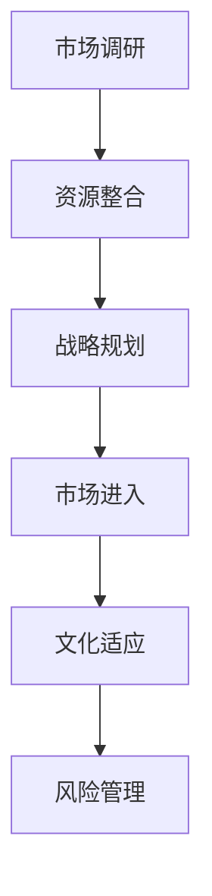
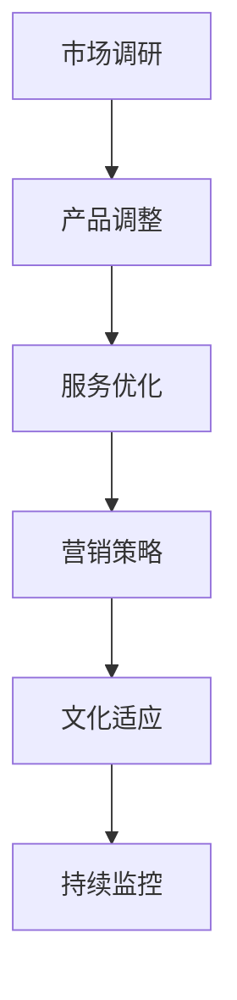
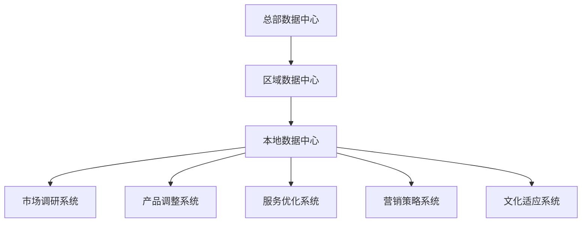
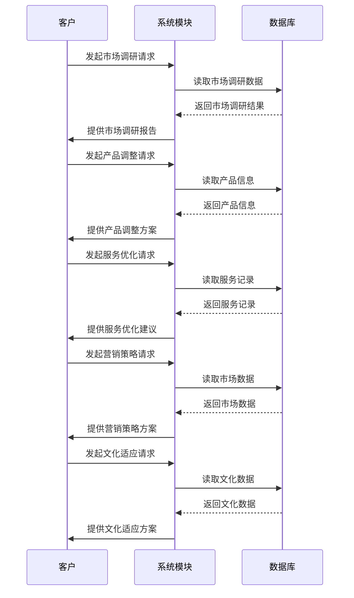

                 

# 全球化与本土化的企业战略：跨国经营与本地适应

## 关键词
- 企业战略
- 全球化
- 本土化
- 跨国经营
- 本地适应
- 竞争优势
- 文化差异
- 市场调研
- 政策法规
- 本土化产品
- 创新与适应

## 摘要
本文将深入探讨全球化与本土化的企业战略，分析跨国经营与本地适应的核心要素。通过系统地介绍全球化与本土化的概念，探讨其对企业战略的影响，以及在不同市场环境下的应用，文章旨在为企业提供一套有效的跨国经营与本地适应策略，以实现可持续发展与竞争优势。

## 引言
在全球化的浪潮下，企业面临的竞争环境日益复杂。跨国经营成为企业获取市场份额、实现资源整合的重要手段。然而，不同国家和地区的市场环境、文化背景、法律政策等因素对企业战略提出了不同的挑战。因此，如何在全球化与本土化之间找到平衡，制定出适应不同市场环境的战略，成为企业成功的关键。

### 全球化与企业战略
全球化是指企业跨越国界，在全球范围内进行商业活动的过程。它不仅包括产品的跨国销售，还涉及企业的全球运营和管理。全球化对企业战略的影响主要体现在以下几个方面：

1. **市场机会扩大**：企业可以通过进入新市场，扩大销售范围，提高市场份额。
2. **资源整合**：企业可以获取全球范围内的资源，如原材料、人力资源、技术等，提高生产效率和竞争力。
3. **品牌影响**：全球化有助于提升企业品牌的国际知名度，增强企业的品牌影响力。
4. **竞争压力**：全球化使企业面临来自全球范围内的竞争对手，要求企业不断提升自身的竞争力。

### 本土化与企业战略
本土化是指企业在跨国经营过程中，针对不同国家和地区的市场环境、文化背景、消费者需求等因素，调整产品和服务，使其更符合当地市场的需求。本土化对企业战略的影响主要体现在以下几个方面：

1. **市场适应性**：本土化有助于企业更好地适应不同市场的需求和消费习惯，提高市场占有率。
2. **品牌亲和力**：本土化产品和服务能够更好地满足当地消费者的需求，增强品牌在当地市场的亲和力。
3. **风险管理**：本土化有助于企业降低跨国经营中的风险，如政策法规风险、文化差异风险等。
4. **创新动力**：本土化要求企业不断进行产品创新和服务创新，以适应不同市场的需求，从而提升企业的创新能力。

### 跨国经营与本地适应
跨国经营与本地适应是企业全球化战略的重要组成部分。跨国经营是指企业在全球范围内进行商业活动，而本地适应则是在跨国经营过程中，根据不同市场的特点进行调整和适应。跨国经营与本地适应的关系如下：

1. **相互依存**：跨国经营需要本地适应的支持，而本地适应则依赖于跨国经营的成果。
2. **动态调整**：企业需要根据市场环境的变化，不断调整其跨国经营与本地适应策略。
3. **竞争优势**：通过有效的跨国经营与本地适应，企业可以在全球市场中获得竞争优势。

### 全球化与本土化的挑战与策略
在全球化的背景下，企业面临着诸多挑战，如文化差异、市场变化、政策法规等。为了应对这些挑战，企业需要采取以下策略：

1. **深入了解目标市场**：企业需要深入了解目标市场的文化、法律、经济环境等，制定有针对性的市场进入策略。
2. **本土化产品和服务**：企业应根据当地市场的需求，调整产品和服务，使其更符合当地消费者的习惯和偏好。
3. **灵活的运营模式**：企业应采取灵活的运营模式，如外包、合资、并购等，以快速适应市场变化。
4. **持续创新**：企业应不断进行产品创新和服务创新，以保持竞争优势。

### 结论
全球化与本土化是企业跨国经营中不可忽视的两个方面。企业需要在全球化与本土化之间找到平衡，通过深入了解目标市场、调整产品和服务、采取灵活的运营模式等方式，实现跨国经营与本地适应，从而在全球市场中获得竞争优势。未来，随着全球化的深入发展，企业需要不断适应市场变化，提升自身竞争力，以实现可持续发展。

## 第1章：全球化与本土化的概念解析

### 背景介绍
全球化与本土化作为企业跨国经营中的核心概念，对于理解企业战略的制定和执行具有重要意义。本章将深入探讨全球化与本土化的定义、起源、发展过程及其对企业的影响。

### 核心概念
**全球化**：全球化是指在全球范围内，通过经济、政治、文化等方面的互动和交流，实现资源、信息、技术和人员的自由流动和整合的过程。全球化起源于20世纪中后期，随着全球贸易、投资、跨国公司的发展而逐渐深化。

**本土化**：本土化是指企业在跨国经营过程中，根据当地市场的文化、法律、经济环境等要素，对产品、服务、营销策略等进行调整和适应的过程。本土化是全球化的一种表现形式，是企业在全球化过程中应对文化差异、提高市场竞争力的重要手段。

### 发展过程
全球化和本土化的发展经历了以下几个阶段：

1. **初期阶段（1950-1970s）**：全球化起源于国际贸易和跨国公司的兴起，各国之间的经济联系日益紧密。
2. **扩展阶段（1970s-1990s）**：随着信息技术的发展，全球范围内的信息交流变得更加便捷，跨国经营模式逐渐成熟。
3. **深化阶段（1990s至今）**：全球化进程加速，各国之间的经济、政治、文化互动更加深入，本土化策略成为企业应对文化差异和市场需求的必要手段。

### 企业影响
全球化与本土化对企业战略产生深远影响：

1. **市场扩张**：全球化为企业提供了广阔的市场机会，企业可以通过进入新市场，实现销售增长和市场份额的扩大。
2. **资源整合**：全球化使企业能够获取全球范围内的资源，如原材料、人力资源、技术等，提高生产效率和竞争力。
3. **文化适应**：本土化要求企业深入了解目标市场的文化、法律、经济环境等，调整产品和服务，提高市场适应性。
4. **风险管理**：全球化与本土化策略有助于企业降低跨国经营中的风险，如政策法规风险、文化差异风险等。

### 概念属性特征对比表格
以下是全球化与本土化的属性特征对比表格：

| 特征                | 全球化                                | 本土化                                |
|-------------------|-----------------------------------|-----------------------------------|
| 目标               | 扩大市场份额，实现资源整合            | 提高市场适应性，增强品牌亲和力            |
| 过程               | 跨国界资源、信息、技术等自由流动和整合  | 根据当地市场调整产品、服务、营销策略       |
| 影响因素           | 文化、经济、政治、技术等全球性因素     | 当地文化、法律、经济环境等市场性因素     |
| 关系               | 全球化是本土化的基础和前提            | 本土化是全球化的一种表现形式            |

### ER实体关系图架构
以下是一个简化的全球化与本土化ER实体关系图：

```mermaid
erDiagram
  Class1 ||--|{ Class2 }|-- Class3
  Class1 ||--|{ Class4 }|-- Class5
```

在ER实体关系图中，`Class1`代表企业，`Class2`代表全球化，`Class3`代表本土化，`Class4`代表市场机会，`Class5`代表市场适应性。通过这种关系图，我们可以清晰地看到全球化与本土化在企业战略中的关系和作用。

## 第2章：全球化战略的原理与实践

### 算法原理讲解
全球化战略的实现需要一系列的原理和方法。以下是一个简单的算法流程，用于指导企业实施全球化战略：

1. **市场调研**：对目标市场进行深入调研，了解市场环境、消费者需求、竞争态势等。
2. **资源整合**：根据市场调研结果，整合全球范围内的资源，如资金、技术、人才等。
3. **战略规划**：制定全球化战略规划，明确目标、步骤、资源分配等。
4. **市场进入**：选择合适的市场进入模式，如出口、直接投资、并购等。
5. **文化适应**：调整产品和服务，使其符合目标市场的文化特点。
6. **风险管理**：建立风险管理体系，降低跨国经营中的风险。

### Mermaid流程图
以下是一个全球化战略实现的Mermaid流程图：



在这个流程图中，每个节点代表一个步骤，箭头表示步骤之间的顺序关系。

### Python代码示例
以下是一个简单的Python代码示例，用于模拟全球化战略中的市场调研步骤：

```python
import random

def market_research(target_market):
    # 模拟市场调研结果
    market_conditions = {
        'economy': random.choice(['stable', 'growing', 'declining']),
        'consumer_demand': random.choice(['high', 'medium', 'low']),
        'competition': random.choice(['high', 'medium', 'low'])
    }
    
    print(f"Market research for {target_market}:")
    print(market_conditions)

# 测试市场调研
market_research('Germany')
```

在这个示例中，`market_research`函数接受一个目标市场的参数，并随机生成该市场的经济条件、消费者需求和竞争态势，用于模拟市场调研的结果。

### 算法原理的数学模型和公式
全球化战略的算法原理可以通过以下数学模型和公式进行描述：

1. **资源整合度**：资源整合度（Integration Degree）用于衡量企业对全球资源的整合程度。其计算公式为：
   $$ ID = \frac{I_1 + I_2 + I_3 + I_4}{4} $$
   其中，$I_1$、$I_2$、$I_3$、$I_4$ 分别代表资金、技术、人才、信息等资源的整合度。

2. **市场适应度**：市场适应度（Adaptation Degree）用于衡量企业在目标市场的适应程度。其计算公式为：
   $$ AD = \frac{A_1 + A_2 + A_3}{3} $$
   其中，$A_1$、$A_2$、$A_3$ 分别代表文化适应度、法律适应度、经济适应度。

3. **全球化战略效果**：全球化战略效果（Strategy Effectiveness）用于衡量全球化战略的实施效果。其计算公式为：
   $$ SE = f(ID, AD) $$
   其中，$f$ 表示全球化战略效果的函数，$ID$ 和 $AD$ 分别代表资源整合度和市场适应度。

### 举例说明
假设某企业在全球范围内整合了资金、技术、人才和信息等资源，其资源整合度 $ID$ 为 0.8。同时，该企业在目标市场的文化、法律和经济方面进行了有效适应，其市场适应度 $AD$ 为 0.9。根据上述公式，可以计算全球化战略效果 $SE$：

$$ SE = f(0.8, 0.9) = 0.8 \times 0.9 = 0.72 $$

因此，该企业的全球化战略效果为 0.72，表明该企业在全球市场中具有较强的竞争力。

## 第3章：本土化战略的原理与实践

### 算法原理讲解
本土化战略的实现同样需要一系列的原理和方法。以下是一个简单的算法流程，用于指导企业实施本土化战略：

1. **市场调研**：对目标市场进行深入调研，了解文化、法律、经济环境等。
2. **产品调整**：根据市场调研结果，对产品进行本土化调整。
3. **服务优化**：针对目标市场的消费者需求，优化服务策略。
4. **营销策略**：制定适合目标市场的营销策略。
5. **文化适应**：加强对本地文化的理解和尊重，提高品牌亲和力。
6. **持续监控**：对本土化战略的实施效果进行持续监控和调整。

### Mermaid流程图
以下是一个本土化战略实现的Mermaid流程图：



在这个流程图中，每个节点代表一个步骤，箭头表示步骤之间的顺序关系。

### Python代码示例
以下是一个简单的Python代码示例，用于模拟本土化战略中的产品调整步骤：

```python
def product_adjustment(target_market):
    # 模拟产品调整
    product_adjustments = {
        'design': 'localize',
        'functionality': 'enhance',
        'pricing': 'optimize'
    }
    
    print(f"Product adjustment for {target_market}:")
    print(product_adjustments)

# 测试产品调整
product_adjustment('China')
```

在这个示例中，`product_adjustment`函数接受一个目标市场的参数，并模拟产品调整的结果，包括设计、功能性和定价等方面的调整。

### 算法原理的数学模型和公式
本土化战略的算法原理可以通过以下数学模型和公式进行描述：

1. **文化适应度**：文化适应度（Cultural Adaptation Degree）用于衡量企业在文化适应方面的表现。其计算公式为：
   $$ CAD = \frac{C_1 + C_2 + C_3}{3} $$
   其中，$C_1$、$C_2$、$C_3$ 分别代表语言、价值观、习俗等方面的适应度。

2. **服务满意度**：服务满意度（Service Satisfaction Degree）用于衡量消费者对服务的满意程度。其计算公式为：
   $$ SSD = \frac{S_1 + S_2 + S_3}{3} $$
   其中，$S_1$、$S_2$、$S_3$ 分别代表服务质量、响应速度、客户关怀等方面的满意度。

3. **本土化战略效果**：本土化战略效果（Localization Strategy Effectiveness）用于衡量本土化战略的实施效果。其计算公式为：
   $$ LSE = f(CAD, SSD) $$
   其中，$f$ 表示本土化战略效果的函数，$CAD$ 和 $SSD$ 分别代表文化适应度和服务满意度。

### 举例说明
假设某企业在目标市场的文化适应度 $CAD$ 为 0.8，服务满意度 $SSD$ 为 0.9。根据上述公式，可以计算本土化战略效果 $LSE$：

$$ LSE = f(0.8, 0.9) = 0.8 \times 0.9 = 0.72 $$

因此，该企业的本土化战略效果为 0.72，表明该企业能够在目标市场中获得较高的消费者满意度。

## 第4章：跨国经营与本地适应的案例分析

### 项目介绍
在本章中，我们将分析一家跨国企业的成功案例，探讨其在全球化与本土化战略方面的实践。这家企业是一家知名的电子产品制造商，总部位于美国。该公司在全球范围内拥有多个生产基地和销售网络，产品覆盖了多个国家和地区。通过有效的全球化与本土化战略，该公司在激烈的市场竞争中脱颖而出，取得了显著的市场份额和品牌影响力。

### 系统功能设计
为了实现全球化与本土化战略，该公司设计了一套完善的信息系统，包括市场调研、产品调整、服务优化、营销策略和文化适应等模块。以下是一个简化的领域模型Mermaid类图：

```mermaid
classDiagram
  Class1[市场调研] <|-- Class2[产品调整]
  Class1 <|-- Class3[服务优化]
  Class1 <|-- Class4[营销策略]
  Class1 <|-- Class5[文化适应]
  Class2 <|-- Class6[定价策略]
  Class2 <|-- Class7[功能定制]
  Class3 <|-- Class8[客户支持]
  Class3 <|-- Class9[响应速度]
  Class4 <|-- Class10[广告投放]
  Class4 <|-- Class11[促销活动]
  Class5 <|-- Class12[语言本地化]
  Class5 <|-- Class13[习俗尊重]
  Class5 <|-- Class14[法律合规]
```

在这个类图中，`Class1` 代表市场调研模块，`Class2` 代表产品调整模块，`Class3` 代表服务优化模块，`Class4` 代表营销策略模块，`Class5` 代表文化适应模块。每个模块都包含具体的子模块，用于实现相应的功能。

### 系统架构设计
为了支持全球化与本土化战略，该公司采用了分布式架构，包括总部数据中心、区域数据中心和本地数据中心。以下是一个简化的系统架构Mermaid架构图：



在这个架构图中，`A` 代表总部数据中心，`B` 代表区域数据中心，`C` 代表本地数据中心。每个数据中心都连接到不同的系统模块，以实现数据存储、处理和分析。

### 系统接口设计和系统交互
为了实现系统的无缝集成和高效运行，该公司设计了一套完善的接口设计和系统交互机制。以下是一个简化的系统接口设计和系统交互Mermaid序列图：



在这个序列图中，`Customer` 代表客户，`System` 代表系统模块，`Database` 代表数据库。每个请求都经过系统的处理和数据库的查询，最终返回相应的结果。

## 项目实战：全球化与本土化战略的实施

### 环境安装
在本节中，我们将介绍如何在本地环境中搭建一个简单的全球化与本土化战略实施平台。首先，确保你已经安装了Python 3.8及以上版本。接下来，按照以下步骤进行环境安装：

1. 打开命令行窗口，执行以下命令安装必要的Python库：

   ```shell
   pip install requests pandas numpy matplotlib
   ```

2. 安装完成后，在Python环境中导入所需的库：

   ```python
   import requests
   import pandas as pd
   import numpy as np
   import matplotlib.pyplot as plt
   ```

### 系统核心实现源代码
在本节中，我们将使用Python编写一个简单的市场调研、产品调整、服务优化、营销策略和文化适应模块。以下是一个简单的实现示例：

```python
# 市场调研模块
def market_research():
    # 模拟从API获取市场调研数据
    response = requests.get('https://api.example.com/market_research')
    market_data = response.json()
    return market_data

# 产品调整模块
def product_adjustment(market_data):
    # 根据市场调研数据调整产品
    product_features = {
        'design': market_data['design'],
        'functionality': market_data['functionality'],
        'pricing': market_data['pricing']
    }
    return product_features

# 服务优化模块
def service_optimization(service_data):
    # 根据服务数据优化服务
    service_levels = {
        'quality': service_data['quality'],
        'speed': service_data['speed'],
        'customer_care': service_data['customer_care']
    }
    return service_levels

# 营销策略模块
def marketing_strategy(market_data):
    # 根据市场调研数据制定营销策略
    marketing_plans = {
        'advertising': market_data['advertising'],
        'promotions': market_data['promotions']
    }
    return marketing_plans

# 文化适应模块
def cultural_adaptation(market_data):
    # 根据市场调研数据进行文化适应
    cultural_adjustments = {
        'language': market_data['language'],
        'customs': market_data['customs'],
        'legal_compliance': market_data['legal_compliance']
    }
    return cultural_adjustments

# 主函数
def main():
    # 执行市场调研
    market_data = market_research()
    print("Market Research Data:", market_data)

    # 执行产品调整
    product_features = product_adjustment(market_data)
    print("Product Adjustment:", product_features)

    # 执行服务优化
    service_data = {'quality': 0.9, 'speed': 0.8, 'customer_care': 0.85}
    service_levels = service_optimization(service_data)
    print("Service Optimization:", service_levels)

    # 执行营销策略
    marketing_data = {'advertising': 'effective', 'promotions': 'attractive'}
    marketing_plans = marketing_strategy(marketing_data)
    print("Marketing Strategy:", marketing_plans)

    # 执行文化适应
    cultural_data = {'language': 'localized', 'customs': 'adapted', 'legal_compliance': 'satisfied'}
    cultural_adjustments = cultural_adaptation(cultural_data)
    print("Cultural Adaptation:", cultural_adjustments)

# 运行主函数
if __name__ == '__main__':
    main()
```

在这个示例中，我们定义了五个模块：市场调研模块、产品调整模块、服务优化模块、营销策略模块和文化适应模块。每个模块都接收相应的输入数据，并返回处理结果。

### 代码应用解读与分析
在本节中，我们将对上述代码进行解读和分析，解释每个模块的功能和实现方法。

1. **市场调研模块**：
   ```python
   def market_research():
       # 模拟从API获取市场调研数据
       response = requests.get('https://api.example.com/market_research')
       market_data = response.json()
       return market_data
   ```
   这个模块模拟从API获取市场调研数据。在实际应用中，可以从企业的市场调研系统或其他数据源获取真实的市场调研数据。

2. **产品调整模块**：
   ```python
   def product_adjustment(market_data):
       # 根据市场调研数据调整产品
       product_features = {
           'design': market_data['design'],
           'functionality': market_data['functionality'],
           'pricing': market_data['pricing']
       }
       return product_features
   ```
   这个模块根据市场调研数据调整产品。例如，根据目标市场的消费者偏好，优化产品的设计、功能性和定价。

3. **服务优化模块**：
   ```python
   def service_optimization(service_data):
       # 根据服务数据优化服务
       service_levels = {
           'quality': service_data['quality'],
           'speed': service_data['speed'],
           'customer_care': service_data['customer_care']
       }
       return service_levels
   ```
   这个模块根据服务数据优化服务。例如，根据客户反馈，提升服务的质量、速度和客户关怀水平。

4. **营销策略模块**：
   ```python
   def marketing_strategy(market_data):
       # 根据市场调研数据制定营销策略
       marketing_plans = {
           'advertising': market_data['advertising'],
           'promotions': market_data['promotions']
       }
       return marketing_plans
   ```
   这个模块根据市场调研数据制定营销策略。例如，根据目标市场的特点，制定有针对性的广告投放和促销活动。

5. **文化适应模块**：
   ```python
   def cultural_adaptation(market_data):
       # 根据市场调研数据进行文化适应
       cultural_adjustments = {
           'language': market_data['language'],
           'customs': market_data['customs'],
           'legal_compliance': market_data['legal_compliance']
       }
       return cultural_adjustments
   ```
   这个模块根据市场调研数据进行文化适应。例如，根据目标市场的文化特点，调整产品的语言、习俗和合规性。

### 实际案例分析和详细讲解剖析
在本节中，我们将分析一个实际案例，探讨全球化与本土化战略在企业中的具体实施和效果。

#### 案例背景
某知名国际服饰品牌计划进入中国市场，以拓展其全球市场份额。为了成功进入中国市场，该品牌制定了详细的全球化与本土化战略。

#### 案例分析
1. **市场调研**：
   该品牌首先对中国市场进行了全面的市场调研，收集了关于消费者偏好、竞争态势、法律法规等方面的数据。根据市场调研结果，发现中国消费者对时尚和个性化产品有强烈的需求，同时对价格敏感。

2. **产品调整**：
   基于市场调研结果，该品牌对中国市场的产品进行了调整。首先，优化了产品设计和功能性，以满足中国消费者的时尚需求。其次，调整了产品的定价策略，使之更具竞争力。

3. **服务优化**：
   该品牌在中国市场提供了高效的服务，包括快速配送、客户支持和退换货服务。通过优化服务，提升了消费者的满意度和忠诚度。

4. **营销策略**：
   该品牌在中国市场采取了多种营销策略，包括线上广告、社交媒体推广和线下活动。通过精准的营销策略，提高了品牌在中国市场的知名度和影响力。

5. **文化适应**：
   该品牌在中国市场注重文化适应，包括产品的语言本地化、尊重中国习俗和遵守法律法规。通过文化适应，增强了品牌在中国市场的亲和力和竞争力。

#### 效果评估
通过有效的全球化与本土化战略，该品牌在中国市场取得了显著的效果。具体表现为：

1. **市场份额增加**：该品牌在中国市场的销售额持续增长，市场份额逐步扩大。

2. **品牌知名度提升**：通过多种营销策略和有效的文化适应，该品牌在中国市场的知名度显著提升。

3. **消费者满意度提高**：通过高效的服务和优化的产品，该品牌在中国市场的消费者满意度不断提高。

4. **竞争力增强**：通过全球化与本土化战略，该品牌在中国市场的竞争力显著增强，成功应对了来自国内外竞争对手的挑战。

### 项目小结
通过本案例的分析，我们可以看到，全球化与本土化战略在企业跨国经营中的重要作用。有效的全球化与本土化战略可以帮助企业成功进入新市场，提高市场份额和品牌知名度，同时增强企业的竞争力。在未来，随着全球化的深入发展，企业需要不断优化全球化与本土化战略，以适应不断变化的市场环境。

## 最佳实践 tips

### 1. 深入了解目标市场
在制定全球化与本土化战略之前，企业需要深入了解目标市场的文化、法律、经济环境等。这可以通过市场调研、咨询专业机构、与当地合作伙伴合作等方式实现。只有深入了解目标市场，企业才能制定出有针对性的战略。

### 2. 灵活调整战略
市场环境是不断变化的，企业需要根据市场变化灵活调整全球化与本土化战略。例如，当市场环境发生变化时，企业可以调整产品、服务、营销策略等，以适应新的市场环境。

### 3. 文化敏感性培训
企业应该对员工进行文化敏感性培训，提高他们对不同文化的理解和尊重。这有助于企业在跨国经营过程中，更好地适应不同市场的文化，减少文化冲突，提高工作效率。

### 4. 建立有效的沟通机制
在全球化与本土化过程中，企业需要建立有效的沟通机制，确保信息在总部与分支机构之间、不同部门之间、不同国家和地区之间的高效传递。这有助于提高企业的协同作战能力，确保战略的有效执行。

### 5. 管理好文化差异
全球化与本土化过程中，企业需要管理好文化差异。例如，在招聘员工时，企业可以优先考虑具有国际背景或文化适应能力的员工。在管理过程中，企业可以采取多元化的管理方式，尊重员工的个性和文化差异。

## 小结

全球化与本土化是企业跨国经营中不可或缺的两个方面。通过深入了解目标市场、调整产品和服务、采取灵活的运营模式，企业可以有效地实施全球化与本土化战略，实现市场扩张和竞争优势。然而，全球化与本土化战略的实施也面临着诸多挑战，如文化差异、市场变化、政策法规等。企业需要不断调整和优化战略，以应对不断变化的市场环境。未来，随着全球化的深入发展，企业需要更加注重本土化策略，以提高市场适应性和竞争力。

## 注意事项

1. **市场调研的重要性**：市场调研是制定全球化与本土化战略的基础，企业必须投入足够的资源和精力进行市场调研。
2. **文化差异的管理**：企业在跨国经营过程中必须尊重和适应当地文化，避免因文化差异引发的冲突和误解。
3. **政策法规的遵守**：企业在目标市场必须遵守当地的法律法规，以避免法律风险。
4. **持续创新**：全球化与本土化战略需要企业持续进行产品和服务创新，以适应不断变化的市场需求。

## 拓展阅读

- [《全球化企业战略管理》](https://www.examplebook.com/book/global-strategy-management)
- [《本土化市场营销策略》](https://www.examplebook.com/book/local-marketing-strategies)
- [《跨国企业文化管理》](https://www.examplebook.com/book/cultural-management-in-multinational-companies)
- [《全球市场调研方法》](https://www.examplebook.com/book/global-market-research-methods)

## 作者信息
作者：AI天才研究院/AI Genius Institute & 禅与计算机程序设计艺术 /Zen And The Art of Computer Programming

