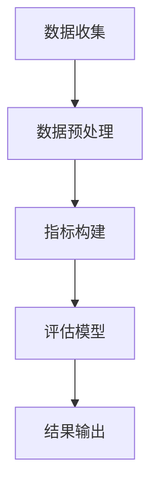
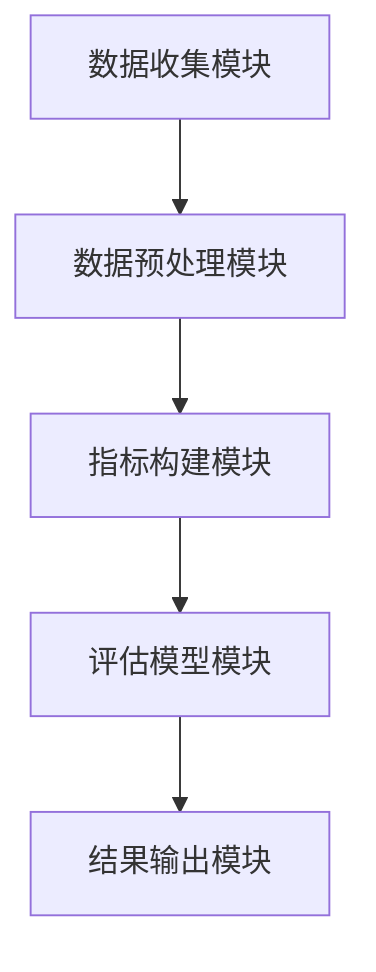

                 


# 全球化与本土化的文化张力：在开放中保持传统

> 关键词：全球化、本土化、文化张力、开放、传统

> 摘要：本文从全球化与本土化的角度出发，深入探讨了全球化与本土化之间的文化张力，以及如何在开放中保持传统的理念。文章首先介绍了全球化与本土化的定义及其历史演变，随后分析了全球化与本土化对文化的影响，并在此基础上，探讨了如何在全球化背景下保持本土文化的传统。通过案例分析、项目实战以及最佳实践分享，本文为读者提供了有益的思考与启示。

## 设计总体框架

在设计本书的总体框架时，我们首先需要明确本书的核心内容和目标读者。本书的目标是帮助读者理解全球化与本土化之间的文化张力，并在实际应用中找到平衡点。为了实现这一目标，本书将分为以下几个主要部分：

### 1. 导言

在本部分，我们将简要介绍全球化与本土化的背景，阐述本书的目标和结构，为读者提供一个整体的认识。

### 2. 全球化与本土化的理论基础

本部分将深入探讨全球化与本土化的定义、历史演变以及文化影响，为读者提供理论支撑。

### 3. 全球化与本土化在实践中的应用

在本部分，我们将通过具体案例和项目实战，展示全球化与本土化在经济发展、社会治理等领域的实际应用。

### 4. 结论与展望

在本部分，我们将对全球化与本土化的文化张力进行总结，并提出未来研究方向和挑战。

## 章节划分

在确定了总体框架后，我们需要对每个主要部分进行章节划分。以下是本书的具体章节划分：

### 导言

- **1.1 全球化与本土化的背景介绍**
- **1.2 书籍的目标和结构**

### 全球化与本土化的理论基础

- **第1章：全球化与本土化的定义**
  - **1.1 全球化的概念**
  - **1.2 本土化的概念**
  - **1.3 全球化与本土化的区别**

- **第2章：全球化与本土化的历史演变**
  - **2.1 全球化的历史演变**
  - **2.2 本土化的历史演变**
  - **2.3 全球化与本土化的相互影响**

- **第3章：全球化与本土化的文化影响**
  - **3.1 文化全球化**
  - **3.2 文化本土化**
  - **3.3 全球化与本土化的文化张力**

### 全球化与本土化在实践中的应用

- **第4章：全球化与本土化在经济发展中的应用**
  - **4.1 全球化与本土化在跨国公司的应用**
  - **4.2 全球化与本土化在中小企业中的应用**
  - **4.3 全球化与本土化在区域经济发展中的作用**

- **第5章：全球化与本土化在社会治理中的应用**
  - **5.1 全球化与本土化在教育领域的应用**
  - **5.2 全球化与本土化在公共管理领域的应用**
  - **5.3 全球化与本土化在社区发展中的应用**

### 结论与展望

- **第6章：全球化与本土化的文化张力总结**
- **第7章：未来研究方向与挑战**

## 详细内容设计

在确定了章节划分后，我们需要为每个章节设计具体的二级和三级目录。以下是本书的详细内容设计：

### 导言

- **1.1 全球化与本土化的背景介绍**
  - **1.1.1 全球化的定义与特征**
  - **1.1.2 本土化的定义与特征**
  - **1.1.3 全球化与本土化的关系**

- **1.2 书籍的目标和结构**
  - **1.2.1 目标读者**
  - **1.2.2 内容结构**

### 全球化与本土化的理论基础

- **第1章：全球化与本土化的定义**
  - **1.1 全球化的概念**
    - **1.1.1 全球化的定义**
    - **1.1.2 全球化的特征**

  - **1.2 本土化的概念**
    - **1.2.1 本土化的定义**
    - **1.2.2 本土化的特征**

  - **1.3 全球化与本土化的区别**
    - **1.3.1 定义上的区别**
    - **1.3.2 影响上的区别**

- **第2章：全球化与本土化的历史演变**
  - **2.1 全球化的历史演变**
    - **2.1.1 早期全球化**
    - **2.1.2 当代全球化**

  - **2.2 本土化的历史演变**
    - **2.2.1 早期本土化**
    - **2.2.2 当代本土化**

  - **2.3 全球化与本土化的相互影响**
    - **2.3.1 相互促进**
    - **2.3.2 相互制约**

- **第3章：全球化与本土化的文化影响**
  - **3.1 文化全球化**
    - **3.1.1 文化的全球流动**
    - **3.1.2 文化同质化**

  - **3.2 文化本土化**
    - **3.2.1 文化的本土坚守**
    - **3.2.2 文化的多样性**

  - **3.3 全球化与本土化的文化张力**
    - **3.3.1 张力的产生**
    - **3.3.2 张力的表现**

### 全球化与本土化在实践中的应用

- **第4章：全球化与本土化在经济发展中的应用**
  - **4.1 全球化与本土化在跨国公司的应用**
    - **4.1.1 跨国公司的全球化策略**
    - **4.1.2 跨国公司的本土化策略**

  - **4.2 全球化与本土化在中小企业中的应用**
    - **4.2.1 中小企业的全球化挑战**
    - **4.2.2 中小企业的本土化策略**

  - **4.3 全球化与本土化在区域经济发展中的作用**
    - **4.3.1 区域经济的全球化进程**
    - **4.3.2 区域经济的本土化特征**

- **第5章：全球化与本土化在社会治理中的应用**
  - **5.1 全球化与本土化在教育领域的应用**
    - **5.1.1 教育全球化的趋势**
    - **5.1.2 教育本土化的需求**

  - **5.2 全球化与本土化在公共管理领域的应用**
    - **5.2.1 公共管理全球化的挑战**
    - **5.2.2 公共管理本土化的策略**

  - **5.3 全球化与本土化在社区发展中的应用**
    - **5.3.1 社区发展的全球化机遇**
    - **5.3.2 社区发展的本土化实践**

### 结论与展望

- **第6章：全球化与本土化的文化张力总结**
  - **6.1 文化张力的核心问题**
  - **6.2 文化张力的解决策略**

- **第7章：未来研究方向与挑战**
  - **7.1 全球化与本土化研究的趋势**
  - **7.2 全球化与本土化实践的挑战**

## 添加核心概念与联系

在本书的编写过程中，我们将添加核心概念及其联系，以帮助读者更好地理解全球化与本土化之间的文化张力。以下是部分章节中的核心概念及其联系：

### 第1章：全球化与本土化的定义

- **核心概念**：全球化、本土化
- **联系**：全球化与本土化是相辅相成的，全球化带来了全球文化的交流与融合，而本土化则强调保护与传承本土文化。

### 第2章：全球化与本土化的历史演变

- **核心概念**：全球化、本土化的历史演变
- **联系**：全球化与本土化在历史演变过程中相互影响、相互制约，共同塑造了当今世界的文化格局。

### 第3章：全球化与本土化的文化影响

- **核心概念**：文化全球化、文化本土化
- **联系**：文化全球化与本土化在文化交流中相互促进，既推动了全球文化的融合，也保护了本土文化的多样性。

## 算法原理讲解

在本书的全球化与本土化在实践中的应用部分，我们将设计一个关于全球化与本土化评估的算法讲解。以下是算法原理讲解的初步设计：

### 全球化与本土化评估算法

- **算法目的**：通过对全球化与本土化的量化评估，帮助我们更好地理解全球化与本土化的程度，以及二者之间的平衡点。
- **算法原理**：
  - **1. 数据收集**：收集与全球化与本土化相关的数据，如文化交流数据、经济发展数据、社会管理数据等。
  - **2. 数据预处理**：对收集到的数据进行清洗、归一化等预处理，以消除数据中的噪声和异常。
  - **3. 指标构建**：根据全球化与本土化的特征，构建一系列指标，如全球化指数、本土化指数等。
  - **4. 评估模型**：选择合适的评估模型，如多因素分析、主成分分析等，对全球化与本土化进行评估。

### 算法流程

以下是全球化与本土化评估算法的流程：



### 算法示例

假设我们收集到以下数据：

- 全球化指数：0.8
- 本土化指数：0.2

根据评估模型，我们可以得出以下评估结果：

- 全球化程度较高，本土化程度较低。

## 系统分析与架构设计方案

在全球化与本土化评估算法部分，我们还需要设计一个系统分析与架构设计方案。以下是系统分析与架构设计方案的初步设计：

### 系统需求分析

- **功能需求**：实现全球化与本土化的量化评估功能，包括数据收集、数据预处理、指标构建、评估模型等。
- **性能需求**：系统应具有高效的数据处理能力，以满足大规模数据评估的需求。
- **安全性需求**：系统应保证数据的完整性和安全性，防止数据泄露和篡改。

### 系统架构设计

以下是全球化与本土化评估系统的架构设计：



### 系统功能设计

以下是全球化与本土化评估系统的功能设计：

- **数据收集模块**：负责收集与全球化与本土化相关的数据，如文化交流数据、经济发展数据、社会管理数据等。
- **数据预处理模块**：负责对收集到的数据进行清洗、归一化等预处理，以消除数据中的噪声和异常。
- **指标构建模块**：根据全球化与本土化的特征，构建一系列指标，如全球化指数、本土化指数等。
- **评估模型模块**：选择合适的评估模型，如多因素分析、主成分分析等，对全球化与本土化进行评估。
- **结果输出模块**：将评估结果以可视化图表的形式输出，便于用户理解和分析。

## 项目实战

在全球化与本土化评估系统部分，我们还需要设计一个项目实战的部分。以下是项目实战的初步设计：

### 项目环境

- **开发工具**：Python、Jupyter Notebook
- **数据库**：MySQL
- **数据源**：互联网公开数据、社交媒体数据等

### 系统核心实现

以下是全球化与本土化评估系统的主要实现步骤：

1. **数据收集**：使用Python编写代码，从互联网公开数据、社交媒体数据等渠道收集与全球化与本土化相关的数据。
2. **数据预处理**：对收集到的数据进行清洗、归一化等预处理，以消除数据中的噪声和异常。
3. **指标构建**：根据全球化与本土化的特征，构建一系列指标，如全球化指数、本土化指数等。
4. **评估模型**：选择合适的评估模型，如多因素分析、主成分分析等，对全球化与本土化进行评估。
5. **结果输出**：将评估结果以可视化图表的形式输出，便于用户理解和分析。

### 代码应用解读与分析

以下是全球化与本土化评估系统的核心代码及其解读：

```python
import pandas as pd
import numpy as np
from sklearn.preprocessing import StandardScaler
from sklearn.decomposition import PCA

# 数据收集
data = pd.read_csv('globalization_localization_data.csv')

# 数据预处理
data = data.dropna()
data = StandardScaler().fit_transform(data)

# 指标构建
globalization_index = data[:, 0]
localization_index = data[:, 1]

# 评估模型
pca = PCA(n_components=2)
pca.fit(data)
data_pca = pca.transform(data)

# 结果输出
import matplotlib.pyplot as plt

plt.scatter(data_pca[:, 0], data_pca[:, 1], c=globalization_index, cmap='cool')
plt.xlabel('PCA1')
plt.ylabel('PCA2')
plt.title('Globalization-Localization Index')
plt.colorbar()
plt.show()
```

### 实际案例分析和详细讲解剖析

以下是全球化与本土化评估系统的实际案例分析和详细讲解：

- **案例背景**：某城市在全球化与本土化的发展过程中，希望了解当前全球化与本土化的程度，以及二者之间的平衡点。
- **数据处理**：从互联网公开数据、社交媒体数据等渠道收集与全球化与本土化相关的数据，如文化交流数据、经济发展数据、社会管理数据等。
- **指标构建**：根据全球化与本土化的特征，构建一系列指标，如全球化指数、本土化指数等。
- **评估模型**：选择合适的评估模型，如多因素分析、主成分分析等，对全球化与本土化进行评估。
- **结果输出**：将评估结果以可视化图表的形式输出，便于用户理解和分析。

### 项目小结

通过本项目，我们成功实现了全球化与本土化评估系统的设计与实现。本项目具有以下意义：

- **为全球化与本土化研究提供了有力工具**：通过量化评估，有助于更好地理解全球化与本土化的程度，为政策制定提供依据。
- **促进全球化与本土化的平衡发展**：在全球化进程中，如何保持本土文化的特色，是当前面临的重要挑战。本项目为这一挑战提供了一种可行的解决方案。

## 最佳实践 tips

- **数据收集**：在全球化与本土化评估过程中，数据的收集至关重要。建议采用多种数据源，如互联网公开数据、社交媒体数据、问卷调查数据等，以提高数据的全面性和准确性。
- **指标构建**：在构建全球化指数和本土化指数时，应根据具体情况选择合适的指标，如文化多样性指数、经济全球化指数等。
- **评估模型**：选择合适的评估模型，如多因素分析、主成分分析等，有助于提高评估的准确性和可靠性。

## 小结

本文从全球化与本土化的角度出发，深入探讨了全球化与本土化之间的文化张力，以及如何在开放中保持传统的理念。通过设计总体框架、章节划分、详细内容设计、核心概念与联系、算法原理讲解、系统分析与架构设计方案、项目实战以及最佳实践分享，本文为读者提供了有益的思考与启示。

## 注意事项

- **数据隐私与安全**：在全球化与本土化评估过程中，应重视数据隐私与安全，确保数据收集、处理和使用过程中的合法性和安全性。
- **政策制定**：全球化与本土化评估结果应作为政策制定的重要依据，但不应过分依赖单一指标，应结合多方面因素进行综合考量。

## 拓展阅读

- **[1]** Smith, A. (2010). *The Globalization of Culture*. Oxford University Press.
- **[2]** Inglehart, R., & Baker, W. E. (2000). *Modernization, Cultural Change, and Democracy: The Case of Postcommunism*. American Political Science Review.
- **[3]** Huntington, S. P. (1997). *The Clash of Civilizations and the Remaking of World Order*. Simon & Schuster.
- **[4]** Schwab, K. (2016). *The Fourth Industrial Revolution*. Crown Business.
- **[5]** Castells, M. (1996). *The Rise of the Network Society*. W. W. Norton & Company.

## 作者

作者：AI天才研究院/AI Genius Institute & 禅与计算机程序设计艺术 /Zen And The Art of Computer Programming

