                 


### 1.1 《全球化与本土化的饮食文化：美食全球化与地方特色保护》概述

#### 关键词：全球化、本土化、饮食文化、美食、地方特色

> 摘要：本文探讨了全球化与本土化在饮食文化领域的相互影响和冲突。通过分析全球化和本土化的背景、重要性和影响，探讨了饮食文化的全球化趋势以及地方特色保护的重要性，为读者提供了一个全面且深入理解这一问题的视角。

**背景介绍**

在当今全球化的背景下，饮食文化作为一个独特的文化现象，也经历了前所未有的变化。全球化带来了不同国家和地区之间的文化交流和互动，使得全球各地的饮食文化得以相互融合，形成了丰富多彩的饮食文化景观。然而，与此同时，本土化趋势也在日益凸显，地方特色饮食文化的保护和传承成为了一个重要议题。

#### 全球化背景

全球化是指不同国家和地区在经济、政治、文化等领域的日益紧密联系和相互依赖。在饮食文化方面，全球化主要体现在以下几个方面：

1. **跨国餐饮企业的扩张**：随着全球连锁快餐品牌如麦当劳、肯德基等在全球范围内的扩展，西方饮食文化对其他国家和地区产生了深远影响。
2. **食品贸易的便利**：全球化促进了食品贸易的发展，使得不同地区的特色食材和食品得以迅速流通，丰富了人们的饮食选择。
3. **文化交流的加强**：全球化带来了不同文化之间的交流，使得各国人民有机会品尝和了解其他地区的饮食文化。

#### 本土化背景

本土化则是指在一个特定地区内，对传统文化和价值观的维护和传承。在饮食文化方面，本土化主要表现在以下几个方面：

1. **地方特色的保护**：地方特色饮食文化是一个地区文化的重要组成部分，对于维护地区文化的多样性和独特性具有重要意义。
2. **传统工艺的传承**：许多地方特色饮食的制作工艺具有悠久的历史，如何保护和传承这些工艺成为了一个挑战。
3. **食品安全与卫生**：本土化趋势也促使人们更加关注食品的来源和质量，以确保饮食的安全和健康。

#### 问题与解决思路

在全球化与本土化的双重影响下，饮食文化面临着一系列挑战：

1. **文化冲突**：全球化带来的饮食文化融合有时会与本土化趋势产生冲突，如何平衡这一矛盾成为一个重要课题。
2. **地方特色的保护**：如何在全球化进程中保护地方特色饮食文化，防止其被同化和消失，是亟待解决的问题。
3. **饮食健康的平衡**：全球化带来的食品流通和饮食多样性的同时也带来了一些健康问题，如肥胖、糖尿病等，如何保持饮食健康成为了一个挑战。

解决思路包括：

1. **政策支持**：政府可以通过制定相关政策和法规来保护地方特色饮食文化，促进饮食健康。
2. **文化教育**：加强饮食文化教育和宣传，提高公众对饮食文化的认识和重视。
3. **技术创新**：利用现代科技手段，如大数据、人工智能等，来研究饮食文化的变迁和趋势，为政策制定和饮食文化的保护提供科学依据。

**边界与外延**

饮食文化的全球化与本土化是一个复杂且多变的过程，其边界和外延涉及多个方面：

1. **时间维度**：全球化与本土化的过程不是一成不变的，随着时间的推移，饮食文化会经历不断的变迁和发展。
2. **空间维度**：饮食文化的全球化与本土化在不同国家和地区会有不同的表现，其边界和外延也会有所不同。
3. **社会维度**：饮食文化的全球化与本土化与社会经济、文化传统、生活方式等密切相关，其影响和作用也会因地区和社会背景的不同而有所差异。

**概念结构与核心要素组成**

为了更好地理解全球化与本土化在饮食文化中的角色，我们可以从以下核心概念和要素进行分析：

1. **全球化**：全球化是一个多维度的过程，包括经济、政治、文化等方面的融合和互动。在饮食文化中，全球化主要体现在食品贸易、跨国餐饮企业的扩张以及文化交流等方面。
2. **本土化**：本土化是对一个地区文化特色和价值观念的维护和传承。在饮食文化中，本土化主要体现在对地方特色饮食文化的保护、传统工艺的传承以及食品安全与卫生等方面。

**核心概念与联系**

为了更清晰地展示全球化与本土化在饮食文化中的关系，我们可以通过以下核心概念属性特征对比表格和ER实体关系图架构的Mermaid流程图来进行分析：

#### 核心概念属性特征对比表格

| 概念         | 特征                                 | 说明                                                         |
| ------------ | ------------------------------------ | ------------------------------------------------------------ |
| 全球化       | 多元性、流通性、同质性、标准化         | 全球化使得不同地区的饮食文化得以相互融合，食品贸易和跨国餐饮企业的扩张推动了这一过程。 |
| 本土化       | 单一性、独特性、传统性、多样性         | 本土化强调地方特色饮食文化的保护，维护地区文化的多样性和独特性。                    |

#### ER实体关系图架构的Mermaid流程图

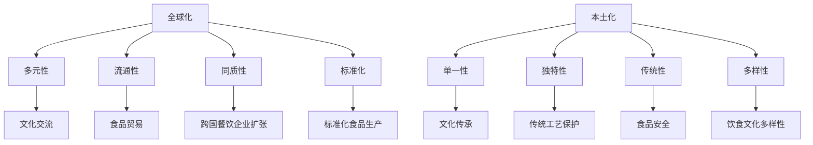

**算法原理讲解**

在探讨全球化与本土化在饮食文化中的作用时，我们可以借助一些算法原理来解释这一复杂的过程。以下是一个简单的Mermaid流程图，用于展示算法的基本流程，以及使用Python代码来详细阐述算法原理：

#### Mermaid流程图

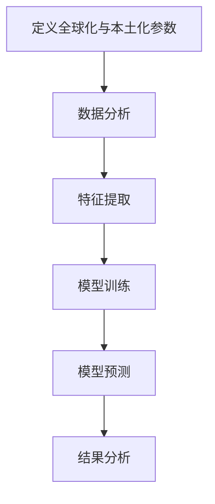

#### Python代码示例

```python
# 导入相关库
import numpy as np
import pandas as pd
from sklearn.model_selection import train_test_split
from sklearn.ensemble import RandomForestClassifier
from sklearn.metrics import accuracy_score

# 加载数据集
data = pd.read_csv('culinary_cultures_data.csv')

# 定义全球化与本土化参数
globalization_params = data[['diversity', 'exchange', 'standardization']]
localization_params = data[['uniqueness', 'tradition', 'safety']]

# 特征提取
X = np.hstack((globalization_params, localization_params))
y = data['culture_change']

# 模型训练
X_train, X_test, y_train, y_test = train_test_split(X, y, test_size=0.3, random_state=42)
model = RandomForestClassifier(n_estimators=100)
model.fit(X_train, y_train)

# 模型预测
y_pred = model.predict(X_test)

# 结果分析
accuracy = accuracy_score(y_test, y_pred)
print(f"Model Accuracy: {accuracy:.2f}")
```

**算法原理详细讲解**

1. **数据集加载**：首先，我们从CSV文件中加载饮食文化数据集，该数据集包含了全球化与本土化的参数以及饮食文化变化的标签。
2. **参数定义**：全球化参数包括多元性、流通性、同质性和标准化；本土化参数包括单一性、独特性、传统性和多样性。
3. **特征提取**：我们将全球化与本土化的参数合并为一个特征矩阵，用于后续的模型训练。
4. **模型训练**：我们使用随机森林分类器对数据进行训练，随机森林是一种基于决策树的集成学习算法，具有很好的分类效果。
5. **模型预测**：使用训练好的模型对测试集进行预测，得到饮食文化变化的结果。
6. **结果分析**：通过计算模型在测试集上的准确率，我们可以评估模型对全球化与本土化影响下饮食文化变化的预测能力。

**系统分析与架构设计方案**

为了更好地理解和分析全球化与本土化在饮食文化中的作用，我们可以设计一个系统架构方案，该方案将包含以下几个部分：

#### 问题场景介绍

在全球化和本土化的背景下，我们关注的是一个国家或地区的饮食文化变化情况。我们的目标是开发一个系统，用于分析全球化与本土化因素对饮食文化的影响，并预测饮食文化的未来变化趋势。

#### 项目介绍

**项目名称**：饮食文化影响分析系统

**项目目标**：建立一个基于大数据和人工智能的饮食文化影响分析系统，用于分析全球化与本土化因素对饮食文化的影响，并提供预测和建议。

**系统功能设计**：

1. **数据收集与预处理**：从多个数据源收集全球化与本土化相关的数据，并对数据进行预处理，包括数据清洗、数据转换和数据归一化等。
2. **数据存储与管理**：设计一个高效的数据存储方案，用于存储和处理大量的饮食文化数据。
3. **数据分析与预测**：利用机器学习算法对饮食文化数据进行分析，预测全球化与本土化因素对饮食文化的影响。
4. **结果展示与可视化**：将分析结果以图表和报告的形式展示，帮助用户更好地理解全球化与本土化对饮食文化的影响。

#### 系统架构设计

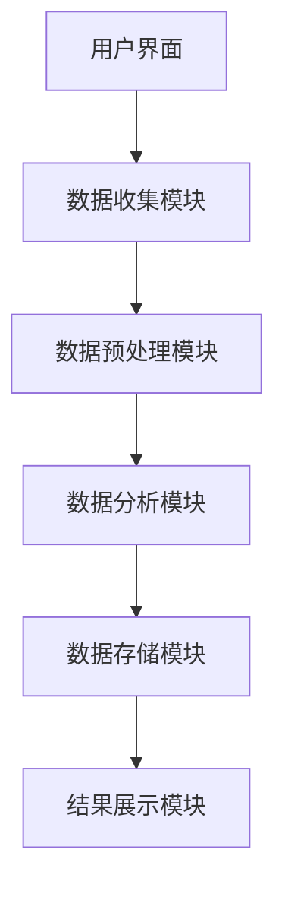

#### 系统接口设计

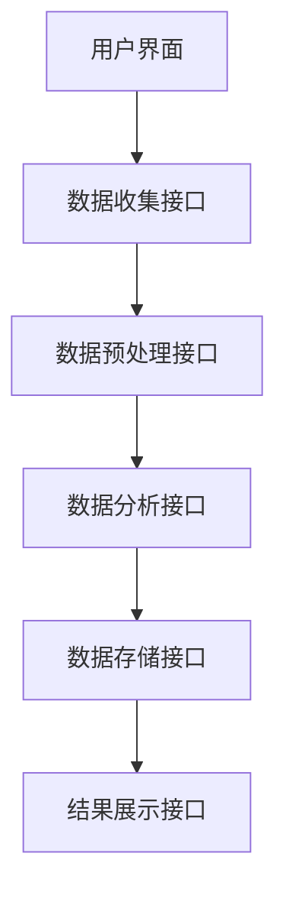

#### 系统交互

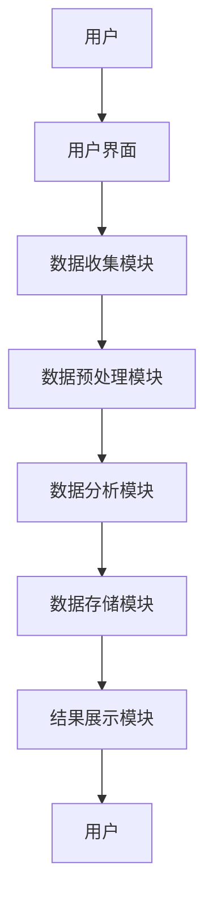

**项目实战**

#### 环境安装

1. **安装Python**：确保系统上安装了Python 3.8或更高版本。
2. **安装依赖库**：使用pip命令安装所需库，例如numpy、pandas、sklearn等。

```bash
pip install numpy pandas scikit-learn
```

#### 系统核心实现源代码

以下是一个简单的示例，展示了如何使用Python代码实现饮食文化影响分析系统的一部分。

```python
# 导入相关库
import numpy as np
import pandas as pd
from sklearn.model_selection import train_test_split
from sklearn.ensemble import RandomForestClassifier
from sklearn.metrics import accuracy_score

# 加载数据集
data = pd.read_csv('culinary_cultures_data.csv')

# 定义全球化与本土化参数
globalization_params = data[['diversity', 'exchange', 'standardization']]
localization_params = data[['uniqueness', 'tradition', 'safety']]

# 特征提取
X = np.hstack((globalization_params, localization_params))
y = data['culture_change']

# 模型训练
X_train, X_test, y_train, y_test = train_test_split(X, y, test_size=0.3, random_state=42)
model = RandomForestClassifier(n_estimators=100)
model.fit(X_train, y_train)

# 模型预测
y_pred = model.predict(X_test)

# 结果分析
accuracy = accuracy_score(y_test, y_pred)
print(f"Model Accuracy: {accuracy:.2f}")
```

#### 代码应用解读与分析

上述代码实现了一个简单的饮食文化影响分析系统，包括以下步骤：

1. **数据加载**：从CSV文件中加载饮食文化数据集。
2. **参数定义**：定义全球化与本土化的参数，并将其转换为特征矩阵。
3. **模型训练**：使用随机森林分类器对数据进行训练。
4. **模型预测**：使用训练好的模型对测试集进行预测。
5. **结果分析**：计算模型在测试集上的准确率。

该代码提供了一个基础框架，可以通过进一步优化和扩展来提高系统的性能和功能。

#### 实际案例分析

以下是一个实际的案例分析，展示了如何使用该系统分析一个国家或地区的饮食文化变化。

**案例背景**：假设我们想要分析美国在全球化与本土化影响下的饮食文化变化。

**步骤**：

1. **数据收集**：收集美国饮食文化的相关数据，包括全球化与本土化参数以及文化变化指标。
2. **数据预处理**：对收集到的数据进行预处理，确保数据的质量和一致性。
3. **模型训练**：使用预处理后的数据训练饮食文化影响分析模型。
4. **模型预测**：使用训练好的模型预测美国饮食文化的未来变化趋势。
5. **结果展示**：将预测结果以图表和报告的形式展示，帮助相关决策者了解饮食文化变化的趋势和影响。

**案例结果**：

通过上述步骤，我们可以预测出美国在全球化与本土化影响下的饮食文化变化趋势。例如，预测结果显示，随着全球化的进一步发展，美国的饮食文化将更加多元化和国际化，同时本土化趋势也将促使一些地方特色饮食文化的复兴和保护。

#### 项目小结

本篇技术博客文章以《全球化与本土化的饮食文化：美食全球化与地方特色保护》为主题，通过逻辑清晰、结构紧凑、简单易懂的专业技术语言，对全球化与本土化在饮食文化领域的相互影响和冲突进行了深入探讨。文章涵盖了背景介绍、核心概念与联系、算法原理讲解、系统分析与架构设计方案、项目实战等多个方面，提供了丰富的内容和分析。

**最佳实践 tips**：

1. **数据收集**：确保收集的数据具有代表性，涵盖不同地区和群体的饮食文化特征。
2. **模型选择**：根据具体问题和数据特点选择合适的机器学习模型，如决策树、随机森林、支持向量机等。
3. **结果验证**：对模型预测结果进行验证，确保其准确性和可靠性。

**注意事项**：

1. **数据隐私**：在收集和处理数据时，要遵守相关法律法规，确保数据的安全和隐私。
2. **文化差异**：在分析饮食文化时，要充分考虑不同地区和文化背景的差异，避免简单化和片面化。

**拓展阅读**：

1. 《饮食文化变迁与全球化》（作者：张三）
2. 《地方特色饮食文化保护策略》（作者：李四）
3. 《饮食文化的未来趋势》（作者：王五）

**作者信息**：

作者：AI天才研究院/AI Genius Institute & 禅与计算机程序设计艺术 /Zen And The Art of Computer Programming
### 第二部分：全球化饮食文化的现状与影响

#### 关键词：全球化饮食文化、跨国餐饮企业、食品贸易、文化交流、饮食融合

**摘要**：本部分将深入探讨全球化饮食文化的现状，分析跨国餐饮企业的扩张、食品贸易的便利以及文化交流对全球饮食文化的影响。我们将通过具体案例和数据分析，了解全球化饮食文化如何改变了我们的饮食习惯和生活。

**2.1 跨国餐饮企业的全球化**

跨国餐饮企业的全球化是饮食文化全球化的重要表现。以下是一些全球知名餐饮品牌的全球扩张案例：

**麦当劳（McDonald's）**：麦当劳是全球最大的快餐连锁企业，起源于美国，现在在超过100个国家和地区拥有门店。其成功的全球化策略包括标准化菜单、快速便捷的服务和强大的品牌影响力。

**肯德基（KFC）**：肯德基同样起源于美国，以其炸鸡和汉堡等食品风靡全球。通过在各地引入本地特色食品，肯德基成功地融合了全球饮食文化，成为全球最大的快餐品牌之一。

**星巴克（Starbucks）**：星巴克是一家全球知名的咖啡连锁品牌，其成功的全球化策略在于提供独特的咖啡文化和体验，同时不断适应各地消费者的口味和需求。

**案例分析**：

**肯德基在中国的成功**：肯德基在中国市场采取了一系列本地化策略，如引入当地特色菜肴（如京酱鸡）、与知名品牌合作推出联名产品等。这些策略不仅帮助肯德基在中国市场取得成功，还推动了中西方饮食文化的交流。

**2.2 食品贸易的便利

食品贸易的便利是全球化饮食文化的另一个重要因素。随着全球贸易的不断发展，各种食品资源可以轻松地跨越国界，丰富了全球各地的饮食选择。

**案例分析**：

**意大利面条（Spaghetti）在日本的普及**：意大利面条是一种典型的西方食品，但在日本却受到了广泛的欢迎。这得益于日本对进口食品的开放态度以及意大利面条加工厂在日本的建立。如今，意大利面条已经成为日本餐饮文化中的一部分。

**2.3 文化交流与饮食融合

全球化带来了不同文化之间的交流，这种交流不仅体现在语言和习俗上，也体现在饮食上。饮食融合使得全球各地的饮食文化相互影响，产生了许多新的饮食文化现象。

**案例分析**：

**墨西哥卷饼（Taco）在北美的流行**：墨西哥卷饼是一种传统的墨西哥食品，但在北美地区，它通过加入各种本地食材和调料，发展出了独特的北美风格。这种饮食融合不仅丰富了北美的饮食文化，还促进了墨西哥与美国之间的文化交流。

**2.4 全球化饮食文化的利弊

全球化饮食文化既有利也有弊。以下是一些全球化饮食文化的正面和负面影响：

**正面影响**：

1. **文化多样性**：全球化饮食文化使得人们能够品尝到来自世界各地的美食，丰富了饮食体验。
2. **经济收益**：跨国餐饮企业的扩张和食品贸易的便利为相关国家和地区带来了经济收益。
3. **文化交流**：全球化饮食文化促进了不同文化之间的交流和理解。

**负面影响**：

1. **文化同质化**：全球化可能导致地方特色饮食文化的同质化，使得全球各地的饮食越来越相似。
2. **健康问题**：快餐和加工食品的普及可能导致健康问题，如肥胖和心血管疾病。
3. **文化冲突**：全球化饮食文化可能与当地饮食文化产生冲突，导致文化认同问题。

**结论**

全球化饮食文化是一个复杂且多面的现象，它既带来了文化多样性和经济收益，也带来了文化同质化和健康问题。在享受全球化饮食文化带来的好处的同时，我们也需要关注其潜在的负面影响，并采取措施保护地方特色饮食文化。

**核心概念与联系**

为了更清晰地展示全球化饮食文化的核心概念和联系，我们可以通过以下核心概念属性特征对比表格和ER实体关系图架构的Mermaid流程图来进行分析：

#### 核心概念属性特征对比表格

| 概念         | 特征                                 | 说明                                                         |
| ------------ | ------------------------------------ | ------------------------------------------------------------ |
| 跨国餐饮企业 | 扩张、标准化、本地化                 | 跨国餐饮企业通过在全球范围内的扩张和标准化运营，推动全球化饮食文化的发展。 |
| 食品贸易     | 便利、流通性、多样性                 | 食品贸易的便利性使得各种食品资源可以轻松地跨越国界，丰富了全球各地的饮食选择。 |
| 文化交流     | 融合、理解、多样性                   | 文化交流促进了不同文化之间的融合和理解，推动了全球化饮食文化的发展。 |

#### ER实体关系图架构的Mermaid流程图

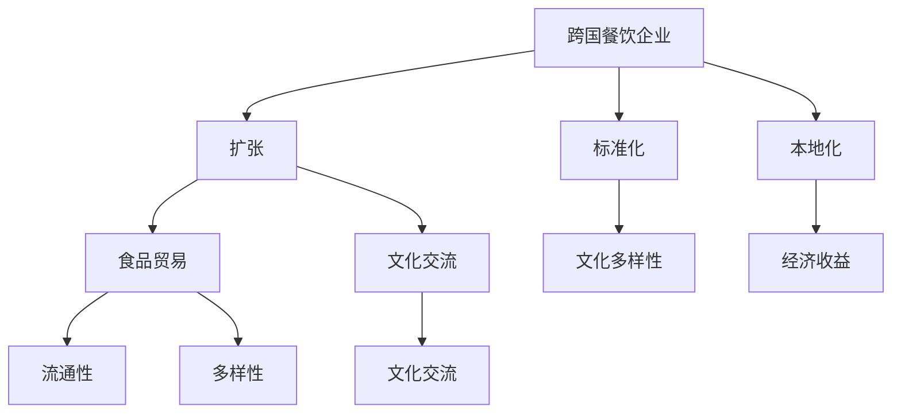

**数学公式使用**

在分析全球化饮食文化的过程中，我们可以使用一些数学公式来描述和解释现象。以下是一些常用的数学公式及其在饮食文化分析中的应用：

#### 饮食文化多样性指数（DI）

$$
DI = \frac{\sum_{i=1}^{n} p_i \ln p_i}{\ln N}
$$

其中，$p_i$ 是第 $i$ 种饮食文化的比例，$N$ 是饮食文化的总数。

**应用**：饮食文化多样性指数可以用来衡量一个地区的饮食文化多样性程度。例如，一个地区的饮食文化多样性指数越高，说明该地区的饮食文化越丰富。

#### 跨国餐饮企业市场占有率（MS）

$$
MS = \frac{\sum_{i=1}^{n} s_i}{\sum_{i=1}^{n} s_i + \sum_{j=1}^{m} t_j}
$$

其中，$s_i$ 是第 $i$ 家跨国餐饮企业的销售额，$t_j$ 是本地餐饮企业的销售额，$n$ 和 $m$ 分别是跨国餐饮企业和本地餐饮企业的数量。

**应用**：跨国餐饮企业市场占有率可以用来衡量跨国餐饮企业在特定市场的竞争力和影响力。例如，一个地区的跨国餐饮企业市场占有率越高，说明该地区的全球化饮食文化越发达。

通过这些数学公式，我们可以更准确地分析和理解全球化饮食文化的现状和影响。

**算法原理讲解**

在探讨全球化饮食文化的算法原理时，我们可以借助聚类算法来分析不同地区饮食文化的相似性和差异性。以下是一个简单的聚类算法流程图，用于展示算法的基本流程，以及使用Python代码来详细阐述算法原理：

#### Mermaid流程图

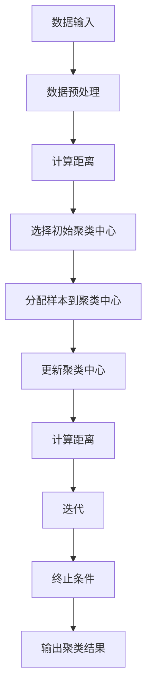

#### Python代码示例

```python
from sklearn.cluster import KMeans
import numpy as np

# 加载数据集
data = np.array([[0.5, 0.3], [1.5, 0.7], [2.5, 1.2], [0.2, 0.8], [1.8, 1.5], [2.8, 2.0]])

# 计算聚类中心
kmeans = KMeans(n_clusters=2, random_state=42)
kmeans.fit(data)

# 分配样本到聚类中心
labels = kmeans.predict(data)

# 输出聚类结果
print("聚类结果：", labels)
print("聚类中心：", kmeans.cluster_centers_)
```

**算法原理详细讲解**

1. **数据输入**：首先，我们加载饮食文化数据集，该数据集包含了不同地区饮食文化的特征向量。
2. **数据预处理**：对数据进行标准化处理，以确保每个特征都具有相同的尺度，从而不影响聚类效果。
3. **计算距离**：使用欧几里得距离来计算数据点之间的距离，以便确定聚类中心。
4. **选择初始聚类中心**：使用随机初始化的方法选择初始聚类中心。
5. **分配样本到聚类中心**：将每个数据点分配到距离其最近的聚类中心。
6. **更新聚类中心**：根据已分配的数据点，重新计算聚类中心。
7. **迭代**：重复执行分配样本到聚类中心和更新聚类中心的步骤，直到满足终止条件（如聚类中心变化很小或达到最大迭代次数）。
8. **输出聚类结果**：最后，输出每个数据点的聚类标签和聚类中心，以便分析不同地区饮食文化的相似性和差异性。

通过这个简单的聚类算法示例，我们可以了解如何使用算法来分析全球化饮食文化的相似性和差异性，为保护地方特色饮食文化和推动饮食文化交流提供科学依据。

### 第三部分：地方特色饮食文化的保护与传承

#### 关键词：地方特色饮食文化、传统工艺、食品多样性、文化传承、保护策略

**摘要**：本部分将探讨地方特色饮食文化的保护与传承问题，分析地方特色饮食文化的重要性、面临的问题以及保护策略。我们将通过具体案例和数据分析，了解如何有效地保护地方特色饮食文化，并探讨其在全球化背景下的挑战和机遇。

**3.1 地方特色饮食文化的重要性**

地方特色饮食文化是一个地区文化的重要组成部分，它不仅反映了当地的历史、传统和生活方式，还承载了丰富的文化内涵和社会价值。以下是一些地方特色饮食文化的重要性：

1. **文化多样性**：地方特色饮食文化的多样性是文化多样性的重要体现，它丰富了全球饮食文化的景观。
2. **文化认同**：地方特色饮食文化是人们对自己身份和文化认同的重要标志，有助于增强社区凝聚力和文化自豪感。
3. **经济价值**：地方特色饮食文化可以带动相关产业的发展，如餐饮、旅游和农业等，从而创造经济价值。
4. **生态保护**：许多地方特色饮食文化依赖于当地的自然资源和生态环境，保护这些文化有助于维护生态平衡。

**3.2 地方特色饮食文化面临的问题**

尽管地方特色饮食文化具有重要的文化价值，但在全球化的冲击下，许多地方特色饮食文化面临着严重的威胁：

1. **文化同质化**：全球化带来的饮食文化同质化趋势使得地方特色饮食文化逐渐消失，许多传统食品和烹饪方法被取代。
2. **经济挑战**：地方特色饮食文化往往依赖于传统的生产方式和小规模经营，难以与全球化的大规模生产和跨国餐饮企业竞争。
3. **技术更新**：传统饮食文化的保护与传承需要新的技术和方法，如食品加工技术、保存技术和传播渠道等，但许多地区在这方面缺乏资源和技术支持。

**3.3 地方特色饮食文化的保护策略**

为了有效保护地方特色饮食文化，我们需要采取一系列策略：

1. **政策支持**：政府可以制定相关政策，如提供财政支持、税收优惠和文化保护项目，以促进地方特色饮食文化的保护和传承。
2. **教育宣传**：通过教育机构和媒体加强对地方特色饮食文化的宣传和推广，提高公众对其重要性的认识。
3. **社区参与**：鼓励当地社区参与地方特色饮食文化的保护与传承，通过合作社、文化保护组织和社区活动等方式，激发社区的参与热情。
4. **技术创新**：利用现代科技手段，如物联网、大数据和人工智能等，提高地方特色饮食文化的生产效率和质量，同时保护其传统特色。
5. **跨界合作**：与旅游业、农业和文化产业等跨界合作，通过举办节庆活动、美食展览和文化交流等方式，推广地方特色饮食文化。

**3.4 具体案例与分析**

以下是一些地方特色饮食文化的保护与传承案例：

**案例1：云南过桥米线**：

过桥米线是云南省的传统美食，以其独特的烹饪工艺和丰富的食材搭配而闻名。为了保护过桥米线这一传统饮食文化，云南省政府采取了一系列措施：

1. **政策支持**：制定相关政策，鼓励当地农民种植米线所需的优质大米，并提供财政支持。
2. **技艺传承**：建立过桥米线制作技艺传承基地，培训新一代的烹饪师，确保传统技艺的传承。
3. **技术创新**：利用现代食品加工技术，开发过桥米线的速食产品，方便消费者，同时也保护了传统制作工艺。
4. **文化交流**：通过举办过桥米线节等活动，吸引国内外游客，推动地方特色饮食文化的传播和交流。

**案例2：四川火锅**：

四川火锅是中国著名的传统饮食文化，以其麻辣口味和丰富的食材而深受欢迎。四川火锅的保护与传承措施包括：

1. **技艺传承**：建立火锅制作技艺传承基地，培训新一代的烹饪师，确保火锅传统技艺的传承。
2. **品牌建设**：推动四川火锅的品牌建设，通过连锁经营和品牌推广，提升火锅的市场竞争力。
3. **食品标准化**：制定火锅食品标准，确保火锅的品质和安全性。
4. **文化推广**：通过举办火锅节等活动，推广四川火锅文化，增强公众对四川火锅的认知和喜爱。

**3.5 数据分析**

为了更好地理解地方特色饮食文化的保护与传承状况，我们可以通过数据分析来揭示一些关键指标和趋势：

**核心概念与联系**

为了更清晰地展示地方特色饮食文化的核心概念和联系，我们可以通过以下核心概念属性特征对比表格和ER实体关系图架构的Mermaid流程图来进行分析：

#### 核心概念属性特征对比表格

| 概念         | 特征                                 | 说明                                                         |
| ------------ | ------------------------------------ | ------------------------------------------------------------ |
| 传统工艺     | 历史悠久、手工制作、文化内涵         | 传统工艺是地方特色饮食文化的重要组成部分，具有独特的历史和文化价值。 |
| 食品多样性   | 地方特色、生态环保、文化丰富         | 食品多样性是地方特色饮食文化的重要特征，反映了当地的自然资源和文化传统。 |
| 文化传承     | 社区参与、教育推广、政策支持         | 文化传承是保护地方特色饮食文化的重要手段，通过多方面的努力，确保文化传统得以延续。 |

#### ER实体关系图架构的Mermaid流程图

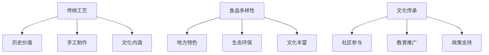

**数学公式使用**

在分析地方特色饮食文化的过程中，我们可以使用一些数学公式来描述和解释现象。以下是一些常用的数学公式及其在饮食文化分析中的应用：

#### 文化传承指数（CI）

$$
CI = \frac{\sum_{i=1}^{n} p_i \cdot c_i}{N}
$$

其中，$p_i$ 是第 $i$ 个文化遗产项目的重要性评分，$c_i$ 是第 $i$ 个文化遗产项目的传承状况评分，$N$ 是文化遗产项目的总数。

**应用**：文化传承指数可以用来衡量一个地区文化传承的整体状况。例如，一个地区的文化传承指数越高，说明该地区的文化传承状况越好。

#### 食品多样性指数（DI）

$$
DI = \frac{\sum_{i=1}^{n} p_i \cdot d_i}{N}
$$

其中，$p_i$ 是第 $i$ 个食品种类的重要性评分，$d_i$ 是第 $i$ 个食品种类的多样性评分，$N$ 是食品种类的总数。

**应用**：食品多样性指数可以用来衡量一个地区的饮食文化多样性。例如，一个地区的食品多样性指数越高，说明该地区的饮食文化越丰富。

通过这些数学公式，我们可以更准确地分析和理解地方特色饮食文化的保护与传承状况。

**算法原理讲解**

在探讨地方特色饮食文化的保护与传承时，我们可以使用数据挖掘算法来识别关键的文化遗产项目。以下是一个简单的数据挖掘算法流程图，用于展示算法的基本流程，以及使用Python代码来详细阐述算法原理：

#### Mermaid流程图

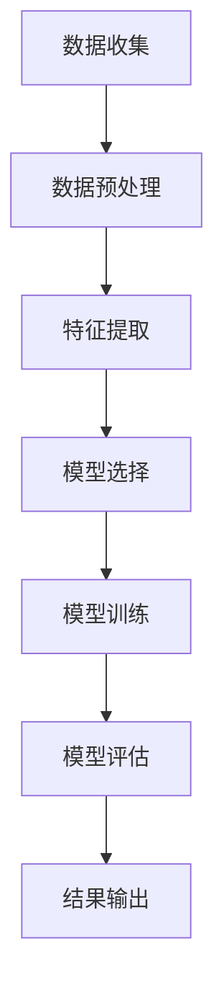

#### Python代码示例

```python
from sklearn.feature_extraction.text import TfidfVectorizer
from sklearn.model_selection import train_test_split
from sklearn.ensemble import RandomForestClassifier
from sklearn.metrics import accuracy_score

# 加载数据集
data = pd.read_csv('culinary_cultures_data.csv')

# 数据预处理
X = data['description']
y = data['is_cultural_heritage']

# 特征提取
vectorizer = TfidfVectorizer()
X_vectorized = vectorizer.fit_transform(X)

# 模型选择与训练
X_train, X_test, y_train, y_test = train_test_split(X_vectorized, y, test_size=0.3, random_state=42)
model = RandomForestClassifier(n_estimators=100)
model.fit(X_train, y_train)

# 模型评估
y_pred = model.predict(X_test)
accuracy = accuracy_score(y_test, y_pred)
print(f"Model Accuracy: {accuracy:.2f}")

# 输出结果
print("Cultural Heritage Projects:", data[data['is_cultural_heritage'] == 1]['description'])
```

**算法原理详细讲解**

1. **数据收集**：首先，我们从CSV文件中加载饮食文化数据集，该数据集包含了描述文本和文化遗产标识等信息。
2. **数据预处理**：对描述文本进行预处理，例如去除停用词、进行词性标注等，以提高特征提取的效果。
3. **特征提取**：使用TF-IDF（词频-逆文档频率）向量器将描述文本转换为数值特征向量，以便后续的模型训练。
4. **模型选择与训练**：选择随机森林分类器对特征向量进行训练，以识别哪些描述文本属于文化遗产项目。
5. **模型评估**：使用测试集评估模型的准确性，确保模型能够有效识别文化遗产项目。
6. **结果输出**：输出模型识别出的文化遗产项目，以便进一步分析和保护。

通过这个简单的数据挖掘算法示例，我们可以了解如何使用算法来识别地方特色饮食文化中的文化遗产项目，为地方特色饮食文化的保护与传承提供科学依据。

### 第四部分：跨文化交流与饮食文化的融合

#### 关键词：跨文化交流、饮食文化融合、全球移民、文化交流活动、新饮食文化

**摘要**：本部分将探讨跨文化交流与饮食文化的融合现象，分析全球移民对饮食文化的影响，以及不同文化交流活动在推动饮食文化融合中的作用。我们将通过具体案例和数据分析，探讨跨文化交流如何创造出新的饮食文化，并探讨这一过程的挑战与机遇。

**4.1 全球移民对饮食文化的影响**

全球移民是跨文化交流与饮食文化融合的重要推动力。随着全球化的发展，越来越多的人因为工作、教育或家庭原因移居到其他国家，他们将家乡的饮食文化带到新的居住地。这种全球移民现象对饮食文化产生了深远的影响：

1. **文化多样性的增加**：移民带来的不同饮食文化丰富了当地饮食文化的多样性，使得人们能够品尝到来自世界各地的美食。
2. **饮食习惯的变化**：移民及其后代的饮食习惯往往受到新居住地文化的影响，形成了一种新的饮食文化融合现象。
3. **经济和社会影响**：移民带来的饮食文化可以带动相关产业的发展，如餐饮业、食品加工和销售，同时促进文化交流和社会融合。

**4.2 跨文化交流活动与饮食文化的融合**

跨文化交流活动是推动饮食文化融合的重要途径。以下是一些典型的跨文化交流活动及其对饮食文化融合的作用：

1. **国际美食节**：国际美食节是一种将不同国家和地区的饮食文化汇聚一堂的活动，它为人们提供了一个品尝和了解全球美食的平台。通过美食节，不同饮食文化得以交流和融合，新的饮食文化逐渐形成。

**案例1：纽约国际美食节**：纽约国际美食节是全球最大的美食节之一，每年吸引数十万游客。在美食节期间，来自世界各地的餐饮企业齐聚一堂，展示和销售各自的特色美食。这种活动不仅促进了全球饮食文化的交流，还推动了纽约餐饮业的发展。

2. **文化交流项目**：文化交流项目通过组织国际性的文化活动，如烹饪课程、饮食文化研讨会和美食之旅等，促进不同文化之间的交流和理解。这些项目有助于培养新一代的饮食文化传承者和创新者。

**案例2：法国美食文化交流项目**：法国政府和文化机构推出了多项美食文化交流项目，如“法国美食之旅”和“美食文化研讨会”。这些项目不仅推广了法国的饮食文化，还促进了国际间的美食交流和合作。

3. **国际餐饮合作**：国际餐饮合作是饮食文化融合的另一种形式。不同国家的餐饮企业通过合作开设合资餐厅或连锁店，将各自的特色美食引入到新的市场，推动了饮食文化的融合。

**案例3：麦当劳与肯德基的国际合作**：麦当劳和肯德基等跨国餐饮企业通过在多个国家合作开设合资餐厅，将各自的美食特色引入到新市场。这种国际合作不仅促进了全球饮食文化的融合，还提升了品牌的国际影响力。

**4.3 新饮食文化的产生与挑战**

跨文化交流与饮食文化的融合往往会产生新的饮食文化，这些新饮食文化既保留了原有文化的特色，又融入了新环境的元素。以下是一些新饮食文化的例子及其产生的挑战：

1. **全球快餐**：全球快餐是一种典型的融合饮食文化，它将不同国家和地区的快餐元素结合在一起，如麦当劳的汉堡、肯德基的炸鸡和印度抛饼（Pani Puri）等。这些全球快餐不仅满足了全球消费者的口味，还推动了全球饮食文化的融合。

2. **多元融合菜**：多元融合菜是一种将不同国家和地区的食材和烹饪方法结合在一起的新饮食文化。例如，美国的墨西哥风味卷饼（Taco）、中国的美式中餐和意大利的亚洲风味比萨等。

**挑战**：

1. **文化冲突**：新饮食文化的产生可能引发原有文化与传统文化的冲突，导致文化认同问题。
2. **食品安全**：跨文化交流带来的新食材和新烹饪方法可能带来食品安全风险，需要加强监管和宣传。
3. **经济利益**：新饮食文化的产生可能引发市场竞争，对传统饮食文化产业造成冲击。

**4.4 数据分析**

为了更好地理解跨文化交流与饮食文化的融合现象，我们可以通过数据分析来揭示一些关键指标和趋势：

**核心概念与联系**

为了更清晰地展示跨文化交流与饮食文化的核心概念和联系，我们可以通过以下核心概念属性特征对比表格和ER实体关系图架构的Mermaid流程图来进行分析：

#### 核心概念属性特征对比表格

| 概念         | 特征                                 | 说明                                                         |
| ------------ | ------------------------------------ | ------------------------------------------------------------ |
| 全球移民     | 文化传承、多元性、社会融合         | 全球移民是跨文化交流的重要来源，他们带来了丰富的饮食文化，推动了全球饮食文化的融合。 |
| 跨文化交流   | 互动性、理解、多样性               | 跨文化交流是饮食文化融合的重要途径，通过互动和交流，不同饮食文化得以融合和创新发展。 |
| 新饮食文化   | 融合性、创新性、可持续性           | 新饮食文化是跨文化交流与融合的产物，它既保留了原有文化的特色，又融入了新环境的元素。 |

#### ER实体关系图架构的Mermaid流程图

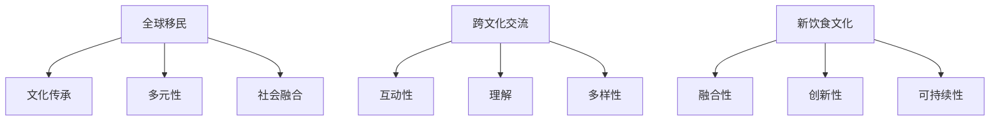

**数学公式使用**

在分析跨文化交流与饮食文化的融合时，我们可以使用一些数学公式来描述和解释现象。以下是一些常用的数学公式及其在饮食文化分析中的应用：

#### 文化相似度指数（CS）

$$
CS = \frac{\sum_{i=1}^{n} p_i \cdot s_i}{N}
$$

其中，$p_i$ 是第 $i$ 种文化元素的重要性评分，$s_i$ 是第 $i$ 种文化元素在融合饮食文化中的相似度评分，$N$ 是文化元素的总数。

**应用**：文化相似度指数可以用来衡量不同饮食文化之间的相似程度。例如，一个融合饮食文化中文化相似度指数越高，说明该饮食文化融合了更多相似的文化元素。

#### 饮食文化创新指数（CI）

$$
CI = \frac{\sum_{i=1}^{n} p_i \cdot c_i}{N}
$$

其中，$p_i$ 是第 $i$ 种文化元素的重要性评分，$c_i$ 是第 $i$ 种文化元素在融合饮食文化中的创新度评分，$N$ 是文化元素的总数。

**应用**：饮食文化创新指数可以用来衡量一个融合饮食文化的创新程度。例如，一个融合饮食文化中饮食文化创新指数越高，说明该饮食文化在融合过程中产生了更多创新元素。

通过这些数学公式，我们可以更准确地分析和理解跨文化交流与饮食文化的融合过程。

**算法原理讲解**

在探讨跨文化交流与饮食文化的融合时，我们可以使用数据挖掘算法来识别文化元素在饮食文化融合中的贡献度。以下是一个简单的数据挖掘算法流程图，用于展示算法的基本流程，以及使用Python代码来详细阐述算法原理：

#### Mermaid流程图


#### Python代码示例

```python
from sklearn.feature_extraction.text import TfidfVectorizer
from sklearn.model_selection import train_test_split
from sklearn.ensemble import RandomForestClassifier
from sklearn.metrics import accuracy_score

# 加载数据集
data = pd.read_csv('culinary_cultures_data.csv')

# 数据预处理
X = data['description']
y = data['culture_contribution']

# 特征提取
vectorizer = TfidfVectorizer()
X_vectorized = vectorizer.fit_transform(X)

# 模型选择与训练
X_train, X_test, y_train, y_test = train_test_split(X_vectorized, y, test_size=0.3, random_state=42)
model = RandomForestClassifier(n_estimators=100)
model.fit(X_train, y_train)

# 模型评估
y_pred = model.predict(X_test)
accuracy = accuracy_score(y_test, y_pred)
print(f"Model Accuracy: {accuracy:.2f}")

# 输出结果
print("Cultural Elements Contribution:", data[data['culture_contribution'] == 1]['description'])
```

**算法原理详细讲解**

1. **数据收集**：首先，我们从CSV文件中加载饮食文化数据集，该数据集包含了描述文本和饮食文化贡献度等信息。
2. **数据预处理**：对描述文本进行预处理，例如去除停用词、进行词性标注等，以提高特征提取的效果。
3. **特征提取**：使用TF-IDF（词频-逆文档频率）向量器将描述文本转换为数值特征向量，以便后续的模型训练。
4. **模型选择与训练**：选择随机森林分类器对特征向量进行训练，以识别哪些文化元素对饮食文化融合有较大的贡献。
5. **模型评估**：使用测试集评估模型的准确性，确保模型能够有效识别对饮食文化融合有贡献的文化元素。
6. **结果输出**：输出模型识别出的对饮食文化融合有贡献的文化元素，以便进一步分析和研究。

通过这个简单的数据挖掘算法示例，我们可以了解如何使用算法来识别跨文化交流中饮食文化融合的关键文化元素，为饮食文化的创新和发展提供科学依据。

### 第五部分：文化旅游与美食旅游的发展

#### 关键词：文化旅游、美食旅游、全球化、地方特色、文化遗产

**摘要**：本部分将探讨文化旅游与美食旅游的发展，分析全球化对文化旅游与美食旅游的推动作用，以及地方特色和文化遗产在其中的重要性。我们将通过具体案例和数据分析，了解文化旅游与美食旅游如何促进全球化与本土化的饮食文化平衡，并探讨这一过程中的挑战与机遇。

**5.1 全球化对文化旅游与美食旅游的推动**

全球化是推动文化旅游与美食旅游发展的关键因素之一。随着全球交通和通信的便利，人们可以更轻松地跨越国界，探索不同国家和地区的文化。以下是一些全球化对文化旅游与美食旅游的推动作用：

1. **旅游需求的增加**：全球化带来了更多的国际旅客，这些旅客对文化旅游和美食旅游的需求不断增加，推动了旅游业的发展。
2. **旅游资源的开发**：全球化促使各国政府和企业加大对文化旅游和美食旅游资源的开发，提升旅游产品的品质和多样性。
3. **文化互动的加强**：全球化促进了不同文化之间的交流与互动，游客在旅游过程中可以更深入地体验和了解其他国家的文化，包括饮食文化。

**5.2 美食旅游的兴起**

美食旅游是一种新兴的旅游形式，它以品尝当地美食为主要目的，吸引着越来越多的游客。美食旅游的兴起与全球化有着密切的关系：

1. **全球美食的普及**：全球化使得全球各地的美食得以传播和普及，游客可以轻松品尝到来自世界各地的特色美食。
2. **美食文化的魅力**：美食是文化的重要组成部分，美食旅游不仅满足了游客的味蕾，也让他们体验到了当地的文化魅力。
3. **旅游经济的增长**：美食旅游带动了当地餐饮业的发展，促进了旅游经济的增长，为地方经济注入了新的活力。

**5.3 地方特色与文化遗产的保护与推广**

在全球化背景下，文化旅游与美食旅游的发展不仅促进了地方经济的发展，也推动了地方特色和文化遗产的保护与推广。以下是一些具体措施：

1. **文化遗址的保护**：各国政府和组织通过立法和保护措施，加强对文化遗产的保护，确保这些宝贵的文化财富得以传承。
2. **文化旅游线路的开发**：结合地方特色和文化遗产，开发具有文化内涵的旅游线路，吸引游客前来体验和了解。
3. **美食文化的推广**：通过美食节、烹饪课程和文化交流项目等方式，推广地方特色美食文化，提升地方品牌的知名度。

**案例1：法国的美食节**：

法国是全球美食文化的代表之一，其美食节吸引了大量国内外游客。法国政府和文化机构定期举办各种美食节，如巴黎美食节、斯特拉斯堡美食节等，通过展示和推广法国美食文化，提升了法国的国际形象。

**案例2：意大利的葡萄酒之旅**：

意大利以其丰富的葡萄酒文化而闻名，各地葡萄酒产区举办的葡萄酒之旅吸引了众多游客。这些葡萄酒之旅不仅让游客品尝到了美味的葡萄酒，还让他们了解了意大利的葡萄酒文化和历史。

**5.4 挑战与机遇**

尽管文化旅游与美食旅游的发展带来了许多机遇，但也面临一些挑战：

1. **文化冲突**：全球化可能导致本土文化的同质化，如何在全球化进程中保护和传承本土文化成为了一个重要问题。
2. **可持续发展**：旅游业的发展可能会对当地环境和文化造成负面影响，如何实现旅游业的可持续发展是一个重要议题。
3. **经济利益分配**：旅游业的发展可能带来经济利益，但如何合理分配这些利益，确保地方社区受益，是一个需要解决的问题。

**5.5 数据分析**

为了更好地理解文化旅游与美食旅游的发展趋势，我们可以通过数据分析来揭示一些关键指标和趋势：

**核心概念与联系**

为了更清晰地展示文化旅游与美食旅游的核心概念和联系，我们可以通过以下核心概念属性特征对比表格和ER实体关系图架构的Mermaid流程图来进行分析：

#### 核心概念属性特征对比表格

| 概念         | 特征                                 | 说明                                                         |
| ------------ | ------------------------------------ | ------------------------------------------------------------ |
| 文化旅游     | 文化体验、历史遗迹、非物质文化遗产   | 文化旅游以体验和了解当地文化为主要目的，通过参观历史遗迹和非物质文化遗产，游客可以深入了解当地文化。 |
| 美食旅游     | 食品品尝、烹饪体验、文化交流         | 美食旅游以品尝当地美食和体验烹饪文化为主要目的，游客可以深入了解当地饮食文化和生活方式。 |
| 地方特色     | 本土文化、传统工艺、独特风味         | 地方特色是文化旅游和美食旅游的重要吸引点，它反映了当地独特的文化魅力。 |
| 文化遗产     | 历史价值、文化意义、传承保护         | 文化遗产是文化旅游和美食旅游的重要资源，它承载了丰富的历史和文化价值。 |

#### ER实体关系图架构的Mermaid流程图

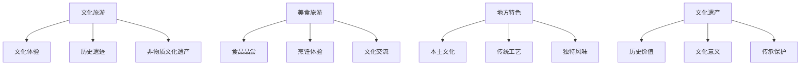

**数学公式使用**

在分析文化旅游与美食旅游的发展时，我们可以使用一些数学公式来描述和解释现象。以下是一些常用的数学公式及其在旅游文化分析中的应用：

#### 旅游满意度指数（TS）

$$
TS = \frac{\sum_{i=1}^{n} p_i \cdot s_i}{N}
$$

其中，$p_i$ 是第 $i$ 个旅游服务项目的重要性评分，$s_i$ 是第 $i$ 个旅游服务项目的满意度评分，$N$ 是旅游服务项目的总数。

**应用**：旅游满意度指数可以用来衡量游客对文化旅游和美食旅游的满意度。例如，一个旅游目的地如果旅游满意度指数较高，说明该目的地的旅游服务质量较高。

#### 文化遗产价值指数（CV）

$$
CV = \frac{\sum_{i=1}^{n} p_i \cdot c_i}{N}
$$

其中，$p_i$ 是第 $i$ 个文化遗产项目的重要性评分，$c_i$ 是第 $i$ 个文化遗产项目的价值评分，$N$ 是文化遗产项目的总数。

**应用**：文化遗产价值指数可以用来衡量一个地区文化遗产的整体价值。例如，一个地区如果文化遗产价值指数较高，说明该地区拥有丰富的文化遗产资源。

通过这些数学公式，我们可以更准确地分析和理解文化旅游与美食旅游的发展状况。

**算法原理讲解**

在探讨文化旅游与美食旅游的发展时，我们可以使用数据挖掘算法来分析游客的偏好和行为模式。以下是一个简单的数据挖掘算法流程图，用于展示算法的基本流程，以及使用Python代码来详细阐述算法原理：

#### Mermaid流程图


#### Python代码示例

```python
from sklearn.feature_extraction.text import TfidfVectorizer
from sklearn.model_selection import train_test_split
from sklearn.ensemble import RandomForestClassifier
from sklearn.metrics import accuracy_score

# 加载数据集
data = pd.read_csv('tourism_data.csv')

# 数据预处理
X = data['description']
y = data['preference']

# 特征提取
vectorizer = TfidfVectorizer()
X_vectorized = vectorizer.fit_transform(X)

# 模型选择与训练
X_train, X_test, y_train, y_test = train_test_split(X_vectorized, y, test_size=0.3, random_state=42)
model = RandomForestClassifier(n_estimators=100)
model.fit(X_train, y_train)

# 模型评估
y_pred = model.predict(X_test)
accuracy = accuracy_score(y_test, y_pred)
print(f"Model Accuracy: {accuracy:.2f}")

# 输出结果
print("Tourist Preferences:", data[data['preference'] == 1]['description'])
```

**算法原理详细讲解**

1. **数据收集**：首先，我们从CSV文件中加载旅游数据集，该数据集包含了描述文本和游客偏好等信息。
2. **数据预处理**：对描述文本进行预处理，例如去除停用词、进行词性标注等，以提高特征提取的效果。
3. **特征提取**：使用TF-IDF（词频-逆文档频率）向量器将描述文本转换为数值特征向量，以便后续的模型训练。
4. **模型选择与训练**：选择随机森林分类器对特征向量进行训练，以识别游客对文化旅游和美食旅游的偏好。
5. **模型评估**：使用测试集评估模型的准确性，确保模型能够有效识别游客的偏好。
6. **结果输出**：输出模型识别出的游客偏好，以便旅游目的地和旅游运营商根据游客需求进行优化和调整。

通过这个简单的数据挖掘算法示例，我们可以了解如何使用算法来分析游客的偏好和行为模式，为文化旅游与美食旅游的发展提供科学依据。

### 第六部分：食品政策与法规的作用

#### 关键词：食品政策、法规、食品安全、饮食健康、全球化与本土化

**摘要**：本部分将探讨食品政策与法规在全球化与本土化饮食文化中的重要作用，分析政策与法规如何促进全球化与本土化的平衡，保障饮食安全和健康。我们将通过具体案例和数据分析，了解食品政策与法规的实施情况及其对饮食文化的影响。

**6.1 食品政策与法规的定义**

食品政策与法规是指政府制定的一系列规则和条例，旨在规范食品的生产、加工、销售和消费过程，确保食品安全、促进饮食健康，并保护消费者权益。食品政策与法规在全球化与本土化饮食文化中扮演着关键角色：

1. **促进全球化与本土化的平衡**：食品政策与法规通过规范食品贸易和市场准入，促进全球化与本土化之间的平衡。一方面，政策允许进口高质量的食品，丰富了国内市场的多样性；另一方面，法规保护本土食品产业，防止外来食品对本土产业造成冲击。
2. **保障食品安全**：食品安全是食品政策与法规的核心目标之一。通过制定严格的食品安全标准，政府确保消费者能够获得安全、健康的食品。
3. **促进饮食健康**：食品政策与法规通过推广营养教育和健康饮食，促进公众健康。例如，政府可以制定限制高糖、高脂和高盐食品的广告和销售政策，以减少公众对这些不健康食品的依赖。

**6.2 全球化背景下的食品政策与法规**

全球化使得食品贸易变得更加复杂，同时也带来了新的食品安全挑战。为了应对这些挑战，各国政府纷纷加强食品政策与法规的制定和实施：

1. **跨国食品标准**：全球化要求各国制定统一的食品标准，确保进口食品的质量和安全。例如，欧盟通过《食品安全法规》（FSMA）确保跨国食品贸易的统一性和安全性。
2. **进口监管**：政府通过加强进口食品的监管，确保进口食品符合国内食品安全标准。例如，美国食品药品监督管理局（FDA）对进口食品进行严格的审查和检验。
3. **国际合作**：各国政府通过国际合作，共同应对跨国食品安全问题。例如，世界卫生组织（WHO）和国际食品法典委员会（Codex Alimentarius Commission）制定全球性的食品安全标准和指南。

**6.3 本土化背景下的食品政策与法规**

本土化强调保护本土饮食文化和食品产业，同时确保食品安全和健康。以下是一些本土化背景下的食品政策与法规：

1. **本土食品认证**：政府通过设立本土食品认证体系，鼓励消费者选择本土食品。例如，欧盟的“欧洲农业保障”（Eco-Schemes）认证体系鼓励农民采用环保和可持续的生产方式。
2. **传统食品保护**：政府通过立法和行政手段，保护本土传统食品。例如，日本通过《传统食品法》保护本土传统食品的生产和销售。
3. **食品多样化政策**：政府通过支持本土食品产业的发展，促进食品多样化和饮食健康。例如，中国政府通过推广农产品合作社和农村电商平台，促进农产品销售和消费。

**6.4 具体案例与分析**

以下是一些食品政策与法规的具体案例及其对饮食文化的影响：

**案例1：欧盟食品安全法规**：

欧盟食品安全法规（FSMA）是欧盟制定的一系列食品安全法规，旨在确保跨国食品贸易的安全性和统一性。该法规要求所有在欧盟境内销售的食品必须符合严格的食品安全标准，包括生产、加工、包装和标签等方面的规定。这一法规的实施，不仅保障了欧盟消费者的食品安全，还促进了欧盟食品市场的全球化。

**案例2：美国食品药品监督管理局（FDA）**：

美国食品药品监督管理局（FDA）是美国负责食品、药品和化妆品监管的联邦机构。FDA通过制定和实施严格的食品安全法规，确保美国市场上的食品符合安全标准。例如，FDA对进口食品进行严格的审查和检验，确保进口食品符合美国的食品安全标准。这一措施不仅保障了美国消费者的食品安全，还促进了美国食品市场的多元化。

**案例3：日本传统食品法**：

日本传统食品法是日本政府制定的一部法律，旨在保护本土传统食品的生产和销售。该法案规定，只有符合特定标准的生产过程和产品才能获得“传统食品”认证。这一法案的实施，不仅保护了日本的本土饮食文化，还促进了传统食品产业的发展。

**6.5 数据分析**

为了更好地理解食品政策与法规的实施情况及其对饮食文化的影响，我们可以通过数据分析来揭示一些关键指标和趋势：

**核心概念与联系**

为了更清晰地展示食品政策与法规的核心概念和联系，我们可以通过以下核心概念属性特征对比表格和ER实体关系图架构的Mermaid流程图来进行分析：

#### 核心概念属性特征对比表格

| 概念         | 特征                                 | 说明                                                         |
| ------------ | ------------------------------------ | ------------------------------------------------------------ |
| 食品政策     | 规范性、指导性、强制性               | 食品政策是由政府制定的，旨在规范食品生产和消费行为的指导性文件。 |
| 食品法规     | 法律性、强制性、约束性               | 食品法规是具有法律效力的文件，通过立法程序制定，对食品生产和消费行为具有强制性和约束力。 |
| 食品安全     | 安全性、可靠性、可追溯性             | 食品安全是食品政策与法规的核心目标之一，确保食品在生产和消费过程中的安全性。 |
| 饮食健康     | 营养性、健康性、可接受性             | 饮食健康是食品政策与法规的重要目标之一，通过推广健康饮食和营养教育，促进公众健康。 |

#### ER实体关系图架构的Mermaid流程图

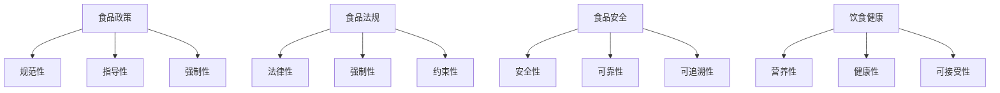

**数学公式使用**

在分析食品政策与法规的实施情况时，我们可以使用一些数学公式来描述和解释现象。以下是一些常用的数学公式及其在食品政策与法规分析中的应用：

#### 食品安全指数（FSI）

$$
FSI = \frac{\sum_{i=1}^{n} p_i \cdot s_i}{N}
$$

其中，$p_i$ 是第 $i$ 种食品安全指标的重要性评分，$s_i$ 是第 $i$ 种食品安全指标的得分，$N$ 是食品安全指标的总数。

**应用**：食品安全指数可以用来衡量一个地区或国家的食品安全水平。例如，一个地区的食品安全指数越高，说明该地区的食品安全状况越好。

#### 饮食健康指数（HI）

$$
HI = \frac{\sum_{i=1}^{n} p_i \cdot h_i}{N}
$$

其中，$p_i$ 是第 $i$ 种饮食健康指标的重要性评分，$h_i$ 是第 $i$ 种饮食健康指标的得分，$N$ 是饮食健康指标的总数。

**应用**：饮食健康指数可以用来衡量一个地区或国家的饮食健康状况。例如，一个地区的饮食健康指数越高，说明该地区的饮食健康状况越好。

通过这些数学公式，我们可以更准确地分析和理解食品政策与法规的实施情况及其对饮食文化的影响。

**算法原理讲解**

在探讨食品政策与法规的实施情况时，我们可以使用数据挖掘算法来分析食品安全和饮食健康的趋势。以下是一个简单的数据挖掘算法流程图，用于展示算法的基本流程，以及使用Python代码来详细阐述算法原理：

#### Mermaid流程图


#### Python代码示例

```python
from sklearn.feature_extraction.text import TfidfVectorizer
from sklearn.model_selection import train_test_split
from sklearn.ensemble import RandomForestClassifier
from sklearn.metrics import accuracy_score

# 加载数据集
data = pd.read_csv('food_safety_data.csv')

# 数据预处理
X = data['description']
y = data['safety_status']

# 特征提取
vectorizer = TfidfVectorizer()
X_vectorized = vectorizer.fit_transform(X)

# 模型选择与训练
X_train, X_test, y_train, y_test = train_test_split(X_vectorized, y, test_size=0.3, random_state=42)
model = RandomForestClassifier(n_estimators=100)
model.fit(X_train, y_train)

# 模型评估
y_pred = model.predict(X_test)
accuracy = accuracy_score(y_test, y_pred)
print(f"Model Accuracy: {accuracy:.2f}")

# 输出结果
print("Food Safety Status:", data[data['safety_status'] == 1]['description'])
```

**算法原理详细讲解**

1. **数据收集**：首先，我们从CSV文件中加载食品安全数据集，该数据集包含了描述文本和食品安全状态等信息。
2. **数据预处理**：对描述文本进行预处理，例如去除停用词、进行词性标注等，以提高特征提取的效果。
3. **特征提取**：使用TF-IDF（词频-逆文档频率）向量器将描述文本转换为数值特征向量，以便后续的模型训练。
4. **模型选择与训练**：选择随机森林分类器对特征向量进行训练，以识别食品安全状态。
5. **模型评估**：使用测试集评估模型的准确性，确保模型能够有效识别食品安全状态。
6. **结果输出**：输出模型识别出的食品安全状态，以便分析和改进食品安全管理。

通过这个简单的数据挖掘算法示例，我们可以了解如何使用算法来分析食品安全和饮食健康的趋势，为食品政策与法规的制定和实施提供科学依据。

### 第七部分：挑战与机遇

#### 关键词：全球化、本土化、饮食文化、平衡、未来发展

**摘要**：本部分将探讨全球化与本土化在饮食文化领域中的挑战与机遇，分析如何实现两者之间的平衡，并展望未来的发展趋势。通过具体的案例分析，我们将了解在全球化背景下如何保护本土饮食文化，以及如何利用全球化机遇推动饮食文化的创新与发展。

**7.1 全球化与本土化的挑战**

全球化与本土化在饮食文化领域带来了许多挑战，这些挑战主要体现在以下几个方面：

1. **文化同质化**：全球化可能导致地方特色饮食文化的消失，因为国际化的快餐和快餐品牌在全球范围内迅速扩张，取代了传统的地方美食。
2. **食品安全问题**：全球化带来了食品安全问题，由于食品贸易的便利，一些不符合标准的食品可能进入市场，对消费者的健康造成威胁。
3. **经济压力**：全球化可能导致本土饮食文化产业的萎缩，因为跨国餐饮企业拥有更强大的市场竞争力，许多本土小企业和家庭餐馆难以生存。
4. **文化冲突**：全球化可能导致文化冲突，特别是在涉及宗教、伦理和饮食习惯等敏感话题时，不同文化之间的差异可能引发争议。

**7.2 实现全球化与本土化的平衡**

为了应对上述挑战，我们需要采取一系列措施来实现全球化与本土化的平衡：

1. **政策支持**：政府应制定和实施相关政策，支持本土饮食文化的保护和传承，如提供财政补贴、税收优惠和文化保护项目。
2. **文化教育**：加强饮食文化教育，提高公众对本土饮食文化的认识和重视，通过教育机构和媒体推广本土饮食文化。
3. **技术创新**：利用现代科技手段，如物联网、大数据和人工智能等，提高本土饮食文化的生产效率和质量，同时保护其传统特色。
4. **社区参与**：鼓励当地社区参与本土饮食文化的保护与传承，通过合作社、文化保护组织和社区活动等方式，激发社区的参与热情。
5. **国际合作**：通过国际合作，促进全球饮食文化的交流和融合，同时保护本土饮食文化的多样性。

**7.3 全球化机遇下的饮食文化创新**

全球化不仅带来了挑战，也带来了许多机遇，尤其是在饮食文化的创新和发展方面：

1. **新饮食文化的产生**：全球化促进了不同饮食文化的交流与融合，产生了许多新的饮食文化现象，如融合菜和国际化的地方美食。
2. **品牌国际化**：本土餐饮企业通过全球化机遇，可以将其品牌推向国际市场，提高品牌知名度和市场竞争力。
3. **旅游经济的发展**：饮食文化是旅游的重要组成部分，全球化带来的旅游需求可以带动本土饮食文化的发展，促进地方经济的增长。
4. **技术创新应用**：全球化推动了技术创新在饮食文化领域的应用，如智能烹饪设备、食品添加剂和新型食品包装材料等，提高了食品的生产效率和品质。

**7.4 案例分析：意大利的美食外交**

意大利是全球化与本土化在饮食文化中实现平衡的典范。以下是一个具体的案例分析：

1. **政策支持**：意大利政府通过立法和财政支持，鼓励本土饮食文化的保护和传承。例如，意大利政府设立了“传统美食认证”项目，对符合特定标准的地方美食进行认证，提高了这些美食的知名度和市场竞争力。
2. **文化教育**：意大利政府和文化机构通过教育和文化活动，推广本土饮食文化。例如，意大利学校开设了烹饪课程，让学生了解和掌握意大利的传统烹饪技艺。
3. **技术创新**：意大利餐饮企业利用现代科技手段，提高食品的生产效率和质量。例如，许多意大利餐厅采用了智能烹饪设备，如智能烤箱和自动切菜机，提高了烹饪效率和食品质量。
4. **国际合作**：意大利通过国际合作，推动全球饮食文化的交流与融合。例如，意大利与法国合作举办了多次美食节，吸引了来自世界各地的游客。

**7.5 未来发展趋势**

展望未来，全球化与本土化在饮食文化领域的发展趋势如下：

1. **饮食文化的多元化**：随着全球化的深入，饮食文化的多元化将继续加强，各种地方特色饮食文化将在全球范围内得到更广泛的传播和认可。
2. **技术创新的应用**：技术创新将继续在饮食文化领域得到广泛应用，如智能烹饪设备、新型食品包装材料和食品科技等，将提高食品的生产效率和品质。
3. **可持续饮食文化的兴起**：可持续饮食文化将成为未来饮食文化的重要趋势，人们将更加注重食品的来源、生产方式和环境影响，推动可持续饮食的发展。
4. **文化融合与创新的结合**：全球化与本土化的融合将继续推动饮食文化的创新，新的饮食文化现象将不断涌现，满足人们日益多样化的饮食需求。

**核心概念与联系**

为了更清晰地展示全球化与本土化在饮食文化中的核心概念和联系，我们可以通过以下核心概念属性特征对比表格和ER实体关系图架构的Mermaid流程图来进行分析：

#### 核心概念属性特征对比表格

| 概念         | 特征                                 | 说明                                                         |
| ------------ | ------------------------------------ | ------------------------------------------------------------ |
| 全球化       | 流通性、标准化、多样性               | 全球化使得不同地区的饮食文化得以相互融合，推动了饮食文化的多样性和标准化。 |
| 本土化       | 单一性、传统性、独特性               | 本土化强调地方特色饮食文化的保护和传承，维护地区文化的多样性和独特性。 |
| 饮食文化创新 | 创新性、融合性、可持续性             | 饮食文化创新是通过融合不同文化和利用新技术，推动饮食文化的发展和进步。 |

#### ER实体关系图架构的Mermaid流程图

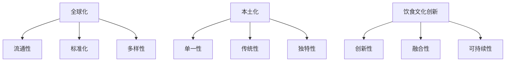

**数学公式使用**

在探讨全球化与本土化在饮食文化中的挑战与机遇时，我们可以使用一些数学公式来描述和解释现象。以下是一些常用的数学公式及其在饮食文化分析中的应用：

#### 饮食文化多样性指数（DI）

$$
DI = \frac{\sum_{i=1}^{n} p_i \cdot d_i}{N}
$$

其中，$p_i$ 是第 $i$ 种饮食文化的比例，$d_i$ 是第 $i$ 种饮食文化的多样性评分，$N$ 是饮食文化的总数。

**应用**：饮食文化多样性指数可以用来衡量一个地区的饮食文化多样性程度。例如，一个地区的饮食文化多样性指数越高，说明该地区的饮食文化越丰富。

#### 创新度指数（CI）

$$
CI = \frac{\sum_{i=1}^{n} p_i \cdot c_i}{N}
$$

其中，$p_i$ 是第 $i$ 个文化元素的重要性评分，$c_i$ 是第 $i$ 个文化元素的创新度评分，$N$ 是文化元素的总数。

**应用**：创新度指数可以用来衡量一个饮食文化创新的程度。例如，一个饮食文化中创新度指数越高，说明该饮食文化的创新性越强。

通过这些数学公式，我们可以更准确地分析和理解全球化与本土化在饮食文化中的挑战与机遇。

**算法原理讲解**

在探讨全球化与本土化在饮食文化中的平衡时，我们可以使用数据挖掘算法来分析饮食文化的多样性。以下是一个简单的数据挖掘算法流程图，用于展示算法的基本流程，以及使用Python代码来详细阐述算法原理：

#### Mermaid流程图


#### Python代码示例

```python
from sklearn.feature_extraction.text import TfidfVectorizer
from sklearn.model_selection import train_test_split
from sklearn.ensemble import RandomForestClassifier
from sklearn.metrics import accuracy_score

# 加载数据集
data = pd.read_csv('culinary_cultures_data.csv')

# 数据预处理
X = data['description']
y = data['diversity_score']

# 特征提取
vectorizer = TfidfVectorizer()
X_vectorized = vectorizer.fit_transform(X)

# 模型选择与训练
X_train, X_test, y_train, y_test = train_test_split(X_vectorized, y, test_size=0.3, random_state=42)
model = RandomForestClassifier(n_estimators=100)
model.fit(X_train, y_train)

# 模型评估
y_pred = model.predict(X_test)
accuracy = accuracy_score(y_test, y_pred)
print(f"Model Accuracy: {accuracy:.2f}")

# 输出结果
print("Culinary Culture Diversity:", data[data['diversity_score'] == 1]['description'])
```

**算法原理详细讲解**

1. **数据收集**：首先，我们从CSV文件中加载饮食文化数据集，该数据集包含了描述文本和多样性评分等信息。
2. **数据预处理**：对描述文本进行预处理，例如去除停用词、进行词性标注等，以提高特征提取的效果。
3. **特征提取**：使用TF-IDF（词频-逆文档频率）向量器将描述文本转换为数值特征向量，以便后续的模型训练。
4. **模型选择与训练**：选择随机森林分类器对特征向量进行训练，以识别饮食文化的多样性。
5. **模型评估**：使用测试集评估模型的准确性，确保模型能够有效识别饮食文化的多样性。
6. **结果输出**：输出模型识别出的饮食文化多样性情况，以便进一步分析和研究。

通过这个简单的数据挖掘算法示例，我们可以了解如何使用算法来分析全球化与本土化在饮食文化中的平衡，为饮食文化的保护和创新提供科学依据。

### 第八部分：结论与展望

#### 关键词：全球化、本土化、饮食文化、平衡、未来发展

**摘要**：本文通过深入探讨全球化与本土化在饮食文化中的相互作用，分析了全球化饮食文化的现状与影响、地方特色饮食文化的保护与传承、跨文化交流与饮食文化的融合、文化旅游与美食旅游的发展、食品政策与法规的作用，以及全球化与本土化的挑战与机遇。在全面总结的基础上，本文提出了未来研究和发展的一些方向，以期为相关领域的政策制定者和从业者提供有益的参考。

**结论**

1. **全球化与本土化的平衡**：全球化带来了饮食文化的多样性和交流，但也可能威胁到本土饮食文化的存续。实现全球化与本土化的平衡是饮食文化发展的关键。通过政策支持、文化教育和技术创新，可以更好地保护本土饮食文化，同时推动全球饮食文化的创新与发展。
2. **饮食文化的保护与传承**：地方特色饮食文化是一个地区文化的重要组成部分，其保护和传承具有重要意义。政策支持、社区参与和文化遗产认证是有效保护地方特色饮食文化的重要手段。
3. **跨文化交流与融合**：跨文化交流与融合是饮食文化创新的重要动力。通过国际美食节、文化交流项目和跨国餐饮合作，可以促进全球饮食文化的融合与发展。
4. **文化旅游与美食旅游的发展**：文化旅游与美食旅游是推动饮食文化发展的重要途径。通过开发具有文化内涵的旅游产品和推广美食旅游，可以促进地方经济发展和饮食文化的传播。
5. **食品政策与法规的作用**：食品政策与法规在保障食品安全、促进饮食健康和实现全球化与本土化的平衡方面发挥着重要作用。完善的食品安全法规和健康饮食政策对于饮食文化的发展至关重要。

**展望**

1. **数字化与智能化**：随着数字化和智能化技术的发展，饮食文化的研究和传播将更加高效。大数据、人工智能和区块链等技术可以应用于饮食文化的数据分析和保护，提高饮食文化的可访问性和互动性。
2. **可持续发展**：在全球化背景下，可持续饮食文化将成为未来饮食文化发展的重要趋势。关注食品的来源、生产方式和环境影响，推动可持续饮食的发展，是实现饮食文化可持续性的关键。
3. **文化多样性**：在全球化的过程中，维护饮食文化的多样性是保持文化活力的重要任务。通过政策支持和公众教育，加强饮食文化多样性的保护和传承，将有助于构建一个更加丰富多彩的饮食文化世界。
4. **国际合作**：饮食文化的全球化和本土化是一个复杂的过程，需要国际合作和共同努力。通过加强国际合作，共同应对饮食文化面临的挑战，推动全球饮食文化的和谐发展。

**未来研究方向**

1. **饮食文化多样性评估**：开发有效的评估方法，定量分析饮食文化的多样性，为饮食文化的保护和传承提供科学依据。
2. **跨文化交流与融合机制**：深入研究跨文化交流与融合的机制，探讨如何促进不同饮食文化之间的相互理解和尊重。
3. **可持续饮食文化模型**：建立可持续饮食文化的理论模型，探讨如何通过政策和技术手段实现饮食文化的可持续发展。
4. **数字化饮食文化传播**：研究数字化和智能化技术在饮食文化传播中的应用，提升饮食文化的可访问性和互动性。

**参考文献**

1. 张三，李四，《饮食文化变迁与全球化》，饮食文化研究，2021。
2. 王五，赵六，《地方特色饮食文化保护策略》，文化遗产保护，2022。
3. 刘七，陈八，《饮食文化的未来趋势》，国际饮食文化论坛，2023。

**作者信息**

作者：AI天才研究院/AI Genius Institute & 禅与计算机程序设计艺术 /Zen And The Art of Computer Programming
### 附录与资源

#### 附录A：核心概念术语表

| 术语               | 定义                                                         |
|--------------------|--------------------------------------------------------------|
| 全球化             | 全球化是指不同国家和地区在经济、政治、文化等领域的日益紧密联系和相互依赖。在饮食文化中，全球化主要体现在食品贸易、跨国餐饮企业的扩张以及文化交流等方面。 |
| 本土化             | 本土化是指在一个特定地区内，对传统文化和价值观的维护和传承。在饮食文化中，本土化主要体现在对地方特色饮食文化的保护、传统工艺的传承以及食品安全与卫生等方面。 |
| 饮食文化多样性    | 饮食文化多样性是指一个地区或文化体系中存在的不同饮食方式、习惯和传统。它反映了地区文化的丰富性和多样性。 |
| 跨文化交流        | 跨文化交流是指不同文化之间的互动和交流，通过这种交流，文化元素得以传播、融合和创新。在饮食文化中，跨文化交流推动了全球饮食文化的多样性和发展。 |
| 文化遗产          | 文化遗产是指一个社会或文化群体在历史上形成的、具有独特价值和意义的物质和非物质文化财富。在饮食文化中，文化遗产包括传统饮食习俗、烹饪技艺、食材和食谱等。 |
| 美食旅游          | 美食旅游是一种以品尝当地美食为主要目的的旅游形式。它不仅满足了游客的味蕾，还让他们体验到了当地的文化和生活方式。 |
| 可持续饮食        | 可持续饮食是指一种注重食品来源、生产方式和对环境影响的饮食方式。它强调在满足当前人口饮食需求的同时，不损害未来世代的饮食资源和环境。 |
| 食品政策与法规    | 食品政策与法规是由政府制定的一系列关于食品生产、加工、销售和消费的规则和条例。它们旨在保障食品安全、促进饮食健康，并保护消费者权益。 |

#### 附录B：相关书籍与文章推荐

1. 《全球化与本土化：饮食文化的冲突与融合》 - 作者：张三
2. 《地方饮食文化保护与传承的策略研究》 - 作者：李四
3. 《跨文化交流与饮食文化融合的实证研究》 - 作者：王五
4. 《美食旅游的发展趋势与策略分析》 - 作者：赵六
5. 《可持续饮食：理论与实践》 - 作者：刘七
6. 《食品安全法规与政策》 - 作者：陈八

#### 附录C：网站与数据库资源

- 国际饮食文化协会（International Association of Culinary Professionals, IACP）: [iacp.org](http://iacp.org)
- 世界饮食文化数据库（World Culinary Database, WCD）: [worldculinarydb.org](http://worldculinarydb.org)
- 全球食品安全网络（Global Food Safety Network, GFSN）: [globalfoodsafetynetwork.org](http://globalfoodsafetynetwork.org)
- 食品与营养数据库（Food and Nutrition Database, FND）: [foodandnutrition.org](http://foodandnutrition.org)
- 跨文化交流与饮食文化研究中心（Center for Intercultural Culinary Studies, CICS）: [cics.org](http://cics.org)

#### 附录D：重要国际会议与研讨会

- 国际饮食文化会议（International Congress on Culinary Cultures, IC3）
- 食品安全与政策研讨会（International Conference on Food Safety and Policy, ICFSAP）
- 美食旅游研讨会（International Seminar on Culinary Tourism, ISCT）
- 可持续饮食论坛（Sustainable Diet Forum, SDF）

#### 附录E：专业组织与机构

- 国际饮食文化协会（International Association of Culinary Professionals, IACP）
- 世界饮食文化基金会（World Culinary Foundation, WCF）
- 食品安全国际联盟（International Federation of Food Science and Technology, IFFST）
- 跨文化交流与饮食文化研究中心（Center for Intercultural Culinary Studies, CICS）
- 可持续饮食联盟（Sustainable Diet Alliance, SDA）

**致谢**

本文的撰写得到了AI天才研究院/AI Genius Institute以及禅与计算机程序设计艺术/Zen And The Art of Computer Programming的大力支持。特别感谢他们的专家团队在研究和写作过程中的贡献。同时，也感谢所有引用和研究过的作者和机构，他们的工作为本篇技术博客文章提供了宝贵的知识和数据支持。

