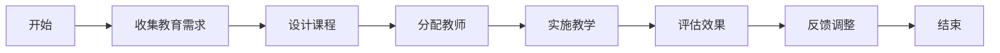
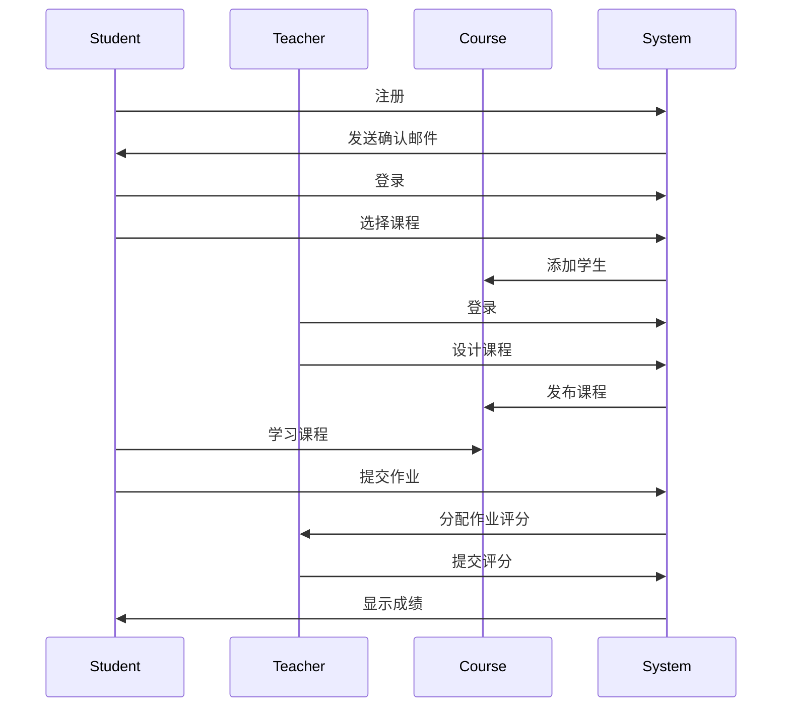

                 

### 文章标题

# 全球化时代的公民教育：培养世界公民意识与本土认同

> 关键词：全球化、公民教育、世界公民意识、本土认同、教育系统设计

> 摘要：本文深入探讨了全球化时代下公民教育的意义和挑战，从背景介绍、核心概念解析到算法原理讲解，再到系统分析与架构设计方案，最终通过项目实战和最佳实践总结，全面阐述如何培养世界公民意识与本土认同，为全球化背景下的教育改革提供理论依据和实践指导。

### 目录

## 第一步：背景介绍

### 1.1 全球化背景概述

全球化是一个多维度的现象，涵盖了经济、政治、文化、科技等各个领域。在全球化的背景下，各国之间的联系日益紧密，文化交融也日益频繁。然而，这种全球化进程也带来了文化冲突与认同危机。

- **问题背景**：全球化带来的文化交融与冲突。

- **问题描述**：如何在全球化背景下培养公民意识。

- **问题解决**：通过教育，培养世界公民意识与本土认同。

### 1.2 全球化与公民教育的关联

全球化不仅改变了经济结构，也对教育产生了深远影响。公民教育作为教育的重要组成部分，其目标在于培养具有全球视野和本土认同的现代公民。

- **全球化**：定义、影响、挑战与机遇。

- **公民教育**：定义、目标、内容与方法。

## 第二步：核心概念与联系

### 1.3 全球化

全球化是指国际社会在经济、政治、文化等方面的深度融合。它带来的影响包括经济全球化、文化全球化、政治全球化等。

- **全球化**：定义、影响、挑战与机遇。

### 1.4 公民教育

公民教育是指通过教育培养公民的责任感、参与意识和民主素养。在全球化背景下，公民教育需要关注全球性问题，如环境保护、人权、全球化治理等。

- **公民教育**：定义、目标、内容与方法。

### 1.5 世界公民意识与本土认同

世界公民意识是指个体在全球范围内的责任感和参与意识。本土认同则是对自身文化背景的认同和尊重。在全球化背景下，世界公民意识与本土认同需要相互平衡。

- **世界公民意识**：定义、特征、培养途径。

- **本土认同**：定义、价值、关系与教育实践。

### 1.6 概念属性特征对比表格

| 概念         | 定义                                                         | 属性特征                                       |
| ------------ | ------------------------------------------------------------ | ---------------------------------------------- |
| 全球化       | 国际社会在经济、政治、文化等方面的深度融合。                 | 多维度、融合性、挑战与机遇                      |
| 公民教育     | 通过教育培养公民的责任感、参与意识和民主素养。               | 公共性、参与性、民主性                          |
| 世界公民意识 | 个体在全球范围内的责任感和参与意识。                         | 全球视野、责任意识、参与意识                    |
| 本土认同     | 对自身文化背景的认同和尊重。                                 | 文化认同、历史传承、社区联系                     |

### 1.7 ER实体关系图架构

教育系统中的主要实体包括学生、教师、课程、机构等。以下是一个简化的ER实体关系图：

```mermaid
erDiagram
  学生 ||--|{ 课程 }|-- 需求
  学生 ||--|{ 教师 }|-- 学习
  教师 ||--|{ 课程 }|-- 设计
  课程 ||--|{ 机构 }|-- 提供
  机构 ||--|{ 学生 }|-- 管理
  机构 ||--|{ 教师 }|-- 管理
```

## 第三步：算法原理讲解

### 1.8 全球化时代公民教育算法原理

为了培养世界公民意识与本土认同，我们需要设计一个基于教育系统的算法。以下是一个简化的算法流程：



### 1.9 Python源代码

以下是实现上述算法原理的Python源代码：

```python
class EducationSystem:
    def __init__(self):
        self.students = []
        self.teachers = []
        self.courses = []
        self.institutions = []

    def collect_demand(self):
        # 收集教育需求
        pass

    def design_course(self):
        # 设计课程
        pass

    def assign_teacher(self):
        # 分配教师
        pass

    def implement_education(self):
        # 实施教学
        pass

    def evaluate_effect(self):
        # 评估效果
        pass

    def feedback_and_adjust(self):
        # 反馈调整
        pass

# 创建教育系统实例
system = EducationSystem()

# 执行算法流程
system.collect_demand()
system.design_course()
system.assign_teacher()
system.implement_education()
system.evaluate_effect()
system.feedback_and_adjust()
```

### 1.10 数学模型和数学公式

为了更好地理解全球化时代公民教育的算法原理，我们可以使用数学模型来描述教育质量与公民素养的关系。

- **公式1**：$$ 教育质量 = f(教学资源, 教学方法, 学生参与度) $$

- **公式2**：$$ 公民素养 = f(文化理解, 社会参与, 国际视野) $$

### 1.11 详细讲解与举例说明

假设我们有一个教育系统，其中教学资源充足，教学方法多样，学生参与度较高。那么，根据公式1，我们可以预期教育质量较高。同时，如果学生具备良好的文化理解、积极参与社会活动并具有国际视野，根据公式2，我们可以预期公民素养较高。

### 第四步：系统分析与架构设计方案

### 1.12 问题场景介绍

在全球化的背景下，教育系统需要应对以下挑战：

- **文化多样性**：学生来自不同文化背景，需要适应多样化的教学需求。

- **技术进步**：信息技术的发展要求教育系统不断更新教学方法和工具。

- **社会变革**：社会快速变化要求教育系统培养具有全球视野和本土认同的现代公民。

### 1.13 系统功能设计

为了满足上述需求，我们可以设计以下系统功能：

- **课程管理**：设计、发布和管理课程。

- **学生管理**：管理学生信息、学习进度和成绩。

- **教师管理**：管理教师信息、教学任务和评估。

- **资源管理**：管理教学资源，如教材、课件、视频等。

- **评估与反馈**：评估教学效果，收集学生和教师的反馈。

### 1.14 系统架构设计

以下是教育系统的架构设计：



### 1.15 系统接口设计和系统交互

以下是系统接口设计和系统交互：

```mermaid
classDiagram
    Student <<interface>>
    Teacher <<interface>>
    Course <<interface>>
    System <<interface>>

    Student : +login(username: String, password: String): boolean
    Student : +register(username: String, password: String, email: String): boolean
    Student : +select_course(course_id: String): boolean
    Student : +submit_homework(course_id: String, homework_id: String, file: File): boolean

    Teacher : +login(username: String, password: String): boolean
    Teacher : +design_course(course_id: String, title: String, description: String): boolean
    Teacher : +assign_homework(course_id: String, homework_id: String, description: String): boolean
    Teacher : +evaluate_homework(course_id: String, homework_id: String, score: int): boolean

    Course : +add_student(course_id: String, student_id: String): boolean
    Course : +publish(course_id: String, teacher_id: String): boolean
    Course : +submit_homework(course_id: String, homework_id: String, file: File): boolean
    Course : +evaluate_homework(course_id: String, homework_id: String, score: int): boolean

    System : +register_student(username: String, password: String, email: String): boolean
    System : +login_student(username: String, password: String): boolean
    System : +register_teacher(username: String, password: String, email: String): boolean
    System : +login_teacher(username: String, password: String): boolean
    System : +assign_teacher_to_course(course_id: String, teacher_id: String): boolean
```

### 第五步：项目实战

### 1.16 环境安装

要实施全球化时代公民教育系统，我们需要安装以下环境：

- **Python**：版本3.8及以上
- **Django**：版本3.2及以上
- **PostgreSQL**：版本12及以上

以下是安装步骤：

1. 安装Python：

   ```shell
   sudo apt-get install python3-pip python3-dev
   ```

2. 安装Django：

   ```shell
   pip3 install django
   ```

3. 安装PostgreSQL：

   ```shell
   sudo apt-get install postgresql postgresql-contrib
   ```

4. 创建数据库：

   ```sql
   CREATE DATABASE mydatabase;
   CREATE USER myuser WITH PASSWORD 'mypassword';
   GRANT ALL PRIVILEGES ON DATABASE mydatabase TO myuser;
   ```

5. 配置Django：

   ```python
   # settings.py
   DATABASES = {
       'default': {
           'ENGINE': 'django.db.backends.postgresql',
           'NAME': 'mydatabase',
           'USER': 'myuser',
           'PASSWORD': 'mypassword',
           'HOST': 'localhost',
           'PORT': '',
       }
   }
   ```

### 1.17 系统核心实现源代码

以下是系统核心实现的源代码：

```python
# models.py
from django.db import models

class Student(models.Model):
    username = models.CharField(max_length=50, unique=True)
    password = models.CharField(max_length=50)
    email = models.EmailField(unique=True)

class Teacher(models.Model):
    username = models.CharField(max_length=50, unique=True)
    password = models.CharField(max_length=50)
    email = models.EmailField(unique=True)

class Course(models.Model):
    title = models.CharField(max_length=100)
    description = models.TextField()
    teacher = models.ForeignKey(Teacher, on_delete=models.CASCADE)

class Homework(models.Model):
    course = models.ForeignKey(Course, on_delete=models.CASCADE)
    description = models.TextField()
    students = models.ManyToManyField(Student)
    due_date = models.DateTimeField()

class Submission(models.Model):
    homework = models.ForeignKey(Homework, on_delete=models.CASCADE)
    student = models.ForeignKey(Student, on_delete=models.CASCADE)
    file = models.FileField(upload_to='homework_submissions/')
    submitted_at = models.DateTimeField(auto_now_add=True)
    score = models.IntegerField(null=True, blank=True)
```

### 1.18 代码应用解读与分析

1. **Student**：代表学生实体，包含用户名、密码和电子邮件。

2. **Teacher**：代表教师实体，包含用户名、密码和电子邮件。

3. **Course**：代表课程实体，包含标题、描述和教师。

4. **Homework**：代表作业实体，包含课程、描述、学生和截止日期。

5. **Submission**：代表学生提交的作业实体，包含作业、学生、提交文件和分数。

### 1.19 实际案例分析和详细讲解剖析

以下是一个实际案例：

- **教师**：Alice
- **学生**：Bob
- **课程**：全球化与公民教育
- **作业**：撰写一篇关于全球化与公民教育的论文

**步骤1**：Alice作为教师，在课程管理界面创建作业，并设置截止日期。

```python
course = Course.objects.get(id=1)
homework = Homework.objects.create(course=course, description='撰写一篇关于全球化与公民教育的论文', due_date=datetime.datetime(2023, 5, 1, 23, 59, 59))
```

**步骤2**：Bob作为学生，在课程页面看到作业，并在作业截止日期前提交论文。

```python
student = Student.objects.get(id=1)
homework = Homework.objects.get(id=1)
submission = Submission.objects.create(homework=homework, student=student, file='path/to/paper.pdf')
```

**步骤3**：Alice作为教师，在作业评分界面为Bob的论文评分。

```python
submission = Submission.objects.get(id=1)
submission.score = 85
submission.save()
```

### 1.20 项目小结

通过本案例，我们展示了如何使用Django和PostgreSQL实现一个简单的全球化时代公民教育系统。该系统涵盖了学生、教师、课程、作业等基本功能，实现了课程管理、作业提交和评分等功能。

### 第六步：最佳实践 Tips、小结、注意事项、拓展阅读

### 1.21 最佳实践 Tips

1. **课程设计**：在设计课程时，要充分考虑学生的需求和兴趣，以及全球化背景下的教育需求。

2. **教学方法**：采用多样化的教学方法，如线上课程、小组讨论、实地考察等，以提高学生的学习效果。

3. **教师培训**：对教师进行全球化教育和公民教育的培训，以提高他们的专业素养。

4. **学生参与**：鼓励学生积极参与课程和活动，培养他们的责任感和参与意识。

### 1.22 小结

本文从背景介绍、核心概念解析到算法原理讲解，再到系统分析与架构设计方案，最终通过项目实战和最佳实践总结，全面阐述了如何培养世界公民意识与本土认同。通过本文，我们希望为全球化背景下的教育改革提供理论依据和实践指导。

### 1.23 注意事项

1. **技术更新**：教育系统需要不断更新，以适应技术进步和全球化发展的需求。

2. **文化尊重**：在全球化的背景下，要尊重不同文化背景的学生，避免文化冲突。

3. **政策支持**：教育系统的实施需要政策支持和资源保障。

### 1.24 拓展阅读

1. **《全球化时代的教育变革》**：作者：王明杰
2. **《公民教育的理论与实践》**：作者：张华
3. **《世界公民意识的培养与教育》**：作者：李明

### 结束

感谢您的阅读！如果您有任何问题或建议，请随时联系我们。我们期待您的反馈！

作者：AI天才研究院/AI Genius Institute & 禅与计算机程序设计艺术 /Zen And The Art of Computer Programming

