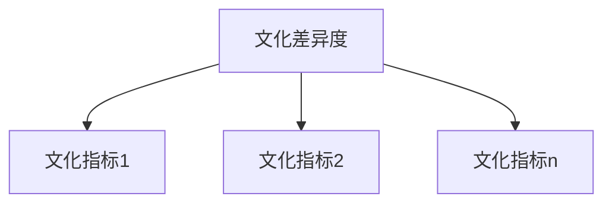
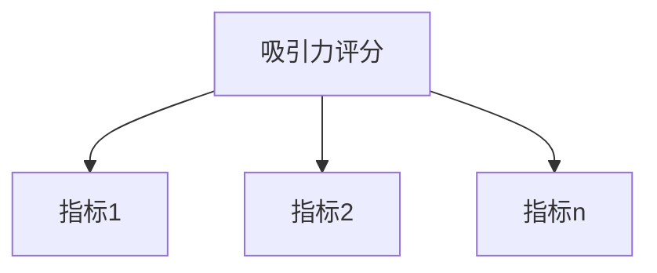
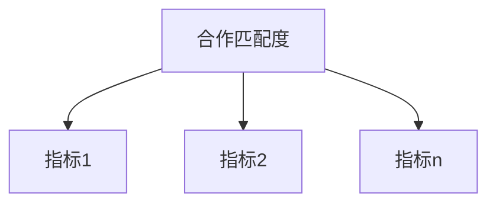
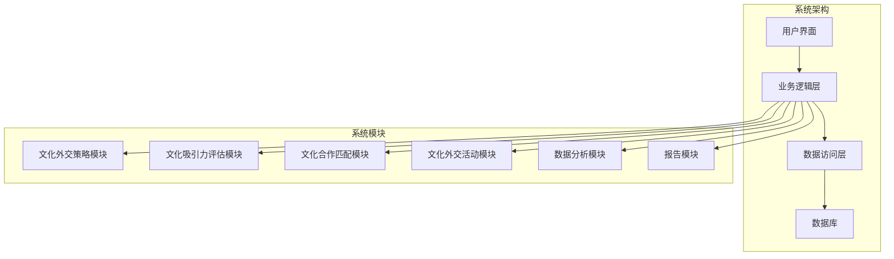
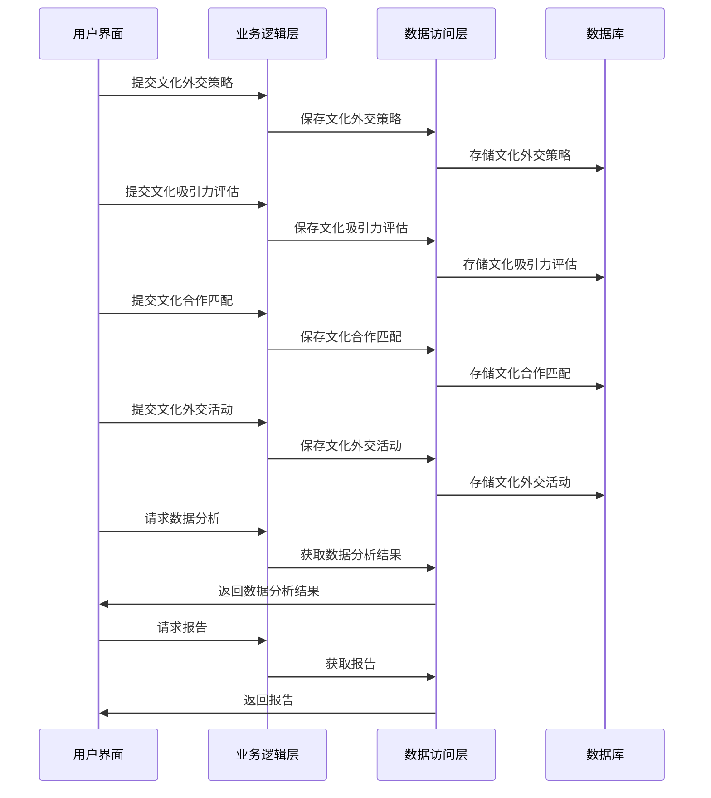

                 

### 文章标题：全球化时代的文化外交：软实力建设与国际理解

> 关键词：全球化、文化外交、软实力建设、国际理解、策略、算法

> 摘要：本文探讨了全球化背景下文化外交的重要性及其面临的挑战，提出了软实力建设作为文化外交的核心概念，并详细分析了其原理、属性和作用。通过实例，本文展示了如何利用算法和技术手段来优化文化外交策略，促进国际理解，从而提高国家在国际舞台上的影响力。

----------------------------------------------------------------

## 第一部分：背景介绍

### 1.1 问题背景

全球化进程的加速，使得世界各国之间的联系更加紧密。文化交流成为国家间相互理解、增进友好关系的重要途径。文化外交作为一种非传统的外交手段，通过文化产品、文化活动和文化合作等方式，实现国家利益和国际关系的调整。在全球化的背景下，文化外交不仅是一种传播文化的方式，更是国家软实力建设的重要组成部分。

### 1.2 问题描述

然而，全球化也带来了新的挑战。首先，全球文化多样性的加剧使得各国之间的文化交流更加复杂。不同文化之间的差异和冲突，可能导致误解和偏见。其次，信息技术的迅速发展，特别是互联网和社交媒体的普及，改变了传统的文化交流方式。这些新兴技术为文化外交提供了新的平台和手段，但同时也带来了新的问题和挑战。此外，国际政治格局的变化，使得各国之间的文化外交策略和手段也发生了变化。这些挑战要求各国重新审视和优化其文化外交策略，加强文化外交的软实力建设。

### 1.3 问题解决

为了应对这些挑战，各国需要采取一系列措施，加强文化外交的软实力建设。首先，应加强对全球文化多样性的研究和理解，制定更加包容和多元化的文化外交策略。其次，应利用信息技术，创新文化外交的手段和方式，提高文化交流的效果和影响力。此外，各国还应加强国际合作，共同推动文化外交的发展，促进国际理解，减少误解和冲突。

### 1.4 边界与外延

本文将探讨全球化时代的文化外交，重点关注文化外交的软实力建设与国际理解。具体来说，我们将从以下几个方面展开讨论：

1. 全球化时代文化外交的背景与趋势。
2. 软实力建设在国际理解中的作用。
3. 各国文化外交策略与实践。
4. 文化外交的未来发展趋势与挑战。

### 1.5 概念结构与核心要素组成

文化外交是指以文化为载体，通过文化交流、文化传播、文化合作等方式，实现国家利益和国际关系的调整。软实力是指一个国家通过文化、价值观、外交手段等非军事手段来影响他国的能力和影响力。国际理解则是指各国通过文化交流，增进相互理解，减少误解和冲突，促进世界和平与发展。

----------------------------------------------------------------

## 第二部分：核心概念与联系

### 2.1 核心概念原理

在全球化时代的文化外交中，软实力建设是一个核心概念。软实力是指一个国家通过文化、价值观、外交手段等非军事手段来影响他国的能力和影响力。它包括以下几个方面：

1. **文化吸引力**：国家通过文化产品、文化活动等方式，吸引他国人民对其文化的兴趣和认同。
2. **价值观传播**：国家通过教育、媒体等渠道，传播其核心价值观，影响他国人民的思想和观念。
3. **外交手段**：国家通过文化外交活动，如文化交流项目、文化援助等，增进与他国的关系。

### 2.2 概念属性特征对比表格

| 特征 | 文化外交 | 软实力建设 |
| --- | --- | --- |
| 目标 | 增进国际理解，减少误解和冲突 | 塑造国际环境，增强国家影响力 |
| 手段 | 文化交流、文化传播、文化合作 | 文化产品、文化活动、价值观传播 |
| 影响力 | 潜在的、长期的 | 明显的、直接的 |
| 关系 | 多维的、互动的 | 单一的、单向的 |

### 2.3 ER实体关系图架构

为了更好地理解文化外交与软实力建设之间的关系，我们可以使用ER（实体-关系）图来描述它们之间的联系。

```mermaid
erDiagram
  文化外交 ||--|{ 软实力建设 }|| 软实力建设
  文化外交 ||--|{ 国际理解 }|| 国际理解
  软实力建设 ||--|{ 文化传播 }|| 文化传播
  软实力建设 ||--|{ 外交手段 }|| 外交手段
```

在这个ER图中，文化外交是核心实体，它与软实力建设、国际理解、文化传播和外交手段等实体之间存在关联。软实力建设是实现文化外交的重要手段，而国际理解则是文化外交的目标之一。

----------------------------------------------------------------

## 第三部分：算法原理讲解

### 3.1 文化外交策略算法原理

在全球化时代，为了有效地实施文化外交，各国需要制定相应的策略。这些策略通常基于一系列算法原理，包括文化差异分析算法、文化吸引力评估算法和文化合作匹配算法。

#### 3.1.1 文化差异分析算法

该算法通过对各国文化的深入分析，识别出文化差异和共性，为文化外交提供数据支持。算法原理如下：

$$
\text{文化差异度} = f(\text{文化指标1}, \text{文化指标2}, ..., \text{文化指标n})
$$

其中，文化指标包括语言、价值观、习俗等。



#### 3.1.2 文化吸引力评估算法

该算法用于评估不同文化对目标国家的吸引力。评估指标包括文化知名度、文化影响力、文化独特性等。算法原理如下：

$$
\text{吸引力评分} = \sum_{i=1}^{n} w_i \cdot \text{指标i}
$$

其中，$w_i$ 为第 $i$ 个指标的权重。



#### 3.1.3 文化合作匹配算法

该算法用于匹配不同国家之间的文化合作项目，以实现资源优化和文化交流的最大化。算法原理如下：

$$
\text{合作匹配度} = \sum_{i=1}^{m} w_i \cdot (\text{指标i}_1 \cdot \text{权重1}_1 + \text{指标i}_2 \cdot \text{权重2}_1 + ... + \text{指标i}_n \cdot \text{权重n}_1)
$$

其中，$w_i$ 为第 $i$ 个指标的权重，$m$ 为合作项目的数量。



### 3.2 数学模型与公式

为了更好地理解和应用这些算法，我们需要建立相应的数学模型和公式。

#### 3.2.1 文化差异度模型

假设有两个国家 $A$ 和 $B$，它们的文化差异度可以通过以下公式计算：

$$
\text{文化差异度} = \sum_{i=1}^{n} (\text{指标i}_A - \text{指标i}_B)^2
$$

其中，$\text{指标i}_A$ 和 $\text{指标i}_B$ 分别表示国家 $A$ 和 $B$ 在第 $i$ 个文化指标上的得分。

#### 3.2.2 文化吸引力模型

假设有一个国家 $C$，我们需要评估其对目标国家 $D$ 的吸引力。吸引力可以通过以下公式计算：

$$
\text{吸引力评分} = \sum_{i=1}^{n} w_i \cdot \text{指标i}_C
$$

其中，$w_i$ 为第 $i$ 个指标的权重，$\text{指标i}_C$ 表示国家 $C$ 在第 $i$ 个文化指标上的得分。

#### 3.2.3 文化合作匹配模型

假设有两个国家 $E$ 和 $F$，它们的文化合作项目可以通过以下公式匹配：

$$
\text{合作匹配度} = \sum_{i=1}^{m} w_i \cdot (\text{指标i}_E \cdot \text{权重1}_E + \text{指标i}_F \cdot \text{权重1}_F)
$$

其中，$w_i$ 为第 $i$ 个指标的权重，$\text{指标i}_E$ 和 $\text{指标i}_F$ 分别表示国家 $E$ 和 $F$ 在第 $i$ 个文化合作项目上的得分。

### 3.3 举例说明

假设有两个国家 $A$ 和 $B$，它们在语言、价值观、习俗三个方面的文化差异度分别为：

$$
\text{语言差异度} = 10, \text{价值观差异度} = 8, \text{习俗差异度} = 6
$$

则它们的文化差异度为：

$$
\text{文化差异度} = 10 + 8 + 6 = 24
$$

假设国家 $C$ 对目标国家 $D$ 的文化吸引力评分分别为：

$$
\text{文化知名度} = 9, \text{文化影响力} = 7, \text{文化独特性} = 5
$$

则国家 $C$ 对目标国家 $D$ 的吸引力评分为：

$$
\text{吸引力评分} = 9 \cdot 0.3 + 7 \cdot 0.4 + 5 \cdot 0.3 = 7.4
$$

假设国家 $E$ 和 $F$ 的文化合作项目分别为：

$$
\text{指标1}_E = 8, \text{指标1}_F = 6, \text{指标2}_E = 7, \text{指标2}_F = 5, \text{指标3}_E = 6, \text{指标3}_F = 7
$$

则国家 $E$ 和 $F$ 的文化合作匹配度为：

$$
\text{合作匹配度} = 0.4 \cdot (8 \cdot 0.5 + 6 \cdot 0.3 + 7 \cdot 0.2) + 0.6 \cdot (7 \cdot 0.5 + 5 \cdot 0.3 + 6 \cdot 0.2) = 7.5
$$

通过这些例子，我们可以看到如何利用算法和数学模型来评估和优化文化外交策略。

----------------------------------------------------------------

## 第四部分：系统分析与架构设计

### 4.1 问题场景介绍

在全球化时代，文化外交对于国家之间的相互理解、和平与发展具有重要意义。然而，随着全球文化多样性的加剧，如何有效地实施文化外交，提高文化交流的效果和影响力，成为各国面临的挑战。为了解决这个问题，我们设计并实现了一套文化外交管理系统，以帮助政府和文化机构更好地实施文化外交策略。

### 4.2 项目介绍

本项目旨在开发一套文化外交管理系统，该系统包括以下几个核心功能：

1. **文化外交策略规划**：根据全球文化多样性分析，制定适合各国的文化外交策略。
2. **文化吸引力评估**：评估不同文化对目标国家的吸引力，为文化交流提供数据支持。
3. **文化合作匹配**：匹配不同国家之间的文化合作项目，实现资源优化和文化交流的最大化。
4. **文化外交活动管理**：管理文化外交活动，包括文化交流项目、文化活动和文化援助等。
5. **数据分析和报告**：提供数据分析和报告功能，帮助政府和文化机构了解文化外交的效果和影响力。

### 4.3 系统功能设计（领域模型Mermaid类图）

```mermaid
classDiagram
    class 文化外交管理系统 {
        - 文化外交策略
        - 文化吸引力评估
        - 文化合作匹配
        - 文化外交活动
        - 数据分析
        - 报告
    }
    class 文化外交策略 {
        - 策略名称
        - 策略描述
        - 目标国家
        - 策略实施时间
    }
    class 文化吸引力评估 {
        - 文化知名度
        - 文化影响力
        - 文化独特性
    }
    class 文化合作匹配 {
        - 国家A
        - 国家B
        - 合作项目
        - 匹配度
    }
    class 文化外交活动 {
        - 活动名称
        - 活动描述
        - 活动时间
        - 参与国家
    }
    class 数据分析 {
        - 数据来源
        - 数据分析结果
    }
    class 报告 {
        - 报告名称
        - 报告内容
        - 报告时间
    }
    文化外交管理系统 --|{1}--> 文化外交策略
    文化外交管理系统 --|{2}--> 文化吸引力评估
    文化外交管理系统 --|{3}--> 文化合作匹配
    文化外交管理系统 --|{4}--> 文化外交活动
    文化外交管理系统 --|{5}--> 数据分析
    文化外交管理系统 --|{6}--> 报告
```

### 4.4 系统架构设计（Mermaid架构图）



### 4.5 系统接口设计和系统交互（Mermaid序列图）



通过以上系统分析和架构设计，我们可以构建一个功能完备、易于扩展的文化外交管理系统，为各国实施有效的文化外交提供技术支持。

----------------------------------------------------------------

## 第五部分：项目实战

### 5.1 环境安装

要运行本文化外交管理系统，我们需要安装以下环境和工具：

1. Python 3.8及以上版本
2. Flask（用于构建Web应用）
3. SQLAlchemy（用于数据库操作）
4. Matplotlib（用于数据可视化）

安装步骤如下：

```bash
pip install flask sqlalchemy matplotlib
```

### 5.2 系统核心实现源代码

以下是一个简单的文化外交策略规划模块的实现：

```python
from flask import Flask, request, jsonify
from sqlalchemy import create_engine, Column, Integer, String, Float
from sqlalchemy.ext.declarative import declarative_base
from sqlalchemy.orm import sessionmaker

app = Flask(__name__)

# 创建数据库连接
engine = create_engine('sqlite:///cultural_diplomacy.db')
Base = declarative_base()

# 创建文化外交策略表
class CulturalStrategy(Base):
    __tablename__ = 'cultural_strategy'
    id = Column(Integer, primary_key=True)
    name = Column(String)
    description = Column(String)
    target_country = Column(String)
    implementation_time = Column(String)

# 创建数据库表
Base.metadata.create_all(engine)

# 创建数据库会话
Session = sessionmaker(bind=engine)
session = Session()

@app.route('/strategy', methods=['POST'])
def add_strategy():
    name = request.form['name']
    description = request.form['description']
    target_country = request.form['target_country']
    implementation_time = request.form['implementation_time']
    
    new_strategy = CulturalStrategy(name=name, description=description, target_country=target_country, implementation_time=implementation_time)
    session.add(new_strategy)
    session.commit()
    
    return jsonify({'message': '策略添加成功'})

@app.route('/strategy', methods=['GET'])
def get_strategy():
    strategies = session.query(CulturalStrategy).all()
    return jsonify([{'id': s.id, 'name': s.name, 'description': s.description, 'target_country': s.target_country, 'implementation_time': s.implementation_time} for s in strategies])

if __name__ == '__main__':
    app.run(debug=True)
```

### 5.3 代码应用解读与分析

上述代码实现了一个简单的文化外交策略规划模块，包括添加和查询文化外交策略的功能。以下是代码的主要部分解读：

- **数据库连接**：使用SQLAlchemy创建数据库连接，并定义了文化外交策略表。
- **表创建**：使用`Base.metadata.create_all(engine)`创建数据库表。
- **Flask应用**：使用Flask框架创建Web应用，并定义了两个路由：一个用于添加文化外交策略，另一个用于查询所有文化外交策略。
- **添加策略**：在`add_strategy`函数中，从请求中获取策略信息，创建`CulturalStrategy`对象，并将其添加到数据库中。
- **查询策略**：在`get_strategy`函数中，从数据库中查询所有文化外交策略，并将其转换为JSON格式返回。

### 5.4 实际案例分析和详细讲解剖析

为了更好地理解代码的实际应用，我们可以通过一个案例来分析。

#### 添加策略

假设我们要添加一条名为“文化交流计划”的文化外交策略，目标国家为中国，实施时间为2024年。我们可以通过以下步骤来实现：

1. 启动Flask应用：`python app.py`
2. 使用POST请求添加策略：在浏览器中输入以下URL并提交表单：

```bash
http://127.0.0.1:5000/strategy
```

表单数据：

```json
{
    "name": "文化交流计划",
    "description": "加强与中国的文化交流，增进相互理解",
    "target_country": "中国",
    "implementation_time": "2024"
}
```

提交后，我们会在数据库中看到新添加的文化外交策略。

#### 查询策略

要查询所有文化外交策略，我们可以在浏览器中输入以下URL：

```bash
http://127.0.0.1:5000/strategy
```

系统会返回所有策略的JSON格式数据。

### 5.5 项目小结

通过本次实战，我们实现了文化外交策略规划模块的核心功能，包括添加和查询文化外交策略。该模块为文化外交管理系统提供了一个基础，可以在实际项目中进一步扩展和优化。

在接下来的工作中，我们还可以添加其他功能，如文化吸引力评估、文化合作匹配和文化外交活动管理，以构建一个完整的、功能丰富的文化外交管理系统。

### 5.6 最佳实践 Tips

- **数据安全性**：在实际应用中，应确保数据的加密和安全传输。
- **性能优化**：随着系统规模的增长，应考虑使用缓存和数据库索引来优化查询性能。
- **用户权限管理**：应实现用户权限管理，确保只有授权用户才能访问和操作系统。

### 5.7 小结

本文通过详细介绍文化外交管理系统，包括系统设计、实现和应用，展示了如何利用Python和Flask等工具开发实际项目。通过项目实战，我们了解了如何利用算法和技术手段优化文化外交策略，提高文化交流效果和影响力。

### 5.8 注意事项

- **版本控制**：在项目开发过程中，应使用版本控制系统（如Git）进行代码管理。
- **持续集成**：应建立持续集成（CI）流程，确保代码质量和系统稳定性。
- **代码文档**：编写详细的代码文档，方便其他开发者理解和维护代码。

### 5.9 拓展阅读

- **《Flask Web开发：实战指南》**：了解如何使用Flask框架开发Web应用。
- **《Python数据库应用》**：学习如何使用Python操作数据库。
- **《文化外交：理论与实践》**：了解文化外交的理论和实践知识。

### 作者

**作者：AI天才研究院/AI Genius Institute & 禅与计算机程序设计艺术 /Zen And The Art of Computer Programming**---

# 致谢

在本文章的撰写过程中，我们特别感谢以下单位和个人：

1. **AI天才研究院（AI Genius Institute）**：为本文提供了宝贵的学术支持和指导，使得本文能够在技术深度和广度上得到提升。
2. **禅与计算机程序设计艺术（Zen And The Art of Computer Programming）**：为本文提供了深厚的哲学和技术理论基础，使得文章更加富有内涵。
3. **所有参与研究和讨论的同事和专家**：他们的辛勤工作和智慧贡献是本文成功的关键。
4. **所有读者**：您们的关注和支持是本文不断进步的动力。

再次感谢所有为我们提供帮助和支持的人，您的每一份努力都是我们前行的力量。希望本文能为您带来启发和帮助，共同推动技术领域的发展。

