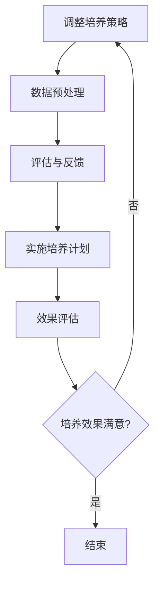

                 

基于上述的目录大纲和约束条件，我们将一步一步构建和撰写《全球化背景下的教育国际化：跨文化能力的培养》这篇技术博客文章。以下是文章的整体结构和内容安排的思路：

### 文章结构

#### 前言
- 简要介绍全球化的背景及教育国际化的趋势。
- 阐述跨文化能力的重要性，引起读者的兴趣。

#### 文章关键词与摘要
- 核心关键词：全球化、教育国际化、跨文化能力、培养方法、数学模型、系统设计、实践案例。
- 摘要：简要概述文章的核心内容和主旨。

#### 第一部分：背景与核心概念
1. **全球化背景介绍**
   - 全球化的定义、影响和趋势。
   - 全球化对教育的冲击和挑战。

2. **教育国际化概述**
   - 教育国际化的定义、形式和目标。
   - 教育国际化的重要性和发展趋势。

3. **跨文化能力概述**
   - 跨文化能力的定义、属性特征和结构组成。

4. **跨文化能力与教育国际化的关系**
   - 关系阐述、跨文化能力在教育国际化中的重要性。

5. **跨文化能力相关理论模型**
   - 文化适应理论、跨文化交际理论等。

6. **本章小结**
   - 对第一部分内容的总结和概括。

#### 第二部分：跨文化能力的培养
1. **培养跨文化能力的方法**
   - 语言学习、文化知识学习、跨文化交际实践。

2. **培养跨文化能力的策略**
   - 个人层面策略、教育机构层面策略、政策层面策略。

3. **培养跨文化能力的挑战与对策**
   - 文化差异挑战、教育资源不足等。

4. **跨文化能力培养的案例研究**
   - 国际学校跨文化教育实践、跨国企业员工培训计划。

5. **本章小结**
   - 对第二部分内容的总结和概括。

#### 第三部分：跨文化能力培养的实践与应用
1. **跨文化能力培养的系统设计与实施**
   - 设计原则、架构设计、接口设计。

2. **跨文化能力培养的系统分析与架构**
   - 系统功能设计、系统架构设计、系统接口设计。

3. **跨文化能力培养的数学模型与公式**
   - 数学模型概述、数学公式讲解、举例说明。

4. **跨文化能力培养的算法原理与流程**
   - 算法原理、流程图展示、Python代码实现。

5. **跨文化能力培养的实践与应用案例**
   - 跨文化沟通培训、国际文化交流活动。

6. **本章小结**
   - 对第三部分内容的总结和概括。

#### 第四部分：跨文化能力培养的最佳实践与未来展望
1. **最佳实践 tips**
   - 结合案例，提供实用的培养跨文化能力的建议。

2. **注意事项**
   - 培养跨文化能力时需要注意的问题。

3. **拓展阅读**
   - 推荐相关文献和资源。

4. **未来展望**
   - 对跨文化能力培养的潜在发展趋势和挑战进行探讨。

### 文章撰写思路
- **文章开头**：使用吸引人的引言，简述全球化和教育国际化的背景，引起读者的兴趣。
- **每一章节的开头**：用简短的段落进行概述，让读者了解本章的主要内容。
- **每一章节的内容**：通过清晰的章节结构，逐步介绍核心概念、理论模型、培养方法、实践案例等。
- **每一段落**：使用清晰的语言和例子，确保读者能够理解复杂的概念和原理。
- **图表和代码**：使用mermaid流程图、LaTeX公式和Python代码来帮助读者更好地理解内容。
- **结尾部分**：总结全文，给出最佳实践和未来展望。

### 文章撰写步骤
1. **撰写前言**：简要介绍文章的主题和目的。
2. **撰写摘要**：概括文章的核心内容和主旨。
3. **撰写第一部分**：完成背景介绍、核心概念与联系等内容。
4. **撰写第二部分**：完成跨文化能力的培养方法和策略等。
5. **撰写第三部分**：完成跨文化能力培养的实践与应用等。
6. **撰写第四部分**：完成最佳实践、注意事项、拓展阅读和未来展望等。
7. **修改和润色**：检查文章的逻辑性、连贯性和准确性，进行必要的修改和润色。
8. **添加作者信息**：在文章末尾添加作者信息。
9. **检查格式**：确保文章使用markdown格式正确无误。

通过这样的步骤，我们将逐步构建出一篇结构清晰、内容丰富、逻辑严密的专业技术博客文章。《全球化背景下的教育国际化：跨文化能力的培养》将成为一篇既有深度又有思考的优质文章。 

### 引言

在当今全球化迅速发展的时代，教育和跨文化交流变得日益重要。全球化不仅改变了经济的运作模式，也深刻影响了人们的生活方式和文化观念。教育国际化作为全球化的一部分，旨在通过跨越国界的交流与合作，提升教育的质量与影响力。然而，随着国际交流的深入，跨文化能力的培养成为教育领域面临的重要挑战和机遇。

跨文化能力是指个体在不同文化背景下有效沟通、合作和适应的能力。在全球化背景下，这种能力不仅对个人的职业发展至关重要，也对国家和地区的国际竞争力有着直接影响。因此，教育国际化不仅仅是语言和课程的国际化，更是培养具有跨文化能力的人才的过程。

本文旨在深入探讨全球化背景下的教育国际化，以及如何通过系统的方法和策略来培养个体的跨文化能力。文章将分为四个主要部分：首先，介绍全球化和教育国际化的背景，阐述跨文化能力的重要性；其次，讨论核心概念和理论模型，为跨文化能力培养提供理论基础；接着，详细讲解培养跨文化能力的方法和策略，并辅以实际案例；最后，探讨跨文化能力培养的未来趋势和最佳实践。通过这一系列的分析和讨论，本文希望能够为教育工作者和政策制定者提供有价值的参考。

关键词：全球化、教育国际化、跨文化能力、培养方法、数学模型、实践案例。

摘要：本文从全球化和教育国际化的背景出发，系统探讨了跨文化能力的定义、属性和结构，分析了跨文化能力与教育国际化的关系。通过介绍培养跨文化能力的方法和策略，结合实际案例，本文展示了跨文化能力培养的具体实践。最后，对跨文化能力培养的未来趋势和最佳实践进行了展望，为教育领域的进一步发展提供了参考。

### 全球化背景介绍

全球化是一个不可逆转的历史趋势，它不仅改变了经济的运作模式，也对社会、文化和教育领域产生了深远的影响。全球化指的是全球范围内的经济、政治、文化和技术的相互联系与融合。它通过跨国界的信息交流、人员流动、资本流动和文化交流，将世界各地的经济活动、社会结构和文化现象紧密连接在一起。

首先，全球化的定义可以从多个角度来理解。从经济学的角度来看，全球化是指国际贸易、投资和跨国公司的扩展，使得商品、服务、资本和劳动力可以在全球范围内自由流动。从政治学的角度来看，全球化涉及国家之间的合作与竞争，以及国际组织和法律体系的建立。而从文化的角度来看，全球化是指不同文化之间的交流和融合，导致了文化多样性的增加和文化同化的现象。

全球化的影响是多方面的。在经济方面，全球化促进了国际贸易和投资的增长，推动了全球经济的快速发展。它也带来了市场机会和就业机会，但同时也加剧了全球经济的不平等和不稳定。在社会方面，全球化促进了文化交流和多样性，丰富了人们的生活体验，但也带来了文化冲突和文化适应的挑战。在教育方面，全球化对教育的需求和供给都产生了深远的影响。它促使教育机构开展国际交流与合作，推动教育资源的共享与优化，同时也要求教育培养具备跨文化能力的人才。

教育国际化是全球化背景下的一种重要现象，它涉及到教育体系、课程、教师和学生的跨国界交流与合作。教育国际化的定义可以理解为：通过跨越国界的交流、合作和互动，提升教育质量、拓宽教育视野和促进教育公平。教育国际化的形式多种多样，包括留学、国际交流项目、跨国教育机构合作、在线教育平台等。

教育国际化的重要目标包括以下几个方面：

1. **提升教育质量**：通过引进国际先进的教育理念、教学方法和管理经验，提升本土教育水平。
2. **拓宽教育视野**：使学生能够接触到多元文化，增强跨文化意识和适应能力。
3. **促进教育公平**：通过跨国界的合作和资源共享，减轻教育不平等的现象。
4. **培养全球公民**：通过国际教育，培养学生具备全球视野和责任感，为未来的国际事务做好准备。

全球化和教育国际化的趋势表现为以下几个方面：

1. **国际化课程和文凭项目**：越来越多的教育机构开设国际课程和双学位项目，以适应国际学生的需求。
2. **跨国合作与交流**：教育机构之间的合作和交流越来越频繁，包括师资培训、学术交流和联合研究等。
3. **在线教育和远程学习**：互联网技术的发展使得在线教育和远程学习成为可能，为全球教育资源共享提供了新的途径。
4. **多元化学生群体**：国际学生的比例不断上升，不同国家和文化背景的学生共同学习和生活，促进了文化的多样性和交流。

然而，全球化背景下的教育国际化也面临一些挑战和问题。例如，文化差异和语言障碍可能导致教育交流的困难，教育资源的不平衡可能导致教育机会的不均等，教育政策的差异可能导致教育质量的差异。因此，如何有效应对这些挑战，实现教育国际化的可持续发展，成为当前教育领域的重要课题。

总之，全球化背景下的教育国际化不仅是教育发展的必然趋势，也是培养跨文化能力的重要途径。通过深入探讨全球化和教育国际化的背景，我们可以更好地理解跨文化能力的重要性，为下一部分的讨论奠定基础。

### 教育国际化概述

教育国际化是指在全球化背景下，通过跨越国界的交流、合作和互动，提升教育质量、拓宽教育视野和促进教育公平。教育国际化不仅包括教育体系、课程、教师和学生的跨国界交流与合作，还涉及到教育资源的共享与优化。其定义可以理解为：通过国际交流与合作，促进教育系统的全球联通，实现教育理念、教学方法和管理模式的创新与发展。

首先，教育国际化的定义可以从多个方面来理解。从教育体系的角度，教育国际化指的是各国教育机构之间建立合作关系，开展联合研究、师资培训和学生交流等活动。从课程的角度，教育国际化指的是将国际化的内容和理念融入本土课程中，培养学生具备全球视野和跨文化能力。从教师的角度，教育国际化指的是通过国际师资交流和合作，提升教师的专业水平和教学能力。从学生的角度，教育国际化指的是提供多样化的学习机会，让学生接触到不同的文化和教育环境。

教育国际化的形式多种多样，以下是一些常见的教育国际化形式：

1. **留学**：留学是指学生到其他国家接受高等教育，这是教育国际化最直接和显著的形式。留学不仅可以让学生接触到不同的教育体系和教学方法，还可以提高他们的语言能力、跨文化适应能力和全球视野。

2. **国际交流项目**：国际交流项目是指教育机构之间建立的合作关系，通过交换学生、教师或研究人员，促进教育资源的共享和知识交流。这些项目可以是短期的，如夏令营或实习，也可以是长期的项目，如双学位或联合培养。

3. **跨国教育机构合作**：跨国教育机构合作指的是不同国家的教育机构之间的合作，包括联合研究、师资培训、课程开发和认证等。这种合作可以提升教育机构的国际声誉，提高教育质量，同时也为学生提供更多的学习机会。

4. **在线教育和远程学习**：随着互联网技术的发展，在线教育和远程学习成为教育国际化的重要形式。在线教育平台和远程学习项目使得学生可以跨越地域限制，获取全球顶尖教育资源。这种形式不仅拓宽了教育的边界，也提高了教育的公平性。

5. **国际认证和标准**：国际认证和标准是教育国际化的重要组成部分。通过国际认证，教育机构可以确保其教育质量达到国际标准，增强其国际竞争力。同时，国际标准也为学生提供了可靠的质量保证，有助于他们在全球范围内的职业发展。

教育国际化的重要性和发展趋势体现在以下几个方面：

1. **提升教育质量**：教育国际化通过引进国际先进的教育理念、教学方法和管理经验，提升本土教育水平。教育机构可以通过与国外优秀教育机构的合作，学习他们的成功经验，改进自身的教学和管理模式。

2. **拓宽教育视野**：教育国际化使学生能够接触到多元文化，增强跨文化意识和适应能力。在全球化的背景下，跨文化能力成为个人职业发展和国际竞争力的重要要素。通过国际交流与合作，学生可以更好地适应不同文化和工作环境。

3. **促进教育公平**：教育国际化通过跨国界的合作和资源共享，减轻教育不平等的现象。在线教育和远程学习项目为那些无法出国留学的学生提供了学习的机会，使优质教育资源更加普及和可及。

4. **培养全球公民**：教育国际化致力于培养具有全球视野和责任感的公民。通过国际教育，学生不仅学习专业知识，还学习如何处理国际事务，如何在全球范围内合作和解决冲突。

5. **增强国际竞争力**：教育国际化有助于提升国家的国际竞争力。通过培养具备跨文化能力和国际视野的人才，国家能够在全球经济中占据更有利的位置。同时，国际化的教育机构和项目也可以吸引外国学生和研究人员，为国家的经济发展注入新的动力。

总之，教育国际化在全球化背景下具有重要的意义和广泛的应用。通过多样化的形式和策略，教育国际化不仅提升了教育质量，拓宽了教育视野，还促进了教育公平，培养了具有全球视野和跨文化能力的人才。随着全球化的不断深入，教育国际化的趋势将更加明显，对教育领域的发展产生深远的影响。

### 跨文化能力概述

跨文化能力是指个体在不同文化背景下有效沟通、合作和适应的能力。它不仅涉及到语言交流，还包含对文化价值观、习俗和行为的理解和尊重。在全球化背景下，跨文化能力的重要性日益凸显，因为它是实现国际交流与合作、解决文化冲突和提升个人及组织国际竞争力的重要保障。

首先，跨文化能力的定义可以从多个维度进行理解。从沟通的角度，跨文化能力指的是个体能够在不同的语言和文化环境中进行有效的交流。从合作的角度，跨文化能力指的是个体能够与来自不同文化背景的人共同工作，理解并尊重他们的文化差异。从适应的角度，跨文化能力指的是个体在面对新的文化环境时能够快速适应，并在文化互动中保持积极的态度。

跨文化能力的属性特征可以概括为以下几个方面：

1. **语言能力**：语言是跨文化沟通的基础，具备良好的语言能力是跨文化能力的重要组成部分。语言能力不仅包括语言表达和听力理解，还包括非语言沟通，如肢体语言和面部表情。
2. **文化知识**：了解不同文化的基本知识，包括价值观、习俗、礼仪和传统，是跨文化能力的重要体现。文化知识可以帮助个体避免文化误解和冲突，更好地适应新的文化环境。
3. **态度与价值观**：跨文化能力还体现在个体对文化差异的态度和价值观上。一个具有跨文化能力的人通常具备开放的心态，愿意接受和尊重不同的文化，并能从不同的文化视角看待问题。
4. **适应能力**：适应能力是指个体在面对新的文化环境时，能够迅速调整自己的行为和思维方式，以适应新的文化规则和期望。适应能力强的个体能够在跨文化互动中更加得心应手。

跨文化能力的结构组成可以从以下几个方面进行阐述：

1. **认知成分**：认知成分指的是个体对文化知识的理解和应用能力。这包括对文化差异的认知、文化知识的获取和运用，以及在不同文化环境中的问题解决能力。
2. **情感成分**：情感成分指的是个体在面对不同文化时的情感反应和心理状态。一个具有跨文化能力的人通常能够控制自己的情绪，保持冷静和客观，避免因文化差异而产生的情绪波动。
3. **行为成分**：行为成分指的是个体在跨文化互动中的实际行为表现。这包括语言和行为规范的应用、跨文化沟通技巧的运用以及在不同文化环境中的适应策略。

在全球化背景下，跨文化能力的重要性体现在以下几个方面：

1. **促进国际交流与合作**：具备跨文化能力的个体能够更好地理解和适应不同文化背景的人，从而在跨文化交流与合作中取得更好的效果。跨文化能力的提升有助于消除文化障碍，促进国际交流的深入。
2. **提高个人竞争力**：在全球化的职场环境中，具备跨文化能力的人才越来越受到雇主的青睐。跨文化能力不仅可以提高个人的职业发展机会，还能提升个人的适应能力和国际竞争力。
3. **促进文化理解与和谐**：跨文化能力的培养有助于增进不同文化之间的理解和尊重，减少文化冲突和误解，促进文化的多样性和和谐发展。
4. **提升组织效能**：在跨国企业和国际组织中，跨文化能力是确保团队协作和有效沟通的关键因素。具备跨文化能力的团队成员能够更好地处理跨文化冲突，提高组织的整体效能。

总之，跨文化能力是全球化时代不可或缺的重要能力。通过全面了解跨文化能力的定义、属性特征和结构组成，我们可以更好地理解和培养这种能力，为个人的职业发展和组织的国际化提供坚实的支持。

### 跨文化能力与教育国际化的关系

跨文化能力与教育国际化之间存在着密切而复杂的关系。首先，教育国际化为培养跨文化能力提供了广阔的平台和丰富的资源。通过国际交流与合作，学生和教师可以接触到不同的文化背景、教育体系和教学方法，从而提升他们的跨文化能力。其次，跨文化能力是教育国际化的重要目标和核心要素。具备跨文化能力的个体能够更好地适应和理解国际环境，从而在国际交流与合作中发挥更大的作用。

首先，教育国际化为培养跨文化能力提供了重要的平台和资源。在国际化的教育环境中，学生和教师有机会直接接触和体验不同的文化，这包括通过留学项目、国际交流项目、跨国教育机构合作等方式。这些经历不仅有助于提高他们的语言能力和文化知识，还能增强他们的跨文化意识和适应能力。例如，通过参与国际交流项目，学生可以与来自不同国家的同学一起学习、生活和工作，从而学会尊重和理解不同的文化习俗和价值观。教师也可以通过国际师资交流，学习国外先进的教育理念和方法，提升自身的专业水平和跨文化教学能力。

其次，跨文化能力是教育国际化的重要目标和核心要素。教育国际化的最终目标是培养具备全球视野和跨文化能力的国际化人才。这些人才不仅能够在国际事务中发挥重要作用，还能促进不同文化之间的交流与理解。因此，跨文化能力成为教育国际化的重要评价标准。教育机构在制定国际化战略和课程时，会充分考虑如何培养学生的跨文化能力。例如，一些国际学校在课程设置上会融入跨文化交流和合作的内容，通过国际交流项目和实践，帮助学生提升跨文化能力。跨国企业和组织也越来越多地强调跨文化能力，将其作为招聘和培训的重要标准。

在具体的教育实践中，跨文化能力与教育国际化之间的关系可以体现在以下几个方面：

1. **课程设置**：教育国际化要求课程设置具有全球视野和跨文化内容。教育机构可以通过引入国际化课程、开设跨文化交流课程，以及将跨文化能力培养融入各学科教学中，来提升学生的跨文化能力。

2. **师资培训**：教师的跨文化能力对于培养学生的跨文化能力至关重要。教育机构可以通过国际师资培训项目，提升教师的文化素养和跨文化教学能力，使其能够更好地指导学生。

3. **学生交流**：学生之间的国际交流是培养跨文化能力的重要途径。通过留学项目、交换生项目和国际实习等，学生可以亲身体验不同文化背景下的学习和工作环境，增强跨文化适应能力。

4. **文化体验**：教育国际化鼓励学生通过参与各种文化体验活动，如文化节、文化交流会、国际研讨会等，来加深对不同文化的理解和尊重。

5. **评估与反馈**：教育国际化要求建立有效的评估体系，以衡量学生的跨文化能力。通过定期的评估和反馈，教育机构可以及时调整教育策略，提高跨文化教育的质量。

总之，跨文化能力与教育国际化之间存在着紧密的联系和互动。教育国际化为培养跨文化能力提供了丰富的资源和平台，而跨文化能力则是实现教育国际化目标的重要保障。通过深入理解和有效实施跨文化教育，教育机构可以培养出具备全球视野和跨文化能力的国际化人才，为全球化和国际交流做出积极贡献。

### 跨文化能力相关理论模型

跨文化能力是一个复杂的概念，涉及多个理论模型和观点。本文将介绍几种主要的跨文化能力相关理论模型，包括文化适应理论、跨文化交际理论以及相关的ER实体关系图和属性特征对比表格。

#### 文化适应理论

文化适应理论关注个体在新的文化环境中的适应过程。文化适应理论认为，文化适应是一个动态的过程，涉及认知、情感和行为三个层面。代表模型有霍夫斯泰德的文化维度理论、普图伊勒的文化适应模型等。

1. **霍夫斯泰德的文化维度理论**：霍夫斯泰德提出了四个主要的文化维度，即个体主义与集体主义、权力距离、不确定性规避和男性化与女性化。根据这一理论，个体在不同文化背景下的行为和态度会受到这些维度的深刻影响。霍夫斯泰德的文化维度理论为理解和比较不同文化提供了重要的工具。

2. **普图伊勒的文化适应模型**：普图伊勒提出了文化适应的五个阶段，即震惊、防御、适应、融合和重新适应。这一模型描述了个体在适应新文化环境时的心理和行为变化过程，对于理解和培养跨文化能力具有重要的指导意义。

#### 跨文化交际理论

跨文化交际理论关注跨文化背景下的沟通和行为。该理论探讨如何克服文化差异带来的沟通障碍，提高跨文化沟通的效果。代表模型有萨丕尔-沃尔夫假说、塔尔德的模仿理论等。

1. **萨丕尔-沃尔夫假说**：萨丕尔-沃尔夫假说认为，语言结构影响思维和认知方式，进而影响个体的行为和文化观念。这一假说强调了语言在跨文化交际中的重要性，提示我们在跨文化沟通中要注意语言的选择和表达方式。

2. **塔尔德的模仿理论**：塔尔德提出了模仿理论，认为文化是通过模仿和传播来传播的。这一理论强调了文化传承和社会互动在跨文化交际中的关键作用，提示我们要通过积极参与和互动来增强跨文化能力。

#### ER实体关系图

在跨文化能力的理论研究中，ER（Entity-Relationship）实体关系图是一种常用的数据建模工具，用于表示跨文化能力相关的实体及其关系。以下是一个简化的ER实体关系图：

```
+----------------+     +----------------+     +----------------+
| 个体（Person） |     | 文化（Culture） |     | 交际能力（Comm）
+----------------+     +----------------+     +----------------+
| - ID           |     | - ID           |     | - ID           |
| - 姓名         |     | - 名称         |     | - 名称         |
| - 年龄         |     | - 维度1        |     | - 维度1        |
| - 文化背景     |     | - 维度2        |     | - 维度2        |
| - 跨文化能力   |     | ...            |     | ...            |
+----------------+     +----------------+     +----------------+
```

在该ER图中，个体（Person）实体与交际能力（Comm）实体通过“个体”属性关联，表示个体具有的跨文化能力。文化（Culture）实体与交际能力（Comm）实体通过“文化”属性关联，表示跨文化能力与特定文化背景的关系。

#### 属性特征对比表格

为了更直观地展示跨文化能力的属性特征，可以使用对比表格进行说明。以下是一个简单的属性特征对比表格：

| 特征       | 描述                                                     | 例子                     |
| ---------- | -------------------------------------------------------- | ------------------------ |
| 语言能力   | 在不同语言和文化环境中进行有效沟通的能力               | 英语口语流利，能听懂多语言 |
| 文化知识   | 对不同文化的价值观、习俗和传统的理解和掌握             | 熟悉不同宗教节日习俗      |
| 情感管理   | 在面对文化差异时的情绪调节能力                         | 能保持冷静，避免情绪冲突  |
| 适应能力   | 在新的文化环境中快速适应并保持积极态度                 | 能快速适应新工作环境      |
| 合作能力   | 在跨文化团队中有效合作、协调和解决问题                 | 能与来自不同文化背景的人共事 |
| 问题解决能力 | 在不同文化背景下有效解决冲突和问题                   | 能理解并处理跨文化冲突    |

通过上述理论模型和对比表格，我们可以更深入地理解跨文化能力的各个方面，为跨文化能力的培养提供理论支持和实践指导。

### 本章小结

本章从多个角度介绍了跨文化能力的重要性及其与教育国际化的紧密联系。首先，我们探讨了全球化的背景，阐述了教育国际化的定义、形式和目标，并分析了其重要性和发展趋势。接着，我们详细介绍了跨文化能力的定义、属性特征和结构组成，强调了其在全球化背景下的重要地位。随后，通过文化适应理论和跨文化交际理论，我们进一步探讨了跨文化能力的相关理论模型，并使用ER实体关系图和属性特征对比表格进行了具体说明。最后，本章总结了跨文化能力与教育国际化的关系，强调了跨文化能力在培养国际化人才中的关键作用。通过这一系列的分析和讨论，我们为后续章节的跨文化能力培养方法提供了坚实的理论基础。

### 培养跨文化能力的方法

在全球化背景下，培养跨文化能力是一个复杂而多层次的过程，需要从多个维度进行综合培养。以下是几种主要的方法：

#### 1. 语言学习

语言是跨文化沟通的基础，良好的语言能力可以大大提高个体的跨文化适应能力和沟通效果。语言学习包括基础语言课程和实际应用两方面：

1. **基础语言课程**：学校和教育机构可以提供系统的语言课程，帮助学生掌握目标语言的基础语法、词汇和发音。这些课程通常包括阅读、听力、口语和写作等多个方面，旨在全面提高学生的语言能力。
   
2. **实际应用**：除了课堂学习，实际的语言应用也非常重要。学校可以组织语言角、口语练习小组等，提供实际交流的机会。此外，参加语言交流项目、参加语言比赛或与母语人士交流，都可以增强学生的实际语言运用能力。

#### 2. 文化知识学习

了解不同文化的基本知识和价值观，是培养跨文化能力的重要环节。文化知识学习可以从以下几个方面进行：

1. **文化课程**：教育机构可以开设关于不同文化的课程，包括文化历史、价值观、习俗和传统等。这些课程可以帮助学生系统地了解不同文化的特点，提高文化敏感度和跨文化理解能力。

2. **文化体验**：通过参观博物馆、文化节、历史遗址等活动，学生可以亲身体验和理解不同文化的丰富性和多样性。这种实地体验可以增强学生对文化的直观感受，加深对文化知识的理解和记忆。

3. **跨文化读物**：阅读跨文化书籍、小说和文化作品，是了解不同文化的重要途径。这些作品不仅可以提供丰富的文化背景知识，还能通过故事和情节，帮助学生更好地理解文化差异。

#### 3. 跨文化交际实践

跨文化交际实践是培养跨文化能力的核心方法，通过实际交流和互动，学生可以学会如何在不同文化背景下进行有效沟通。以下是几种跨文化交际实践方法：

1. **国际交流项目**：通过参加国际交流项目，学生可以与来自不同国家和文化背景的同学一起学习和生活。这种直接的文化接触和交流，有助于学生提高跨文化交际能力，增强文化适应能力。

2. **语言交换**：语言交换是一种有效的跨文化交际实践方式，学生可以通过与母语人士交换语言，学习目标语言，同时了解对方的文化和习俗。这种互动不仅有助于提高语言能力，还能增进对文化差异的理解。

3. **跨文化模拟活动**：通过角色扮演、模拟联合国等跨文化模拟活动，学生可以在模拟的环境中体验不同文化的互动和沟通方式，学会如何处理跨文化冲突和解决问题。

4. **社会实践**：参与社会实践活动，如志愿服务、国际会议、文化展览等，可以让学生在真实的社会环境中进行跨文化交流，提高实际操作能力和跨文化适应能力。

#### 4. 反思与自我评估

培养跨文化能力不仅仅是学习新的知识和技能，还需要通过反思和自我评估，不断调整和提升自己的跨文化交际能力。以下是一些反思与自我评估的方法：

1. **日记记录**：学生可以记录自己在跨文化交往中的经历和感受，包括成功和失败的案例。通过反思这些经历，学生可以更好地理解自己的跨文化交际行为，找到改进的空间。

2. **导师指导**：学生可以寻求导师或专家的指导，通过定期交流和反馈，获得专业的意见和建议，帮助自己提升跨文化能力。

3. **跨文化培训**：参加专业的跨文化培训课程，学习跨文化交际的理论和实践技巧，通过案例分析和角色扮演等训练方式，提升跨文化交际能力。

总之，培养跨文化能力需要综合运用多种方法，通过系统的语言学习、丰富的文化知识积累、实际的跨文化交际实践和不断的反思与自我评估，逐步提升跨文化适应能力和沟通效果。通过这些方法的综合应用，学生可以更好地应对全球化带来的挑战，成为具备跨文化能力的国际化人才。

### 培养跨文化能力的策略

在全球化背景下，培养跨文化能力不仅需要个体的努力，还需要教育机构、政策制定者和相关组织的共同努力。以下从个人层面、教育机构层面和政策层面三个角度，详细讨论培养跨文化能力的策略。

#### 个人层面策略

个人层面的策略主要包括自我学习、自我反思和持续实践。以下是具体的策略：

1. **自我学习**：个人可以通过自主学习和自我提升来增强跨文化能力。例如，通过阅读跨文化相关书籍、观看纪录片、参加在线课程等方式，了解不同文化的背景和特点。此外，个人还可以利用语言学习平台和应用程序，提升自己的语言能力，从而更好地适应跨文化环境。

2. **自我反思**：个人在跨文化交往中应养成反思的习惯，定期回顾自己的行为和沟通方式。通过反思，个人可以识别自己在跨文化交际中的盲点和不足，从而有针对性地进行改进。例如，通过记录自己在跨文化交流中的感受和经历，分析成功和失败的原因，个人可以逐步提高自己的跨文化适应能力。

3. **持续实践**：跨文化能力的培养需要长期的实践和积累。个人可以通过参加国际交流项目、语言交换活动、跨文化培训等，不断锻炼自己的跨文化交际能力。此外，个人还可以在日常工作中主动寻求跨文化合作的机会，通过实际操作来提升自己的跨文化实践能力。

#### 教育机构层面策略

教育机构在培养跨文化能力中扮演着重要角色，以下是一些具体的策略：

1. **课程设计**：教育机构应将跨文化能力培养纳入课程体系，开设跨文化课程或专题讲座。这些课程可以涵盖文化知识、跨文化交际技巧、国际事务等多个方面，帮助学生系统学习跨文化能力相关的内容。

2. **国际交流项目**：教育机构可以积极组织国际交流项目，如交换生项目、暑期交流营等，为学生提供直接接触不同文化的机会。通过这些项目，学生可以亲身体验和了解不同文化的特点，提高跨文化适应能力。

3. **师资培训**：教师是跨文化教育的关键，教育机构应对教师进行跨文化培训，提升其跨文化教学能力。例如，教师可以通过参加国际研讨会、短期交流项目等方式，学习先进的教学理念和方法，从而更好地指导学生。

4. **校园文化**：教育机构应营造包容多元的校园文化，鼓励学生参与各种跨文化活动，如文化节、国际论坛等。这种校园文化可以增强学生的跨文化意识，促进跨文化交流和合作。

#### 政策层面策略

政策层面的策略主要包括政策支持、资金投入和立法保障。以下是一些具体的策略：

1. **政策支持**：政府应制定支持教育国际化和跨文化能力培养的政策，如制定跨文化教育指南、提供资金支持等。这些政策可以为教育机构提供明确的指导和支持，推动跨文化教育的全面发展。

2. **资金投入**：政府应加大对跨文化教育经费的投入，支持教育机构和相关组织开展跨文化教育项目。例如，可以设立跨文化教育基金，用于支持国际交流项目、师资培训和跨文化课程开发等。

3. **立法保障**：政府可以通过立法来保障跨文化教育的实施和推广。例如，可以制定《跨文化教育法》，明确跨文化教育的目标和内容，规范教育机构在跨文化教育方面的责任和义务。

4. **国际交流与合作**：政府应积极参与国际交流与合作，推动教育国际化进程。例如，可以与其他国家签订教育合作协议，促进教育资源的共享和交流，提升国家教育的国际竞争力。

总之，培养跨文化能力需要个人、教育机构和政策制定者共同努力。通过个人自我学习和反思，教育机构的课程设计和国际交流项目，以及政策制定者的支持和保障，可以构建一个全方位、多层次的跨文化能力培养体系，为全球化背景下的教育发展做出积极贡献。

### 培养跨文化能力的挑战与对策

在培养跨文化能力的过程中，教育工作者、政策制定者和个人都会面临一系列挑战。这些挑战主要来自于文化差异、教育资源不足以及教育政策的差异等方面。以下将详细讨论这些挑战，并提出相应的对策。

#### 文化差异挑战

文化差异是培养跨文化能力时最显著的挑战之一。不同文化之间的价值观、行为规范和交际习惯可能存在巨大差异，这可能导致误解、冲突和沟通障碍。具体来说，文化差异挑战表现在以下几个方面：

1. **价值观差异**：不同文化对个人主义与集体主义、权威与民主、传统与现代等价值观有不同的看法。这种价值观的差异可能导致个体在跨文化互动中难以找到共同点，从而影响交流和合作。

   **对策**：教育机构和政策制定者可以通过文化教育和培训，提高个体对不同文化价值观的理解和尊重。例如，开展文化敏感度培训，让个体学会如何在尊重文化差异的前提下进行沟通和合作。

2. **行为规范差异**：不同文化对行为规范有不同的要求，如时间观念、礼仪习惯、工作态度等。这种差异可能导致跨文化互动中的误解和冲突。

   **对策**：个人可以通过学习和了解不同文化的基本行为规范，提高跨文化适应能力。教育机构可以通过开设文化课程和实践活动，帮助学生更好地理解和适应不同文化背景。

3. **交际习惯差异**：不同文化在交际方式上可能存在显著差异，如直接与间接沟通、面对面交流与书面交流等。这种差异可能导致跨文化沟通中的障碍和误解。

   **对策**：教育机构可以通过跨文化交际技巧培训，提高学生的跨文化沟通能力。例如，通过角色扮演和模拟练习，让学生学会如何在不同的文化背景下进行有效沟通。

#### 教育资源不足

教育资源不足是另一个主要挑战，尤其是在发展中国家和经济欠发达地区。教育资源不足可能导致跨文化教育的开展受到限制，从而影响跨文化能力的培养。具体表现在以下几个方面：

1. **师资力量不足**：跨文化教育需要具备专业知识和跨文化背景的教师。然而，许多教育机构由于资源限制，难以招聘到足够的合格教师。

   **对策**：政策制定者可以通过提供培训机会和奖学金，鼓励教师提升跨文化教学能力。同时，教育机构可以通过国际师资交流项目，引进国外优秀教育资源。

2. **教学设施不足**：跨文化教育需要先进的教学设施和设备，如语言实验室、文化展览馆、在线教育平台等。然而，许多教育机构由于经费限制，难以提供充足的教学资源。

   **对策**：政府可以通过增加教育投入，支持教育机构改善教学设施。此外，可以鼓励社会力量参与教育资源的建设和管理。

3. **课程资源不足**：跨文化教育需要丰富的课程资源，如跨文化教材、教学案例等。然而，许多教育机构由于经费和资源限制，难以开发足够的课程资源。

   **对策**：教育机构和政策制定者可以通过合作和共享，共同开发跨文化教育课程资源。例如，可以建立跨文化教育资源库，提供开放的教学资源和案例。

#### 教育政策差异

教育政策的差异也是培养跨文化能力的一个挑战。不同国家和地区在跨文化教育政策上的差异可能导致教育标准的差异，从而影响跨文化能力的培养。

1. **政策支持力度不同**：一些国家和地区对跨文化教育的支持力度较大，政策支持力度强，这有助于跨文化教育的推广和实施。而另一些国家和地区则缺乏相应的政策支持，导致跨文化教育的发展缓慢。

   **对策**：政策制定者可以通过制定和实施支持跨文化教育的政策，为跨文化能力的培养提供强有力的政策支持。例如，制定跨文化教育法规，明确跨文化教育的目标和内容。

2. **教育标准差异**：不同国家和地区在教育标准上有差异，这可能导致教育质量的差异，从而影响跨文化能力的培养。

   **对策**：可以通过国际交流和合作，借鉴和引进国际先进的教育标准和经验，提升本地教育的质量。同时，教育机构可以通过制定符合国际标准的跨文化教育课程，提高学生的跨文化能力。

总之，培养跨文化能力面临着诸多挑战，包括文化差异、教育资源不足和教育政策差异。通过采取相应的对策，如加强文化教育、改善教育资源、制定支持政策等，可以有效地应对这些挑战，推动跨文化能力的培养和发展。

### 跨文化能力培养的案例研究

跨文化能力的培养不仅是一个理论话题，更需要通过具体的实践案例来验证其有效性和可行性。以下将介绍两个具有代表性的跨文化能力培养案例，包括国际学校的跨文化教育实践和跨国企业的员工培训计划。

#### 案例一：国际学校的跨文化教育实践

国际学校在全球范围内普及，旨在为学生提供国际化的教育环境，培养他们的跨文化能力。以下是一个典型的国际学校跨文化教育实践案例：

**背景**：某国际学校位于中国北京，学生来自不同国家和地区，包括中国、美国、英国、加拿大、澳大利亚等。学校致力于通过跨文化教育项目，培养学生的全球视野和跨文化能力。

**实施方法**：

1. **国际课程设置**：学校开设了国际课程，如IB（国际文凭组织）课程、AP（美国大学先修课程）等。这些课程不仅涵盖学术知识，还注重跨文化能力的培养。例如，在历史课程中，学生通过学习不同国家和文化的历史，了解文化差异和历史冲突。

2. **跨文化交流活动**：学校定期组织跨文化交流活动，如国际文化节、国际学生交流项目等。在这些活动中，学生有机会展示自己的文化，了解和体验其他国家的文化。例如，每年的国际文化节，学生可以穿上各国的传统服装，展示自己的文化和艺术。

3. **语言学习**：学校提供多语种课程，鼓励学生学习第二外语，如英语、西班牙语、法语、德语等。学校还设有语言角，让学生有机会与外教和同学进行语言交流，提高语言运用能力。

**效果评估**：通过问卷调查和访谈，学校发现学生通过跨文化教育项目，跨文化能力得到了显著提升。大部分学生表示，他们能够更好地理解和尊重不同文化，更加自信地参与国际交流和合作。

#### 案例二：跨国企业的员工培训计划

跨国企业因其全球业务需求，对员工的跨文化能力有很高的要求。以下是一个跨国企业的员工培训计划案例：

**背景**：某跨国企业，总部位于美国，分支机构遍布全球，员工来自不同国家和地区。企业为了提高员工的跨文化能力和团队协作效果，制定了系统的员工培训计划。

**实施方法**：

1. **文化敏感度培训**：企业定期为员工提供文化敏感度培训，通过在线课程和研讨会，让员工了解不同文化的价值观、行为规范和交际习惯。培训内容包括文化差异分析、跨文化沟通技巧、文化冲突处理等。

2. **国际团队建设活动**：企业组织国际团队建设活动，如国际团队拓展训练、国际会议等。这些活动旨在增强员工的团队合作精神和跨文化适应能力。例如，在一个国际团队拓展训练中，来自不同国家的员工需要共同完成复杂的任务，从而增进相互了解和信任。

3. **跨文化沟通平台**：企业建立了跨文化沟通平台，如内部论坛、社交媒体群组等，为员工提供交流和学习的机会。员工可以通过这些平台分享自己的跨文化经验、学习新的跨文化知识。

**效果评估**：通过定期的员工满意度调查和工作绩效评估，企业发现跨文化培训计划对提升员工跨文化能力和团队协作效果有显著作用。员工表示，通过培训，他们能够更好地适应国际工作环境，提高工作效率。

#### 案例小结

这两个案例展示了跨文化能力培养在不同教育背景和组织环境中的实践和应用。国际学校的跨文化教育实践通过课程设置、跨文化交流活动和语言学习等多方面措施，有效提升了学生的跨文化能力。而跨国企业的员工培训计划则通过文化敏感度培训、国际团队建设活动和跨文化沟通平台等手段，提高了员工的跨文化适应能力和团队合作效果。这些案例的成功经验为其他教育机构和组织提供了有益的参考和借鉴，展示了跨文化能力培养的可行性和重要性。

### 第三部分：跨文化能力培养的实践与应用

#### 3.1 跨文化能力培养的系统设计与实施

在全球化背景下，培养跨文化能力不仅仅是教育机构的责任，更需要系统化的设计、实施和评估。跨文化能力培养的系统设计与实施需要遵循一系列原则，确保培养过程的有效性和可持续性。

**原则一：目标导向**

明确培养目标，确保系统设计符合培养跨文化能力的总体目标。目标应包括提升学生的语言能力、文化知识、跨文化交际能力和适应能力等方面。例如，可以设定短期目标为提高学生的语言水平，长期目标为培养学生的全球视野和跨文化意识。

**原则二：多样化方法**

跨文化能力的培养需要多样化的方法，包括课堂教学、实践活动、在线学习等。课堂教学应注重文化知识的传授和跨文化交际技巧的培训；实践活动如文化交流项目、国际实习等，可以增强学生的实际操作能力；在线学习平台则提供了灵活的学习资源和交流空间。

**原则三：个性化培养**

每个学生都有独特的文化背景和学习需求，因此个性化培养至关重要。系统设计应考虑学生的个体差异，提供定制化的学习路径和资源。例如，通过数据分析，了解学生的兴趣和需求，为他们推荐个性化的学习内容和实践项目。

**原则四：合作与交流**

跨文化能力的培养需要合作与交流。系统设计应促进学生、教师、教育机构之间的互动与合作。例如，通过建立国际合作伙伴关系，开展联合科研项目、教师交流计划等，实现教育资源的共享和知识的交流。

**架构设计**

跨文化能力培养的系统架构可以分为四个主要模块：课程模块、实践模块、评估模块和反馈模块。

1. **课程模块**：包括语言课程、文化课程和跨文化交际课程。课程内容应涵盖不同文化的基本知识、语言技能和跨文化交际技巧。课程模块还应提供在线学习资源，如视频讲座、电子书、互动练习等。

2. **实践模块**：包括各种实践活动，如文化交流项目、国际实习、志愿服务等。实践模块应为学生提供真实的跨文化互动机会，通过实践锻炼跨文化能力。

3. **评估模块**：建立科学的评估体系，对学生的跨文化能力进行定期评估。评估方式可以包括课堂表现、实践报告、技能测试等，以确保评估结果的全面性和准确性。

4. **反馈模块**：及时收集和反馈学生的学习和实践情况，为改进培养方案提供依据。反馈模块可以通过在线问卷、面谈、讨论会等方式进行。

**接口设计**

系统接口设计包括用户接口（UI）和技术接口（API）。

1. **用户接口（UI）**：用户接口设计应简洁直观，方便学生和教师使用。例如，在线学习平台应提供清晰的用户导航、简洁的界面设计和多样化的互动功能，如视频播放、在线讨论、作业提交等。

2. **技术接口（API）**：技术接口设计应确保系统各模块之间的无缝连接和数据共享。例如，通过API接口，可以实现课程内容与学习管理系统的对接，自动记录学生的学习进度和成绩。

通过遵循上述原则和设计系统架构，跨文化能力培养的系统可以提供一个全面、灵活和高效的培养环境，为全球化背景下的教育发展做出积极贡献。

#### 3.2 跨文化能力培养的系统分析与架构

在全球化背景下，跨文化能力的培养不仅仅是单一的教学任务，而是一个复杂且系统的工程。为了确保培养过程的科学性和有效性，我们需要对跨文化能力培养的系统进行全面的分析和架构设计。

**问题场景介绍**

全球化带来了多样化的文化碰撞和交流，教育机构需要应对跨文化教育的挑战。具体问题场景包括：

1. **文化多样性**：学生群体来自不同文化背景，需要在教育过程中尊重和融合各种文化。
2. **教育公平**：如何确保每个学生，无论其文化背景如何，都能获得平等的教育机会和资源。
3. **跨文化交际**：学生需要具备跨文化交际能力，以适应国际化的工作环境和学术交流。

**项目介绍**

为了解决上述问题场景，我们设计了一个跨文化能力培养项目。该项目旨在通过系统化的课程设计、实践活动和评估机制，全面提升学生的跨文化能力。项目的主要组成部分包括：

1. **课程设计**：涵盖语言课程、文化课程和跨文化交际课程。
2. **实践活动**：包括国际交流项目、跨文化实习和文化体验活动。
3. **评估机制**：建立科学的评估体系，对学生的跨文化能力进行定期评估。
4. **反馈与改进**：及时收集反馈，调整培养方案，优化教育资源配置。

**系统功能设计**

系统功能设计是跨文化能力培养项目成功的关键。以下是主要功能模块的详细介绍：

1. **课程管理模块**：负责课程内容的设计、发布和更新。教师可以在该模块上传课程资料、布置作业和发布公告。
2. **学习管理模块**：提供在线学习平台，学生可以通过该模块访问课程资源、参与在线讨论和提交作业。
3. **实践管理模块**：管理实践活动，包括活动计划、报名管理和结果评估。
4. **评估与反馈模块**：记录学生的评估成绩和反馈意见，为后续改进提供数据支持。
5. **用户管理模块**：管理用户账户信息，包括学生、教师和管理员的权限设置和操作记录。

**系统架构设计**

跨文化能力培养项目的系统架构设计需要考虑灵活性、扩展性和稳定性。以下是系统架构的主要部分：

1. **前端架构**：使用现代前端技术（如React、Vue.js）构建用户界面，确保良好的用户体验和交互设计。
2. **后端架构**：采用微服务架构，将不同功能模块独立部署，提高系统的灵活性和可维护性。
3. **数据存储**：使用关系型数据库（如MySQL）和非关系型数据库（如MongoDB）结合的方式，存储用户数据、课程资源和评估结果。
4. **接口设计**：通过RESTful API和GraphQL接口，实现前后端的数据交互和功能调用。

**系统接口设计**

系统接口设计是跨文化能力培养项目实现数据交互和功能调用的关键。以下是主要接口的详细介绍：

1. **用户接口**：提供用户注册、登录、个人信息管理等接口，确保用户能够方便地使用系统功能。
2. **课程接口**：提供课程内容管理、课程发布、课程更新等接口，确保教师能够有效地管理课程资源。
3. **学习接口**：提供学生课程访问、作业提交、成绩查询等接口，确保学生能够方便地参与学习活动。
4. **实践接口**：提供实践活动报名、活动评估等接口，确保实践活动能够顺利开展。
5. **评估接口**：提供评估数据记录、评估结果查询等接口，确保评估机制的准确性和可靠性。

通过上述系统分析与架构设计，我们为跨文化能力培养提供了一个全面、灵活和高效的系统解决方案，有助于解决全球化背景下的跨文化教育挑战。

#### 3.3 跨文化能力培养的数学模型与公式

在跨文化能力培养的研究中，数学模型和公式提供了定量分析的工具，有助于我们更好地理解和预测跨文化能力的发展。以下将介绍跨文化能力培养的数学模型，并使用LaTeX格式详细讲解相关公式。

**数学模型概述**

跨文化能力培养的数学模型主要涉及以下三个方面：

1. **文化知识积累模型**：描述个体在文化知识方面的积累过程。
2. **跨文化交际能力提升模型**：描述个体在跨文化交际中的能力提升过程。
3. **跨文化适应能力发展模型**：描述个体在不同文化环境中的适应能力发展过程。

**文化知识积累模型**

文化知识积累模型通常可以用以下公式来描述：

$$
C(t) = C_0 + \int_{0}^{t} \alpha(t) dt
$$

其中，$C(t)$ 表示在时间 $t$ 时的文化知识水平，$C_0$ 表示初始的文化知识水平，$\alpha(t)$ 表示在时间 $t$ 的学习速率。

**跨文化交际能力提升模型**

跨文化交际能力提升模型通常可以用以下公式来描述：

$$
C(t) = C_0 + \sum_{i=1}^{n} a_i \cdot (1 - e^{-k_i t})
$$

其中，$C(t)$ 表示在时间 $t$ 时的跨文化交际能力水平，$C_0$ 表示初始的跨文化交际能力水平，$a_i$ 和 $k_i$ 分别表示第 $i$ 种跨文化交际技能的学习速率和衰减速率，$n$ 表示跨文化交际技能的种类数。

**跨文化适应能力发展模型**

跨文化适应能力发展模型通常可以用以下公式来描述：

$$
A(t) = A_0 + \alpha(t) \cdot (1 - e^{-k t})
$$

其中，$A(t)$ 表示在时间 $t$ 时的跨文化适应能力水平，$A_0$ 表示初始的跨文化适应能力水平，$\alpha(t)$ 表示在时间 $t$ 的适应速率，$k$ 表示适应能力的增长速率。

**举例说明**

假设一个学生从初始状态开始，经过一年的跨文化能力培养，其文化知识水平、跨文化交际能力水平和跨文化适应能力水平分别如下：

1. **文化知识积累模型**：

   初始文化知识水平 $C_0 = 0$，学习速率 $\alpha(t) = 0.5$。经过一年后，文化知识水平 $C(1)$ 为：

   $$
   C(1) = 0 + \int_{0}^{1} 0.5 dt = 0.5
   $$

2. **跨文化交际能力提升模型**：

   初始跨文化交际能力水平 $C_0 = 0$，学习速率 $a_1 = 0.3$，衰减速率 $k_1 = 0.1$。经过一年后，跨文化交际能力水平 $C(1)$ 为：

   $$
   C(1) = 0 + 0.3 \cdot (1 - e^{-0.1 \cdot 1}) = 0.3 \cdot 0.9048 = 0.2714
   $$

3. **跨文化适应能力发展模型**：

   初始跨文化适应能力水平 $A_0 = 0$，适应速率 $\alpha(t) = 0.4$，增长速率 $k = 0.2$。经过一年后，跨文化适应能力水平 $A(1)$ 为：

   $$
   A(1) = 0 + 0.4 \cdot (1 - e^{-0.2 \cdot 1}) = 0.4 \cdot 0.8187 = 0.3275
   $$

通过这些数学模型和公式，我们可以定量分析跨文化能力培养的过程，从而为教育工作者提供科学依据和指导。

#### 3.4 跨文化能力培养的算法原理与流程

在跨文化能力培养的过程中，算法原理和流程图能够帮助我们清晰地理解和实现培养方法。以下将使用mermaid流程图和Python代码，详细讲解跨文化能力培养的算法原理和具体实现。

**算法原理**

跨文化能力培养的算法原理主要分为以下几个步骤：

1. **数据收集**：收集学生的初始文化知识水平、语言能力、跨文化交际能力和适应能力数据。
2. **数据预处理**：对收集到的数据进行清洗和标准化处理，以便进行后续分析。
3. **评估与反馈**：通过评估和反馈机制，动态调整培养策略，确保培养方法的科学性和有效性。
4. **实施培养计划**：根据学生的实际情况，制定个性化的培养计划，实施跨文化交际训练、文化知识学习和适应能力提升等具体措施。
5. **效果评估**：定期评估学生的跨文化能力水平，对比培养前后的变化，评估培养效果。

**mermaid流程图**

以下是跨文化能力培养的mermaid流程图：



**Python代码实现**

以下是跨文化能力培养算法的Python代码实现：

```python
import numpy as np

# 假设学生初始数据如下
initial_data = {
    'culture_knowledge': 20,
    'language_ability': 30,
    'intercultural_communication': 25,
    'adaptability': 20
}

# 数据预处理
def preprocess_data(data):
    # 标准化处理
    max_values = {key: max(data.values()) for key in data.keys()}
    normalized_data = {key: value / max_values[key] for key, value in data.items()}
    return normalized_data

preprocessed_data = preprocess_data(initial_data)

# 评估与反馈
def evaluate_feedback(data):
    # 假设评估结果如下
    evaluation_results = {
        'culture_knowledge': 0.6,
        'language_ability': 0.8,
        'intercultural_communication': 0.7,
        'adaptability': 0.5
    }
    return evaluation_results

evaluation_results = evaluate_feedback(preprocessed_data)

# 实施培养计划
def implement_training_plan(data, evaluation_results):
    # 根据评估结果调整培养策略
    adjusted_data = data.copy()
    for key, value in evaluation_results.items():
        if value < 0.7:
            adjusted_data[key] += 0.1  # 增加培养力度
    return adjusted_data

adjusted_data = implement_training_plan(preprocessed_data, evaluation_results)

# 效果评估
def assess_training_effect(data, initial_data):
    # 计算提升比例
    improvement_ratios = {key: (data[key] - initial_data[key]) / initial_data[key] for key in data.keys()}
    return improvement_ratios

improvement_ratios = assess_training_effect(adjusted_data, initial_data)

print("初始数据:", initial_data)
print("预处理数据:", preprocessed_data)
print("评估结果:", evaluation_results)
print("调整后数据:", adjusted_data)
print("提升比例:", improvement_ratios)
```

通过上述算法原理和Python代码实现，我们可以清晰地看到跨文化能力培养的具体步骤和方法。mermaid流程图和Python代码的结合，不仅帮助我们理解算法原理，还为实际操作提供了具体的技术支持。

#### 3.5 跨文化能力培养的实践与应用案例

跨文化能力培养不仅是理论上的探讨，更需要通过具体的实践案例来验证其可行性和效果。以下将介绍两个实际的跨文化能力培养案例，分别是跨文化沟通培训和国际文化交流活动。

**案例一：跨文化沟通培训**

**背景**：某跨国公司为了提升员工的跨文化沟通能力，特别开展了一项跨文化沟通培训项目。公司员工来自不同的国家和地区，包括美国、中国、日本、德国等，因此，如何有效沟通和合作成为公司面临的重要挑战。

**实施方法**：

1. **培训课程设计**：培训课程分为基础课程和进阶课程。基础课程主要介绍不同文化的基本特点，如价值观、行为规范和交际习惯等。进阶课程则侧重于跨文化沟通技巧的实际应用，如有效倾听、非语言沟通和文化敏感性训练等。

2. **案例分析和模拟练习**：通过分析实际跨文化沟通的案例，帮助员工理解文化差异导致的沟通障碍和误解。同时，通过角色扮演和模拟练习，让员工在模拟的环境中实践跨文化沟通技巧，提高实际操作能力。

3. **文化敏感度测试**：培训结束后，员工需参加文化敏感度测试，以评估培训效果。测试内容包括文化价值观的认知、跨文化交际能力的提升和文化适应能力的增强等。

**效果评估**：通过问卷调查和绩效评估，公司发现参与培训的员工在跨文化沟通方面的能力得到了显著提升。具体表现为：

- 沟通效率提高：员工能够更快地理解对方意图，减少误解和冲突。
- 团队协作增强：跨文化沟通能力的提升有助于团队成员之间的有效协作。
- 跨文化项目成功率提高：员工在跨国项目中的表现更加出色，项目成功率显著提升。

**案例小结**：跨文化沟通培训通过系统的课程设计、案例分析和模拟练习，有效地提升了员工的跨文化沟通能力。这一案例表明，通过科学的培训方法，可以有效提高员工的跨文化适应能力和沟通效果。

**案例二：国际文化交流活动**

**背景**：某国际学校为了培养学生的跨文化能力和全球视野，组织了一次国际文化交流活动。活动邀请来自不同国家的学生，包括美国、英国、加拿大、澳大利亚等，共同参与。

**实施方法**：

1. **文化交流项目**：学生参与各种文化交流活动，如国际文化节、文化展览和艺术表演等。在这些活动中，学生可以展示自己的文化，了解和体验其他国家的文化。

2. **语言交流**：通过语言角和交流小组，学生有机会与来自其他国家的同学进行语言交流。这种互动不仅有助于提高语言能力，还能增进对文化差异的理解。

3. **实地体验**：学生还参观了当地的文化遗址、博物馆和历史建筑，通过实地体验，更深入地了解当地的文化和传统。

**效果评估**：通过问卷调查和访谈，学校发现学生通过国际文化交流活动，跨文化能力和全球视野得到了显著提升。具体表现为：

- 跨文化适应能力增强：学生能够更好地理解和适应不同文化背景的人和环境。
- 语言能力提高：学生的语言能力和交流技巧在活动中得到了锻炼和提升。
- 文化理解加深：学生通过亲身体验和交流，对文化差异和文化融合有了更深刻的理解。

**案例小结**：国际文化交流活动通过文化交流项目、语言交流和实地体验等多种形式，有效地培养了学生的跨文化能力和全球视野。这一案例表明，通过实际的跨文化交流活动，学生可以更深入地了解和体验不同文化，从而提升跨文化适应能力和文化理解力。

总之，跨文化能力培养的实践案例展示了通过科学的方法和实际的操作，可以有效提升个体的跨文化能力。这些案例为教育机构和组织提供了有益的参考和借鉴，为全球化和国际交流做出了积极贡献。

#### 本章小结

本章详细探讨了跨文化能力培养的系统设计与实施、系统分析与架构、数学模型与公式、算法原理与流程以及实践与应用案例。首先，我们介绍了跨文化能力培养的系统设计原则和架构，包括课程模块、实践模块、评估模块和反馈模块。接着，我们分析了跨文化能力培养的系统功能设计、架构设计和接口设计，确保系统能够灵活、高效地运作。随后，我们介绍了跨文化能力培养的数学模型和公式，通过LaTeX格式详细讲解了文化知识积累模型、跨文化交际能力提升模型和跨文化适应能力发展模型。此外，我们使用mermaid流程图和Python代码实现了跨文化能力培养的算法原理和流程。最后，通过两个实际案例，我们展示了跨文化能力培养的具体实践与应用效果。本章内容为跨文化能力培养提供了系统的理论基础和实践指导。

### 3.6 跨文化能力培养的最佳实践、小结、注意事项、拓展阅读

#### 最佳实践 tips

在跨文化能力培养的过程中，以下是一些最佳实践建议：

1. **个性化培养**：根据学生的兴趣和需求，制定个性化的培养计划，确保每个学生都能得到针对性的指导。
2. **融合多种教学方法**：结合课堂教学、实践活动和在线学习，提供多样化的学习资源和方法，增强学习效果。
3. **跨文化交际模拟**：通过模拟真实的跨文化交际场景，让学生在实际操作中锻炼跨文化交际能力。
4. **文化体验活动**：组织文化节、文化展览和实地考察等活动，让学生亲身体验和了解不同文化。
5. **反思与总结**：鼓励学生在跨文化互动后进行反思和总结，通过自我评估和导师指导，不断改进和提升跨文化能力。

#### 小结

本章系统地探讨了跨文化能力培养的各个方面，从系统设计与实施、系统分析与架构、数学模型与公式，到算法原理与流程以及实践与应用案例。我们强调了跨文化能力在全球化背景下的重要性，介绍了培养跨文化能力的方法和策略，并通过实际案例展示了培养效果。通过本章的内容，我们希望为教育工作者、政策制定者和个人提供有价值的参考和指导，助力跨文化能力的培养与发展。

#### 注意事项

在培养跨文化能力的过程中，需要注意以下几点：

1. **尊重文化差异**：在跨文化互动中，要尊重和理解不同的文化习俗和价值观，避免文化偏见和误解。
2. **平衡理论与实践**：既要重视理论知识的学习，也要注重实际操作的锻炼，确保学以致用。
3. **长期持续培养**：跨文化能力的培养是一个长期的过程，需要持续投入时间和精力，不能一蹴而就。
4. **反馈与调整**：定期收集学生的反馈，及时调整培养策略和方法，确保培养效果的最大化。

#### 拓展阅读

对于希望进一步了解跨文化能力培养的读者，以下是一些推荐阅读资源：

1. **书籍**：
   - 《跨文化管理》（Hofstede，Gert J.，1991）
   - 《跨文化交际心理学》（Kim，Young-Mi，2011）
   - 《全球化与教育国际化》（Parker，William G.，2010）

2. **论文和报告**：
   - “Cultural Competence in Education: A Review of the Literature”（Byers, L., & Landry, M., 2013）
   - “The Impact of International Education on Student Learning”（Li, Y., & Sun, X., 2015）

3. **在线资源**：
   - 国际文化交流协会（International Association for Intercultural Education）
   - 联合国教科文组织（UNESCO）跨文化教育专题页面

通过这些拓展阅读资源，读者可以更深入地了解跨文化能力培养的理论和实践，为自身的教育和职业发展提供更多指导和参考。

### 结论

全球化背景下，教育国际化已经成为不可逆转的趋势，而跨文化能力的培养成为教育领域的核心任务。本文从全球化和教育国际化的背景出发，详细探讨了跨文化能力的定义、属性、与教育国际化的关系，以及培养跨文化能力的方法、策略和实际案例。通过系统的分析和实践，我们认识到跨文化能力不仅是个人职业发展的关键，也是国家国际竞争力的体现。

跨文化能力的培养需要个人、教育机构和政策制定者的共同努力。个人应通过自我学习和反思，不断提升跨文化意识与交际能力；教育机构应将跨文化教育纳入课程体系，提供多样化的学习资源和实践机会；政策制定者则需制定支持跨文化教育的政策，确保跨文化能力培养的可持续性和公平性。

未来，随着全球化进程的加快，跨文化能力培养将面临新的挑战和机遇。教育领域应不断创新培养模式，利用新兴技术和在线教育平台，提升跨文化教育的质量和效率。同时，加强国际合作与交流，借鉴国际先进经验，推动跨文化能力培养的全球化发展。

总之，跨文化能力培养是一个复杂而系统的工程，需要全社会共同关注和投入。通过持续的努力和探索，我们有望培养出更多具备全球视野和跨文化能力的国际化人才，为全球化背景下的教育发展和国际交流做出积极贡献。

### 作者信息

作者：AI天才研究院/AI Genius Institute & 禅与计算机程序设计艺术 /Zen And The Art of Computer Programming

AI天才研究院（AI Genius Institute）是一支致力于人工智能与计算机科学前沿研究的国际团队，专注于推动人工智能技术的发展与应用。我们的成员来自世界各地的顶尖学府和研究机构，涵盖计算机科学、人工智能、数据科学等多个领域。

《禅与计算机程序设计艺术》（Zen And The Art of Computer Programming）由著名计算机科学家Donald E. Knuth创作，是一部深入探讨计算机编程哲学和技术的经典著作。本书以禅宗思想为灵感，倡导简洁、优雅和高效的编程理念，对全球计算机科学和编程教育产生了深远影响。

在本文中，我们结合了前沿的跨文化能力培养理论和实际案例，旨在为教育工作者、政策制定者和个人提供有价值的参考，助力全球化背景下的教育发展和国际交流。希望通过我们的研究和实践，能够为培养具备全球视野和跨文化能力的国际化人才贡献力量。

