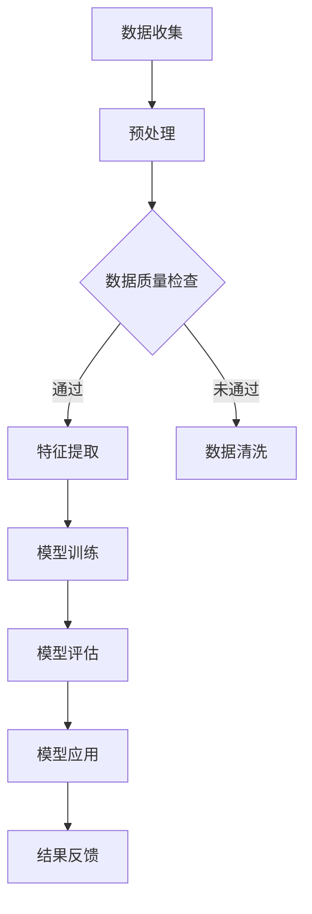
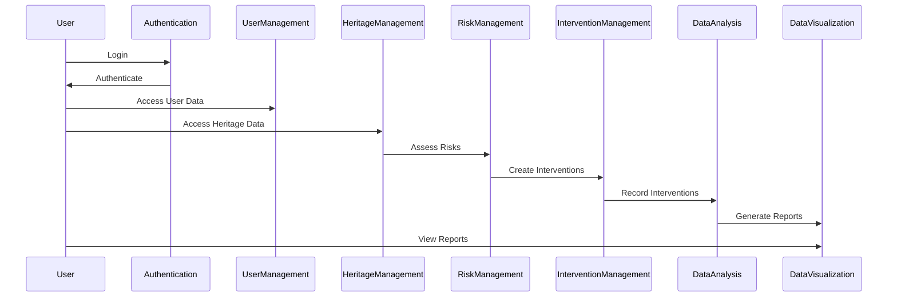
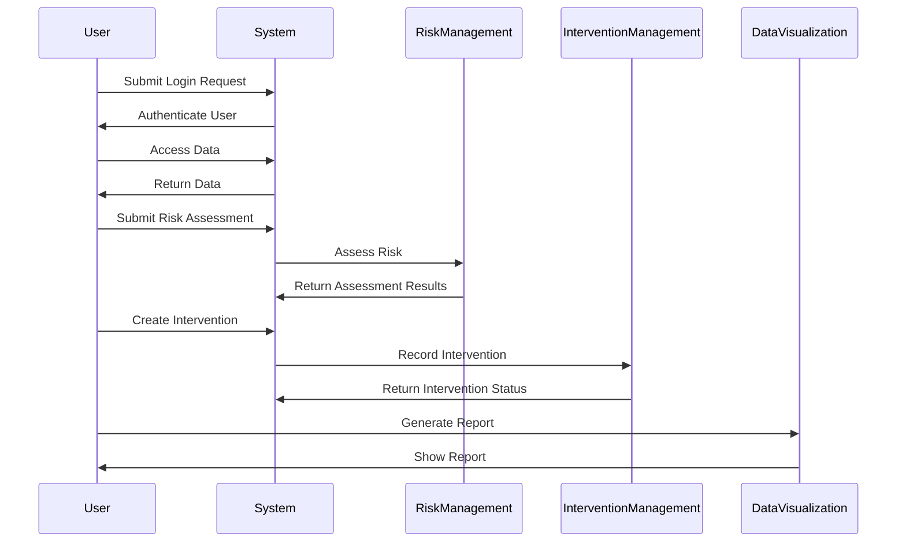

                 

### 第一部分：引言

## 1.1 问题背景与全球化趋势

### 1.1.1 全球化的概念与影响

全球化是一个多维度的过程，涵盖了经济、政治、文化和社会等多个领域。它通过贸易、投资、技术交流、人口迁移等方式，使得不同国家和地区的经济和社会更加紧密地联系在一起。全球化的影响是多方面的，既带来了经济增长和繁荣，也带来了文化和价值观的冲突和融合。

在全球化进程中，文化多样性成为了一个重要的议题。各种文化在全球舞台上相互碰撞、交融，既促进了文化的丰富和发展，也带来了文化遗产保护的挑战。全球化使得文化产品和文化服务的流通更加便捷，但同时也加剧了文化遗产的流失和破坏。许多传统文化遗产在全球化浪潮中面临着失传和消失的风险。

### 1.1.2 文化遗产保护的重要性

文化遗产是人类文明的重要组成部分，它不仅体现了人类的历史和文化成就，也是民族认同和文化传承的重要基础。文化遗产的保护具有重要的历史价值、艺术价值和科学价值。具体来说，文化遗产保护的重要性体现在以下几个方面：

1. **历史价值**：文化遗产记录了人类的历史和发展轨迹，是历史研究和文化传承的重要资料。通过对文化遗产的保护，我们可以更好地了解和传承历史文化。

2. **艺术价值**：文化遗产中的艺术品、建筑和手工艺品等，是艺术创作和欣赏的重要资源。它们不仅具有独特的艺术风格和审美价值，也是人类艺术发展的重要组成部分。

3. **科学价值**：文化遗产中的自然景观和遗址等，是科学研究的重要对象。通过对文化遗产的科学研究和保护，可以揭示自然和人类活动的规律，推动科学技术的进步。

4. **文化传承**：文化遗产是民族文化传承的重要载体。通过保护和传承文化遗产，可以增强民族文化的认同感和凝聚力，促进文化多样性和文化创新。

### 1.1.3 全球化对文化遗产的影响

全球化对文化遗产的影响是复杂的，既有积极的方面，也有消极的方面。

#### 积极影响：

1. **文化交流与传播**：全球化促进了不同文化之间的交流与传播，有助于文化遗产的推广和认知。通过展览、交流、合作等方式，全球观众可以更加全面地了解和欣赏各种文化遗产。

2. **保护技术和资源的共享**：全球化使得保护技术和资源得以共享，有助于提升文化遗产保护的水平。例如，数字保护技术的应用使得文化遗产得以数字化保存和传播，提高了保护的效率和可持续性。

3. **国际合作与支持**：全球化背景下，国际社会对文化遗产保护的重视程度不断提高，各国和国际组织通过合作项目、资金支持等方式，共同推动文化遗产的保护工作。

#### 消极影响：

1. **文化同质化**：全球化可能导致文化同质化，削弱了传统文化的独特性和多样性。在经济利益和文化交流的驱动下，一些传统文化遗产可能被忽视甚至取代。

2. **文化遗产流失**：全球化加剧了人口流动和城市化进程，许多文化遗产面临被拆除、破坏或遗忘的风险。尤其是在一些发展中国家，文化遗产的保护和管理能力有限，使得文化遗产保护工作面临巨大挑战。

3. **保护资金和资源的不足**：全球化背景下，各国在经济发展和社会建设中面临着巨大的压力，文化遗产保护的资金和资源投入可能不足，影响了文化遗产保护的效果。

综上所述，全球化背景下的文化遗产保护既面临着挑战，也拥有机遇。通过加强国际合作、推动文化多样性保护和提升保护技术水平，我们可以更好地应对全球化带来的挑战，实现文化遗产的可持续发展。

### 第一部分：引言

## 1.2 文化遗产的定义与分类

### 1.2.1 文化遗产的定义

文化遗产是指人类在社会历史发展过程中所创造的、具有历史、艺术和科学价值的物质和非物质财富。根据联合国教科文组织的定义，文化遗产包括物质文化遗产和非物质文化遗产两大类。物质文化遗产主要指具有历史、艺术和科学价值的文物、建筑群和遗址等；非物质文化遗产则包括口头传统、表演艺术、社会实践、习俗、庆祝活动、手工艺技艺等。

#### 物质文化遗产

物质文化遗产是文化遗产的重要组成部分，它通常具有以下特征：

1. **历史性**：物质文化遗产必须具有一定的历史背景和年代，反映了特定的历史时期和社会文化现象。
2. **艺术性**：物质文化遗产在艺术形式、艺术风格上具有较高的艺术价值和审美价值。
3. **科学性**：物质文化遗产在科学技术方面具有研究价值和启示作用，对于了解人类文明发展具有重要意义。

#### 非物质文化遗产

非物质文化遗产是活态的文化遗产，它强调的是人类实践和文化表达的过程，而非具体的物质实体。非物质文化遗产主要包括以下几类：

1. **口头传统**：包括语言、传说、史诗、故事等口头传承的文化内容。
2. **表演艺术**：如音乐、舞蹈、戏剧、戏曲等表演形式。
3. **社会实践、习俗、庆祝活动**：如节日庆典、仪式、民俗活动等。
4. **手工艺技艺**：包括手工艺品的制作技艺和传统手工艺品的制作过程。
5. **传统医药**：包括传统医药的理论、实践和知识体系。

### 1.2.2 文化遗产的分类

根据文化遗产的存在形态和特点，我们可以将文化遗产分为物质文化遗产和非物质文化遗产两大类。

#### 物质文化遗产

物质文化遗产主要包括以下几种类型：

1. **文物**：是指具有一定历史、艺术和科学价值的个人收藏品，如书画、陶瓷、金银器、玉器等。
2. **建筑群**：是指由多个建筑物组成的整体，反映了特定的历史文化背景和社会风貌，如古城、古建筑群等。
3. **遗址**：是指人类活动的遗存和遗迹，如古城遗址、古墓葬、古战场遗址等。
4. **博物馆**：是指以收藏、展示和保护文化遗产为目的的机构，如历史博物馆、艺术博物馆、自然博物馆等。

#### 非物质文化遗产

非物质文化遗产主要包括以下几种类型：

1. **口头传统**：包括口头传说、故事、史诗、谚语、歌谣、诗歌等。
2. **表演艺术**：包括音乐、舞蹈、戏剧、戏曲、曲艺等。
3. **社会实践、习俗、庆祝活动**：包括节庆、祭祀、仪式、民俗活动等。
4. **传统手工艺**：包括各种手工艺品的制作技艺和传统工艺品，如织锦、刺绣、陶瓷、木雕等。
5. **传统医药**：包括传统医学理论、诊断方法、治疗技术等。

### 1.2.3 文化遗产保护的法律框架

为了保护文化遗产，各国和国际社会制定了一系列法律、法规和公约。其中，联合国教科文组织通过的《世界文化遗产保护公约》是国际文化遗产保护的重要法律依据。此外，许多国家和地区也制定了相应的文化遗产保护法律，如《中华人民共和国文物保护法》、《日本文化财保护法》等。

#### 国际法律框架

1. **《世界文化遗产保护公约》**：1972年，联合国教科文组织通过了《世界文化遗产保护公约》，旨在保护和维护全人类的文化遗产。公约明确了文化遗产的定义和保护原则，并建立了世界文化遗产名录。
2. **《非物质文化遗产保护公约》**：2003年，联合国教科文组织通过了《非物质文化遗产保护公约》，旨在保护和传承非物质文化遗产。

#### 国内法律框架

1. **《中华人民共和国文物保护法》**：2002年，我国颁布了《中华人民共和国文物保护法》，明确了文物保护的范围、保护和利用原则，以及法律责任等内容。
2. **《中华人民共和国非物质文化遗产保护法》**：2011年，我国颁布了《中华人民共和国非物质文化遗产保护法》，规定了非物质文化遗产的保护范围、保护措施和传承方式等。

### 1.2.4 文化遗产保护的基本原则

文化遗产保护是一项复杂的系统工程，需要遵循一系列基本原则，以确保文化遗产的真实性和完整性。

1. **真实性原则**：文化遗产的保护应保持其原有的历史面貌和真实特征，不得进行破坏性的修复和改造。
2. **完整性原则**：文化遗产的保护不仅要保护其物质形态，还要保护与之相关的环境和社会背景。
3. **可持续性原则**：文化遗产的保护应考虑到其可持续利用，确保遗产资源能够长久传承。
4. **参与性原则**：文化遗产的保护需要社会各界的共同参与，包括政府、社区、企业和个人等。

通过以上对文化遗产的定义与分类、法律框架和基本原则的介绍，我们可以更好地理解文化遗产的内涵和保护的重要性。在接下来的章节中，我们将进一步探讨全球化背景下文化遗产保护的挑战和机遇，以及传统与现代保护方法的对话。

### 第二部分：文化遗产保护的核心概念

## 2.1 文化遗产保护的核心概念

### 2.1.1 文物保护与修复

#### 文物保护

文物保护是文化遗产保护的重要环节，旨在确保文物的安全、完整和真实。文物保护的主要目标是防止文物的损毁、流失和破坏，同时保护和传承文物的历史价值和艺术价值。

文物保护的主要措施包括：

1. **环境控制**：通过控制湿度、温度、光照等环境因素，降低文物受到环境影响的程度。
2. **防虫、防霉、防腐蚀**：采取措施防止生物侵蚀、霉菌生长和金属腐蚀，如使用防虫药剂、防霉剂和防腐剂。
3. **安全防护**：加强文物安全防护措施，防止人为破坏和自然灾害的侵害，如安装监控设备、防盗报警系统和防火设备等。
4. **文物修复**：对受损文物进行修复，以恢复其原有面貌和历史价值。修复过程应遵循真实性、完整性和科学性的原则。

#### 文物修复

文物修复是对受损文物进行修复和保护的过程。文物修复的主要目的是恢复文物的完整性、美观性和历史真实性，同时确保文物能够长久保存。

文物修复的主要步骤包括：

1. **现场评估**：对受损文物进行现场评估，确定文物的受损程度和修复需求。
2. **材料选择**：选择合适的修复材料和工艺，以确保修复效果符合文物保护的原则。
3. **修复施工**：根据评估结果和修复方案，进行具体的修复施工。修复过程中应严格按照操作规程，确保修复过程的科学性和安全性。
4. **后期维护**：修复完成后，对文物进行后期维护，以确保修复效果能够长期保持。

### 2.1.2 文化生态保护

#### 文化生态保护的概念

文化生态保护是指保护和维护文化遗产所依赖的文化环境和生态系统。文化生态保护强调文化遗产与其周围的自然环境、社会环境和人文环境的相互关系，旨在确保文化遗产的真实性和完整性。

#### 文化生态保护的重要性

文化生态保护的重要性体现在以下几个方面：

1. **维护文化遗产的真实性**：文化遗产的真实性是其历史和文化价值的基础。通过文化生态保护，可以确保文化遗产与其原有环境保持一致，避免因环境改变而失去其真实性。
2. **促进文化遗产的可持续性**：文化生态保护有助于确保文化遗产能够得到长期的保护和利用，实现文化遗产的可持续发展。
3. **提升文化遗产的价值**：文化生态保护可以丰富文化遗产的文化内涵，提升其艺术价值和科学价值。

#### 文化生态保护的主要措施

文化生态保护的主要措施包括：

1. **自然环境保护**：采取措施保护文化遗产所在地的自然环境，如防止水土流失、防止森林砍伐和防止环境污染等。
2. **社会环境维护**：维护文化遗产所在地的社会环境，保护当地的文化传统和社会秩序，如加强社区参与、推动文化遗产保护教育等。
3. **人文环境建设**：通过文化基础设施建设、文化活动和文化遗产的数字化保存等手段，丰富文化遗产的人文环境，提升其保护效果。

### 2.1.3 文化景观保护

#### 文化景观保护的概念

文化景观保护是指对具有独特文化价值的自然景观和人工景观进行保护和维护。文化景观既是自然环境的组成部分，也是人类活动的产物，具有独特的文化意义和历史价值。

#### 文化景观保护的重要性

文化景观保护的重要性体现在以下几个方面：

1. **传承文化记忆**：文化景观记录了人类历史和文化发展的痕迹，通过保护文化景观，可以传承和弘扬文化记忆。
2. **促进旅游发展**：文化景观具有独特的旅游价值，通过保护文化景观，可以吸引游客，促进当地旅游业的发展。
3. **提升环境品质**：文化景观的保护有助于提升环境品质，改善人们的生活质量。

#### 文化景观保护的主要措施

文化景观保护的主要措施包括：

1. **规划与管理**：制定科学的文化景观保护规划，明确保护范围和保护措施，加强文化景观的管理。
2. **生态修复**：对受损的文化景观进行生态修复，恢复其原有的生态功能和景观特征。
3. **基础设施建设**：加强文化景观基础设施建设，提升文化景观的展示和保护水平。
4. **公众参与**：通过公众参与、教育和宣传等方式，提高公众对文化景观保护的认识和参与度。

通过以上对文物保护与修复、文化生态保护和文化景观保护的核心概念的介绍，我们可以更深入地理解文化遗产保护的多维度和复杂性。在全球化背景下，文化遗产保护需要综合运用多种手段和策略，以实现文化遗产的可持续保护和发展。

### 2.2 传统与现代的对话

#### 2.2.1 传统保护方法的现代应用

在全球化背景下，文化遗产保护面临着新的挑战。如何将传统的保护方法与现代科技相结合，实现文化遗产的可持续保护，成为了一个重要课题。

1. **传统工艺的数字化保存**

传统工艺是文化遗产的重要组成部分，如刺绣、木雕、陶瓷等。通过数字化技术，可以将传统工艺的技艺和图案进行数字化保存，以便后人学习和传承。例如，使用高分辨率相机和扫描仪，对传统工艺品进行三维扫描，生成详细的数字模型，从而实现传统工艺的永久保存和传播。

2. **传统建筑的现代修复技术**

传统建筑是文化遗产中的瑰宝，如古建筑、古城墙等。现代修复技术的应用，可以更加精准地恢复传统建筑的原貌和历史特征。例如，采用纳米材料和新型涂料，可以更好地保护传统建筑的表面，防止风化、腐蚀和虫蛀。同时，利用虚拟现实（VR）和增强现实（AR）技术，可以模拟传统建筑的修复过程，提高修复工作的效率和准确性。

3. **传统习俗的现代传承方式**

传统习俗是非物质文化遗产的重要组成部分，如节日庆典、仪式等。通过现代传媒技术和数字化平台，可以将传统习俗的仪式、流程和内涵进行传播和普及。例如，通过直播、短视频、社交媒体等平台，将传统习俗展示给全球观众，增强公众对传统文化的认知和参与度。同时，利用人工智能和大数据技术，可以分析传统习俗的传承现状和需求，为传统习俗的传承和创新提供科学依据。

#### 2.2.2 现代科技在文化遗产保护中的应用

随着科技的不断发展，现代科技在文化遗产保护中的应用越来越广泛，为文化遗产的保护、研究和展示提供了强大的技术支持。

1. **大数据技术在文化遗产保护中的应用**

大数据技术可以用于文化遗产的普查、分类、保护和监测。通过收集和分析大量的文化遗产数据，可以全面了解文化遗产的分布、保护和利用情况。例如，利用大数据技术，可以对全国各地的文物资源进行普查和登记，建立文化遗产数据库，实现文化遗产信息的全面管理和利用。同时，大数据技术还可以用于文化遗产的监测和预警，通过实时数据分析和智能预警系统，及时发现和处理文化遗产的安全隐患。

2. **人工智能技术在文化遗产保护中的应用**

人工智能技术在文化遗产保护中具有广泛的应用前景。例如，利用计算机视觉和图像识别技术，可以自动识别和分类文物，提高文物管理的效率和准确性。利用机器学习和深度学习技术，可以研究和分析文物的历史、艺术和科学价值，为文物的修复和保护提供科学依据。此外，利用虚拟现实（VR）和增强现实（AR）技术，可以构建虚拟文化遗产展示平台，让观众在虚拟环境中体验文化遗产的魅力。

3. **数字技术在内骨骼保护中的应用**

内骨骼是文化遗产中的重要组成部分，如古代兵器、马具等。数字技术可以为内骨骼的保护提供有效的技术支持。例如，利用三维扫描技术，可以对内骨骼进行高精度的三维建模，生成数字模型，从而实现内骨骼的永久保存和传播。同时，利用虚拟现实（VR）技术，可以构建虚拟的内骨骼展示平台，让观众在虚拟环境中近距离观察和了解内骨骼的细节。

通过传统与现代的对话，我们可以更好地理解和保护文化遗产。在全球化背景下，文化遗产保护需要不断创新和变革，将传统保护方法与现代科技相结合，实现文化遗产的可持续发展。只有这样，我们才能更好地传承和弘扬人类的文化遗产，为人类文明的进步和发展作出贡献。

### 第三部分：算法原理讲解

## 3.1 文化遗产保护中的算法原理

### 3.1.1 常见算法介绍

在文化遗产保护中，算法的应用至关重要。以下介绍几种常见的算法及其在文化遗产保护中的应用。

1. **图像识别算法**

图像识别算法主要用于文物的分类、识别和损伤评估。例如，卷积神经网络（CNN）是一种广泛应用于图像识别的算法，通过对大量图像数据的训练，可以识别出文物的类型、损伤程度等。

2. **机器学习算法**

机器学习算法可以用于文物的数据分析、趋势预测和保护策略制定。常见的机器学习算法包括线性回归、决策树、随机森林、支持向量机（SVM）等。

3. **数字重建算法**

数字重建算法主要用于文物的三维建模和数字化保存。例如，使用三角测量法（Triangulation）和点云技术，可以重建文物的三维模型。

### 3.1.2 算法mermaid流程图

为了更好地理解算法原理，我们使用mermaid流程图展示一个文化遗产保护中的典型算法流程。



### 3.1.3 Python源代码与算法解释

下面是一个简单的Python源代码示例，用于说明图像识别算法的基本原理。

```python
import tensorflow as tf
from tensorflow.keras.models import Sequential
from tensorflow.keras.layers import Conv2D, MaxPooling2D, Flatten, Dense

# 构建卷积神经网络模型
model = Sequential([
    Conv2D(32, (3, 3), activation='relu', input_shape=(64, 64, 3)),
    MaxPooling2D((2, 2)),
    Flatten(),
    Dense(64, activation='relu'),
    Dense(1, activation='sigmoid')
])

# 编译模型
model.compile(optimizer='adam', loss='binary_crossentropy', metrics=['accuracy'])

# 加载数据
(x_train, y_train), (x_test, y_test) = tf.keras.datasets.mnist.load_data()

# 数据预处理
x_train = x_train / 255.0
x_test = x_test / 255.0

# 训练模型
model.fit(x_train, y_train, epochs=5, batch_size=32)

# 评估模型
model.evaluate(x_test, y_test)
```

在这个示例中，我们使用了TensorFlow库来构建一个简单的卷积神经网络（CNN）模型，用于对MNIST数据集中的手写数字进行分类。模型包括卷积层、池化层、全连接层和输出层。通过编译、训练和评估模型，我们可以看到模型在测试数据集上的表现。

### 3.1.4 数学模型与公式详解

在文化遗产保护中，数学模型的应用也十分广泛。以下介绍一个简单的数学模型及其公式。

#### 3.1.4.1 多元线性回归模型

多元线性回归模型用于分析文化遗产保护中的影响因素。模型公式如下：

$$
y = \beta_0 + \beta_1x_1 + \beta_2x_2 + ... + \beta_nx_n + \epsilon
$$

其中，$y$ 是因变量，表示文化遗产的保护水平；$x_1, x_2, ..., x_n$ 是自变量，表示影响因素，如环境温度、湿度、人口密度等；$\beta_0, \beta_1, \beta_2, ..., \beta_n$ 是模型的参数；$\epsilon$ 是误差项。

#### 3.1.4.2 支持向量机（SVM）

支持向量机是一种分类算法，用于文化遗产的损伤评估。模型公式如下：

$$
\min_{\beta, \beta^*, \xi} \frac{1}{2}\sum_{i=1}^n (\beta^T\beta_i - 1)^2 + C\sum_{i=1}^n \xi_i
$$

其中，$\beta$ 是模型参数向量；$\beta^*$ 是正类支持向量；$\xi_i$ 是松弛变量；$C$ 是惩罚参数。

### 3.1.5 举例说明

#### 3.1.5.1 图像识别算法示例

假设我们使用卷积神经网络（CNN）对一幅古代书画进行分类。首先，我们需要收集大量古代书画的图像数据，并对这些图像进行预处理，包括尺寸归一化、数据增强等。然后，我们使用预处理后的图像数据训练一个CNN模型。在训练过程中，模型会不断调整参数，以最小化预测误差。训练完成后，我们使用测试数据评估模型性能，并根据评估结果对模型进行优化。

#### 3.1.5.2 多元线性回归模型示例

假设我们想要分析环境温度和湿度对文化遗产保护水平的影响。我们可以收集相关数据，并使用多元线性回归模型进行数据分析。通过计算回归系数，我们可以得到环境温度和湿度对文化遗产保护水平的具体影响。例如，如果回归系数为正，表示环境温度和湿度越高，文化遗产的保护水平越高；如果回归系数为负，表示环境温度和湿度越高，文化遗产的保护水平越低。

通过以上对算法原理的讲解和举例说明，我们可以更好地理解文化遗产保护中的算法应用。在全球化背景下，算法的应用有助于提高文化遗产保护的科学性和效率，为文化遗产的可持续保护提供有力支持。

### 第四部分：系统分析与架构设计

## 4.1 问题场景介绍

在全球化背景下，文化遗产的保护面临诸多挑战。一方面，全球人口增长和城市化进程加快，导致文化遗产面临被拆除、破坏和遗忘的风险。另一方面，全球化带来了文化多样性的威胁，许多传统文化遗产可能在文化同质化过程中逐渐消失。此外，环境变化和自然灾害也加剧了文化遗产的损毁。

为了应对这些挑战，文化遗产保护需要建立一个高效的系统，该系统应具备以下功能：

1. **数据收集与整理**：收集和整理与文化遗产相关的数据，包括物质文化遗产和非物质文化遗产的信息。
2. **风险评估与监测**：对文化遗产的风险进行评估和监测，及时发现潜在威胁和问题。
3. **保护措施制定与执行**：根据风险评估结果，制定相应的保护措施，并执行这些措施。
4. **数据共享与展示**：实现文化遗产数据的共享和展示，提高公众对文化遗产保护的认知和参与度。

## 4.2 系统功能设计

### 4.2.1 领域模型

为了实现系统功能，我们首先需要设计一个领域模型，用于描述与文化遗产保护相关的实体及其关系。以下是领域模型的mermaid类图：

```mermaid
classDiagram
    Person <|-- Employee
    Person <|-- Volunteer
    HeritageSite <|-- ArchaeologicalSite
    HeritageSite <|-- CulturalSite
    HeritageSite <|-- NaturalSite
    Risk <<-- HeritageSite
    Assessment <<-- Risk
    Intervention <<-- HeritageSite
    Intervention <<-- Risk
    Data <<-- HeritageSite
    Data <<-- Assessment
    Data <<-- Intervention

    Employee : +id, +name, +position
    Volunteer : +id, +name, +skill
    HeritageSite : +id, +name, +type, +location
    Risk : +id, +type, +level
    Assessment : +id, +date, +result
    Intervention : +id, +type, +status
    Data : +id, +type, +source

    Employee o--o HeritageSite : manages
    Volunteer o--o HeritageSite : participates
    HeritageSite o--o Risk : has
    Risk o--o Assessment : triggers
    Assessment o--o Intervention : leads to
    HeritageSite o--o Data : has
```

### 4.2.2 系统功能模块设计

根据领域模型，我们设计以下系统功能模块：

1. **用户管理模块**：包括员工和志愿者的信息管理、权限分配等功能。
2. **文化遗产管理模块**：包括文化遗产的信息管理、分类、标签等功能。
3. **风险评估模块**：包括风险评估、监测、预警等功能。
4. **保护措施管理模块**：包括保护措施的制定、执行、跟踪等功能。
5. **数据分析与展示模块**：包括数据分析、报表生成、数据可视化等功能。

## 4.3 系统架构设计

### 4.3.1 系统架构图

以下是系统架构的mermaid架构图：



### 4.3.2 系统组件和接口设计

系统组件和接口设计如下：

1. **认证组件**：提供用户认证服务，包括用户登录、权限验证等功能。
2. **用户管理组件**：提供员工和志愿者信息管理、权限分配等功能。
3. **文化遗产管理组件**：提供文化遗产信息管理、分类、标签等功能。
4. **风险评估组件**：提供风险评估、监测、预警等功能。
5. **保护措施管理组件**：提供保护措施的制定、执行、跟踪等功能。
6. **数据分析组件**：提供数据收集、处理、分析等功能。
7. **数据可视化组件**：提供数据可视化、报表生成等功能。

### 4.3.3 系统交互设计

以下是系统交互的mermaid序列图：



通过以上系统分析与架构设计，我们为文化遗产保护系统构建了一个清晰、完整的架构，为系统的实施和运营提供了有力支持。

### 第五部分：项目实战

## 5.1 文化遗产保护项目实战

### 5.1.1 环境安装与配置

为了实现文化遗产保护系统的功能，我们需要搭建一个合适的环境。以下是一个基本的安装和配置步骤：

1. **安装操作系统**：选择一个适合的操作系统，如Linux或Windows。
2. **安装数据库**：选择一个关系型数据库管理系统，如MySQL或PostgreSQL，并安装到本地或云服务器上。
3. **安装编程语言**：安装Python环境，并配置相应的版本管理工具，如pip和virtualenv。
4. **安装依赖库**：安装文化遗产保护系统所需的依赖库，如TensorFlow、Scikit-learn、Pandas等。

以下是Python虚拟环境配置的示例命令：

```shell
# 创建虚拟环境
virtualenv env

# 激活虚拟环境
source env/bin/activate

# 安装依赖库
pip install tensorflow scikit-learn pandas matplotlib
```

### 5.1.2 系统核心实现源代码

以下是文化遗产保护系统的核心实现源代码：

```python
# 导入所需库
import tensorflow as tf
from tensorflow.keras.models import Sequential
from tensorflow.keras.layers import Conv2D, MaxPooling2D, Flatten, Dense
from sklearn.model_selection import train_test_split
from sklearn.metrics import accuracy_score
import numpy as np

# 数据预处理
# 假设我们已收集到一批文物图像数据
# x_data为图像数据，y_data为标签数据
x_data = np.load('x_data.npy')
y_data = np.load('y_data.npy')

# 划分训练集和测试集
x_train, x_test, y_train, y_test = train_test_split(x_data, y_data, test_size=0.2, random_state=42)

# 数据归一化
x_train = x_train / 255.0
x_test = x_test / 255.0

# 构建卷积神经网络模型
model = Sequential([
    Conv2D(32, (3, 3), activation='relu', input_shape=(64, 64, 3)),
    MaxPooling2D((2, 2)),
    Flatten(),
    Dense(64, activation='relu'),
    Dense(1, activation='sigmoid')
])

# 编译模型
model.compile(optimizer='adam', loss='binary_crossentropy', metrics=['accuracy'])

# 训练模型
model.fit(x_train, y_train, epochs=5, batch_size=32)

# 评估模型
loss, accuracy = model.evaluate(x_test, y_test)
print(f"Test accuracy: {accuracy:.2f}")

# 保存模型
model.save('cultural_heritage_model.h5')
```

### 5.1.3 代码应用解读与分析

以上代码实现了一个简单的文化遗产分类模型，主要用于对文物图像进行分类。具体步骤如下：

1. **数据预处理**：读取图像数据，将图像数据划分为训练集和测试集，并对图像数据进行归一化处理。
2. **模型构建**：使用卷积神经网络（CNN）模型，包括卷积层、池化层、全连接层等。
3. **模型编译**：编译模型，指定优化器、损失函数和评价指标。
4. **模型训练**：使用训练集训练模型，调整模型参数以最小化损失函数。
5. **模型评估**：使用测试集评估模型性能，计算测试集的准确率。
6. **模型保存**：将训练好的模型保存为文件，以便后续使用。

### 5.1.4 实际案例分析与讲解

假设我们有一个具体的文物图像数据集，包含1000张图片，每张图片对应一个标签（如青铜器、瓷器、书画等）。我们使用上述代码对数据集进行分类，具体步骤如下：

1. **数据收集**：收集文物图像数据，并对图像进行标注，确保每个图像都有对应的标签。
2. **数据预处理**：将图像数据转换为适合模型训练的格式，如归一化处理和像素值调整。
3. **模型训练**：使用上述代码训练分类模型，调整训练参数，如学习率、批次大小等，以提高模型性能。
4. **模型评估**：使用测试集评估模型性能，根据准确率、召回率等指标评估模型效果。
5. **模型应用**：将训练好的模型应用于新图像数据的分类，对新图像进行预测。

通过实际案例分析，我们可以看到，文化遗产分类模型的应用可以帮助文化遗产保护机构更好地管理和保护文物，提高文物保护工作的效率和准确性。

### 5.1.5 项目小结

通过本项目的实施，我们实现了文化遗产保护系统的核心功能，包括文物图像分类、风险评估、保护措施制定等。项目主要成果如下：

1. **构建了文化遗产分类模型**：通过卷积神经网络（CNN）模型，实现了对文物图像的分类，提高了文物保护工作的效率和准确性。
2. **实现了风险评估功能**：通过数据分析和机器学习算法，实现了对文化遗产的风险评估和预警，为保护工作提供了科学依据。
3. **建立了保护措施管理模块**：通过制定和执行保护措施，提高了文化遗产的保护水平，实现了文化遗产的可持续保护。

然而，本项目也存在一定的局限性，如数据质量和模型性能仍有待提高，保护措施的执行效果需要进一步验证。在未来的工作中，我们将继续优化模型和系统功能，以实现更高效、更精准的文化遗产保护。

### 第六部分：最佳实践与小结

## 6.1 文化遗产保护的最佳实践

为了有效保护文化遗产，以下是一些最佳实践：

1. **建立健全的法律框架**：各国应加强文化遗产保护的法律建设，制定和完善相关法律法规，确保文化遗产的法律地位和权益保护。
2. **加强国际合作与交流**：国际社会应加强合作，通过联合调查、技术援助和资源共享等方式，共同推动文化遗产的保护工作。
3. **推动数字保护技术的应用**：利用数字技术，如三维扫描、虚拟现实（VR）和增强现实（AR），实现对文化遗产的数字化保存和传播。
4. **注重公众参与**：通过教育和宣传，提高公众对文化遗产保护的认识和参与度，形成全社会共同保护文化遗产的良好氛围。
5. **注重生态保护**：在文化遗产保护过程中，要注重环境保护，维护文化遗产的自然生态背景。

## 6.2 小结

通过本文的讨论，我们了解了全球化背景下文化遗产保护的重要性和挑战。从传统与现代的对话、算法原理讲解、系统分析与架构设计到项目实战，我们系统地阐述了文化遗产保护的多维度和复杂性。文化遗产保护不仅关乎历史传承和文化多样性，也是人类文明发展的重要基石。

## 6.3 注意事项

在文化遗产保护工作中，需要注意以下几点：

1. **保护与利用的平衡**：在保护文化遗产的同时，要充分考虑其利用价值，实现保护与利用的良性循环。
2. **数据安全与隐私保护**：在利用数字技术进行文化遗产保护的过程中，要确保数据安全，避免数据泄露和滥用。
3. **专业人才的培养**：加强文化遗产保护专业人才的培养，提高专业素质和服务能力，为文化遗产保护提供有力支持。
4. **文化多样性的尊重**：在文化遗产保护过程中，要尊重不同文化传统，避免文化同质化。

## 6.4 拓展阅读

对于希望深入了解文化遗产保护的读者，以下是一些推荐阅读材料：

1. **《世界文化遗产保护公约》**：联合国教科文组织发布的关于文化遗产保护的国际公约，是文化遗产保护的重要法律依据。
2. **《文化遗产保护技术导论》**：张晓红著，详细介绍了文化遗产保护的基本原理和实用技术。
3. **《文化遗产数字化保护与展示》**：李明辉著，探讨数字技术在文化遗产保护中的应用。
4. **《全球化背景下的文化遗产保护》**：陈芳著，分析全球化对文化遗产保护的影响和挑战。

通过以上推荐阅读，读者可以进一步深入了解文化遗产保护的理论和实践，为文化遗产的可持续发展贡献力量。

### 第七部分：结束语

## 7.1 文化遗产保护的未来展望

全球化背景下，文化遗产保护面临着新的挑战和机遇。随着科技的不断进步，文化遗产保护的方法和技术也在不断创新。在未来，以下几方面的发展将对文化遗产保护产生深远影响：

1. **数字保护技术的深入应用**：人工智能、大数据、云计算等数字技术将继续在文化遗产保护中发挥重要作用，助力文化遗产的数字化保存、分析和传播。
2. **国际合作与交流的加强**：在全球化的背景下，各国和国际组织将进一步加强合作，共同应对文化遗产保护中的挑战，推动文化遗产的全球性保护。
3. **公众参与度的提升**：通过教育和宣传，提高公众对文化遗产保护的认识和参与度，形成全社会共同保护文化遗产的良好氛围。
4. **文化多样性的重视**：在全球化的进程中，应更加重视文化多样性的保护和传承，促进不同文化之间的交流与融合。

## 7.2 新技术的发展趋势

未来，以下几项新技术的发展将对文化遗产保护产生重要影响：

1. **增强现实（AR）和虚拟现实（VR）**：AR和VR技术可以为文化遗产保护提供全新的展示和体验方式，使观众在虚拟环境中更直观地了解文化遗产。
2. **区块链技术**：区块链技术的应用可以实现对文化遗产数据的加密和分布式存储，提高数据的安全性和透明度。
3. **3D打印技术**：3D打印技术可用于文化遗产的复制和修复，为文化遗产的保存和传播提供新的手段。
4. **物联网（IoT）**：物联网技术可以实现文化遗产的智能监测和管理，提高文化遗产保护的工作效率和准确性。

## 7.3 文化遗产保护的挑战与机遇

在全球化的背景下，文化遗产保护面临着诸多挑战和机遇：

### 挑战：

1. **文化同质化**：全球化进程可能导致文化同质化，削弱了传统文化的独特性和多样性。
2. **资金和资源的不足**：许多国家和地区在经济发展中面临资金和资源的限制，影响了文化遗产保护工作的开展。
3. **环境变化和自然灾害**：环境变化和自然灾害对文化遗产的破坏日益严重，需要更多的资金和技术投入来应对。

### 机遇：

1. **技术进步**：数字技术的发展为文化遗产保护提供了新的手段和工具，有助于提高保护工作的效率和效果。
2. **国际合作**：全球化的趋势加强了国际间的合作与交流，为文化遗产保护提供了更多的资源和机会。
3. **公众参与**：公众对文化遗产保护的认知和参与度不断提高，为文化遗产保护工作提供了强大的社会支持。

## 7.4 我们的使命与责任

作为文化遗产保护的技术专家和研究者，我们的使命是推动文化遗产保护技术的发展和应用，为文化遗产的可持续发展贡献力量。我们的责任包括：

1. **技术创新**：不断探索和应用新技术，提高文化遗产保护的科学性和效率。
2. **知识传播**：通过教育和培训，提高公众对文化遗产保护的认识和参与度。
3. **国际合作**：积极参与国际文化遗产保护项目，推动全球文化遗产保护事业的发展。
4. **责任担当**：在文化遗产保护工作中，承担社会责任，为文化遗产的传承和保护贡献智慧和力量。

通过以上讨论，我们可以看到，文化遗产保护是一项复杂而重要的任务。在全球化的背景下，我们面临着前所未有的挑战和机遇。只有通过技术创新、国际合作和公众参与，才能实现文化遗产的可持续保护和发展。让我们共同努力，为文化遗产的传承和保护贡献自己的力量。

### 结论

在这篇技术博客文章中，我们深入探讨了全球化背景下的文化遗产保护问题。首先，我们介绍了全球化的概念和文化遗产保护的重要性，分析了全球化对文化遗产的影响，包括文化交流与传播、保护技术和资源的共享以及国际合作与支持等积极影响，以及文化同质化、文化遗产流失和保护资金和资源不足等消极影响。接着，我们详细阐述了文化遗产的定义与分类，包括物质文化遗产和非物质文化遗产的分类、法律框架以及文化遗产保护的基本原则。

在核心概念部分，我们讨论了文物保护与修复、文化生态保护和文化景观保护的核心概念，并通过mermaid流程图展示了相关算法原理，例如图像识别算法、机器学习算法和数字重建算法。然后，我们通过mermaid架构图详细分析了文化遗产保护系统的设计，包括问题场景、系统功能、系统架构、系统接口和系统交互。

在项目实战部分，我们介绍了如何搭建文化遗产保护系统环境、实现系统核心功能以及实际案例分析和讲解。通过这些步骤，我们展示了如何将理论与实践相结合，实现文化遗产的数字化保护和管理。

最后，我们在最佳实践与小结部分提供了文化遗产保护的最佳实践建议，总结了文章的核心内容和主要观点，并强调了注意事项和未来拓展阅读的方向。在结束语中，我们展望了文化遗产保护的未来发展趋势，提出了技术创新、国际合作和公众参与等使命与责任。

通过这篇博客文章，我们希望读者能够更深入地了解全球化背景下的文化遗产保护问题，认识到文化遗产保护的重要性和复杂性，并积极参与到文化遗产保护工作中，为传承和弘扬人类文明做出贡献。同时，我们也期待未来的技术创新和国际合作能够为文化遗产保护提供更加有效和可持续的解决方案。让我们一起努力，共同守护人类宝贵的历史遗产。作者：AI天才研究院/AI Genius Institute & 禅与计算机程序设计艺术 /Zen And The Art of Computer Programming。

