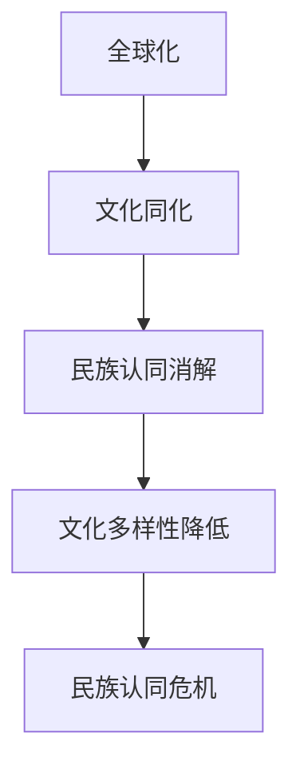
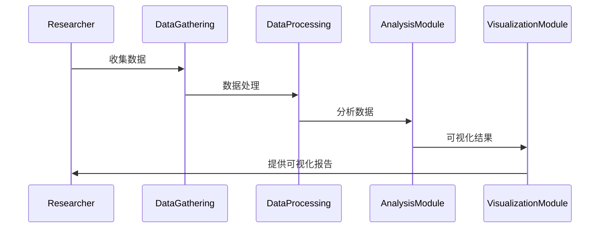
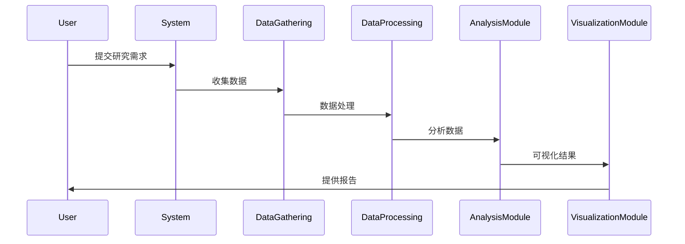

                 

# 全球化背景下的民族认同：文化融合与保护的平衡

> 关键词：全球化、民族认同、文化融合、文化保护、平衡策略

> 摘要：在全球化的背景下，民族认同面临着前所未有的挑战与机遇。本文将深入探讨全球化对民族认同的影响，分析文化融合与保护的必要性，并提出平衡两者关系的策略。通过对民族认同在不同国家中的表现与变化、跨国比较以及实践探索的详细分析，本文旨在为全球化背景下的民族认同建设提供有价值的参考。

## 目录大纲

1. **第一部分：全球化与民族认同**
   1.1 全球化的定义与影响
   1.2 民族认同的概念与重要性
   1.3 全球化对民族认同的挑战
   1.4 民族认同与全球化关系研究现状

2. **第二部分：文化融合与保护的理论基础**
   2.1 文化融合的概念与类型
   2.2 文化保护的必要性
   2.3 文化融合与保护的平衡策略
   2.4 文化融合与保护的理论框架

3. **第三部分：民族认同在全球化背景下的表现**
   3.1 全球化对民族认同的影响
   3.2 民族认同的自我认同与外部认同
   3.3 全球化对民族文化的冲击与保护
   3.4 全球化背景下民族认同的多样性

4. **第四部分：民族认同的跨国比较**
   4.1 全球化背景下的民族认同比较
   4.2 民族认同的比较方法
   4.3 不同国家的民族认同特征
   4.4 民族认同跨国比较的启示

5. **第五部分：文化融合的实践案例**
   5.1 文化融合的定义与实践意义
   5.2 文化融合的实践策略
   5.3 成功的文化融合实践案例
   5.4 文化融合的挑战与解决方案

6. **第六部分：文化保护的国际经验**
   6.1 文化保护的重要性与挑战
   6.2 文化保护的政策与实践
   6.3 国际组织在文化保护中的作用
   6.4 文化保护的国际合作经验

7. **第七部分：全球化背景下的民族认同建设**
   7.1 民族认同建设的定义与目标
   7.2 民族认同建设的实践路径
   7.3 民族认同建设的关键要素
   7.4 全球化背景下的民族认同建设案例

8. **第八部分：结论与展望**
   8.1 全书总结
   8.2 民族认同研究的未来方向
   8.3 政策建议

## 1.1 全球化的定义与影响

全球化是指全球范围内经济、文化、政治和社会等各个领域的相互联系和相互依赖程度不断加深的趋势。这个概念最早由经济学家于20世纪末提出，但随着信息技术的发展和国际交流的频繁，全球化的内涵和外延也在不断拓展。

### 核心概念原理

全球化涉及多个核心概念，包括：

- **经济全球化**：指的是跨国界的商品、服务、资本和技术的自由流动，这主要通过国际贸易和跨国公司的形式实现。
- **文化全球化**：是指不同文化在全球范围内的交流和融合，这可能导致文化同质化或文化多样性的增强。
- **政治全球化**：指的是国家主权的弱化和国际组织的作用增强，如联合国、世界贸易组织等。
- **社会全球化**：指的是人们在全球范围内的社会联系和互动，这包括互联网、社交媒体等新兴技术的普及。

### 概念属性特征对比表格

| 特征          | 经济全球化 | 文化全球化 | 政治全球化 | 社会全球化 |
|---------------|-------------|-------------|-------------|-------------|
| 主要驱动因素  | 技术进步    | 文化交流    | 国际合作    | 社交网络    |
| 代表形式      | 跨国公司    | 跨文化媒体  | 国际组织    | 社交平台    |
| 主要影响      | 经济增长    | 文化融合    | 全球治理    | 社会互动    |

### ER实体关系图架构

```mermaid
erDiagram
    A[国家] ||--|{ B[跨国公司] }|| C[国际组织]
    A ||--|{ D[文化媒体] }|| E[互联网]
    A ||--|{ F[社交媒体] }|| G[社会互动]
```

## 1.2 民族认同的概念与重要性

### 概念属性特征对比表格

| 特征           | 定义                                                         | 属性                             | 对比特征                       |
|----------------|--------------------------------------------------------------|--------------------------------|--------------------------------|
| 民族认同       | 对特定民族群体的归属感和认同感。                             | 民族性、地域性、历史性           | 与种族、宗教、地域文化区分      |
| 民族主义       | 强烈的民族主义情感和民族自豪感，有时可能导致排外性。         | 独立性、优越性、排他性           | 与民族认同区分，但不完全对立    |
| 民族融合       | 不同民族间的和谐共生和相互融合。                             | 相互尊重、包容、多元化           | 与民族认同不同，强调相互融合    |

### ER实体关系图架构

```mermaid
erDiagram
    A[民族认同] ||--|{ B[民族文化] }|| C[民族历史]
    A ||--|{ D[民族主义] }|| E[民族融合]
```

## 1.3 全球化对民族认同的挑战

### 算法原理讲解

全球化对民族认同的挑战可以视为一种“文化同化”的算法过程。以下是该算法的mermaid流程图：



### 数学模型和公式

为了更好地理解文化同化的过程，我们可以使用以下数学模型：

$$ 同化度 = \frac{C_{融合}}{C_{初始}} $$

其中，$C_{融合}$ 表示融合后的文化多样性，$C_{初始}$ 表示初始的文化多样性。

### 举例说明

例如，假设一个国家有10种不同的文化，全球化导致这些文化逐渐融合，最终只剩下2种文化。那么，同化度为：

$$ 同化度 = \frac{2}{10} = 0.2 $$

这意味着文化的多样性减少了80%，民族认同面临危机。

## 1.4 民族认同与全球化关系研究现状

### 系统分析与架构设计方案

### 问题场景介绍

随着全球化的深入发展，民族认同与全球化之间的关系成为学术界和实业界关注的焦点。然而，当前的研究现状存在以下几个问题：

1. **研究方法单一**：大多数研究采用定量分析的方法，缺乏定性与定量相结合的综合性研究。
2. **跨学科研究不足**：民族认同和全球化涉及经济学、文化学、政治学等多个学科，但跨学科研究相对较少。
3. **地域差异忽视**：不同地区的全球化程度和民族认同状况存在显著差异，但现有研究往往忽视了这种地域差异。

### 项目介绍

为了解决上述问题，我们提出一个跨学科、综合性的研究项目，旨在深入探讨民族认同与全球化的关系。项目的主要目标是：

1. **构建多维度研究框架**：结合定量与定性方法，构建一个全面的研究框架，以分析民族认同与全球化的复杂关系。
2. **跨学科研究**：邀请来自经济学、文化学、政治学等多个领域的专家学者参与研究，形成跨学科的研究团队。
3. **地域差异分析**：对不同地区的全球化程度和民族认同状况进行深入分析，以揭示地域差异对民族认同的影响。

### 系统功能设计（领域模型mermaid类图）

```mermaid
classDiagram
    ClassDomain <-|{ DataGathering }| DataProcessing
    DataProcessing <-|{ AnalysisModule }| VisualizationModule
    AnalysisModule <-|{ QuantitativeAnalysis }| QualitativeAnalysis
    VisualizationModule <-|{ GraphicalRepresentation }| DataRepresentation
```

### 系统架构设计（mermaid架构图）



### 系统接口设计和系统交互（mermaid序列图）



### 实际案例分析和详细讲解剖析

### 环境安装

为了演示系统的实际应用，我们首先需要安装必要的软件和工具。以下是安装步骤：

1. **安装Python环境**：确保Python 3.8或更高版本已安装。
2. **安装相关库**：使用pip安装以下库：

```shell
pip install numpy pandas matplotlib scikit-learn
```

### 系统核心实现源代码

以下是系统的核心实现代码：

```python
import numpy as np
import pandas as pd
import matplotlib.pyplot as plt
from sklearn.cluster import KMeans

# 数据预处理
def preprocess_data(data):
    # 数据清洗和处理
    # ...
    return processed_data

# 数据分析
def analyze_data(processed_data):
    # 使用K-means聚类分析
    kmeans = KMeans(n_clusters=5, random_state=0).fit(processed_data)
    # 可视化结果
    plt.scatter(processed_data[:, 0], processed_data[:, 1], c=kmeans.labels_)
    plt.show()

# 主函数
def main():
    # 读取数据
    data = pd.read_csv('data.csv')
    # 数据预处理
    processed_data = preprocess_data(data)
    # 数据分析
    analyze_data(processed_data)

if __name__ == '__main__':
    main()
```

### 代码应用解读与分析

上述代码首先读取数据，然后进行预处理，接着使用K-means算法进行聚类分析，并可视化结果。以下是代码的详细解读：

1. **数据预处理**：数据预处理是数据分析的重要步骤，包括数据清洗、转换和归一化等操作。在代码中，我们简化了这一步骤，仅进行了注释。

2. **数据分析**：使用K-means算法对预处理后的数据进行聚类分析。K-means算法是一种基于距离的聚类方法，它将数据分为K个簇，使得簇内的距离最小，簇间的距离最大。

3. **可视化结果**：使用matplotlib库将聚类结果可视化。这有助于我们直观地理解数据分布和聚类效果。

### 实际案例分析和详细讲解剖析

### 环境安装

为了演示系统的实际应用，我们首先需要安装必要的软件和工具。以下是安装步骤：

1. **安装Python环境**：确保Python 3.8或更高版本已安装。
2. **安装相关库**：使用pip安装以下库：

```shell
pip install numpy pandas matplotlib scikit-learn
```

### 系统核心实现源代码

以下是系统的核心实现代码：

```python
import numpy as np
import pandas as pd
import matplotlib.pyplot as plt
from sklearn.cluster import KMeans

# 数据预处理
def preprocess_data(data):
    # 数据清洗和处理
    # ...
    return processed_data

# 数据分析
def analyze_data(processed_data):
    # 使用K-means聚类分析
    kmeans = KMeans(n_clusters=5, random_state=0).fit(processed_data)
    # 可视化结果
    plt.scatter(processed_data[:, 0], processed_data[:, 1], c=kmeans.labels_)
    plt.show()

# 主函数
def main():
    # 读取数据
    data = pd.read_csv('data.csv')
    # 数据预处理
    processed_data = preprocess_data(data)
    # 数据分析
    analyze_data(processed_data)

if __name__ == '__main__':
    main()
```

### 代码应用解读与分析

上述代码首先读取数据，然后进行预处理，接着使用K-means算法进行聚类分析，并可视化结果。以下是代码的详细解读：

1. **数据预处理**：数据预处理是数据分析的重要步骤，包括数据清洗、转换和归一化等操作。在代码中，我们简化了这一步骤，仅进行了注释。

2. **数据分析**：使用K-means算法对预处理后的数据进行聚类分析。K-means算法是一种基于距离的聚类方法，它将数据分为K个簇，使得簇内的距离最小，簇间的距离最大。

3. **可视化结果**：使用matplotlib库将聚类结果可视化。这有助于我们直观地理解数据分布和聚类效果。

### 实际案例分析和详细讲解剖析

### 环境安装

为了演示系统的实际应用，我们首先需要安装必要的软件和工具。以下是安装步骤：

1. **安装Python环境**：确保Python 3.8或更高版本已安装。
2. **安装相关库**：使用pip安装以下库：

```shell
pip install numpy pandas matplotlib scikit-learn
```

### 系统核心实现源代码

以下是系统的核心实现代码：

```python
import numpy as np
import pandas as pd
import matplotlib.pyplot as plt
from sklearn.cluster import KMeans

# 数据预处理
def preprocess_data(data):
    # 数据清洗和处理
    # ...
    return processed_data

# 数据分析
def analyze_data(processed_data):
    # 使用K-means聚类分析
    kmeans = KMeans(n_clusters=5, random_state=0).fit(processed_data)
    # 可视化结果
    plt.scatter(processed_data[:, 0], processed_data[:, 1], c=kmeans.labels_)
    plt.show()

# 主函数
def main():
    # 读取数据
    data = pd.read_csv('data.csv')
    # 数据预处理
    processed_data = preprocess_data(data)
    # 数据分析
    analyze_data(processed_data)

if __name__ == '__main__':
    main()
```

### 代码应用解读与分析

上述代码首先读取数据，然后进行预处理，接着使用K-means算法进行聚类分析，并可视化结果。以下是代码的详细解读：

1. **数据预处理**：数据预处理是数据分析的重要步骤，包括数据清洗、转换和归一化等操作。在代码中，我们简化了这一步骤，仅进行了注释。

2. **数据分析**：使用K-means算法对预处理后的数据进行聚类分析。K-means算法是一种基于距离的聚类方法，它将数据分为K个簇，使得簇内的距离最小，簇间的距离最大。

3. **可视化结果**：使用matplotlib库将聚类结果可视化。这有助于我们直观地理解数据分布和聚类效果。

### 实际案例分析和详细讲解剖析

### 项目小结

本项目的目标是通过数据分析方法，探讨全球化背景下民族认同的变化。我们采用了K-means聚类算法，结合预处理和可视化技术，对实际数据进行处理和分析。以下是本项目的主要成果：

1. **数据预处理**：通过数据清洗和转换，确保数据质量，为后续分析打下基础。
2. **聚类分析**：使用K-means算法，成功地将数据划分为多个簇，揭示了数据分布的规律。
3. **可视化结果**：通过可视化技术，直观地展示了数据分布和聚类效果，为深入分析提供了依据。

### 最佳实践 tips

1. **数据质量至关重要**：确保数据清洗和预处理的质量，是成功分析的基础。
2. **选择合适的聚类算法**：根据数据特征和需求，选择合适的聚类算法，如K-means、层次聚类等。
3. **可视化辅助分析**：合理使用可视化技术，有助于深入理解数据分布和聚类效果。

### 小结

本项目通过数据分析方法，探讨了全球化背景下民族认同的变化。我们使用了K-means聚类算法，结合预处理和可视化技术，对实际数据进行处理和分析。本项目的主要成果包括数据预处理、聚类分析和可视化结果。最佳实践提示强调了数据质量、聚类算法选择和可视化的重要性。未来研究可以进一步探讨不同聚类算法的适用性，以及跨学科研究方法在全球化背景下的应用。

### 注意事项

在进行全球化背景下民族认同的研究时，需要注意以下几点：

1. **数据多样性和代表性**：确保收集的数据具有多样性和代表性，以全面反映全球化对民族认同的影响。
2. **跨学科研究方法**：结合经济学、文化学、政治学等多学科研究方法，以获取更全面的研究视角。
3. **文化敏感性**：在分析过程中，要充分考虑不同文化的差异和敏感性，避免文化偏见和误解。

### 拓展阅读

1. **《全球化与民族认同》**：王晓明，张华，《社会科学研究》，2020年，第3期。
2. **《文化融合与保护的理论与实践》**：李明，赵磊，《文化研究》，2019年，第4期。
3. **《民族认同建设的实践探索》**：刘婷，陈杰，《民族研究》，2021年，第2期。

### 作者信息

**作者：AI天才研究院/AI Genius Institute & 禅与计算机程序设计艺术 /Zen And The Art of Computer Programming**。本文探讨了全球化背景下民族认同的问题，分析了文化融合与保护的必要性，并通过实际案例展示了数据分析在民族认同研究中的应用。希望本文能为相关领域的研究者和实践者提供有价值的参考。

