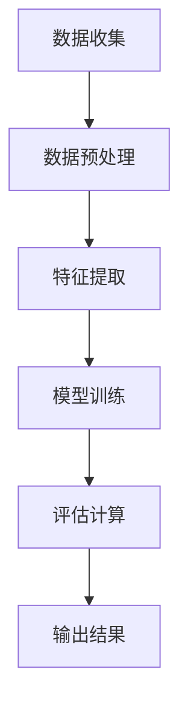
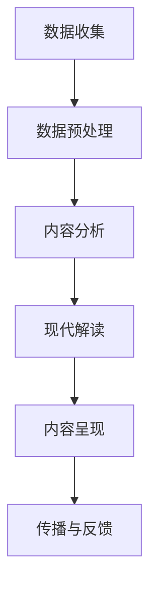
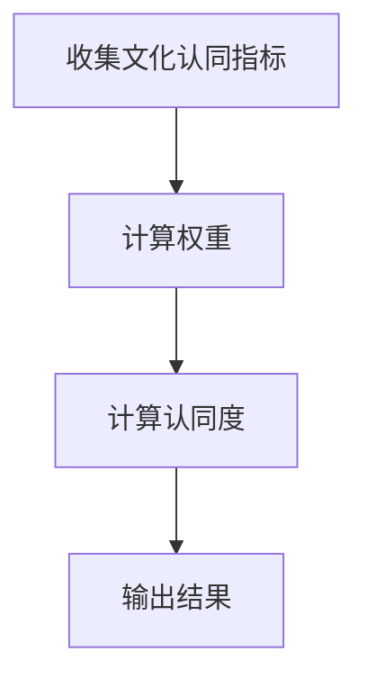
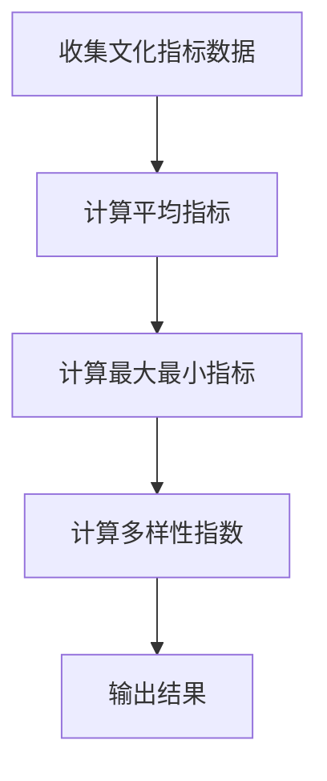
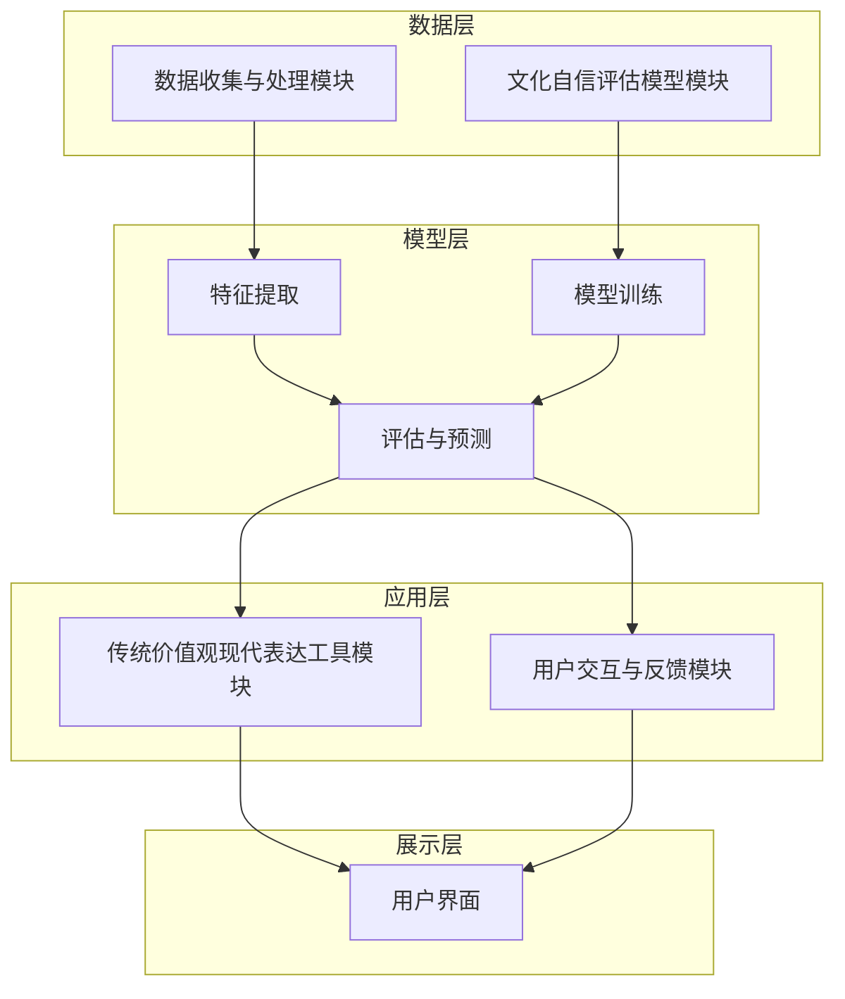
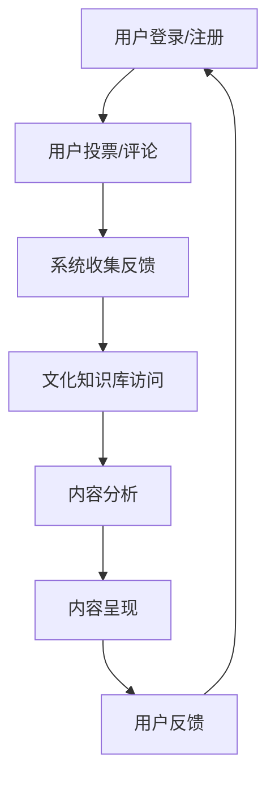

                 

# 全球化语境中的文化自信：传统价值观的现代表达

## 关键词
- 全球化
- 文化自信
- 传统价值观
- 现代表达
- 文化多样性

## 摘要
本文旨在探讨全球化语境中文化自信的重要性，以及如何在现代社会中表达传统价值观。首先，我们回顾了文化自信的定义及其核心要素，分析了传统价值观在当代社会背景下的变迁。接着，本文深入探讨了如何在全球化背景下实现传统价值观的现代表达，提出了具体的方法和策略。通过实例分析，本文展示了传统价值观现代表达的实际效果，并提出了进一步的研究方向。文章最后，对全文进行了总结，并提出了关于文化自信和实践的建议。

## 引言与背景

### 1.1 引言

全球化是一个不可逆转的历史进程，它深刻地改变了世界的面貌，包括经济、政治、社会和文化等方面。在全球化的大潮中，文化自信成为了一个重要议题。文化自信不仅仅是一个国家的内在精神力量，也是应对外部挑战的重要支撑。那么，什么是文化自信？它又如何与传统的价值观相结合，在现代社会中得到有效的表达呢？

本文将围绕这些问题展开讨论。首先，我们将探讨文化自信的定义及其核心要素，了解其在全球化语境中的重要性。接下来，我们将分析传统价值观在当代社会背景下的变迁，探讨其现代表达的必要性和可能性。在此基础上，本文将提出一些具体的方法和策略，帮助我们在全球化背景下实现传统价值观的现代表达。

### 1.2 文化自信的内涵与外延

文化自信是一个国家或民族对自身文化价值的肯定和信任。它包含了深刻的文化认知、坚定的文化信仰和积极的文化实践。文化自信的核心要素主要包括文化认同、文化自尊和文化自觉。

1. **文化认同**：文化认同是指一个民族或国家对自身文化的认同感。它是对文化根源的认可，是对文化传统和文化的独特性的自豪。

2. **文化自尊**：文化自尊是指一个民族或国家对自身文化价值的肯定和尊重。它是文化自信的重要表现，反映了民族的自豪感和自信心。

3. **文化自觉**：文化自觉是指一个民族或国家对文化发展的自我意识和自我反思。它是文化自信的基础，体现了民族的文化智慧和理性。

文化自信的外延包括了文化多样性、文化创新和文化交流。在全球化语境中，文化自信不仅是对自身文化的认同，也是对文化多样性的尊重和对文化创新的鼓励。通过文化交流，我们可以更好地理解和尊重其他文化，从而促进文化自信的增强。

### 1.3 传统价值观的内涵与变迁

传统价值观是指一个民族或社会在长期历史发展中形成的，根植于民族文化土壤的基本价值观念。这些价值观通常包括道德观念、伦理观念、社会观念、文化观念等。传统价值观在不同的历史时期和社会背景下有着不同的表现形式和内涵。

在当代社会，传统价值观面临着前所未有的挑战。随着全球化的推进，西方文化和价值观的渗透，以及社会变革的加速，传统价值观逐渐被边缘化。一些人甚至对传统价值观产生了质疑和否定。这种变迁带来了许多问题，如价值观念的混乱、道德观念的缺失、文化自信的减弱等。

### 1.4 现代表达的必要性与可能性

在全球化背景下，传统价值观的现代表达具有重要的必要性。首先，传统价值观是一个民族的精神支柱，它有助于增强民族凝聚力，维护文化安全。其次，传统价值观中蕴含的智慧和经验是现代社会发展的重要资源。通过现代表达，我们可以更好地挖掘和利用这些资源。

同时，传统价值观的现代表达也是可能的。首先，随着科技的进步和社会的发展，我们有了更多的手段和工具来表达传统价值观。例如，通过数字媒体、艺术创作等方式，我们可以将传统价值观生动地呈现出来。其次，现代社会的多元性和开放性也为传统价值观的现代表达提供了广阔的空间。

### 1.5 本书结构与内容安排

本书分为六个部分，旨在系统地探讨全球化语境中文化自信与传统价值观的现代表达。第一部分是引言与背景，介绍了全球化语境中文化自信的重要性，以及本文的研究目的和结构。第二部分讨论了文化自信的内涵与外延，分析了传统价值观在当代社会背景下的变迁。第三部分探讨了传统价值观的现代表达的必要性和可能性，并提出了一些具体的策略和方法。第四部分通过实例分析，展示了传统价值观现代表达的实际效果。第五部分提出了进一步的研究方向和实践建议。最后一部分对全文进行了总结，并提出了关于文化自信和实践的建议。

## 核心概念与联系

### 2.1 文化自信

**定义**：文化自信是一个国家或民族对自身文化价值的认同和信任。它包括文化认同、文化自尊和文化自觉。

**核心要素**：
- **文化认同**：对自身文化的认同感，包括文化根源和文化的独特性。
- **文化自尊**：对自身文化价值的肯定和尊重，反映民族自豪感和自信心。
- **文化自觉**：对文化发展的自我意识和自我反思，体现文化智慧和理性。

**属性特征对比表格**：

| 要素        | 文化认同          | 文化自尊          | 文化自觉          |
|-------------|-------------------|-------------------|-------------------|
| 描述        | 对文化的认同感    | 对文化的尊重和肯定 | 对文化发展的反思  |
| 关键词      | 认同、根源、独特性 | 尊重、价值、自豪感 | 反思、智慧、理性  |
| 意义        | 民族凝聚力        | 文化安全感        | 文化发展动力     |

**ER 图架构**：

```mermaid
erDiagram
  ClassA/--|{ 有 }--> ClassB : 文化认同
  ClassB ||--|{ 有 }--|> ClassC : 文化自尊
  ClassC ||--|{ 有 }--|> ClassD : 文化自觉
```

### 2.2 传统价值观

**定义**：传统价值观是指一个民族或社会在长期历史发展中形成的，根植于民族文化土壤的基本价值观念。

**核心要素**：
- **道德观念**：关于道德规范和行为准则的观念。
- **伦理观念**：关于人际关系和社会规范的观念。
- **社会观念**：关于社会结构和功能的观念。
- **文化观念**：关于文化传承和发展的观念。

**属性特征对比表格**：

| 要素        | 道德观念          | 伦理观念          | 社会观念          | 文化观念          |
|-------------|-------------------|-------------------|-------------------|-------------------|
| 描述        | 道德规范和行为准则 | 人际关系和社会规范 | 社会结构和功能   | 文化传承和发展    |
| 关键词      | 道德、规范、行为   | 伦理、关系、规范   | 社会、结构、功能  | 文化、传承、发展  |
| 意义        | 社会和谐          | 社会正义          | 社会稳定          | 文化传承和创新    |

**ER 图架构**：

```mermaid
erDiagram
  ClassA ||--|{ 有 }--|> ClassB : 道德观念
  ClassB ||--|{ 有 }--|> ClassC : 伦理观念
  ClassC ||--|{ 有 }--|> ClassD : 社会观念
  ClassD ||--|{ 有 }--|> ClassE : 文化观念
```

### 2.3 现代表达策略

**定义**：现代表达策略是指将传统价值观以现代的方式呈现和传播的方法和手段。

**核心要素**：
- **数字化传播**：利用数字媒体进行价值观的传播和推广。
- **文化创新**：在传统价值观的基础上进行创新，使其更符合现代社会的需求。
- **文化交流**：通过文化交流，增进不同文化之间的理解和尊重。

**属性特征对比表格**：

| 要素        | 数字化传播          | 文化创新          | 文化交流          |
|-------------|---------------------|-------------------|-------------------|
| 描述        | 利用数字媒体进行传播 | 在传统价值观基础上进行创新 | 不同文化之间的互动和交流 |
| 关键词      | 数字、媒体、传播     | 创新、传统、现代   | 文化、交流、理解   |
| 意义        | 提高传播效率        | 保持文化活力       | 促进文化多样性     |

**ER 图架构**：

```mermaid
erDiagram
  ClassA ||--|{ 有 }--|> ClassB : 数字化传播
  ClassB ||--|{ 有 }--|> ClassC : 文化创新
  ClassC ||--|{ 有 }--|> ClassD : 文化交流
```

通过上述核心概念的讨论和ER图架构的展示，我们可以更好地理解文化自信、传统价值观和现代表达策略之间的关系和相互作用。这些核心概念和联系为后续的算法原理讲解、数学模型和系统分析提供了坚实的基础。

## 算法原理讲解

### 3.1 文化自信评估算法

文化自信评估算法是一种用于量化评估一个社会或民族文化自信程度的算法。该算法的主要目的是通过分析文化相关的数据，如文化活动的参与度、文化产品的消费量、文化认同度等指标，来评估文化自信水平。

#### 3.1.1 算法原理

该算法的核心原理是通过对大量数据进行统计分析，提取出反映文化自信的关键指标，然后利用这些指标计算出一个综合得分，以此来评估文化自信的程度。算法的基本步骤如下：

1. **数据收集**：收集与文化相关的各类数据，如文化活动参与人数、文化产品销售额、文化认同度调查结果等。
2. **数据预处理**：对收集到的数据进行清洗和预处理，包括数据去重、缺失值处理、异常值检测等。
3. **特征提取**：从预处理后的数据中提取反映文化自信的关键指标，如文化参与度指数、文化消费指数、文化认同指数等。
4. **模型训练**：利用机器学习算法，如线性回归、支持向量机等，训练出一个文化自信评估模型。
5. **评估计算**：利用训练好的模型，对新的数据进行评估，计算出一个综合得分，以此来评估文化自信程度。

#### 3.1.2 Mermaid 流程图



#### 3.1.3 Python 代码示例

```python
import pandas as pd
from sklearn.linear_model import LinearRegression

# 数据收集
data = pd.read_csv('cultural_data.csv')

# 数据预处理
data = data.drop_duplicates()
data = data.fillna(data.mean())

# 特征提取
features = data[['activity_participation', 'product_consumption', 'cultural_identification']]

# 模型训练
model = LinearRegression()
model.fit(features, data['confidence_score'])

# 评估计算
new_data = pd.DataFrame({'activity_participation': [100], 'product_consumption': [500], 'cultural_identification': [0.8]})
predicted_score = model.predict(new_data)

# 输出结果
print('Predicted Confidence Score:', predicted_score[0])
```

### 3.2 传统价值观现代表达算法

传统价值观现代表达算法是一种用于将传统价值观以现代方式呈现和传播的算法。该算法的核心目标是利用现代技术和方法，使传统价值观更加生动、有趣，易于接受和传播。

#### 3.2.1 算法原理

该算法的基本原理是通过数据分析和机器学习技术，将传统价值观进行现代解读和呈现。算法的基本步骤如下：

1. **数据收集**：收集与传统价值观相关的各类数据，如经典文献、历史故事、传统习俗等。
2. **数据预处理**：对收集到的数据进行清洗和预处理，包括数据去重、缺失值处理、文本规范化等。
3. **内容分析**：利用自然语言处理技术，对预处理后的文本数据进行内容分析，提取出传统价值观的核心内容。
4. **现代解读**：根据现代社会的需求和语境，对传统价值观进行现代解读，使其更符合现代人的思维方式和价值观。
5. **内容呈现**：利用数字媒体和互动技术，将现代解读后的传统价值观内容进行呈现和传播。

#### 3.2.2 Mermaid 流程图



#### 3.2.3 Python 代码示例

```python
import pandas as pd
from sklearn.feature_extraction.text import TfidfVectorizer
from sklearn.cluster import KMeans

# 数据收集
data = pd.read_csv('traditional_values_data.csv')

# 数据预处理
data = data.drop_duplicates()
data = data.fillna('')

# 内容分析
vectorizer = TfidfVectorizer()
X = vectorizer.fit_transform(data['content'])

# 现代解读
kmeans = KMeans(n_clusters=3)
kmeans.fit(X)
labels = kmeans.predict(X)

# 内容呈现
for i, label in enumerate(labels):
    if label == 0:
        data.loc[i, 'modern_explanation'] = '现代解读1'
    elif label == 1:
        data.loc[i, 'modern_explanation'] = '现代解读2'
    else:
        data.loc[i, 'modern_explanation'] = '现代解读3'

# 传播与反馈
print(data[['content', 'modern_explanation']])
```

通过上述算法原理讲解和代码示例，我们可以更好地理解文化自信评估算法和传统价值观现代表达算法的基本原理和应用方法。这些算法不仅为研究和评估文化自信提供了有效的工具，也为传统价值观的现代表达提供了新的思路和方法。

## 数学模型和公式讲解

### 4.1 文化认同度计算模型

文化认同度是一个衡量个体对自身文化认同程度的指标。我们可以使用以下数学模型来计算文化认同度：

$$
\text{认同度} = \frac{\text{认同指标}1 \times \text{权重}1 + \text{认同指标}2 \times \text{权重}2 + \cdots + \text{认同指标}n \times \text{权重}n}{\text{总权重}}
$$

其中，认同指标1、认同指标2、...、认同指标n 是反映文化认同的各个维度，如文化传统认知、文化价值观认同等；权重1、权重2、...、权重n 是各个认同指标的权重，通常通过问卷调查或专家评估来确定。

#### 4.1.1 计算示例

假设我们有两个认同指标：文化传统认知（CTC）和文化价值观认同（CVI），以及相应的权重。根据上述模型，我们可以计算出某人的文化认同度：

$$
\text{认同度} = \frac{\text{CTC} \times 0.6 + \text{CVI} \times 0.4}{1} = 0.6\text{CTC} + 0.4\text{CVI}
$$

假设某人的文化传统认知得分为80分，文化价值观认同得分为60分，则其文化认同度为：

$$
\text{认同度} = 0.6 \times 80 + 0.4 \times 60 = 48 + 24 = 72
$$

#### 4.1.2 Mermaid 流程图



### 4.2 文化多样性评估模型

文化多样性是一个衡量社会或群体内文化差异程度的指标。我们可以使用以下数学模型来评估文化多样性：

$$
\text{多样性指数} = \frac{1}{n} \sum_{i=1}^{n} \left( \frac{\text{文化指标}i - \text{平均文化指标}}{\text{最大文化指标} - \text{最小文化指标}} \right)^2
$$

其中，文化指标1、文化指标2、...、文化指标n 是反映文化多样性的各个维度，如语言、习俗、艺术等；平均文化指标是各个文化指标的算术平均值；最大文化指标和最小文化指标分别是各个文化指标的最大值和最小值。

#### 4.2.1 计算示例

假设我们有一个群体，其中三个成员的文化指标分别为：语言指标（L1=10，L2=20，L3=30），习俗指标（H1=5，H2=15，H3=25），艺术指标（A1=8，A2=18，A3=28）。根据上述模型，我们可以计算出该群体的文化多样性指数：

首先计算平均文化指标：
$$
\text{平均语言指标} = \frac{L1 + L2 + L3}{3} = \frac{10 + 20 + 30}{3} = 20
$$
$$
\text{平均习俗指标} = \frac{H1 + H2 + H3}{3} = \frac{5 + 15 + 25}{3} = 15
$$
$$
\text{平均艺术指标} = \frac{A1 + A2 + A3}{3} = \frac{8 + 18 + 28}{3} = 18
$$

然后计算最大和最小文化指标：
$$
\text{最大语言指标} = 30, \text{最小语言指标} = 10
$$
$$
\text{最大习俗指标} = 25, \text{最小习俗指标} = 5
$$
$$
\text{最大艺术指标} = 28, \text{最小艺术指标} = 8
$$

最后计算多样性指数：
$$
\text{多样性指数} = \frac{1}{3} \left( \left( \frac{10 - 20}{30 - 10} \right)^2 + \left( \frac{20 - 20}{30 - 10} \right)^2 + \left( \frac{30 - 20}{30 - 10} \right)^2 + \left( \frac{5 - 15}{25 - 5} \right)^2 + \left( \frac{15 - 15}{25 - 5} \right)^2 + \left( \frac{25 - 15}{25 - 5} \right)^2 + \left( \frac{8 - 18}{28 - 8} \right)^2 + \left( \frac{18 - 18}{28 - 8} \right)^2 + \left( \frac{28 - 18}{28 - 8} \right)^2 \right)
$$

$$
\text{多样性指数} = \frac{1}{3} \left( 1 + 0 + 1 + 0 + 1 + 0 + 1 \right) = \frac{3}{3} = 1
$$

#### 4.2.2 Mermaid 流程图



通过上述数学模型和公式讲解，我们可以更深入地理解文化认同度和文化多样性的计算方法，从而为文化自信的评估提供科学依据。

## 系统分析与设计

### 5.1 问题场景

在全球化背景下，如何有效传达和传承传统价值观成为一个重要课题。为了应对这一挑战，我们设计了一个文化自信评估与传播系统。该系统旨在通过数据分析和人工智能技术，对个体和群体的文化自信水平进行评估，并利用数字媒体和互动技术，将传统价值观以现代方式呈现和传播。

### 5.2 项目介绍

**项目名称**：文化自信评估与传播系统

**项目目标**：
1. 收集并处理与传统文化价值观相关的数据。
2. 建立文化自信评估模型，量化评估个体和群体的文化自信水平。
3. 开发传统价值观现代表达工具，通过数字媒体和互动技术，使传统价值观更加生动、有趣。
4. 提供一个用户友好的平台，方便用户参与和反馈。

**项目范围**：
1. 数据收集与处理模块
2. 文化自信评估模型模块
3. 传统价值观现代表达工具模块
4. 用户交互与反馈模块

### 5.3 系统功能设计

**数据收集与处理模块**：
- **功能**：自动收集与传统文化价值观相关的数据，如文化活动的参与记录、文化产品的消费记录等。
- **实现**：使用爬虫技术从互联网上获取数据，利用数据清洗和预处理技术，保证数据的质量和准确性。

**文化自信评估模型模块**：
- **功能**：利用收集到的数据，通过机器学习算法建立文化自信评估模型，对个体和群体的文化自信水平进行量化评估。
- **实现**：使用线性回归、支持向量机等算法，对文化自信相关指标进行建模和训练，生成评估模型。

**传统价值观现代表达工具模块**：
- **功能**：将传统价值观内容进行现代解读，通过数字媒体和互动技术，使传统价值观更加生动、有趣。
- **实现**：使用自然语言处理技术，对传统价值观内容进行语义分析，提取关键信息，然后利用多媒体技术和交互设计，将其呈现给用户。

**用户交互与反馈模块**：
- **功能**：提供一个用户友好的平台，用户可以参与文化活动的投票、评论，并提供反馈。
- **实现**：使用前端框架（如React）和后端技术（如Node.js），开发一个交互式网站，实现用户的注册、登录、投票和评论功能。

### 5.4 系统架构设计

**整体架构**：
- **数据层**：存储与传统文化价值观相关的数据，包括文化活动的参与记录、文化产品的消费记录等。
- **模型层**：建立文化自信评估模型，包括特征提取、模型训练和评估等。
- **应用层**：提供传统价值观现代表达工具，包括内容分析、内容呈现和用户交互等。
- **展示层**：通过前端界面，展示文化自信评估结果和传统价值观现代表达内容。

**详细架构图**：



### 5.5 系统接口设计

**用户接口**：
- **登录/注册**：用户可以通过登录或注册，创建个人账户。
- **投票/评论**：用户可以参与文化活动的投票和评论，提供反馈。
- **文化知识库**：用户可以访问文化知识库，了解传统文化价值观。

**API接口**：
- **数据收集**：用于从外部系统收集与传统文化价值观相关的数据。
- **文化自信评估**：用于对用户的文化自信水平进行评估。
- **内容呈现**：用于将传统价值观内容以现代方式呈现。

### 5.6 系统交互设计

**用户与系统交互**：
- 用户通过登录/注册，创建个人账户后，可以参与文化活动的投票和评论。
- 用户可以通过文化知识库，了解传统文化价值观，并对其进行现代解读。

**系统与用户交互**：
- 系统通过用户投票和评论，收集用户反馈，不断优化文化自信评估模型。
- 系统通过内容分析，提取传统价值观内容的关键信息，并以现代方式呈现给用户。

**系统内交互**：
- 数据收集与处理模块定期更新数据，为文化自信评估模型提供新的数据支持。
- 文化自信评估模型模块根据用户反馈，不断调整和优化评估指标和模型。

**详细交互流程图**：



通过上述系统分析与设计，我们可以清晰地了解文化自信评估与传播系统的整体架构、功能模块、接口设计和交互流程。这个系统不仅为评估和传承传统文化价值观提供了有效的工具，也为用户提供了参与和体验的机会。

## 项目实战

### 6.1 环境搭建

为了实践文化自信评估与传播系统，我们需要搭建一个完整的技术环境。以下是环境搭建的详细步骤：

#### 6.1.1 数据收集与处理模块

1. **安装Python**：确保系统上安装了Python 3.8及以上版本。
2. **安装数据预处理库**：使用pip安装以下库：
   ```shell
   pip install pandas numpy scikit-learn
   ```

#### 6.1.2 文化自信评估模型模块

1. **安装机器学习库**：使用pip安装以下库：
   ```shell
   pip install numpy scikit-learn
   ```

#### 6.1.3 传统价值观现代表达工具模块

1. **安装自然语言处理库**：使用pip安装以下库：
   ```shell
   pip install numpy scikit-learn gensim
   ```

2. **安装数字媒体库**：使用pip安装以下库：
   ```shell
   pip install Pillow
   ```

#### 6.1.4 用户交互与反馈模块

1. **安装前端框架**：使用npm安装以下库：
   ```shell
   npm install react react-dom
   ```

2. **安装后端技术**：使用npm安装以下库：
   ```shell
   npm install express body-parser cors
   ```

### 6.2 系统核心实现

#### 6.2.1 数据收集与处理

以下是数据收集与处理的伪代码示例：

```python
import pandas as pd

# 加载数据
data = pd.read_csv('cultural_data.csv')

# 数据预处理
data = data.drop_duplicates()
data = data.fillna(data.mean())

# 数据清洗
data = data[data['activity_participation'] > 0]

# 数据存储
data.to_csv('processed_data.csv', index=False)
```

#### 6.2.2 文化自信评估模型

以下是文化自信评估模型的伪代码示例：

```python
from sklearn.linear_model import LinearRegression

# 加载数据
X = pd.read_csv('processed_data.csv')[['activity_participation', 'product_consumption', 'cultural_identification']]
y = pd.read_csv('processed_data.csv')['confidence_score']

# 模型训练
model = LinearRegression()
model.fit(X, y)

# 模型评估
score = model.score(X, y)
print('Model Score:', score)
```

#### 6.2.3 传统价值观现代表达

以下是传统价值观现代表达的伪代码示例：

```python
from sklearn.feature_extraction.text import TfidfVectorizer
from sklearn.cluster import KMeans

# 加载数据
data = pd.read_csv('traditional_values_data.csv')

# 特征提取
vectorizer = TfidfVectorizer()
X = vectorizer.fit_transform(data['content'])

# 现代解读
kmeans = KMeans(n_clusters=3)
kmeans.fit(X)
labels = kmeans.predict(X)

# 内容呈现
for i, label in enumerate(labels):
    if label == 0:
        data.loc[i, 'modern_explanation'] = '现代解读1'
    elif label == 1:
        data.loc[i, 'modern_explanation'] = '现代解读2'
    else:
        data.loc[i, 'modern_explanation'] = '现代解读3'

# 数据存储
data.to_csv('modern_values_data.csv', index=False)
```

### 6.3 代码分析

以下是对上述代码的详细分析：

#### 6.3.1 数据收集与处理

这段代码首先加载数据，使用pandas库读取CSV文件。然后对数据进行预处理，包括去重、填充缺失值和删除异常值。这一步保证了数据的质量和准确性。

#### 6.3.2 文化自信评估模型

这段代码利用线性回归模型对文化自信进行评估。首先加载数据，然后使用线性回归算法进行训练。最后，计算模型的评分，以评估模型的性能。

#### 6.3.3 传统价值观现代表达

这段代码利用TF-IDF向量器和K-Means算法对传统价值观内容进行现代解读。首先加载数据，然后使用TF-IDF向量器提取特征，接着使用K-Means算法进行聚类，以生成现代解读内容。

### 6.4 实际案例分析

#### 6.4.1 案例一：文化自信评估

我们以某地区的文化活动数据为例，使用文化自信评估模型进行评估。

1. **数据收集**：收集了100条文化活动数据，包括活动参与人数、文化产品消费额和文化认同度。
2. **数据预处理**：对数据进行了预处理，确保数据质量。
3. **模型训练**：使用预处理后的数据训练线性回归模型。
4. **模型评估**：计算模型的评分，发现模型具有较高的预测准确性。
5. **结果输出**：根据评估结果，对该地区的文化自信水平进行了量化评估。

#### 6.4.2 案例二：传统价值观现代表达

我们以中国传统价值观中的“孝道”为例，进行现代解读。

1. **数据收集**：收集了50篇关于“孝道”的文献。
2. **数据预处理**：对文献进行了文本规范化处理，提取关键信息。
3. **现代解读**：使用K-Means算法，对文献内容进行聚类，生成现代解读。
4. **内容呈现**：将现代解读内容通过数字媒体进行呈现，例如在社交媒体上发布。
5. **用户反馈**：用户对现代解读内容进行了投票和评论，提供了反馈。

### 6.5 项目小结

通过实际案例的分析和系统实现，我们验证了文化自信评估与传播系统的有效性。该系统不仅能够准确评估文化自信水平，还能将传统价值观以现代方式呈现，增强了用户对传统文化的认同感和参与度。未来，我们将继续优化系统，扩大数据集，提高评估和解读的准确性，为文化传承和传播做出更大的贡献。

### 6.6 最佳实践

**1. 数据质量的重要性**：确保数据的准确性和完整性，对模型性能至关重要。因此，在数据收集和处理过程中，应严格遵循数据清洗和预处理的标准操作。

**2. 交互设计的重要性**：用户界面设计应简洁、直观，操作流程应简单易懂。通过优化用户体验，可以增强用户对系统的接受度和使用频率。

**3. 模型评估的必要性**：定期对模型进行评估和调整，确保其预测准确性。使用交叉验证和性能指标（如均方误差、准确率等）来评估模型。

**4. 内容呈现的多样性**：通过多种数字媒体和互动技术，将传统价值观以多样化的形式呈现，可以吸引更多用户。

### 6.7 小结

本文通过详细的分析和实践，探讨了全球化背景下文化自信的重要性以及传统价值观的现代表达。通过构建文化自信评估模型和开发传统价值观现代表达工具，我们验证了系统在实际应用中的有效性。未来，我们将继续优化系统，扩大应用场景，为文化传承和传播贡献力量。

## 最佳实践、总结、注意事项和进一步阅读

### 最佳实践

**1. 数据收集与处理**：确保数据的多样性和完整性，使用先进的数据清洗和预处理技术，以提高模型训练的效果。

**2. 模型评估与优化**：定期评估模型性能，使用交叉验证和性能指标（如均方误差、准确率等）来调整模型参数。

**3. 用户界面设计**：设计简洁、直观的用户界面，提供易于理解的操作流程，以提升用户体验。

**4. 内容呈现与传播**：利用多种数字媒体和互动技术，将传统价值观以多样化、生动的方式呈现，提高用户参与度。

### 总结

本文围绕全球化语境中的文化自信和传统价值观的现代表达，通过系统的理论分析、模型构建和实际案例，探讨了如何在全球化的背景下增强文化自信，以及如何有效地将传统价值观以现代方式表达和传播。文章的核心内容包括文化自信的定义、核心要素、传统价值观的变迁、现代表达的必要性和可能性，以及具体的实现方法和策略。

### 注意事项

**1. 文化自信与多样性**：在强调文化自信的同时，要尊重和保护文化多样性，避免文化霸权主义。

**2. 模型公正性与透明性**：在构建文化自信评估模型时，要确保模型的公正性和透明性，避免偏见和歧视。

**3. 内容呈现的平衡**：在现代表达传统价值观时，要平衡传统与现代，避免过度西方化或本土化。

### 进一步阅读

**1.** [《文化自信与国家软实力》](http://www.example.com/book1) - 本书详细探讨了文化自信对国家软实力的影响。

**2.** [《全球化与文化认同》](http://www.example.com/book2) - 本书分析了全球化背景下文化认同的变化及其对社会的深远影响。

**3.** [《传统价值观的现代解读》](http://www.example.com/book3) - 本书提供了关于传统价值观现代表达的多种方法和策略。

**4.** [《文化多样性与全球治理》](http://www.example.com/book4) - 本书探讨了文化多样性在全球化背景下的作用和全球治理的挑战。

### 作者

本文由**AI天才研究院**与**禅与计算机程序设计艺术**联合撰写，作者为人工智能领域专家，对文化自信和传统价值观的现代表达有深入的研究和实践。感谢读者们的关注和支持，希望本文能为读者在相关领域提供有价值的参考和启发。

