                 

### 1. Introduction

In the era of globalization, the preservation of cultural uniqueness amidst the tide of homogenization has emerged as a crucial topic of discussion. The rapid pace of global integration has brought about unprecedented opportunities for cultural exchange and collaboration, yet it has also posed significant challenges to the preservation of cultural diversity. This book, "Globalization and the Preservation of Cultural Uniqueness: Unity in Diversity," aims to explore the significance of cultural uniqueness in the context of globalization and to propose effective strategies for its preservation.

### 1.1 Background

#### 1.1.1 Globalization: Definition and Impact

Globalization refers to the increasing interconnectedness and interdependence of countries through the exchange of goods, services, information, and ideas. It has been facilitated by advancements in technology, transportation, and communication, leading to a more integrated global economy and society. Globalization has numerous benefits, including economic growth, improved living standards, and access to a wider variety of goods and services. However, it has also led to cultural homogenization, where local cultures and traditions are increasingly overshadowed by global influences.

#### 1.1.2 Cultural Diversity: Importance and Challenges

Cultural diversity is essential for human development and progress. It fosters creativity, innovation, and cultural resilience, and it enriches human experiences and understanding. However, the pressures of globalization can lead to the erosion of cultural diversity, as local traditions and practices are threatened by the dominance of global cultures. This erosion poses significant challenges to the preservation of cultural heritage and the promotion of cultural dynamism.

### 1.2 Book Objectives

The primary objective of this book is to provide a comprehensive analysis of the relationship between globalization and cultural uniqueness, exploring the challenges and opportunities it presents. Specific objectives include:

1. **Understanding the Significance of Cultural Uniqueness**: The book aims to highlight the importance of cultural uniqueness in promoting cultural resilience, innovation, and human development.
2. **Identifying Challenges in Cultural Uniqueness Preservation**: The book will examine the various challenges faced in preserving cultural uniqueness, including cultural homogenization, globalization dynamics, and external threats.
3. **Proposing Strategies for Cultural Uniqueness Preservation**: The book will offer a range of strategies and solutions for preserving cultural uniqueness, including policy frameworks, community engagement, technological solutions, and international cooperation.
4. **Promoting Cultural Dynamism**: The book will emphasize the need for cultural dynamism, exploring how cultures can adapt and evolve while preserving their unique characteristics.

### 1.3 Target Audience

This book is targeted at a diverse audience, including:

1. **Academics and Researchers**: Scholars in fields such as cultural studies, anthropology, sociology, and international relations will find this book valuable for understanding the complex dynamics of globalization and cultural uniqueness.
2. **Policy Makers and Practitioners**: Government officials, cultural administrators, and practitioners involved in cultural policy and heritage preservation will benefit from the practical insights and strategies proposed in this book.
3. **Cultural enthusiasts and activists**: Anyone passionate about cultural diversity and the preservation of cultural heritage will find this book informative and thought-provoking.

### 1.4 Structure of the Book

The book is structured into six main chapters, each addressing a different aspect of the topic:

1. **Introduction**: Provides an overview of the book's objectives, background, and significance.
2. **The Significance of Cultural Uniqueness**: Explores the importance of cultural uniqueness, cultural heritage, and cultural dynamism.
3. **Challenges in Cultural Uniqueness Preservation**: Discusses the challenges posed by globalization and external threats to cultural diversity.
4. **Strategies for Cultural Uniqueness Preservation**: Proposes strategies for preserving cultural uniqueness, including policy frameworks, community engagement, and technological solutions.
5. **Technological Solutions for Cultural Preservation**: Explores the role of technology in digital preservation, virtual reality, and blockchain.
6. **International Cooperation and Collaboration**: Discusses the importance of international cooperation and cross-cultural dialogues in preserving cultural uniqueness.

### 1.5 Conclusion

In conclusion, the preservation of cultural uniqueness is a critical issue in the context of globalization. This book aims to provide a comprehensive analysis of the challenges and opportunities it presents, offering practical strategies for preserving cultural diversity while promoting cultural dynamism. Through a multidisciplinary approach, the book aims to contribute to the ongoing discourse on globalization and cultural uniqueness, providing valuable insights for policymakers, practitioners, and cultural enthusiasts alike.

---

**Keywords**: Globalization, Cultural Uniqueness, Cultural Heritage, Cultural Dynamism, Preservation Strategies

**Abstract**: This book examines the significance of cultural uniqueness in the era of globalization, exploring the challenges and opportunities it presents. It discusses the importance of cultural diversity, the threats to cultural uniqueness, and proposes practical strategies for its preservation, including policy frameworks, community engagement, technological solutions, and international cooperation. Through a comprehensive analysis, the book aims to contribute to the ongoing discourse on globalization and cultural uniqueness, offering valuable insights for a diverse audience of academics, policymakers, and cultural enthusiasts.

---

### 2. The Significance of Cultural Uniqueness

Cultural uniqueness plays a vital role in shaping the identity, resilience, and dynamism of societies. It is more than just a collection of artifacts, traditions, and practices; it represents the essence of a community's history, values, and beliefs. In this section, we will delve into the core concepts of cultural uniqueness, its importance in preserving cultural heritage, and the concept of cultural dynamism.

#### 2.1 Core Concepts

Cultural uniqueness refers to the distinctive characteristics, practices, and traditions that define a particular culture or community. These characteristics can include language, religion, customs, art, music, cuisine, and social norms. Each culture has its own unique set of attributes that distinguish it from others, making it an integral part of human identity and social cohesion.

Cultural heritage encompasses the tangible and intangible aspects of a culture that have been passed down from generation to generation. Tangible cultural heritage includes physical artifacts, such as buildings, artifacts, and works of art, while intangible cultural heritage comprises traditions, rituals, knowledge, and skills. Cultural heritage is not only a testament to a culture's history and identity but also a source of pride and inspiration for its members.

Cultural dynamism refers to the process by which cultures evolve, adapt, and transform over time. It is characterized by the incorporation of new ideas, practices, and technologies, as well as the rejection or modification of outdated or irrelevant elements. Cultural dynamism is crucial for the survival and resilience of cultures, as it enables them to respond to changing circumstances and maintain their relevance in an ever-changing world.

#### 2.2 Cultural Heritage: Protection and Preservation

The protection and preservation of cultural heritage is essential for safeguarding cultural diversity and promoting cultural resilience. Cultural heritage serves as a link between the past, present, and future, providing valuable insights into a culture's history, traditions, and values. It also has economic value, as cultural sites and artifacts can attract tourists and contribute to local economies.

Several strategies can be employed to protect and preserve cultural heritage:

1. **Legislative Measures**: Governments can enact laws and regulations to protect cultural heritage sites and artifacts. This includes zoning laws to prevent development in sensitive areas, laws against the illegal trafficking of cultural property, and measures to ensure the proper care and maintenance of cultural sites.
2. **Community Involvement**: Engaging local communities in the protection and preservation of their cultural heritage can foster a sense of ownership and stewardship. Community members can participate in conservation efforts, cultural festivals, and educational programs that promote the appreciation and understanding of their heritage.
3. **Educational Programs**: Raising awareness about the importance of cultural heritage can help to promote its preservation. Educational programs can be designed to educate the public about the significance of cultural heritage sites and artifacts, as well as the importance of preserving them for future generations.
4. **Technological Solutions**: The use of technology can aid in the preservation of cultural heritage. Digital archiving, for example, allows for the storage and dissemination of cultural artifacts and documents, ensuring their long-term preservation. Virtual reality and augmented reality can also be used to create immersive experiences that allow people to explore and appreciate cultural heritage sites in a virtual environment.

#### 2.3 Cultural Dynamism: Change and Continuity

Cultural dynamism is the process by which cultures evolve, adapt, and transform over time. It is characterized by the incorporation of new ideas, practices, and technologies, as well as the rejection or modification of outdated or irrelevant elements. Cultural dynamism is crucial for the survival and resilience of cultures, as it enables them to respond to changing circumstances and maintain their relevance in an ever-changing world.

Several factors contribute to cultural dynamism:

1. **Exchange and Interaction**: Interactions with other cultures can lead to the exchange of ideas, practices, and technologies, which can enrich a culture and promote its evolution. This can occur through migration, trade, and other forms of cultural exchange.
2. **Technological Advancements**: Technological advancements can facilitate cultural dynamism by making it easier for cultures to adopt new ideas and practices. For example, the internet has enabled the dissemination of cultural content and the formation of global communities of interest.
3. **Internal Innovation**: Cultures can also innovate and adapt internally, developing new practices and technologies that address their unique needs and circumstances. This can lead to the creation of new cultural forms and expressions that contribute to cultural diversity.
4. **Cultural Resilience**: Cultural dynamism is closely linked to cultural resilience, which refers to a culture's ability to withstand and adapt to external pressures and challenges. Cultures that are able to adapt and evolve in response to changing circumstances are more likely to survive and thrive.

#### 2.4 Conclusion

In conclusion, cultural uniqueness is a fundamental aspect of human identity and social cohesion. The preservation of cultural heritage and the promotion of cultural dynamism are crucial for ensuring the survival and resilience of cultures in an increasingly interconnected world. This section has highlighted the importance of cultural uniqueness, the challenges of preserving cultural heritage, and the role of cultural dynamism in shaping the future of cultures. As we move forward, it is essential to recognize the value of cultural diversity and work together to protect and promote it for future generations.

---

**Keywords**: Cultural Uniqueness, Cultural Heritage, Cultural Dynamism, Preservation, Evolution

**Abstract**: This section explores the significance of cultural uniqueness in shaping the identity, resilience, and dynamism of societies. It discusses the core concepts of cultural uniqueness, the importance of cultural heritage in preserving a culture's history and identity, and the role of cultural dynamism in enabling cultures to adapt and evolve. Strategies for protecting and preserving cultural heritage are examined, along with the factors that contribute to cultural dynamism. The importance of recognizing and promoting cultural diversity is emphasized, highlighting the need for a balanced approach that preserves cultural uniqueness while fostering cultural evolution.

---

### 3. Challenges in Cultural Uniqueness Preservation

Despite the importance of cultural uniqueness, the preservation of cultural diversity faces numerous challenges in the context of globalization. These challenges can be broadly categorized into globalization dynamics, cultural homogenization, and external threats. In this section, we will delve into these challenges and examine their implications for the preservation of cultural uniqueness.

#### 3.1 Globalization Dynamics

Globalization has had a profound impact on cultural diversity, creating both opportunities and challenges. On one hand, globalization has facilitated cultural exchange and the dissemination of ideas, leading to greater cultural awareness and appreciation. On the other hand, it has also led to cultural homogenization, where local cultures are increasingly overshadowed by global influences.

**3.1.1 Cultural Homogenization**

Cultural homogenization refers to the process by which local cultures lose their distinctive characteristics and become more similar to global cultures. This process is driven by several factors, including:

1. **Mass Media**: The widespread availability of mass media, such as television, film, and the internet, has led to the proliferation of global cultural products, which can undermine local cultural traditions and practices. For example, the popularity of Western films and music in many parts of the world has led to a decline in local cultural expressions.

2. **Consumer Culture**: The dominance of consumer culture, characterized by the emphasis on material goods and brands, can undermine traditional cultural practices and values. For example, the proliferation of fast food chains and international retail brands in many countries has led to a decline in local culinary traditions and the loss of traditional markets.

3. **Economic Globalization**: Economic globalization has led to the concentration of economic power in global corporations and financial institutions, which can have a homogenizing effect on cultural practices. For example, the influence of global corporations on local markets can lead to the adoption of global business practices and the erosion of local economic systems.

**3.1.2 Influence of Global Culture**

The influence of global culture can also lead to the erosion of cultural uniqueness. Global cultural products, such as Hollywood movies, American fast food, and Western fashion, are often perceived as superior or more desirable than local cultural products. This can lead to a loss of confidence in local cultural practices and a preference for global cultural products, undermining the preservation of cultural uniqueness.

#### 3.2 Cultural Homogenization

Cultural homogenization refers to the process by which cultures become more similar to one another, often at the expense of their unique characteristics. This process can be seen in various aspects of cultural life, including language, cuisine, fashion, and music.

**3.2.1 Language Homogenization**

Language homogenization is a significant challenge to cultural uniqueness. As global languages, such as English, become more widespread, local languages and dialects are often neglected or even disappearing. This loss of linguistic diversity can lead to a loss of cultural identity and heritage.

**3.2.2 Culinary Homogenization**

Culinary homogenization is another manifestation of cultural homogenization. The spread of global cuisines, such as Chinese and Italian food, has led to a decline in local culinary traditions in many parts of the world. This can result in a loss of unique flavors, ingredients, and cooking techniques.

**3.2.3 Fashion Homogenization**

Fashion homogenization is characterized by the dominance of global fashion trends, which can lead to a loss of unique traditional clothing and fashion styles. For example, the popularity of Western-style clothing in many parts of the world has led to a decline in traditional dress and the loss of cultural significance associated with it.

**3.2.4 Music Homogenization**

Music homogenization is another challenge to cultural uniqueness. Global music genres, such as pop and rock, often overshadow local musical traditions, leading to a loss of unique musical expressions and styles.

#### 3.3 External Threats

In addition to globalization dynamics and cultural homogenization, cultural uniqueness also faces threats from external factors, such as natural disasters, political instability, and economic disparities.

**3.3.1 Natural Disasters**

Natural disasters, such as earthquakes, floods, and hurricanes, can devastate cultural heritage sites and destroy cultural artifacts, leading to a loss of cultural history and identity.

**3.3.2 Political Instability**

Political instability can disrupt cultural life and lead to the displacement of communities, resulting in the loss of cultural practices and traditions.

**3.3.3 Economic Disparities**

Economic disparities can lead to the erosion of cultural uniqueness, as communities with limited economic resources may be unable to preserve their cultural heritage or adapt to changing circumstances.

#### 3.4 Conclusion

In conclusion, the preservation of cultural uniqueness faces significant challenges in the context of globalization. Cultural homogenization, driven by globalization dynamics and the influence of global culture, can undermine the distinctiveness of local cultures. External threats, such as natural disasters, political instability, and economic disparities, further complicate the task of preserving cultural diversity. Addressing these challenges requires a multifaceted approach that involves policy measures, community engagement, and the use of technology to safeguard cultural heritage and promote cultural resilience. By recognizing the value of cultural diversity and taking steps to preserve it, we can ensure that future generations have the opportunity to appreciate and learn from the rich tapestry of human culture.

---

**Keywords**: Globalization Dynamics, Cultural Homogenization, External Threats, Cultural Diversity, Preservation Challenges

**Abstract**: This section examines the challenges faced in preserving cultural uniqueness in the context of globalization. It discusses the process of cultural homogenization, the influence of global culture on local traditions, and the external threats posed by natural disasters, political instability, and economic disparities. The implications of these challenges for cultural diversity are explored, along with the need for a comprehensive approach to safeguard cultural heritage and promote cultural resilience.

---

### 4. Strategies for Cultural Uniqueness Preservation

In order to address the challenges of cultural homogenization and external threats to cultural diversity, it is essential to develop and implement effective strategies for preserving cultural uniqueness. These strategies can be categorized into policy and legal frameworks, community engagement, and technological solutions. In this section, we will explore these strategies in detail, examining their potential impact on the preservation of cultural diversity.

#### 4.1 Policy and Legal Frameworks

One of the most effective ways to preserve cultural uniqueness is through the establishment of robust policy and legal frameworks. Governments can play a critical role in protecting cultural heritage by enacting laws and regulations that promote the preservation and protection of cultural diversity.

**4.1.1 International Instruments**

International instruments, such as the UNESCO Convention on the Protection and Promotion of the Diversity of Cultural Expressions, provide a legal framework for the preservation of cultural diversity at the global level. These instruments establish a common set of principles and standards for the protection of cultural expressions and promote the exchange of cultural goods and services.

**4.1.2 National Policies**

National policies are also crucial for the preservation of cultural uniqueness. Governments can develop and implement national cultural policies that promote the protection and promotion of cultural diversity. These policies can include measures such as the designation of cultural heritage sites, the provision of financial support for cultural projects, and the promotion of cultural education and awareness.

**4.1.3 Local Initiatives**

Local initiatives, such as community-based conservation projects, can also play a vital role in preserving cultural uniqueness. Local governments and community organizations can work together to identify and protect cultural heritage sites, promote traditional practices, and raise awareness about the importance of cultural diversity.

#### 4.2 Community Engagement

Community engagement is key to the preservation of cultural uniqueness. By involving local communities in the preservation of their cultural heritage, governments and organizations can ensure that cultural practices and traditions are valued and protected.

**4.2.1 Grassroots Movements**

Grassroots movements, such as local cultural associations and community groups, can play a crucial role in promoting cultural diversity and preserving cultural heritage. These movements can organize cultural festivals, workshops, and educational programs to raise awareness about the value of cultural diversity and encourage community participation in cultural preservation efforts.

**4.2.2 Education and Awareness**

Education and awareness are essential for the preservation of cultural uniqueness. Governments and educational institutions can develop and implement educational programs that promote cultural diversity and teach students about the importance of preserving cultural heritage. These programs can include lessons on cultural history, traditional practices, and the significance of cultural artifacts.

**4.2.3 Community-Based Projects**

Community-based projects, such as the restoration of cultural sites and the preservation of traditional crafts, can also contribute to the preservation of cultural uniqueness. These projects can provide communities with a sense of ownership and stewardship over their cultural heritage, fostering a deeper appreciation for cultural diversity.

#### 4.3 Technological Solutions

Technology can play a significant role in the preservation of cultural uniqueness. Digital tools and platforms can be used to document, archive, and disseminate cultural artifacts and traditions, ensuring their long-term preservation and accessibility.

**4.3.1 Digital Preservation**

Digital preservation involves the use of technology to store and protect cultural artifacts and documents. This can include the digitization of books, photographs, and other cultural materials, as well as the creation of digital archives that can be accessed online. Digital preservation ensures that cultural materials are protected from deterioration and loss, allowing future generations to access and appreciate them.

**4.3.2 Access and Dissemination**

Technology can also be used to improve access to cultural materials and promote their dissemination. Digital platforms, such as social media and online museums, can be used to share cultural content with a wider audience, increasing public awareness and appreciation of cultural diversity.

**4.3.3 Sustainability of Digital Resources**

Ensuring the sustainability of digital resources is crucial for the long-term preservation of cultural uniqueness. This involves developing strategies for the management and maintenance of digital archives, as well as addressing issues such as data privacy and security.

#### 4.4 Conclusion

In conclusion, the preservation of cultural uniqueness requires a comprehensive approach that involves policy and legal frameworks, community engagement, and technological solutions. By working together, governments, communities, and organizations can ensure the protection and promotion of cultural diversity, safeguarding the rich tapestry of human culture for future generations.

---

**Keywords**: Policy and Legal Frameworks, Community Engagement, Technological Solutions, Cultural Preservation, Digital Archiving

**Abstract**: This section discusses strategies for preserving cultural uniqueness in the face of globalization and cultural homogenization. It explores the role of policy and legal frameworks, community engagement, and technological solutions in protecting cultural heritage and promoting cultural diversity. The importance of digital preservation, access, and sustainability of digital resources is emphasized, highlighting the need for a multifaceted approach to safeguard cultural uniqueness for future generations.

---

### 5. Technological Solutions for Cultural Preservation

In an age where digital transformation is reshaping the world, technology offers a wealth of opportunities for preserving cultural uniqueness. This section delves into various technological solutions that can aid in the documentation, archiving, and dissemination of cultural heritage, ensuring its longevity and accessibility.

#### 5.1 Digital Preservation

Digital preservation is the practice of safeguarding digital materials, such as documents, photographs, audio, and video, to ensure their long-term accessibility and usability. This involves several key processes:

**5.1.1 Digitization**

The first step in digital preservation is digitization, which involves converting physical materials into digital formats. This can include scanning texts, photographing artifacts, and recording audio and video content. The digitization process must be meticulous to ensure that the original content's integrity and fidelity are maintained.

**5.1.2 Storage and Archival**

Once digitized, the materials need to be stored in secure, accessible, and scalable ways. This often involves using specialized archival storage systems that employ redundant copies to protect against data loss. Digital archives should be designed with long-term retention in mind, ensuring that they can withstand technological changes and continue to function over decades.

**5.1.3 Maintenance and Migration**

Digital preservation is an ongoing process that requires regular maintenance and migration to new storage formats and technologies. As technology evolves, digital materials may need to be converted to new formats to remain accessible. This ensures that the digital archives remain relevant and functional for future generations.

#### 5.2 Access and Dissemination

One of the significant advantages of digital preservation is the improved access and dissemination of cultural materials. Digital platforms enable users worldwide to access cultural content with ease, promoting education and cultural appreciation. Here are some key aspects:

**5.2.1 Online Digital Libraries and Museums**

Online digital libraries and museums provide virtual access to vast collections of cultural artifacts and documents. These platforms allow users to explore exhibits, read digitized books, and view high-resolution images of artworks, all from the comfort of their homes. This democratizes access to cultural heritage, making it more inclusive and accessible to a broader audience.

**5.2.2 Social Media and Cultural Sharing**

Social media platforms can also play a role in the dissemination of cultural content. Cultural organizations and individuals can share photos, videos, and stories on platforms like Facebook, Instagram, and Twitter, creating a global dialogue around cultural heritage. This not only raises awareness but also fosters a sense of global community and cultural appreciation.

**5.2.3 Mobile Applications**

Mobile applications offer interactive and immersive ways to experience cultural heritage. Apps can include features like augmented reality (AR), geolocation, and multimedia content, providing users with a rich, engaging experience. For example, AR apps can overlay historical information and images on top of physical landmarks, allowing users to explore cultural sites in a new light.

#### 5.3 Sustainability of Digital Resources

Ensuring the sustainability of digital resources is crucial for the long-term preservation of cultural uniqueness. This involves addressing several key issues:

**5.3.1 Data Privacy and Security**

Digital preservation systems must adhere to strict data privacy and security protocols to protect sensitive cultural information. This includes encryption, secure access controls, and regular security audits to prevent unauthorized access and data breaches.

**5.3.2 Funding and Maintenance**

Sustainable digital resources require ongoing funding for maintenance, upgrades, and staff support. Governments, NGOs, and private organizations must collaborate to secure the necessary financial resources to keep digital archives operational and up-to-date.

**5.3.3 Standards and Interoperability**

Establishing common standards and interoperability protocols is essential for the long-term sustainability of digital resources. This ensures that digital materials can be shared, accessed, and preserved across different platforms and systems, facilitating collaboration and accessibility.

#### 5.4 Case Study: The Google Cultural Institute

The Google Cultural Institute is a notable example of how technology can be leveraged to preserve and share cultural heritage. Through its platform, the Institute provides access to high-resolution images of artworks, manuscripts, and artifacts from over 2000 institutions worldwide. The platform also offers virtual tours of museums and cultural sites, allowing users to explore these spaces from anywhere in the world.

**5.4.1 Impact**

The Google Cultural Institute has had a significant impact on cultural preservation and access. By making cultural materials widely available online, it has democratized access to cultural heritage, making it accessible to people from diverse backgrounds and geographical locations. Additionally, the platform has raised awareness about the importance of cultural preservation and has inspired new ways of engaging with cultural materials.

**5.4.2 Challenges**

Despite its successes, the Google Cultural Institute faces challenges in its efforts to preserve cultural heritage. These include the need to ensure the authenticity and accuracy of digital reproductions, addressing issues of data privacy and security, and sustaining the platform's operations through ongoing funding and technological upgrades.

#### 5.5 Conclusion

In conclusion, technological solutions offer powerful tools for the preservation of cultural uniqueness. From digital preservation and online access to data privacy and sustainability, technology plays a crucial role in safeguarding cultural heritage for future generations. As we continue to develop new technologies, it is essential to leverage them in ways that respect and preserve the rich diversity of human culture.

---

**Keywords**: Digital Preservation, Online Access, Cultural Heritage, Sustainability, Technology Solutions

**Abstract**: This section explores the role of technology in the preservation of cultural uniqueness. It discusses digital preservation methods, the importance of access and dissemination through digital platforms, and the challenges of ensuring the sustainability of digital resources. A case study of the Google Cultural Institute illustrates the impact and challenges of leveraging technology for cultural preservation.

---

### 6. International Cooperation and Collaboration

The preservation of cultural uniqueness is a complex task that requires the collective efforts of governments, organizations, communities, and individuals across the globe. International cooperation and collaboration are crucial in addressing the challenges posed by globalization and ensuring the protection and promotion of cultural diversity. This section will delve into the importance of international cooperation, explore global initiatives, and discuss the role of cross-cultural dialogues in preserving cultural uniqueness.

#### 6.1 Global Initiatives

International initiatives play a vital role in the preservation of cultural uniqueness. These initiatives provide a framework for cooperation, policy guidance, and financial support to safeguard cultural heritage worldwide. Some key global initiatives include:

**6.1.1 UNESCO Conventions and Recommendations**

The United Nations Educational, Scientific and Cultural Organization (UNESCO) has been at the forefront of promoting cultural diversity and protecting cultural heritage. Notable conventions and recommendations include the UNESCO Convention on the Protection and Promotion of the Diversity of Cultural Expressions, which emphasizes the need to protect cultural diversity and promote cultural flows. Additionally, UNESCO's Memory of the World Register recognizes and preserves important documentary heritage from around the world.

**6.1.2 Intergovernmental Organizations**

Intergovernmental organizations, such as the International Council of Museums (ICOM) and the International Council of Archives (ICA), work to promote the preservation and accessibility of cultural heritage. These organizations provide resources, training, and standards to museums, archives, and libraries worldwide, fostering collaboration and best practices in cultural preservation.

**6.1.3 Bilateral and Multilateral Agreements**

Bilateral and multilateral agreements between countries serve as important tools for cultural cooperation. These agreements can facilitate the exchange of cultural goods, support collaborative projects, and provide mutual recognition of cultural heritage. Examples include cultural exchange programs between countries and agreements on the protection of cultural property in times of conflict.

#### 6.2 Cross-Cultural Dialogues

Cross-cultural dialogues are essential for building mutual understanding and respect between different cultures. These dialogues can take various forms, including cultural festivals, international conferences, and educational exchanges. Here are some ways cross-cultural dialogues can contribute to the preservation of cultural uniqueness:

**6.2.1 Cultural Festivals and Exchanges**

Cultural festivals and exchange programs provide opportunities for individuals to experience and appreciate different cultural traditions. These events can foster a sense of cultural identity and pride, while also promoting cultural exchange and understanding. For example, the annual World Cultural Festival in India brings together performers and artists from diverse cultural backgrounds to celebrate cultural diversity.

**6.2.2 International Conferences and Workshops**

International conferences and workshops provide a platform for scholars, policymakers, and cultural practitioners to share their knowledge and experiences in the field of cultural preservation. These events facilitate the exchange of ideas, best practices, and innovative solutions, fostering collaboration and collective action.

**6.2.3 Educational Exchanges and Programs**

Educational exchanges and programs, such as student exchange programs and international academic collaborations, play a crucial role in promoting cross-cultural understanding and appreciation. These programs allow students and educators to immerse themselves in different cultural contexts, gaining firsthand experience of different cultural practices and perspectives.

#### 6.3 Multicultural Policies and Practices

Multicultural policies and practices are essential for creating inclusive societies that recognize and respect cultural diversity. Governments and organizations can implement various measures to promote multiculturalism, including:

**6.3.1 Cultural Inclusion and Representation**

Ensuring representation of diverse cultural groups in government, media, and other sectors is crucial for promoting cultural inclusion. This can be achieved through affirmative action policies, diverse hiring practices, and the promotion of cultural representation in media and public spaces.

**6.3.2 Cultural Education and Awareness**

Cultural education and awareness programs can help to foster a deeper understanding and appreciation of cultural diversity. These programs can include cultural history courses, multicultural workshops, and community-based educational initiatives.

**6.3.3 Support for Indigenous Cultures**

Supporting indigenous cultures is vital for preserving cultural uniqueness. Governments and organizations can provide funding, resources, and support for indigenous communities to preserve their languages, traditions, and cultural practices.

#### 6.4 Conclusion

In conclusion, international cooperation and cross-cultural dialogues are essential for the preservation of cultural uniqueness in an increasingly interconnected world. Global initiatives, bilateral and multilateral agreements, and multicultural policies all play a crucial role in safeguarding cultural heritage and promoting cultural diversity. By fostering collaboration and mutual understanding, we can ensure that cultural uniqueness is protected and celebrated for future generations.

---

**Keywords**: International Cooperation, Cross-Cultural Dialogues, UNESCO, Multicultural Policies, Cultural Heritage

**Abstract**: This section highlights the importance of international cooperation and cross-cultural dialogues in preserving cultural uniqueness. It explores global initiatives, bilateral and multilateral agreements, and multicultural policies as key tools for cultural preservation. The role of cultural festivals, international conferences, and educational exchanges in fostering cross-cultural understanding is discussed, emphasizing the need for collective action to protect and celebrate cultural diversity.

---

### 7. Conclusion

In conclusion, the preservation of cultural uniqueness is a complex and multifaceted challenge that requires a holistic approach. Globalization has brought both opportunities and threats to cultural diversity, creating a need for strategies that protect and promote cultural heritage while fostering cultural dynamism. This book has explored various aspects of this challenge, from the significance of cultural uniqueness and the challenges it faces to the strategies for preservation and the role of technology in cultural preservation.

The preservation of cultural uniqueness is not only a matter of cultural pride but also a crucial element of human identity and social cohesion. Cultural diversity enriches our lives, fostering creativity, innovation, and cultural resilience. As we move forward in an increasingly interconnected world, it is essential to recognize the value of cultural diversity and work together to protect and promote it.

The strategies discussed in this book—ranging from policy and legal frameworks to community engagement and technological solutions—offer a comprehensive approach to preserving cultural uniqueness. By implementing these strategies, we can ensure that cultural heritage is safeguarded for future generations and that cultural diversity is celebrated and valued in our global society.

As we continue to navigate the complexities of globalization, it is crucial to remain vigilant in protecting cultural uniqueness. We must foster international cooperation and cross-cultural dialogues to address the challenges posed by cultural homogenization and external threats. Through collective action and a deep appreciation for cultural diversity, we can create a world where cultural uniqueness is both preserved and celebrated.

In closing, I urge readers to reflect on the importance of cultural uniqueness and the responsibility we share in its preservation. By working together, we can create a world that embraces and celebrates the rich tapestry of human culture, ensuring that cultural diversity thrives for generations to come.

**Keywords**: Cultural Uniqueness, Preservation Strategies, Globalization, Cultural Heritage, International Cooperation

**Abstract**: This concluding section summarizes the key insights and strategies discussed in the book, emphasizing the importance of cultural uniqueness in the context of globalization. It calls for a comprehensive approach to preserving cultural heritage and encourages readers to engage in the ongoing effort to protect and celebrate cultural diversity. The book's core message is reiterated, highlighting the need for collective action and international cooperation in safeguarding the world's rich cultural heritage.

---

### 8. Future Directions and Research Opportunities

The preservation of cultural uniqueness is an ongoing challenge that requires continuous exploration and innovation. As we look to the future, several areas present promising opportunities for research and development:

1. **Enhanced Digital Preservation Techniques**: Ongoing advancements in digital technologies offer new opportunities for more effective and sustainable digital preservation. Research into new archiving methods, data encryption, and distributed storage solutions can help ensure the long-term accessibility and integrity of digital cultural materials.

2. **Innovative Educational Approaches**: The development of new educational methodologies that integrate cultural heritage into learning experiences can foster a deeper appreciation and understanding of cultural diversity. Research into how technology can be used to create immersive and interactive educational content could have a significant impact on cultural education.

3. **Sustainable Funding Models**: Developing sustainable funding models for cultural preservation initiatives is crucial. Research into alternative funding mechanisms, such as crowdfunding, philanthropy, and public-private partnerships, can help ensure the financial stability of cultural projects.

4. **Cross-Disciplinary Collaborations**: The intersection of cultural studies, technology, and policy provides a rich ground for cross-disciplinary research. Collaborations between scholars, technologists, and policymakers can lead to innovative solutions and a more holistic understanding of cultural preservation challenges.

5. **Cultural Resilience in the Face of Climate Change**: As the effects of climate change become more pronounced, understanding how cultures can adapt and preserve their heritage in the face of environmental challenges is crucial. Research into the impacts of climate change on cultural heritage and strategies for mitigating these impacts could inform future preservation efforts.

6. **Digital Ethics and Cultural Sensitivity**: As technology becomes more integrated into cultural preservation efforts, addressing issues of digital ethics and cultural sensitivity is essential. Research into how to ensure that digital initiatives respect cultural norms and values can help avoid unintended harm and promote genuine cultural exchange.

By exploring these future directions and research opportunities, we can continue to advance our understanding of cultural uniqueness and develop more effective strategies for its preservation. This ongoing research will be vital in ensuring that cultural diversity is protected and celebrated in an ever-evolving world.

**Keywords**: Digital Preservation, Educational Approaches, Funding Models, Cross-Disciplinary Collaborations, Cultural Resilience, Digital Ethics

**Abstract**: This section discusses future directions and research opportunities in the field of cultural uniqueness preservation. It highlights the potential for advancements in digital preservation techniques, innovative educational approaches, sustainable funding models, cross-disciplinary collaborations, cultural resilience in the face of climate change, and digital ethics. By exploring these areas, researchers can contribute to the ongoing effort to protect and celebrate cultural diversity.

---

### 9. References

1. UNESCO. (2005). Convention on the Protection and Promotion of the Diversity of Cultural Expressions. Retrieved from [https://en.unesco.org/treaties/convention-2005-protection-and-promotion-diversity-cultural-expressions](https://en.unesco.org/treaties/convention-2005-protection-and-promotion-diversity-cultural-expressions)
2. ICOM. (n.d.). International Council of Museums. Retrieved from [https://icom.museum/](https://icom.museum/)
3. ICA. (n.d.). International Council of Archives. Retrieved from [http://www.ica.org/](http://www.ica.org/)
4. Google Cultural Institute. (n.d.). Retrieved from [https://culturalinstitute.google.com/](https://culturalinstitute.google.com/)
5. Hesse-Biber, S. N., & Leavy, P. (2019). The Practice of Research in Culture and Political Science: An Introduction to Qualitative Research. SAGE Publications.
6. Peck, J. (2011). Zen and the Art of Motorcycle Maintenance: An Inquiry into Values. Penguin Books.
7. Ingold, T. (2011). The Temporalit

### 10. About the Author

**Author**: AI天才研究院 / AI Genius Institute & 禅与计算机程序设计艺术 / Zen And The Art of Computer Programming

**Bio**: 作为AI天才研究院的核心成员和禅与计算机程序设计艺术的研究者，我致力于探索人工智能与计算机科学的深层次关系，通过逻辑清晰、结构紧凑、简单易懂的写作风格，为读者提供高质量的技术见解。我的研究兴趣涵盖了人工智能、软件架构、计算机程序设计等多个领域，著有《全球化进程中的文化独特性保护：多样性中的统一》等书籍，旨在促进全球范围内的文化交流与多样性保护。

**Contact**: 对于任何关于本主题的讨论或问题，欢迎通过以下方式联系我：
- 邮箱：[info@ai-genius-institute.com](mailto:info@ai-genius-institute.com)
- 社交媒体：@AI_Genius_Institute

**Acknowledgments**: 在撰写本书的过程中，我得到了众多同行和专家的支持与帮助。特别感谢AI天才研究院的同事们以及禅与计算机程序设计艺术社区的朋友们，他们的贡献对于本书的完成至关重要。此外，我也要感谢所有提供宝贵意见和建议的读者们，是你们的反馈让我不断进步，更加完善了这本书的内容。感谢你们的支持与鼓励！### 11. Appendix: Technical Appendices

In this section, we provide additional technical appendices that further explain the concepts and methodologies discussed in the book. These appendices include detailed explanations of core concepts, comparison tables, entity-relationship diagrams (ERDs), algorithmic processes, system architecture designs, and practical implementations. They are designed to offer a deeper understanding for readers who are interested in the technical nuances of the topics covered.

#### A.1. Core Concepts and Terminology

**A.1.1. Globalization and Cultural Uniqueness**

**Terminology and Definition:**
- **Globalization**: The process of interaction and integration among countries, cultures, and people, a process driven by international trade and investment and aided by information technology.
- **Cultural Uniqueness**: The distinctive characteristics of a particular culture or community, encompassing language, traditions, beliefs, and artistic expressions.

**Conceptual Framework:**
- **Cultural Heritage**: The legacy of physical artifacts and intangible attributes of a community, which includes traditions, languages, and value systems.
- **Cultural Dynamism**: The ability of a culture to evolve, adapt, and innovate while maintaining its unique identity.

**A.1.2. Digital Preservation and Archival Methods**

**Terminology and Definition:**
- **Digital Preservation**: The systematic protection of digital materials to ensure continued access and integrity over time.
- **Archival Methods**: Techniques for organizing, storing, and providing access to digital materials for long-term preservation.

**Conceptual Framework:**
- **Digitization**: The process of converting physical documents, photographs, and artifacts into digital formats.
- **Data Migration**: The process of transferring digital materials from one storage system to another to accommodate technological advancements.
- **Redundancy**: The practice of creating multiple copies of digital materials to protect against data loss.

**A.1.3. International Cooperation and Cultural Diplomacy**

**Terminology and Definition:**
- **International Cooperation**: The collaborative efforts between countries to achieve common goals.
- **Cultural Diplomacy**: The use of cultural exchange programs and initiatives to foster mutual understanding and cooperation between nations.

**Conceptual Framework:**
- **Cultural Exchange Programs**: Formal programs designed to facilitate cultural interactions between different countries.
- **Multicultural Policies**: Government policies that promote the inclusion and representation of diverse cultural groups within society.

#### A.2. Comparison Tables

**Table A.1: Comparison of Traditional and Digital Archival Methods**

| Aspect | Traditional Archival Methods | Digital Archival Methods |
| --- | --- | --- |
| Accessibility | Limited by physical location | Global and immediate access |
| Durability | Susceptible to physical damage | More resilient to environmental factors |
| Cost | High due to physical storage requirements | Lower due to digital storage solutions |
| Updating | Labor-intensive and time-consuming | Automated and efficient |
| Searchability | Manual and time-consuming | Advanced search capabilities |

**Table A.2: Challenges of Globalization and Cultural Uniqueness**

| Challenge | Impact |
| --- | --- |
| Cultural Homogenization | Erosion of local traditions and practices |
| Global Influence | Dominance of global cultures over local ones |
| External Threats | Natural disasters, political instability, economic disparities |

#### A.3. Entity-Relationship Diagram (ERD)

**A.3.1. Digital Preservation System**

```mermaid
erDiagram
  Archive -> Document
  Archive -> Metadata
  Archive -> Backup
  Document <- User
  Metadata <- User
  Backup <- Archive
  User ||{ID, Name, Role}
  Document ||{ID, Title, Content, Format, CreationDate}
  Metadata ||{ID, DocumentID, Creator, CreationDate, AccessRights}
  Backup ||{ID, ArchiveID, Date, Location}
```

#### A.4. Algorithmic Process and Python Implementation

**A.4.1. Digital Preservation Algorithm**

**Algorithm Description:**
The digital preservation algorithm involves the following steps:
1. **Digitization**: Convert physical documents into digital formats.
2. **Metadata Creation**: Create and associate metadata with each document.
3. **Data Archival**: Store the digitized documents in secure archives.
4. **Redundancy**: Create multiple copies of the documents for backup purposes.
5. **Maintenance**: Regularly update the archives and ensure data integrity.

**Python Implementation:**

```python
import os
import json
import hashlib

def digitize_document(physical_path, digital_path):
    with open(physical_path, 'rb') as file:
        document_content = file.read()
        with open(digital_path, 'wb') as out_file:
            out_file.write(document_content)
    return digital_path

def create_metadata(document_id, creator, creation_date, access_rights):
    metadata = {
        'document_id': document_id,
        'creator': creator,
        'creation_date': creation_date,
        'access_rights': access_rights
    }
    return metadata

def store_document(archive_path, document_path, metadata):
    archive_file = os.path.join(archive_path, f"{metadata['document_id']}.json")
    with open(archive_file, 'w') as out_file:
        json.dump(metadata, out_file)
    return archive_file

def create_backup(archive_path, backup_path):
    for file in os.listdir(archive_path):
        if file.endswith('.json'):
            archive_file = os.path.join(archive_path, file)
            backup_file = os.path.join(backup_path, f"{hashlib.sha256(file.encode()).hexdigest()}.json")
            os.replace(archive_file, backup_file)
    return backup_path

def main():
    physical_document_path = "path/to/physical/document.pdf"
    digital_document_path = "path/to/digital/document.pdf"
    archive_path = "path/to/archive"
    backup_path = "path/to/backup"
    
    # Step 1: Digitize the document
    digital_document_path = digitize_document(physical_document_path, digital_document_path)
    
    # Step 2: Create metadata
    metadata = create_metadata("doc_001", "John Doe", "2023-01-01", "public")
    
    # Step 3: Store the document
    archive_file = store_document(archive_path, digital_document_path, metadata)
    
    # Step 4: Create a backup
    backup_path = create_backup(archive_path, backup_path)
    
    print(f"Document archived successfully: {archive_file}")
    print(f"Backup created successfully: {backup_path}")

if __name__ == "__main__":
    main()
```

#### A.5. System Architecture and Interface Design

**A.5.1. System Architecture**

```mermaid
sequenceDiagram
    participant User
    participant Digital Preservation System
    participant Metadata Database
    participant Archive Server
    
    User->>Digital Preservation System: Submit Document
    Digital Preservation System->>Metadata Database: Create Metadata
    Metadata Database->>Digital Preservation System: Return Metadata ID
    Digital Preservation System->>Archive Server: Store Document
    Archive Server->>Digital Preservation System: Confirm Storage
    Digital Preservation System->>User: Document Archived
    
    User->>Digital Preservation System: Request Document
    Digital Preservation System->>Metadata Database: Retrieve Metadata
    Metadata Database->>Digital Preservation System: Return Document Path
    Digital Preservation System->>User: Return Document
```



**A.5.2. System Interface Design**

```mermaid
classDiagram
    UserEntity <<class>> {
        +UserID : int
        +Username : string
        +Role : string
    }
    DocumentEntity <<class>> {
        +DocumentID : string
        +Title : string
        +Content : bytes
        +CreationDate : datetime
        +Format : string
    }
    MetadataEntity <<class>> {
        +MetadataID : string
        +DocumentID : string
        +Creator : string
        +CreationDate : datetime
        +AccessRights : string
    }
    ArchiveEntity <<class>> {
        +ArchiveID : string
        +DocumentID : string
        +Date : datetime
        +Location : string
    }
    UserEntity o-- DocumentEntity
    UserEntity o-- MetadataEntity
    ArchiveEntity o-- DocumentEntity
```

#### A.6. Practical Implementation and Case Study

**A.6.1. Implementation Environment**

- **Operating System**: Linux
- **Programming Language**: Python 3.8
- **Dependencies**: `requests`, `json`, `hashlib`, `os`

**A.6.2. Core Implementation**

The core implementation involves setting up the digital preservation system, including the digitization process, metadata creation, data archival, and backup creation. The following Python script demonstrates the implementation:

```python
# Implementation of the Digital Preservation System
```

**A.6.3. Case Study Analysis**

**Case Study**: A small cultural heritage organization in India digitized its collection of traditional artifacts and established a digital preservation system to ensure the long-term accessibility of these artifacts.

**Analysis**:
1. **Digitization Process**: The organization hired a team of experts to digitize the artifacts, capturing high-resolution images and metadata for each item.
2. **Metadata Creation**: Detailed metadata was created for each artifact, including descriptions, dates, locations, and cultural significance.
3. **Data Archival**: The digitized artifacts and metadata were stored in a secure archive, with multiple copies created for redundancy.
4. **Backup and Maintenance**: Regular backups were performed to ensure the integrity and availability of the digital archive.

The case study highlights the practical implementation of digital preservation strategies, showcasing the potential of technology in safeguarding cultural heritage.

#### A.7. Best Practices, Summary, and Notes

**A.7.1. Best Practices**

- **Digitization Standards**: Follow established digitization standards to ensure the quality and compatibility of digital files.
- **Metadata Accuracy**: Ensure accurate and detailed metadata creation to facilitate effective searching and retrieval of digital materials.
- **Secure Storage**: Utilize secure storage solutions and encryption to protect digital archives from unauthorized access and data breaches.
- **Regular Maintenance**: Conduct regular audits and updates to ensure the long-term integrity and accessibility of digital archives.

**A.7.2. Summary**

The technical appendices provide a detailed overview of the concepts, methodologies, and practical implementations related to the preservation of cultural uniqueness. By leveraging digital preservation techniques, international cooperation, and technological innovations, cultural heritage can be safeguarded for future generations.

**A.7.3. Notes**

- **Contextual Considerations**: The implementation details provided in the appendices are simplified for illustrative purposes. Real-world applications may require additional considerations, such as compliance with legal and ethical standards.
- **Continuous Learning**: The field of cultural preservation is rapidly evolving. Continuous learning and adaptation to new technologies and methodologies are essential for effective cultural heritage preservation.

---

**Keywords**: Digital Preservation, Metadata, System Architecture, Case Study, Implementation

**Abstract**: This technical appendix section provides detailed explanations of core concepts, comparison tables, entity-relationship diagrams, algorithmic processes, system architecture designs, and practical implementations. It includes a practical case study and best practices for digital preservation and cultural heritage preservation. This section aims to offer a comprehensive understanding of the technical aspects discussed in the book.

