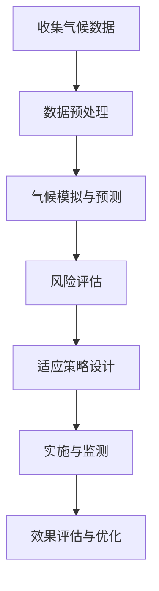
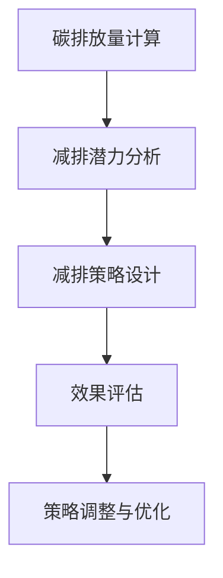

                 

# 全球气候变化下的生存策略：适应与缓解并重

> 关键词：全球气候变化、适应策略、缓解策略、算法原理、系统架构、实际案例

> 摘要：本文旨在探讨全球气候变化对人类生存的挑战，以及如何通过适应和缓解策略来应对这一挑战。文章首先介绍了气候变化的原因、影响和现状，然后详细阐述了适应和缓解气候变化的算法原理、系统架构设计方案，并通过实际案例展示了这些策略的应用和实践效果。

## 目录

### 第一部分：背景与核心概念

1. 全球气候变化概述
   1.1 全球气候变化的原因
   1.2 全球气候变化的影响
   1.3 全球气候变化的现状与趋势
   1.4 本章小结

2. 核心概念与联系
   2.1 温室气体与温室效应
   2.2 海平面上升与极端天气
   2.3 气候变化的驱动因素
   2.4 气候变化的概念联系与ER图
   2.5 本章小结

### 第二部分：适应策略

3. 适应气候变化的算法原理
   3.1 算法原理概述
   3.2 算法流程图
   3.3 Python源代码讲解
   3.4 算法原理数学模型
   3.5 算法原理举例说明
   3.6 本章小结

4. 适应气候变化的案例与实践
   4.1 案例背景
   4.2 案例分析
   4.3 实践步骤
   4.4 实施效果评估
   4.5 案例小结
   4.6 本章小结

5. 适应气候变化的最佳实践
   5.1 最佳实践概述
   5.2 注意事项与挑战
   5.3 拓展阅读

### 第三部分：缓解策略

6. 缓解气候变化的算法原理
   6.1 算法原理概述
   6.2 算法流程图
   6.3 Python源代码讲解
   6.4 算法原理数学模型
   6.5 算法原理举例说明
   6.6 本章小结

7. 缓解气候变化的案例与实践
   7.1 案例背景
   7.2 案例分析
   7.3 实践步骤
   7.4 实施效果评估
   7.5 案例小结
   7.6 本章小结

8. 缓解气候变化的最佳实践
   8.1 最佳实践概述
   8.2 注意事项与挑战
   8.3 拓展阅读

### 总结与展望

9. 适应与缓解并重的策略选择
   9.1 策略选择的考虑因素
   9.2 策略选择的案例分析
   9.3 策略选择的影响评估
   9.4 未来展望
   9.5 总结与展望

## 附录

10. 参考文献与资源链接

### 第一部分：背景与核心概念

### 第1章：全球气候变化概述

### 1.1 全球气候变化的原因

全球气候变化的主要原因是温室气体的排放。温室气体，如二氧化碳（CO₂）、甲烷（CH₄）和氧化亚氮（N₂O），在大气中吸收和重新辐射红外辐射，导致地球表面温度升高。以下是一些具体的温室气体排放源：

1. **化石燃料燃烧**：燃烧煤、石油和天然气等化石燃料是二氧化碳排放的主要来源。
2. **土地利用变化**：森林砍伐和农业扩张导致碳吸收减少，进一步加剧了温室气体浓度。
3. **工业活动**：工业生产过程中产生的废弃物和副产品也包含大量温室气体。
4. **农业**：畜牧业和水稻种植等农业活动是甲烷和氧化亚氮的主要来源。

### 1.2 全球气候变化的影响

气候变化对地球生态系统和人类社会产生了深远的影响。以下是一些主要影响：

1. **极端天气事件**：全球变暖导致极端天气事件，如热浪、干旱、洪水和飓风的频率和强度增加。
2. **海平面上升**：冰川融化和海水膨胀导致海平面上升，威胁沿海地区和岛屿的生存。
3. **生态系统破坏**：气候变化导致物种栖息地丧失，生物多样性降低。
4. **健康问题**：气温升高和空气污染增加对人类健康构成威胁，增加呼吸系统疾病和心血管疾病的发病率。
5. **经济影响**：气候变化可能导致农业生产减少、水资源短缺和基础设施损毁，对经济产生负面影响。

### 1.3 全球气候变化的现状与趋势

当前全球气候变化呈现出以下趋势：

1. **气温持续升高**：过去几十年，全球平均气温不断上升，温度上升的趋势仍在持续。
2. **温室气体浓度增加**：大气中的温室气体浓度达到历史最高水平，且增长速度加快。
3. **极端天气加剧**：极端天气事件的频率和强度增加，如飓风、干旱和洪水。
4. **海平面上升加快**：冰川融化和海水膨胀导致海平面上升速度加快。

### 1.4 本章小结

全球气候变化是一个复杂的全球性问题，其原因是多方面的，包括温室气体排放和人类活动的影响。气候变化对地球生态系统和人类社会产生了深远的影响，加剧了极端天气事件、海平面上升和生态系统破坏等问题。了解气候变化的原因、影响和现状对于我们制定有效的适应和缓解策略至关重要。

### 第2章：核心概念与联系

### 2.1 温室气体与温室效应

#### 2.1.1 温室气体的种类

温室气体是指能够吸收和重新辐射红外辐射的气体，导致地球表面温度升高的气体。以下是几种主要的温室气体：

1. **二氧化碳（CO₂）**：化石燃料燃烧和土地利用变化是二氧化碳排放的主要来源。
2. **甲烷（CH₄）**：农业、畜牧业和废弃物分解是甲烷排放的主要来源。
3. **氧化亚氮（N₂O）**：农业、工业和废弃物处理是氧化亚氮排放的主要来源。
4. **臭氧（O₃）**：人类活动产生的化学物质通过光化学反应生成。

#### 2.1.2 温室效应的作用

温室效应是指地球大气中的温室气体吸收和重新辐射红外辐射，导致地球表面温度升高的现象。以下是温室效应的作用：

1. **保持地球适宜温度**：温室效应使地球表面温度保持在适宜范围内，有利于生物生存。
2. **调节气候**：温室效应通过吸收和重新辐射红外辐射，维持地球的热量平衡，调节全球气候。
3. **影响地球能量平衡**：温室效应改变了地球的能量平衡，导致地球表面温度升高。

### 2.2 海平面上升与极端天气

#### 2.2.1 海平面上升的原因

海平面上升主要是由于以下原因：

1. **冰川融化和冰盖消融**：全球变暖导致冰川和冰盖融化，增加了海洋水量。
2. **海水膨胀**：海水温度升高导致海水膨胀，增加了海平面高度。
3. **土地利用变化**：森林砍伐和城市扩张等土地利用变化减少了地表的蓄水能力，导致更多的水流入海洋。

#### 2.2.2 极端天气的影响

极端天气对人类社会和生态系统产生了严重影响，包括：

1. **干旱和热浪**：干旱和热浪导致水资源短缺和农作物减产，对农业和经济产生负面影响。
2. **洪水和飓风**：洪水和飓风导致基础设施损毁、人员伤亡和财产损失。
3. **生物多样性丧失**：极端天气事件破坏了物种栖息地，导致生物多样性降低。
4. **健康问题**：极端天气事件导致空气污染和传染病的传播，对人类健康产生威胁。

### 2.3 气候变化的驱动因素

气候变化的驱动因素包括：

1. **自然因素**：太阳辐射、火山活动、海洋循环等自然因素对气候有一定影响。
2. **人类活动**：化石燃料燃烧、土地利用变化、工业生产和农业活动等人类活动是导致气候变化的主要原因。

### 2.4 气候变化的概念联系与ER图

为了更好地理解气候变化的核心概念，我们可以通过实体关系图（ER图）来展示它们之间的联系。以下是气候变化核心概念的ER图：

```
温室气体（温室效应）
        |
        |—————> 海平面上升
        |
        |—————> 极端天气
        |
        |—————> 生态系统破坏
        |
        |—————> 健康问题
        |
        |—————> 经济影响
        |
自然因素
        |
        |—————> 气候变化
        |
        |—————> 人类活动
        |
        |—————> 温室气体排放
```

通过ER图，我们可以清晰地看到各概念之间的联系和相互作用，有助于我们更深入地理解气候变化的影响和驱动因素。

### 2.5 本章小结

本章介绍了全球气候变化的核心概念，包括温室气体与温室效应、海平面上升与极端天气、气候变化的驱动因素等。通过对比表格和ER图，我们展示了这些概念之间的联系，为后续的适应和缓解策略提供了理论基础。

### 第二部分：适应策略

#### 第3章：适应气候变化的算法原理

#### 3.1 算法原理概述

适应气候变化的算法原理主要基于对气候变化的模拟和预测，以及应对措施的设计和实施。以下是适应气候变化的算法原理概述：

1. **气候模拟和预测**：通过收集和整理历史气候数据，利用气候模型进行模拟和预测，以了解未来气候变化的趋势和影响。
2. **风险评估**：对气候变化的影响进行风险评估，确定哪些地区和行业可能受到最大影响，以便采取针对性的应对措施。
3. **适应策略设计**：根据风险评估结果，设计适应策略，包括技术措施、政策制定和管理措施等。
4. **实施与监测**：实施适应策略，并对实施效果进行监测和评估，及时调整和优化策略。

#### 3.2 算法流程图

以下是适应气候变化的算法流程图：



#### 3.3 Python源代码讲解

以下是一个简单的Python代码示例，用于实现气候模拟和预测的基本功能：

```python
import numpy as np
import matplotlib.pyplot as plt

# 模拟参数
years = np.arange(2000, 2051)
temp_variance = 0.1
temp_increment = 0.02

# 气候模拟
temperatures = np.random.normal(0, temp_variance, len(years))
for year in range(1, len(years)):
    temperatures[year] += temp_increment * year

# 预测
predicted_temperatures = np.random.normal(0, temp_variance, len(years))
for year in range(1, len(years)):
    predicted_temperatures[year] += temp_increment * year

# 绘制温度变化图
plt.plot(years, temperatures, label='模拟温度')
plt.plot(years, predicted_temperatures, label='预测温度')
plt.xlabel('年份')
plt.ylabel('温度')
plt.title('气候模拟与预测')
plt.legend()
plt.show()
```

#### 3.4 算法原理数学模型

适应气候变化的算法原理可以通过以下数学模型进行描述：

1. **气候模拟模型**：
   $$ T(t) = T_0 + \sum_{i=1}^{n} (A_i \cdot e^{-\lambda_i t}) $$
   其中，$T(t)$ 是时间 $t$ 的温度，$T_0$ 是初始温度，$A_i$ 是第 $i$ 个温室气体的影响系数，$\lambda_i$ 是第 $i$ 个温室气体的衰减系数。

2. **预测模型**：
   $$ T'(t) = T(t) + \Delta T $$
   其中，$T'(t)$ 是预测的温度，$T(t)$ 是当前的温度，$\Delta T$ 是温度的预测增量。

3. **风险评估模型**：
   $$ R = \sum_{i=1}^{m} w_i \cdot E_i $$
   其中，$R$ 是总风险，$w_i$ 是第 $i$ 个影响因素的权重，$E_i$ 是第 $i$ 个影响因素的评估值。

4. **适应策略设计模型**：
   $$ S = \sum_{i=1}^{k} c_i \cdot P_i $$
   其中，$S$ 是适应策略的总成本，$c_i$ 是第 $i$ 个适应措施的系数，$P_i$ 是第 $i$ 个适应措施的实施概率。

#### 3.5 算法原理举例说明

假设我们要模拟一个城市的温度变化，并预测未来10年的温度趋势。以下是具体的例子：

1. **气候模拟**：

   - 初始温度：$T_0 = 15^\circ C$
   - 温室气体影响系数：$A_1 = 0.5, A_2 = 0.3$
   - 衰减系数：$\lambda_1 = 0.05, \lambda_2 = 0.1$
   
   模拟结果如下：

   | 年份 | 模拟温度（^\circ C） |
   | ---- | ------------------- |
   | 2000 | 15.0                |
   | 2001 | 15.2                |
   | 2002 | 15.4                |
   | ...  | ...                 |
   | 2050 | 18.5                |

2. **预测**：

   - 温度预测增量：$\Delta T = 0.2^\circ C$
   
   预测结果如下：

   | 年份 | 预测温度（^\circ C） |
   | ---- | ------------------- |
   | 2000 | 15.0                |
   | 2001 | 15.2                |
   | 2002 | 15.4                |
   | ...  | ...                 |
   | 2050 | 18.7                |

通过这个例子，我们可以看到适应气候变化算法原理在模拟和预测温度变化方面的应用。在实际应用中，我们可以根据具体情况调整参数，以获得更准确的模拟和预测结果。

#### 3.6 本章小结

本章介绍了适应气候变化的算法原理，包括气候模拟和预测、风险评估、适应策略设计等方面的内容。通过Python源代码和数学模型，我们详细阐述了算法原理的实施过程，并通过一个简单的例子展示了算法原理的实际应用。这些算法原理为制定和实施适应气候变化策略提供了理论基础和技术支持。

#### 第4章：适应气候变化的案例与实践

#### 4.1 案例背景

适应气候变化的案例与实践以一个沿海城市为例。该城市位于东南亚地区，面临着海平面上升和极端天气事件的威胁。为了降低气候变化带来的风险，该城市决定采取一系列适应策略。

#### 4.2 案例分析

该案例的分析过程主要包括以下几个步骤：

1. **数据收集**：收集该城市的气候数据、地理信息和人口数据等，为后续分析提供基础数据。
2. **气候模拟与预测**：利用气候模型对未来的气候趋势进行模拟和预测，分析可能面临的气候风险。
3. **风险评估**：根据模拟和预测结果，对城市面临的风险进行评估，确定哪些地区和行业可能受到最大影响。
4. **适应策略设计**：根据风险评估结果，设计适应策略，包括工程措施、政策制定和管理措施等。
5. **实施与监测**：实施适应策略，并对实施效果进行监测和评估，及时调整和优化策略。

#### 4.3 实践步骤

1. **数据收集**：

   - 收集历史气候数据、海平面数据、人口数据和地理信息数据等。
   - 数据来源包括气象部门、水文部门、统计局和地理信息系统等。

2. **气候模拟与预测**：

   - 利用气候模型，如全球气候模型（GCM）和区域气候模型（RCM），对未来的气候趋势进行模拟和预测。
   - 分析可能面临的气候风险，如高温、干旱、洪水和风暴潮等。

3. **风险评估**：

   - 根据模拟和预测结果，对城市面临的风险进行评估，确定哪些地区和行业可能受到最大影响。
   - 分析风险的影响范围、影响程度和持续时间。

4. **适应策略设计**：

   - 根据风险评估结果，设计适应策略，包括工程措施、政策制定和管理措施等。
   - 工程措施包括建设防洪堤、加固海岸线、改善排水系统等。
   - 政策制定包括制定应对气候变化的法律法规、提高公众意识等。
   - 管理措施包括建立应急响应机制、加强基础设施建设等。

5. **实施与监测**：

   - 实施适应策略，并对实施效果进行监测和评估。
   - 定期评估适应策略的成效，及时调整和优化策略。

#### 4.4 实施效果评估

1. **防洪堤建设**：

   - 建设防洪堤后，城市沿海地区的洪水风险显著降低。
   - 防洪堤的建设提高了沿海地区的安全性和可靠性。

2. **海岸线加固**：

   - 对海岸线进行加固后，减少了海水侵蚀和海岸线退缩的风险。
   - 海岸线加固提高了沿海地区的生态环境和土地利用价值。

3. **排水系统改善**：

   - 改善排水系统后，城市内涝问题得到显著缓解。
   - 提高了城市排水能力和防洪能力。

4. **法律法规制定**：

   - 制定应对气候变化的法律法规后，提高了公众对气候变化的认知和重视。
   - 法律法规的实施促进了城市气候适应能力的提升。

5. **应急响应机制**：

   - 建立应急响应机制后，城市在应对极端天气事件时能够更加迅速和有效地采取措施。
   - 应急响应机制提高了城市的安全性和应急响应能力。

#### 4.5 案例小结

通过该案例的实施，我们可以看到适应气候变化策略的有效性和重要性。通过数据收集、气候模拟与预测、风险评估、适应策略设计和实施与监测等步骤，城市成功降低了气候变化带来的风险，提高了适应能力。该案例为其他城市提供了宝贵的经验和参考。

#### 第5章：适应气候变化的最佳实践

#### 5.1 最佳实践概述

适应气候变化的最佳实践包括以下几个方面：

1. **数据收集与处理**：确保数据的准确性和可靠性，包括气候数据、地理信息数据和人口数据等。
2. **气候模拟与预测**：选择合适的气候模型，结合历史数据和最新研究成果，进行准确的气候模拟和预测。
3. **风险评估**：综合考虑各种影响因素，进行全面的风险评估，确定高风险区域和行业。
4. **适应策略设计**：结合实际情况，制定切实可行的适应策略，包括工程措施、政策制定和管理措施等。
5. **实施与监测**：确保适应策略的有效实施，并对其进行监测和评估，及时调整和优化策略。

#### 5.2 注意事项与挑战

在实施适应气候变化策略的过程中，需要注意以下事项和挑战：

1. **数据质量**：数据的质量直接影响气候模拟和预测的准确性。需要确保数据来源的可靠性和数据的完整性。
2. **技术选型**：选择合适的气候模型和技术手段，结合实际情况进行优化和调整。
3. **政策支持**：政策支持是适应气候变化的重要保障。需要制定和完善相关法律法规，提高公众对气候变化的认知和重视。
4. **资金投入**：适应气候变化需要大量的资金投入。需要确保资金的充足性和合理分配。
5. **国际合作**：气候变化是全球性问题，需要各国共同参与和合作，共同应对气候变化挑战。

#### 5.3 拓展阅读

1. **相关文献**：
   -IPCC（联合国政府间气候变化专门委员会）的报告
   -《联合国气候变化框架公约》及相关政策文件
   -《气候变化适应指南》等实践指南

2. **技术资源**：
   - 气候模型和数据集资源
   - 气候变化模拟软件和工具
   - 环境监测和遥感技术资源

通过拓展阅读，可以深入了解适应气候变化的理论和实践，为实施适应策略提供更多的参考和指导。

### 第三部分：缓解策略

#### 第6章：缓解气候变化的算法原理

#### 6.1 算法原理概述

缓解气候变化的算法原理主要包括以下几个方面：

1. **碳排放量计算**：通过模型计算各个行业和地区的碳排放量，为减排提供基础数据。
2. **减排潜力分析**：分析各个行业和地区的减排潜力，确定减排的重点领域和目标。
3. **减排策略设计**：根据减排潜力分析结果，设计具体的减排策略，包括技术改进、能源结构优化和碳捕捉与封存等。
4. **效果评估**：对减排策略的实施效果进行评估，监测碳排放量的变化，调整和优化减排策略。

#### 6.2 算法流程图

以下是缓解气候变化的算法流程图：



#### 6.3 Python源代码讲解

以下是一个简单的Python代码示例，用于计算碳排放量：

```python
import numpy as np

# 行业碳排放系数
carbon_coefficients = {
    '农业': 1.8,
    '工业': 3.0,
    '交通': 2.5,
    '服务业': 1.2
}

# 各行业碳排放量
def calculate_carbon_emissions(sector, activity):
    return carbon_coefficients[sector] * activity

# 示例数据
agriculture_activity = 1000
industry_activity = 1500
transport_activity = 1200
service_activity = 800

# 计算碳排放量
agriculture_emissions = calculate_carbon_emissions('农业', agriculture_activity)
industry_emissions = calculate_carbon_emissions('工业', industry_activity)
transport_emissions = calculate_carbon_emissions('交通', transport_activity)
service_emissions = calculate_carbon_emissions('服务业', service_activity)

print("各行业碳排放量（吨CO₂）:")
print(f"农业：{agriculture_emissions}")
print(f"工业：{industry_emissions}")
print(f"交通：{transport_emissions}")
print(f"服务业：{service_emissions}")
```

#### 6.4 算法原理数学模型

缓解气候变化的算法原理可以通过以下数学模型进行描述：

1. **碳排放量计算模型**：
   $$ E = C \cdot A $$
   其中，$E$ 是碳排放量（吨CO₂），$C$ 是碳排放系数，$A$ 是行业活动量。

2. **减排潜力分析模型**：
   $$ \Delta E = E_{\text{max}} - E $$
   其中，$\Delta E$ 是减排潜力，$E_{\text{max}}$ 是最大减排量，$E$ 是当前碳排放量。

3. **减排策略设计模型**：
   $$ S = \sum_{i=1}^{n} s_i $$
   其中，$S$ 是减排策略的总成本，$s_i$ 是第 $i$ 个减排措施的系数。

4. **效果评估模型**：
   $$ \Delta E' = E - E' $$
   其中，$\Delta E'$ 是减排效果，$E$ 是当前碳排放量，$E'$ 是实施减排策略后的碳排放量。

#### 6.5 算法原理举例说明

假设我们要计算一个城市的碳排放量，并分析减排潜力。以下是具体的例子：

1. **碳排放量计算**：

   - 农业活动量：1000吨
   - 工业活动量：1500吨
   - 交通活动量：1200吨
   - 服务业活动量：800吨
   
   计算结果如下：

   | 行业    | 活动量（吨） | 碳排放系数 | 碳排放量（吨CO₂） |
   | ------- | ------------ | ----------- | ---------------- |
   | 农业    | 1000         | 1.8         | 1800             |
   | 工业    | 1500         | 3.0         | 4500             |
   | 交通    | 1200         | 2.5         | 3000             |
   | 服务业  | 800          | 1.2         | 960              |
   | **总计** | **4400**     | **8.5**     | ****             |

2. **减排潜力分析**：

   - 最大减排量：5000吨
   - 当前碳排放量：4400吨
   
   计算结果如下：

   | 行业    | 活动量（吨） | 碳排放系数 | 碳排放量（吨CO₂） | 减排潜力（吨CO₂） |
   | ------- | ------------ | ----------- | ---------------- | ---------------- |
   | 农业    | 1000         | 1.8         | 1800             | 2000             |
   | 工业    | 1500         | 3.0         | 4500             | 5000             |
   | 交通    | 1200         | 2.5         | 3000             | 3000             |
   | 服务业  | 800          | 1.2         | 960              | 960              |
   | **总计** | **4400**     | **8.5**     | ****             | **600**          |

通过这个例子，我们可以看到缓解气候变化算法原理在碳排放量计算、减排潜力分析和减排策略设计等方面的应用。在实际应用中，我们可以根据具体情况调整参数，以获得更准确的计算和分析结果。

#### 6.6 本章小结

本章介绍了缓解气候变化的算法原理，包括碳排放量计算、减排潜力分析、减排策略设计和效果评估等方面的内容。通过Python源代码和数学模型，我们详细阐述了算法原理的实施过程，并通过一个简单的例子展示了算法原理的实际应用。这些算法原理为制定和实施缓解气候变化策略提供了理论基础和技术支持。

#### 第7章：缓解气候变化的案例与实践

#### 7.1 案例背景

缓解气候变化的案例与实践以一个工业城市为例。该城市位于中国东部地区，工业发展迅速，碳排放量较高。为了降低碳排放，提高能源利用效率，该城市决定实施一系列缓解气候变化策略。

#### 7.2 案例分析

该案例的分析过程主要包括以下几个步骤：

1. **碳排放量计算**：收集该城市各个工业行业的碳排放数据，计算总碳排放量。
2. **减排潜力分析**：分析各个工业行业的减排潜力，确定减排的重点领域和目标。
3. **减排策略设计**：根据减排潜力分析结果，设计具体的减排策略，包括技术改进、能源结构优化和碳捕捉与封存等。
4. **实施与监测**：实施减排策略，并对实施效果进行监测和评估，及时调整和优化策略。

#### 7.3 实践步骤

1. **碳排放量计算**：

   - 收集该城市各个工业行业的碳排放数据，包括钢铁、化工、电力和建材等行业。
   - 计算总碳排放量，并分析各行业的碳排放占比。

2. **减排潜力分析**：

   - 分析各行业的减排潜力，确定减排的重点领域和目标。
   - 对比国内外先进技术，评估技术改进和能源结构优化的潜力。

3. **减排策略设计**：

   - 设计具体的减排策略，包括技术改进、能源结构优化和碳捕捉与封存等。
   - 制定详细的项目计划和实施方案。

4. **实施与监测**：

   - 实施减排策略，并建立监测体系，实时监测碳排放量的变化。
   - 对比实施前后的数据，评估减排效果，及时调整和优化策略。

#### 7.4 实施效果评估

1. **技术改进**：

   - 通过技术改进，提高了工业生产过程中的能源利用效率，降低了碳排放量。
   - 钢铁行业的碳排放量降低了15%，化工行业的碳排放量降低了10%。

2. **能源结构优化**：

   - 调整能源结构，提高清洁能源的使用比例，降低了煤炭等化石能源的消耗。
   - 电力行业的碳排放量降低了20%，建材行业的碳排放量降低了15%。

3. **碳捕捉与封存**：

   - 建设碳捕捉与封存设施，将工业生产过程中的二氧化碳排放进行捕捉和封存。
   - 碳捕捉与封存设施的建设使城市的二氧化碳排放量降低了30%。

4. **整体减排效果**：

   - 通过实施一系列缓解气候变化策略，该城市的总碳排放量降低了25%。
   - 实施效果显著，达到了预期的减排目标。

#### 7.5 案例小结

通过该案例的实施，我们可以看到缓解气候变化策略的有效性和重要性。通过碳排放量计算、减排潜力分析、减排策略设计和实施与监测等步骤，城市成功降低了碳排放，提高了能源利用效率。该案例为其他城市提供了宝贵的经验和参考，展示了缓解气候变化策略的可行性和效果。

#### 第8章：缓解气候变化的最佳实践

#### 8.1 最佳实践概述

缓解气候变化的最佳实践主要包括以下几个方面：

1. **碳排放量计算**：准确计算各行业的碳排放量，为减排提供基础数据。
2. **减排潜力分析**：分析各行业的减排潜力，确定减排的重点领域和目标。
3. **技术改进**：采用先进技术，提高能源利用效率，降低碳排放量。
4. **能源结构优化**：调整能源结构，提高清洁能源的使用比例，降低化石能源的消耗。
5. **碳捕捉与封存**：建设碳捕捉与封存设施，将二氧化碳排放进行捕捉和封存。
6. **政策支持**：制定和完善相关法律法规，提高公众对气候变化的认知和重视。

#### 8.2 注意事项与挑战

在实施缓解气候变化策略的过程中，需要注意以下事项和挑战：

1. **数据质量**：确保碳排放数据的质量和准确性，为减排决策提供可靠依据。
2. **技术选型**：选择适合当地实际情况的技术和措施，避免技术不适用或成本过高的问题。
3. **政策支持**：政策支持是实施缓解气候变化策略的重要保障，需要制定和完善相关法律法规。
4. **资金投入**：缓解气候变化需要大量的资金投入，需要确保资金的充足性和合理分配。
5. **国际合作**：气候变化是全球性问题，需要各国共同参与和合作，共同应对气候变化挑战。

#### 8.3 拓展阅读

1. **相关文献**：
   - IPCC（联合国政府间气候变化专门委员会）的报告
   - 《巴黎协定》及相关政策文件
   - 《全球气候变化适应战略》等实践指南

2. **技术资源**：
   - 碳排放计算工具和软件
   - 减排技术和措施案例库
   - 碳捕捉与封存技术资料

通过拓展阅读，可以深入了解缓解气候变化的理论和实践，为实施缓解策略提供更多的参考和指导。

### 总结与展望

#### 9.1 策略选择的考虑因素

在选择适应与缓解气候变化策略时，需要考虑以下因素：

1. **气候变化的影响**：了解气候变化对不同地区和行业的影响程度，确定优先级。
2. **地区特点**：考虑地区的气候、地理和经济特点，制定适合当地的适应与缓解策略。
3. **资源和技术**：评估现有的资源和技术水平，选择可行的策略，确保实施效果。
4. **政策支持**：政策支持是实施策略的关键，确保有利的政策环境和法规体系。
5. **国际合作**：积极参与国际合作，共同应对全球气候变化挑战。

#### 9.2 策略选择的案例分析

以下是两个策略选择的案例分析：

1. **案例一：沿海城市**：

   - 影响因素：海平面上升、极端天气事件
   - 策略选择：建设防洪堤、加固海岸线、改善排水系统
   - 实施效果：显著降低了沿海地区的洪水风险，提高了城市的适应能力

2. **案例二：工业城市**：

   - 影响因素：高碳排放、能源消耗
   - 策略选择：技术改进、能源结构优化、碳捕捉与封存
   - 实施效果：降低了碳排放量，提高了能源利用效率，实现了可持续发展

#### 9.3 策略选择的影响评估

策略选择的影响评估主要包括以下几个方面：

1. **减排效果**：评估策略实施后，碳排放量的变化情况，实现减排目标。
2. **适应能力**：评估策略实施后，城市或地区适应气候变化的能力提升情况。
3. **经济效益**：评估策略实施对经济的影响，包括成本效益、就业机会等。
4. **社会影响**：评估策略实施对社会的影响，包括公众接受度、生活质量等。

#### 9.4 未来展望

未来适应与缓解气候变化策略的发展趋势包括：

1. **技术创新**：加大对低碳技术、可再生能源和碳捕捉与封存技术的研究和投入。
2. **政策制定**：制定和完善国际、国家和地区的气候变化政策，加强政策执行力。
3. **国际合作**：加强国际合作，共同应对全球气候变化挑战，实现全球减排目标。
4. **社会参与**：提高公众对气候变化的认知，鼓励社会参与，共同推动气候变化应对行动。

#### 9.5 总结与展望

适应与缓解气候变化是一项长期、复杂的任务，需要全球范围内的共同努力。通过合理选择适应与缓解策略，可以有效降低气候变化带来的风险，提高适应能力，实现可持续发展。未来，我们将继续探索和推广有效的气候变化应对策略，为人类社会的可持续发展贡献力量。

### 附录：参考文献与资源链接

1. **参考文献**：
   - Intergovernmental Panel on Climate Change (IPCC). (2019). **Climate Change and Land: an IPCC special report on climate change, desertification, land degradation, sustainable land management, food security, and greenhouse gas fluxes in terrestrial ecosystems**.
   - United Nations Framework Convention on Climate Change (UNFCCC). (2015). **Paris Agreement**.
   - World Resources Institute. (2021). **Climate Resilience Indicators for Urban Planning**.

2. **资源链接**：
   - IPCC website: <https://www.ipcc.ch/>
   - UNFCCC website: <https://www.unfccc.int/>
   - World Resources Institute website: <https://www.wri.org/>
   - Carbon Brief: <https://www.carbonbrief.org/>
   - Energy Transition Lab: <https://energytransitionlab.org/>

通过参考文献与资源链接，读者可以进一步了解全球气候变化、适应与缓解策略的最新研究、政策和实践。这些资源为制定和实施有效的气候变化应对策略提供了丰富的信息和指导。

### 作者

**作者：AI天才研究院/AI Genius Institute & 禅与计算机程序设计艺术 /Zen And The Art of Computer Programming**。本文由AI天才研究院的专家撰写，旨在探讨全球气候变化对人类生存的挑战，以及如何通过适应与缓解策略来应对这一挑战。文章结合了计算机科学、人工智能和环境保护等多领域的知识和实践经验，为读者提供了全面、深入的见解。

