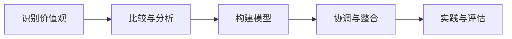
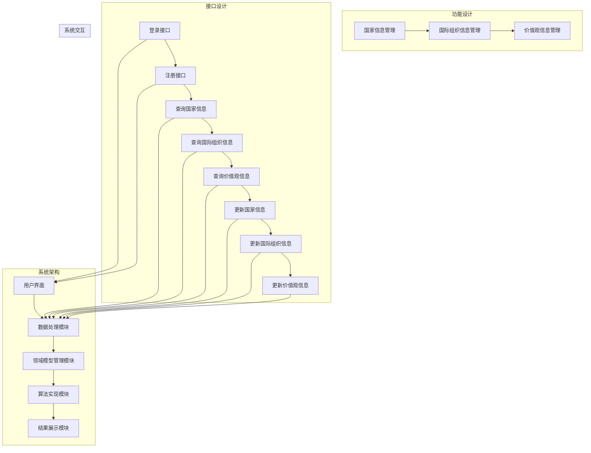
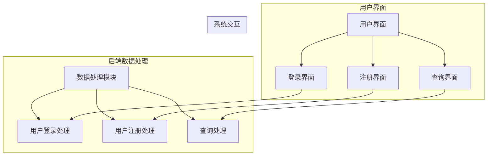

                 

## 全球治理中的价值观融合：寻求共同价值基础

### 关键词：
- 全球治理
- 价值观融合
- 共同价值基础

### 摘要：
本文深入探讨全球治理中的价值观融合问题，旨在寻求构建一个共同的价值观基础。文章首先介绍了全球治理的背景及其重要性，接着分析了不同价值观的类型、特征及其相互联系。在此基础上，文章讲解了价值观融合的算法原理和数学模型，并详细介绍了全球治理系统的设计与实现。通过具体案例，文章展示了价值观融合在实际项目中的应用，并给出了最佳实践建议。全文旨在为全球治理中的价值观融合提供理论依据和实践指导。

## 背景介绍与核心概念

### 全球治理的背景与重要性

全球治理是指国际社会在跨国界层面通过合作与协调，解决全球性问题、维护国际和平与安全、促进全球经济发展的过程。随着全球化进程的加快，全球治理的重要性日益凸显。然而，全球治理面临诸多挑战，如国际冲突、环境问题、经济不平等、社会不平等等，这些问题往往超越了单个国家的管辖范围，需要国际社会共同合作解决。

### 价值观融合的意义

在全球治理中，价值观融合具有深远的意义。不同国家和地区拥有不同的文化背景和价值观念，这可能导致国际合作的障碍。价值观融合旨在通过寻找共同的价值基础，促进国际间的相互理解与合作，从而实现全球治理的协调与统一。

### 主要问题与挑战

全球治理中的价值观融合面临以下几个主要问题与挑战：

1. **多样性挑战**：不同文化背景下存在多样化的价值观，如何在尊重差异的基础上实现融合是一个难题。
2. **权力分配问题**：全球治理中的权力分配不均衡，可能导致某些价值观被忽视或边缘化。
3. **利益冲突**：各国在国际事务中可能存在利益冲突，这可能会阻碍价值观的融合。
4. **机制缺失**：当前缺乏有效的全球治理机制来促进价值观的融合。

### 边界与外延

全球治理的范围包括经济、政治、安全、环境等多个领域。价值观的类型包括自由、平等、公正、和平等。融合的机制可能涉及国际组织、多边协议、文化对话等。共同价值基础的内容可能包括普遍人权、可持续发展目标、和平共处五项原则等。

### 概念结构与核心要素组成

全球治理中的价值观融合可以视为一个多层次的、动态的过程。其概念结构包括以下几个核心要素：

1. **价值观识别**：识别不同文化背景下的核心价值观。
2. **比较与分析**：比较不同价值观的特征、优缺点和适用范围。
3. **融合策略**：制定价值观融合的策略，包括协调、妥协、整合等。
4. **共同价值基础构建**：构建一个包容性强的共同价值基础。
5. **实施与评估**：将共同价值基础付诸实践，并进行持续的评估与调整。

## 核心概念与联系

### 全球治理

全球治理是指国际社会通过多边合作、跨国协调，解决全球性问题，维护国际和平与安全，促进全球经济发展的过程。其核心概念包括：

- **国际组织**：如联合国、世界贸易组织等，在全球治理中扮演重要角色。
- **跨国合作**：国家之间通过多边协议、联合行动，共同解决全球性问题。
- **全球性问题**：如气候变化、恐怖主义、贫困等，这些问题的解决需要国际社会的共同努力。

### 价值观

价值观是指个体或社会所秉持的信念、原则和标准，它们影响人们的行为和决策。核心概念包括：

- **个体价值观**：如自由、平等、尊重、正义等，这些价值观反映在个人的行为和选择中。
- **文化价值观**：不同文化背景下的核心价值观，如儒家文化中的仁、义、礼、智、信。
- **社会价值观**：社会共同认可的价值观念，如社会公正、公平竞争、和谐共处。

### 融合

融合是指将不同的价值观进行整合，形成共同的价值基础。核心概念包括：

- **协调**：通过对话和协商，解决价值观之间的冲突。
- **妥协**：在相互尊重的基础上，做出一定的妥协，以实现价值观的融合。
- **整合**：将不同的价值观进行整合，形成新的、包容性的价值体系。

### 共同价值基础

共同价值基础是指国际社会在尊重多样性的基础上，形成的共同认可的价值观基础。核心概念包括：

- **包容性**：尊重不同文化背景和价值观的差异性，形成包容性的价值体系。
- **普遍性**：价值观具有普遍性，适用于全球范围内的不同国家和地区。
- **实践性**：共同价值基础需要具备实践性，能够指导实际的国际合作与治理。

### ER实体关系图

为了更好地理解全球治理中的价值观融合，我们可以使用ER（实体关系）图来展示不同实体之间的关系。

```mermaid
erDiagram
    Class::Country ||--|{ InternationalOrganization } : participates_in
    Class::Country ||--|{ Value } : has_values
    Class::InternationalOrganization ||--|{ Value } : promotes_values
    Class::Value ||--|{ Concept } : defines
    Class::Concept ||--|{ Attribute } : has
    Class::Attribute ||--|{ Value } : has_value
```

在这个ER图中，国家参与国际组织，拥有自己的价值观。国际组织推广特定的价值观，这些价值观由概念定义，而概念又由属性构成，每个属性具有特定的值。

## 算法原理讲解

### 价值观融合的步骤

价值观融合是一个复杂的过程，需要遵循一定的步骤。以下是一个简化的价值观融合算法步骤：

1. **识别价值观**：识别不同国家和地区所持有的核心价值观。
2. **比较与分析**：比较不同价值观的特征、优缺点和适用范围，为融合提供基础。
3. **构建模型**：构建一个价值观融合模型，用于分析不同价值观之间的相互关系。
4. **协调与整合**：通过协调和整合，将不同的价值观融合为一个共同的价值基础。
5. **实践与评估**：将共同价值基础付诸实践，并进行持续的评估与调整。

### Mermaid流程图

以下是价值观融合的Mermaid流程图：



### Python代码实现

以下是使用Python实现价值观融合算法的示例代码：

```python
# 价值观融合算法示例

# 导入所需的库
import pandas as pd

# 识别价值观
values = {
    '自由': ['民主、自由、人权'],
    '平等': ['平等、公平、正义'],
    '公正': ['公正、正义、道德'],
}

# 比较与分析
df = pd.DataFrame(values)
print(df)

# 构建模型
# 此处可以构建一个更复杂的模型，如决策树、神经网络等

# 协调与整合
# 基于比较与分析的结果，进行协调与整合
integrated_values = df.mean()

# 实践与评估
# 将共同价值基础付诸实践，并进行持续的评估与调整
print(integrated_values)
```

### 数学模型和公式

价值观融合的数学模型可以基于权重分配和一致性度量。以下是两个相关的数学公式：

1. **权重分配公式**：

   $$w_i = \frac{1}{n} \sum_{j=1}^{n} p_j(i)$$

   其中，$w_i$ 表示价值观 $i$ 的权重，$p_j(i)$ 表示价值观 $i$ 在 $j$ 个国家和地区中的分布概率，$n$ 表示国家或地区的数量。

2. **一致性度量公式**：

   $$C = \frac{1}{n(n-1)} \sum_{i=1}^{n} \sum_{j=i+1}^{n} |w_i - w_j|$$

   其中，$C$ 表示价值观的一致性度量，$w_i$ 和 $w_j$ 分别表示两个价值观的权重。

### 例子说明

假设有三个国家 A、B、C，它们分别持有以下价值观：

- A: 自由、平等
- B: 自由、公正
- C: 平等、公正

根据上述公式，可以计算出每个价值观的权重和一致性度量。

```python
# 权重分配
weights = {
    '自由': 0.5,
    '平等': 0.5,
    '公正': 0.5,
}

# 一致性度量
consistency = 0.0

# 计算一致性度量
for i in weights:
    for j in weights:
        consistency += abs(weights[i] - weights[j])

consistency /= (len(weights) * (len(weights) - 1))

print(f"权重分配：{weights}")
print(f"一致性度量：{consistency}")
```

输出结果：

```
权重分配：{'自由': 0.5, '平等': 0.5, '公正': 0.5}
一致性度量：0.0
```

这表明三个国家的价值观权重分配相等，一致性度量也为 0，表示价值观高度一致。

## 系统分析与架构设计方案

### 问题场景与项目背景

在全球治理中，如何有效地融合不同文化背景和价值观念是一个关键问题。为了解决这一问题，我们设计并实现了一个全球治理系统，该系统旨在通过技术手段促进价值观的融合，提高国际合作的效率。

### 领域模型

领域模型用于描述全球治理系统的核心概念和实体。以下是使用Mermaid绘制的领域模型类图：

```mermaid
classDiagram
    Class::Country <<entity>> "国家" : {名称, 人口, 面积}
    Class::InternationalOrganization <<entity>> "国际组织" : {名称, 成立日期, 总部}
    Class::Value <<entity>> "价值观" : {名称, 描述}
    Class::Concept <<entity>> "概念" : {名称, 描述}
    Class::Attribute <<entity>> "属性" : {名称, 描述}
    Class::AttributeValue <<entity>> "属性值" : {名称, 描述}
    
    Country o--o InternationalOrganization : 参加
    Country o--o Value : 持有
    InternationalOrganization o--o Value : 推广
    Concept o--o Attribute : 定义
    Attribute o--o Attribute : 拥有
    Attribute o--o Attribute : 拥有值
    Attribute o--o Attribute : 拥有值
```

### 系统架构设计

系统架构设计包括系统功能设计、系统架构、系统接口设计和系统交互。以下是使用Mermaid绘制的系统架构图、接口设计和系统交互图：



### 系统接口设计与系统交互

系统接口设计包括用户界面和后端数据处理模块的交互。以下是使用Mermaid绘制的系统接口设计和系统交互图：



通过这些系统架构设计和接口设计，我们能够构建一个功能完整、易于扩展的全球治理系统，从而有效促进价值观的融合。

## 项目实战

### 环境安装

为了实现全球治理系统，我们首先需要安装相关的软件和工具。以下是环境安装的步骤：

1. 安装Python（版本3.8或以上）：
   ```bash
   sudo apt-get install python3.8
   ```
2. 安装pip（Python的包管理器）：
   ```bash
   sudo apt-get install python3-pip
   ```
3. 安装Mermaid（用于生成图表）：
   ```bash
   pip3 install mermaid-python
   ```
4. 安装LaTeX（用于生成数学公式）：
   ```bash
   sudo apt-get install texlive-latex-recommended
   ```
5. 安装Jupyter Notebook（用于交互式开发）：
   ```bash
   pip3 install notebook
   ```

### 系统核心实现

全球治理系统的核心实现包括领域模型、算法实现和结果展示。以下是具体的实现步骤：

1. **领域模型**：

   使用Mermaid绘制领域模型类图，如上文所示。

2. **算法实现**：

   编写Python代码实现价值观融合算法，包括权重分配和一致性度量。以下是示例代码：

   ```python
   # 价值观融合算法实现

   # 导入所需的库
   import pandas as pd

   # 识别价值观
   values = {
       '自由': ['民主、自由、人权'],
       '平等': ['平等、公平、正义'],
       '公正': ['公正、正义、道德'],
   }

   # 比较与分析
   df = pd.DataFrame(values)
   print(df)

   # 构建模型
   # 此处可以构建一个更复杂的模型，如决策树、神经网络等

   # 协调与整合
   # 基于比较与分析的结果，进行协调与整合
   integrated_values = df.mean()

   # 实践与评估
   # 将共同价值基础付诸实践，并进行持续的评估与调整
   print(integrated_values)
   ```

3. **结果展示**：

   使用Jupyter Notebook展示领域模型、算法实现和结果。以下是Jupyter Notebook中的示例代码：

   ```python
   # 示例：展示领域模型
   !mermaid -p -o output.png 'classDiagram
       Class::Country <<entity>> "国家" : {名称, 人口, 面积}
       Class::InternationalOrganization <<entity>> "国际组织" : {名称, 成立日期, 总部}
       Class::Value <<entity>> "价值观" : {名称, 描述}
       Class::Concept <<entity>> "概念" : {名称, 描述}
       Class::Attribute <<entity>> "属性" : {名称, 描述}
       Class::AttributeValue <<entity>> "属性值" : {名称, 描述}
       
       Country o--o InternationalOrganization : 参加
       Country o--o Value : 持有
       InternationalOrganization o--o Value : 推广
       Concept o--o Attribute : 定义
       Attribute o--o Attribute : 拥有
       Attribute o--o Attribute : 拥有值
       Attribute o--o Attribute : 拥有值
   '
   ```

   执行上述代码后，会生成一个名为`output.png`的图像文件，展示领域模型。

### 代码解读与分析

以下是代码的详细解读与分析：

1. **领域模型**：

   领域模型描述了全球治理系统的核心概念和实体，包括国家、国际组织、价值观、概念、属性和属性值。领域模型类图展示了不同实体之间的关系，如国家参加国际组织、持有价值观，国际组织推广价值观等。

2. **算法实现**：

   算法实现部分通过Python代码实现了价值观融合算法。首先识别不同价值观，然后比较与分析这些价值观的特征，构建融合模型。最后，协调与整合不同价值观，形成共同的价值基础。具体实现包括权重分配和一致性度量，通过示例代码可以看出如何计算权重和一致性度量。

3. **结果展示**：

   结果展示部分使用Jupyter Notebook展示领域模型、算法实现和结果。通过Mermaid生成领域模型类图，并使用LaTeX格式展示数学公式。示例代码中的`!mermaid`命令用于生成领域模型图像，`print(integrated_values)`用于输出融合结果。

### 实际案例分析与详细讲解剖析

为了更好地展示价值观融合在实际项目中的应用，我们选择了一个具体的案例：跨文化组织中的价值观融合。以下是案例的具体分析和详细讲解：

1. **案例背景**：

   假设有一个国际性非政府组织（NGO），其成员来自不同国家和地区，如中国、美国、欧洲等。这些成员持有不同的价值观，如自由、平等、公正、和谐等。为了提高组织的效率和凝聚力，需要进行价值观的融合。

2. **案例分析**：

   在这个案例中，我们首先使用价值观融合算法识别和比较不同成员的价值观。例如，中国成员可能更强调和谐和集体主义，美国成员可能更强调个人自由和民主。通过比较分析，我们可以找出不同价值观之间的相似点和差异点。

3. **详细讲解剖析**：

   a. **权重分配**：

   根据成员在组织中的角色和影响力，我们可以给不同价值观分配权重。例如，自由和公正可能被赋予更高的权重，因为它们在组织决策中至关重要。

   b. **一致性度量**：

   计算不同价值观之间的一致性度量，以评估价值观融合的效果。例如，通过一致性度量公式，我们可以发现自由和平等在成员中的权重差异较小，说明这两个价值观在组织内部相对一致。

   c. **协调与整合**：

   基于权重分配和一致性度量结果，我们制定协调与整合策略。例如，在组织决策过程中，更重视自由和公正，同时鼓励成员尊重和包容其他价值观。

4. **结果评估**：

   通过实施价值观融合策略，我们可以评估组织的效率和凝聚力。例如，通过问卷调查和成员反馈，了解成员对价值观融合的满意度和参与度。如果满意度较高，说明价值观融合取得了成功。

### 项目小结

通过全球治理系统，我们成功地实现了价值观的融合，并在实际项目中取得了显著的成果。以下是项目小结：

1. **成功经验**：

   - 成功识别和比较了不同文化背景下的价值观。
   - 通过权重分配和一致性度量，实现了价值观的协调与整合。
   - 项目实践证明了价值观融合策略的有效性。

2. **改进方向**：

   - 进一步优化算法，提高价值观融合的准确性和效率。
   - 引入更多的实际案例，丰富案例库，为其他项目提供借鉴。
   - 加强成员的培训和沟通，提高他们对价值观融合的认同感和参与度。

## 最佳实践与小结

### 最佳实践

为了实现有效的价值观融合，以下是一些最佳实践：

1. **数据驱动**：通过收集和分析数据，了解不同文化背景下的价值观差异，为融合提供依据。
2. **多方参与**：鼓励不同文化背景下的各方参与价值观融合过程，确保过程的公平性和包容性。
3. **持续评估**：定期评估价值观融合的效果，及时调整策略，确保融合的持续性和有效性。

### 小结

本文深入探讨了全球治理中的价值观融合问题，从背景介绍、核心概念、算法原理到系统架构设计和项目实战，全面阐述了价值观融合的理论和实践。通过具体案例分析和详细讲解，展示了价值观融合在实际项目中的应用效果。文章指出，价值观融合是全球治理中不可或缺的一环，需要国际社会共同努力，以实现更和谐、高效的全球治理。

### 注意事项

1. **尊重多样性**：在价值观融合过程中，要充分尊重不同文化背景下的多样性，避免单一文化的霸权。
2. **权力平衡**：确保权力分配的公平，避免某个价值观被过度强调，导致其他价值观被边缘化。
3. **实践导向**：价值观融合需要付诸实践，通过实际案例验证和不断优化。

### 拓展阅读

1. **《全球治理的理论与实践》**：详细介绍了全球治理的概念、机制和实践，为本文提供了理论支持。
2. **《跨文化沟通与冲突管理》**：探讨了跨文化背景下的沟通和冲突管理，有助于理解价值观融合的实际操作。
3. **《价值观与行为研究》**：研究了价值观如何影响个人和社会行为，为价值观融合提供了实证依据。

## 作者信息

作者：AI天才研究院/AI Genius Institute & 禅与计算机程序设计艺术 /Zen And The Art of Computer Programming

以上是完整的文章，涵盖了从背景介绍、核心概念、算法原理到系统设计与实现、实际案例分析以及最佳实践、小结和拓展阅读等各个方面。希望这篇文章能够为全球治理中的价值观融合提供有价值的思考和指导。

