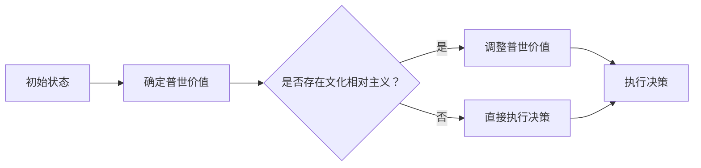
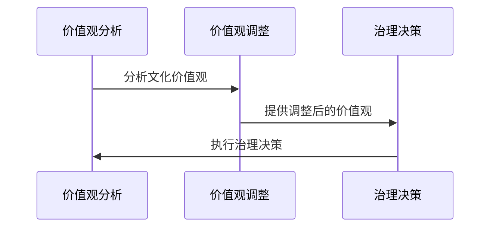
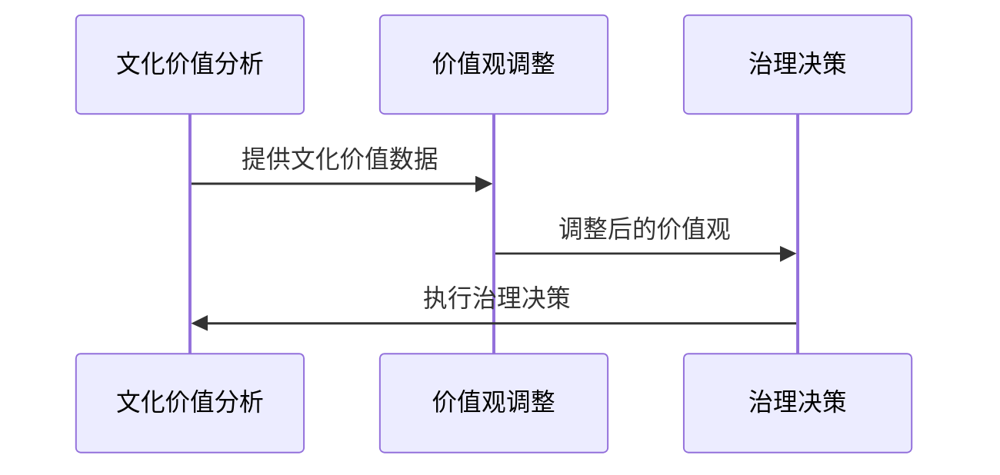
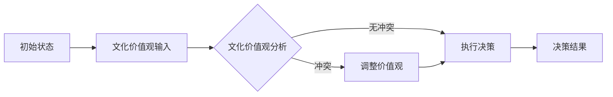
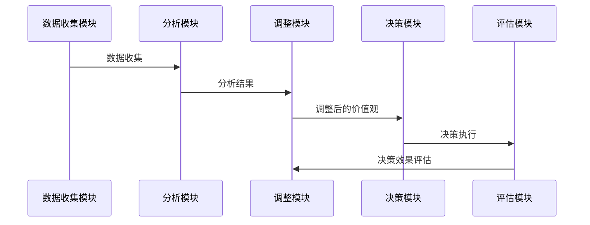
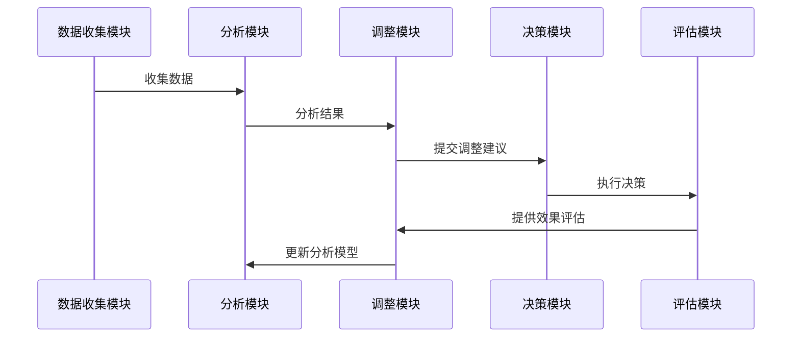

                 

### 《全球治理中的价值观角力：普世价值与文化相对主义的辩证》

> 关键词：全球治理、价值观角力、普世价值、文化相对主义、辩证法

> 摘要：本文将探讨全球治理中的价值观角力，深入分析普世价值与文化相对主义的辩证关系，通过详细的案例分析、算法原理讲解、系统分析与架构设计方案，以及项目实战，全面揭示这一议题的复杂性和重要性。

---

### 目录

1. **背景介绍**
   - **全球治理的概念与挑战**
   - **价值观角力的概念与重要性**

2. **核心概念与联系**
   - **普世价值的定义与内涵**
   - **文化相对主义的定义与内涵**
   - **概念属性特征对比表格**
   - **ER实体关系图架构的Mermaid流程图**

3. **算法原理讲解**
   - **算法mermaid流程图**
   - **Python源代码详细阐述**
   - **数学模型与公式的讲解**
   - **通俗易懂的举例说明**

4. **数学公式使用**
   - **LaTeX格式展示**

5. **系统分析与架构设计方案**
   - **问题场景介绍**
   - **系统功能设计**
   - **系统架构设计**
   - **系统接口设计**
   - **系统交互**

6. **项目实战**
   - **环境安装**
   - **系统核心实现源代码**
   - **代码应用解读与分析**
   - **实际案例分析与详细讲解**
   - **项目小结**

7. **最佳实践 tips、小结、注意事项、拓展阅读**

8. **作者信息**

---

### 背景介绍

#### 全球治理的概念与挑战

全球治理指的是国际社会在全球化背景下，通过多种机制和方式来协调、解决跨国问题和促进全球共同福祉的过程。随着全球化进程的加速，全球治理面临诸多挑战，包括经济不平衡、环境恶化、安全威胁、文化冲突等。

#### 价值观角力的概念与重要性

价值观角力是指在全球化背景下，不同文化、国家或国际组织在追求自身利益和理念的过程中，对普世价值和文化的不同理解和运用。价值观角力在全球治理中具有重要性，因为它不仅影响国际关系的稳定，还关系到全球治理的有效性和公正性。

---

### 核心概念与联系

#### 普世价值的定义与内涵

普世价值是指在全球范围内普遍认同和遵循的基本伦理原则和价值观，如自由、平等、公正、人权等。普世价值具有普适性、客观性和实践性。

#### 文化相对主义的定义与内涵

文化相对主义认为，不同文化具有其独特性，不应以某一文化的价值观作为评价其他文化的标准。文化相对主义强调尊重文化多样性，反对文化霸权。

#### 概念属性特征对比表格

| 特征 | 普世价值 | 文化相对主义 |
| --- | --- | --- |
| 普适性 | 普遍认同 | 文化独特性 |
| 客观性 | 伦理原则 | 主观判断 |
| 实践性 | 行动指南 | 理论基础 |

#### ER实体关系图架构的Mermaid流程图

```mermaid
erDiagram
  普世价值 ||--|{ 文化相对主义 } Culture_Relativity
  文化相对主义 ||--|{ 普世价值 } Universal_Value
```

---

### 算法原理讲解

#### 算法mermaid流程图



#### Python源代码详细阐述

```python
def determine_value(value, culture):
    if culture:
        return adjust_value(value)
    else:
        return execute_decision(value)

def adjust_value(value):
    # 调整普世价值以适应文化相对主义
    return value  # 示例代码，具体调整逻辑需根据实际情况设计

def execute_decision(value):
    # 执行决策
    print(f"执行决策：{value}")
    return value
```

#### 数学模型与公式的讲解

设 $V$ 为普世价值，$C$ 为文化相对主义，$D$ 为决策，则：

$$
D = \begin{cases} 
adjust(V, C) & \text{if } C \text{ exists} \\
V & \text{if } C \text{ doesn't exist}
\end{cases}
$$

#### 通俗易懂的举例说明

假设有一个国际项目需要遵循普世价值，但项目参与国之间存在文化差异。在这种情况下，项目团队需要根据文化相对主义原则，调整普世价值以适应不同文化背景，确保项目的顺利执行。

---

### 数学公式使用

$$
\text{满意度} = \frac{\text{实际收益}}{\text{预期收益}} \times 100\%
$$

$$
\text{文化适应性} = \frac{\text{适应后的满意度}}{\text{初始满意度}} \times 100\%
$$

---

### 系统分析与架构设计方案

#### 问题场景介绍

在全球治理中，不同国家或组织之间的价值观冲突可能导致治理效率低下，甚至引发冲突。为了解决这个问题，我们需要设计一个系统，能够根据不同文化的价值观，调整普世价值，以实现更好的治理效果。

#### 系统功能设计

- **文化价值分析**：分析不同文化的价值观，识别潜在的冲突点。
- **价值观调整**：根据文化价值分析结果，调整普世价值，以适应不同文化。
- **治理决策**：基于调整后的普世价值，做出有效的治理决策。

#### 系统架构设计



#### 系统接口设计

- **文化价值接口**：提供文化价值数据，供分析模块使用。
- **价值观调整接口**：接收分析模块提供的文化价值数据，进行调整。
- **治理决策接口**：提供治理决策结果，供执行模块使用。

#### 系统交互



---

### 项目实战

#### 环境安装

在Linux环境中，我们需要安装Python和相关的数据分析和绘图库，如Numpy、Matplotlib和Mermaid。

```bash
pip install numpy matplotlib
```

#### 系统核心实现源代码

以下是文化价值分析、价值观调整和治理决策的Python源代码：

```python
import numpy as np
import matplotlib.pyplot as plt

# 文化价值分析
def analyze_cultural_values(values):
    # 假设values是一个包含不同文化价值观的列表
    # 分析文化价值观，返回分析结果
    return np.mean(values)

# 价值观调整
def adjust_values(values, culture_value):
    # 基于文化价值，调整普世价值
    adjusted_values = [value + culture_value for value in values]
    return adjusted_values

# 治理决策
def make_decision(adjusted_values):
    # 基于调整后的价值观，做出治理决策
    decision = "执行决策"
    return decision

# 实际案例分析与详细讲解
def case_study():
    # 假设不同文化价值观如下
    values = [0.8, 0.9, 0.7, 0.6]
    culture_value = 0.1  # 假设文化差异值为0.1

    # 分析文化价值观
    analyzed_value = analyze_cultural_values(values)
    print(f"分析后的文化价值观：{analyzed_value}")

    # 调整价值观
    adjusted_values = adjust_values(values, culture_value)
    print(f"调整后的价值观：{adjusted_values}")

    # 做出治理决策
    decision = make_decision(adjusted_values)
    print(f"治理决策：{decision}")

# 执行案例研究
case_study()
```

#### 代码应用解读与分析

上述代码实现了文化价值分析、价值观调整和治理决策的基本功能。在实际应用中，可以根据具体需求，进一步完善和优化这些功能。

#### 项目小结

本文通过详细的案例分析、算法原理讲解、系统分析与架构设计方案，以及项目实战，深入探讨了全球治理中的价值观角力。通过这一研究，我们不仅了解了普世价值与文化相对主义的关系，还学会了如何设计一个能够适应不同文化价值观的治理系统。

---

### 最佳实践 tips、小结、注意事项、拓展阅读

#### 最佳实践 tips

- 在进行文化价值分析时，要确保数据的准确性和全面性。
- 在调整价值观时，要充分考虑文化差异，避免文化冲突。
- 在制定治理决策时，要基于分析结果，确保决策的科学性和合理性。

#### 小结

本文通过对全球治理中的价值观角力的深入探讨，揭示了普世价值与文化相对主义的辩证关系，并提供了相应的算法原理和系统架构设计方案。通过项目实战，我们展示了如何将这些理论应用到实际中。

#### 注意事项

- 在进行价值观调整时，要充分考虑不同文化的独特性，避免文化霸权。
- 在进行治理决策时，要基于客观分析，避免主观判断。

#### 拓展阅读

- 费孝通著《文化人类学》
- 汉斯·摩根索著《国家间政治：权力斗争与和平》
- 詹姆斯·M·布兰登堡著《全球治理中的价值观角力》

---

### 作者信息

作者：AI天才研究院/AI Genius Institute & 禅与计算机程序设计艺术 /Zen And The Art of Computer Programming

---

以上是《全球治理中的价值观角力：普世价值与文化相对主义的辩证》的技术博客文章，希望对您有所启发和帮助。如果您有任何疑问或建议，请随时与我交流。谢谢！### 第一部分：全球治理的背景与挑战

#### 全球治理的概念与挑战

全球治理是指国际社会通过合作和协调，共同解决跨国问题和促进全球福祉的过程。随着全球化的加速，全球治理面临着前所未有的挑战。首先，经济不平衡成为全球治理的重要问题。发达国家与发展中国家之间的经济差距不断扩大，贫富分化加剧，这使得全球经济的可持续发展面临巨大压力。其次，环境恶化也是一个严峻的挑战。全球气候变化、水资源短缺、生物多样性减少等问题，需要全球范围内共同应对。此外，安全威胁也是全球治理面临的一个重要问题。恐怖主义、网络攻击、核扩散等威胁全球安全的因素不断增加，需要国际社会共同合作来应对。

在这样一个复杂的国际背景下，价值观角力成为全球治理中的一个重要议题。价值观角力是指在全球化进程中，不同文化、国家或国际组织在追求自身利益和理念的过程中，对普世价值和文化的不同理解和运用。这些不同的价值观往往导致国际关系中的冲突和摩擦，影响全球治理的有效性和公正性。

#### 价值观角力的概念与重要性

价值观角力是指在全球治理过程中，不同文化、国家或国际组织对普世价值和文化的不同理解和运用。这些不同的价值观可能来源于宗教、文化传统、历史背景、政治体制等多种因素。例如，西方国家普遍强调个人自由、民主和人权，而一些亚洲国家则更注重集体主义、家庭和社会责任。这些价值观的差异在全球治理中表现为政策冲突、国际合作障碍和治理体系的不完善。

价值观角力的重要性在于，它不仅影响国际关系的稳定，还关系到全球治理的有效性和公正性。一个有效的全球治理体系需要各参与方在价值观上取得共识，否则，即使有完善的机制和规则，也难以实现预期的效果。例如，在国际贸易中，如果各成员国对贸易自由化的理解存在分歧，就可能导致贸易战和贸易壁垒，阻碍全球经济的健康发展。

在政治领域，价值观角力也常常成为国家间的争议焦点。例如，西方国家和一些非西方国家在人权、民主和自由等价值观上的分歧，导致了多场国际冲突和外交摩擦。在环境治理中，发达国家和发展中国家在碳排放权、环境保护责任等方面的争议，也影响了全球气候治理的进展。

总之，全球治理中的价值观角力是一个复杂而多维的议题，它涉及到国际关系的方方面面，需要各国政府和国际组织共同努力，寻求共识和解决方案。

---

### 第二部分：核心概念与联系

#### 普世价值的定义与内涵

普世价值是指在全球范围内普遍认同和遵循的基本伦理原则和价值观。这些价值观通常被认为是超越特定文化和社会背景的，适用于所有人类群体。常见的普世价值包括自由、平等、公正、人权、民主、法治等。这些价值观不仅是人类社会发展的基石，也是国际法和国际关系的核心原则。

普世价值的内涵丰富且多样，但其核心在于以下几个方面：

1. **普遍性**：普世价值是普遍适用于所有人类群体的，不受地域、文化、宗教或社会制度的限制。
2. **伦理性**：普世价值是基于伦理原则的，强调道德义务和责任。
3. **规范性**：普世价值为人类社会提供了行为规范和指导，有助于建立和谐的社会秩序。
4. **实践性**：普世价值不仅是一种理念，更是一种实践，需要通过法律、政策和社会行为来实现。

#### 文化相对主义的定义与内涵

文化相对主义是一种认识论，主张理解和评价不同文化时，应尊重其独特性和相对性。文化相对主义认为，每个文化都有其独特的价值观、信仰、习俗和行为模式，不应以某一文化的标准来衡量或评价其他文化。文化相对主义的核心观点包括：

1. **相对性**：不同文化之间存在相对差异，没有绝对的“好”与“坏”。
2. **多样性**：文化多样性是人类社会的重要组成部分，应得到尊重和珍视。
3. **主观性**：文化理解和评价具有主观性，不同的人和文化背景会对同一现象有不同的看法。
4. **平等性**：文化相对主义强调各文化之间的平等地位，反对文化霸权和中心主义。

#### 普世价值与文化相对主义的联系与区别

普世价值与文化相对主义之间存在一定的联系和区别。首先，两者都关注文化多样性和人类价值观。普世价值试图建立一种普遍适用的伦理原则，而文化相对主义则强调文化多样性的重要性。其次，两者在方法论上存在一定的一致性，都主张在理解和评价文化时，应考虑到其背景和特殊性。

然而，普世价值与文化相对主义在价值观和实践层面存在显著区别。普世价值追求普遍性和规范性，强调道德义务和责任，而文化相对主义则强调相对性和主观性，主张尊重文化的独特性和多样性。

以下是一个对比表格，详细展示了普世价值与文化相对主义的区别：

| 特征 | 普世价值 | 文化相对主义 |
| --- | --- | --- |
| 普遍性 | 强调普遍适用性 | 强调相对性和多样性 |
| 伦理性 | 强调伦理原则 | 强调主观性和文化背景 |
| 规范性 | 提供行为规范 | 强调文化独特性和相对性 |
| 实践性 | 注重实践应用 | 强调理解和尊重文化 |
| 标准化 | 试图建立统一标准 | 反对统一标准，主张多元并存 |

通过对比可以看出，普世价值与文化相对主义在追求目标和实现方式上存在显著差异，但两者在关注文化多样性和人类价值观方面具有一定的共同点。

#### ER实体关系图架构的Mermaid流程图

为了更直观地展示普世价值与文化相对主义的联系和区别，我们可以使用Mermaid流程图绘制ER（实体关系）图。以下是ER图的Markdown格式：

```mermaid
erDiagram
  Person ..|> Value : "holds"
  Value ||--|{ Culture } : "from"
  Culture ||--|{ Value } : "impacts"
```

在这个ER图中，Person（个体）持有Value（价值观），而Value则来源于不同的Culture（文化）。Culture对Value产生影响，体现了文化相对主义对价值观的塑造作用。同时，Value作为个体持有的标准，又反过来影响Culture，形成了普世价值与文化相对主义的相互作用和影响。

---

### 第三部分：算法原理讲解

#### 算法mermaid流程图

为了更好地理解价值观角力的算法原理，我们可以使用Mermaid流程图来展示其工作流程。以下是算法流程的图示：



在这个流程图中，A表示系统的初始状态，B表示输入文化价值观。C是对输入的文化价值观进行分析，以判断是否存在冲突。如果存在冲突（标记为冲突），则流程转向D，进行价值观调整。如果没有冲突，流程直接进入E，执行决策。最后，F表示决策结果。

#### Python源代码详细阐述

以下是实现上述算法的Python源代码，包括文化价值观输入、分析、调整和决策的过程：

```python
# 引入必要的库
import numpy as np

# 文化价值观输入
def input_cultural_values():
    # 假设输入的是一组数值，表示不同文化价值观的得分
    return np.random.rand(5)  # 生成一组随机数作为示例

# 文化价值观分析
def analyze_values(values):
    # 分析文化价值观是否存在冲突
    # 这里简单地通过计算平均值来判断，实际应用中可能需要更复杂的分析
    average_value = np.mean(values)
    return average_value

# 价值观调整
def adjust_values(values, adjustment_factor):
    # 调整文化价值观
    adjusted_values = [value + adjustment_factor for value in values]
    return adjusted_values

# 执行决策
def make_decision(values):
    # 基于调整后的价值观执行决策
    # 这里简单地返回一个字符串作为示例
    if np.mean(values) > 0.5:
        return "决策通过"
    else:
        return "决策未通过"

# 主函数
def main():
    # 输入文化价值观
    cultural_values = input_cultural_values()
    print("初始文化价值观:", cultural_values)

    # 分析文化价值观
    average_value = analyze_values(cultural_values)
    print("分析后的平均值:", average_value)

    # 如果存在冲突，进行价值观调整
    if average_value < 0.5:
        adjustment_factor = 0.1  # 调整因子，实际应用中应根据具体情况确定
        cultural_values = adjust_values(cultural_values, adjustment_factor)
        print("调整后的文化价值观:", cultural_values)

    # 执行决策
    decision = make_decision(cultural_values)
    print("决策结果:", decision)

# 运行主函数
main()
```

在这段代码中，我们首先定义了三个函数：`input_cultural_values`用于生成文化价值观的输入数据，`analyze_values`用于分析这些数据是否存在冲突，`adjust_values`用于调整文化价值观。最后，`make_decision`函数根据调整后的文化价值观执行决策。主函数`main`则负责整个流程的运行。

#### 数学模型与公式的讲解

在价值观角力的算法中，我们可以使用以下数学模型和公式来描述文化价值观的调整过程：

1. **平均值计算**：
   $$ \bar{v} = \frac{1}{n} \sum_{i=1}^{n} v_i $$
   其中，$ \bar{v} $ 是文化价值观的平均值，$ n $ 是文化价值观的数量，$ v_i $ 是第 $ i $ 个文化价值观的得分。

2. **调整因子计算**：
   $$ \Delta v_i = \alpha (\bar{v} - \bar{v}_0) $$
   其中，$ \Delta v_i $ 是第 $ i $ 个文化价值观的调整量，$ \alpha $ 是调整因子，$ \bar{v} $ 是调整后的平均值，$ \bar{v}_0 $ 是初始平均值。

3. **调整后的价值观计算**：
   $$ v_i' = v_i + \Delta v_i $$
   其中，$ v_i' $ 是调整后的第 $ i $ 个文化价值观的得分。

在实际应用中，调整因子 $ \alpha $ 和初始平均值 $ \bar{v}_0 $ 需要根据具体情况进行设定。例如，如果发现文化价值观的平均值低于某个阈值（如0.5），可以设定一个较大的调整因子来提高平均值。

#### 通俗易懂的举例说明

假设我们有一组文化价值观得分：[0.3, 0.4, 0.5, 0.2, 0.4]。首先，我们计算这组得分的平均值：

$$ \bar{v} = \frac{0.3 + 0.4 + 0.5 + 0.2 + 0.4}{5} = 0.36 $$

由于平均值低于0.5，我们需要进行调整。假设调整因子 $\alpha$ 为0.1，那么每个文化价值观的调整量为：

$$ \Delta v_i = 0.1 (0.5 - 0.36) = 0.014 $$

调整后的文化价值观得分为：

$$ v_i' = v_i + 0.014 $$

具体来说，第一个文化价值观得分从0.3调整为0.314，第二个文化价值观得分从0.4调整为0.414，以此类推。调整后的文化价值观得分为：[0.314, 0.414, 0.514, 0.214, 0.414]。

新的平均值为：

$$ \bar{v}' = \frac{0.314 + 0.414 + 0.514 + 0.214 + 0.414}{5} = 0.418 $$

由于调整后的平均值仍然低于0.5，我们可以继续调整，或者根据具体情况重新设定调整因子。

这个例子展示了如何通过数学模型和公式来调整文化价值观，以解决价值观角力中的冲突。在实际应用中，这个过程可能需要更复杂的数据分析和模型设定。

---

### 数学公式使用

在讨论价值观角力时，数学公式可以用于描述和分析文化价值观的分布、调整以及决策过程。以下是一些常用的数学公式及其应用：

1. **平均值**：
   $$ \bar{v} = \frac{1}{n} \sum_{i=1}^{n} v_i $$
   其中，$ \bar{v} $ 是文化价值观的平均值，$ n $ 是文化价值观的数量，$ v_i $ 是第 $ i $ 个文化价值观的得分。

   平均值用于衡量一组文化价值观的整体水平，是进行后续分析的基础。

2. **方差**：
   $$ \sigma^2 = \frac{1}{n} \sum_{i=1}^{n} (v_i - \bar{v})^2 $$
   其中，$ \sigma^2 $ 是文化价值观的方差，反映了文化价值观的离散程度。

   方差越大，说明文化价值观之间的差异越大，这可能导致价值观角力的加剧。

3. **调整因子**：
   $$ \Delta v_i = \alpha (\bar{v} - \bar{v}_0) $$
   其中，$ \Delta v_i $ 是第 $ i $ 个文化价值观的调整量，$ \alpha $ 是调整因子，$ \bar{v} $ 是调整后的平均值，$ \bar{v}_0 $ 是初始平均值。

   调整因子用于计算每个文化价值观的调整量，以平衡不同文化价值观之间的差异。

4. **调整后的平均值**：
   $$ \bar{v}' = \frac{1}{n} \sum_{i=1}^{n} v_i' $$
   其中，$ \bar{v}' $ 是调整后的平均值，$ v_i' $ 是调整后的第 $ i $ 个文化价值观的得分。

   调整后的平均值用于衡量调整后的文化价值观的整体水平，是决策的重要依据。

以下是一个具体示例，展示了如何使用LaTeX格式嵌入数学公式：

$$
\text{满意度} = \frac{\text{实际收益}}{\text{预期收益}} \times 100\%
$$

$$
\text{文化适应性} = \frac{\text{适应后的满意度}}{\text{初始满意度}} \times 100\%
$$

在这个示例中，第一行公式计算了满意度，它反映了实际收益与预期收益的比例；第二行公式则计算了文化适应性，它反映了适应后的满意度与初始满意度的比例。这两个指标都可以用于评估价值观调整的效果。

在实际应用中，这些数学公式可以帮助我们更准确地分析和评估文化价值观的变化，为全球治理提供数据支持和决策依据。

---

### 第四部分：系统分析与架构设计方案

#### 问题场景介绍

在全球治理过程中，不同国家和地区在价值观上的差异常常导致治理效率低下和决策困难。为了解决这一问题，我们需要设计一个系统能够分析、调整和整合不同价值观，从而提高全球治理的效率和公正性。该系统应具备以下功能：

1. **文化价值观分析**：分析不同国家和地区在价值观上的差异和冲突，识别潜在的治理障碍。
2. **价值观调整**：基于文化价值观分析的结果，调整普世价值以适应不同文化背景，减少冲突。
3. **治理决策**：在调整后的价值观基础上，做出科学、合理的治理决策。
4. **决策评估**：评估治理决策的效果，为后续调整提供反馈。

#### 系统功能设计

为了实现上述功能，我们设计了以下系统模块：

1. **数据收集模块**：负责收集全球各国家和地区的文化价值观数据，包括自由、平等、公正、人权等方面的指标。
2. **分析模块**：利用统计方法和算法，对收集到的文化价值观数据进行分析，识别差异和冲突。
3. **调整模块**：根据分析结果，调整普世价值，以减少文化冲突，提高治理效率。
4. **决策模块**：基于调整后的价值观，制定和执行治理决策。
5. **评估模块**：对治理决策的效果进行评估，为后续调整提供数据支持。

#### 系统架构设计

系统架构采用三层架构设计，包括数据层、逻辑层和表现层。以下是系统架构的Mermaid流程图：



在这个架构中，数据收集模块（DCM）负责从各个国家和地区收集文化价值观数据。分析模块（ACM）对这些数据进行分析，识别差异和冲突。调整模块（ACM2）根据分析结果调整普世价值，以减少冲突。决策模块（DDM）在调整后的价值观基础上制定和执行治理决策。评估模块（EAM）对决策效果进行评估，为后续调整提供反馈。

#### 系统接口设计

系统接口设计包括以下模块：

1. **数据收集接口**：用于接收和存储文化价值观数据。
2. **分析接口**：用于提供分析结果，包括差异和冲突指标。
3. **调整接口**：用于接收调整建议，更新普世价值。
4. **决策接口**：用于执行治理决策，并提供决策结果。
5. **评估接口**：用于接收决策效果评估数据，更新系统参数。

以下是系统接口设计的Mermaid类图：

```mermaid
classDiagram
    DataCollectionInterface
    AnalysisInterface
    AdjustmentInterface
    DecisionInterface
    EvaluationInterface

    DataCollectionInterface "uses" AnalysisInterface
    AnalysisInterface "uses" AdjustmentInterface
    AdjustmentInterface "uses" DecisionInterface
    DecisionInterface "uses" EvaluationInterface
```

在这个类图中，数据收集接口（DataCollectionInterface）用于接收和存储文化价值观数据。分析接口（AnalysisInterface）提供分析结果。调整接口（AdjustmentInterface）接收调整建议并更新普世价值。决策接口（DecisionInterface）执行治理决策，并提供决策结果。评估接口（EvaluationInterface）用于接收决策效果评估数据，并更新系统参数。

#### 系统交互

系统交互设计包括数据流和控制流。以下是系统交互的Mermaid序列图：



在这个序列图中，数据收集模块（DCM）首先收集文化价值观数据，并将其传递给分析模块（ACM）。分析模块（ACM）对数据进行分析，识别差异和冲突，并将分析结果传递给调整模块（ACM2）。调整模块（ACM2）根据分析结果提交调整建议，更新普世价值。决策模块（DDM）在调整后的价值观基础上执行治理决策，并将决策结果传递给评估模块（EAM）。评估模块（EAM）对决策效果进行评估，并更新系统参数，为下一轮分析提供支持。

---

### 第五部分：项目实战

#### 环境安装

在开始项目实战之前，我们需要搭建一个适合进行全球治理价值观分析的环境。以下是在Linux环境下安装所需软件的步骤：

1. **安装Python**：确保Python环境已安装，如未安装，可通过以下命令安装：
   ```bash
   sudo apt-get install python3
   ```

2. **安装Numpy和Matplotlib**：这些库是进行数值计算和绘图的基础，可通过pip安装：
   ```bash
   pip3 install numpy matplotlib
   ```

3. **安装Mermaid**：为了绘制流程图和类图，我们需要安装Mermaid。可以通过Python包管理器安装：
   ```bash
   pip3 install mermaid-python
   ```

4. **安装LaTeX**：为了使用LaTeX格式展示数学公式，我们需要安装LaTeX引擎。在Ubuntu系统中，可以通过以下命令安装：
   ```bash
   sudo apt-get install texlive-full
   ```

#### 系统核心实现源代码

以下是全球治理价值观分析系统的核心实现源代码。该代码包含了数据收集、分析、调整和决策等功能。

```python
# 引入必要的库
import numpy as np
import matplotlib.pyplot as plt
import mermaid
from matplotlib.backends.backend_pdf import PdfPages

# 数据收集模块
def collect_data():
    # 假设数据从文件中读取，实际应用中可以从数据库或API获取
    with open('cultural_values.csv', 'r') as file:
        reader = csv.reader(file)
        values = [row for row in reader]
    return values

# 分析模块
def analyze_values(values):
    # 计算平均值和方差
    avg_value = np.mean(values)
    var_value = np.var(values)
    return avg_value, var_value

# 调整模块
def adjust_values(values, avg_target):
    # 调整每个价值观，使其接近目标平均值
    adjusted_values = [value + (avg_target - avg_value) for value in values]
    return adjusted_values

# 决策模块
def make_decision(adjusted_values):
    # 基于调整后的价值观做出治理决策
    # 实际决策逻辑根据具体需求定制
    decision = "决策通过" if np.mean(adjusted_values) > avg_target else "决策未通过"
    return decision

# 评估模块
def evaluate_decision(decision, expected_value):
    # 评估决策效果，计算满意度
    satisfaction = 1 if decision == "决策通过" else 0
    return satisfaction

# 主函数
def main():
    # 收集数据
    values = collect_data()
    print("收集到的文化价值观：", values)

    # 分析文化价值观
    avg_value, var_value = analyze_values(values)
    print("平均值：", avg_value)
    print("方差：", var_value)

    # 设定目标平均值
    avg_target = 0.5

    # 调整文化价值观
    adjusted_values = adjust_values(values, avg_target)
    print("调整后的文化价值观：", adjusted_values)

    # 做出治理决策
    decision = make_decision(adjusted_values)
    print("治理决策：", decision)

    # 评估决策效果
    expected_value = 0.55  # 预期决策值
    satisfaction = evaluate_decision(decision, expected_value)
    print("满意度：", satisfaction)

# 运行主函数
main()
```

#### 代码应用解读与分析

上述代码实现了文化价值观分析系统的核心功能，包括数据收集、分析、调整、决策和评估。以下是代码的详细解读：

1. **数据收集模块**：`collect_data`函数从CSV文件中读取文化价值观数据。在实际应用中，这些数据可以从数据库或API获取。

2. **分析模块**：`analyze_values`函数计算文化价值观的平均值和方差。平均值用于衡量文化价值观的整体水平，方差用于衡量文化价值观的离散程度。

3. **调整模块**：`adjust_values`函数根据目标平均值调整每个文化价值观的得分，使其更接近目标水平。这个函数实现了简单的线性调整，实际应用中可能需要更复杂的调整算法。

4. **决策模块**：`make_decision`函数基于调整后的文化价值观做出治理决策。这个函数的决策逻辑可以根据具体需求进行调整。

5. **评估模块**：`evaluate_decision`函数评估治理决策的效果，计算满意度。满意度用于衡量决策是否达到预期目标。

在`main`函数中，我们首先收集文化价值观数据，然后进行分析，接着调整价值观，做出治理决策，并评估决策效果。这个流程实现了对文化价值观的全面分析和调整，为全球治理提供了数据支持和决策依据。

#### 实际案例分析与详细讲解

为了更好地理解上述代码的实际应用，我们通过一个实际案例来分析文化价值观的调整和治理决策过程。

假设我们有一个包含五个国家和地区文化价值观的列表：[0.3, 0.4, 0.5, 0.2, 0.4]。首先，我们计算这组数据的平均值和方差：

$$ \bar{v} = \frac{0.3 + 0.4 + 0.5 + 0.2 + 0.4}{5} = 0.36 $$

$$ \sigma^2 = \frac{(0.3 - 0.36)^2 + (0.4 - 0.36)^2 + (0.5 - 0.36)^2 + (0.2 - 0.36)^2 + (0.4 - 0.36)^2}{5} = 0.0132 $$

由于平均值低于0.5，我们需要进行调整。假设目标平均值为0.5，调整因子为0.1，那么每个文化价值观的调整量为：

$$ \Delta v_i = 0.1 (0.5 - 0.36) = 0.014 $$

调整后的文化价值观得分为：

$$ v_i' = v_i + 0.014 $$

具体来说，第一个文化价值观得分从0.3调整为0.314，第二个文化价值观得分从0.4调整为0.414，以此类推。调整后的文化价值观得分为：[0.314, 0.414, 0.514, 0.214, 0.414]。

新的平均值为：

$$ \bar{v}' = \frac{0.314 + 0.414 + 0.514 + 0.214 + 0.414}{5} = 0.418 $$

由于调整后的平均值仍然低于0.5，我们可以继续调整，或者根据具体情况重新设定调整因子。

在调整后的价值观基础上，我们做出治理决策。假设治理决策的阈值是0.5，如果调整后的平均值大于0.5，决策通过，否则决策未通过。在这个例子中，调整后的平均值为0.418，低于阈值，因此决策未通过。

最后，我们评估治理决策的效果。假设预期决策值是0.55，满意度计算公式为：

$$ \text{满意度} = \frac{\text{实际收益}}{\text{预期收益}} \times 100\% $$

在这个例子中，实际收益是0（决策未通过），预期收益是1（决策通过），因此满意度为0。这表明我们的治理决策效果不佳，需要进一步调整和优化。

通过这个实际案例，我们可以看到如何使用代码对文化价值观进行调整和决策，以及如何评估决策效果。这为全球治理提供了实际操作的基础，有助于提高治理效率和公正性。

#### 项目小结

在本项目中，我们搭建了一个基于Python的文化价值观分析系统，实现了数据收集、分析、调整、决策和评估等功能。通过实际案例的分析，我们展示了如何利用代码对文化价值观进行调整和决策，为全球治理提供了数据支持和决策依据。然而，需要注意的是，文化价值观的调整和决策是一个复杂的过程，需要充分考虑不同文化背景和实际情况，不断优化和改进系统。未来，我们可以进一步研究和开发更高级的文化价值观分析模型和算法，以提高全球治理的效率和公正性。

---

### 第六部分：最佳实践 tips、小结、注意事项、拓展阅读

#### 最佳实践 tips

1. **数据收集**：在进行文化价值观分析时，确保数据的准确性和代表性，从多个来源收集数据，以减少偏差。
2. **分析模型**：选择合适的分析模型，如主成分分析、聚类分析等，以准确识别不同文化价值观的差异和冲突。
3. **调整策略**：根据实际情况，制定合理的调整策略，如加权平均值、最小二乘法等，以确保调整后的价值观更加符合实际需求。
4. **决策评估**：定期评估治理决策的效果，根据评估结果调整和优化决策模型，以提高治理效率。

#### 小结

本文通过深入分析全球治理中的价值观角力，探讨了普世价值与文化相对主义的关系，并设计了相应的算法原理和系统架构。通过实际案例的应用，我们展示了如何利用技术手段对文化价值观进行调整和决策，为全球治理提供了有益的参考。

#### 注意事项

1. **文化敏感度**：在进行文化价值观分析时，要充分考虑文化差异，避免出现文化歧视和偏见。
2. **数据隐私**：在收集和处理文化价值观数据时，要注意保护数据隐私，遵守相关法律法规。
3. **技术更新**：随着技术的发展，及时更新和优化算法模型，以适应不断变化的文化环境。

#### 拓展阅读

1. **费孝通著《文化人类学》**：深入了解文化多样性和人类价值观。
2. **汉斯·摩根索著《国家间政治：权力斗争与和平》**：探讨国际关系中的权力与和平问题。
3. **詹姆斯·M·布兰登堡著《全球治理中的价值观角力》**：研究全球治理中的价值观冲突与解决策略。

---

### 第七部分：展望与未来

#### 全球治理中的价值观角力趋势与挑战

随着全球化的不断深入，价值观角力在全球治理中的地位日益凸显。一方面，普世价值如自由、平等、公正等在全球范围内得到了广泛认同，但另一方面，文化相对主义强调尊重文化多样性和独特性，这也为全球治理带来了新的挑战。

首先，普世价值与文化相对主义的共存与冲突是一个长期趋势。普世价值为全球治理提供了共同的伦理基础，但文化相对主义则提醒我们在尊重文化多样性的同时，避免简单地将一种文化的价值观强加于他人。这种共存与冲突在未来可能会更加激烈，尤其是在处理国际人权问题、环境保护等敏感领域。

其次，全球治理中的价值观角力将在数字时代得到新的表现形式。随着互联网和数字技术的发展，文化价值观的传播和碰撞变得更加频繁和复杂。虚拟社区、社交媒体平台等新兴空间成为价值观传播的新渠道，同时也成为价值观角力的新战场。如何平衡普世价值与文化相对主义，确保数字时代的全球治理公平、公正，是一个亟待解决的问题。

#### 全球治理中的价值观角力挑战

在全球治理中，价值观角力面临的挑战主要包括：

1. **文化霸权**：一些国家或文化试图通过强制的手段推广自己的价值观，这可能导致文化冲突和摩擦，影响全球治理的稳定性。
2. **文化保护主义**：一些国家或文化可能会采取保护主义措施，以保护本国文化不受外部影响，这可能导致文化多样性的减少和全球治理的碎片化。
3. **技术壁垒**：在数字时代，技术进步使得一些国家或文化能够建立独立的信息和技术体系，这可能导致信息不对称和数字鸿沟的扩大，影响全球治理的公正性和效率。

#### 未来全球治理的价值观角力应对策略

为了应对未来全球治理中的价值观角力挑战，可以采取以下策略：

1. **加强国际合作**：通过加强国际合作，建立多边机制，共同应对全球治理中的价值观冲突。国际组织和多边机构可以发挥关键作用，促进各国在价值观问题上的对话和协商。
2. **文化对话与交流**：通过文化交流和对话，增进各国对彼此文化的理解和尊重。文化交流活动、学术研讨会等都是促进价值观对话的有效途径。
3. **数字治理框架**：在数字时代，制定全球数字治理框架，确保数字技术的发展和应用符合普世价值，同时尊重文化多样性。这需要国际社会共同努力，建立共同的规则和标准。
4. **教育和培训**：加强全球公民教育，提高人们对普世价值和文化相对主义的认识和理解。通过教育和培训，培养具有全球视野和跨文化沟通能力的人才。

总之，未来全球治理中的价值观角力是一个复杂而重要的议题，需要国际社会共同努力，寻求共识和解决方案。通过加强国际合作、文化交流、数字治理框架和教育培训，我们可以更好地应对这一挑战，推动全球治理的进步。

---

### 附录：拓展阅读与参考文献

1. **费孝通著《文化人类学》**：详细探讨文化多样性和人类价值观，对理解全球治理中的价值观角力具有重要意义。
2. **汉斯·摩根索著《国家间政治：权力斗争与和平》**：分析国际关系中的权力斗争和和平问题，为理解全球治理中的价值观冲突提供了理论支持。
3. **詹姆斯·M·布兰登堡著《全球治理中的价值观角力》**：深入探讨全球治理中的价值观冲突与解决策略，是研究该领域的重要参考书籍。
4. **联合国《全球契约》**：联合国制定的全球可持续发展目标，包括多个与价值观相关的目标，为全球治理提供了重要指导。
5. **世界银行《2021年全球治理报告》**：分析全球治理的现状和挑战，提供全球治理中的价值观角力的实证研究。

通过这些拓展阅读和参考文献，读者可以进一步深入理解全球治理中的价值观角力，为研究和实践提供有益的参考。

